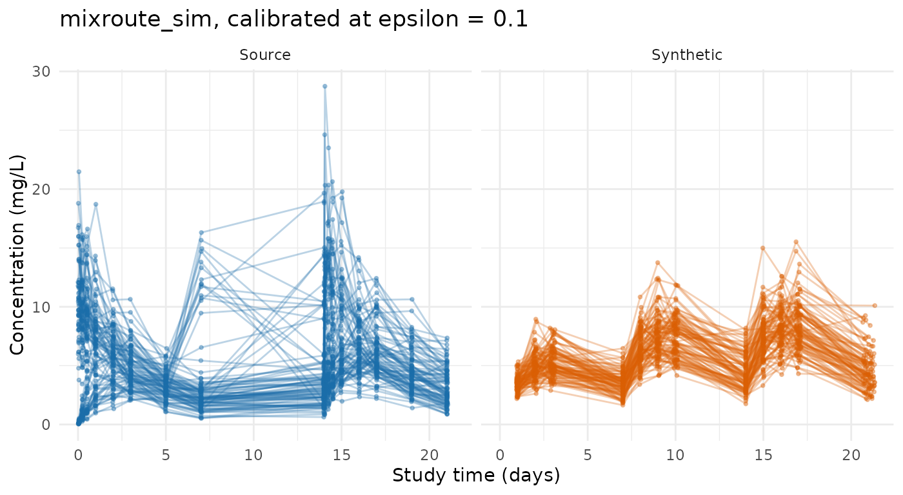

# Demo: Using synpmx_calibrated

One study through the calibrated path end to end: decide whether the
release is worth making, spend the budget once, read what was released,
and generate from it for free.

The study is `mixroute_sim`, a simulated 90-subject dataset shipped with
the package. It is public, so nothing here is a real disclosure — but it
is run through the genuine OpenDP backend rather than the no-noise
fixture, because the point of this document is what a real release looks
like.

**The numbers below change every time this page is built.** Privacy
noise is never user-seeded; a `seed` argument controls ordinary
generation only. Two runs of the same call give different releases, by
design.

## The acknowledgment

[`synpmx_calibrated()`](https://iamstein.github.io/synpmx/reference/synpmx_calibrated.md)
refuses to run until this has been called once in the session. It is a
deliberate speed bump, not a technical safeguard.

``` r

synpmx_enable_dp_engines()
#> DP engines enabled for this session: the differentially private engines are complete and tested, but not under active development, carry known open findings, and have not been independently privacy-audited. See https://iamstein.github.io/synpmx/articles/synpmx-privacy.html for the trust-boundary decision rule and what a production release additionally needs.
```

## Configuration

``` r

study <- as.data.frame(mixroute_sim)

study_roles <- pmx_roles(
  id = "ID", time = "TIME", nominal_time = "NTIME", dv = "DV", amt = "AMT",
  evid = "EVID", cmt = "CMT", cens = "CENS"
)
```

The model and the design are public inputs, and each records where it
came from. These are the same objects prior-only generation takes; what
calibration adds is a correction to the magnitude.

``` r

public_model <- pmx_structural_model(
  pk = "1cmt_oral", typical = c(cl = 2, v = 10, ka = 0.5),
  source = "the documented generating truth of the mixroute_sim fixture"
)
public_design <- pmx_trial_design(
  dose_levels = 100, cohort_sizes = 90, sampling = c(0, 1, 2, 3, 7),
  n_doses = 3, dose_interval = 7,
  source = "the fixture's protocol: 100 mg on days 0, 7 and 14"
)
priors <- pmx_priors(pk = pmx_prior(
  c(1 / 4, 4),
  source = "scaling literature: the prediction is believed good to four-fold"
))
```

The prior is the input worth pausing on. It says the model’s prediction
is believed accurate to about four-fold in either direction, which is a
claim anyone can make without knowing the clearance. It is also the
dominant sensitivity term: the noise is measured against its width.

## Is this release worth its budget?

Ask before spending.
[`pmx_preflight()`](https://iamstein.github.io/synpmx/reference/pmx_preflight.md)
reads no data and spends nothing.

``` r

pmx_preflight(priors, epsilon = 0.1, n_subjects = 90)
#> Pre-flight: d = 2, epsilon = 0.1, N = 90  ->  f = 0.222
#>  quantity prior_fold         f expected_fold_error
#>        pk         16 0.2222222            1.851749
#> 
#> Verdict: worthwhile
#> The release meaningfully narrows the prior.
```

At 90 subjects an epsilon of 0.1 is worth making. The same question at a
phase 1 cohort size gets a different answer:

``` r

pmx_preflight(priors, epsilon = 0.1, n_subjects = 12)
#> Pre-flight: d = 2, epsilon = 0.1, N = 12  ->  f = 1.667
#>  quantity prior_fold        f expected_fold_error
#>        pk         16 1.666667                   4
#> 
#> Verdict: worthless
#> The noise is as wide as the prior. This release would tell you nothing you did not already assume.
#> Use prior-mode generation instead, or raise epsilon only if governance allows.
```

That is not a marginal call — the function says the release would tell
you nothing you did not already assume, and recommends prior-only
generation instead. **Run this before choosing epsilon, not after.**

## Spend the budget, once

``` r

synthetic <- synpmx_calibrated(
  data = study, roles = study_roles, model = public_model,
  design = public_design, priors = priors,
  epsilon = 0.1, seed = 404, backend = "opendp"
)
```

A warning here is expected rather than exceptional, and this page shows
whichever one this build’s draw produced. At an epsilon of 0.1 the noise
is a third of the prior’s width, so a fair proportion of draws land
pressed against a prior boundary — and when one does, the function says
so, because the generated data then reflects the boundary rather than
the study. That is the mechanism working: the release is still valid,
and it is still nearly uninformative. The [public-data
evaluation](https://iamstein.github.io/synpmx/articles/calibrated-public-data-examples.html)
draws this release two hundred times and shows the whole distribution,
which is the honest way to read a single one.

## What was released

``` r

release <- attr(synthetic, "synpmx_release")
release
#> Calibrated structural model (v3)
#>   released subject count: 95.3
#>   pk correction: 0.989x
#>   corrected typical: cl=1.98, v=10, ka=0.5
#>   epsilon: 0.1  (formal DP: TRUE)
#>   f = 0.21 (worthwhile)
```

Two numbers left the study: a correction multiplying the assumed
clearance, and a noisy subject count. Everything else in the printed
object is a public input or an accounting entry.

``` r

release$privacy$accounting$entries
#>           query
#> 1 subject_count
#> 2 pk_correction
#>                                                                                         mechanism
#> 1 OpenDP Laplace measurement over finite f64 values (internally exact-rational/discrete sampling)
#> 2 OpenDP Laplace measurement over finite f64 values (internally exact-rational/discrete sampling)
#>   epsilon delta sensitivity dimensions
#> 1    0.05     0           1          1
#> 2    0.05     0           1          1
```

The correction is not an estimate of anything, and the noisy count is
not the study’s size — this study has exactly 90 subjects and the
released count will not say so. Compare the corrected clearance against
the 2 L/day that was assumed: whatever multiple this build drew, a
single release at this epsilon is one sample from a wide distribution,
not a measurement.

## The generated data

``` r

str(synthetic)
#> 'data.frame':    1520 obs. of  8 variables:
#>  $ ID   : int  1 1 1 1 1 1 1 1 1 1 ...
#>  $ TIME : num  0 0 1.04 1.98 2.9 ...
#>  $ NTIME: num  0 0 1 2 3 7 7 8 9 10 ...
#>  $ DV   : num  NA 0 2.62 4.18 3.61 ...
#>  $ AMT  : num  100 0 0 0 0 100 0 0 0 0 ...
#>  $ EVID : int  1 0 0 0 0 1 0 0 0 0 ...
#>  $ CMT  : int  1 2 2 2 2 1 2 2 2 2 ...
#>  $ CENS : int  0 0 0 0 0 0 0 0 0 0 ...
#>  - attr(*, "pmx_source")= chr "calibrated"
#>  - attr(*, "synpmx_release")=List of 16
#>   ..$ version              : int 3
#>   ..$ engine               : chr "calibrated_structural_generator"
#>   ..$ roles                :List of 18
#>   .. ..$ id            : chr "ID"
#>   .. ..$ time          : chr "TIME"
#>   .. ..$ nominal_time  : chr "NTIME"
#>   .. ..$ tad           : NULL
#>   .. ..$ occasion      : NULL
#>   .. ..$ dv            : chr "DV"
#>   .. ..$ amt           : chr "AMT"
#>   .. ..$ evid          : chr "EVID"
#>   .. ..$ cmt           : chr "CMT"
#>   .. ..$ mdv           : NULL
#>   .. ..$ rate          : NULL
#>   .. ..$ cens          : chr "CENS"
#>   .. ..$ limit         : NULL
#>   .. ..$ addl          : NULL
#>   .. ..$ ii            : NULL
#>   .. ..$ adm           : NULL
#>   .. ..$ assigned_dose : NULL
#>   .. ..$ dose_covariate: NULL
#>   .. ..- attr(*, "class")= chr "pmx_roles"
#>   ..$ model                :List of 8
#>   .. ..$ pk         : chr "1cmt_oral"
#>   .. ..$ pd         : chr "none"
#>   .. ..$ typical    : Named num [1:3] 2 10 0.5
#>   .. .. ..- attr(*, "names")= chr [1:3] "cl" "v" "ka"
#>   .. ..$ source     : chr "the documented generating truth of the mixroute_sim fixture"
#>   .. ..$ rx         : NULL
#>   .. ..$ iiv        : Named num [1:2] 0.3 0.2
#>   .. .. ..- attr(*, "names")= chr [1:2] "cl" "v"
#>   .. ..$ residual_cv: num 0.15
#>   .. ..$ endpoints  : chr "cp"
#>   .. ..- attr(*, "class")= chr "pmx_structural_model"
#>   ..$ design               :List of 10
#>   .. ..$ dose_levels  : num 100
#>   .. ..$ cohort_sizes : int 90
#>   .. ..$ escalation   : NULL
#>   .. ..$ sampling     :List of 3
#>   .. .. ..$ : num [1:5] 0 1 2 3 7
#>   .. .. ..$ : num [1:5] 0 1 2 3 7
#>   .. .. ..$ : num [1:5] 0 1 2 3 7
#>   .. ..$ n_doses      : int 3
#>   .. ..$ dose_interval: num 7
#>   .. ..$ dose_times   : NULL
#>   .. ..$ duration     : num 0
#>   .. ..$ visit_window : num 0.05
#>   .. ..$ source       : chr "the fixture's protocol: 100 mg on days 0, 7 and 14"
#>   .. ..- attr(*, "class")= chr "pmx_trial_design"
#>   ..$ priors               :List of 1
#>   .. ..$ pk:List of 3
#>   .. .. ..$ range : num [1:2] 0.25 4
#>   .. .. ..$ source: chr "scaling literature: the prediction is believed good to four-fold"
#>   .. .. ..$ span  : num 2.77
#>   .. .. ..- attr(*, "class")= chr "pmx_prior"
#>   .. ..- attr(*, "class")= chr "pmx_priors"
#>   ..$ covariates           : NULL
#>   ..$ covariate_summaries  : NULL
#>   ..$ corrections          :List of 1
#>   .. ..$ pk:List of 3
#>   .. .. ..$ factor           : num 0.989
#>   .. .. ..$ at_prior_boundary: logi FALSE
#>   .. .. ..$ prior            :List of 3
#>   .. .. .. ..$ range : num [1:2] 0.25 4
#>   .. .. .. ..$ source: chr "scaling literature: the prediction is believed good to four-fold"
#>   .. .. .. ..$ span  : num 2.77
#>   .. .. .. ..- attr(*, "class")= chr "pmx_prior"
#>   ..$ corrected_typical    : Named num [1:3] 1.98 10 0.5
#>   .. ..- attr(*, "names")= chr [1:3] "cl" "v" "ka"
#>   ..$ private_subject_count: num 95.3
#>   ..$ preflight            :List of 6
#>   .. ..$ d         : int 2
#>   .. ..$ epsilon   : num 0.1
#>   .. ..$ n_subjects: num 95.3
#>   .. ..$ f         : num 0.21
#>   .. ..$ verdict   : chr "worthwhile"
#>   .. ..$ table     :'data.frame':    1 obs. of  4 variables:
#>   .. .. ..$ quantity           : chr "pk"
#>   .. .. ..$ prior_fold         : num 16
#>   .. .. ..$ f                  : num 0.21
#>   .. .. ..$ expected_fold_error: num 1.79
#>   .. ..- attr(*, "class")= chr "pmx_preflight"
#>   ..$ privacy              :List of 9
#>   .. ..$ formal_dp         : logi TRUE
#>   .. ..$ covariates_private: logi TRUE
#>   .. ..$ unit              : chr "one subject's complete bounded longitudinal contribution"
#>   .. ..$ adjacency         : chr "add-or-remove one complete subject"
#>   .. ..$ epsilon           : num 0.1
#>   .. ..$ delta             : num 0
#>   .. ..$ backend           :List of 5
#>   .. .. ..$ name      : chr "OpenDP"
#>   .. .. ..$ version   : chr "0.15.1"
#>   .. .. ..$ mechanism : chr "OpenDP Laplace measurement over finite f64 values (internally exact-rational/discrete sampling)"
#>   .. .. ..$ validated : logi TRUE
#>   .. .. ..$ production: logi TRUE
#>   .. ..$ accounting        :List of 6
#>   .. .. ..$ composition     : chr "basic sequential composition of pure-DP Laplace releases"
#>   .. .. ..$ entries         :'data.frame':   2 obs. of  6 variables:
#>   .. .. .. ..$ query      : chr [1:2] "subject_count" "pk_correction"
#>   .. .. .. ..$ mechanism  : chr [1:2] "OpenDP Laplace measurement over finite f64 values (internally exact-rational/discrete sampling)" "OpenDP Laplace measurement over finite f64 values (internally exact-rational/discrete sampling)"
#>   .. .. .. ..$ epsilon    : num [1:2] 0.05 0.05
#>   .. .. .. ..$ delta      : num [1:2] 0 0
#>   .. .. .. ..$ sensitivity: num [1:2] 1 1
#>   .. .. .. ..$ dimensions : int [1:2] 1 1
#>   .. .. ..$ realized_epsilon: num 0.1
#>   .. .. ..$ realized_delta  : num 0
#>   .. .. ..$ unspent_epsilon : num 0
#>   .. .. ..$ unspent_delta   : num 0
#>   .. ..$ proof_assumptions : chr [1:6] "The structural model, its typical parameters, the trial design, and every prior range were established independ"| __truncated__ "Each subject's correction is computed only from that subject's own rows, so clipping to the public prior bounds"| __truncated__ "OpenDP's Laplace measurement and privacy map are correct for the stated sensitivities." "Basic sequential composition covers every released source-dependent computation in this fit." ...
#>   ..$ provenance           :'data.frame':    3 obs. of  2 variables:
#>   .. ..$ input : chr [1:3] "structural model" "trial design" "pk prior"
#>   .. ..$ source: chr [1:3] "the documented generating truth of the mixroute_sim fixture" "the fixture's protocol: 100 mg on days 0, 7 and 14" "scaling literature: the prediction is believed good to four-fold"
#>   ..$ ledger               :List of 5
#>   .. ..$ release_id       : chr "pmx-20260912T215823.531593-21000"
#>   .. ..$ created_utc      : chr "2026-09-12T21:58:23.531869Z"
#>   .. ..$ requested_epsilon: num 0.1
#>   .. ..$ realized_epsilon : num 0.1
#>   .. ..$ backend          : chr "OpenDP"
#>   ..$ warnings             : chr(0) 
#>   ..- attr(*, "class")= chr "pmx_calibrated_model"
```

The table wears the columns `study_roles` declared, so it drops into
code written against the source study without renaming anything.

``` r

observed <- function(data, label) {
  keep <- data$EVID == 0
  value <- suppressWarnings(as.numeric(data$DV[keep]))
  out <- data.frame(set = label, subject = paste(label, data$ID[keep]),
                    time = as.numeric(data$TIME[keep]), dv = value)
  out[is.finite(out$dv) & out$dv > 0, ]
}
frame <- rbind(observed(study, "Source"), observed(synthetic, "Synthetic"))
ggplot2::ggplot(frame, ggplot2::aes(time, dv, group = subject, colour = set)) +
  ggplot2::geom_line(alpha = 0.3) +
  ggplot2::geom_point(alpha = 0.35, size = 0.7) +
  ggplot2::facet_wrap(~ set) +
  ggplot2::scale_colour_manual(
    values = c(Source = "#1B6CA8", Synthetic = "#D95F02"), guide = "none") +
  ggplot2::labs(x = "Study time (days)", y = "Concentration (mg/L)",
                title = "mixroute_sim, calibrated at epsilon = 0.1") +
  ggplot2::theme_minimal()
```



## Further datasets are free

Generation from an existing release is post-processing. It reads no
confidential data and spends nothing, so any number of datasets can be
drawn from the one payment.

``` r

another <- synpmx_generate(synthetic, seed = 405)
identical(names(another), names(synthetic))
#> [1] TRUE
```

Draw them this way rather than by calling
[`synpmx_calibrated()`](https://iamstein.github.io/synpmx/reference/synpmx_calibrated.md)
again. A second fit spends the budget a second time, and the function
warns when it notices one:

``` r

second_fit <- tryCatch(
  synpmx_calibrated(
    data = study, roles = study_roles, model = public_model,
    design = public_design, priors = priors,
    epsilon = 0.1, seed = 406, backend = "opendp"
  ),
  warning = function(w) conditionMessage(w)
)
cat(if (is.character(second_fit)) second_fit else "no warning", "\n")
#> This looks like the 2nd budget-spending fit against the same data at epsilon = 0.1 in this session, so roughly 0.2 has now been spent in total.
#> Drawing more datasets from one release costs nothing: use `synpmx_generate(syn, seed = ...)`, or ask for several at once with `n_datasets =`.
```

## What this run does and does not support

The event structure, the schedule, the occasions and the censoring flag
are correct because the design said so. The concentration *level* has
been pulled toward the study by one released number. Everything else —
the curve shape, the between-subject spread, the residual error — is the
public model’s assertion, uncorrected and uncosted.

So the output supports developing code against a dataset shaped like
this study, with a formal guarantee attached to the one quantity that
was measured. It does not support estimating a parameter, comparing
arms, or concluding anything about the compound.

## Where to go next

- [`vignette("calibrated-algorithm")`](https://iamstein.github.io/synpmx/articles/calibrated-algorithm.md)
  — every step, what each one spends, and where the sensitivity bound
  comes from.
- [Evaluating calibration on public
  data](https://iamstein.github.io/synpmx/articles/calibrated-public-data-examples.html)
  — what this epsilon produces across repeated draws, and the cohort
  size below which it produces noise.
- [Feasibility by cohort
  size](https://iamstein.github.io/synpmx/articles/feasibility.html) —
  where `f` comes from.
- [What differential privacy does and does not
  guarantee](https://iamstein.github.io/synpmx/articles/synpmx-privacy.html)
  — the trust-boundary decision rule, and what a production release
  needs.
