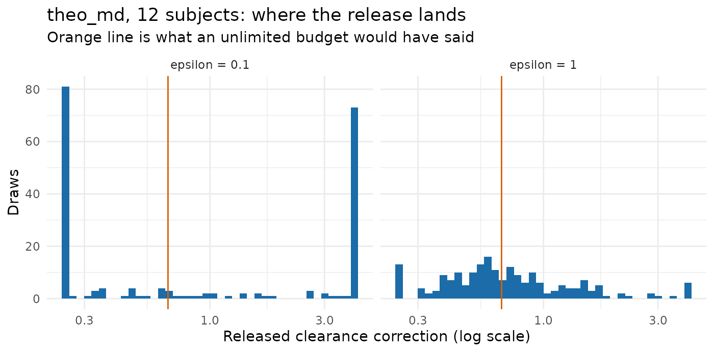

# Evaluating calibration on public data

This article asks one question: at a privacy budget somebody could
actually defend, what does a calibrated release produce on a study the
size pharmacometrics actually runs?

The short answer is that on a phase 1 cohort it produces noise, and the
package says so before you spend anything. The longer answer is worse
than that, and is the reason this article exists: a release that conveys
nothing is not the same as no release. It moves the generated level to a
prior boundary, and a boundary is further from the study than the
prior’s centre would have been.

**Everything here uses the real OpenDP backend.** `backend = "public"`
adds no noise at all, so it can demonstrate the correction mechanism and
nothing about epsilon. The studies are public, so no confidential data
is at risk; the noise is genuine.

**And the noise is never user-seeded**, so single draws differ between
builds of this page. Every claim below is therefore made over 200 draws
rather than one, and computed here rather than written into the prose.

``` r

data("theo_md", package = "nlmixr2data")
theo_md <- as.data.frame(theo_md)
mixroute <- as.data.frame(mixroute_sim)
priors <- pmx_priors(pk = pmx_prior(
  c(1 / 4, 4),
  source = "scaling literature: the prediction is good to about four-fold"
))
```

## Ask before spending

[`pmx_preflight()`](https://iamstein.github.io/synpmx/reference/pmx_preflight.md)
reads no data and costs nothing. It reports

    f = d / (epsilon * N)

the fraction of the prior’s width that survives as noise, where `d` is
the number of quantities released — two here, a correction and a subject
count.

``` r

grid <- expand.grid(n_subjects = c(12, 30, 60, 90, 180, 500),
                    epsilon = c(0.1, 0.5, 1))
grid <- do.call(rbind, lapply(seq_len(nrow(grid)), function(i) {
  pf <- pmx_preflight(priors, epsilon = grid$epsilon[i],
                      n_subjects = grid$n_subjects[i])
  data.frame(N = grid$n_subjects[i], epsilon = grid$epsilon[i],
             f = round(pf$f, 3),
             expected_fold_error = pf$table$expected_fold_error[1],
             verdict = pf$verdict)
}))
knitr::kable(grid[order(grid$epsilon, grid$N), ], row.names = FALSE,
             caption = "What a budget buys, before any of it is spent")
```

|   N | epsilon |     f | expected_fold_error | verdict                    |
|----:|--------:|------:|--------------------:|:---------------------------|
|  12 |     0.1 | 1.667 |            4.000000 | worthless                  |
|  30 |     0.1 | 0.667 |            4.000000 | marginal                   |
|  60 |     0.1 | 0.333 |            2.519842 | worthwhile                 |
|  90 |     0.1 | 0.222 |            1.851749 | worthwhile                 |
| 180 |     0.1 | 0.111 |            1.360790 | worthwhile                 |
| 500 |     0.1 | 0.040 |            1.117287 | consider a smaller epsilon |
|  12 |     0.5 | 0.333 |            2.519842 | worthwhile                 |
|  30 |     0.5 | 0.133 |            1.447269 | worthwhile                 |
|  60 |     0.5 | 0.067 |            1.203025 | consider a smaller epsilon |
|  90 |     0.5 | 0.044 |            1.131140 | consider a smaller epsilon |
| 180 |     0.5 | 0.022 |            1.063551 | consider a smaller epsilon |
| 500 |     0.5 | 0.008 |            1.022428 | consider a smaller epsilon |
|  12 |     1.0 | 0.167 |            1.587401 | worthwhile                 |
|  30 |     1.0 | 0.067 |            1.203025 | consider a smaller epsilon |
|  60 |     1.0 | 0.033 |            1.096825 | consider a smaller epsilon |
|  90 |     1.0 | 0.022 |            1.063551 | consider a smaller epsilon |
| 180 |     1.0 | 0.011 |            1.031286 | consider a smaller epsilon |
| 500 |     1.0 | 0.004 |            1.011152 | consider a smaller epsilon |

What a budget buys, before any of it is spent {.table}

Read the `epsilon = 0.1` block first. It is worthless at 12 subjects,
marginal at 30, and worth making from about 60 up. That is the whole
feasibility story for this mode, and it is available without touching
the data.

The two studies below sit on either side of that line: `theo_md` has 12
subjects and `mixroute_sim` has 90.

## theo_md at 12 subjects: what a worthless verdict looks like

``` r

theo_roles <- pmx_roles(id = "ID", time = "TIME", dv = "DV", amt = "AMT",
                        evid = "EVID", cmt = "CMT")
theo_model <- pmx_structural_model(
  pk = "1cmt_oral", typical = c(cl = 6, v = 35, ka = 1.5),
  source = "illustrative allometric scaling; never fitted to theo_md"
)
rich <- c(0, 0.25, 0.5, 1, 2, 4, 7, 9, 12, 24)
theo_design <- pmx_trial_design(
  dose_levels = 320, cohort_sizes = 12,
  sampling = list(rich, 0, NULL, NULL, NULL, NULL, rich),
  n_doses = 7, dose_interval = 24,
  source = "illustrative protocol: 320 mg daily, sampled on days 1 and 7"
)
pmx_preflight(priors, epsilon = 0.1, n_subjects = 12)
#> Pre-flight: d = 2, epsilon = 0.1, N = 12  ->  f = 1.667
#>  quantity prior_fold        f expected_fold_error
#>        pk         16 1.666667                   4
#> 
#> Verdict: worthless
#> The noise is as wide as the prior. This release would tell you nothing you did not already assume.
#> Use prior-mode generation instead, or raise epsilon only if governance allows.
```

The helper below draws one release and reports what left the study and
what the generated level came out at. It suppresses warnings because at
this epsilon nearly every draw emits one, and the warnings are the
finding rather than a problem.

``` r

median_dv <- function(data) {
  value <- suppressWarnings(as.numeric(data$DV[data$EVID == 0]))
  stats::median(value[is.finite(value) & value > 0])
}

draw_release <- function(data, roles, model, design, epsilon, seed) {
  synthetic <- suppressWarnings(synpmx_calibrated(
    data = data, roles = roles, model = model, design = design,
    priors = priors, epsilon = epsilon, seed = seed, backend = "opendp"
  ))
  release <- attr(synthetic, "synpmx_release")
  data.frame(
    correction = release$corrections$pk$factor,
    at_boundary = isTRUE(release$corrections$pk$at_prior_boundary),
    released_n = release$private_subject_count,
    median_dv = median_dv(synthetic)
  )
}

draws <- function(data, roles, model, design, epsilon, n = DRAWS) {
  do.call(rbind, lapply(seq_len(n), function(i) {
    draw_release(data, roles, model, design, epsilon, seed = i)
  }))
}
```

``` r

theo_01 <- draws(theo_md, theo_roles, theo_model, theo_design, 0.1)

# What an unlimited budget would have said, for reference: the same fit with
# the no-noise backend. This is not a release, it is the target.
theo_noiseless <- attr(suppressWarnings(synpmx_calibrated(
  data = theo_md, roles = theo_roles, model = theo_model,
  design = theo_design, priors = priors, epsilon = 1, seed = 1,
  backend = "public", public_source = TRUE
)), "synpmx_release")$corrections$pk$factor

round(c(noiseless_correction = theo_noiseless,
        median = stats::median(theo_01$correction),
        q25 = stats::quantile(theo_01$correction, 0.25, names = FALSE),
        q75 = stats::quantile(theo_01$correction, 0.75, names = FALSE)), 3)
#> noiseless_correction               median                  q25 
#>                0.669                0.639                0.250 
#>                  q75 
#>                4.000
mean(theo_01$at_boundary)
#> [1] 0.77
```

The interquartile range is the whole prior. Not the tails — the middle
half of releases runs from one end of the assumed range to the other,
because most of them are clipped to an end. The proportion pinned at a
boundary is the second number above, and the package warns on every one
of those draws.

The released subject count behaves the same way. The study has twelve
subjects:

``` r

round(stats::quantile(theo_01$released_n, c(0.05, 0.5, 0.95), names = TRUE), 1)
#>   5%  50%  95% 
#>  1.0 11.3 54.8
```

### A worthless release is worse than no release

Prior-only generation is the thing calibration has to beat: the same
public model, no budget spent, `epsilon = 0`. So compare them on the
same footing, as the typical factor by which the generated level misses
the study’s.

``` r

source_level <- median_dv(theo_md)
prior_only <- vapply(1:40, function(i) {
  median_dv(synpmx_prior(theo_model, theo_design, theo_roles,
                         n_subjects = 12, seed = i))
}, numeric(1))
theo_1 <- draws(theo_md, theo_roles, theo_model, theo_design, 1)

typical_fold <- function(level) exp(mean(abs(log(level / source_level))))
comparison <- data.frame(
  mode = c("prior only (epsilon = 0)", "calibrated, epsilon = 0.1",
           "calibrated, epsilon = 1"),
  median_level = round(c(stats::median(prior_only),
                         stats::median(theo_01$median_dv),
                         stats::median(theo_1$median_dv)), 2),
  typical_fold_error = round(c(typical_fold(prior_only),
                               typical_fold(theo_01$median_dv),
                               typical_fold(theo_1$median_dv)), 2)
)
knitr::kable(comparison, row.names = FALSE,
             caption = sprintf("theo_md, source median %.2f mg/L",
                               source_level))
```

| mode                      | median_level | typical_fold_error |
|:--------------------------|-------------:|-------------------:|
| prior only (epsilon = 0)  |         3.28 |               1.81 |
| calibrated, epsilon = 0.1 |         4.41 |               2.58 |
| calibrated, epsilon = 1   |         4.30 |               1.55 |

theo_md, source median 5.89 mg/L {.table}

At this cohort size **spending 0.1 leaves the output further from the
study, on average, than spending nothing**. The mechanism is the
boundary clipping: prior-only generation sits wherever the assumed
clearance puts it, while a censored release multiplies that by whichever
end of the prior the noise fell against.

``` r

mean(abs(log(theo_01$median_dv / source_level)) >
       abs(log(stats::median(prior_only) / source_level)))
#> [1] 0.455
```

That fraction of draws is worse than not having asked.

Note the trap in the middle column. The *median* level at
`epsilon = 0.1` looks closer to the study than prior-only generation
does, while its typical error is larger. Draws pile up at both ends of
the prior and their median lands between them, near the study by
coincidence. A summary that reported only the median would recommend
exactly the wrong thing.

``` r

frame <- rbind(
  data.frame(mode = "epsilon = 0.1", correction = theo_01$correction),
  data.frame(mode = "epsilon = 1", correction = theo_1$correction)
)
ggplot2::ggplot(frame, ggplot2::aes(correction)) +
  ggplot2::geom_histogram(bins = 40, fill = "#1B6CA8") +
  ggplot2::geom_vline(xintercept = theo_noiseless, colour = "#D95F02") +
  ggplot2::facet_wrap(~ mode) +
  ggplot2::scale_x_log10() +
  ggplot2::labs(
    x = "Released clearance correction (log scale)", y = "Draws",
    title = "theo_md, 12 subjects: where the release lands",
    subtitle = "Orange line is what an unlimited budget would have said"
  ) +
  ggplot2::theme_minimal()
```



## mixroute_sim at 90 subjects: where the budget starts working

Same epsilon, same prior, seven and a half times the cohort. This
study’s generating model is documented, so the public input is the truth
rather than a guess and nothing here is confounded by a bad prior.

``` r

mixroute_roles <- pmx_roles(
  id = "ID", time = "TIME", nominal_time = "NTIME", dv = "DV", amt = "AMT",
  evid = "EVID", cmt = "CMT", cens = "CENS"
)
mixroute_model <- pmx_structural_model(
  pk = "1cmt_oral", typical = c(cl = 2, v = 10, ka = 0.5),
  source = "the documented generating truth of the mixroute_sim fixture"
)
mixroute_design <- pmx_trial_design(
  dose_levels = 100, cohort_sizes = 90, sampling = c(0, 1, 2, 3, 7),
  n_doses = 3, dose_interval = 7,
  source = "the fixture's protocol: 100 mg on days 0, 7 and 14"
)
pmx_preflight(priors, epsilon = 0.1, n_subjects = 90)
#> Pre-flight: d = 2, epsilon = 0.1, N = 90  ->  f = 0.222
#>  quantity prior_fold         f expected_fold_error
#>        pk         16 0.2222222            1.851749
#> 
#> Verdict: worthwhile
#> The release meaningfully narrows the prior.
```

``` r

mixroute_01 <- draws(mixroute, mixroute_roles, mixroute_model,
                     mixroute_design, 0.1)
mixroute_noiseless <- attr(suppressWarnings(synpmx_calibrated(
  data = mixroute, roles = mixroute_roles, model = mixroute_model,
  design = mixroute_design, priors = priors, epsilon = 1, seed = 1,
  backend = "public", public_source = TRUE
)), "synpmx_release")$corrections$pk$factor

round(c(noiseless_correction = mixroute_noiseless,
        median = stats::median(mixroute_01$correction),
        q25 = stats::quantile(mixroute_01$correction, 0.25, names = FALSE),
        q75 = stats::quantile(mixroute_01$correction, 0.75, names = FALSE)), 3)
#> noiseless_correction               median                  q25 
#>                1.166                1.076                0.647 
#>                  q75 
#>                1.740
mean(mixroute_01$at_boundary)
#> [1] 0.175
```

The median release is close to the noiseless one and the interquartile
range is a real interval rather than the prior’s two ends. Most draws
are not censored. The release is doing something.

It is still not a measurement. The tails reach the prior boundary, so a
single release at this epsilon can be several-fold off, and there is no
way to tell from the release itself which kind of draw you have.

``` r

round(stats::quantile(mixroute_01$released_n, c(0.05, 0.5, 0.95)), 1)
#>    5%   50%   95% 
#>  54.1  88.9 136.7
```

Ninety subjects, released as a range that wide. Anything downstream that
reads the cohort size — a power calculation, a per-arm summary — is
reading noise.

## Does the preflight predict what the draws do?

The point of
[`pmx_preflight()`](https://iamstein.github.io/synpmx/reference/pmx_preflight.md)
is to answer the feasibility question without spending. Whether it can
be trusted is checkable: compare its expected fold-error against the
realized error of the draws above.

``` r

realized <- function(drawn, noiseless) {
  stats::median(exp(abs(log(drawn$correction / noiseless))))
}
check <- data.frame(
  study = c("theo_md", "mixroute_sim"),
  N = c(12, 90),
  predicted = round(
    c(pmx_preflight(priors, 0.1, 12)$table$expected_fold_error[1],
      pmx_preflight(priors, 0.1, 90)$table$expected_fold_error[1]), 2),
  realized = round(c(realized(theo_01, theo_noiseless),
                     realized(mixroute_01, mixroute_noiseless)), 2)
)
knitr::kable(check, row.names = FALSE,
             caption = "Expected against realized fold-error, epsilon = 0.1")
```

| study        |   N | predicted | realized |
|:-------------|----:|----------:|---------:|
| theo_md      |  12 |      4.00 |     2.68 |
| mixroute_sim |  90 |      1.85 |     1.75 |

Expected against realized fold-error, epsilon = 0.1 {.table}

It predicts the right size on both studies and errs on the pessimistic
side, which is what its documentation claims for `f` above roughly 0.25.
So the feasibility question can be answered from `d`, epsilon and the
cohort size alone, before any budget is committed and without the data.

## Where to go next

- [`vignette("calibrated-demo")`](https://iamstein.github.io/synpmx/articles/calibrated-demo.md)
  — one study end to end, with the preflight before the spend.
- [`vignette("calibrated-algorithm")`](https://iamstein.github.io/synpmx/articles/calibrated-algorithm.md)
  — every step, what each one spends, and where the sensitivity bound
  comes from.
- [Feasibility by cohort
  size](https://iamstein.github.io/synpmx/articles/feasibility.html) —
  where `f` comes from and how it behaves.
- [Evaluating prior-only generation on public
  data](https://iamstein.github.io/synpmx/articles/prior-public-data-examples.html)
  — the other mode that reads nothing or nearly nothing, measured the
  same way.
- [What differential privacy does and does not
  guarantee](https://iamstein.github.io/synpmx/articles/synpmx-privacy.html)
  — the trust-boundary decision rule, and what a production release
  needs.
