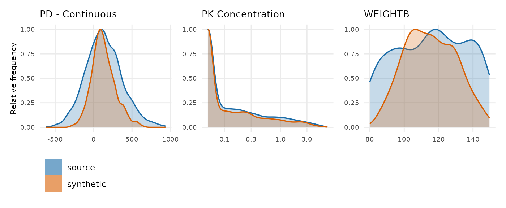

# Demo: Using synpmx_avatar

Generate a synthetic dataset, look at it, and read the checks of the
data, sumamrized in a scorecard.

[`vignette("scorecard-synthetic-data-checks")`](https://iamstein.github.io/synpmx/articles/scorecard-synthetic-data-checks.md)
is the reference for better understanding the synthetic data checks.

The dataset is
[`xgxr::case1_pkpd`](https://rdrr.io/pkg/xgxr/man/case1_pkpd.html): 180
patients, six arms from placebo to 300 mg, with a pharmacokinetic (PK)
concentration endpoint and a continuous pharmacodynamic (PD) endpoint.

## Configuration

To run this on your own study, edit the two chunks below that:

1.  Read in the dataset.
2.  Define the column roles.

The rest of the code can be kept as is.

``` r

library(dplyr)
raw <- as.data.frame(get(utils::data(list = "case1_pkpd", package = "xgxr"))) |>
  mutate(CENS = ifelse(NAME == "PD - Continuous", 0, CENS))
SEED <- 808
```

The column meanings. Columns not specified here are dropped from the
synthetic dataset.

``` r

roles <- pmx_roles(
  id           = "ID",
  time         = "TIME",
  dv           = "LIDV",
  cens         = "CENS",
  amt          = "AMT",
  evid         = "EVID",
  cmt          = "CMT",
  dvid         = "NAME",        # which endpoint each observation row is
  nominal_time = "NOMTIME",     # the protocol grid
  strata       = c("TRTACT", "DOSE"), #treatment arms.
  covariates   = "WEIGHTB",     # blended like everything else
  keep         = "STUDY"        # carried through verbatim
)
```

## Generate Synthetic Data

``` r

synthetic <- synpmx_avatar(raw, roles, seed = SEED)
#> Warning: Synthetic generation used documented small-group/profile fallbacks:
#> - Endpoint `PD - Continuous` has generated observations at times no donor
#>   was measured at; the cohort's median trajectory was used for those rows.
#>   Expected wherever subjects were sampled on different schedules.
#> - Endpoint `PK Concentration` has generated observations at times no donor
#>   was measured at; the cohort's median trajectory was used for those rows.
#>   Expected wherever subjects were sampled on different schedules.
```

## Plot synthetic data and original data

``` r

library(ggplot2)
library(xgxr)
xgx_theme_set()
comparison_colours <- c(source = "#1B6CA8", synthetic = "#D95F02")


both <- rbind(
  cbind(raw[, names(synthetic)], DATA = "source"),
  cbind(synthetic, DATA = "synthetic")
)
obs <- both[both$EVID == 0 & !is.na(both$LIDV), ]
obs$TRTACT <- factor(obs$TRTACT,
                     levels = c("Placebo", "3 mg", "10 mg", "30 mg",
                                "100 mg", "300 mg"))
```

``` r

ggplot(obs[obs$NAME == "PK Concentration" & obs$TIME <= 24, ],
       aes(TIME, LIDV, group = ID, colour = DATA)) +
  geom_line(alpha = 0.4) +
  facet_grid(DATA~TRTACT) +
  xgx_scale_y_log10() +
  xgx_scale_x_time_units("hours", breaks = seq(0, 24, by = 6)) +
  scale_colour_manual(values = comparison_colours) +
  labs(x = "Time (hours)", y = "PK concentration", colour = NULL) +
  theme(legend.position = "top") + 
  ggtitle("Day 1 Conc. Profile")
```


``` r

ggplot(obs[obs$NAME == "PD - Continuous", ],
       aes(TIME, LIDV, group = ID, colour = DATA)) +
  geom_line(alpha = 0.35) +
  xgx_scale_x_time_units(units_dataset = "hours", units_plot = "weeks") +
  facet_grid(DATA~TRTACT) +
  scale_colour_manual(values = comparison_colours) +
  labs(x = "Time (hours)", y = "PD (continuous)", colour = NULL) +
  theme(legend.position = "top") +
  ggtitle("PD Response")
```


## Distributions of Synthetic and Original Data

One panel per endpoint and per baseline covariate, source against
synthetic.
[`compare_pmx_distributions_height()`](https://iamstein.github.io/synpmx/reference/compare_pmx_distributions_height.md)
sizes the figure, since it grows a row of panels at a time;
`output = "tables"` gives the numbers behind it.

``` r

compare_pmx_distributions(raw, synthetic, roles)
```



The curves sit on top of each other on both endpoints. Look at their
widths rather than their positions: the orange curve is visibly narrower
than the blue one for the PD endpoint and for baseline weight, and
slightly narrower for PK. That narrowing is between-subject variability
shrinking, which is what the AVATAR blending algorithm does rather than
a fault in the run. `output = "tables"` puts a number on it, and the
scorecard’s D1 row reports the variable that moved furthest.

## The scorecard

The scorecard computes checks of the synthetic dataset. It is described
further in
[`vignette("scorecard-synthetic-data-checks")`](https://iamstein.github.io/synpmx/articles/scorecard-synthetic-data-checks.md).

``` r

scorecard <- synpmx_scorecard(raw, synthetic, roles)
synpmx_scorecard_datatable(scorecard)
```

*D1 reports numbers, not shapes. Plot source and synthetic on the same
axes -- DV against time, and each covariate -- with whatever you
normally use.*

**`review` is not a soft `pass`.** Five rows here have no pass mark
because no threshold would be honest. Doses per patient is the clearest:
on this study it is unchanged, but on a study with individualised dosing
it can halve.

**Every row names the call that explains it.** When a row reads oddly,
run what its `explore` column says: the numbers are a summary, and the
call behind each one is where the answer is.

## Where to go next

- [`vignette("scorecard-synthetic-data-checks")`](https://iamstein.github.io/synpmx/articles/scorecard-synthetic-data-checks.md)
  — every check, what it asks, and what passing means.
- [`vignette("public-data-examples")`](https://iamstein.github.io/synpmx/articles/public-data-examples.md) -
  AVATAR algorithm applied to 8 public datasets.
