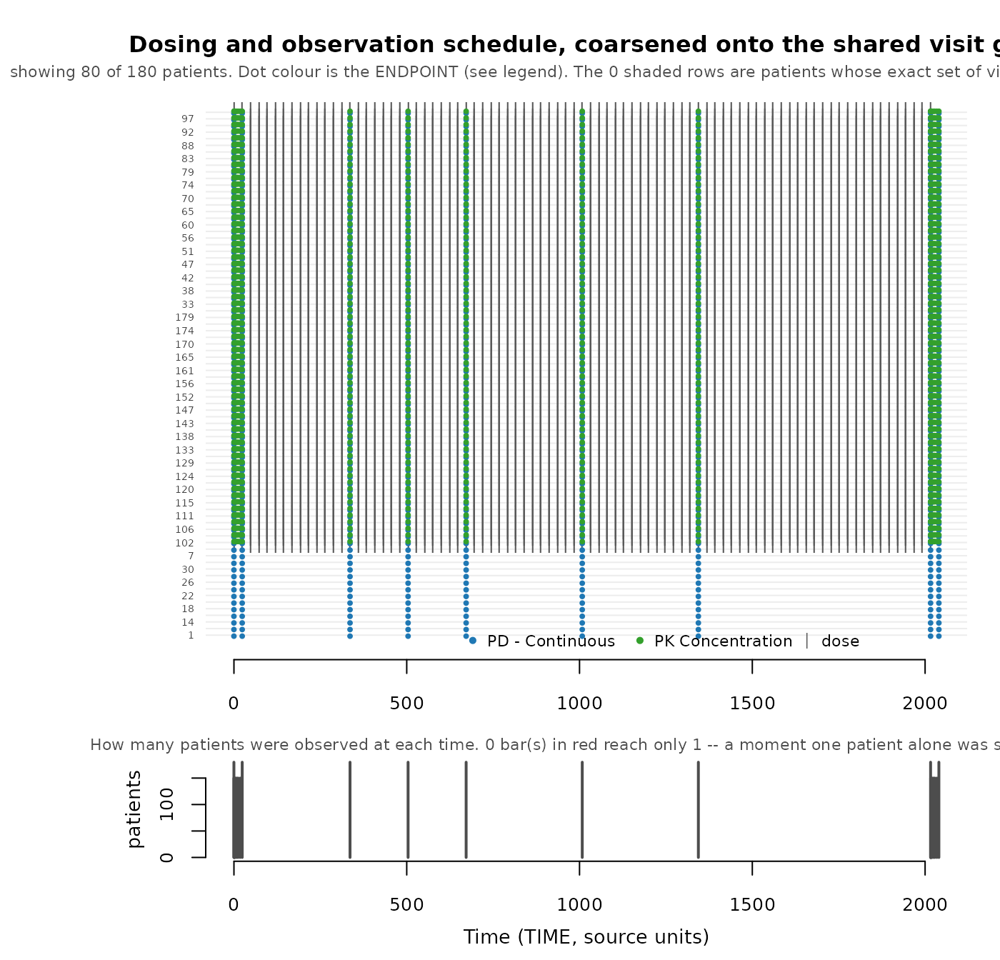
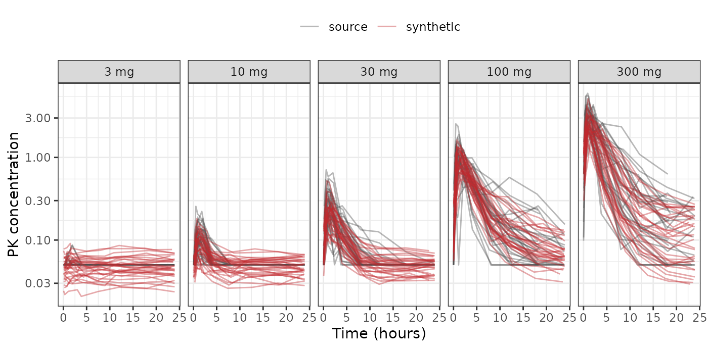
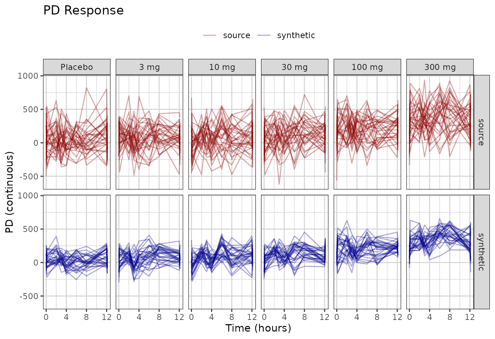

# Demo: one dataset, end to end

One pharmacometric (PMX) dataset taken from raw event table to synthetic
event table, in the order you would actually do it. Every number below
is produced by the run; nothing is quoted from a previous one.

The dataset is
[`xgxr::case1_pkpd`](https://rdrr.io/pkg/xgxr/man/case1_pkpd.html): 180
patients, six arms from placebo to 300 mg, with both a pharmacokinetic
(PK) concentration endpoint and a continuous pharmacodynamic (PD)
endpoint. It is a good demonstration case because its recorded sample
times are *all* distinct — every patient’s observation schedule is
unique before anything is done to it — which is the condition the
visit-grid machinery exists for.

To run this on your own study, edit the two chunks under
**Configuration** and leave the rest alone. Every check made along the
way is collected into a **scorecard** at the end, with the answer that
counts as passing for each. Companion reading:
[`vignette("synpmx-4-methods")`](https://iamstein.github.io/synpmx/articles/synpmx-4-methods.md)
for why AVATAR blending is the default method,
[`vignette("avatar-algorithm")`](https://iamstein.github.io/synpmx/articles/avatar-algorithm.md)
for what each step does internally, and
[`vignette("synthetic-data-checks")`](https://iamstein.github.io/synpmx/articles/synthetic-data-checks.md)
for the full list of questions to ask of any synthetic dataset.

## Configuration

The data, and one look at it before touching anything.

``` r

raw <- as.data.frame(
  get(utils::data(list = "case1_pkpd", package = "xgxr"))
)
SEED <- 808

table(raw$NAME, raw$TRTACT)
#>                   
#>                    10 mg 100 mg 3 mg 30 mg 300 mg Placebo
#>   Dosing            2550   2550 2550  2550   2550    2550
#>   PD - Continuous    270    270  270   270    270     270
#>   PK Concentration   780    780  780   780    780       0
```

The column meanings. This is the whole configuration: AVATAR blending
needs no structural model, no priors, and no design — only which column
plays which role. Columns not named here are dropped, which the run says
out loud.

``` r

roles <- pmx_roles(
  id           = "ID",
  time         = "TIME",
  dv           = "LIDV",
  amt          = "AMT",
  evid         = "EVID",
  cmt          = "CMT",
  dvid         = "NAME",        # which endpoint each observation row is
  nominal_time = "NOMTIME",     # the protocol grid; see below for why it matters
  strata       = c("TRTACT", "DOSE"),
  covariates   = "WEIGHTB",     # baseline covariates, blended like everything else
  keep         = "STUDY"        # carried through verbatim
)
```

Two role choices are worth pausing on, because they are the ones that
change the result rather than describe the data.

- **`nominal_time`** is the declared protocol grid. Left out, the run
  infers a grid and reports it as inferred. Here the study has a real
  one, so declare it.
- **`strata`** are the treatment arms. Declaring them keeps the arm
  balance and stops a 3 mg patient being blended with a 300 mg patient,
  but it also splits the donor pool six ways. On a small cohort that
  trade can go the other way; the run report is how you tell.

`CENS` is deliberately *not* declared as `cens`. The column exists, but
it is all zeros with no censored records, and
[`validate_pmx()`](https://iamstein.github.io/synpmx/reference/validate_pmx.md)
refuses a censoring column that never fires — see
[`vignette("synthetic-data-checks")`](https://iamstein.github.io/synpmx/articles/synthetic-data-checks.md).

## Does the source validate?

Structure first. A dataset that fails here will fail confusingly later.

``` r

report <- validate_pmx(raw, roles, strict = FALSE)
stopifnot(report$valid)
report$valid
#> [1] TRUE
```

## How identifying is the visit schedule?

Run this *before* generating. Every column answers one question — **how
many patients share this property with me, me included** — so `1` means
nobody else.

Scored as recorded:

``` r

skeleton_uniqueness(raw, roles)
```

**Schedule-uniqueness screen.** Scored on the recorded times AS GIVEN,
before any coarsening.
[`synpmx_avatar()`](https://iamstein.github.io/synpmx/reference/synpmx_avatar.md)
coarsens first by default, so run this again with `coarsen_time = TRUE`
to see what the grid removes.

180 of 180 patients (100%) have an observation schedule nobody else has:
180 from a one-off observation time, 0 from which visits they attended.
Declaring `nominal_time` addresses the first group; nothing addresses
the second.

Those 180 are not necessarily far apart. The typical one differs from
its nearest neighbour by 42 of about 33 visit slots (range 18 to 42),
where a slot is one endpoint measured at one time. A difference of one
or two is a missed sample, not a different schedule – which is why the
count alone is a poor guide.

This is a property of the SOURCE, and nothing in generation can lower
it. What generation controls is whether an avatar ends up wearing one of
these schedules – that is
[`pmx_masking_report()`](https://iamstein.github.io/synpmx/reference/pmx_masking_report.md)’s
“avatars keeping their anchor’s own visit set”, which should be near 0%
however high the count above is.

| Patients whose … | n | % of cohort | Meaning |
|:---|---:|---:|:---|
| Observation schedule nobody else has | 180 | 100 | the headline: an avatar anchored here wears one real patient’s schedule |
| … a one-off observation time | 180 | 100 | sampled when nobody else was. A time grid can absorb this: declare `nominal_time` |
| … the set of visits attended | 0 | 0 | every time is shared. A missed visit, a discontinuation, or follow-up that has not reached the later visits. No grid touches this |
| Observation count nobody else has | 0 | 0 | survives any grid; the residual [`flag_identifiable_subjects()`](https://iamstein.github.io/synpmx/reference/flag_identifiable_subjects.md) looks at |
| Dosing nobody else has | 6 | 3 | dose amounts and gaps. Weight-based dosing makes this near-universal |

**How crowded is each schedule** (1 = nobody else has it):

| Patients sharing that schedule | Patients | % of cohort |
|-------------------------------:|---------:|------------:|
|                              1 |      180 |         100 |

**Which endpoint is doing it.** A schedule is only as shared as

its least shared part.

| endpoint         | patients | distinct visit sets | patients alone on theirs |
|:-----------------|---------:|--------------------:|-------------------------:|
| PD - Continuous  |      180 |                 180 |                      180 |
| PK Concentration |      150 |                 150 |                      150 |

*One row per patient is in the returned data frame;
[`plot_pmx_schedule()`](https://iamstein.github.io/synpmx/reference/plot_pmx_schedule.md)
draws the same cohort. Source-derived; not releasable unless separately
public or privately budgeted.*

All 180 patients have an observation schedule nobody else has, and the
cause is a one-off observation time rather than a one-off pattern of
attendance. That distinction decides whether it is fixable: a one-off
*time* snaps onto the protocol grid, a one-off *attendance pattern* does
not snap onto anything.

Scored on the grid
[`synpmx_avatar()`](https://iamstein.github.io/synpmx/reference/synpmx_avatar.md)
actually generates on:

``` r

skeleton_uniqueness(raw, roles, coarsen_time = TRUE)
```

**Schedule-uniqueness screen.** Scored AFTER coarsening, on the shared
visit grid
[`synpmx_avatar()`](https://iamstein.github.io/synpmx/reference/synpmx_avatar.md)
builds. These are the numbers a run reports.

Every patient shares their observation schedule with somebody. Nothing
to do.

This is a property of the SOURCE, and nothing in generation can lower
it. What generation controls is whether an avatar ends up wearing one of
these schedules – that is
[`pmx_masking_report()`](https://iamstein.github.io/synpmx/reference/pmx_masking_report.md)’s
“avatars keeping their anchor’s own visit set”, which should be near 0%
however high the count above is.

| Patients whose … | n | % of cohort | Meaning |
|:---|---:|---:|:---|
| Observation schedule nobody else has | 0 | 0 | the headline: an avatar anchored here wears one real patient’s schedule |
| … a one-off observation time | 0 | 0 | sampled when nobody else was. A time grid can absorb this: declare `nominal_time` |
| … the set of visits attended | 0 | 0 | every time is shared. A missed visit, a discontinuation, or follow-up that has not reached the later visits. No grid touches this |
| Observation count nobody else has | 0 | 0 | survives any grid; the residual [`flag_identifiable_subjects()`](https://iamstein.github.io/synpmx/reference/flag_identifiable_subjects.md) looks at |
| Dosing nobody else has | 0 | 0 | dose amounts and gaps. Weight-based dosing makes this near-universal |

**How crowded is each schedule** (1 = nobody else has it):

| Patients sharing that schedule | Patients | % of cohort |
|-------------------------------:|---------:|------------:|
|                             30 |       30 |          17 |
|                            150 |      150 |          83 |

**Which endpoint is doing it.** A schedule is only as shared as

its least shared part.

| endpoint         | patients | distinct visit sets | patients alone on theirs |
|:-----------------|---------:|--------------------:|-------------------------:|
| PD - Continuous  |      180 |                   1 |                        0 |
| PK Concentration |      150 |                   1 |                        0 |

*One row per patient is in the returned data frame;
[`plot_pmx_schedule()`](https://iamstein.github.io/synpmx/reference/plot_pmx_schedule.md)
draws the same cohort. Source-derived; not releasable unless separately
public or privately budgeted.*

100% to 0%. Coarsening onto `NOMTIME` collapses 180 distinct schedules
into two — one for the 150 patients with PK sampling, one for the 30
placebo patients without. This is the best case for the mechanism, and
it is why declaring `nominal_time` is worth the effort of finding the
column.

``` r

plot_pmx_schedule(raw, roles)
```



Vertical stripes mean patients share visits; a ragged right edge is
follow-up ending. In the lower panel a bar of height one is a moment
only one patient was ever sampled at — exactly what would be copied onto
an avatar — drawn in red.

## Synthesize

``` r

synthetic <- synpmx_avatar(raw, roles, seed = SEED)
#> synpmx_avatar(): dropped 9 undeclared column(s): TIMEUNIT, EVENTU, CENS, eff0, PROFDAY, PROFTIME, CYCLE, PART, IPRED.
#>   Declare a column in `keep` to carry it through verbatim.

stopifnot(validate_pmx(synthetic, roles)$valid)
c(rows = nrow(synthetic),
  subjects = length(unique(synthetic$ID)),
  shared_ids = length(intersect(synthetic$ID, raw$ID)))
#>       rows   subjects shared_ids 
#>      20820        180          0
```

Same size as the source, and no identifier is shared with it.

## What the masking mechanisms did

Each row carries the sentence that says what its number means, so this
section is deliberately short.

``` r

pmx_masking_report(synthetic, raw, roles)
```

| Quantity | Value | What it means |
|:---|---:|:---|
| **Who was available to build on** |  |  |
| Patients in the source | 180 |  |
|   excluded as structurally extreme | 0 (0%) | `screen`: follow-up or dose count over twice the cohort’s 90th percentile |
|   excluded, route arm too small | 0 (0%) | `on_donor_shortfall`: a route arm holding fewer than k + 1 patients |
|   left to anchor avatars on | 180 (100%) | an excluded patient still contributes as a donor |
| Avatars built | 180 | cohort size is unaffected by the exclusions above |
| **Donor pools: who may be blended with whom** |  |  |
| Administration routes | 1 | oral, infusion, and so on. Donors are NEVER blended across a route, so each is a separate pool |
| Dose/schedule groups | 6 | patients with an identical dose pattern and endpoint set. Donors are looked for here first; many small groups means the search falls back to the wider route pool |
| **How much of one real patient reaches one avatar** |  |  |
| Donor floor, k | 5 | real patients blended into each avatar |
| Largest share one donor may hold | 0.5 | `max_donor_weight` |
|   that cap actually bound on | 127 of 180 (71%) | of avatars. Near 100% means the cap, not distance, is setting the weights |
| Effective donors per avatar, mean | 2.89 | 1 / sum(w^2). This, not k, is how many patients an avatar is really made of |
| **Visit schedule: WHEN patients were observed** |  |  |
| Visit grid used | nominal | every visit was snapped to the declared `nominal_time`, which is the protocol grid. This is the reliable case |
| Unique observation schedules, before coarsening | 180 (100%) | patients whose list of observation times nobody else shares |
| Unique observation schedules, after coarsening | 0 (0%) | the count that matters: an avatar copies its anchor’s times verbatim |
|   because of a one-off observation time | 0 (0%) | sampled when nobody else was. Declaring `nominal_time` is the fix |
|   because of which visits they attended | 0 (0%) | every time is shared. The visits themselves are missing – a missed visit, a discontinuation, or follow-up that has not reached them – and no grid can fix that |
| **Visit sets: WHICH of those visits each patient attended** |  |  |
| Distinct visit sets in the source | 6 | a visit set is which of the shared grid visits one patient actually had |
|   held by fewer than 2 patients, so not reused | 0 (0%) | `min_pattern_share` is that threshold. These visit sets are lost, not approximated |
|   real patients holding those | 0 (0%) | those patients are NOT removed – they still anchor avatars and still act as donors. Only their particular pattern of absences stops being copied |
| Avatars given a visit set from the pool | 180 of 180 (100%) | drawn from the sets that cleared the threshold, or built from their shape – never from their own anchor alone |
|   of those, misses placed fresh | 0 of 180 (0%) | the kind of missingness was reused; exactly which visits were missed was invented |
|   of those, miss count moved | 0 of 180 (0%) | no arrangement at the wanted number of missing visits was free, so the count moved by a visit or two. Misses at the END of a record are the case that forces it, because for a given count there is exactly one such arrangement |
|   of those, a rare set swapped for a shared one | 0 of 180 (0%) | the anchor’s own set was held by nobody else and no arrangement was free, so the group’s most widely held set was used instead – less faithful to that avatar, and it discloses nothing |
|   of those, moved to a different anchor | 0 of 180 (0%) | the first anchor’s own set was shared by nobody and nothing legal could be placed, so this avatar was anchored elsewhere. Every source patient stays a donor and stays available to anchor others |
| Avatars keeping their anchor’s own visit set | 0 of 180 (0%) | not a problem in itself: if several real patients share that set, copying it identifies nobody. Only the next row is a disclosure |
| **Avatars carrying a visit set nobody else shares** | 0 (0%) | **this is the row that must be 0%.** That pattern of which visits have observations belongs to one real patient. It is non-zero only when the schedule group has no shared set to substitute; the run alerts when it happens |
|   of those, dosing re-truncated | 0 of 180 (0%) | the anchor stopped dosing at a depth nobody else used, so the avatar stops at a different one – shared, or used by nobody. Truncating a schedule to a real dose time is protocol-valid in a way that moving dose times is not |
| Distinct dose schedules in the source | 2 |  |
|   represented in the synthetic cohort | 2 (100%) | a regimen only one patient received cannot be given to an avatar without pointing at them, so it is not represented at all. This is the cost of the guarantee below, and on a small cohort it is unavoidable rather than a setting to tune |
| **Avatars carrying a dose schedule nobody else shares** | 0 (0%) | **must also be 0%.** Dose events are copied from the anchor verbatim, so patients whose dose times nobody shares are not built upon. Non-zero only when EVERY patient is in that position, which individualised dosing can cause |
| **Dose** |  |  |
| Amounts recomputed from a covariate | **no** | the 5 distinct dose amounts are not a fixed multiple of any declared covariate: WEIGHTB (ratios do not cluster) |
|   so `amt` is copied verbatim | from the anchor | each avatar’s implied dose per kg is therefore its anchor’s, not its own, and the amount still encodes one real patient’s covariate. Declare `dose_covariate` if this study is weight- or BSA-based |

What each masking mechanism did, and what it cost. {.table}

Four rows carry the verdict, and on this run all four are clean.

- **Avatars carrying a visit set nobody else shares — 0%.** This is the
  row that must be zero. A non-zero value means some avatar wears one
  real patient’s pattern of missed visits.
- **Avatars carrying a dose schedule nobody else shares — 0%.** The same
  guarantee for dosing, which is copied from the anchor verbatim.
- **Visit sets held by fewer than 2 patients, so not reused — 0 of 6.**
  This is where the fidelity cost would show, and here there is none: no
  real pattern of absences had to be discarded to get the two rows above
  to zero.
- **Effective donors per avatar — about 2.9**, against a floor of
  `k = 5`. This is the honest number: `k` is how many patients were
  blended, `1 / sum(w^2)` is how many of them actually mattered. The cap
  binds on 71% of avatars, so `max_donor_weight` is doing real work
  rather than sitting unused.

One row is a genuine limitation of this run: **amounts recomputed from a
covariate — no.** The five dose levels are not a fixed multiple of
`WEIGHTB`, so `AMT` is copied from the anchor and each avatar’s implied
mg/kg is its anchor’s rather than its own. For a weight- or
body-surface-area-based study, declare `dose_covariate` and the report
will say it succeeded.

## Do the values line up?

Ranges and shapes, source against synthetic. These will not match
exactly, and they are not meant to: blending averages, so it shrinks
spread.

``` r

compare_pmx_distributions(raw, synthetic, roles)
```

| variable | dataset | n | n_subjects | mean | sd | min | q25 | median | q75 | max |
|:---|:---|---:|---:|---:|---:|---:|---:|---:|---:|---:|
| PD - Continuous | source | 1620 | 180 | 134.9000 | 237.7000 | -621.00000 | -21.59000 | 123.20000 | 283.1000 | 936.100 |
| PD - Continuous | synthetic | 1620 | 180 | 132.0000 | 161.7000 | -360.80000 | 20.00000 | 122.80000 | 231.1000 | 741.600 |
| PK Concentration | source | 3600 | 150 | 0.3600 | 0.7371 | 0.05000 | 0.05000 | 0.06338 | 0.2626 | 6.996 |
| PK Concentration | synthetic | 3600 | 150 | 0.3015 | 0.5826 | 0.01854 | 0.04889 | 0.07093 | 0.2249 | 5.224 |

RESTRICTED – endpoints (dependent variable on observation rows) {.table}

| variable | dataset   |   n |  mean |    sd |   min |    q25 | median |   q75 |   max |
|:---------|:----------|----:|------:|------:|------:|-------:|-------:|------:|------:|
| WEIGHTB  | source    | 180 | 115.9 | 20.53 | 80.02 |  98.02 |  117.0 | 133.4 | 149.6 |
| WEIGHTB  | synthetic | 180 | 117.6 | 14.13 | 88.27 | 105.60 |  118.3 | 129.3 | 143.9 |

RESTRICTED – continuous covariates (baseline, per patient) {.table}

Medians track closely on both endpoints. The standard deviations are
visibly smaller in the synthetic cohort — for the PD endpoint and for
baseline weight alike — which is blending doing exactly what blending
does. Plan for it: this data is for exercising software, not for
estimating a variance component.

## Is any avatar too close to a real patient?

Everything above concerns structure. This measures the values.

``` r

prox <- compare_pmx_proximity(raw, synthetic, roles)
prox
```

**Nearest-neighbour proximity check.** - Question: is a synthetic
patient closer to a real patient than real patients are to each other? -
Measured 0.511, on a scale where 0.5 means ‘no closer’ and is the
target; 0 would mean every synthetic patient is glued to a real one. -
Expected 0.415 to 0.571 if nothing were wrong. That interval is not
assumed – it is the same statistic run 50 times on two halves of the
real cohort, 90 patients per half, which is also how many synthetic
patients were compared. - Verdict: Nothing detected. The value sits
inside the null interval, which at this cohort size is wide – read it as
‘no blatant leak’, never as ‘no leak’. - For context, distance to the
nearest neighbour (5th percentile, so the closest pairs):
synthetic-to-real 1.163 versus real-to-real 1.451. These are only
comparable to each other; the units are PCA profile space.

*Source-derived; not releasable unless separately public or privately
budgeted.*

Read the two numbers together. `0.5` is the target rather than the
maximum: it means a synthetic patient is no more like a real patient
than one real patient is like another. The expected interval is not
assumed — it is the same statistic recomputed on halves of the real
cohort, so small-sample artefacts cancel. Landing inside it means
*nothing was detected*, never that nothing is there.

## Post-generation plausibility screen

[`flag_identifiable_subjects()`](https://iamstein.github.io/synpmx/reference/flag_identifiable_subjects.md)
scores each **synthetic** patient on follow-up time, dose count, dose
magnitude, and peak dependent variable, and flags robust outliers. It is
a plausibility check, not a masking step: a conspicuous blended value
identifies nobody, because it belongs to nobody.

``` r

flagged <- flag_identifiable_subjects(synthetic, roles)
sum(flagged$flagged)
#> [1] 1
knitr::kable(flagged[flagged$flagged, ])
```

| subject_id | follow_up_time | n_doses | max_dose |   max_dv | outlier_axes   | flagged |
|:-----------|---------------:|--------:|---------:|---------:|:---------------|:--------|
| 283        |       2037.782 |      85 |       10 | 255.4064 | follow-up time | TRUE    |

Look at what it flags before acting on it. On a cohort with two clearly
different groups it will flag the split rather than a leak.
[`remediate_identifiable_subjects()`](https://iamstein.github.io/synpmx/reference/remediate_identifiable_subjects.md)
will truncate, drop, or replace what it returns.

## Source against synthetic

``` r

library(ggplot2)

both <- rbind(
  cbind(raw[, names(synthetic)], DATA = "source"),
  cbind(synthetic, DATA = "synthetic")
)
obs <- both[both$EVID == 0 & !is.na(both$LIDV), ]
obs$TRTACT <- factor(obs$TRTACT,
                     levels = c("Placebo", "3 mg", "10 mg", "30 mg",
                                "100 mg", "300 mg"))
arms <- c(source = "grey30", synthetic = "#C1272D")
```

The day-1 concentration profile, by arm, on a log scale:

``` r

ggplot(obs[obs$NAME == "PK Concentration" & obs$TIME <= 24, ],
       aes(TIME, LIDV, group = ID, colour = DATA)) +
  geom_line(alpha = 0.4) +
  facet_wrap(~TRTACT, nrow = 1) +
  scale_y_log10() +
  scale_colour_manual(values = arms) +
  labs(x = "Time (hours)", y = "PK concentration", colour = NULL) +
  theme_bw() +
  theme(legend.position = "top")
```



Dose ordering, absorption, and elimination all survive, and the avatars
sit inside the source cloud rather than beside it. Where they visibly
differ is at the edges of each arm — the most extreme source profiles
have no synthetic counterpart, which is the shrinkage again.

The full-duration pharmacodynamic response:

``` r

ggplot(obs[obs$NAME == "PD - Continuous", ],
       aes(TIME, LIDV, group = ID, colour = DATA)) +
  geom_line(alpha = 0.35) +
  facet_wrap(~TRTACT, nrow = 1) +
  scale_colour_manual(values = arms) +
  labs(x = "Time (hours)", y = "PD (continuous)", colour = NULL) +
  theme_bw() +
  theme(legend.position = "top")
```



The dose-ordered separation between placebo and 300 mg is preserved; the
red band is narrower than the grey one in every arm. Identifiers are
disjoint by construction, so grouping on `ID` never joins a real
patient’s line to an avatar’s.

## The scorecard

Every check above, with its answer and whether that answer passes. This
is the table from
[`vignette("synthetic-data-checks")`](https://iamstein.github.io/synpmx/articles/synthetic-data-checks.md)
filled in by this run — the point of collecting it is that the pass
criteria are otherwise scattered through the prose above, and deciding
whether to ship a dataset should not require rereading the document.

Nothing here is an exported helper. It is about forty lines of ordinary
R against the run report and the two tables, and it is written out
rather than hidden so you can lift it into your own study and change
what it asks.

``` r

settings <- attr(synthetic, "pmx_settings")

# One row per check. `ok = NA` means the check has no pass mark and has to be
# read -- which is a real answer, not a missing one.
row <- function(check, question, reads, result, ok = NA) {
  data.frame(
    check = check, question = question, reads = reads, result = result,
    verdict = if (isTRUE(ok)) "pass" else if (isFALSE(ok)) "FAIL" else "review",
    stringsAsFactors = FALSE
  )
}

subjects <- function(data) length(unique(data[[roles$id]]))
# Endpoints are the `dvid` values carried by *observation* rows. This study's
# NAME column also has a "Dosing" level on its dose rows, which is not an
# endpoint and would inflate the count.
endpoints <- function(data) {
  observed <- as.character(data[[roles$evid]]) %in% c("0", "0.0")
  sort(unique(as.character(data[[roles$dvid]][observed])))
}
per_patient <- function(data, which) {
  events <- !as.character(data[[roles$evid]]) %in% c("0", "0.0")
  rows <- if (which == "dose") sum(events) else sum(!events)
  round(rows / subjects(data), 1)
}
# Each subject's sorted observation times as one string: two subjects share a
# string only if their schedules are identical.
time_vectors <- function(data) {
  observed <- data[as.character(data[[roles$evid]]) %in% c("0", "0.0"), ]
  tapply(as.numeric(observed[[roles$time]]),
         as.character(observed[[roles$id]]),
         function(times) paste(sort(times), collapse = ","))
}
# One baseline value per subject, as character so a factor cannot collapse to
# its integer codes.
holders <- function(data, column) {
  as.character(tapply(as.character(data[[column]]),
                      as.character(data[[roles$id]]),
                      function(x) x[1]))
}
# Of the levels that reached the output, how many source patients held the
# rarest one. This is scorecard row B5, by hand, over strata and any
# non-numeric covariate.
categorical <- c(roles$strata, roles$covariates)
categorical <- categorical[vapply(categorical,
                                  function(v) !is.numeric(raw[[v]]),
                                  logical(1))]
rarest_level <- min(vapply(categorical, function(column) {
  source_holders <- holders(raw, column)
  present <- intersect(unique(holders(synthetic, column)),
                       unique(source_holders))
  min(as.integer(table(factor(source_holders, levels = present))))
}, integer(1)))

arm_size <- function(data) {
  first <- !duplicated(as.character(data[[roles$id]]))
  table(as.character(data[[roles$strata[1]]])[first])
}
source_arms <- arm_size(raw)
synth_arms <- arm_size(synthetic)[names(source_arms)]
arms_matched <- sum(source_arms == synth_arms)

copies <- length(intersect(time_vectors(raw), time_vectors(synthetic)))
inside_null <- prox$adversarial_accuracy >= prox$null_lower &&
  prox$adversarial_accuracy <= prox$null_upper

card <- rbind(
  row("A1", "Synthetic table is a legal PMX dataset", "synthetic",
      as.character(validate_pmx(synthetic, roles)$valid),
      validate_pmx(synthetic, roles)$valid),
  row("A2", "Source is legal under the declared roles", "source",
      as.character(report$valid), report$valid),
  row("A3", "Every endpoint survived", "both",
      paste(length(endpoints(synthetic)), "of", length(endpoints(raw))),
      setequal(endpoints(raw), endpoints(synthetic))),
  row("A4", "Cohort size survived", "both",
      paste(subjects(raw), "->", subjects(synthetic)),
      subjects(raw) == subjects(synthetic)),
  row("A5", "Observations per patient", "both",
      paste(per_patient(raw, "obs"), "->", per_patient(synthetic, "obs"))),
  row("A5", "Doses per patient", "both",
      paste(per_patient(raw, "dose"), "->", per_patient(synthetic, "dose"))),
  row("B1a", "Avatars wearing one real patient's visit set", "run report",
      settings$identifying_visit_sets, settings$identifying_visit_sets == 0),
  row("B1b", "Avatars wearing one real patient's dose schedule", "run report",
      settings$identifying_dose_schedules,
      settings$identifying_dose_schedules == 0),
  row("B2", "Synthetic patients unusual within their own arm", "synthetic",
      paste(sum(flagged$flagged), "of", nrow(flagged))),
  row("B3", "Adversarial accuracy inside its null interval", "both",
      sprintf("%.3f in [%.3f, %.3f]", prox$adversarial_accuracy,
              prox$null_lower, prox$null_upper),
      inside_null),
  row("B4", "Generated time vectors copying a real one", "both",
      copies, copies == 0),
  row("B5", "Source patients holding the rarest exported level", "both",
      paste(rarest_level, "(floor", paste0(settings$min_pattern_share, ")")),
      rarest_level >= settings$min_pattern_share),
  row("C3", "Arms keeping their source size", "both",
      paste(arms_matched, "of", length(source_arms)),
      arms_matched == length(source_arms)),
  row("C4", "Dose regimens represented", "both",
      paste(settings$dose_regimens_represented, "of",
            settings$dose_regimens_source)),
  row("D2", "Effective donors per avatar", "run report",
      paste(round(settings$mean_effective_donors, 1), "of k =", settings$k))
)

knitr::kable(card, row.names = FALSE)
```

| check | question | reads | result | verdict |
|:---|:---|:---|:---|:---|
| A1 | Synthetic table is a legal PMX dataset | synthetic | TRUE | pass |
| A2 | Source is legal under the declared roles | source | TRUE | pass |
| A3 | Every endpoint survived | both | 2 of 2 | pass |
| A4 | Cohort size survived | both | 180 -\> 180 | pass |
| A5 | Observations per patient | both | 30.7 -\> 30.7 | review |
| A5 | Doses per patient | both | 85 -\> 85 | review |
| B1a | Avatars wearing one real patient’s visit set | run report | 0 | pass |
| B1b | Avatars wearing one real patient’s dose schedule | run report | 0 | pass |
| B2 | Synthetic patients unusual within their own arm | synthetic | 1 of 180 | review |
| B3 | Adversarial accuracy inside its null interval | both | 0.511 in \[0.415, 0.571\] | pass |
| B4 | Generated time vectors copying a real one | both | 0 | pass |
| B5 | Source patients holding the rarest exported level | both | 30 (floor 2) | pass |
| C3 | Arms keeping their source size | both | 6 of 6 | pass |
| C4 | Dose regimens represented | both | 2 of 2 | review |
| D2 | Effective donors per avatar | run report | 2.9 of k = 5 | review |

Three things to notice about how this reads.

**`review` is not a soft `pass`.** Five rows have no pass mark because
no threshold would be honest. Doses per patient is the clearest: on this
study it is unchanged, and on a study with individualised dosing it can
halve while every guarantee above it still reads 0. A checklist that
scored that row would have to pick a number, and any number picked would
be wrong on some dataset.

**The `reads` column decides where the table can go.** Every row marked
`source` or `both` was computed from real patient data and inherits its
handling obligations, so the filled-in scorecard is itself restricted
output. Only the `synthetic` and `run report` rows can travel with the
data.

**B5 is the row doing the least work.** It reports the rarest
categorical level that reached the output, which on a six-arm study with
thirty patients per arm is a comfortable 30. On a study with a
two-patient stratum it would read 2, and that is the whole finding — but
nothing in the package computes it, so the lines above are what you have
to write. See
[`vignette("synthetic-data-checks")`](https://iamstein.github.io/synpmx/articles/synthetic-data-checks.md),
section B5.

## What this run does and does not license

The output is fit for software development, package testing,
reproducible examples, teaching, and giving a coding agent something
realistic to work against. It reproduces the *structure* of a clinical
trial event table: dosing histories, multiple endpoints, arm balance,
and the visit schedule.

It is not fit for estimating population parameters, and this run showed
both reasons why — variance is shrunk by blending, and dose amounts were
not rescaled to each avatar’s own weight.

Two of the tables here
([`compare_pmx_distributions()`](https://iamstein.github.io/synpmx/reference/compare_pmx_distributions.md)
and
[`compare_pmx_proximity()`](https://iamstein.github.io/synpmx/reference/compare_pmx_proximity.md))
are computed from the source data and are labelled restricted in their
own output. They belong in the trusted environment with the real data,
not in a document that leaves it.
