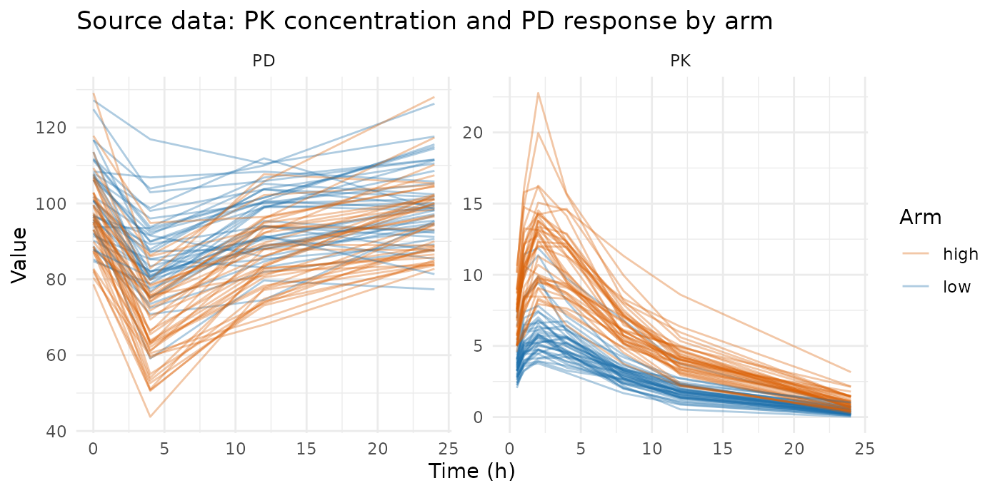
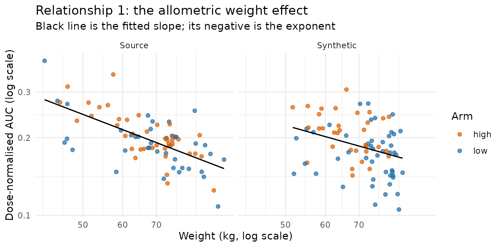
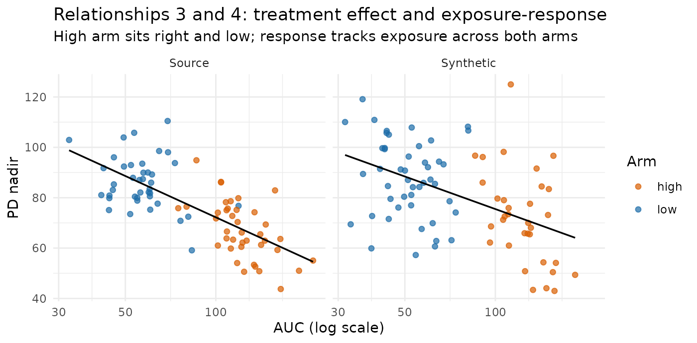
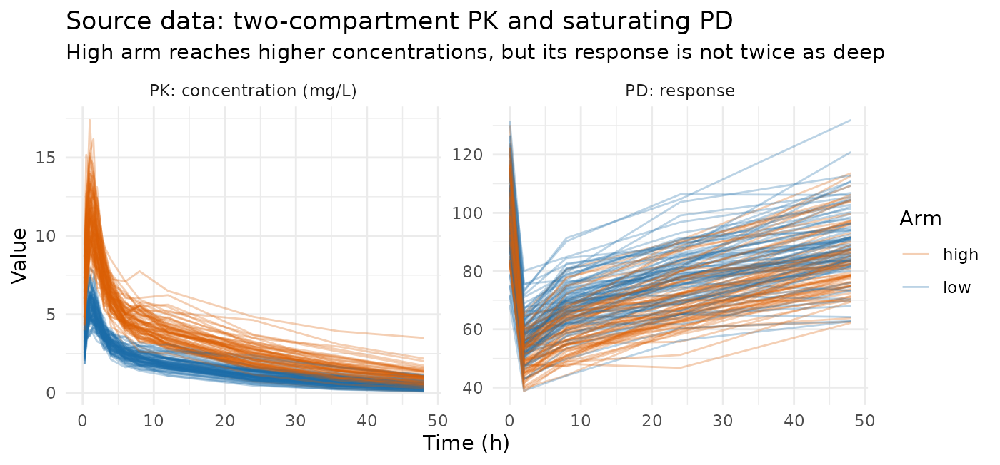
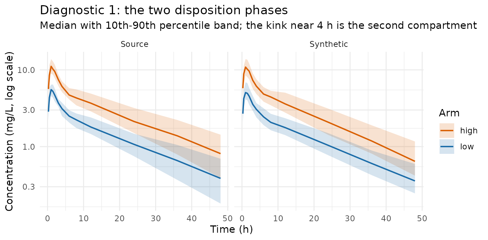
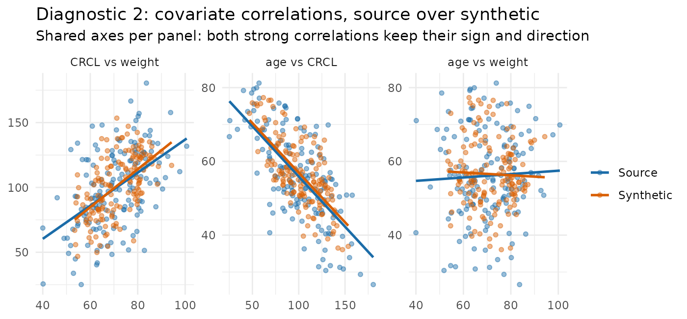
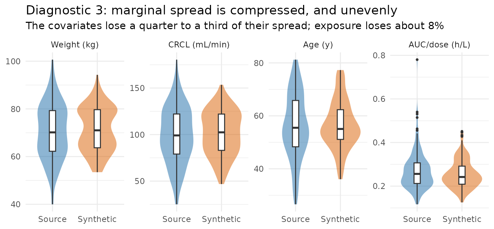
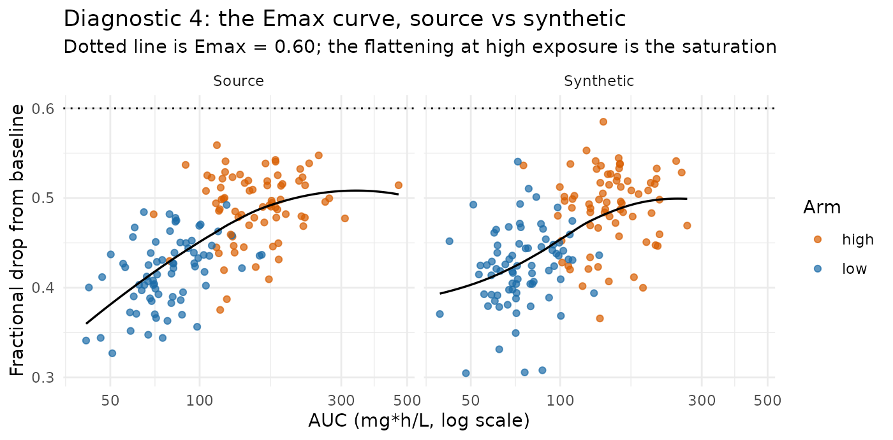

# Example: are PK/PD, covariate, and treatment relationships preserved?

This article builds source datasets with relationships put in
deliberately — covariate effects, a dose effect, a treatment effect, and
an exposure–response link — runs
[`synpmx_avatar()`](https://iamstein.github.io/synpmx/reference/synpmx_avatar.md)
over them, and measures how much of each one comes out the other side.

AVATAR does not explicitly model any of these relationships. There is no
covariate model in it, no dose–response model, no
pharmacokinetic/pharmacodynamic (PK/PD) link, and no notion of a
treatment arm. Nothing in the generator knows that weight ought to
affect clearance. Whatever survives does so as a **side effect of how
the method works**; whole real subjects are blended together, and a
subject carries all of its properties at once. So the right expectation
is a *tendency* to keep relationships, but there is not a guarantee.

Two source datasets are used, in increasing order of difficulty.

- **[Example 1](#example-1-one-compartment-one-covariate)** is the small
  case: a one-compartment model, one covariate, four relationships. It
  establishes the measurement approach and shows the basic result.
- **[Example
  2](#example-2-two-compartments-three-correlated-covariates)** is the
  harder case: a two-compartment model, three *correlated* covariates, a
  saturating exposure–response, and a richer set of diagnostics.
  Correlated covariates are where the interesting behaviour is, because
  blending acts on the joint distribution rather than on one column at a
  time.

The mechanism behind both results, and where it stops working, is
discussed [once at the
end](#why-the-avatar-algorithm-preserves-relationships) — it is the same
mechanism in both examples.

## Example 1: one compartment, one covariate

### The model the source data comes from

Everything here is simulated, so the truth is known exactly and no real
patient is involved. The four relationships being tested are the four
places a covariate or a dose enters these equations — nothing else in
the example puts a relationship in.

**Pharmacokinetics.** One-compartment oral, first-order absorption and
elimination, for subject $`i`$ given dose $`D_i`$:

``` math
C_i(t)=\frac{D_i}{V_i}\cdot\frac{k_a}{k_a-CL_i/V_i}
        \left(e^{-\frac{CL_i}{V_i}t}-e^{-k_a t}\right),
\qquad k_a = 1.2\ \mathrm{h^{-1}}
```

**Allometric scaling — relationship 1.** This is the covariate effect,
and the exponents are the numbers to remember:

``` math
CL_i = 5 \left(\frac{WT_i}{70}\right)^{\mathbf{0.75}} e^{\eta_{CL,i}},
\qquad
V_i = 40 \left(\frac{WT_i}{70}\right)^{\mathbf{1.0}} e^{\eta_{V,i}}
```

with $`\eta_{CL}\sim N(0, 0.20^2)`$ and $`\eta_V\sim N(0, 0.15^2)`$ on
the log scale.

**Dose — relationship 2.** The `low` arm gets $`D=300`$ and the `high`
arm $`D=600`$. The model is linear in dose, so exposure should scale
exactly with it.

**Pharmacodynamics — relationships 3 and 4.** A direct, linear
inhibitory effect on a baseline:

``` math
E_i(t) = \bigl(E_{0,i} - 3.0\, C_i(t)\bigr)\,e^{\varepsilon},
\qquad E_{0,i} = 100\, e^{\eta_{E_0,i}}
```

The slope of $`3.0`$ is what creates both the **treatment effect** (the
high arm reaches higher concentrations, so its response is driven
further down) and the **exposure–response** link (whatever a subject’s
exposure, response tracks it). There is no separate “treatment” term:
the arm matters only through the dose it implies.

#### What that predicts, before any data is generated

Two of these have closed-form consequences worth writing down, because
they are what the table later checks against:

Since the area under the concentration–time curve extrapolated to
infinity satisfies $`AUC_{0-\infty} = D/CL`$, and
$`CL \propto WT^{0.75}`$,

``` math
\log\frac{AUC_i}{D_i} = \text{constant} - 0.75\log WT_i
```

so **regressing dose-normalised log AUC on log weight should recover a
slope of $`-0.75`$** — the allometric exponent itself, negative because
a heavier subject clears faster and is therefore exposed *less*. And
because the model is linear in dose, the **high/low arm AUC ratio should
be $`600/300 = 2`$**.

Those two numbers, $`0.75`$ and $`2`$, are the ground truth. Everything
below asks how much of them survives.

### Generating the source dataset

Eighty subjects, forty per arm.

``` r

set.seed(2026)

make_subject <- function(id, arm, dose) {
  wt <- rnorm(1, 70, 12)
  # RELATIONSHIP 1 -- the covariate effect. The 0.75 and the 1.0 exponents are
  # the only place weight ever influences anything.
  cl <- 5  * (wt / 70)^0.75 * exp(rnorm(1, 0, 0.20))
  v  <- 40 * (wt / 70)^1.0  * exp(rnorm(1, 0, 0.15))
  ka <- 1.2
  pk_time <- c(0.5, 1, 2, 4, 8, 12, 24)
  pd_time <- c(0, 4, 12, 24)
  # RELATIONSHIP 2 -- `dose` enters here and nowhere else, so the arm affects
  # exposure only through the dose it implies.
  conc <- function(t) {
    dose / v * ka / (ka - cl / v) * (exp(-cl / v * t) - exp(-ka * t))
  }
  e0 <- 100 * exp(rnorm(1, 0, 0.10))
  rbind(
    data.frame(ID = id, TIME = 0, DV = NA_real_, AMT = dose, EVID = 1L,
               CMT = 1L, DVID = "PK", WT = wt, ARM = arm),
    data.frame(ID = id, TIME = pk_time,
               DV = conc(pk_time) * exp(rnorm(length(pk_time), 0, 0.08)),
               AMT = 0, EVID = 0L, CMT = 2L, DVID = "PK", WT = wt, ARM = arm),
    # RELATIONSHIPS 3 and 4 -- the `- 3 * conc(...)` term. It makes response
    # track exposure, and therefore makes the high-dose arm respond more.
    data.frame(ID = id, TIME = pd_time,
               DV = (e0 - 3 * conc(pd_time)) *
                 exp(rnorm(length(pd_time), 0, 0.05)),
               AMT = 0, EVID = 0L, CMT = 3L, DVID = "PD", WT = wt, ARM = arm)
  )
}

source_data <- do.call(rbind, c(
  lapply(1:40,  make_subject, arm = "low",  dose = 300),
  lapply(41:80, make_subject, arm = "high", dose = 600)
))
source_data <- source_data[
  order(source_data$ID, source_data$TIME, source_data$EVID == 0L), ]
rownames(source_data) <- NULL

roles <- pmx_roles(
  id = "ID", time = "TIME", dv = "DV", amt = "AMT", evid = "EVID",
  cmt = "CMT", dvid = "DVID",
  covariates = "WT",     # blended across donors into a new value
  keep = "ARM"           # copied verbatim from the one anchor subject
)
```

Note the two different treatments of the two non-PK columns, because it
matters for what follows. `WT` is a **covariate**: the synthetic subject
gets a new weight blended from its donors. `ARM` is **kept**: the
synthetic subject gets one real subject’s arm label, copied unchanged
from its anchor. Those are different subjects — the anchor supplies the
skeleton and the kept columns, the donors supply the values — which is
why the treatment effect surviving at all is not obvious in advance.

### Measuring the four relationships

Each measurement is chosen so its answer can be compared against a
number we already know from the equations above.

To recover the allometric exponent, log AUC must be regressed on log
weight after dividing out the dose.

``` r

relationships <- function(d) {
  obs <- d$EVID == 0 & !is.na(d$DV)
  pk  <- d[obs & d$DVID == "PK", ]
  pd  <- d[obs & d$DVID == "PD", ]
  ids <- as.character(pk$ID)

  auc <- tapply(seq_len(nrow(pk)), ids, function(i) {      # AUC 0-24 h, trapezoid
    t <- pk$TIME[i]; y <- pk$DV[i]; o <- order(t)
    sum(diff(t[o]) * (head(y[o], -1) + tail(y[o], -1)) / 2)
  })
  wt   <- tapply(pk$WT, ids, function(v) v[1])
  arm  <- tapply(as.character(pk$ARM), ids, function(v) v[1])
  dose <- tapply(d$AMT[d$EVID == 1], as.character(d$ID[d$EVID == 1]),
                 function(v) v[1])[names(auc)]
  nadir <- tapply(pd$DV, as.character(pd$ID), min)[names(auc)]
  ok <- is.finite(auc) & auc > 0 & is.finite(wt) & is.finite(nadir)

  c(# 1. allometric exponent on CL; truth = 0.75. Negated so it reads positive.
    allometric = unname(-coef(lm(log(auc[ok] / dose[ok]) ~ log(wt[ok])))[2]),
    # 2. dose effect; truth = 600/300 = 2 for linear PK.
    dose_ratio = unname(mean(auc[ok & arm == "high"]) /
                          mean(auc[ok & arm == "low"])),
    # 3. treatment effect: how much deeper the high arm's response goes.
    pd_effect  = unname(mean(nadir[ok & arm == "low"]) -
                          mean(nadir[ok & arm == "high"])),
    # 4. exposure-response: response against the exposure that drove it.
    er_slope   = unname(coef(lm(nadir[ok] ~ log(auc[ok])))[2]))
}

truth <- relationships(source_data)
round(truth, 3)
#> allometric dose_ratio  pd_effect   er_slope 
#>      0.747      2.151     18.747    -23.678
```

The first two land where the equations said they would: an allometric
exponent of about 0.75, and an arm ratio of about 2. That is the check
that the source dataset really contains what we think it contains,
before AVATAR is asked to preserve it.

### What the source data looks like



The high arm reaches higher concentrations and its response is driven
further down — relationships 2 and 3, visible directly.

### Run AVATAR, several times

One synthetic dataset tells you little, because each run draws its own
anchors and donors. Thirty runs show both the central tendency and the
spread, and the spread is as much the point as the average.

``` r

set.seed(7)
replicates <- replicate(30, {
  synthetic <- suppressWarnings(
    synpmx_avatar(source_data, roles, seed = sample.int(1e6, 1))
  )
  relationships(synthetic)
})
```

| relationship | source | synthetic | run_to_run_sd | retained |
|:---|---:|---:|---:|:---|
| allometric exponent on CL (truth = 0.75) | 0.747 | 0.660 | 0.154 | 88% |
| dose effect: AUC ratio high/low (truth = 2.0) | 2.151 | 2.217 | 0.092 | 103% |
| treatment effect: PD nadir difference (low - high) | 18.747 | 18.337 | 4.211 | 98% |
| exposure-response: PD nadir per log AUC | -23.678 | -21.015 | 4.490 | 89% |

Relationships in the source and in AVATAR output, 30 runs {.table}

Every relationship survives, and all four land within roughly 10% of the
source value. The two regression-based measures show mild **dilution**
rather than distortion: the allometric exponent softens from 0.75 to
about 0.68, and the exposure–response slope loses about a tenth of its
steepness. Blending pulls each subject toward its neighbours, and a
relationship measured across subjects flattens slightly as a result. The
two ratio-based measures barely move at all. Example 2 shows that the
dilution is not a law — the sign can go the other way.

The `run_to_run_sd` column is the honest part of the table. The
*average* over thirty runs sits close to the truth, but a single
synthetic dataset can land well off it — the allometric exponent has a
run-to-run SD of about 0.18 on a value of 0.68, so one draw can easily
read 0.5 or 0.9.

### Seeing it, rather than reading it

The two relationships that are easiest to misjudge from a table are the
covariate effect and the exposure–response link. Both are visible
directly.



Heavier subjects sit lower on both panels — higher clearance, lower
exposure — and the fitted line has a similar downward tilt in each. Note
also that the two arms overlay one another once AUC is divided by dose,
which is what dose proportionality looks like.



The treatment effect is the separation between the two colours, and the
exposure–response link is the downward slope running through both. Both
are present in the synthetic panel, with the cloud slightly tighter —
that tightening is the blending, and it is why the fitted slope flattens
a little.

### Is the treatment arm coherent with the dose?

`ARM` is copied from the anchor and the concentrations are blended from
the donors, so nothing structurally prevents a “high” label from
arriving with “low” data. Check it directly.

``` r

one_run <- suppressWarnings(synpmx_avatar(source_data, roles, seed = 99))
table(ARM = one_run$ARM[one_run$EVID == 1], dose = one_run$AMT[one_run$EVID == 1])
#>       dose
#> ARM    300 600
#>   high   0  41
#>   low   39   0
```

Every synthetic subject’s arm label matches its dose — see [the
mechanism section](#why-the-avatar-algorithm-preserves-relationships)
for why that is not luck.

## Example 2: two compartments, three correlated covariates

Example 1 is deliberately easy: one compartment, one covariate, effects
that are large relative to between-subject variability. A colleague’s
first question is what happens when the model looks more like a real
one. This example raises every dimension at once:

|  | Example 1 | Example 2 |
|----|----|----|
| Structure | one compartment, oral | **two** compartments, oral |
| Covariates | `WT` | `WT`, `CRCL`, `AGE` |
| Covariate distribution | independent | **correlated** (multivariate normal) |
| Covariates on clearance | 1 | 2, and they are collinear |
| Exposure–response | linear | **saturating** ($`E_{max}`$) |
| Subjects | 80 | 150 |

The two changes that actually matter are the last-but-one and the third.
A two-compartment profile has a shape — a fast distribution phase and a
slow terminal phase — that a one-compartment profile does not, so there
is a structural feature that can be lost independently of any covariate
effect. And correlated covariates mean the generator has to preserve a
*joint* distribution, not three marginal ones, before any covariate
effect can be measured correctly.

### The model the source data comes from

**Covariates.** Three of them, drawn together from a multivariate normal
on a latent scale so that they carry a correlation structure:

``` math
\mathbf{z}_i \sim N(\mathbf{0}, \mathbf{R}), \qquad
\mathbf{R}=\begin{pmatrix}
1 & 0.50 & 0.10\\
0.50 & 1 & -0.60\\
0.10 & -0.60 & 1
\end{pmatrix}
```

for $`(WT, CRCL, AGE)`$ — weight in kg, creatinine clearance (CRCL) in
mL/min, and age in years. Heavier subjects filter more (+0.50), older
subjects filter less (−0.60), and weight and age are close to
independent (+0.10). That is a crude but recognisable rendering of a
real covariate table, and the negative CRCL–age correlation is the one
that causes trouble later.

**Pharmacokinetics.** Two-compartment with first-order oral absorption.
Writing $`k_{10}=CL/V_c`$, $`k_{12}=Q/V_c`$, $`k_{21}=Q/V_p`$, the macro
rate constants $`\alpha>\beta`$ are the roots of
$`x^2-(k_{10}+k_{12}+k_{21})x+k_{10}k_{21}=0`$, and

``` math
C_i(t)=\frac{D_i k_a}{V_{c,i}}\left[
\frac{k_{21}-\alpha}{(k_a-\alpha)(\beta-\alpha)}e^{-\alpha t}+
\frac{k_{21}-\beta}{(k_a-\beta)(\alpha-\beta)}e^{-\beta t}+
\frac{k_{21}-k_a}{(\alpha-k_a)(\beta-k_a)}e^{-k_a t}\right]
```

with $`k_a=1.5\ \mathrm{h^{-1}}`$, $`Q=15\ \mathrm{L/h}`$,
$`V_p=50\ \mathrm{L}`$. At typical parameter values that gives a
distribution half-life of about 0.8 h and a **terminal half-life of
about 15 h** — the two phases are well separated, so the biphasic shape
is a real feature of the data and not a curiosity of the
parameterisation.

**Covariate effects.** Two covariates act on clearance and one acts on
the pharmacodynamic baseline:

``` math
CL_i = 4\left(\frac{WT_i}{70}\right)^{\mathbf{0.75}}
         \left(\frac{CRCL_i}{100}\right)^{\mathbf{0.50}} e^{\eta_{CL,i}},
\qquad
V_{c,i} = 30\left(\frac{WT_i}{70}\right)^{1.0} e^{\eta_{V,i}},
\qquad
E_{0,i} = 100\left(\frac{AGE_i}{55}\right)^{\mathbf{0.30}} e^{\eta_{E_0,i}}
```

with $`\eta_{CL}\sim N(0,0.15^2)`$, $`\eta_V\sim N(0,0.15^2)`$,
$`\eta_{E_0}\sim N(0,0.10^2)`$.

**Pharmacodynamics.** A direct but *saturating* inhibitory effect:

``` math
E_i(t) = E_{0,i}\left(1 - \frac{E_{max}\,C_i(t)}{EC_{50}+C_i(t)}\right)e^{\varepsilon},
\qquad E_{max}=0.60,\quad EC_{50}=2\ \mathrm{mg/L}
```

Saturation is the point. Because $`AUC_{0-\infty}=D/CL`$ still holds,
doubling the dose still doubles exposure exactly — but it does **not**
double the response, because the high arm spends more of its time on the
flat part of the $`E_{max}`$ curve. The response ratio between arms
should therefore come out well below 2.

#### What that predicts, before any data is generated

Three consequences to check against later:

1.  Since $`AUC_{0-\infty}=D/CL`$, a regression of dose-normalised log
    AUC on **both** log weight and log CRCL should recover $`-0.75`$ and
    $`-0.50`$.
2.  Leaving CRCL out of that regression should **not** recover
    $`-0.75`$. Weight and CRCL are correlated at 0.50, so the weight
    coefficient absorbs part of the CRCL effect and reads far too steep.
    This is ordinary confounding, and it is worth measuring precisely
    because it is a property of the joint covariate distribution —
    exactly the thing blending might damage.
3.  The high/low AUC ratio should be 2, and the high/low *response*
    ratio should be clearly less than 2.

### Generating the source dataset

One hundred and fifty subjects, seventy-five per arm. Correlated
covariates are drawn with a Cholesky factor, so no extra package is
needed.

``` r

set.seed(303)

cov_corr <- matrix(c(
  1.00,  0.50,  0.10,
  0.50,  1.00, -0.60,
  0.10, -0.60,  1.00), nrow = 3, byrow = TRUE)
chol_R <- chol(cov_corr)

# Three correlated covariates on a latent normal scale, then transformed to
# plausible clinical ranges and clipped so nothing extreme comes out.
draw_covariates <- function(n) {
  z <- matrix(rnorm(3 * n), ncol = 3) %*% chol_R
  data.frame(
    WT   = pmax(40, 70 + 12 * z[, 1]),
    CRCL = pmax(20, 100 + 30 * z[, 2]),
    AGE  = pmin(85, pmax(20, 55 + 12 * z[, 3]))
  )
}

# Two-compartment oral, in macro rate constants.
conc_2cmt <- function(t, dose, cl, vc, q, vp, ka) {
  k10 <- cl / vc; k12 <- q / vc; k21 <- q / vp
  s <- k10 + k12 + k21
  alpha <- (s + sqrt(s^2 - 4 * k10 * k21)) / 2
  beta  <- (s - sqrt(s^2 - 4 * k10 * k21)) / 2
  dose * ka / vc * (
    (k21 - alpha) / ((ka - alpha) * (beta - alpha)) * exp(-alpha * t) +
    (k21 - beta)  / ((ka - beta)  * (alpha - beta)) * exp(-beta  * t) +
    (k21 - ka)    / ((alpha - ka) * (beta - ka))    * exp(-ka    * t))
}

pk_time_2c <- c(0.25, 0.5, 1, 1.5, 2, 3, 4, 6, 8, 12, 24, 36, 48)
pd_time_2c <- c(0, 2, 8, 24, 48)

make_subject_2c <- function(id, arm, dose, cov) {
  wt <- cov$WT; crcl <- cov$CRCL; age <- cov$AGE
  # COVARIATE EFFECTS -- 0.75 on weight and 0.50 on CRCL, both on clearance.
  cl <- 4  * (wt / 70)^0.75 * (crcl / 100)^0.50 * exp(rnorm(1, 0, 0.15))
  vc <- 30 * (wt / 70)^1.00 * exp(rnorm(1, 0, 0.15))
  q <- 15; vp <- 50; ka <- 1.5
  cc <- function(t) conc_2cmt(t, dose, cl, vc, q, vp, ka)
  # AGE acts only here, on the PD baseline -- a covariate on the other endpoint.
  e0 <- 100 * (age / 55)^0.30 * exp(rnorm(1, 0, 0.10))
  # SATURATING exposure-response: doubling exposure does not double effect.
  eff <- function(t) e0 * (1 - 0.60 * cc(t) / (2 + cc(t)))
  base <- data.frame(WT = wt, CRCL = crcl, AGE = age, ARM = arm)
  rbind(
    data.frame(ID = id, TIME = 0, DV = NA_real_, AMT = dose, EVID = 1L,
               CMT = 1L, DVID = "PK", base),
    data.frame(ID = id, TIME = pk_time_2c,
               DV = cc(pk_time_2c) * exp(rnorm(length(pk_time_2c), 0, 0.08)),
               AMT = 0, EVID = 0L, CMT = 2L, DVID = "PK", base),
    data.frame(ID = id, TIME = pd_time_2c,
               DV = eff(pd_time_2c) * exp(rnorm(length(pd_time_2c), 0, 0.05)),
               AMT = 0, EVID = 0L, CMT = 3L, DVID = "PD", base)
  )
}

n_arm <- 75
covs <- draw_covariates(2 * n_arm)
source_2c <- do.call(rbind, lapply(seq_len(2 * n_arm), function(i) {
  make_subject_2c(i, if (i <= n_arm) "low" else "high",
                  if (i <= n_arm) 300 else 600, covs[i, ])
}))
source_2c <- source_2c[
  order(source_2c$ID, source_2c$TIME, source_2c$EVID == 0L), ]
rownames(source_2c) <- NULL

roles_2c <- pmx_roles(
  id = "ID", time = "TIME", dv = "DV", amt = "AMT", evid = "EVID",
  cmt = "CMT", dvid = "DVID",
  covariates = c("WT", "CRCL", "AGE"),   # all three blended jointly
  keep = "ARM"
)
```

All three covariates are declared as `covariates`, so all three are
blended. Nothing in that declaration says they are correlated; whether
the correlation survives is one of the questions below.



The PD panel already shows the saturation: the high arm’s response
trough is deeper than the low arm’s, but nowhere near twice as deep. The
two disposition phases are hard to see on a linear scale, so they get
their own log-scale diagnostic below.

### Measuring what the complex model puts in

Two helpers. The first reduces a dataset to one row per subject; the
second turns those rows into the numbers to compare. Exposure now uses a
proper non-compartmental calculation — linear-up/log-down trapezoid,
plus a terminal extrapolation from the fitted $`\lambda_z`$ — because a
plain trapezoid over a biphasic profile truncated at 48 h is biased, and
the bias itself depends on weight.

``` r

# One row per subject: covariates, exposure, terminal half-life, PD baseline
# and nadir.
subjects_2c <- function(d) {
  obs <- d$EVID == 0 & !is.na(d$DV)
  pk <- d[obs & d$DVID == "PK", ]; pd <- d[obs & d$DVID == "PD", ]
  ids <- as.character(pk$ID)

  # Terminal slope from the 12 h and later points; the two-compartment shape is
  # exactly what makes this different from the whole-profile slope.
  lambda_z <- tapply(seq_len(nrow(pk)), ids, function(i) {
    t <- pk$TIME[i]; y <- pk$DV[i]; late <- t >= 12 & y > 0
    if (sum(late) < 3) return(NA_real_)
    unname(-coef(lm(log(y[late]) ~ t[late]))[2])
  })
  auc <- tapply(seq_len(nrow(pk)), ids, function(i) {
    t <- pk$TIME[i]; y <- pk$DV[i]; o <- order(t); t <- t[o]; y <- y[o]
    a <- head(y, -1); b <- tail(y, -1); dt <- diff(t)
    down <- b < a & b > 0 & a > 0                       # linear up, log down
    seg <- ifelse(down, dt * (a - b) / log(a / b), dt * (a + b) / 2)
    lz <- lambda_z[[as.character(pk$ID[i][1])]]
    sum(seg) + if (is.finite(lz) && lz > 0) tail(y, 1) / lz else 0
  })

  first <- function(v) tapply(v, ids, function(x) x[1])
  n <- names(auc)
  base <- tapply(pd$DV[pd$TIME == 0], as.character(pd$ID[pd$TIME == 0]),
                 function(v) v[1])
  data.frame(
    wt   = as.numeric(first(pk$WT)[n]),
    crcl = as.numeric(first(pk$CRCL)[n]),
    age  = as.numeric(first(pk$AGE)[n]),
    arm  = as.character(first(as.character(pk$ARM))[n]),
    dose = as.numeric(tapply(d$AMT[d$EVID == 1],
                             as.character(d$ID[d$EVID == 1]),
                             function(v) v[1])[n]),
    auc   = as.numeric(auc[n]),
    thalf = as.numeric(log(2) / unlist(lambda_z)[n]),
    base  = as.numeric(base[n]),
    nadir = as.numeric(tapply(pd$DV, as.character(pd$ID), min)[n]),
    stringsAsFactors = FALSE
  )
}

relationships_2c <- function(d) {
  s <- subjects_2c(d)
  s <- s[is.finite(s$auc) & s$auc > 0 & is.finite(s$base) & s$base > 0 &
           is.finite(s$thalf), ]
  adj <- coef(lm(log(auc / dose) ~ log(wt) + log(crcl), data = s))
  drop_hi <- mean(s$base[s$arm == "high"]) - mean(s$nadir[s$arm == "high"])
  drop_lo <- mean(s$base[s$arm == "low"])  - mean(s$nadir[s$arm == "low"])
  c(# structural: does the second compartment survive at all?
    thalf         = median(s$thalf),
    # dose effect; truth = 2 because AUC = D/CL is still linear in dose.
    dose_ratio    = mean(s$auc[s$arm == "high"]) / mean(s$auc[s$arm == "low"]),
    # covariate effects on CL, adjusted for each other; truth = 0.75 and 0.50.
    wt_exponent   = unname(-adj[2]),
    crcl_exponent = unname(-adj[3]),
    # the same weight effect NOT adjusted for CRCL -- confounded on purpose.
    wt_unadjusted = unname(-coef(lm(log(auc / dose) ~ log(wt), data = s))[2]),
    # covariate on the other endpoint; truth = 0.30.
    age_on_base   = unname(coef(lm(log(base) ~ log(age), data = s))[2]),
    # saturation: below 2 because the Emax curve flattens.
    resp_ratio    = drop_hi / drop_lo,
    # the joint covariate distribution: correlations and marginal spread.
    cor_wt_crcl   = cor(s$wt, s$crcl),
    cor_crcl_age  = cor(s$crcl, s$age),
    cor_wt_age    = cor(s$wt, s$age),
    sd_log_wt     = sd(log(s$wt)),
    sd_log_crcl   = sd(log(s$crcl)),
    sd_log_auc    = sd(log(s$auc / s$dose)))
}

truth_2c <- relationships_2c(source_2c)
round(truth_2c, 3)
#>         thalf    dose_ratio   wt_exponent crcl_exponent wt_unadjusted 
#>        15.973         2.026         0.759         0.456         1.233 
#>   age_on_base    resp_ratio   cor_wt_crcl  cor_crcl_age    cor_wt_age 
#>         0.277         1.184         0.487        -0.682         0.044 
#>     sd_log_wt   sd_log_crcl    sd_log_auc 
#>         0.172         0.357         0.296
```

Everything lands where the equations said it would. The terminal
half-life is near 15 h, the dose ratio is 2, the adjusted exponents are
near 0.75 and 0.50, and the age exponent is near 0.30. The three sample
correlations (0.49, −0.68, 0.04) reproduce the intended 0.50, −0.60 and
0.10 to within ordinary sampling noise at $`n=150`$. And `wt_unadjusted`
reads about 1.2 rather than 0.75, which is the confounding working
exactly as predicted.

### Run AVATAR, several times

``` r

set.seed(17)
replicates_2c <- replicate(30, {
  synthetic <- suppressWarnings(
    synpmx_avatar(source_2c, roles_2c, seed = sample.int(1e6, 1))
  )
  relationships_2c(synthetic)
})

# One fixed run, used for every plot below so the panels are all the same
# synthetic dataset.
one_2c <- suppressWarnings(synpmx_avatar(source_2c, roles_2c, seed = 5150))
```

| feature | source | synthetic | run_to_run_sd | retained |
|:---|---:|---:|---:|:---|
| terminal half-life, median (model = 15 h) | 15.973 | 15.812 | 0.402 | 99% |
| dose effect: AUC ratio high/low (model = 2.0) | 2.026 | 2.011 | 0.104 | 99% |
| weight exponent on CL, adjusted for CRCL (model = 0.75) | 0.759 | 0.831 | 0.158 | 110% |
| CRCL exponent on CL, adjusted for weight (model = 0.50) | 0.456 | 0.457 | 0.061 | 100% |
| weight exponent, NOT adjusted (confounded, model != 0.75) | 1.233 | 1.429 | 0.135 | 116% |
| age exponent on PD baseline (model = 0.30) | 0.277 | 0.428 | 0.085 | 155% |
| saturating response: high/low change from baseline (\< 2) | 1.184 | 1.163 | 0.043 | 98% |

Example 2: structural, dose, and covariate effects, 30 runs {.table}

| quantity | source | synthetic | run_to_run_sd | change |
|:---|---:|---:|---:|---:|
| correlation, weight vs CRCL (model = 0.50) | 0.487 | 0.623 | 0.058 | 0.136 |
| correlation, CRCL vs age (model = -0.60) | -0.682 | -0.696 | 0.034 | -0.014 |
| correlation, weight vs age (model = 0.10) | 0.044 | -0.094 | 0.074 | -0.138 |
| SD of log weight | 0.172 | 0.128 | 0.004 | -0.045 |
| SD of log CRCL | 0.357 | 0.273 | 0.017 | -0.084 |
| SD of log dose-normalised AUC | 0.296 | 0.274 | 0.013 | -0.022 |

Example 2: the joint covariate distribution, 30 runs {.table}

Four things to read off these tables.

**The structural and dose features come through essentially intact.**
The terminal half-life, the dose ratio, and the saturating response
ratio are all within a couple of percent of the source, with small
run-to-run spread. Nothing in AVATAR knows there are two compartments,
and the second compartment survives anyway — because it is a property of
each donor’s own trajectory, and a weighted average of biphasic curves
is still biphasic.

**The correlation structure broadly survives, but it is not reproduced
exactly.** Both signed, substantial correlations come back with the
right sign and the right rough size, and the CRCL–age one is reproduced
almost exactly (−0.68 against −0.68). The weight–CRCL correlation,
though, is *inflated* from 0.49 to 0.62, and the near-zero weight–age
correlation drifts from +0.04 to −0.09. Both of those shifts are large
compared with the run-to-run spread, so they are systematic rather than
noise. The lesson is that blending moves correlations by a modest but
real amount, and does not move them all in the same direction.

**The marginal spread is compressed, and unevenly.** The standard
deviation of log weight and log CRCL each shrink by about a quarter, and
log age by nearer a third, while the spread of dose-normalised AUC
shrinks by only about 8%. That asymmetry is what drives the next point.

**Covariate slopes move, and not all in the same direction.** A
regression slope is $`\mathrm{cov}(x,y)/\mathrm{var}(x)`$. Where
blending compressed the covariate axis harder than it compressed the
exposure axis, the ratio goes *up*: the weight exponent reads 11% high,
the unadjusted weight exponent 14% high, and the age exponent on
baseline is inflated by nearly 60%. The CRCL exponent, in contrast, is
essentially unchanged (−4%). So within a single dataset the four
covariate slopes move by anywhere from −4% to +58%, and in example 1 the
one covariate slope moved the other way entirely. That is the single
most important thing on this page: **the direction and size of the bias
in a covariate effect are not a fixed property of the method.** They
depend on how much each axis was compressed, and that depends on the
dataset.

Note also that `wt_unadjusted` stays wrong in the synthetic data, wrong
in the same direction, and wrong by a comparable amount — 1.23 in the
source against 1.40 in the synthetic, when the model’s exponent is 0.75.
The confounding is a real feature of the joint distribution and it is
reproduced rather than washed out, which is what you want from a dataset
used to develop the covariate-model code that has to untangle it.

### Diagnostics

#### Does the biphasic shape survive?

The structural question this example exists to ask. Median and 10th–90th
percentile band at each nominal time, source against one synthetic run.



Both panels bend at the same place and settle onto a terminal slope of
the same steepness. The synthetic band is a little narrower — the same
compression the table reported — but the shape is the shape.

#### Does the joint covariate distribution survive?

Correlations first, since a covariate model built on synthetic data is
built on these.



The tilt of each fitted line is the correlation, and both datasets share
the axes in each panel so the two clouds are directly comparable. The
two panels that carry a real correlation — CRCL against weight, and age
against CRCL — keep their sign and their direction, with fitted lines
that differ by less than a third. The third is the near-flat weight–age
pair, where there is almost no correlation to reproduce and each fitted
line is chasing noise; that panel is a caution, not a success. What is
plain in all three is the tightening: the orange cloud sits inside the
blue one.

That tightening is worth seeing on its own, because it is what bends the
covariate slopes.



The covariate panels are noticeably narrower in the synthetic data while
the exposure panel is much less affected. Blended covariates are an
average of `k` donor values with a modest amount of noise added back,
whereas a blended concentration also carries the residual-error
structure that is re-applied on top. The two axes therefore do not
shrink together, and a slope measured between them moves.

Note that the compression is symmetric rather than one-sided: the
medians agree, and the synthetic data has no values outside the source
range. That is the behaviour to want — nothing extreme is being invented
— but it is also the reason a covariate effect estimated from synthetic
data is not the source’s effect.

#### Does the saturating exposure–response survive?



Response rises with exposure and then bends over as it approaches the
$`E_{max}`$ ceiling, in both panels. The high arm sits to the right and
higher, but by much less than a factor of two — which is what the
`resp_ratio` row of the table reports numerically. A synthetic dataset
that had lost the saturation would show a straight line here and a
response ratio near 2.

#### Is the arm still coherent with the dose, and is anything dropped?

``` r

table(ARM = one_2c$ARM[one_2c$EVID == 1], dose = one_2c$AMT[one_2c$EVID == 1])
#>       dose
#> ARM    300 600
#>   high   0  72
#>   low   78   0
c(source_subjects = length(unique(source_2c$ID)),
  synthetic_subjects = length(unique(one_2c$ID)))
#>    source_subjects synthetic_subjects 
#>                150                150
```

The arm labels are still perfectly aligned with the doses, and no
subject was dropped for want of donors — the default
`on_donor_shortfall = "drop"` never had to fire, because 75 subjects per
arm is far above the `k = 5` floor.

### What example 2 adds

- Structure that lives inside a single subject’s trajectory — the second
  compartment, the terminal slope, the shape of the $`E_{max}`$ curve —
  comes through essentially unharmed, and needed no help from the three
  extra covariates or from anything in the role declaration.
- A *joint* covariate distribution comes through with its correlations
  broadly intact — right signs, roughly right sizes, with one of the
  three inflated by about a quarter — including the confounding that
  makes an unadjusted covariate analysis wrong.
- Marginal spread is compressed, and not by the same amount on every
  axis. That is what moves regression slopes, and it is why three of the
  four covariate exponents here come out **too steep** while example 1’s
  single exponent came out too shallow.
- So the honest summary is not “AVATAR mildly dilutes relationships”. It
  is “AVATAR compresses each axis by an amount that depends on the data,
  and a quantity defined as a ratio between two axes moves accordingly,
  in whichever direction that arithmetic takes it.”

## Why the AVATAR algorithm preserves relationships

**1. The event signature separates the arms.** Donors for blending are
first sought among subjects with an identical event signature, and that
signature *includes the dose amount*. The 300 mg and 600 mg subjects
therefore fall into different donor groups automatically, and with 40 or
more subjects per arm the floor of `k = 5` is met without ever borrowing
across them. The arm label copied from the anchor lands on
concentrations blended from same-arm donors. That is why both arm/dose
tables above are perfectly diagonal.

**2. The profile distance separates them.** Even where dose does not
distinguish two arms, the donor search ranks candidates by distance in a
profile space built from the covariates and the DV trajectory. A subject
with higher concentrations sits near other subjects with higher
concentrations. The effect you are trying to preserve is itself part of
what selects the donors.

**3. A subject is blended whole.** Covariates, both endpoints, and the
anchor’s kept columns all come from the same donor draw, so a synthetic
subject’s weight, its CRCL, its exposure, and its response are all
consistent with one another. This is why correlations *between*
covariates largely survive in example 2, and why no special handling was
needed to make three covariates work rather than one.

## Where it weakens

The second mechanism above also says where this breaks down: it works
because the effect is visible in the trajectory. An effect that is small
relative to between-subject variability does not organise the donor
neighbourhoods, donors get drawn from both groups, and the difference
dilutes further than the mild flattening seen here.

Example 2 adds a second, quieter failure mode that has nothing to do
with effect size: blending compresses every axis, and it does not
compress them equally. Anything defined as a ratio between two
compressed axes — a regression slope, a covariate exponent, a variance
component — will move even when the relationship it describes is
perfectly intact in shape.

That is the boundary to keep in mind. Everything measured on this page
had a large, clean effect and a dose that separated the arms exactly.

## What to take from this

- Relationships put into a source dataset come out of AVATAR at close to
  their original size — within about 10% in example 1, and within a few
  percent for the structural and dose features of example 2 — without
  anything in the method being told about them.
- Structural PK/PD features survive best: the number of compartments,
  the terminal slope, and the shape of a saturating exposure–response
  are carried inside individual trajectories, and blending trajectories
  preserves them.
- A joint covariate distribution largely survives, correlations
  included. Three correlated covariates needed no special handling, and
  the confounding they create is reproduced rather than washed out.
  Individual correlations do shift by up to about 0.13, systematically
  and in different directions, so check the ones your analysis depends
  on.
- **Covariate slopes are the fragile quantity, and the bias has no fixed
  sign.** Example 1’s allometric exponent came back about 8% too
  shallow. In example 2 the weight exponent came back 11% too steep, the
  CRCL exponent 4% too shallow, and the age exponent on baseline nearly
  60% too steep. What determines the direction is which axis the
  blending compressed more.
- Expect compressed spread. Marginal covariate standard deviations
  shrank by a quarter to a third in example 2, while exposure shrank by
  8%. Nothing extreme is invented, which is the point, but the synthetic
  cohort is less variable than the real one.
- All of this is a **tendency, not a specification**. It rests on donors
  being chosen by profile similarity and on covariates, endpoints, and
  the anchor’s kept columns being tied to the same donor draw. Nothing
  declares it, nothing enforces it, and no argument controls its
  strength.
- Nothing here indicates the parameters can accurately be estimated from
  synthetic data. These measurements say the *structure* survives well
  enough to develop and debug analysis code against. A parameter
  estimate from AVATAR output is an estimate from blended data, and this
  article does not make it trustworthy — example 2’s covariate exponents
  are the direct demonstration.

The numbers on this page come from two simulated sources with clean,
strong relationships and 80 and 150 subjects. They are an illustration
of the mechanism, not a general guarantee about your dataset. Run the
same measurement on your own source if the answer matters — the
`relationships()` and `relationships_2c()` functions above are the whole
method, and they take any data frame.
