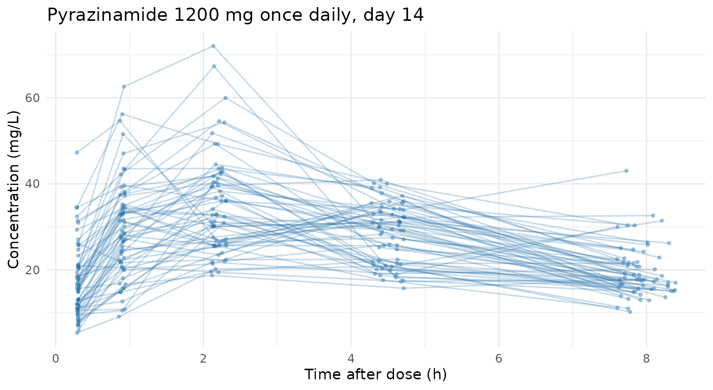

# Example: prior-only synthetic PK for pyrazinamide

One concrete case worked end to end: a synthetic pyrazinamide dataset,
1200 mg orally once daily for two weeks, sampled on day 14. Every number
and every choice is shown, including the ones the generator cannot
represent.

Prior-only generation reads **no data at all** — it takes a public
structural model and a trial design and simulates from those alone — so
nothing here needs a privacy argument, and there is no `data` argument
to supply. See
[`vignette("synpmx-privacy")`](https://iamstein.github.io/synpmx/articles/synpmx-privacy.md)
for where this sits among the three method families, and the [AVATAR
Algorithm](https://iamstein.github.io/synpmx/articles/avatar-algorithm.html)
article for the default method, which works the other way round: from
real data, with no model to state.

The cardinal rule for this mode: every number below must come from
somewhere that is *not* the study being simulated. The values used here
are literature / protocol values for pyrazinamide, recorded in each
object’s `source` field. If you were to fit a model to a real study and
paste its estimates in here, the real data would reach the output
through the parameters and the “nothing was read” claim would be false —
[`synpmx_prior()`](https://iamstein.github.io/synpmx/reference/synpmx_prior.md)
cannot detect that, so the discipline is yours to keep.

**Read the last section before using the output.** Four parts of the
requested specification cannot be expressed by this generator, and the
script does not pretend otherwise.

``` r

knitr::opts_chunk$set(collapse = TRUE, comment = "#>", fig.align = "center",
                      out.width = "100%")
library(synpmx)
has_ggplot2 <- requireNamespace("ggplot2", quietly = TRUE)
```

## The specification

| Quantity | Value |
|----|----|
| Structural model | 1-compartment oral, first-order absorption and elimination |
| Ka | 1.31 h⁻¹ |
| CL/F | 3.52 L/h |
| V/F | 28.57 L |
| IIV (log-SD) | Ka 0.620, CL 0.174, V 0.181 |
| IOV (log-SD) | V 0.117 |
| Residual error | proportional 0.22, additive SD 2.41 mg/L |
| WT | N(55.50, 8.40), bounded \[30, 100\] |
| CD38 | N(36.13, 13.74), bounded \[0, 100\] |
| GENDER | levels {1, 2}, proportions {0.526, 0.474} |
| Regimen | 1200 mg orally once daily |
| Sampling | after 2 weeks of dosing, at 0.3, 0.9, 2.2, 4.5, 8 h post dose |

Choices not given in the specification, made here and flagged so they
are easy to change:

``` r

N_SUBJECTS <- 60          # cohort size
SEED       <- 20260728    # reproducibility seed
LLOQ       <- 0.2         # mg/L, a typical HPLC assay limit for pyrazinamide
DROPOUT    <- 0           # no discontinuation modelled
N_DOSES    <- 14          # "2 weeks of dosing" at once daily
```

## Two unit conversions

Both are places where the specification and the package use different
parameterisations, so converting rather than pasting matters.

**IIV.** `pmx_structural_model(iiv = )` takes a **CV**, while the
specification gives **log-SD**. For a lognormal,
`CV = sqrt(exp(omega^2) - 1)`.

``` r

omega_to_cv <- function(omega) sqrt(exp(omega^2) - 1)

iiv_log_sd <- c(ka = 0.620, cl = 0.174, v = 0.181)
iiv_cv     <- omega_to_cv(iiv_log_sd)
knitr::kable(
  data.frame(parameter = names(iiv_log_sd),
             log_sd = iiv_log_sd, cv = round(iiv_cv, 4)),
  row.names = FALSE, caption = "IIV: specification (log-SD) to package (CV)"
)
```

| parameter | log_sd |     cv |
|:----------|-------:|-------:|
| ka        |  0.620 | 0.6846 |
| cl        |  0.174 | 0.1753 |
| v         |  0.181 | 0.1825 |

IIV: specification (log-SD) to package (CV) {.table}

**Continuous covariates.** `pmx_covariate(range = )` is a single public
range that does double duty: in prior mode the generator draws
`rnorm(mean(range), diff(range) / 6)` and clips to that same range. So a
range of `mean +/- 3 SD` reproduces a requested normal distribution,
with clipping falling at 3 SD where it costs about 0.3% of draws.

``` r

normal_to_range <- function(mean, sd) c(mean - 3 * sd, mean + 3 * sd)

normal_to_range(55.50, 8.40)   # WT
#> [1] 30.3 80.7
normal_to_range(36.13, 13.74)  # CD38 -- note the negative lower bound
#> [1] -5.09 77.35
```

The CD38 range comes out negative at the low end, which is not a usable
bound for a biomarker. Because the one range fixes both the spread and
the clipping, the mean and the non-negativity cannot both be kept
alongside the full SD. The mean and the floor at zero are kept, and the
SD lands at 12.04 rather than 13.74:

``` r

cd38_range <- c(0, 2 * 36.13)
c(mean = mean(cd38_range), sd = diff(cd38_range) / 6)
#>     mean       sd 
#> 36.13000 12.04333
```

## The public inputs

``` r

pza_model <- pmx_structural_model(
  pk      = "1cmt_oral",
  typical = c(cl = 3.52, v = 28.57, ka = 1.31),
  iiv     = iiv_cv,
  residual_cv = 0.22,
  source  = paste(
    "Published pyrazinamide population PK parameters; never fitted to the",
    "study being simulated."
  )
)
pza_model
#> Public structural model
#>   PK: 1cmt_oral
#>   PD: none
#>   typical: cl=3.52, v=28.6, ka=1.31
#>   source: Published pyrazinamide population PK parameters; never fitted to the study being simulated.
```

``` r

pza_covariates <- pmx_covariates(
  WT = pmx_covariate(
    range  = normal_to_range(55.50, 8.40),
    source = "Protocol-eligible adult weight range; literature mean and SD."
  ),
  CD38 = pmx_covariate(
    range  = cd38_range,
    source = "Literature CD38 distribution; floored at zero."
  ),
  GENDER = pmx_covariate(
    levels = c("1", "2"),
    source = "Protocol sex categories."
  )
)
```

Sampling is requested only after two weeks of dosing, so thirteen doses
carry no samples and the fourteenth carries the full profile. `sampling`
takes one entry per dose, and `NULL` means “no samples after this one”.

``` r

post_dose <- c(0.3, 0.9, 2.2, 4.5, 8)

pza_design <- pmx_trial_design(
  dose_levels   = 1200,
  cohort_sizes  = N_SUBJECTS,
  sampling      = c(rep(list(NULL), N_DOSES - 1L), list(post_dose)),
  n_doses       = N_DOSES,
  dose_interval = 24,
  source        = "Protocol: 1200 mg orally once daily for 2 weeks."
)
pza_design
#> Public trial design
#>   doses: 1200  (n = 60)
#>   dose times: 0, 24, 48, 72, 96, 120, 144, 168, 192, 216, 240, 264, 288, 312
#>   sampling: 
#>     dose 1: none
#>     dose 2: none
#>     dose 3: none
#>     dose 4: none
#>     dose 5: none
#>     dose 6: none
#>     dose 7: none
#>     dose 8: none
#>     dose 9: none
#>     dose 10: none
#>     dose 11: none
#>     dose 12: none
#>     dose 13: none
#>     dose 14: 0.3, 0.9, 2.2, 4.5, 8
#>   source: Protocol: 1200 mg orally once daily for 2 weeks.
```

## Generate

``` r

pza <- synpmx_prior(
  pza_model, pza_design,
  n_subjects = N_SUBJECTS, seed = SEED,
  dropout = DROPOUT, lloq = LLOQ, covariates = pza_covariates
)

str(pza)
#> 'data.frame':    1140 obs. of  17 variables:
#>  $ ID    : int  1 1 1 1 1 1 1 1 1 1 ...
#>  $ TIME  : num  0 24 48 72 96 120 144 168 192 216 ...
#>  $ NTIME : num  0 24 48 72 96 120 144 168 192 216 ...
#>  $ TAD   : num  0 0 0 0 0 0 0 0 0 0 ...
#>  $ OCC   : int  1 2 3 4 5 6 7 8 9 10 ...
#>  $ DV    : num  NA NA NA NA NA NA NA NA NA NA ...
#>  $ AMT   : num  1200 1200 1200 1200 1200 1200 1200 1200 1200 1200 ...
#>  $ RATE  : num  0 0 0 0 0 0 0 0 0 0 ...
#>  $ EVID  : int  1 1 1 1 1 1 1 1 1 1 ...
#>  $ CMT   : int  1 1 1 1 1 1 1 1 1 1 ...
#>  $ DVID  : chr  NA NA NA NA ...
#>  $ MDV   : int  1 1 1 1 1 1 1 1 1 1 ...
#>  $ CENS  : int  0 0 0 0 0 0 0 0 0 0 ...
#>  $ DOSE  : num  1200 1200 1200 1200 1200 1200 1200 1200 1200 1200 ...
#>  $ WT    : num  44.5 44.5 44.5 44.5 44.5 ...
#>  $ CD38  : num  48.8 48.8 48.8 48.8 48.8 ...
#>  $ GENDER: chr  "2" "2" "2" "2" ...
#>  - attr(*, "pmx_source")= chr "prior"
```

``` r

knitr::kable(head(pza, 8), digits = 3,
             caption = "First rows of the generated dataset")
```

|  ID | TIME | NTIME | TAD | OCC |  DV |  AMT | RATE | EVID | CMT | DVID | MDV | CENS | DOSE |     WT |   CD38 | GENDER |
|----:|-----:|------:|----:|----:|----:|-----:|-----:|-----:|----:|:-----|----:|-----:|-----:|-------:|-------:|:-------|
|   1 |    0 |     0 |   0 |   1 |  NA | 1200 |    0 |    1 |   1 | NA   |   1 |    0 | 1200 | 44.463 | 48.751 | 2      |
|   1 |   24 |    24 |   0 |   2 |  NA | 1200 |    0 |    1 |   1 | NA   |   1 |    0 | 1200 | 44.463 | 48.751 | 2      |
|   1 |   48 |    48 |   0 |   3 |  NA | 1200 |    0 |    1 |   1 | NA   |   1 |    0 | 1200 | 44.463 | 48.751 | 2      |
|   1 |   72 |    72 |   0 |   4 |  NA | 1200 |    0 |    1 |   1 | NA   |   1 |    0 | 1200 | 44.463 | 48.751 | 2      |
|   1 |   96 |    96 |   0 |   5 |  NA | 1200 |    0 |    1 |   1 | NA   |   1 |    0 | 1200 | 44.463 | 48.751 | 2      |
|   1 |  120 |   120 |   0 |   6 |  NA | 1200 |    0 |    1 |   1 | NA   |   1 |    0 | 1200 | 44.463 | 48.751 | 2      |
|   1 |  144 |   144 |   0 |   7 |  NA | 1200 |    0 |    1 |   1 | NA   |   1 |    0 | 1200 | 44.463 | 48.751 | 2      |
|   1 |  168 |   168 |   0 |   8 |  NA | 1200 |    0 |    1 |   1 | NA   |   1 |    0 | 1200 | 44.463 | 48.751 | 2      |

First rows of the generated dataset {.table}

## Does it match the specification?

The checks worth making are the ones on quantities that were actually
requested.

Two time columns matter here. `NTIME` is the **nominal** (protocol) time
and `TAD` is the **actual** time after dose, which the generator jitters
around nominal by `visit_window` (5% by default) so that sample times
look like a real study rather than a grid. Checking the schedule means
checking nominal time; the last dose falls at hour `24 * (N_DOSES - 1)`.

``` r

roles <- pmx_generated_roles()
obs   <- pza[[roles$evid]] == 0 & !is.na(pza[[roles$dv]])

# Nominal time after the qualifying dose, recovered from NTIME and the occasion.
nominal_tad <- pza[[roles$nominal_time]] - 24 * (pza[[roles$occasion]] - 1)

knitr::kable(
  data.frame(
    quantity = c("subjects", "dose amount (mg)", "doses per subject",
                 "observations per subject", "sampling occasion",
                 "nominal times after dose (h)"),
    value = c(
      length(unique(pza[[roles$id]])),
      paste(unique(pza[[roles$amt]][pza[[roles$amt]] > 0]), collapse = ", "),
      round(mean(table(pza[[roles$id]][pza[[roles$amt]] > 0])), 1),
      round(mean(table(pza[[roles$id]][obs])), 1),
      paste(sort(unique(pza[[roles$occasion]][obs])), collapse = ", "),
      paste(sort(unique(round(nominal_tad[obs], 2))), collapse = ", ")
    )
  ),
  row.names = FALSE, caption = "Design realised in the output"
)
```

| quantity                     | value                 |
|:-----------------------------|:----------------------|
| subjects                     | 60                    |
| dose amount (mg)             | 1200                  |
| doses per subject            | 14                    |
| observations per subject     | 5                     |
| sampling occasion            | 14                    |
| nominal times after dose (h) | 0.3, 0.9, 2.2, 4.5, 8 |

Design realised in the output {.table}

``` r

first_row <- !duplicated(pza[[roles$id]])
knitr::kable(
  data.frame(
    covariate = c("WT", "CD38", "GENDER = 1"),
    requested = c("mean 55.50, SD 8.40", "mean 36.13, SD 13.74", "0.526"),
    generated = c(
      sprintf("mean %.2f, SD %.2f", mean(pza$WT[first_row]),
              sd(pza$WT[first_row])),
      sprintf("mean %.2f, SD %.2f", mean(pza$CD38[first_row]),
              sd(pza$CD38[first_row])),
      sprintf("%.3f", mean(pza$GENDER[first_row] == "1"))
    )
  ),
  row.names = FALSE, caption = "Covariates: requested versus generated"
)
```

| covariate  | requested            | generated            |
|:-----------|:---------------------|:---------------------|
| WT         | mean 55.50, SD 8.40  | mean 54.64, SD 8.15  |
| CD38       | mean 36.13, SD 13.74 | mean 37.26, SD 11.38 |
| GENDER = 1 | 0.526                | 0.367                |

Covariates: requested versus generated {.table}

``` r

by_time <- split(pza[[roles$dv]][obs], round(nominal_tad[obs], 2))
knitr::kable(
  data.frame(
    nominal_tad = names(by_time),
    n           = vapply(by_time, length, integer(1)),
    median      = round(vapply(by_time, median, numeric(1)), 2),
    min         = round(vapply(by_time, min, numeric(1)), 2),
    max         = round(vapply(by_time, max, numeric(1)), 2)
  ),
  row.names = FALSE,
  caption = "Concentration (mg/L) by nominal time after dose (h)"
)
```

| nominal_tad |   n | median |   min |   max |
|:------------|----:|-------:|------:|------:|
| 0.3         |  60 |  15.77 |  5.33 | 47.26 |
| 0.9         |  60 |  28.48 |  9.13 | 62.59 |
| 2.2         |  60 |  32.71 | 18.71 | 72.05 |
| 4.5         |  60 |  29.32 | 15.72 | 40.93 |
| 8           |  60 |  17.77 | 10.21 | 43.02 |

Concentration (mg/L) by nominal time after dose (h) {.table}

``` r

plot_data <- data.frame(
  id   = as.character(pza[[roles$id]][obs]),
  tad  = pza[[roles$tad]][obs],
  dv   = pza[[roles$dv]][obs]
)
ggplot2::ggplot(plot_data, ggplot2::aes(tad, dv, group = id)) +
  ggplot2::geom_line(alpha = 0.25, colour = "#1B6CA8") +
  ggplot2::geom_point(alpha = 0.35, size = 0.8, colour = "#1B6CA8") +
  ggplot2::labs(
    x = "Time after dose (h)", y = "Concentration (mg/L)",
    title = "Pyrazinamide 1200 mg once daily, day 14"
  ) +
  ggplot2::theme_minimal()
```



## What this does and does not represent

Prior-only generation exists to produce structurally correct data for
pipeline and model-code development. It is not a reimplementation of the
source model, and four parts of the specification have no representation
in it. None of them fails loudly, so they are listed here rather than
left to be discovered.

**1. Covariate effects are absent.** The requested WT exponents (0.75 on
CL/F, 1 on V/F), the GENDER effect on CL/F (-0.40), and the CD38 effect
on CL/F (-0.22) are **not applied**.
[`pmx_structural_model()`](https://iamstein.github.io/synpmx/reference/pmx_structural_model.md)
has no covariate-effect argument: subject parameters are drawn as
typical value times lognormal IIV, and covariates are drawn
independently. `WT`, `CD38`, and `GENDER` are therefore columns of
plausible numbers with **no relationship to the concentrations** in the
same row. This is by design — `R/covariates.R` states that covariates
exist so covariate-handling pipeline code has something to run against,
and that fidelity is secondary — but it means this dataset cannot be
used to check whether a covariate model recovers these effects. It would
recover nothing.

**2. IOV is absent.** The requested inter-occasion variability on V
(log-SD 0.117) is not represented; the generator draws one parameter
vector per subject for the whole study. With sampling on a single day
this is a small omission here, but it would matter if the schedule were
extended across occasions.

**3. Residual error is proportional only.** `residual_cv = 0.22` carries
the proportional part. The additive component (SD 2.41 mg/L) has no
argument and is dropped, so low concentrations are less noisy than
specified. With sampling ending at 8 h and concentrations staying well
above the additive scale, the practical effect is modest — but at a
trough it would not be.

**4. GENDER proportions are uniform.** In prior mode a categorical
covariate is drawn with equal probabilities; the level *set* is public
but the *proportions* are not settable. The draw probability is
therefore 0.500 rather than the requested 0.526, and the realised
fraction in any one run wanders around 0.5 by ordinary sampling noise —
at 60 subjects one standard error is about 0.065, so the table above can
sit well away from either number without anything being wrong. If the
exact split matters, overwrite the column after generation.

Also note the CD38 SD compromise described above: 12.04 rather than
13.74, in exchange for a floor at zero.

If the covariate–parameter relationships in point 1 are the thing you
actually need — to test a covariate model, rather than to exercise
pipeline code — then prior-only generation is the wrong tool, and either
an explicit simulation in `rxode2`/`nlmixr2` or
[`synpmx_avatar()`](https://iamstein.github.io/synpmx/reference/synpmx_avatar.md)
on real data would serve better.
