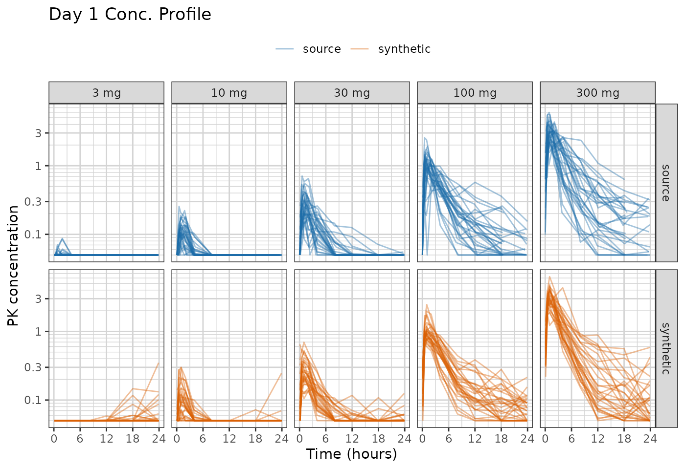
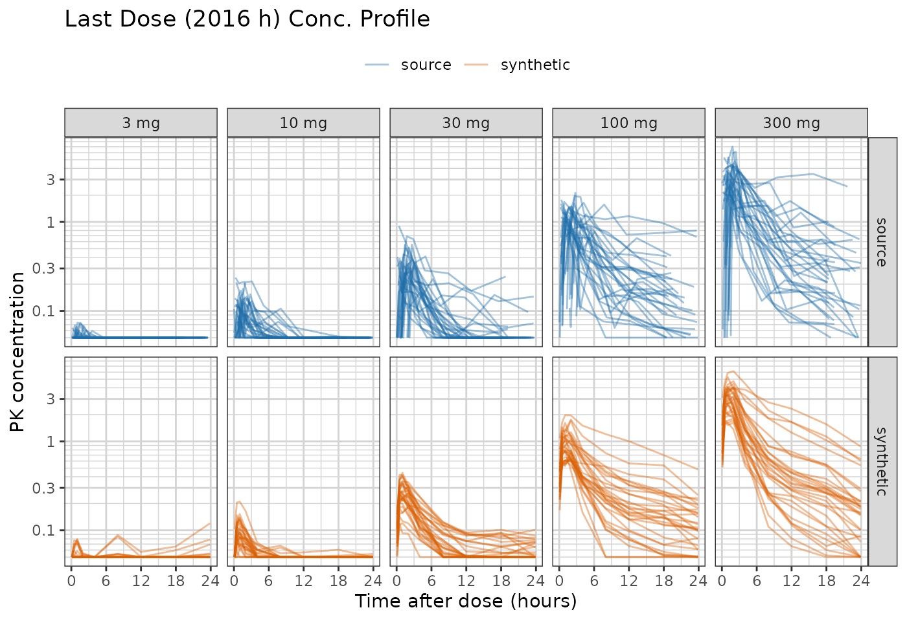
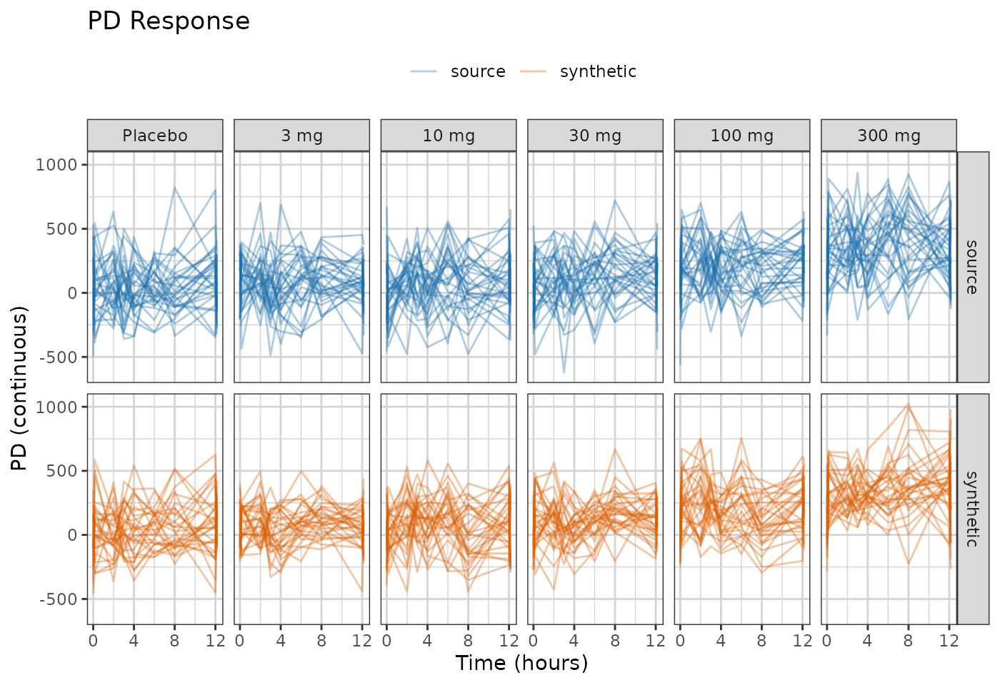
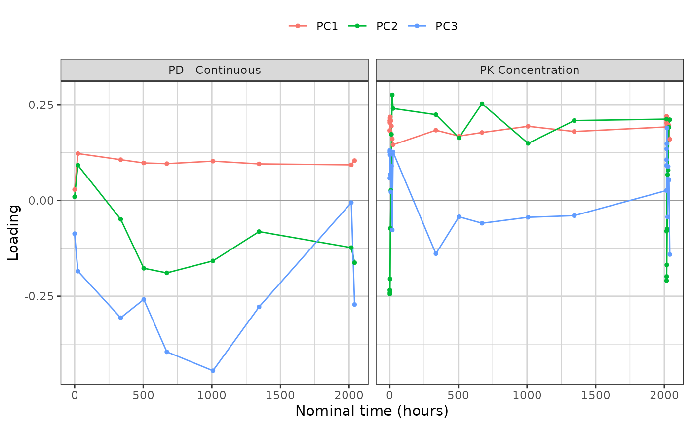
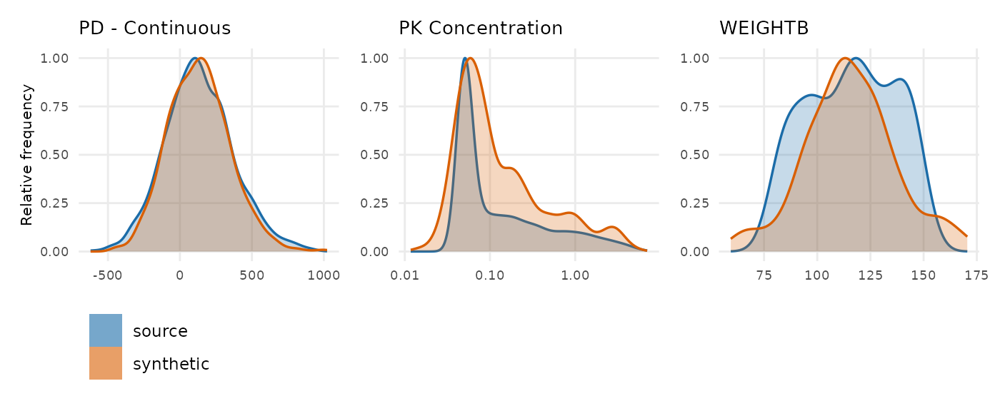

# Demo: Using synpmx_pca

Generate a synthetic dataset from a fitted trial_summary rather than
from real patients’ values, look at it, and read the checks of the data.

[`synpmx_pca_summarize()`](https://iamstein.github.io/synpmx/reference/synpmx_pca_summarize.md)
reduces the study to summaries and
[`synpmx_pca_generate()`](https://iamstein.github.io/synpmx/reference/synpmx_pca_generate.md)
builds a dataset from those summaries alone. No number a patient
measured reaches the output. What it carries out of the source is a
mean, a scale, a set of principal-component loadings, one mean score
vector per arm, a residual covariance, and a dosing and visit
trial_summary per arm.

It makes no formal privacy claim, and it is not for estimation. The full
specification is in
[`vignette("pca-algorithm")`](https://iamstein.github.io/synpmx/articles/pca-algorithm.md).

The dataset is
[`xgxr::case1_pkpd`](https://rdrr.io/pkg/xgxr/man/case1_pkpd.html): 180
patients, six arms from placebo to 300 mg, with a pharmacokinetic (PK)
concentration endpoint and a continuous pharmacodynamic (PD) endpoint.

## Configuration

To run this on your own study, edit the two chunks below that:

1.  Read in the dataset.
2.  Define the column roles.

The rest of the code can be kept as is.

``` r

library(dplyr)
raw <- as.data.frame(get(utils::data(list = "case1_pkpd", package = "xgxr"))) |>
  mutate(CENS = ifelse(NAME == "PD - Continuous", 0, CENS))
SEED <- 808
```

The column meanings. Columns not specified here are dropped from the
synthetic dataset.

``` r

roles <- pmx_roles(
  id           = "ID",
  time         = "TIME",
  dv           = "LIDV",
  cens         = "CENS",
  amt          = "AMT",
  evid         = "EVID",
  cmt          = "CMT",
  dvid         = "NAME",        # which endpoint each observation row is
  nominal_time = "NOMTIME",     # required: the grid the trial_summary is built on
  strata       = c("TRTACT", "DOSE"), # treatment arms, and the score trial_summary's groups
  covariates   = "WEIGHTB",     # drawn jointly with the trajectories
  keep         = "STUDY"        # carried through verbatim
)
```

## Summarize the Study

Generation happens in two steps, and they are separate so that the first
can be looked at before the second runs.
[`synpmx_pca_summarize()`](https://iamstein.github.io/synpmx/reference/synpmx_pca_summarize.md)
is the only step that reads patient data.

``` r

trial_summary <- synpmx_pca_summarize(raw, roles)
trial_summary
#> A trial summary, from synpmx_pca_summarize()
#> 
#>   fitted on    180 patients, 6 arm(s): Placebo / 0 (30), 3 mg / 3 (30), 10 mg / 10 (30), 30 mg / 30 (30), 100 mg / 100 (30), 300 mg / 300 (30) 
#>   endpoints    PD - Continuous (9 visits modelled), PK Concentration (24 visits modelled) 
#>   covariates   WEIGHTB 
#>   components   11 (91% of variance) 
#>   dose term    factor 
#>   dosing       85 planned cycle(s) per arm | no reductions, interruptions or early stops 
#> 
#> synpmx_pca_generate() reads this object and nothing else. To look inside it:
#>   pca_report()      what it read out of the source data
#>   pca_dosing()      the planned dose schedule, per arm
#>   pca_dose_rates()  reduction, interruption and discontinuation
#>   pca_visits()      the probability of a visit, per arm
#>   pca_components()  the loadings, over time
```

**`nominal_time` is required.** The grid it names is the axis every
feature sits on, and dose rows and observation rows are placed on it
together, so the timing comes through at its source values: doses per
patient, the last dose, the end of follow-up, the baseline sample before
the first dose. A study that does not carry a nominal-time column needs
the protocol’s planned times added as one first: choosing where a visit
belongs is a statement about the protocol rather than something to infer
from recorded times.

`strata` is load-bearing. It names the arms, and the arms are the groups
the score trial_summary is fitted against: each one gets its own mean
score vector and its own residual covariance. An arm of fewer than three
patients has no spread of its own to trial_summary, so the function
refuses rather than generating from one or two people.
`min_arm_patients` is where that floor is set.

## What the summary read out of the source

``` r

show(as.data.frame(pca_report(trial_summary)),
     "What the summary read out of the source data")
```

``` r

pca_report(trial_summary)
```

`min_patients` is the column to read. A grid cell or a covariate mean is
backed by most of the cohort; a per-arm quantity is backed by one arm.

## The dosing trial_summary

Dosing is not copied from anybody. Each arm contributes a planned
schedule and three rates saying how its patients departed from it.

``` r

show(head(pca_dosing(trial_summary), 6), "The planned schedule, first cycles")
```

``` r

show(pca_dose_rates(trial_summary), "How patients departed from the plan")
```

``` r

head(pca_dosing(trial_summary), 6)
pca_dose_rates(trial_summary)
```

All three rates are zero here and each arm has a single dose level, so
every generated patient receives the planned schedule exactly, and the
generated dataset holds the same 85 doses per patient the source did.

That is the point of expressing it this way rather than copying a
schedule. On an oncology study the same three rates are not zero:
patients are reduced to a fraction of their starting dose, skip cycles,
and come off treatment at different times, and generated patients then
differ from one another in the same way the source patients did.
Relative dose intensity and time on treatment are often what such a
dataset exists to analyse.
[`vignette("pca-algorithm")`](https://iamstein.github.io/synpmx/articles/pca-algorithm.md)
sets out how the rates are estimated and what they do and do not
protect.

## The visit trial_summary

``` r

library(ggplot2)
library(xgxr)
xgx_theme_set()
comparison_colours <- c(source = "#1B6CA8", synthetic = "#D95F02")
```

``` r

ggplot(pca_visits(trial_summary), aes(time, probability, colour = arm)) +
  geom_line() +
  facet_wrap(~endpoint, scales = "free_x") +
  labs(x = "Nominal time (hours)", y = "P(observation)", colour = NULL) +
  theme(legend.position = "top")
```


Attendance is drawn per visit from these probabilities, so no real
patient’s set of attended visits is reused.

## Generate Synthetic Data

Everything above is what the synthetic data will be built from.
[`synpmx_pca_generate()`](https://iamstein.github.io/synpmx/reference/synpmx_pca_generate.md)
reads the trial_summary and a subject count, and no patient row is in
scope while it runs.

``` r

synthetic <- synpmx_pca_generate(trial_summary, seed = SEED)
```

`synpmx_pca(raw, roles, seed = SEED)` is the same two calls in one, for
when there is no reason to stop and look.

## Plot synthetic data and original data

``` r

both <- rbind(
  cbind(raw[, names(synthetic)], DATA = "source"),
  cbind(synthetic, DATA = "synthetic")
)
obs <- both[both$EVID == 0 & !is.na(both$LIDV), ]
obs$TRTACT <- factor(obs$TRTACT,
                     levels = c("Placebo", "3 mg", "10 mg", "30 mg",
                                "100 mg", "300 mg"))
```

``` r

ggplot(obs[obs$NAME == "PK Concentration" & obs$TIME <= 24, ],
       aes(TIME, LIDV, group = ID, colour = DATA)) +
  geom_line(alpha = 0.4) +
  facet_grid(DATA~TRTACT) +
  xgx_scale_y_log10() +
  xgx_scale_x_time_units("hours", breaks = seq(0, 24, by = 6)) +
  scale_colour_manual(values = comparison_colours) +
  labs(x = "Time (hours)", y = "PK concentration", colour = NULL) +
  theme(legend.position = "top") +
  ggtitle("Day 1 Conc. Profile")
```



`case1_pkpd` samples richly twice: on day 1 above, and again around the
last dose at 2016 h. The second profile is the one that says whether the
generator held together over the whole study rather than only at its
start.

``` r

last_dose <- obs[obs$NAME == "PK Concentration" &
                   obs$TIME >= 2016 & obs$TIME <= 2040, ]
last_dose$TAD <- last_dose$TIME - 2016

ggplot(last_dose, aes(TAD, LIDV, group = ID, colour = DATA)) +
  geom_line(alpha = 0.4) +
  facet_grid(DATA~TRTACT) +
  xgx_scale_y_log10() +
  xgx_scale_x_time_units("hours", breaks = seq(0, 24, by = 6)) +
  scale_colour_manual(values = comparison_colours) +
  labs(x = "Time after dose (hours)", y = "PK concentration", colour = NULL) +
  theme(legend.position = "top") +
  ggtitle("Last Dose (2016 h) Conc. Profile")
```



The censored fraction in this window tracks the source arm by arm, and
so do the medians in the two arms that have enough above-limit data to
have one.

``` r

blq <- function(data, label) {
  rows <- data$EVID == 0 & data$NAME == "PK Concentration" &
    !is.na(data$LIDV) & data$TIME >= 2016 & data$TIME <= 2040
  out <- aggregate(list(pct_blq = data$CENS[rows] == 1),
                   list(arm = data$TRTACT[rows]), function(x) round(100 * mean(x)))
  out$median <- aggregate(list(m = data$LIDV[rows]),
                          list(arm = data$TRTACT[rows]),
                          function(x) round(stats::median(x), 3))$m
  stats::setNames(out, c("arm", paste0(c("pct_blq_", "median_"), label)))
}
blq_table <- merge(blq(raw, "source"), blq(synthetic, "synthetic"), by = "arm")
if (has_dt) show(blq_table, "Censoring in the last-dose window") else blq_table
```

``` r

ggplot(obs[obs$NAME == "PD - Continuous", ],
       aes(TIME, LIDV, group = ID, colour = DATA)) +
  geom_line(alpha = 0.35) +
  xgx_scale_x_time_units(units_dataset = "hours", units_plot = "weeks") +
  facet_grid(DATA~TRTACT) +
  scale_colour_manual(values = comparison_colours) +
  labs(x = "Time (hours)", y = "PD (continuous)", colour = NULL) +
  theme(legend.position = "top") +
  ggtitle("PD Response")
```



The synthetic profiles are smoother than the source ones. The
trial_summary holds a handful of components, and everything outside
them, including measurement noise visit to visit, is not reproduced.

The low-dose arms sit flat on the assay limit in both panels. That is
the censoring being put back: the drawn value is the latent one, and
where the source declared a lower limit of quantification the reported
value, `CENS` and `LIMIT` are rebuilt from it together. The basis itself
is fitted on values drawn inside the censoring region rather than on the
stack of identical limits, so it describes the patients rather than the
assay.

## Reading the components

A principal component is a direction in the space of whole trajectories,
and its loadings say how much each visit contributes to it. Plotted
against time rather than tabulated, the components become curves: a
component that is flat and positive across a profile is overall
magnitude, and one that crosses zero separates early visits from late
ones.

``` r

components <- pca_components(trial_summary)
ggplot(subset(components, component %in% c("PC1", "PC2", "PC3") &
                 !is.na(time)),
       aes(time, loading, colour = component)) +
  geom_hline(yintercept = 0, linewidth = 0.3, colour = "grey60") +
  geom_line() + geom_point(size = 1) +
  facet_wrap(~endpoint, scales = "free_x") +
  labs(x = "Nominal time (hours)", y = "Loading", colour = NULL) +
  theme(legend.position = "top")
```



``` r

variance <- attr(pca_components(trial_summary), "variance_explained")
variance$variance_explained <- round(variance$variance_explained, 3)
variance$cumulative <- round(variance$cumulative, 3)
show(variance, "Variance explained, per component")
```

``` r

attr(pca_components(trial_summary), "variance_explained")
```

Describe what the curve shows rather than naming a mechanism for it. A
component that separates early from late looks like a difference in
decline rate, and calling it a half-life would be a claim the fit cannot
support: no clearance was estimated, and a score standard deviation is a
variance decomposition rather than a pharmacokinetic parameter. That is
the price of this basis, and
[`vignette("pca-algorithm")`](https://iamstein.github.io/synpmx/articles/pca-algorithm.md)
states what the alternative would cost.

## Distributions of Synthetic and Original Data

``` r

compare_pmx_distributions(raw, synthetic, roles)
```



## The scorecard

[`synpmx_scorecard()`](https://iamstein.github.io/synpmx/reference/synpmx_scorecard.md)
computes checks of the synthetic dataset. Each row names a question, and
the `explore` column names the call that answers it in full.

``` r

scorecard <- synpmx_scorecard(raw, synthetic, roles)
synpmx_scorecard_datatable(scorecard)
```

**Fifteen of the eighteen rows read the source and synthetic tables
directly** and answer for any generated dataset.

**Three read `unavailable`, and that is not the same as unanswered.**
B1a, B1b and C2 expect a run record on the generated table, as a
`pmx_settings` attribute, and this table carries none. B4a and B4b ask
the copy question directly on the finished tables, and both read zero.

**C2 is the one to be careful about.** It asks how many distinct
dose-time schedules survived, and this is the row where the loss is
largest — one schedule per arm, against one per patient in a study
recording actual dose times. Read
[`pca_dosing()`](https://iamstein.github.io/synpmx/reference/pca_dosing.md)
in its place, where `distinct` and `share` say the same thing per arm.

## Where to go next

- [`vignette("pca-algorithm")`](https://iamstein.github.io/synpmx/articles/pca-algorithm.md)
  — every step of this algorithm, and what each one reads out of the
  source.
- [`vignette("pca-fingerprint")`](https://iamstein.github.io/synpmx/articles/pca-fingerprint.md)
  — every quantity the fingerprint holds, in detail.
- [Evaluating the PCA generator on public
  data](https://iamstein.github.io/synpmx/articles/pca-public-data-examples.html)
  — the same generator over eight public studies, and what each one’s
  nominal grid cost.
- [The synpmx data generation
  algorithms](https://iamstein.github.io/synpmx/articles/synpmx-methods.html)
  — the other generation modes, and which one to use when.
