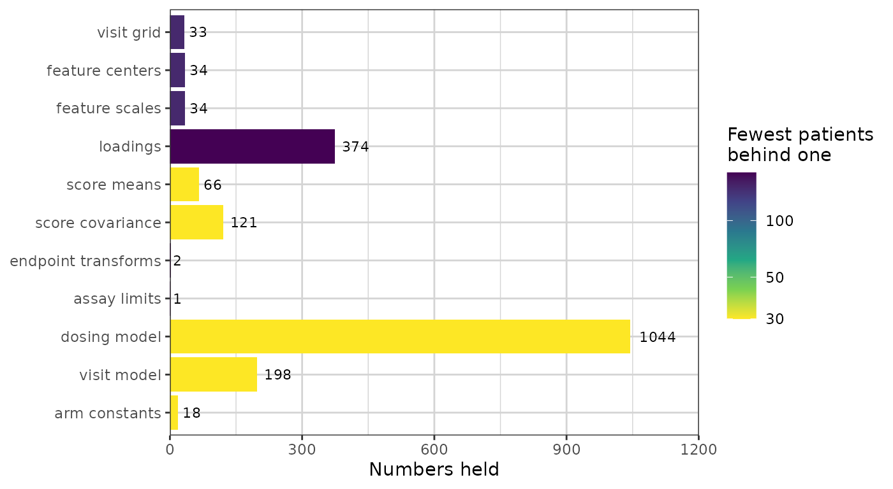
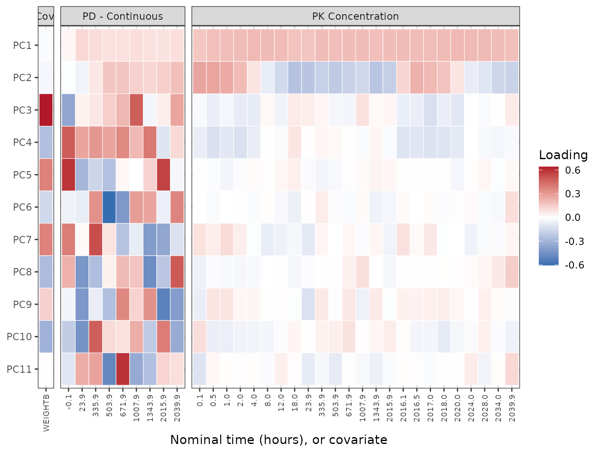
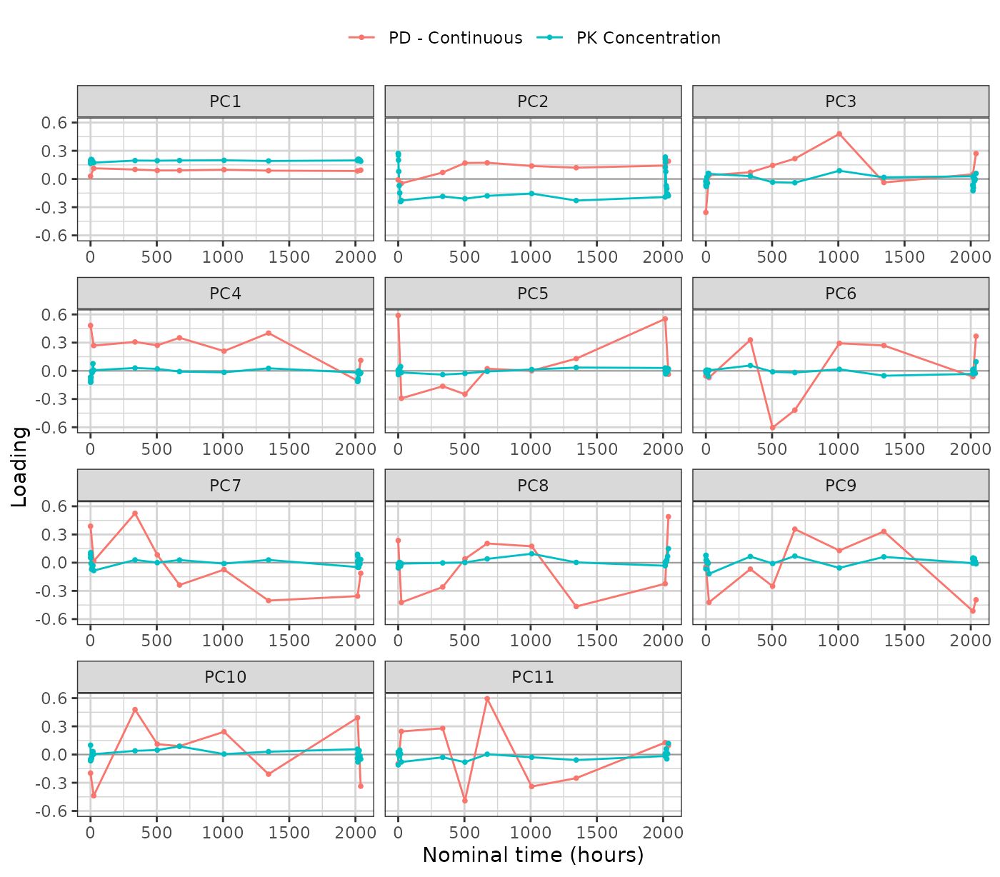
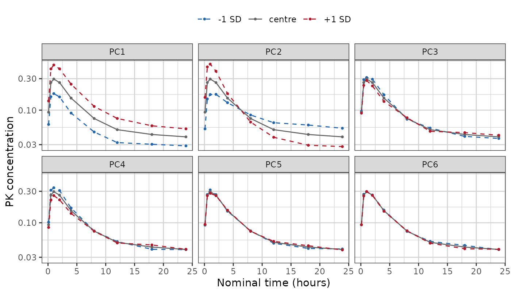
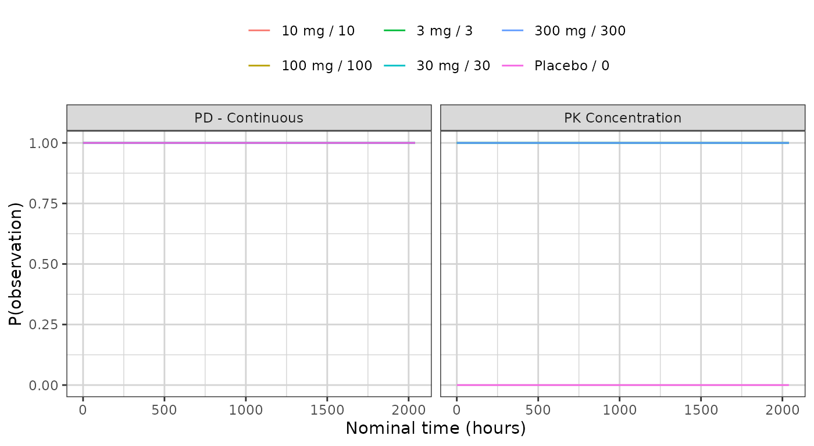

# The PCA study fingerprint

Every generator in this package reduces a study to a **fingerprint** — a
set of summaries small enough to carry out of the environment that holds
the real data, and complete enough to build a synthetic study from. The
fingerprint is the whole of what a synthetic dataset descends from.
Nothing else about the source reaches it, which is why looking at the
fingerprint is how you decide whether the output can be trusted, and how
you satisfy yourself that no patient left the room.

[`synpmx_pca_summarize()`](https://iamstein.github.io/synpmx/reference/synpmx_pca_summarize.md)
returns this generator’s fingerprint, as a `pmx_trial_summary`.
[`synpmx_pca_generate()`](https://iamstein.github.io/synpmx/reference/synpmx_pca_generate.md)
reads that object and no patient row.

This vignette walks through it group by group. It is a reference: read
[`vignette("pca-demo")`](https://iamstein.github.io/synpmx/articles/pca-demo.md)
first for a run end to end, and
[`vignette("pca-algorithm")`](https://iamstein.github.io/synpmx/articles/pca-algorithm.md)
for how each quantity is estimated and why.
[`vignette("pmxmodel-fingerprint")`](https://iamstein.github.io/synpmx/articles/pmxmodel-fingerprint.md)
is the same walk through the PMX model generator’s fingerprint, and the
two are worth reading side by side — they carry the same apparatus and a
completely different description of the profiles.

The object is a plain list, and the names used below are its own, so a
quantity can be reached directly when no accessor covers it.

## The study

``` r

library(dplyr)
raw <- as.data.frame(get(utils::data(list = "case1_pkpd", package = "xgxr"))) |>
  mutate(CENS = ifelse(NAME == "PD - Continuous", 0, CENS))

roles <- pmx_roles(
  id           = "ID",
  time         = "TIME",
  dv           = "LIDV",
  cens         = "CENS",
  amt          = "AMT",
  evid         = "EVID",
  cmt          = "CMT",
  dvid         = "NAME",
  nominal_time = "NOMTIME",
  strata       = c("TRTACT", "DOSE"),
  covariates   = "WEIGHTB",
  keep         = "STUDY"
)

trial_summary <- synpmx_pca_summarize(raw, roles, seed = 808)
trial_summary
#> A trial summary, from synpmx_pca_summarize()
#> 
#>   fitted on    180 patients, 6 arm(s): Placebo / 0 (30), 3 mg / 3 (30), 10 mg / 10 (30), 30 mg / 30 (30), 100 mg / 100 (30), 300 mg / 300 (30) 
#>   endpoints    PD - Continuous (9 visits modelled), PK Concentration (24 visits modelled) 
#>   covariates   WEIGHTB 
#>   components   11 (91% of variance) 
#>   dose term    factor 
#>   dosing       85 planned cycle(s) per arm | no reductions, interruptions or early stops 
#> 
#> synpmx_pca_generate() reads this object and nothing else. To look inside it:
#>   pca_report()      what it read out of the source data
#>   pca_dosing()      the planned dose schedule, per arm
#>   pca_dose_rates()  reduction, interruption and discontinuation
#>   pca_visits()      the probability of a visit, per arm
#>   pca_components()  the loadings, over time
```

## The inventory

[`pca_report()`](https://iamstein.github.io/synpmx/reference/pca_report.md)
is the top-level account: one row per released quantity, how many
numbers it holds, and the smallest number of patients standing behind
any one of them.

``` r

show(as.data.frame(pca_report(trial_summary)),
     "Every quantity read out of the source data")
```

``` r

pca_report(trial_summary)
```

It is a lot of numbers, and how they are distributed is the part worth
seeing before any of them. The same table drawn:

``` r

library(ggplot2)
library(xgxr)
xgx_theme_set()

inventory <- as.data.frame(pca_report(trial_summary))
inventory$quantity <- factor(inventory$quantity,
                             levels = rev(inventory$quantity))
ggplot(inventory, aes(quantity, numbers, fill = min_patients)) +
  geom_col() +
  geom_text(aes(label = numbers), hjust = -0.25, size = 3) +
  coord_flip() +
  scale_y_continuous(expand = expansion(mult = c(0, 0.15))) +
  scale_fill_viridis_c(trans = "log10", direction = -1) +
  labs(x = NULL, y = "Numbers held",
       fill = "Fewest patients\nbehind one")
```



**The dosing model is the largest group, and that is a fact about this
study rather than about the method.** It holds a time and an amount per
planned cycle per arm, and `case1_pkpd` doses daily for twelve weeks
across six arms, so roughly 85 cycles each. A single-dose study’s row
would be six numbers long. The loadings are the next largest and are the
group that does grow with the method: one number per component per
feature, so they scale as the basis widens.

**Size and exposure are independent, and the figure is here to show that
they are.** The loadings are the whole cohort’s — every subject
contributes to every one, so all 180 patients stand behind each — while
the dosing and visit models beside them are fitted per arm, so 30 do.
The longest bar in the figure is therefore one of the *most* exposed
quantities rather than one of the least. Length and fill say different
things and have to be read separately: the combination to look for is a
long bar whose fill sits at the bottom of the scale, which is many
numbers each backed by few people. Here the dosing model is exactly
that.

The column is for judging where inside this object the risk is
concentrated. It is not a release decision:
[`synpmx_pca()`](https://iamstein.github.io/synpmx/reference/synpmx_pca.md)
makes no formal privacy claim, and
[`pca_features()`](https://iamstein.github.io/synpmx/reference/pca_features.md)
and
[`pca_scores()`](https://iamstein.github.io/synpmx/reference/pca_scores.md)
return their tables marked `"restricted_not_releasable"` whatever this
figure shows.

Every section below expands one of those rows.

## The settings that produced it

Short, so printed.

``` r

unlist(trial_summary$settings)
#>           dose_term        pca_variance min_column_patients    min_arm_patients 
#>            "factor"               "0.9"                "18"                 "3"
c(patients = trial_summary$n_source, components = trial_summary$basis$k)
#>   patients components 
#>        180         11
```

## The arms

Sizes are what the generated cohort is split by, in the same
proportions.

``` r

data.frame(
  arm = trial_summary$arms$arms,
  patients = as.integer(trial_summary$arms$sizes[trial_summary$arms$arms])
)
#>           arm patients
#> 1  Placebo\r0       30
#> 2     3 mg\r3       30
#> 3   10 mg\r10       30
#> 4   30 mg\r30       30
#> 5 100 mg\r100       30
#> 6 300 mg\r300       30
```

## The feature grid

Every column of the matrix the components are built on: one per baseline
covariate, and one per endpoint per retained nominal time. `patients` is
how many subjects hold an observation in that cell, and cells held by
fewer than `min_column_patients` were dropped rather than modelled.

``` r

show(as.data.frame(pca_features(trial_summary)),
     "Every feature, with its mean and standard deviation", paged = TRUE)
```

`center` and `scale` are on the modelling scale, which the `transform`
column names: the log scale for a positive endpoint, the original scale
otherwise.

## The endpoint transforms and assay limits

``` r

basis <- trial_summary$basis
digits3(data.frame(
  endpoint = names(basis$transforms),
  transform = vapply(basis$transforms, function(t) t$method, character(1)),
  offset = signif(vapply(basis$transforms, function(t) t$offset, numeric(1)), 3),
  lloq = vapply(trial_summary$schema$censoring, function(c) {
    if (is.null(c$left)) NA_real_ else c$left
  }, numeric(1)),
  row.names = NULL
))
#>           endpoint  transform offset lloq
#> 1  PD - Continuous   identity  0.000   NA
#> 2 PK Concentration log_offset  0.025 0.05
```

The offset keeps [`log()`](https://rdrr.io/r/base/Log.html) finite near
zero. The lower limit of quantification is what a generated value below
it is reported at, with `CENS` set.

## The components

[`pca_components()`](https://iamstein.github.io/synpmx/reference/pca_components.md)
gives one loading per component and retained feature, and the loadings
are the largest thing in the object. This section shows all of them,
three ways: the whole matrix at once, then every component as a curve,
then what each one does to a profile in the units the study measured.

``` r

show(attr(pca_components(trial_summary), "variance_explained"),
     "Variance explained, per component")
```

``` r

components <- pca_components(trial_summary)
c(components = trial_summary$basis$k,
  features = length(trial_summary$basis$columns),
  loadings = nrow(components))
#> components   features   loadings 
#>         11         34        374
```

### All of them at once

Every loading in the object, as one tile each: components down the side,
features across, and the features grouped by what they belong to. This
is the complete basis — nothing below adds a number this figure does not
already carry.

``` r

# One panel per endpoint plus one for the covariates, with the cells of each
# endpoint in time order. `feature` is the object's own name for a cell and is
# unique, which is what makes it a safe axis; the label under it is the reading.
grid <- unique(components[, c("feature", "endpoint", "time")])
# `space = "free_x"` sizes each panel by its column count, so the covariate
# panel is one column wide and its strip has room for a short word only.
grid$group <- ifelse(is.na(grid$endpoint), "Cov.", grid$endpoint)
grid <- grid[order(grid$group, grid$time, grid$feature), ]
grid$label <- ifelse(is.na(grid$time), sub("^cov_", "", grid$feature),
                     format(grid$time, trim = TRUE))

heatmap_data <- merge(components, grid[, c("feature", "group", "label")],
                      by = "feature")
heatmap_data$feature <- factor(heatmap_data$feature, levels = grid$feature)
heatmap_data$component <- factor(
  heatmap_data$component,
  levels = rev(paste0("PC", seq_len(trial_summary$basis$k)))
)

ggplot(heatmap_data, aes(feature, component, fill = loading)) +
  geom_tile(colour = "white", linewidth = 0.2) +
  facet_grid(~group, scales = "free_x", space = "free_x") +
  scale_x_discrete(labels = stats::setNames(grid$label, grid$feature)) +
  scale_fill_gradient2(low = "#2166AC", mid = "white", high = "#B2182B",
                       midpoint = 0) +
  labs(x = "Nominal time (hours), or covariate", y = NULL, fill = "Loading") +
  theme(axis.text.x = element_text(angle = 90, hjust = 1, vjust = 0.5,
                                   size = 7),
        panel.grid = element_blank())
```



Read it row by row. **A row of one colour is overall magnitude**: the
component moves every visit the same way, which is what PC1 does across
the PK panel. **A row that changes colour along a panel separates early
visits from late**, which is PC2. **A row with colour in one panel and
none in another is specific to that endpoint** — PC3 is almost entirely
the weight covariate, and PC4 downwards are almost entirely the PD
endpoint.

What the figure does **not** show is the loadings shrinking as the
components go down. Each component’s loadings have the same total mass,
because the decomposition returns them at unit length, so a later
component is not a fainter version of an earlier one: it is the same
mass placed on fewer features. The PK panel pales towards the bottom
because that mass has moved to the PD panel, not because it has gone.
How much variance each component actually explains is the table above,
and where each one puts its mass is the table below.

The same numbers, sortable:

``` r

show(components, "Every loading, by component and feature", paged = TRUE)
```

### Every component as a curve

The heatmap shows the whole matrix and hides the shape. One panel per
component gives the shapes back, and there is one panel for every
component rather than the first few:

``` r

curves <- subset(components, !is.na(time))
curves$component <- factor(curves$component,
                           levels = paste0("PC", seq_len(trial_summary$basis$k)))
ggplot(curves, aes(time, loading, colour = endpoint)) +
  geom_hline(yintercept = 0, linewidth = 0.3, colour = "grey60") +
  geom_line() + geom_point(size = 0.7) +
  facet_wrap(~component, ncol = 3, scales = "free_x") +
  labs(x = "Nominal time (hours)", y = "Loading", colour = NULL) +
  theme(legend.position = "top")
```



The covariates carry no time and so are absent from this figure; the
heatmap above and the mass table below are where they appear.

### Where each component sits

One matrix carries the covariates and every endpoint together, so a
single draw keeps the relationships between them. The loading mass per
component says where each one is concentrated:

``` r

mass <- tapply(
  components$loading^2,
  list(components$component,
       ifelse(is.na(components$endpoint), "covariate", components$endpoint)),
  sum
)
mass <- mass[paste0("PC", seq_len(nrow(mass))), , drop = FALSE]
show(data.frame(component = rownames(mass), as.data.frame(mass),
                check.names = FALSE),
     "Share of each component's loading mass, by endpoint and covariate")
```

``` r

signif(mass, 3)
```

Each row sums to one. On this study the first two components are almost
entirely the PK profile, and the covariate only enters further down —
alongside the PD endpoint, which is the joint structure that a separate
decomposition per endpoint would have thrown away.

### What a component does to a profile

A loading is a number on the standardized modelling scale, so the
figures above say which visits a component is concentrated on and not
what moving along it looks like.
[`pca_component_effect()`](https://iamstein.github.io/synpmx/reference/pca_component_effect.md)
answers the second question by running the generator’s own inversion:
from the cohort centre, move one component by a score standard
deviation, undo the standardization and the log transform, and report
what comes back in the study’s own units.

``` r

# The first day only. This study samples densely over 0-24 h and again around
# the last dose at 2016 h, with troughs in between, so a study-time axis crushes
# both dense windows into vertical spikes and shows the shape of neither.
effect <- pca_component_effect(trial_summary, sds = 1)
shown <- subset(effect, !is.na(time) & endpoint == "PK Concentration" &
                  time <= 24 &
                  component %in% paste0("PC", seq_len(min(6, trial_summary$basis$k))))
shown$component <- factor(shown$component, levels = paste0("PC", 1:6))
shown$step <- factor(shown$score_sd, levels = c(-1, 0, 1),
                     labels = c("-1 SD", "centre", "+1 SD"))

ggplot(shown, aes(time, value, colour = step, linetype = step)) +
  geom_line() + geom_point(size = 0.7) +
  facet_wrap(~component, ncol = 3) +
  scale_y_log10() +
  scale_colour_manual(values = c("-1 SD" = "#2166AC", "centre" = "grey40",
                                 "+1 SD" = "#B2182B")) +
  scale_linetype_manual(values = c("-1 SD" = "dashed", "centre" = "solid",
                                   "+1 SD" = "dashed")) +
  labs(x = "Nominal time (hours)", y = "PK concentration", colour = NULL,
       linetype = NULL) +
  theme(legend.position = "top")
```



The grey curve is the same in every panel: it is the cohort centre,
which is score zero on every component. The two dashed curves are one
score standard deviation either side along that panel’s component alone.

**PC1 moves the whole profile up and down together** — the concentration
is higher or lower at every hour, and the shape does not change. **PC2
pivots it**: the two dashed curves cross around 6 h, so one describes a
subject higher early and lower late and the other the reverse. **PC3
onwards barely move this endpoint at all**, and by PC5 the dashed curves
have closed onto the centre. That is the heatmap’s last row read in the
study’s units: those components are not weak, they are elsewhere — on
the PD endpoint and the covariate.

**Describe the curves; do not name a mechanism for them.** A component
that raises early values and lowers late ones looks like a difference in
decline rate, and calling it a half-life would be a claim the fit cannot
support: no clearance was estimated here, and a score standard deviation
is a variance decomposition rather than a pharmacokinetic parameter.

The covariates move under the same displacement, and that is the joint
structure the shared matrix buys. Weight against the first four
components:

``` r

covariate_effect <- subset(
  pca_component_effect(trial_summary, sds = 1),
  kind != "endpoint_cell" &
    component %in% paste0("PC", seq_len(min(4, trial_summary$basis$k)))
)
wide <- stats::reshape(
  covariate_effect[, c("component", "covariate", "score_sd", "value")],
  idvar = c("component", "covariate"), timevar = "score_sd",
  direction = "wide"
)
names(wide) <- c("component", "covariate", "minus_1sd", "centre", "plus_1sd")
digits3(`rownames<-`(wide, NULL))
#>   component covariate minus_1sd centre plus_1sd
#> 1       PC1   WEIGHTB       116    116      115
#> 2       PC2   WEIGHTB       117    116      115
#> 3       PC3   WEIGHTB       102    116      130
#> 4       PC4   WEIGHTB       121    116      111
```

The weight barely moves along PC1 or PC2 and swings from 102 to 130 kg
along PC3, which is the heatmap’s third row stated in kilograms. A
generator that drew the covariates separately and merged them onto the
profiles afterwards would have no such row to show: there would be no
component on which a subject’s weight and their concentrations move
together, because the two would have been drawn independently.

## The score model

A new subject’s scores are their arm’s mean plus a fresh draw whose
spread is that arm’s residual standard deviation.

``` r

show(pca_scores(trial_summary),
     "Mean score and residual spread, per arm and component", paged = TRUE)
```

The `sd` column is the whole of the between-subject variability the
synthetic data will have. It differs by arm on purpose: an arm sitting
on the assay limit is genuinely tighter than one well above it, and
giving every arm the pooled spread would smear the low arms upward.

## The dosing model

[`pca_dosing()`](https://iamstein.github.io/synpmx/reference/pca_dosing.md)
is the planned schedule each arm starts from, and
[`pca_dose_rates()`](https://iamstein.github.io/synpmx/reference/pca_dose_rates.md)
is how its patients departed from it.

``` r

show(head(pca_dosing(trial_summary), 12),
     "The planned schedule, first cycles of each arm", paged = TRUE)
```

``` r

show(pca_dose_rates(trial_summary), "How patients departed from the plan")
```

``` r

pca_dose_rates(trial_summary)
```

All three rates are zero here and every arm has a single dose level, so
each generated patient receives the planned schedule exactly. On a study
with dose modifications the rates are not zero, and generated patients
then differ from one another as the source patients did.

## The visit model

One probability per arm, endpoint and modelled time. Attendance is drawn
independently per visit, so no real patient’s set of attended visits is
reused.

``` r

ggplot(pca_visits(trial_summary), aes(time, probability, colour = arm)) +
  geom_line() +
  facet_wrap(~endpoint, scales = "free_x") +
  labs(x = "Nominal time (hours)", y = "P(observation)", colour = NULL) +
  theme(legend.position = "top")
```



``` r

show(pca_visits(trial_summary),
     "Probability of an observation, per arm, endpoint and time", paged = TRUE)
```

## The schema

What the generated table needs in order to come back in the source’s
shape. Column prototypes are zero-length vectors: they carry class and
factor levels and no values.

``` r

schema <- trial_summary$schema
show(data.frame(
  column = schema$columns,
  class = vapply(schema$prototypes, function(p) class(p)[[1L]], character(1)),
  levels = vapply(schema$prototypes, function(p) {
    if (is.factor(p)) paste(levels(p), collapse = ", ") else ""
  }, character(1))
), "Column order and type")
```

Two entries are read from real values rather than averaged, and both are
worth knowing about. **Endpoint level sets**: a discrete endpoint has no
value between its levels, so a generated value is a source value.

``` r

data.frame(
  endpoint = names(schema$endpoint_specs),
  type = vapply(schema$endpoint_specs, function(s) s$type, character(1)),
  levels = vapply(schema$endpoint_specs, function(s) {
    if (is.null(s$levels)) "" else paste(s$levels, collapse = ", ")
  }, character(1)),
  reason = vapply(schema$endpoint_specs, function(s) s$reason, character(1)),
  row.names = NULL
)
#>           endpoint       type levels                                     reason
#> 1  PD - Continuous continuous        not every observed value is a whole number
#> 2 PK Concentration continuous        not every observed value is a whole number
```

**Arm constants**: the strata and kept columns, one value per arm,
carried verbatim onto every generated patient in it.

``` r

digits3(do.call(rbind, lapply(names(schema$arm_values), function(arm) {
  values <- schema$arm_values[[arm]]
  data.frame(arm = gsub("\r", " / ", arm, fixed = TRUE),
             as.data.frame(values, stringsAsFactors = FALSE))
})))
#>            arm  TRTACT DOSE STUDY
#> 1  Placebo / 0 Placebo    0     1
#> 2     3 mg / 3    3 mg    3     1
#> 3   10 mg / 10   10 mg   10     1
#> 4   30 mg / 30   30 mg   30     1
#> 5 100 mg / 100  100 mg  100     1
#> 6 300 mg / 300  300 mg  300     1
```

Subject identifiers are not in the schema. They are minted at
generation, and the only thing kept about the source’s identifiers is
the largest one, so a synthetic identifier cannot collide with a real
one.

``` r

c(class = schema$id_class, offset = schema$id_offset)
#>     class    offset 
#> "integer"     "180"
```

## Generating from it

Nothing beyond the object above is read.

``` r

synthetic <- synpmx_pca_generate(trial_summary, seed = 808)
c(rows = nrow(synthetic),
  subjects = length(unique(synthetic$ID)),
  valid = validate_pmx(synthetic, roles)$valid)
#>     rows subjects    valid 
#>    20520      180        1
```

## Where to go next

- [`vignette("pca-demo")`](https://iamstein.github.io/synpmx/articles/pca-demo.md)
  — one study end to end, with the source and synthetic data plotted
  against each other.
- [`vignette("pca-algorithm")`](https://iamstein.github.io/synpmx/articles/pca-algorithm.md)
  — how each quantity above is estimated, and what it does and does not
  preserve.
- [Evaluating the PCA generator on public
  data](https://iamstein.github.io/synpmx/articles/pca-public-data-examples.html)
  — the same summary read on eight public studies, side by side.
