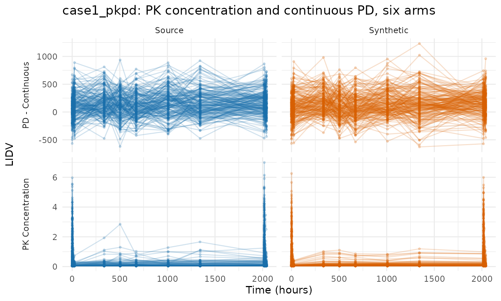
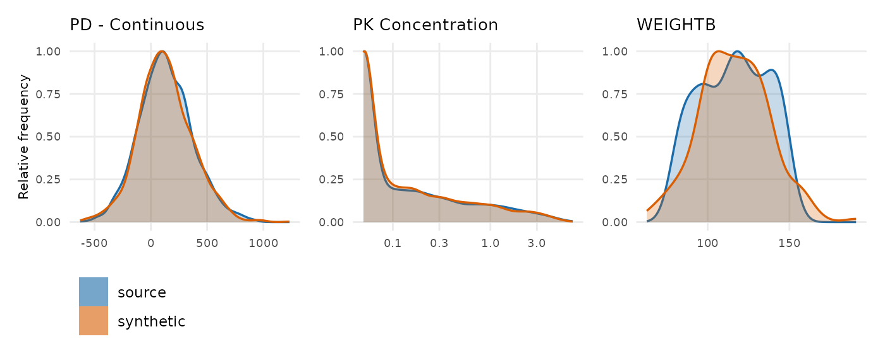
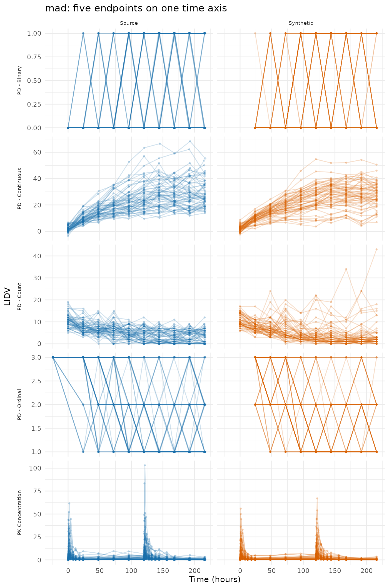
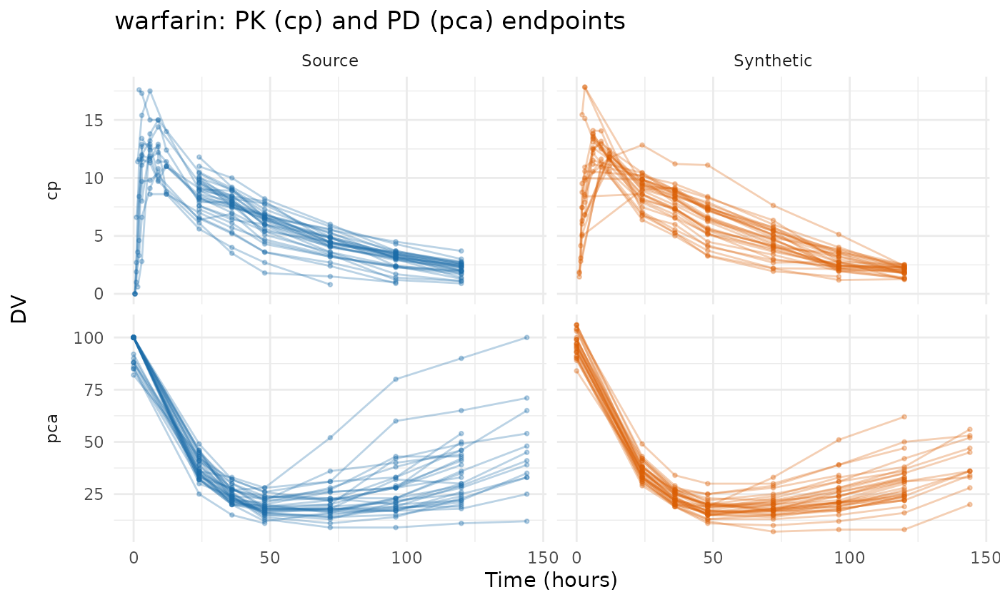
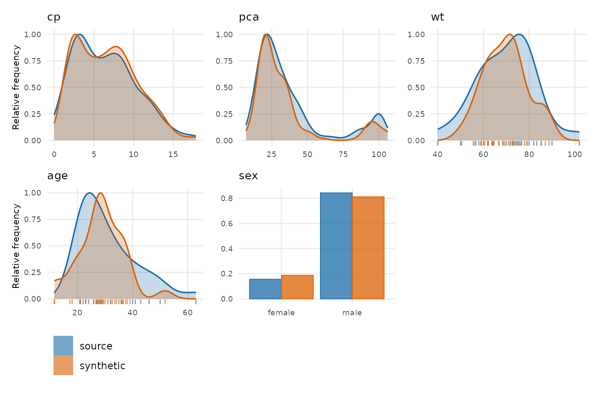
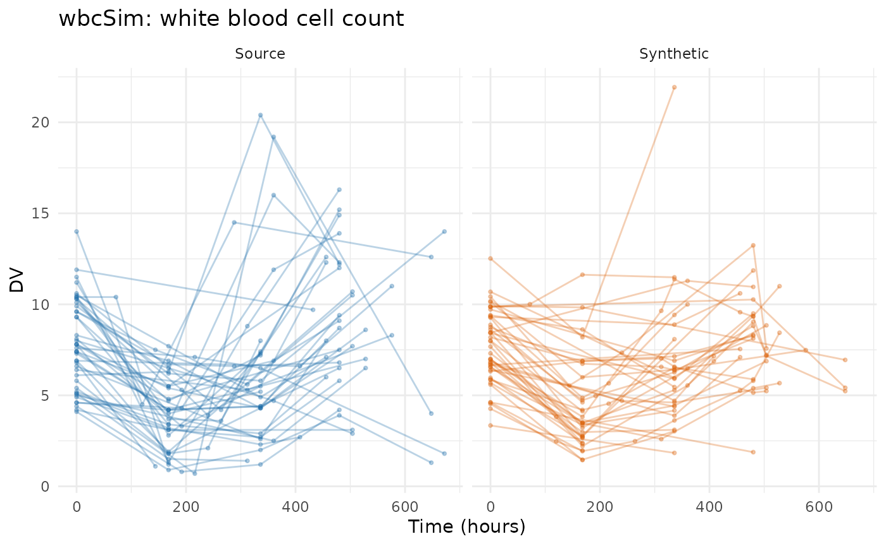
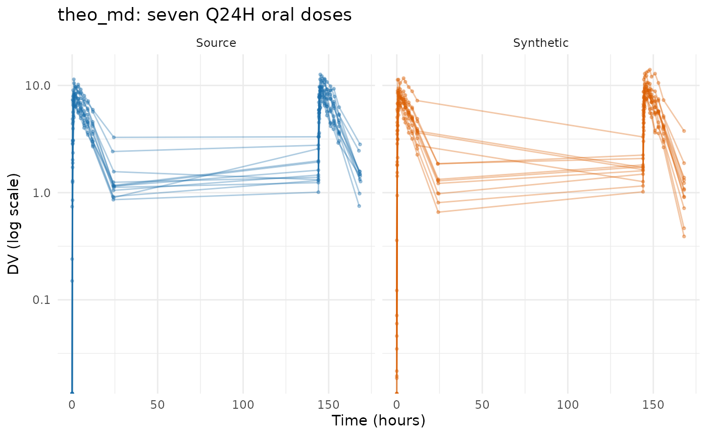
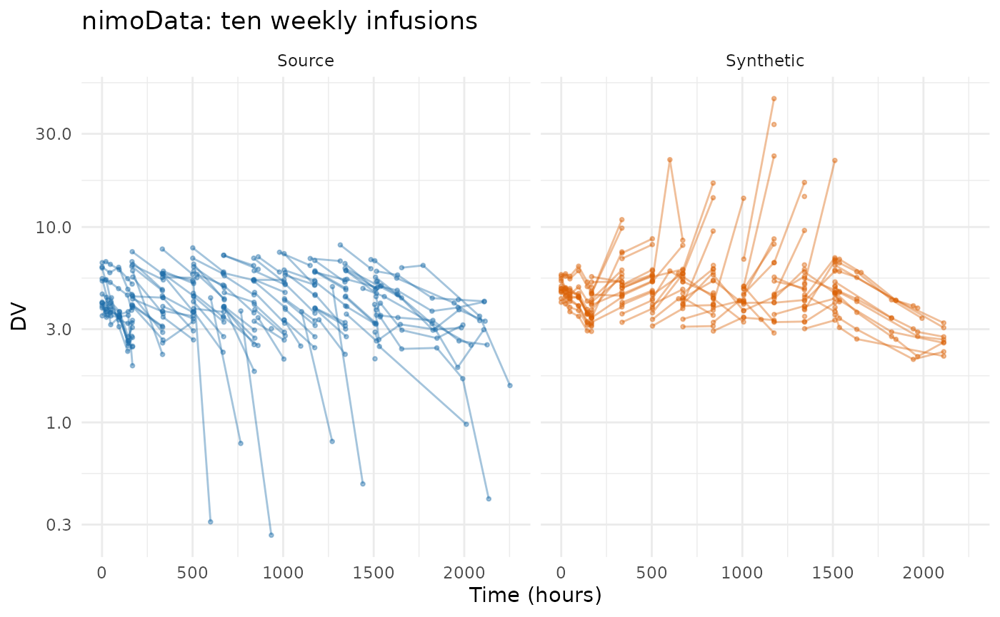
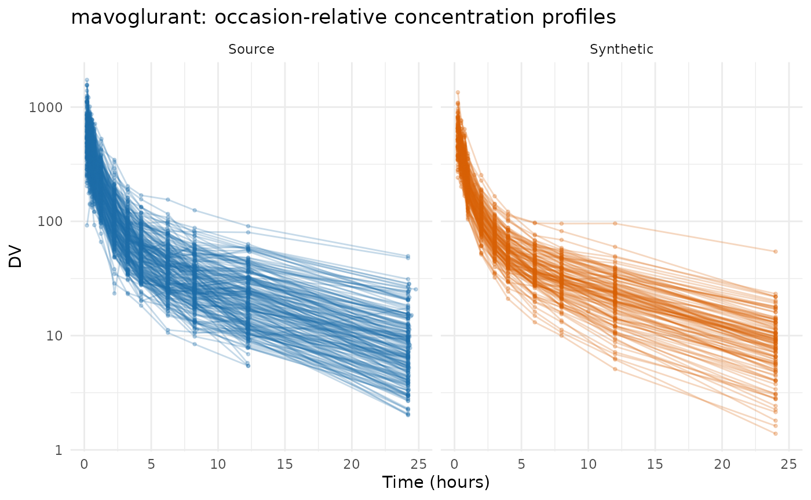

# Evaluating PCA on public data

This article runs
[`synpmx_pca()`](https://iamstein.github.io/synpmx/reference/synpmx_pca.md)
over the same eight public datasets that [Evaluating AVATAR on public
data](https://iamstein.github.io/synpmx/articles/avatar-public-data-examples.html)
runs
[`synpmx_avatar()`](https://iamstein.github.io/synpmx/reference/synpmx_avatar.md)
over, so the two generators can be read against each other on identical
studies.

The eight split three ways, and the split is the finding rather than a
presentational choice.
[`synpmx_pca()`](https://iamstein.github.io/synpmx/reference/synpmx_pca.md)
builds every feature on a declared nominal grid and refuses without one,
so **what separates these datasets is where that grid comes from.** Two
ship it: `case1_pkpd` and `mad` carry a `NOMTIME` column. Five can
supply it — `warfarin` and `wbcSim` because their recorded observation
times already are the protocol’s, and `theo_md`, `nimoData` and
`mavoglurant` because the protocol can be written down from the dose
times, the declared occasion, or an occasion-relative clock. One cannot:
`pheno_sd` is routine neonatal care with no protocol behind it, and the
generator refuses.

Seven runs follow, then three cross-dataset tables and one finding — the
copy check that fails on two of the seven, and what it does and does not
mean.

Plotting and reporting helpers used throughout this vignette

``` r

# Observation rows only, source beside synthetic on a shared y axis, one row per
# endpoint. The same shape as the AVATAR vignette's figure, reduced to what the
# PCA output needs: this generator writes onto a nominal grid, so there is no
# time-after-dose view to switch to.
overlay_plot <- function(source, synthetic, roles, title,
                         y_label = "DV", log_y = FALSE, alpha = 0.3,
                         max_time = Inf) {
  frame <- function(data, label) {
    observed <- as.character(data[[roles$evid]]) %in% c("0", "0.0") &
      !is.na(data[[roles$dv]])
    if (!is.null(roles$mdv)) {
      observed <- observed & as.character(data[[roles$mdv]]) %in% c("0", "0.0")
    }
    observed <- observed & as.numeric(data[[roles$time]]) <= max_time
    data.frame(
      dataset = factor(label, levels = c("Source", "Synthetic")),
      subject = as.character(data[[roles$id]][observed]),
      # A study whose clock resets inside an occasion needs one line per
      # occasion; joining them draws a line from the end of the first period
      # back to the start of the second.
      occasion = if (is.null(roles$occasion)) "1" else
        as.character(data[[roles$occasion]][observed]),
      time = as.numeric(data[[roles$time]][observed]),
      dv = as.numeric(data[[roles$dv]][observed]),
      endpoint = if (is.null(roles$dvid)) "DV" else
        as.character(data[[roles$dvid]][observed]),
      stringsAsFactors = FALSE
    )
  }
  plotted <- rbind(frame(source, "Source"), frame(synthetic, "Synthetic"))
  figure <- ggplot2::ggplot(
    plotted,
    ggplot2::aes(time, dv,
                 group = interaction(dataset, subject, occasion),
                 colour = dataset)
  ) +
    ggplot2::geom_line(alpha = alpha) +
    ggplot2::geom_point(alpha = alpha, size = 0.7) +
    # Endpoint down the side, source and synthetic across, so each endpoint has
    # its own y scale while source and synthetic share one. The transpose lets
    # the two panels drift onto different axes and squeezes every endpoint onto
    # a single scale, which is the arrangement the eye cannot compare.
    (if (length(unique(plotted$endpoint)) > 1L) {
      ggplot2::facet_grid(endpoint ~ dataset, scales = "free_y", switch = "y")
    } else {
      ggplot2::facet_wrap(~dataset)
    }) +
    ggplot2::scale_colour_manual(values = comparison_colours) +
    ggplot2::labs(x = "Time (hours)", y = y_label, title = title) +
    ggplot2::theme_minimal() +
    ggplot2::theme(legend.position = "none", strip.placement = "outside")
  if (isTRUE(log_y)) figure + ggplot2::scale_y_log10() else figure
}

overlay_height <- function(data, roles, per_endpoint = 2.2, minimum = 3.4) {
  observed <- as.character(data[[roles$evid]]) %in% c("0", "0.0")
  endpoints <- if (is.null(roles$dvid)) 1L else
    length(unique(data[[roles$dvid]][observed]))
  max(minimum, per_endpoint * endpoints)
}

# Every dataset is run the same way and its numbers collected in one place, so
# the cross-dataset tables at the end cannot drift from the sections above them.
runs <- list()
pca_run <- function(label, source, roles, seed) {
  summary <- synpmx_pca_summarize(source, roles, seed = seed)
  synthetic <- synpmx_pca_generate(summary, seed = seed)
  runs[[label]] <<- list(label = label, source = source, roles = roles,
                         summary = summary, synthetic = synthetic,
                         card = synpmx_scorecard(source, synthetic, roles))
  invisible(runs[[label]])
}

# Nearest-neighbour snapping onto a stated design grid. Used where a study's
# recorded times have to be placed on the protocol's planned ones; which grid to
# snap to is a statement about the study and is written out at each call.
snap_to <- function(x, grid) {
  grid[max.col(-abs(outer(x, grid, "-")), ties.method = "first")]
}
```

## The datasets

Every dataset here is public package data from `nlmixr2data` or `xgxr`,
both `Suggests` of this package. The last column is what this vignette
is about.

| Dataset | Package | Patients | Endpoints | Where its nominal grid comes from |
|----|----|----|----|----|
| `case1_pkpd` | xgxr | 180 | 2 | Declared. Ships a `NOMTIME` column |
| `mad` | xgxr | 60 | 5 | Declared. Ships a `NOMTIME` column |
| `warfarin` | nlmixr2data | 32 | 2 | Already on it. Its 16 observation times *are* the protocol’s |
| `wbcSim` | nlmixr2data | 45 | 1 | Already on it, apart from a few extended-follow-up patients |
| `theo_md` | nlmixr2data | 12 | 1 | Constructed from the Q24H dose times and a design grid |
| `nimoData` | nlmixr2data | 12 | 1 | Constructed from the declared occasion and time after dose |
| `mavoglurant` | nlmixr2data | 120 | 1 | Constructed by snapping an occasion-relative clock |
| `pheno_sd` | nlmixr2data | 59 | 1 | **None.** Routine care, individualised dosing — refused |

## Shared workflow

Every example follows the same five steps:

1.  declare the column meanings with
    [`pmx_roles()`](https://iamstein.github.io/synpmx/reference/pmx_roles.md),
    including `nominal_time`;
2.  summarize with
    [`synpmx_pca_summarize()`](https://iamstein.github.io/synpmx/reference/synpmx_pca_summarize.md)
    and generate with
    [`synpmx_pca_generate()`](https://iamstein.github.io/synpmx/reference/synpmx_pca_generate.md);
3.  plot the real and synthetic data;
4.  plot the observation and baseline covariate distributions, source
    against synthetic;
5.  report the scorecard.

Three scorecard rows read `unavailable` on every card below — **B1a**,
**B1b** and **C2** — because they read a run record that
[`synpmx_avatar()`](https://iamstein.github.io/synpmx/reference/synpmx_avatar.md)
writes and this generator does not. That is a limitation of those three
rows rather than a property of any dataset here, and it is the same on
all seven. **B4a** and **B4b** ask the copy question directly on the
finished tables and are the rows that carry the claim; the section at
the end reports what they found.

## The nominal grid is the requirement

[`synpmx_pca()`](https://iamstein.github.io/synpmx/reference/synpmx_pca.md)
places dose rows and observation rows on the same declared grid, and
every feature it models is a cell on it. A grid inferred from elapsed
time puts a sample on the wrong side of a dose as soon as doses were
recorded as actuals, and deciding where a trough belongs is a statement
about the protocol rather than something an algorithm can derive. So the
function refuses without `nominal_time` instead of guessing:

``` r

data("pheno_sd", package = "nlmixr2data")
pheno_roles <- pmx_roles(
  id = "ID", time = "TIME", dv = "DV", amt = "AMT", evid = "EVID",
  mdv = "MDV", covariates = c("WT", "APGR")
)
synpmx_pca_summarize(pheno_sd, pheno_roles, seed = 111)
#> Error:
#> ! `synpmx_pca()` requires `nominal_time` in `pmx_roles()`. The nominal grid is the axis every feature sits on, and inferring it from recorded times is a statement about the protocol that only you can make. Add the protocol's planned times as a column and declare it.
```

This is the sharpest difference between the two generators.
[`synpmx_avatar()`](https://iamstein.github.io/synpmx/reference/synpmx_avatar.md)
derives a grid from the recorded times when none is declared, and on
`pheno_sd` that derivation does real work.
[`synpmx_pca()`](https://iamstein.github.io/synpmx/reference/synpmx_pca.md)
has no such fallback, and the seven runs below are the seven studies
where a grid could honestly be supplied.

## case1_pkpd: a declared nominal grid

180 patients across six treatment arms, two endpoints keyed by a
character `NAME` column, a baseline weight and a `CENS` column. The
industry shape, and the one the generator is easiest on.

``` r

case1_pkpd <- as.data.frame(
  get(utils::data(list = "case1_pkpd", package = "xgxr"))
)
# That study's CENS is meaningful only for PK: the PD effect is signed, so a
# left-censored PD row would report a value above the uncensored ones.
case1_pkpd$CENS <- ifelse(case1_pkpd$NAME == "PD - Continuous", 0,
                          case1_pkpd$CENS)
case1_roles <- pmx_roles(
  id = "ID", time = "TIME", dv = "LIDV", cens = "CENS", amt = "AMT",
  evid = "EVID", cmt = "CMT", dvid = "NAME", nominal_time = "NOMTIME",
  strata = c("TRTACT", "DOSE"), covariates = "WEIGHTB", keep = "STUDY"
)
case1 <- pca_run("case1_pkpd", case1_pkpd, case1_roles, seed = 808)
```



``` r

compare_pmx_distributions(case1$source, case1$synthetic, case1_roles)
```



``` r

synpmx_scorecard_datatable(case1$card)
```

Nothing fails. The figure above is on a linear axis over the whole
study, which is the structural view: both endpoints present, on the same
ranges, over the same 2040 hours. It is the wrong axis for reading a PK
concentration, and the censoring behaviour it cannot show is worth a
number instead — the fraction of PK observations reported at the assay
limit, per arm:

``` r

blq_share <- function(data, label) {
  rows <- data$EVID == 0 & data$NAME == "PK Concentration" & !is.na(data$LIDV)
  out <- aggregate(list(pct = data$CENS[rows] == 1),
                   list(arm = data$TRTACT[rows]),
                   function(x) round(100 * mean(x)))
  stats::setNames(out, c("arm", label))
}
knitr::kable(
  merge(blq_share(case1$source, "source_pct_blq"),
        blq_share(case1$synthetic, "synthetic_pct_blq"), by = "arm"),
  caption = "Percentage of PK observations below the limit of quantification."
)
```

| arm    | source_pct_blq | synthetic_pct_blq |
|:-------|---------------:|------------------:|
| 10 mg  |             70 |                66 |
| 100 mg |             11 |                11 |
| 3 mg   |             95 |                91 |
| 30 mg  |             50 |                39 |
| 300 mg |              6 |                 4 |

Percentage of PK observations below the limit of quantification.
{.table}

The censored share tracks the source arm by arm — within a few points on
four of the five arms, and 50% against 39% on the 30 mg arm, which is
the one sitting nearest the limit and so the one a small shift in the
drawn values moves most. That is the assay limit being reapplied at
emit: the drawn value is the latent one, and where the source declared a
lower limit of quantification the reported value and `CENS` are rebuilt
from it together.
[`vignette("pca-demo")`](https://iamstein.github.io/synpmx/articles/pca-demo.md)
shows the same thing as a log-scale figure over the day-1 and last-dose
windows.

A5a reads `review`: 30.7 observations per patient in the source against
29 in the synthetic cohort. Attendance is drawn independently per visit
from the arm’s probability, so the count is right on average and not
exactly.

## mad: five endpoints, including ordinal, count and binary

60 subjects in a multiple-ascending-dose study with a declared `NOMTIME`
and five endpoints — PK concentration, continuous PD, and ordinal, count
and binary PD. An endpoint silently vanishing during generation is
invisible with fewer than three, which is what this dataset is here to
catch.

``` r

mad <- as.data.frame(get(utils::data(list = "mad", package = "xgxr")))
mad_roles <- pmx_roles(
  id = "ID", time = "TIME", dv = "LIDV", amt = "AMT", evid = "EVID",
  cmt = "CMT", dvid = "NAME", mdv = "MDV", nominal_time = "NOMTIME",
  strata = c("TRTACT", "DOSE"), covariates = c("WEIGHTB", "SEX")
)
mad_run <- pca_run("mad", mad, mad_roles, seed = 909)
```



``` r

synpmx_scorecard_datatable(mad_run$card)
```

Nothing fails, and A3 reads 5 of 5: every endpoint survives. A6 is the
check that the discrete endpoints kept their scale, and it reads the
finished table rather than trusting the mechanism.

``` r

discrete <- c("PD - Binary", "PD - Count", "PD - Ordinal")
values_taken <- function(data, endpoint) {
  values <- data$LIDV[data$NAME == endpoint & data$EVID == 0]
  values <- values[!is.na(values)]
  sprintf("%d distinct, %.2f to %.2f", length(unique(values)),
          min(values), max(values))
}
knitr::kable(
  data.frame(
    endpoint = discrete,
    source = vapply(discrete, values_taken, character(1), data = mad),
    synthetic = vapply(discrete, values_taken, character(1),
                       data = mad_run$synthetic),
    row.names = NULL
  ),
  caption = "Values taken by the three discrete endpoints."
)
```

| endpoint     | source                     | synthetic                  |
|:-------------|:---------------------------|:---------------------------|
| PD - Binary  | 2 distinct, 0.00 to 1.00   | 2 distinct, 0.00 to 1.00   |
| PD - Count   | 20 distinct, 0.00 to 19.00 | 25 distinct, 0.00 to 43.00 |
| PD - Ordinal | 3 distinct, 1.00 to 3.00   | 3 distinct, 1.00 to 3.00   |

Values taken by the three discrete endpoints. {.table}

A drawn feature is a real number, so without the snap a binary endpoint
would come back as a spread of values around zero and one. Step 7 puts
each drawn value back onto the source’s level set, and the cost is
stated rather than hidden: **a generated value for a discrete endpoint
is a source value**, because a 0/1 endpoint has no third value to emit.

## warfarin: the observation times are already the protocol’s

32 subjects, a single dose, a PK endpoint (`cp`) and a PD one (`pca`) on
different time courses. Its 515 rows carry only 16 distinct observation
times — 0.5, 1, 1.5, 2, 3, 6, 9, 12, 24, 36, 48, 72, 96, 120, 144 and a
baseline — which is a protocol grid already written down.

``` r

data("warfarin", package = "nlmixr2data")
warfarin <- as.data.frame(warfarin)
sort(unique(warfarin$time[warfarin$evid == 0]))
#>  [1]   0.0   0.5   1.0   1.5   2.0   3.0   6.0   9.0  12.0  24.0  36.0  48.0
#> [13]  72.0  96.0 120.0 144.0
```

Declaring `nominal_time` is then a statement that these recorded times
*are* the planned ones, which for this study is true. No arithmetic is
involved, and that is the point: the column is a declaration, not a
derivation.

``` r

warfarin$ntime <- warfarin$time
warfarin_roles <- pmx_roles(
  id = "id", time = "time", nominal_time = "ntime", dv = "dv", amt = "amt",
  evid = "evid", dvid = "dvid", covariates = c("wt", "age", "sex")
)
warfarin_run <- pca_run("warfarin", warfarin, warfarin_roles, seed = 404)
```



``` r

compare_pmx_distributions(warfarin_run$source, warfarin_run$synthetic,
                          warfarin_roles)
```



``` r

synpmx_scorecard_datatable(warfarin_run$card)
```

**B4a fails here**, and it is the first of the two datasets that does.
One generated subject’s complete list of observation times equals a real
patient’s that no other patient shares. The section “What B4a found”
below is what that does and does not mean; it is a finding about the
visit draw rather than about this study.

## wbcSim: infusions and a delayed response

45 subjects with infusion start/stop pairs and a delayed
white-blood-cell decline, nadir and recovery. Its observation times are
a grid too, apart from a few patients followed far longer than the rest.

``` r

data("wbcSim", package = "nlmixr2data")
wbcSim <- as.data.frame(wbcSim)
wbcSim$NTIME <- wbcSim$TIME
wbc_roles <- pmx_roles(
  id = "ID", time = "TIME", nominal_time = "NTIME", dv = "DV", amt = "AMT",
  evid = "EVID", cmt = "CMT", rate = "RATE"
)
wbc_run <- pca_run("wbcSim", wbcSim, wbc_roles, seed = 505)
```



``` r

synpmx_scorecard_datatable(wbc_run$card)
```

The figure is cut at 700 h because a handful of source patients are
followed to 4580 h and the rest are not. Those late visits are exactly
what the column guard removes: a grid cell fewer than
`min_column_patients` patients reached describes those patients and
nobody else, so it is dropped rather than modelled.

``` r

features <- as.data.frame(pca_features(wbc_run$summary))
c(source_times = length(unique(wbcSim$TIME[wbcSim$EVID == 0])),
  modelled_cells = sum(features$kind == "endpoint_cell"),
  last_modelled = max(features$time, na.rm = TRUE))
#>   source_times modelled_cells  last_modelled 
#>             38             21            648
```

A5a and A5b read `review` for the same reason: dropping the long tail
shortens both the observation record and the dosing. **This is the cost
of the guard rather than a defect**, and it is the number to judge — a
study whose late follow-up matters is one to run at a lower
`min_column_patients` and re-read this row. B4a fails here too, on four
vectors, and is treated below.

## theo_md: seven oral doses on a constructible grid

12 subjects, seven doses exactly 24 h apart, with dense concentration
sampling around the first and last dose. The doses are on a clean grid
and the samples are not, so the grid can be written down: the dose
interval a sample falls in, plus its time after that dose snapped to the
design times.

``` r

data("theo_md", package = "nlmixr2data")
theo_md <- as.data.frame(theo_md)
sort(unique(theo_md$TIME[theo_md$EVID != 0]))
#> [1]   0  24  48  72  96 120 144
```

``` r

theo_doses <- seq(0, 144, by = 24)          # the protocol's Q24H schedule
theo_design <- c(0, 0.25, 0.5, 1, 2, 3, 4, 5, 7, 9, 12, 24)  # planned samples
occasion <- pmax(1L, findInterval(theo_md$TIME, theo_doses))
theo_md$NTIME <- ifelse(
  theo_md$EVID == 0,
  theo_doses[occasion] +
    snap_to(theo_md$TIME - theo_doses[occasion], theo_design),
  theo_md$TIME
)
c(recorded_times = length(unique(theo_md$TIME[theo_md$EVID == 0])),
  nominal_times = length(unique(theo_md$NTIME[theo_md$EVID == 0])))
#> recorded_times  nominal_times 
#>            156             26
```

156 recorded times become 26 nominal ones. The design grid above is a
statement about the study — it says which samples the protocol planned —
and it is written in the dataset where a reader can check it rather than
inside a function they cannot.

``` r

theo_roles <- pmx_roles(
  id = "ID", time = "TIME", nominal_time = "NTIME", dv = "DV", amt = "AMT",
  evid = "EVID", cmt = "CMT", covariates = "WT"
)
theo_run <- pca_run("theo_md", theo_md, theo_roles, seed = 303)
```



``` r

synpmx_scorecard_datatable(theo_run$card)
```

Nothing fails, on twelve subjects. The cap holds the basis to two
components here — a fifth of the cohort — which is what stops a basis
fitted on that few subjects from interpolating them.

``` r

c(subjects = theo_run$summary$n_source,
  components = theo_run$summary$basis$k,
  features = length(theo_run$summary$basis$columns))
#>   subjects components   features 
#>         12          2         27
```

Two components against 27 features is the honest reading of twelve
patients, and it is why the synthetic profiles are visibly smoother than
the source ones.

## nimoData: ten infusions recorded at the times they happened

12 subjects, ten roughly weekly infusions, with the dose times recorded
as actuals — 165.70, 167.24 and 168.05 for what the protocol called one
weekly visit. The dataset declares an occasion and a time after dose, so
the protocol can be written down from what it records. This is the
construction worked out in the [AVATAR
evaluation](https://iamstein.github.io/synpmx/articles/avatar-public-data-examples.html),
reused unchanged.

``` r

data("nimoData", package = "nlmixr2data")
nimoData <- as.data.frame(nimoData)
nimo_interval <- 168                    # the protocol's weekly infusion
last_occasion <- ave(nimoData$OCC, nimoData$ID, FUN = max)

nominal_tad <- round(nimoData$TAD / 24) * 24
# A sample at the end of its interval is the NEXT infusion's pre-dose trough,
# not that infusion's time-zero sample. Only where another infusion follows:
# after the last one, a long time after dose is real follow-up.
pre_dose <- nimoData$EVID == 0 & nominal_tad >= nimo_interval &
  nimoData$OCC < last_occasion
nominal_tad[pre_dose] <- nimo_interval - 1

nimoData$NTIME <- (nimoData$OCC - 1) * nimo_interval +
  ifelse(nimoData$EVID == 0, nominal_tad, 0)
```

The trough is the decision the arithmetic will not make. Rounding time
after dose to the nearest day would send a sample drawn just before the
next infusion onto that infusion’s own nominal time, where it stops
being a trough and becomes a time-zero sample; the line above gives it a
slot of its own instead.

``` r

nimo_roles <- pmx_roles(
  id = "ID", time = "TIME", nominal_time = "NTIME", dv = "DV", amt = "AMT",
  evid = "EVID", rate = "RATE", mdv = "MDV", tad = "TAD", occasion = "OCC",
  covariates = c("BSA", "AGE", "HGT"), keep = "DOS"
)
nimo_run <- pca_run("nimoData", nimoData, nimo_roles, seed = 606)
```

    #> Warning in transformation$transform(x): NaNs produced
    #> Warning in ggplot2::scale_y_log10(): log-10 transformation
    #> introduced infinite values.
    #> Warning in transformation$transform(x): NaNs produced
    #> Warning in ggplot2::scale_y_log10(): log-10 transformation
    #> introduced infinite values.
    #> Warning: Removed 1 row containing missing values or values outside the scale range
    #> (`geom_line()`).
    #> Warning: Removed 1 row containing missing values or values outside the scale range
    #> (`geom_point()`).



``` r

synpmx_scorecard_datatable(nimo_run$card)
```

**The dosing comes through in full**, which is the contrast worth
drawing with the AVATAR run on this study. There, reaching the B1b
guarantee cost the dosing: 10 doses per patient became 1.6, and every
avatar’s course was truncated. Here the doses are the arm’s planned
schedule and every generated patient receives all ten of them.

``` r

knitr::kable(pca_dosing(nimo_run$summary),
             caption = "The planned schedule, which every generated patient receives.",
             digits = 1)
```

| arm | cycle | time | planned_amt |
|:----|------:|-----:|------------:|
| all |     1 |    0 |         100 |
| all |     2 |  168 |         100 |
| all |     3 |  336 |         100 |
| all |     4 |  504 |         100 |
| all |     5 |  672 |         100 |
| all |     6 |  840 |         100 |
| all |     7 | 1008 |         100 |
| all |     8 | 1176 |         100 |
| all |     9 | 1344 |         100 |
| all |    10 | 1512 |         100 |

The planned schedule, which every generated patient receives. {.table}

The cost is on the other side and is stated in
[`vignette("pca-algorithm")`](https://iamstein.github.io/synpmx/articles/pca-algorithm.md):
there is **one** schedule where the source had twelve. C2 is the row
that would say so, and it is one of the three that cannot read this
generator’s output.
[`pca_dosing()`](https://iamstein.github.io/synpmx/reference/pca_dosing.md)
above is what to read in its place. B2 reads `review` at 3 of 12 — the
distinct visit sets that survived.

## mavoglurant: an occasion-reset clock

120 subjects in one- and two-period profiles, with `TIME` resetting
inside `OCC` so it is already dose-relative. There is nothing to align,
only a grid to snap to: 117 distinct recorded times across the two
periods against a protocol that planned a dozen or so.

``` r

data("mavoglurant", package = "nlmixr2data")
mavoglurant <- as.data.frame(mavoglurant)
mavo_design <- c(0, 0.25, 0.5, 0.75, 1, 1.5, 2, 3, 4, 6, 8, 10, 12, 24, 36, 48)
mavoglurant$NTIME <- ifelse(mavoglurant$EVID == 0,
                            snap_to(mavoglurant$TIME, mavo_design),
                            mavoglurant$TIME)
mavo_roles <- pmx_roles(
  id = "ID", time = "TIME", nominal_time = "NTIME", dv = "DV", amt = "AMT",
  evid = "EVID", cmt = "CMT", rate = "RATE", mdv = "MDV", occasion = "OCC",
  keep = "DOSE", covariates = c("AGE", "SEX", "WT", "HT")
)
mavo_run <- pca_run("mavoglurant", mavoglurant, mavo_roles, seed = 707)
```



``` r

synpmx_scorecard_datatable(mavo_run$card)
```

**This is the most expensive construction in the vignette, and A5a says
so**: 20.2 observations per patient in the source against 11.2 in the
synthetic cohort. Snapping 117 distinct recorded times onto 15 nominal
ones collapses several real samples into one cell, and a cell holds one
value per subject.

``` r

c(source_rows = nrow(mavoglurant),
  synthetic_rows = nrow(mavo_run$synthetic),
  recorded_times = length(unique(mavoglurant$TIME[mavoglurant$EVID == 0])),
  nominal_times = length(unique(mavoglurant$NTIME[mavoglurant$EVID == 0])))
#>    source_rows synthetic_rows recorded_times  nominal_times 
#>           2678           1460            117             15
```

That is a property of the grid supplied, not of the generator: a wider
design grid keeps more of the samples, at the price of cells fewer
patients share. It is the one dataset here where the construction is
worth revisiting before using the output, and A5a is where a reader
would notice.

## pheno_sd: no protocol to write down

59 neonates on phenobarbital in routine care, with individualised dosing
and sparse irregular sampling: 155 observations at 118 distinct times.
There is no protocol grid because there was no protocol, and the refusal
at the top of this vignette is the whole of this section.

``` r

c(observations = sum(pheno_sd$EVID == 0),
  distinct_times = length(unique(pheno_sd$TIME[pheno_sd$EVID == 0])),
  patients = length(unique(pheno_sd$ID)))
#>   observations distinct_times       patients 
#>            155            118             59
```

Snapping these onto a day grid would produce a column, and it would be
an invention rather than a declaration — nobody planned those visits, so
there are no planned times to recover.
[`synpmx_avatar()`](https://iamstein.github.io/synpmx/reference/synpmx_avatar.md)
is the generator for this study; its derived grid does real work there,
and the [AVATAR
evaluation](https://iamstein.github.io/synpmx/articles/avatar-public-data-examples.html)
runs it.

## What the seven runs held

The trial summary is the whole of what leaves the source, so its size
across seven studies is worth one table.

``` r

inventory <- do.call(rbind, lapply(runs, function(entry) {
  report <- as.data.frame(pca_report(entry$summary))
  basis <- entry$summary$basis
  features <- as.data.frame(pca_features(entry$summary))
  sparsest_cell <- min(features$patients, na.rm = TRUE)
  data.frame(
    Dataset = entry$label,
    Patients = basis$n_source,
    Arms = length(entry$summary$arms$arms),
    Features = length(basis$columns),
    Components = basis$k,
    `Numbers held` = sum(report$numbers),
    `Fewest patients` = min(report$min_patients, na.rm = TRUE),
    `Set by` = if (sparsest_cell <= basis$min_group) "sparsest grid cell" else
      "smallest arm",
    check.names = FALSE, stringsAsFactors = FALSE
  )
}))
knitr::kable(
  inventory, row.names = FALSE,
  caption = paste(
    "What each run read out of its source. `Numbers held` is every quantity in",
    "the trial summary; `Fewest patients` is the smallest number of patients",
    "standing behind any one of them, and `Set by` names which quantity that is."
  )
)
```

| Dataset | Patients | Arms | Features | Components | Numbers held | Fewest patients | Set by |
|:---|---:|---:|---:|---:|---:|---:|:---|
| case1_pkpd | 180 | 6 | 34 | 11 | 1925 | 30 | smallest arm |
| mad | 60 | 6 | 67 | 12 | 1715 | 10 | smallest arm |
| warfarin | 32 | 1 | 25 | 6 | 292 | 5 | sparsest grid cell |
| wbcSim | 45 | 1 | 21 | 4 | 197 | 6 | sparsest grid cell |
| theo_md | 12 | 1 | 27 | 2 | 185 | 12 | sparsest grid cell |
| nimoData | 12 | 1 | 41 | 2 | 272 | 9 | sparsest grid cell |
| mavoglurant | 120 | 1 | 18 | 7 | 254 | 19 | sparsest grid cell |

What each run read out of its source. `Numbers held` is every quantity
in the trial summary; `Fewest patients` is the smallest number of
patients standing behind any one of them, and `Set by` names which
quantity that is. {.table}

Two things to read across the rows. **Components track the cohort, not
the grid.** The retained count is capped at a fifth of the subjects, so
`nimoData` gets two components out of 41 features while `case1_pkpd`
gets eleven out of 34: the wider grid is the one with fewer components.
Twelve patients do not support more than two directions however many
visits they were seen at, and that cap is what stops a basis from
interpolating the subjects it was built from.

And **which quantity is most exposed depends on the study’s shape.** On
the two six-arm studies it is the smallest treatment arm — 30 patients
on `case1_pkpd` and 10 on `mad` — because the score means and
covariances are fitted per arm. On the single-arm studies there is no
small arm, so the most exposed quantity is a grid cell: `warfarin`’s
sparsest modelled cell is held by 5 patients and `wbcSim`’s by 6.
`min_column_patients` is the floor under that number, and it is the
setting to raise if the exposure matters more than the late timepoints.

## What the scorecards said

``` r

verdicts <- do.call(rbind, lapply(runs, function(entry) {
  card <- as.data.frame(entry$card)
  counts <- table(factor(card$verdict,
                         levels = c("pass", "review", "FAIL", "unavailable")))
  data.frame(Dataset = entry$label, as.list(counts),
             Failing = paste(card$check[card$verdict == "FAIL"],
                             collapse = ", "),
             check.names = FALSE, stringsAsFactors = FALSE)
}))
knitr::kable(verdicts, row.names = FALSE,
             caption = "Scorecard verdicts across the seven runs.")
```

| Dataset     | pass | review | FAIL | unavailable | Failing |
|:------------|-----:|-------:|-----:|------------:|:--------|
| case1_pkpd  |   12 |      2 |    0 |           3 |         |
| mad         |   13 |      1 |    0 |           3 |         |
| warfarin    |   13 |      1 |    0 |           3 |         |
| wbcSim      |   11 |      3 |    0 |           3 |         |
| theo_md     |   13 |      1 |    0 |           3 |         |
| nimoData    |   12 |      2 |    0 |           3 |         |
| mavoglurant |   11 |      3 |    0 |           3 |         |

Scorecard verdicts across the seven runs. {.table}

`unavailable` is 3 on every row and is a gap in those three checks
rather than a result: B1a, B1b and C2 read a run record this generator
does not write. All three questions are answerable from the two tables,
and until they are computed that way the card is silent exactly where
this generator’s largest loss is — C2, the variety of dose schedules.

**D1 is `review` on all seven**, and it is the row that describes the
method rather than any study. It reports the furthest standard-deviation
ratio over every numeric variable — endpoints and covariates alike — and
a basis of a few components reproduces less spread than the data had.
`case1_pkpd` is furthest on its PK endpoint at 0.96 of the source
spread; `nimoData`, on twelve subjects and two components, is furthest
on the `BSA` covariate at 0.23. **On four of the seven the variable
flagged is a covariate rather than an endpoint** — `wt`, `WT`, `BSA` and
`HT` — which is worth knowing before reading the row as a statement
about the endpoints. A continuous covariate is one number per subject
and carries no trajectory for the components to reconstruct it from, so
it is the feature the basis compresses hardest.

**A5a is the row that carries the cost of each grid**, and it is
`review` on exactly the three studies where something was merged or
dropped: `case1_pkpd` (the visit draw, 30.7 against 29), `wbcSim` (the
column guard) and `mavoglurant` (the snapping). The four studies whose
grids cost nothing read `pass` on it.

### What B4a found

B4a asks whether any generated subject’s complete list of observation
times equals a real patient’s that **no other patient shares**. It fails
on two of the seven, and it is worth being precise about what that is.

``` r

copies <- do.call(rbind, lapply(runs, function(entry) {
  card <- as.data.frame(entry$card)
  observations <- entry$source[[entry$roles$evid]] == 0
  data.frame(
    Dataset = entry$label,
    `Median observations` = as.numeric(stats::median(table(
      entry$source[[entry$roles$id]][observations]
    ))),
    `Time vectors copied (B4a)` = card$result[card$check == "B4a"],
    `DV vectors copied (B4b)` = card$result[card$check == "B4b"],
    check.names = FALSE, stringsAsFactors = FALSE
  )
}))
knitr::kable(copies, row.names = FALSE,
             caption = "B4a and B4b across the seven runs, beside how long a source patient's record is.")
```

| Dataset | Median observations | Time vectors copied (B4a) | DV vectors copied (B4b) |
|:---|---:|:---|:---|
| case1_pkpd | 35 | not applicable: attendance drawn per visit | 0 |
| mad | 68 | not applicable: attendance drawn per visit | 0 |
| warfarin | 13 | not applicable: attendance drawn per visit | 0 |
| wbcSim | 4 | not applicable: attendance drawn per visit | 0 |
| theo_md | 22 | not applicable: attendance drawn per visit | 0 |
| nimoData | 27 | not applicable: attendance drawn per visit | 0 |
| mavoglurant | 24 | not applicable: attendance drawn per visit | 0 |

B4a and B4b across the seven runs, beside how long a source patient’s
record is. {.table}

**B4b is zero everywhere.** No generated subject reproduces a real
patient’s measured values on any of these studies, which is the row that
would indicate a disclosure of what somebody’s assay said.

**B4a is not zero, and the reason is the length of the lists being
compared.** The two datasets that fail are the two with the shortest
records. `wbcSim` has a median of four observations per subject, and the
vectors it matched have lengths 1, 3, 4 and 4 — one of them is the
single element `0`. A one-visit list matching a one-visit list is two
short lists colliding, not a patient being reproduced. `theo_md`, whose
twelve time vectors are *all* singletons, reproduces none of them,
because its grid is wide enough that an exact collision is negligible.

It is reproducible rather than a seed accident. Over ten seeds,
`warfarin` copies 0 to 2 vectors and fires on nine of them, `wbcSim`
copies 2 to 7 and fires on all ten, and `theo_md` copies none on any.

**The check cannot tell a coincidence from a copy, and the generator has
no mechanism that would prevent a real one.** Attendance is drawn
independently per visit from the arm’s probability, with no floor on how
many source patients hold the resulting set.
[`synpmx_avatar()`](https://iamstein.github.io/synpmx/reference/synpmx_avatar.md)
has such a floor — `min_pattern_share` draws each avatar’s attendance
from patterns at least that many subjects share — and this generator
does not. On these seven studies what it produced were coincidences
between short lists; on a study with genuinely distinctive attendance
nothing would prevent a real reuse. Giving the visit draw the same floor
is the obvious repair, and it needs measuring for what it costs in
attendance realism before it ships — `wbcSim` is the dataset that would
move.

## What is preserved, and what is not

Preserved, on the evidence above: the endpoint set (A3 on `mad`), the
level sets of discrete endpoints, the arms and their sizes, the assay
limit and the censored fraction per arm, the covariate–profile
relationship that the shared feature matrix carries, and the planned
dose schedule in full — including `nimoData`’s ten infusions, which the
AVATAR run on the same study truncated.

Not preserved, and each is a decision rather than a defect:

- **Visit-to-visit measurement noise.** The model holds a handful of
  components on a visit grid, so the generated profiles are smoother
  than the source ones. Visible in every figure above and most obvious
  on `theo_md`, where twelve subjects buy two components.
- **The variety of dose schedules.** One schedule per arm, against one
  per patient on a study recording actuals. C2 would report it and reads
  `unavailable`;
  [`pca_dosing()`](https://iamstein.github.io/synpmx/reference/pca_dosing.md)
  reports the same quantity per arm.
- **Anything the grid construction merged.** `mavoglurant` is the worked
  case: 117 recorded times onto 15 nominal ones costs nine observations
  per patient.
- **Late follow-up held by few patients**, which the column guard drops.
  `wbcSim` is the worked case.
- **Any study without a protocol grid.** `pheno_sd` is refused, and that
  is the boundary of this generator rather than a gap in it.

## Where to go next

- [`vignette("pca-demo")`](https://iamstein.github.io/synpmx/articles/pca-demo.md)
  — one study end to end.
- [`vignette("pca-fingerprint")`](https://iamstein.github.io/synpmx/articles/pca-fingerprint.md)
  — every quantity the fingerprint holds.
- [`vignette("pca-algorithm")`](https://iamstein.github.io/synpmx/articles/pca-algorithm.md)
  — how each is estimated, and what it costs.
- [Evaluating AVATAR on public
  data](https://iamstein.github.io/synpmx/articles/avatar-public-data-examples.html)
  — the same eight datasets under
  [`synpmx_avatar()`](https://iamstein.github.io/synpmx/reference/synpmx_avatar.md).
