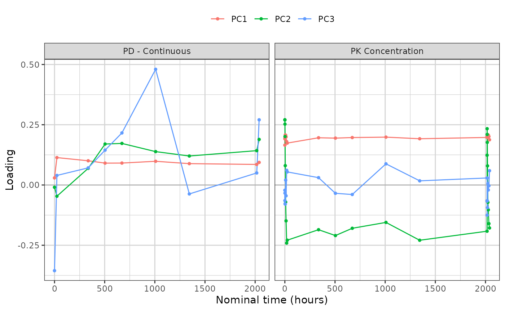

# What a trial summary contains

[`synpmx_pca_summarize()`](https://iamstein.github.io/synpmx/reference/synpmx_pca_summarize.md)
returns a **trial summary**: everything a synthetic copy of the study
will be built from, and nothing else.
[`synpmx_pca_generate()`](https://iamstein.github.io/synpmx/reference/synpmx_pca_generate.md)
reads that object and no patient row, so what is listed here is the
complete account of what the generated dataset descends from.

This vignette walks through the object group by group. It is a
reference: read
[`vignette("pca-demo")`](https://iamstein.github.io/synpmx/articles/pca-demo.md)
first for a run end to end, and
[`vignette("pca-algorithm")`](https://iamstein.github.io/synpmx/articles/pca-algorithm.md)
for how each quantity is estimated and why.

The object is a plain list, and the names used below are its own, so a
quantity can be reached directly when no accessor covers it.

## The study

``` r

library(dplyr)
raw <- as.data.frame(get(utils::data(list = "case1_pkpd", package = "xgxr"))) |>
  mutate(CENS = ifelse(NAME == "PD - Continuous", 0, CENS))

roles <- pmx_roles(
  id           = "ID",
  time         = "TIME",
  dv           = "LIDV",
  cens         = "CENS",
  amt          = "AMT",
  evid         = "EVID",
  cmt          = "CMT",
  dvid         = "NAME",
  nominal_time = "NOMTIME",
  strata       = c("TRTACT", "DOSE"),
  covariates   = "WEIGHTB",
  keep         = "STUDY"
)

trial_summary <- synpmx_pca_summarize(raw, roles, seed = 808)
trial_summary
#> A trial summary, from synpmx_pca_summarize()
#> 
#>   fitted on    180 patients, 6 arm(s): Placebo / 0 (30), 3 mg / 3 (30), 10 mg / 10 (30), 30 mg / 30 (30), 100 mg / 100 (30), 300 mg / 300 (30) 
#>   endpoints    PD - Continuous (9 visits modelled), PK Concentration (24 visits modelled) 
#>   covariates   WEIGHTB 
#>   components   11 (91% of variance) 
#>   dose term    factor 
#>   dosing       85 planned cycle(s) per arm | no reductions, interruptions or early stops 
#> 
#> synpmx_pca_generate() reads this object and nothing else. To look inside it:
#>   pca_report()      what it read out of the source data
#>   pca_dosing()      the planned dose schedule, per arm
#>   pca_dose_rates()  reduction, interruption and discontinuation
#>   pca_visits()      the probability of a visit, per arm
#>   pca_components()  the loadings, over time
```

## The inventory

[`pca_report()`](https://iamstein.github.io/synpmx/reference/pca_report.md)
is the top-level account: one row per released quantity, how many
numbers it holds, and the smallest number of patients standing behind
any one of them.

``` r

show(as.data.frame(pca_report(trial_summary)),
     "Every quantity read out of the source data")
```

``` r

pca_report(trial_summary)
```

Every section below expands one of those rows.

## The settings that produced it

Short, so printed.

``` r

unlist(trial_summary$settings)
#>           dose_term        pca_variance min_column_patients    min_arm_patients 
#>            "factor"               "0.9"                "18"                 "3"
c(patients = trial_summary$n_source, components = trial_summary$basis$k)
#>   patients components 
#>        180         11
```

## The arms

Sizes are what the generated cohort is split by, in the same
proportions.

``` r

data.frame(
  arm = trial_summary$arms$arms,
  patients = as.integer(trial_summary$arms$sizes[trial_summary$arms$arms])
)
#>           arm patients
#> 1  Placebo\r0       30
#> 2     3 mg\r3       30
#> 3   10 mg\r10       30
#> 4   30 mg\r30       30
#> 5 100 mg\r100       30
#> 6 300 mg\r300       30
```

## The feature grid

Every column of the matrix the components are built on: one per baseline
covariate, and one per endpoint per retained nominal time. `patients` is
how many subjects hold an observation in that cell, and cells held by
fewer than `min_column_patients` were dropped rather than modelled.

``` r

show(as.data.frame(pca_features(trial_summary)),
     "Every feature, with its mean and standard deviation", paged = TRUE)
```

`center` and `scale` are on the modelling scale, which the `transform`
column names: the log scale for a positive endpoint, the original scale
otherwise.

## The endpoint transforms and assay limits

``` r

basis <- trial_summary$basis
digits3(data.frame(
  endpoint = names(basis$transforms),
  transform = vapply(basis$transforms, function(t) t$method, character(1)),
  offset = signif(vapply(basis$transforms, function(t) t$offset, numeric(1)), 3),
  lloq = vapply(trial_summary$schema$censoring, function(c) {
    if (is.null(c$left)) NA_real_ else c$left
  }, numeric(1)),
  row.names = NULL
))
#>           endpoint  transform offset lloq
#> 1  PD - Continuous   identity  0.000   NA
#> 2 PK Concentration log_offset  0.025 0.05
```

The offset keeps [`log()`](https://rdrr.io/r/base/Log.html) finite near
zero. The lower limit of quantification is what a generated value below
it is reported at, with `CENS` set.

## The components

[`pca_components()`](https://iamstein.github.io/synpmx/reference/pca_components.md)
gives one loading per component and retained cell. Plotted against time
the components become curves: flat and positive is overall magnitude,
and crossing zero separates early visits from late ones.

``` r

show(attr(pca_components(trial_summary), "variance_explained"),
     "Variance explained, per component")
```

``` r

library(ggplot2)
library(xgxr)
xgx_theme_set()

components <- pca_components(trial_summary)
ggplot(subset(components, component %in% c("PC1", "PC2", "PC3") &
                 !is.na(time)),
       aes(time, loading, colour = component)) +
  geom_hline(yintercept = 0, linewidth = 0.3, colour = "grey60") +
  geom_line() + geom_point(size = 1) +
  facet_wrap(~endpoint, scales = "free_x") +
  labs(x = "Nominal time (hours)", y = "Loading", colour = NULL) +
  theme(legend.position = "top")
```



``` r

show(components, "Every loading, by component and feature", paged = TRUE)
```

One matrix carries the covariates and every endpoint together, so a
single draw keeps the relationships between them. The loading mass per
component says where each one is concentrated:

``` r

mass <- tapply(
  components$loading^2,
  list(components$component,
       ifelse(is.na(components$endpoint), "covariate", components$endpoint)),
  sum
)
signif(mass[paste0("PC", seq_len(min(4, nrow(mass)))), , drop = FALSE], 3)
#>     covariate PD - Continuous PK Concentration
#> PC1  0.000237           0.074           0.9260
#> PC2  0.001080           0.155           0.8430
#> PC3  0.411000           0.508           0.0813
#> PC4  0.063400           0.826           0.1110
```

Each row sums to one. On this study the first two components are almost
entirely the PK profile, and the covariate only enters further down —
alongside the PD endpoint, which is the joint structure that a separate
decomposition per endpoint would have thrown away.

## The score model

A new subject’s scores are their arm’s mean plus a fresh draw whose
spread is that arm’s residual standard deviation.

``` r

show(pca_scores(trial_summary),
     "Mean score and residual spread, per arm and component", paged = TRUE)
```

The `sd` column is the whole of the between-subject variability the
synthetic data will have. It differs by arm on purpose: an arm sitting
on the assay limit is genuinely tighter than one well above it, and
giving every arm the pooled spread would smear the low arms upward.

## The dosing model

[`pca_dosing()`](https://iamstein.github.io/synpmx/reference/pca_dosing.md)
is the planned schedule each arm starts from, and
[`pca_dose_rates()`](https://iamstein.github.io/synpmx/reference/pca_dose_rates.md)
is how its patients departed from it.

``` r

show(head(pca_dosing(trial_summary), 12),
     "The planned schedule, first cycles of each arm", paged = TRUE)
```

``` r

show(pca_dose_rates(trial_summary), "How patients departed from the plan")
```

``` r

pca_dose_rates(trial_summary)
```

All three rates are zero here and every arm has a single dose level, so
each generated patient receives the planned schedule exactly. On a study
with dose modifications the rates are not zero, and generated patients
then differ from one another as the source patients did.

## The visit model

One probability per arm, endpoint and modelled time. Attendance is drawn
independently per visit, so no real patient’s set of attended visits is
reused.

``` r

ggplot(pca_visits(trial_summary), aes(time, probability, colour = arm)) +
  geom_line() +
  facet_wrap(~endpoint, scales = "free_x") +
  labs(x = "Nominal time (hours)", y = "P(observation)", colour = NULL) +
  theme(legend.position = "top")
```


``` r

show(pca_visits(trial_summary),
     "Probability of an observation, per arm, endpoint and time", paged = TRUE)
```

## The schema

What the generated table needs in order to come back in the source’s
shape. Column prototypes are zero-length vectors: they carry class and
factor levels and no values.

``` r

schema <- trial_summary$schema
show(data.frame(
  column = schema$columns,
  class = vapply(schema$prototypes, function(p) class(p)[[1L]], character(1)),
  levels = vapply(schema$prototypes, function(p) {
    if (is.factor(p)) paste(levels(p), collapse = ", ") else ""
  }, character(1))
), "Column order and type")
```

Two entries are read from real values rather than averaged, and both are
worth knowing about. **Endpoint level sets**: a discrete endpoint has no
value between its levels, so a generated value is a source value.

``` r

data.frame(
  endpoint = names(schema$endpoint_specs),
  type = vapply(schema$endpoint_specs, function(s) s$type, character(1)),
  levels = vapply(schema$endpoint_specs, function(s) {
    if (is.null(s$levels)) "" else paste(s$levels, collapse = ", ")
  }, character(1)),
  reason = vapply(schema$endpoint_specs, function(s) s$reason, character(1)),
  row.names = NULL
)
#>           endpoint       type levels                                     reason
#> 1  PD - Continuous continuous        not every observed value is a whole number
#> 2 PK Concentration continuous        not every observed value is a whole number
```

**Arm constants**: the strata and kept columns, one value per arm,
carried verbatim onto every generated patient in it.

``` r

digits3(do.call(rbind, lapply(names(schema$arm_values), function(arm) {
  values <- schema$arm_values[[arm]]
  data.frame(arm = gsub("\r", " / ", arm, fixed = TRUE),
             as.data.frame(values, stringsAsFactors = FALSE))
})))
#>            arm  TRTACT DOSE STUDY
#> 1  Placebo / 0 Placebo    0     1
#> 2     3 mg / 3    3 mg    3     1
#> 3   10 mg / 10   10 mg   10     1
#> 4   30 mg / 30   30 mg   30     1
#> 5 100 mg / 100  100 mg  100     1
#> 6 300 mg / 300  300 mg  300     1
```

Subject identifiers are not in the schema. They are minted at
generation, and the only thing kept about the source’s identifiers is
the largest one, so a synthetic identifier cannot collide with a real
one.

``` r

c(class = schema$id_class, offset = schema$id_offset)
#>     class    offset 
#> "integer"     "180"
```

## Generating from it

Nothing beyond the object above is read.

``` r

synthetic <- synpmx_pca_generate(trial_summary, seed = 808)
c(rows = nrow(synthetic),
  subjects = length(unique(synthetic$ID)),
  valid = validate_pmx(synthetic, roles)$valid)
#>     rows subjects    valid 
#>    20520      180        1
```

## Where to go next

- [`vignette("pca-demo")`](https://iamstein.github.io/synpmx/articles/pca-demo.md)
  — one study end to end, with the source and synthetic data plotted
  against each other.
- [`vignette("pca-algorithm")`](https://iamstein.github.io/synpmx/articles/pca-algorithm.md)
  — how each quantity above is estimated, and what it does and does not
  preserve.
