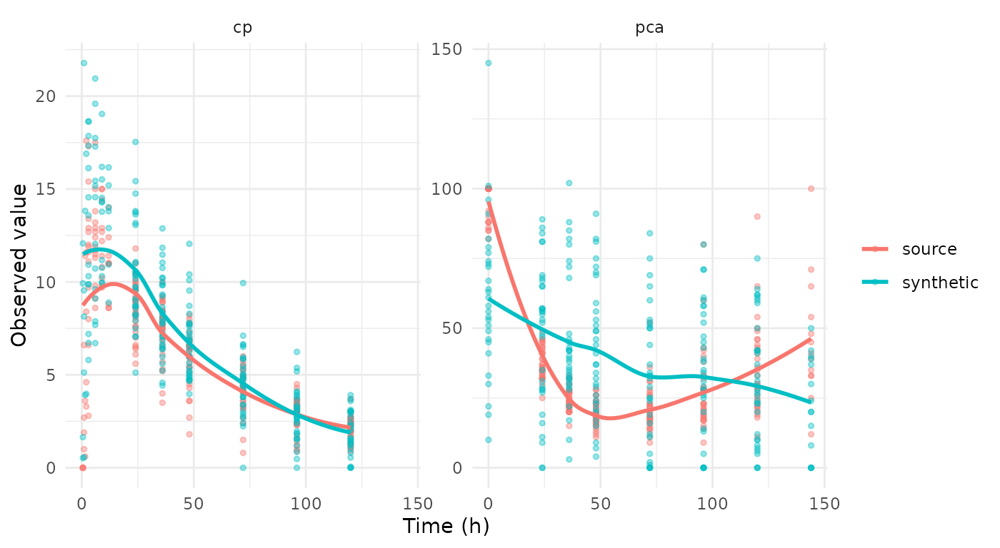

# Demo: Using synpmx_model

Fit a population model to a study, look at what the fit carries, and
generate a synthetic dataset by simulating from it. No number a patient
measured reaches the output: what leaves the source is a structural
model, a handful of fixed effects, a covariance matrix, a residual
error, and a dosing and visit model per arm.

It makes no formal privacy claim, and **it is not for estimation** — the
fitted parameters exist to make simulated profiles look like the source
study, and the object prints that warning with itself. The full
specification is in
[`vignette("pmxmodel-algorithm")`](https://iamstein.github.io/synpmx/articles/pmxmodel-algorithm.md).

## The study

[`nlmixr2data::warfarin`](https://nlmixr2.github.io/nlmixr2data/reference/warfarin.html)
is thirty-two patients given a single oral dose, with a concentration
endpoint `cp` and a pharmacodynamic one `pca`.

``` r

data("warfarin", package = "nlmixr2data")
warfarin <- as.data.frame(warfarin)
str(warfarin)
#> 'data.frame':    515 obs. of  9 variables:
#>  $ id  : int  1 1 1 1 1 1 1 1 1 1 ...
#>  $ time: num  0 0.5 1 2 3 6 9 12 24 24 ...
#>  $ amt : num  100 0 0 0 0 0 0 0 0 0 ...
#>  $ dv  : num  0 0 1.9 3.3 6.6 9.1 10.8 8.6 5.6 44 ...
#>  $ dvid: Factor w/ 2 levels "cp","pca": 1 1 1 1 1 1 1 1 1 2 ...
#>  $ evid: int  1 0 0 0 0 0 0 0 0 0 ...
#>  $ wt  : num  66.7 66.7 66.7 66.7 66.7 66.7 66.7 66.7 66.7 66.7 ...
#>  $ age : int  50 50 50 50 50 50 50 50 50 50 ...
#>  $ sex : Factor w/ 2 levels "female","male": 2 2 2 2 2 2 2 2 2 2 ...
```

Its sixteen recorded observation times are the protocol’s, shared across
patients, so declaring `nominal_time` from `time` asserts something true
about this study rather than constructing a grid. A study whose recorded
times are per-patient clock readings needs a grid built by hand first;
the public-data survey for
[`synpmx_pca()`](https://iamstein.github.io/synpmx/reference/synpmx_pca.md)
works several of those.

``` r

sort(unique(warfarin$time[warfarin$evid == 0]))
#>  [1]   0.0   0.5   1.0   1.5   2.0   3.0   6.0   9.0  12.0  24.0  36.0  48.0
#> [13]  72.0  96.0 120.0 144.0

warfarin$ntime <- warfarin$time
warfarin_roles <- pmx_roles(
  id = "id", time = "time", nominal_time = "ntime", dv = "dv", amt = "amt",
  evid = "evid", dvid = "dvid", covariates = c("wt", "age", "sex")
)
```

## Fitting

[`synpmx_model_estimate()`](https://iamstein.github.io/synpmx/reference/synpmx_model_estimate.md)
is the only stage that reads patient data, and the only one that needs
`nlmixr2`. It works out which endpoint is the drug, what design produced
it, fits the candidates that design admits and picks one on AIC.

``` r

fit <- synpmx_model_estimate(warfarin, warfarin_roles, seed = 1)
```

That is one population fit: a one-compartment oral model with allometric
scaling on `wt`, chosen by the route detection rather than by a search.
Ask for more where you want it — `pk = "2cmt_oral"`, or
`pk = c("1cmt_oral", "2cmt_oral")` to compare the two on AIC.

The chunk above is shown rather than run. Fitting compiles a model, so
this document reads a stored fit built by `scripts/build-model-fits.R`
and `R CMD check` never needs a compiler.

``` r

fit
#> A fitted PMX model, from synpmx_model_estimate()
#> 
#>   fitted on    32 patients, 1 arm(s)
#>   structural   1cmt_oral (chosen from 1 candidate(s) on AIC) 
#>   fixed        cl 0.1361, v 7.802, ka 0.562 
#>   random on    cl, v, ka 
#>   pk endpoint  cp 
#> 
#>   These parameters are not estimates to report. They exist to make
#>   simulated profiles resemble the source study; the candidate set is too
#>   small and the covariate model too thin for any of them to answer a
#>   scientific question.
```

Clearance of 0.136 L/h and a volume of 7.8 L are the values this dataset
is known for, which is the point: the fit is good enough to simulate
from. It is still not a result to report, for the reason the object
prints.

## What the fit carries

Two halves.
[`model_report()`](https://iamstein.github.io/synpmx/reference/model_report.md)
separates them, because they answer to different things — one half is an
estimate with all an estimate’s caveats, the other is a summary of the
study’s apparatus.

``` r

model_report(fit)
#> What this fitted model carries
#> 
#> Estimated by nlmixr2
#>   structural model   1cmt_oral 
#>   fixed effects      cl 0.1361, v 7.802, ka 0.562 
#>   between-subject    cl 0.252, v 0.14, ka 0.638 (as SD on the log scale)
#>   residual error     additive 1.07 
#>   covariate effects  cl ~ (wt/70)^0.75, v ~ (wt/70)^1.00 
#>   pd shapes          pca: linear 
#> 
#> Summarized from the source, not estimated
#>   cohort             32 patients in 1 arm(s)
#>   visit model        22 grid cells over 2 endpoint(s)
#>   dosing model       1 planned cycle(s) per arm | no reductions, skips or early stops 
#> 
#> How the concentration endpoint was decided
#>   endpoint           cp (inferred) 
#>  endpoint compartment post_dose shape proportional
#>        cp          NA      TRUE  TRUE           NA
#>       pca          NA      TRUE FALSE           NA
#>   design             the median profile rises to a peak at 9 before declining, and 31% of subjects do too 
#> 
#> Covariate against the individual random effects
#>  covariate parameter correlation
#>        age        ka      -0.260
#>        sex         v      -0.225
#>        age        cl       0.160
#>        sex        ka      -0.095
#>         wt        cl      -0.078
#> 
#>   A covariate that moves with a random effect and is not in the model above
#>   is generated independently of the profiles, so the synthetic data carries
#>   no relationship between them. `synpmx_avatar()` keeps those relationships
#>   without modelling them.
```

The signals table says how the concentration endpoint was decided. Here
`cp` is the only endpoint with a rise-and-fall shape, and `proportional`
reads “not computable” because `warfarin` gives every patient the same
dose — there are no dose levels to compare. That is the classification
telling you how much it had to go on, and it is worth reading before
trusting the answer.

The correlation block is the other thing to read. A covariate that moves
with a random effect and is not in the model above is generated
independently of the profiles, so the synthetic data carries no
relationship between them.
[`synpmx_avatar()`](https://iamstein.github.io/synpmx/reference/synpmx_avatar.md)
keeps those relationships without modelling them.

## The candidates

``` r

show(model_candidates(fit), "Candidates the design admitted")
```

One row, because the default fits one model and stops. A distribution
phase is a refinement of a shape the one-compartment model already has
and costs about five times as long to fit, so it is available rather
than routine: `pk = "2cmt_oral"` forces it,
`pk = c("1cmt_oral", "2cmt_oral")` fits both and picks on AIC, and
[`model_report()`](https://iamstein.github.io/synpmx/reference/model_report.md)
says when the sampling would support one.

The whole call takes about eleven seconds on a study this size, and
effectively all of it is this one fit — the PD shapes are least squares
and cost nothing measurable.

## Generating

[`synpmx_model_generate()`](https://iamstein.github.io/synpmx/reference/synpmx_model_generate.md)
reads no patient data. Its arguments are the fit and a subject count, so
everything about the source that reaches the output has already passed
through the fit.

``` r

synthetic <- synpmx_model_generate(fit, n_subjects = 32, seed = 7)
str(synthetic)
#> 'data.frame':    513 obs. of  10 variables:
#>  $ id   : int  34 34 34 34 34 34 34 34 34 34 ...
#>  $ time : num  0 0 3 9 24 24 36 36 48 48 ...
#>  $ ntime: num  0 0 3 9 24 24 36 36 48 48 ...
#>  $ dv   : num  NA 58 18.6 15.5 13.8 ...
#>  $ amt  : num  120 0 0 0 0 0 0 0 0 0 ...
#>  $ evid : int  1 0 0 0 0 0 0 0 0 0 ...
#>  $ dvid : chr  NA "pca" "cp" "cp" ...
#>  $ wt   : num  52.1 52.1 52.1 52.1 52.1 ...
#>  $ age  : int  33 33 33 33 33 33 33 33 33 33 ...
#>  $ sex  : Factor w/ 2 levels "female","male": 2 2 2 2 2 2 2 2 2 2 ...
#>  - attr(*, "pmx_fitted_model")=List of 18
#>   ..$ structural       : chr "1cmt_oral"
#>   ..$ candidates       :'data.frame':    1 obs. of  4 variables:
#>   .. ..$ model    : chr "1cmt_oral"
#>   .. ..$ converged: logi TRUE
#>   .. ..$ aic      : num 887
#>   .. ..$ note     : chr ""
#>   ..$ parameters       :List of 3
#>   .. ..$ fixed   : Named num [1:3] 0.136 7.802 0.562
#>   .. .. ..- attr(*, "names")= chr [1:3] "cl" "v" "ka"
#>   .. ..$ omega   : num [1:3, 1:3] 0.0638 0 0 0 0.0197 ...
#>   .. .. ..- attr(*, "dimnames")=List of 2
#>   .. .. .. ..$ : chr [1:3] "cl" "v" "ka"
#>   .. .. .. ..$ : chr [1:3] "cl" "v" "ka"
#>   .. ..$ residual:List of 2
#>   .. .. ..$ kind: chr "additive"
#>   .. .. ..$ sd  : num 1.07
#>   ..$ endpoints        :List of 5
#>   .. ..$ pk        : chr "cp"
#>   .. ..$ pd        : chr "pca"
#>   .. ..$ discrete  : chr(0) 
#>   .. ..$ signals   :'data.frame':    2 obs. of  5 variables:
#>   .. .. ..$ endpoint    : chr [1:2] "cp" "pca"
#>   .. .. ..$ compartment : logi [1:2] NA NA
#>   .. .. ..$ post_dose   : logi [1:2] TRUE TRUE
#>   .. .. ..$ shape       : logi [1:2] TRUE FALSE
#>   .. .. ..$ proportional: logi [1:2] NA NA
#>   .. ..$ decided_by: chr "inferred"
#>   ..$ arms             :List of 2
#>   .. ..$ arms : chr "all"
#>   .. ..$ sizes: Named int 32
#>   .. .. ..- attr(*, "names")= chr "all"
#>   ..$ dosing           :List of 1
#>   .. ..$ all:List of 8
#>   .. .. ..$ planned        :'data.frame':    1 obs. of  3 variables:
#>   .. .. .. ..$ cycle: int 1
#>   .. .. .. ..$ time : num 0
#>   .. .. .. ..$ amt  : num 120
#>   .. .. ..$ levels         : num 1
#>   .. .. ..$ discontinuation: num 0
#>   .. .. ..$ interruption   : num 0
#>   .. .. ..$ reduction      : num 0
#>   .. .. ..$ patients       : int 32
#>   .. .. ..$ distinct       : int 20
#>   .. .. ..$ source_doses   : num 1
#>   ..$ visits           :List of 1
#>   .. ..$ all:List of 2
#>   .. .. ..$ cells      : Named int [1:22] 1 2 3 4 5 6 7 8 9 10 ...
#>   .. .. .. ..- attr(*, "names")= chr [1:22] "cp@0.5" "cp@1" "cp@1.5" "cp@2" ...
#>   .. .. ..$ probability: Named num [1:22] 0.125 0.125 0.0938 0.1562 0.375 ...
#>   .. .. .. ..- attr(*, "names")= chr [1:22] "cp@0.5" "cp@1" "cp@1.5" "cp@2" ...
#>   ..$ schema           :List of 11
#>   .. ..$ censoring     :List of 2
#>   .. .. ..$ cp : NULL
#>   .. .. ..$ pca: NULL
#>   .. ..$ columns       : chr [1:10] "id" "time" "ntime" "dv" ...
#>   .. ..$ prototypes    :List of 10
#>   .. .. ..$ id   : int(0) 
#>   .. .. ..$ time : num(0) 
#>   .. .. ..$ ntime: num(0) 
#>   .. .. ..$ dv   : num(0) 
#>   .. .. ..$ amt  : num(0) 
#>   .. .. ..$ evid : int(0) 
#>   .. .. ..$ dvid : Factor w/ 2 levels "cp","pca": 
#>   .. .. ..$ wt   : num(0) 
#>   .. .. ..$ age  : int(0) 
#>   .. .. ..$ sex  : Factor w/ 2 levels "female","male": 
#>   .. ..$ id_class      : chr "integer"
#>   .. ..$ id_offset     : int 33
#>   .. ..$ id_levels     : NULL
#>   .. ..$ cmt_dose      : NULL
#>   .. ..$ cmt_obs       :List of 2
#>   .. .. ..$ cp : NULL
#>   .. .. ..$ pca: NULL
#>   .. ..$ carried       : NULL
#>   .. ..$ arm_values    :List of 1
#>   .. .. ..$ all: list()
#>   .. ..$ endpoint_specs:List of 2
#>   .. .. ..$ cp :List of 5
#>   .. .. .. ..$ type       : chr "continuous"
#>   .. .. .. ..$ levels     : NULL
#>   .. .. .. ..$ nonnegative: logi FALSE
#>   .. .. .. ..$ reason     : chr "not every observed value is a whole number"
#>   .. .. .. ..$ declared   : logi FALSE
#>   .. .. ..$ pca:List of 5
#>   .. .. .. ..$ type       : chr "integer"
#>   .. .. .. ..$ levels     : NULL
#>   .. .. .. ..$ nonnegative: logi TRUE
#>   .. .. .. ..$ reason     : chr "53 whole-number levels, from 9 to 100"
#>   .. .. .. ..$ declared   : logi FALSE
#>   ..$ roles            :List of 19
#>   .. ..$ id            : chr "id"
#>   .. ..$ time          : chr "time"
#>   .. ..$ nominal_time  : chr "ntime"
#>   .. ..$ tad           : NULL
#>   .. ..$ occasion      : NULL
#>   .. ..$ dv            : chr "dv"
#>   .. ..$ amt           : chr "amt"
#>   .. ..$ evid          : chr "evid"
#>   .. ..$ cmt           : NULL
#>   .. ..$ dvid          : chr "dvid"
#>   .. ..$ mdv           : NULL
#>   .. ..$ rate          : NULL
#>   .. ..$ cens          : NULL
#>   .. ..$ limit         : NULL
#>   .. ..$ addl          : NULL
#>   .. ..$ ii            : NULL
#>   .. ..$ assigned_dose : NULL
#>   .. ..$ dose_covariate: NULL
#>   .. ..$ covariates    : chr [1:3] "wt" "age" "sex"
#>   .. ..- attr(*, "class")= chr "pmx_roles"
#>   ..$ settings         :List of 6
#>   .. ..$ min_subjects     : int 20
#>   .. ..$ min_arm_patients : int 3
#>   .. ..$ min_time_bins    : int 6
#>   .. ..$ estimation       : chr "focei"
#>   .. ..$ covariate_effects: chr "auto"
#>   .. ..$ error            : chr "add"
#>   ..$ n_source         : int 32
#>   ..$ cells            :'data.frame':    22 obs. of  4 variables:
#>   .. ..$ index   : int [1:22] 1 2 3 4 5 6 7 8 9 10 ...
#>   .. ..$ name    : chr [1:22] "cp@0.5" "cp@1" "cp@1.5" "cp@2" ...
#>   .. ..$ endpoint: chr [1:22] "cp" "cp" "cp" "cp" ...
#>   .. ..$ time    : num [1:22] 0.5 1 1.5 2 3 6 9 12 24 36 ...
#>   ..$ pd               :List of 1
#>   .. ..$ pca:List of 6
#>   .. .. ..$ pd         : chr "linear"
#>   .. .. ..$ typical    : Named num [1:2] 52.23 -0.24
#>   .. .. .. ..- attr(*, "names")= chr [1:2] "baseline" "slope"
#>   .. .. ..$ aic        : num 2137
#>   .. .. ..$ baseline_cv: num 0.227
#>   .. .. ..$ residual   :List of 2
#>   .. .. .. ..$ kind: chr "additive"
#>   .. .. .. ..$ sd  : num 24
#>   .. .. ..$ candidates :'data.frame':    2 obs. of  2 variables:
#>   .. .. .. ..$ shape: chr [1:2] "constant" "linear"
#>   .. .. .. ..$ aic  : num [1:2] 2174 2137
#>   ..$ covariate_effects:List of 2
#>   .. ..$ cl:List of 3
#>   .. .. ..$ covariate: chr "wt"
#>   .. .. ..$ reference: num 70
#>   .. .. ..$ exponent : num 0.75
#>   .. ..$ v :List of 3
#>   .. .. ..$ covariate: chr "wt"
#>   .. .. ..$ reference: num 70
#>   .. .. ..$ exponent : num 1
#>   ..$ covariates       :List of 1
#>   .. ..$ all:List of 3
#>   .. .. ..$ wt :List of 4
#>   .. .. .. ..$ kind   : chr "lognormal"
#>   .. .. .. ..$ meanlog: num 4.23
#>   .. .. .. ..$ sdlog  : num 0.19
#>   .. .. .. ..$ median : num 71.7
#>   .. .. ..$ age:List of 4
#>   .. .. .. ..$ kind   : chr "lognormal"
#>   .. .. .. ..$ meanlog: num 3.39
#>   .. .. .. ..$ sdlog  : num 0.304
#>   .. .. .. ..$ median : num 27.5
#>   .. .. ..$ sex:List of 3
#>   .. .. .. ..$ kind       : chr "categorical"
#>   .. .. .. ..$ levels     : chr [1:2] "female" "male"
#>   .. .. .. ..$ probability: num [1:2] 0.156 0.844
#>   ..$ discrete         :List of 1
#>   .. ..$ all:List of 22
#>   .. .. ..$ :List of 2
#>   .. .. .. ..$ levels     : num 0
#>   .. .. .. ..$ probability: num 1
#>   .. .. ..$ :List of 2
#>   .. .. .. ..$ levels     : num [1:4] 1 1.9 2.7 6.6
#>   .. .. .. ..$ probability: num [1:4] 0.25 0.25 0.25 0.25
#>   .. .. ..$ :List of 2
#>   .. .. .. ..$ levels     : num [1:3] 0.6 11.4 3.6
#>   .. .. .. ..$ probability: num [1:3] 0.333 0.333 0.333
#>   .. .. ..$ :List of 2
#>   .. .. .. ..$ levels     : num [1:5] 11.6 17.6 3.3 4.6 8.4
#>   .. .. .. ..$ probability: num [1:5] 0.2 0.2 0.2 0.2 0.2
#>   .. .. ..$ :List of 2
#>   .. .. .. ..$ levels     : num [1:13] 11.1 11.6 11.9 12 12.7 12.9 13.4 15.4 17.3 2.8 ...
#>   .. .. .. ..$ probability: num [1:13] 0.0769 0.0769 0.0769 0.0769 0.0769 ...
#>   .. .. ..$ :List of 2
#>   .. .. .. ..$ levels     : num [1:14] 11.3 11.5 11.7 11.9 12.4 12.7 12.9 13.2 13.8 15 ...
#>   .. .. .. ..$ probability: num [1:14] 0.0714 0.0714 0.0714 0.0714 0.0714 ...
#>   .. .. ..$ :List of 2
#>   .. .. .. ..$ levels     : num [1:10] 10.2 10.8 11.4 12.2 12.7 12.9 14.4 15 9.7 9.8
#>   .. .. .. ..$ probability: num [1:10] 0.0909 0.0909 0.0909 0.0909 0.0909 ...
#>   .. .. ..$ :List of 2
#>   .. .. .. ..$ levels     : num [1:6] 11 11.4 12.4 14 8.6 8.8
#>   .. .. .. ..$ probability: num [1:6] 0.333 0.111 0.111 0.111 0.222 ...
#>   .. .. ..$ :List of 2
#>   .. .. .. ..$ levels     : num [1:28] 10 10.1 10.4 10.5 11 11.8 5.6 6.1 6.4 6.5 ...
#>   .. .. .. ..$ probability: num [1:28] 0.0312 0.0312 0.0312 0.0312 0.0312 ...
#>   .. .. ..$ :List of 2
#>   .. .. .. ..$ levels     : num [1:25] 10 3.5 4 5.2 5.3 5.7 6.1 6.4 6.6 6.9 ...
#>   .. .. .. ..$ probability: num [1:25] 0.0312 0.0312 0.0312 0.0312 0.0312 ...
#>   .. .. ..$ :List of 2
#>   .. .. .. ..$ levels     : num [1:23] 1.8 2.7 3.6 4.3 4.5 4.7 5.1 5.4 5.6 5.9 ...
#>   .. .. .. ..$ probability: num [1:23] 0.0312 0.0312 0.0625 0.0312 0.0312 ...
#>   .. .. ..$ :List of 2
#>   .. .. .. ..$ levels     : num [1:21] 0.8 1.5 2.4 2.7 3.2 3.3 3.4 3.6 4 4.1 ...
#>   .. .. .. ..$ probability: num [1:21] 0.0312 0.0312 0.0312 0.0312 0.0625 ...
#>   .. .. ..$ :List of 2
#>   .. .. .. ..$ levels     : num [1:18] 0.9 1 1.2 1.4 1.7 2.3 2.4 2.9 3 3.1 ...
#>   .. .. .. ..$ probability: num [1:18] 0.0323 0.0323 0.0323 0.0323 0.0323 ...
#>   .. .. ..$ :List of 2
#>   .. .. .. ..$ levels     : num [1:16] 0.9 1.1 1.3 1.4 1.7 1.9 2 2.2 2.3 2.4 ...
#>   .. .. .. ..$ probability: num [1:16] 0.0345 0.069 0.0345 0.0345 0.069 ...
#>   .. .. ..$ :List of 2
#>   .. .. .. ..$ levels     : num [1:7] 100 82 85 86 88 90 92
#>   .. .. .. ..$ probability: num [1:7] 0.7 0.0333 0.0667 0.0333 0.1 ...
#>   .. .. ..$ :List of 2
#>   .. .. .. ..$ levels     : num [1:16] 25 30 32 33 34 35 36 37 39 41 ...
#>   .. .. .. ..$ probability: num [1:16] 0.0312 0.0312 0.125 0.0625 0.0625 ...
#>   .. .. ..$ :List of 2
#>   .. .. .. ..$ levels     : num [1:13] 15 20 21 22 23 24 25 26 27 28 ...
#>   .. .. .. ..$ probability: num [1:13] 0.0312 0.125 0.0625 0.125 0.0938 ...
#>   .. .. ..$ :List of 2
#>   .. .. .. ..$ levels     : num [1:16] 11 12 13 14 15 16 17 18 19 20 ...
#>   .. .. .. ..$ probability: num [1:16] 0.0312 0.0312 0.0312 0.0312 0.0625 ...
#>   .. .. ..$ :List of 2
#>   .. .. .. ..$ levels     : num [1:18] 11 13 14 15 16 17 18 19 20 22 ...
#>   .. .. .. ..$ probability: num [1:18] 0.0323 0.0323 0.0645 0.0323 0.0645 ...
#>   .. .. ..$ :List of 2
#>   .. .. .. ..$ levels     : num [1:20] 14 15 17 18 19 20 21 22 23 28 ...
#>   .. .. .. ..$ probability: num [1:20] 0.0323 0.0323 0.0968 0.0645 0.0645 ...
#>   .. .. ..$ :List of 2
#>   .. .. .. ..$ levels     : num [1:27] 11 18 19 20 21 22 23 24 25 26 ...
#>   .. .. .. ..$ probability: num [1:27] 0.0323 0.0323 0.0323 0.0323 0.0323 ...
#>   .. .. ..$ :List of 2
#>   .. .. .. ..$ levels     : num [1:12] 100 12 25 33 35 39 41 45 48 54 ...
#>   .. .. .. ..$ probability: num [1:12] 0.0769 0.0769 0.0769 0.1538 0.0769 ...
#>   ..$ design           :List of 6
#>   .. ..$ route     : chr "oral"
#>   .. ..$ rising    : num 0.312
#>   .. ..$ reason    : chr "the median profile rises to a peak at 9 before declining, and 31% of subjects do too"
#>   .. ..$ interval  : int 1
#>   .. ..$ richness  :List of 4
#>   .. .. ..$ per_subject: num 6
#>   .. .. ..$ before_peak: num 0
#>   .. .. ..$ after_peak : num 6
#>   .. .. ..$ rich       : logi FALSE
#>   .. ..$ candidates: chr "1cmt_oral"
#>   ..$ correlations     :'data.frame':    9 obs. of  3 variables:
#>   .. ..$ covariate  : chr [1:9] "wt" "wt" "wt" "age" ...
#>   .. ..$ parameter  : chr [1:9] "cl" "v" "ka" "cl" ...
#>   .. ..$ correlation: num [1:9] -0.0782 -0.0104 0.0337 0.1601 0.0323 ...
#>   ..- attr(*, "class")= chr "pmx_fitted_model"
#>  - attr(*, "pmx_source")= chr "model"
```

The generated table is in the source’s shape: same columns, same
classes, same compartment numbers, new identifiers.

``` r

show(head(synthetic, 10), "The first ten rows")
```

## Source against synthetic

``` r

library(ggplot2)
both <- rbind(
  data.frame(set = "source", time = warfarin$time, dv = warfarin$dv,
             endpoint = as.character(warfarin$dvid), evid = warfarin$evid),
  data.frame(set = "synthetic", time = synthetic$time, dv = synthetic$dv,
             endpoint = as.character(synthetic$dvid), evid = synthetic$evid)
)
both <- both[both$evid == 0 & !is.na(both$dv) & !is.na(both$endpoint), ]
ggplot(both, aes(time, dv, colour = set)) +
  geom_point(alpha = 0.4, size = 1) +
  geom_smooth(se = FALSE, method = "loess", formula = y ~ x) +
  facet_wrap(~endpoint, scales = "free_y") +
  labs(x = "Time (h)", y = "Observed value", colour = NULL) +
  theme_minimal()
```



``` r

compare <- function(endpoint) {
  source_values <- warfarin$dv[warfarin$dvid == endpoint & warfarin$evid == 0]
  synthetic_values <- synthetic$dv[synthetic$dvid == endpoint &
                                     synthetic$evid == 0]
  data.frame(
    endpoint = endpoint,
    statistic = c("n", "median", "q25", "q75", "max"),
    source = round(c(length(source_values),
                     stats::quantile(source_values, c(0.5, 0.25, 0.75)),
                     max(source_values)), 2),
    synthetic = round(c(length(synthetic_values),
                        stats::quantile(synthetic_values, c(0.5, 0.25, 0.75)),
                        max(synthetic_values)), 2),
    row.names = NULL
  )
}
show(rbind(compare("cp"), compare("pca")), "Source against synthetic")
```

The `pca` endpoint runs wider than the source does. It is fitted as a
linear time course with no exposure term and an additive residual error,
so it reproduces the average subject’s response with a spread around it
rather than the source’s own bounded range. A dataset whose point is the
exposure-response relationship is not served by this generator;
[`vignette("pmxmodel-algorithm")`](https://iamstein.github.io/synpmx/articles/pmxmodel-algorithm.md)
says so under Step 3.

## Scoring it

[`synpmx_scorecard()`](https://iamstein.github.io/synpmx/reference/synpmx_scorecard.md)
does not know what produced the dataset it scores, so it reads this
output the same way it reads an AVATAR or PCA one.

``` r

card <- synpmx_scorecard(warfarin, synthetic, warfarin_roles)
show(as.data.frame(card), "Scorecard")
```

The three rows that read `unavailable` need
[`synpmx_avatar()`](https://iamstein.github.io/synpmx/reference/synpmx_avatar.md)’s
own run record, which no other generator writes.
[`vignette("avatar-scorecard")`](https://iamstein.github.io/synpmx/articles/avatar-scorecard.md)
documents what each row asks and what its pass criterion is.

**B4a fails, and it is the row rather than the generator that is at
fault.** It asks whether a generated subject’s set of observation times
is one that fewer than two real patients held. Two of the thirty-two
are.

That sounds like a disclosure and is not one. `warfarin` has 32 patients
holding 15 distinct visit sets, and **14 of those 15 are held by exactly
one patient** — so “matches a set only one patient held” is very nearly
“matches any real patient at all”, which every generator that reproduces
the study’s design will do. Over 200 seeds this generator reproduces
1.26 such sets on average and fires on 83% of them; the two seen here
are what chance predicts, not an excess.

The same holds wherever you look. Across four public studies the share
of source visit sets held by exactly one patient is 93% for `warfarin`,
83% for `wbcSim`, and 100% for both `theo_sd` and `theo_md`. A threshold
that selects almost the whole source is measuring how wide the study’s
visit grid is, not what the generator did with it.

There is a sharper demonstration. The generator writes its observations
onto the nominal grid, so a synthetic subject’s times are always drawn
from those sixteen slots. `warfarin`’s recorded times happen to *equal*
its nominal grid, which is what makes a collision possible at all. Move
the source’s clock a few minutes off that grid — changing nothing about
the synthetic data, and nothing about privacy — and the row reads 0
instead of 2. B4a is answering a question about how this study recorded
its visit times.

Nor would redrawing help. Attendance here is drawn independently per
visit, so a generated set was never taken from the patient it happens to
match — rejecting collisions would truncate the attendance distribution
and drive the row to zero by construction, which fixes the number rather
than any risk.

**B4b is the row that answers the disclosure question, and it reads 0.**
No value any patient measured is reproduced. That is the claim this
generator makes, and it is the one worth checking.

## One call

[`synpmx_model()`](https://iamstein.github.io/synpmx/reference/synpmx_model.md)
is the two stages together, for when you do not need to look at the fit
first. It is on the result either way, as an attribute.

``` r

synthetic <- synpmx_model(warfarin, warfarin_roles, n_subjects = 32, seed = 7)
attr(synthetic, "pmx_fitted_model")
```

## See also

- [`vignette("pmxmodel-algorithm")`](https://iamstein.github.io/synpmx/articles/pmxmodel-algorithm.md)
  — what each step does and why.
- [`vignette("pca-demo")`](https://iamstein.github.io/synpmx/articles/pca-demo.md)
  — the same study through the principal-component generator.
- [`vignette("avatar-demo")`](https://iamstein.github.io/synpmx/articles/avatar-demo.md)
  — and through blending.
- [`vignette("avatar-scorecard")`](https://iamstein.github.io/synpmx/articles/avatar-scorecard.md)
  — the checks above, in detail.
