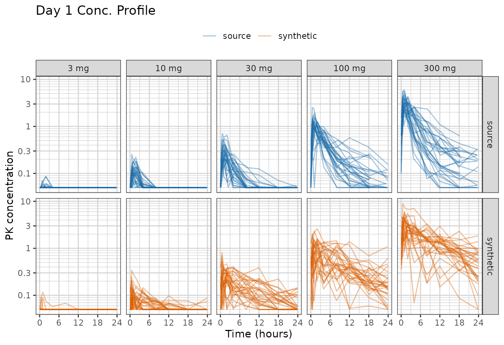
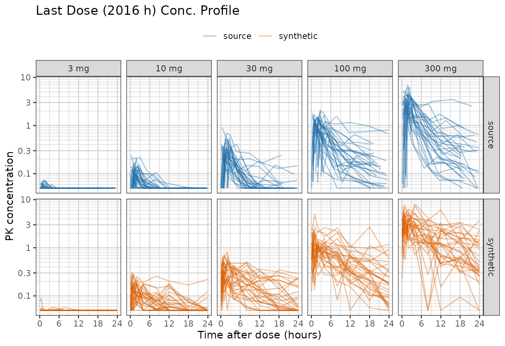
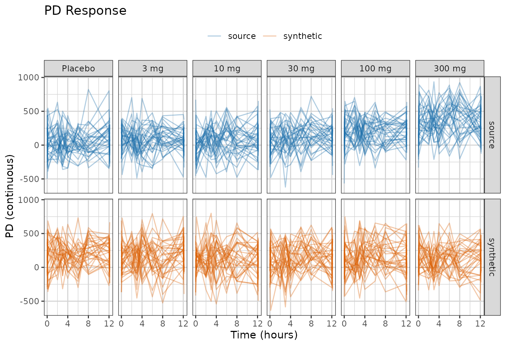
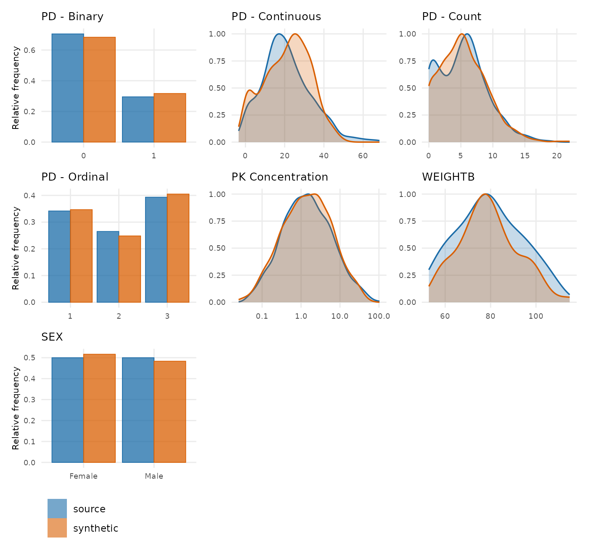

# Demo: Using synpmx_model

Fit a population model to a study, look at what the fit carries, and
generate a synthetic dataset by simulating from it. No number a patient
measured reaches the output: what leaves the source is a structural
model, a handful of fixed effects, a covariance matrix, a residual
error, and a dosing and visit model per arm.

It makes no formal privacy claim, and **it is not for estimation** — the
fitted parameters exist to make simulated profiles look like the source
study, and the object prints that warning with itself. The full
specification is in
[`vignette("pmxmodel-algorithm")`](https://iamstein.github.io/synpmx/articles/pmxmodel-algorithm.md).

The dataset is
[`xgxr::case1_pkpd`](https://rdrr.io/pkg/xgxr/man/case1_pkpd.html): 180
patients, six arms from placebo to 300 mg, with a pharmacokinetic (PK)
concentration endpoint and a continuous pharmacodynamic (PD) endpoint.
[`vignette("avatar-demo")`](https://iamstein.github.io/synpmx/articles/avatar-demo.md)
and
[`vignette("pca-demo")`](https://iamstein.github.io/synpmx/articles/pca-demo.md)
run the other two generators over the same study.

## Configuration

To run this on your own study, edit the two chunks below that:

1.  Read in the dataset.
2.  Define the column roles.

The rest of the code can be kept as is.

``` r

library(dplyr)
raw <- as.data.frame(get(utils::data(list = "case1_pkpd", package = "xgxr"))) |>
  mutate(CENS = ifelse(NAME == "PD - Continuous", 0, CENS))
SEED <- 808
```

The column meanings. Columns not specified here are dropped from the
synthetic dataset.

``` r

roles <- pmx_roles(
  id           = "ID",
  time         = "TIME",
  dv           = "LIDV",
  cens         = "CENS",
  amt          = "AMT",
  evid         = "EVID",
  cmt          = "CMT",
  dvid         = "NAME",        # which endpoint each observation row is
  nominal_time = "NOMTIME",     # the grid the visit model is built on
  strata       = c("TRTACT", "DOSE"), # treatment arms, fitted one at a time
  covariates   = "WEIGHTB",     # drawn, and available to the structural model
  keep         = "STUDY"        # carried through verbatim
)
```

## Fitting

[`synpmx_model_estimate()`](https://iamstein.github.io/synpmx/reference/synpmx_model_estimate.md)
is the only stage that reads patient data, and the only one that needs
`nlmixr2`. It works out which endpoint is the drug, what design produced
it, fits the candidates that design admits and picks one on AIC.

``` r

fit <- synpmx_model_estimate(raw, roles, seed = 1)
```

The chunk above is shown rather than run. Fitting compiles a model, so
this document reads a stored fit built by `scripts/build-model-fits.R`
and `R CMD check` never needs a compiler.

``` r

fit
#> A fitted PMX model, from synpmx_model_estimate()
#> 
#>   fitted on    180 patients, 6 arm(s)
#>   structural   1cmt_oral (chosen from 1 candidate(s) on AIC) 
#>   fixed        cl 8.168, v 111, ka 6.471 
#>   random on    cl, v, ka 
#>   pk endpoint  PK Concentration 
#> 
#>   These parameters are not estimates to report. They exist to make
#>   simulated profiles resemble the source study; the candidate set is too
#>   small and the covariate model too thin for any of them to answer a
#>   scientific question.
```

A clearance of 8.17 L/h and a volume of 111 L, fitted in about eleven
minutes on this study. Whether those are the right numbers for this
compound is not the question the generator asks: they exist to put the
simulated profiles where the source’s are, and the object prints that
warning with itself.

## What the fit carries

Two halves.
[`model_report()`](https://iamstein.github.io/synpmx/reference/model_report.md)
separates them, because they answer to different things — one half is an
estimate with all an estimate’s caveats, the other is a summary of the
study’s apparatus.

``` r

model_report(fit)
#> What this fitted model carries
#> 
#> Estimated by nlmixr2
#>   structural model   1cmt_oral 
#>   fixed effects      cl 8.168, v 111, ka 6.471 
#>   between-subject    cl 0.509, v 0.436, ka 0.707 (as SD on the log scale)
#>   residual error     proportional 0.394 
#>   covariate effects  cl ~ (WEIGHTB/117.1)^0.75, v ~ (WEIGHTB/117.1)^1.00 
#>   pd shapes          PD - Continuous: exponential 
#>   below the limit   PK Concentration 1669 of 3600 (46%) imputed below 0.05 
#> 
#> Summarized from the source, not estimated
#>   cohort             180 patients in 6 arm(s)
#>   visit model        33 grid cells over 2 endpoint(s)
#>   dosing model       85 planned cycle(s) per arm | no reductions, skips or early stops 
#> 
#> How the concentration endpoint was decided
#>   endpoint           PK Concentration (inferred) 
#>          endpoint compartment post_dose shape proportional
#>   PD - Continuous       FALSE     FALSE    NA        FALSE
#>  PK Concentration        TRUE      TRUE  TRUE         TRUE
#>   design             the median profile rises to a peak at 1 before declining, and 99% of subjects do too 
#>   also available     the sampling would support a two-compartment model (median 9 distinct times after a dose, 6 after the peak): ask for it with `pk = "2cmt_oral"`
```

Three lines in the estimated half are worth reading before anything
else. The residual error is proportional, which follows from every
observed concentration here being positive; a study recording zeros gets
an additive error instead, because a proportional one has nothing to
scale there. The PD endpoint gets an exponential shape from the
least-squares search, with no exposure term. And 46% of the
concentrations sit below the assay limit and were imputed inside the
censoring region before fitting — a study this censored asks the fit to
describe mostly-censored arms, and the arm-by-arm comparison further
down is where that shows.

The signals table says how the concentration endpoint was decided:
`PK Concentration` is post-dose, dose-proportional and rise-and-fall,
and the PD endpoint is none of the three.

The correlation block is the other thing to read. A covariate that moves
with a random effect and is not in the model above is generated
independently of the profiles, so the synthetic data carries no
relationship between them.
[`synpmx_avatar()`](https://iamstein.github.io/synpmx/reference/synpmx_avatar.md)
keeps those relationships without modelling them.

## The candidates

``` r

show(model_candidates(fit), "Candidates the design admitted")
```

One row, because the default fits one model and stops. A distribution
phase is a refinement of a shape the one-compartment model already has
and costs several times as long to fit, so it is available rather than
routine: `pk = "2cmt_oral"` forces it,
`pk = c("1cmt_oral", "2cmt_oral")` fits both and picks on AIC, and
[`model_report()`](https://iamstein.github.io/synpmx/reference/model_report.md)
says when the sampling would support one.

## Generating

[`synpmx_model_generate()`](https://iamstein.github.io/synpmx/reference/synpmx_model_generate.md)
reads no patient data. Its arguments are the fit and a subject count, so
everything about the source that reaches the output has already passed
through the fit.

``` r

synthetic <- synpmx_model_generate(fit, seed = SEED)
str(synthetic)
#> 'data.frame':    20520 obs. of  13 variables:
#>  $ ID     : int  181 181 181 181 181 181 181 181 181 181 ...
#>  $ TIME   : num  -0.1 0 23.9 24 48 72 96 120 144 168 ...
#>  $ NOMTIME: num  -0.1 0 23.9 24 48 72 96 120 144 168 ...
#>  $ LIDV   : num  -62.8 NA 264 NA NA ...
#>  $ AMT    : num  0 0 0 0 0 0 0 0 0 0 ...
#>  $ EVID   : int  0 1 0 1 1 1 1 1 1 1 ...
#>  $ CMT    : int  3 1 3 1 1 1 1 1 1 1 ...
#>  $ NAME   : chr  "PD - Continuous" NA "PD - Continuous" NA ...
#>  $ CENS   : num  0 0 0 0 0 0 0 0 0 0 ...
#>  $ WEIGHTB: num  141 141 141 141 141 ...
#>  $ TRTACT : chr  "Placebo" "Placebo" "Placebo" "Placebo" ...
#>  $ DOSE   : int  0 0 0 0 0 0 0 0 0 0 ...
#>  $ STUDY  : int  1 1 1 1 1 1 1 1 1 1 ...
#>  - attr(*, "pmx_fitted_model")=List of 19
#>   ..$ structural       : chr "1cmt_oral"
#>   ..$ candidates       :'data.frame':    1 obs. of  4 variables:
#>   .. ..$ model    : chr "1cmt_oral"
#>   .. ..$ converged: logi TRUE
#>   .. ..$ aic      : num -8633
#>   .. ..$ note     : chr ""
#>   ..$ parameters       :List of 3
#>   .. ..$ fixed   : Named num [1:3] 8.17 111.04 6.47
#>   .. .. ..- attr(*, "names")= chr [1:3] "cl" "v" "ka"
#>   .. ..$ omega   : num [1:3, 1:3] 0.259 0 0 0 0.19 ...
#>   .. .. ..- attr(*, "dimnames")=List of 2
#>   .. .. .. ..$ : chr [1:3] "cl" "v" "ka"
#>   .. .. .. ..$ : chr [1:3] "cl" "v" "ka"
#>   .. ..$ residual:List of 2
#>   .. .. ..$ kind: chr "proportional"
#>   .. .. ..$ cv  : num 0.394
#>   ..$ endpoints        :List of 5
#>   .. ..$ pk        : chr "PK Concentration"
#>   .. ..$ pd        : chr "PD - Continuous"
#>   .. ..$ discrete  : chr(0) 
#>   .. ..$ signals   :'data.frame':    2 obs. of  5 variables:
#>   .. .. ..$ endpoint    : chr [1:2] "PD - Continuous" "PK Concentration"
#>   .. .. ..$ compartment : logi [1:2] FALSE TRUE
#>   .. .. ..$ post_dose   : logi [1:2] FALSE TRUE
#>   .. .. ..$ shape       : logi [1:2] NA TRUE
#>   .. .. ..$ proportional: logi [1:2] FALSE TRUE
#>   .. ..$ decided_by: chr "inferred"
#>   ..$ arms             :List of 2
#>   .. ..$ arms : chr [1:6] "Placebo\r0" "3 mg\r3" "10 mg\r10" "30 mg\r30" ...
#>   .. ..$ sizes: Named int [1:6] 30 30 30 30 30 30
#>   .. .. ..- attr(*, "names")= chr [1:6] "Placebo\r0" "3 mg\r3" "10 mg\r10" "30 mg\r30" ...
#>   ..$ dosing           :List of 6
#>   .. ..$ Placebo0 :List of 8
#>   .. .. ..$ planned        :'data.frame':    85 obs. of  3 variables:
#>   .. .. .. ..$ cycle: int [1:85] 1 2 3 4 5 6 7 8 9 10 ...
#>   .. .. .. ..$ time : num [1:85] 0 24 48 72 96 120 144 168 192 216 ...
#>   .. .. .. ..$ amt  : num [1:85] 0 0 0 0 0 0 0 0 0 0 ...
#>   .. .. ..$ levels         : num 1
#>   .. .. ..$ discontinuation: num 0
#>   .. .. ..$ interruption   : num 0
#>   .. .. ..$ reduction      : num 0
#>   .. .. ..$ patients       : int 30
#>   .. .. ..$ distinct       : int 1
#>   .. .. ..$ source_doses   : num 85
#>   .. ..$ 3 mg3    :List of 8
#>   .. .. ..$ planned        :'data.frame':    85 obs. of  3 variables:
#>   .. .. .. ..$ cycle: int [1:85] 1 2 3 4 5 6 7 8 9 10 ...
#>   .. .. .. ..$ time : num [1:85] 0 24 48 72 96 120 144 168 192 216 ...
#>   .. .. .. ..$ amt  : num [1:85] 3 3 3 3 3 3 3 3 3 3 ...
#>   .. .. ..$ levels         : num 1
#>   .. .. ..$ discontinuation: num 0
#>   .. .. ..$ interruption   : num 0
#>   .. .. ..$ reduction      : num 0
#>   .. .. ..$ patients       : int 30
#>   .. .. ..$ distinct       : int 1
#>   .. .. ..$ source_doses   : num 85
#>   .. ..$ 10 mg10  :List of 8
#>   .. .. ..$ planned        :'data.frame':    85 obs. of  3 variables:
#>   .. .. .. ..$ cycle: int [1:85] 1 2 3 4 5 6 7 8 9 10 ...
#>   .. .. .. ..$ time : num [1:85] 0 24 48 72 96 120 144 168 192 216 ...
#>   .. .. .. ..$ amt  : num [1:85] 10 10 10 10 10 10 10 10 10 10 ...
#>   .. .. ..$ levels         : num 1
#>   .. .. ..$ discontinuation: num 0
#>   .. .. ..$ interruption   : num 0
#>   .. .. ..$ reduction      : num 0
#>   .. .. ..$ patients       : int 30
#>   .. .. ..$ distinct       : int 1
#>   .. .. ..$ source_doses   : num 85
#>   .. ..$ 30 mg30  :List of 8
#>   .. .. ..$ planned        :'data.frame':    85 obs. of  3 variables:
#>   .. .. .. ..$ cycle: int [1:85] 1 2 3 4 5 6 7 8 9 10 ...
#>   .. .. .. ..$ time : num [1:85] 0 24 48 72 96 120 144 168 192 216 ...
#>   .. .. .. ..$ amt  : num [1:85] 30 30 30 30 30 30 30 30 30 30 ...
#>   .. .. ..$ levels         : num 1
#>   .. .. ..$ discontinuation: num 0
#>   .. .. ..$ interruption   : num 0
#>   .. .. ..$ reduction      : num 0
#>   .. .. ..$ patients       : int 30
#>   .. .. ..$ distinct       : int 1
#>   .. .. ..$ source_doses   : num 85
#>   .. ..$ 100 mg100:List of 8
#>   .. .. ..$ planned        :'data.frame':    85 obs. of  3 variables:
#>   .. .. .. ..$ cycle: int [1:85] 1 2 3 4 5 6 7 8 9 10 ...
#>   .. .. .. ..$ time : num [1:85] 0 24 48 72 96 120 144 168 192 216 ...
#>   .. .. .. ..$ amt  : num [1:85] 100 100 100 100 100 100 100 100 100 100 ...
#>   .. .. ..$ levels         : num 1
#>   .. .. ..$ discontinuation: num 0
#>   .. .. ..$ interruption   : num 0
#>   .. .. ..$ reduction      : num 0
#>   .. .. ..$ patients       : int 30
#>   .. .. ..$ distinct       : int 1
#>   .. .. ..$ source_doses   : num 85
#>   .. ..$ 300 mg300:List of 8
#>   .. .. ..$ planned        :'data.frame':    85 obs. of  3 variables:
#>   .. .. .. ..$ cycle: int [1:85] 1 2 3 4 5 6 7 8 9 10 ...
#>   .. .. .. ..$ time : num [1:85] 0 24 48 72 96 120 144 168 192 216 ...
#>   .. .. .. ..$ amt  : num [1:85] 300 300 300 300 300 300 300 300 300 300 ...
#>   .. .. ..$ levels         : num 1
#>   .. .. ..$ discontinuation: num 0
#>   .. .. ..$ interruption   : num 0
#>   .. .. ..$ reduction      : num 0
#>   .. .. ..$ patients       : int 30
#>   .. .. ..$ distinct       : int 1
#>   .. .. ..$ source_doses   : num 85
#>   ..$ visits           :List of 6
#>   .. ..$ Placebo0 :List of 2
#>   .. .. ..$ cells      : Named int [1:33] 1 2 3 4 5 6 7 8 9 10 ...
#>   .. .. .. ..- attr(*, "names")= chr [1:33] "PK Concentration@0.1" "PK Concentration@0.5" "PK Concentration@1" "PK Concentration@2" ...
#>   .. .. ..$ probability: Named num [1:33] 0 0 0 0 0 0 0 0 0 0 ...
#>   .. .. .. ..- attr(*, "names")= chr [1:33] "PK Concentration@0.1" "PK Concentration@0.5" "PK Concentration@1" "PK Concentration@2" ...
#>   .. ..$ 3 mg3    :List of 2
#>   .. .. ..$ cells      : Named int [1:33] 1 2 3 4 5 6 7 8 9 10 ...
#>   .. .. .. ..- attr(*, "names")= chr [1:33] "PK Concentration@0.1" "PK Concentration@0.5" "PK Concentration@1" "PK Concentration@2" ...
#>   .. .. ..$ probability: Named num [1:33] 1 1 1 1 1 1 1 1 1 1 ...
#>   .. .. .. ..- attr(*, "names")= chr [1:33] "PK Concentration@0.1" "PK Concentration@0.5" "PK Concentration@1" "PK Concentration@2" ...
#>   .. ..$ 10 mg10  :List of 2
#>   .. .. ..$ cells      : Named int [1:33] 1 2 3 4 5 6 7 8 9 10 ...
#>   .. .. .. ..- attr(*, "names")= chr [1:33] "PK Concentration@0.1" "PK Concentration@0.5" "PK Concentration@1" "PK Concentration@2" ...
#>   .. .. ..$ probability: Named num [1:33] 1 1 1 1 1 1 1 1 1 1 ...
#>   .. .. .. ..- attr(*, "names")= chr [1:33] "PK Concentration@0.1" "PK Concentration@0.5" "PK Concentration@1" "PK Concentration@2" ...
#>   .. ..$ 30 mg30  :List of 2
#>   .. .. ..$ cells      : Named int [1:33] 1 2 3 4 5 6 7 8 9 10 ...
#>   .. .. .. ..- attr(*, "names")= chr [1:33] "PK Concentration@0.1" "PK Concentration@0.5" "PK Concentration@1" "PK Concentration@2" ...
#>   .. .. ..$ probability: Named num [1:33] 1 1 1 1 1 1 1 1 1 1 ...
#>   .. .. .. ..- attr(*, "names")= chr [1:33] "PK Concentration@0.1" "PK Concentration@0.5" "PK Concentration@1" "PK Concentration@2" ...
#>   .. ..$ 100 mg100:List of 2
#>   .. .. ..$ cells      : Named int [1:33] 1 2 3 4 5 6 7 8 9 10 ...
#>   .. .. .. ..- attr(*, "names")= chr [1:33] "PK Concentration@0.1" "PK Concentration@0.5" "PK Concentration@1" "PK Concentration@2" ...
#>   .. .. ..$ probability: Named num [1:33] 1 1 1 1 1 1 1 1 1 1 ...
#>   .. .. .. ..- attr(*, "names")= chr [1:33] "PK Concentration@0.1" "PK Concentration@0.5" "PK Concentration@1" "PK Concentration@2" ...
#>   .. ..$ 300 mg300:List of 2
#>   .. .. ..$ cells      : Named int [1:33] 1 2 3 4 5 6 7 8 9 10 ...
#>   .. .. .. ..- attr(*, "names")= chr [1:33] "PK Concentration@0.1" "PK Concentration@0.5" "PK Concentration@1" "PK Concentration@2" ...
#>   .. .. ..$ probability: Named num [1:33] 1 1 1 1 1 1 1 1 1 1 ...
#>   .. .. .. ..- attr(*, "names")= chr [1:33] "PK Concentration@0.1" "PK Concentration@0.5" "PK Concentration@1" "PK Concentration@2" ...
#>   ..$ schema           :List of 11
#>   .. ..$ censoring     :List of 2
#>   .. .. ..$ PK Concentration:List of 1
#>   .. .. .. ..$ left: num 0.05
#>   .. .. ..$ PD - Continuous : NULL
#>   .. ..$ columns       : chr [1:13] "ID" "TIME" "NOMTIME" "LIDV" ...
#>   .. ..$ prototypes    :List of 13
#>   .. .. ..$ ID     : int(0) 
#>   .. .. ..$ TIME   : num(0) 
#>   .. .. ..$ NOMTIME: num(0) 
#>   .. .. ..$ LIDV   : num(0) 
#>   .. .. ..$ AMT    : int(0) 
#>   .. .. ..$ EVID   : int(0) 
#>   .. .. ..$ CMT    : int(0) 
#>   .. .. ..$ NAME   : chr(0) 
#>   .. .. ..$ CENS   : num(0) 
#>   .. .. ..$ WEIGHTB: num(0) 
#>   .. .. ..$ TRTACT : chr(0) 
#>   .. .. ..$ DOSE   : int(0) 
#>   .. .. ..$ STUDY  : int(0) 
#>   .. ..$ id_class      : chr "integer"
#>   .. ..$ id_offset     : int 180
#>   .. ..$ id_levels     : NULL
#>   .. ..$ cmt_dose      : int 1
#>   .. ..$ cmt_obs       :List of 2
#>   .. .. ..$ PK Concentration: int 2
#>   .. .. ..$ PD - Continuous : int 3
#>   .. ..$ carried       : chr [1:3] "TRTACT" "DOSE" "STUDY"
#>   .. ..$ arm_values    :List of 6
#>   .. .. ..$ Placebo0 :List of 3
#>   .. .. .. ..$ TRTACT: chr "Placebo"
#>   .. .. .. ..$ DOSE  : int 0
#>   .. .. .. ..$ STUDY : int 1
#>   .. .. ..$ 3 mg3    :List of 3
#>   .. .. .. ..$ TRTACT: chr "3 mg"
#>   .. .. .. ..$ DOSE  : int 3
#>   .. .. .. ..$ STUDY : int 1
#>   .. .. ..$ 10 mg10  :List of 3
#>   .. .. .. ..$ TRTACT: chr "10 mg"
#>   .. .. .. ..$ DOSE  : int 10
#>   .. .. .. ..$ STUDY : int 1
#>   .. .. ..$ 30 mg30  :List of 3
#>   .. .. .. ..$ TRTACT: chr "30 mg"
#>   .. .. .. ..$ DOSE  : int 30
#>   .. .. .. ..$ STUDY : int 1
#>   .. .. ..$ 100 mg100:List of 3
#>   .. .. .. ..$ TRTACT: chr "100 mg"
#>   .. .. .. ..$ DOSE  : int 100
#>   .. .. .. ..$ STUDY : int 1
#>   .. .. ..$ 300 mg300:List of 3
#>   .. .. .. ..$ TRTACT: chr "300 mg"
#>   .. .. .. ..$ DOSE  : int 300
#>   .. .. .. ..$ STUDY : int 1
#>   .. ..$ endpoint_specs:List of 2
#>   .. .. ..$ PD - Continuous :List of 5
#>   .. .. .. ..$ type       : chr "continuous"
#>   .. .. .. ..$ levels     : NULL
#>   .. .. .. ..$ nonnegative: logi FALSE
#>   .. .. .. ..$ reason     : chr "not every observed value is a whole number"
#>   .. .. .. ..$ declared   : logi FALSE
#>   .. .. ..$ PK Concentration:List of 5
#>   .. .. .. ..$ type       : chr "continuous"
#>   .. .. .. ..$ levels     : NULL
#>   .. .. .. ..$ nonnegative: logi FALSE
#>   .. .. .. ..$ reason     : chr "not every observed value is a whole number"
#>   .. .. .. ..$ declared   : logi FALSE
#>   ..$ roles            :List of 21
#>   .. ..$ id            : chr "ID"
#>   .. ..$ time          : chr "TIME"
#>   .. ..$ nominal_time  : chr "NOMTIME"
#>   .. ..$ tad           : NULL
#>   .. ..$ occasion      : NULL
#>   .. ..$ dv            : chr "LIDV"
#>   .. ..$ amt           : chr "AMT"
#>   .. ..$ evid          : chr "EVID"
#>   .. ..$ cmt           : chr "CMT"
#>   .. ..$ dvid          : chr "NAME"
#>   .. ..$ mdv           : NULL
#>   .. ..$ rate          : NULL
#>   .. ..$ cens          : chr "CENS"
#>   .. ..$ limit         : NULL
#>   .. ..$ addl          : NULL
#>   .. ..$ ii            : NULL
#>   .. ..$ assigned_dose : NULL
#>   .. ..$ dose_covariate: NULL
#>   .. ..$ covariates    : chr "WEIGHTB"
#>   .. ..$ strata        : chr [1:2] "TRTACT" "DOSE"
#>   .. ..$ keep          : chr "STUDY"
#>   .. ..- attr(*, "class")= chr "pmx_roles"
#>   ..$ settings         :List of 6
#>   .. ..$ min_subjects     : int 20
#>   .. ..$ min_arm_patients : int 3
#>   .. ..$ min_time_bins    : int 6
#>   .. ..$ estimation       : chr "focei"
#>   .. ..$ covariate_effects: chr "auto"
#>   .. ..$ error            : chr "prop"
#>   ..$ n_source         : int 180
#>   ..$ cells            :'data.frame':    33 obs. of  4 variables:
#>   .. ..$ index   : int [1:33] 1 2 3 4 5 6 7 8 9 10 ...
#>   .. ..$ name    : chr [1:33] "PK Concentration@0.1" "PK Concentration@0.5" "PK Concentration@1" "PK Concentration@2" ...
#>   .. ..$ endpoint: chr [1:33] "PK Concentration" "PK Concentration" "PK Concentration" "PK Concentration" ...
#>   .. ..$ time    : num [1:33] 0.1 0.5 1 2 4 ...
#>   ..$ pd               :List of 1
#>   .. ..$ PD - Continuous:List of 6
#>   .. .. ..$ pd         : chr "exponential"
#>   .. .. ..$ typical    : Named num [1:3] 149.0072 52.2392 0.0487
#>   .. .. .. ..- attr(*, "names")= chr [1:3] "plateau" "baseline" "rate"
#>   .. .. ..$ aic        : num 22304
#>   .. .. ..$ baseline_cv: num 0.941
#>   .. .. ..$ residual   :List of 2
#>   .. .. .. ..$ kind: chr "additive"
#>   .. .. .. ..$ sd  : num 236
#>   .. .. ..$ candidates :'data.frame':    3 obs. of  2 variables:
#>   .. .. .. ..$ shape: chr [1:3] "constant" "linear" "exponential"
#>   .. .. .. ..$ aic  : num [1:3] 22327 22317 22304
#>   ..$ covariate_effects:List of 2
#>   .. ..$ cl:List of 3
#>   .. .. ..$ covariate: chr "WEIGHTB"
#>   .. .. ..$ reference: num 117
#>   .. .. ..$ exponent : num 0.75
#>   .. ..$ v :List of 3
#>   .. .. ..$ covariate: chr "WEIGHTB"
#>   .. .. ..$ reference: num 117
#>   .. .. ..$ exponent : num 1
#>   ..$ covariates       :List of 6
#>   .. ..$ Placebo0 :List of 1
#>   .. .. ..$ WEIGHTB:List of 4
#>   .. .. .. ..$ kind   : chr "lognormal"
#>   .. .. .. ..$ meanlog: num 4.7
#>   .. .. .. ..$ sdlog  : num 0.194
#>   .. .. .. ..$ median : num 114
#>   .. ..$ 3 mg3    :List of 1
#>   .. .. ..$ WEIGHTB:List of 4
#>   .. .. .. ..$ kind   : chr "lognormal"
#>   .. .. .. ..$ meanlog: num 4.76
#>   .. .. .. ..$ sdlog  : num 0.202
#>   .. .. .. ..$ median : num 124
#>   .. ..$ 10 mg10  :List of 1
#>   .. .. ..$ WEIGHTB:List of 4
#>   .. .. .. ..$ kind   : chr "lognormal"
#>   .. .. .. ..$ meanlog: num 4.79
#>   .. .. .. ..$ sdlog  : num 0.153
#>   .. .. .. ..$ median : num 124
#>   .. ..$ 30 mg30  :List of 1
#>   .. .. ..$ WEIGHTB:List of 4
#>   .. .. .. ..$ kind   : chr "lognormal"
#>   .. .. .. ..$ meanlog: num 4.69
#>   .. .. .. ..$ sdlog  : num 0.169
#>   .. .. .. ..$ median : num 113
#>   .. ..$ 100 mg100:List of 1
#>   .. .. ..$ WEIGHTB:List of 4
#>   .. .. .. ..$ kind   : chr "lognormal"
#>   .. .. .. ..$ meanlog: num 4.78
#>   .. .. .. ..$ sdlog  : num 0.175
#>   .. .. .. ..$ median : num 118
#>   .. ..$ 300 mg300:List of 1
#>   .. .. ..$ WEIGHTB:List of 4
#>   .. .. .. ..$ kind   : chr "lognormal"
#>   .. .. .. ..$ meanlog: num 4.7
#>   .. .. .. ..$ sdlog  : num 0.184
#>   .. .. .. ..$ median : num 102
#>   ..$ discrete         :List of 6
#>   .. ..$ Placebo0 :List of 33
#>   .. .. ..$ : NULL
#>   .. .. ..$ : NULL
#>   .. .. ..$ : NULL
#>   .. .. ..$ : NULL
#>   .. .. ..$ : NULL
#>   .. .. ..$ : NULL
#>   .. .. ..$ : NULL
#>   .. .. ..$ : NULL
#>   .. .. ..$ : NULL
#>   .. .. ..$ : NULL
#>   .. .. ..$ : NULL
#>   .. .. ..$ : NULL
#>   .. .. ..$ : NULL
#>   .. .. ..$ : NULL
#>   .. .. ..$ : NULL
#>   .. .. ..$ : NULL
#>   .. .. ..$ : NULL
#>   .. .. ..$ : NULL
#>   .. .. ..$ : NULL
#>   .. .. ..$ : NULL
#>   .. .. ..$ : NULL
#>   .. .. ..$ : NULL
#>   .. .. ..$ : NULL
#>   .. .. ..$ : NULL
#>   .. .. ..$ :List of 2
#>   .. .. .. ..$ levels     : num [1:30] -110.5 -12.4 -150.2 -159.4 -212.6 ...
#>   .. .. .. ..$ probability: num [1:30] 0.0333 0.0333 0.0333 0.0333 0.0333 ...
#>   .. .. ..$ :List of 2
#>   .. .. .. ..$ levels     : num [1:30] -118 -135 -215 -227 -239 ...
#>   .. .. .. ..$ probability: num [1:30] 0.0333 0.0333 0.0333 0.0333 0.0333 ...
#>   .. .. ..$ :List of 2
#>   .. .. .. ..$ levels     : num [1:30] -119 -122 -165 -176 -207 ...
#>   .. .. .. ..$ probability: num [1:30] 0.0333 0.0333 0.0333 0.0333 0.0333 ...
#>   .. .. ..$ :List of 2
#>   .. .. .. ..$ levels     : num [1:30] -143.4 -146.9 -17.1 -248.7 -250.6 ...
#>   .. .. .. ..$ probability: num [1:30] 0.0333 0.0333 0.0333 0.0333 0.0333 ...
#>   .. .. ..$ :List of 2
#>   .. .. .. ..$ levels     : num [1:30] -103.8 -103.9 -11.4 -123 -135.4 ...
#>   .. .. .. ..$ probability: num [1:30] 0.0333 0.0333 0.0333 0.0333 0.0333 ...
#>   .. .. ..$ :List of 2
#>   .. .. .. ..$ levels     : num [1:30] -100.3 -103.3 -117.5 -21.7 -211.4 ...
#>   .. .. .. ..$ probability: num [1:30] 0.0333 0.0333 0.0333 0.0333 0.0333 ...
#>   .. .. ..$ :List of 2
#>   .. .. .. ..$ levels     : num [1:30] -102 -109 -110 -113 -169 ...
#>   .. .. .. ..$ probability: num [1:30] 0.0333 0.0333 0.0333 0.0333 0.0333 ...
#>   .. .. ..$ :List of 2
#>   .. .. .. ..$ levels     : num [1:30] -130.1 -139.7 -21.1 -21.2 -26 ...
#>   .. .. .. ..$ probability: num [1:30] 0.0333 0.0333 0.0333 0.0333 0.0333 ...
#>   .. .. ..$ :List of 2
#>   .. .. .. ..$ levels     : num [1:30] -110 -121 -146 -160 -238 ...
#>   .. .. .. ..$ probability: num [1:30] 0.0333 0.0333 0.0333 0.0333 0.0333 ...
#>   .. ..$ 3 mg3    :List of 33
#>   .. .. ..$ :List of 2
#>   .. .. .. ..$ levels     : num [1:30] 0.00544 0.00774 0.00811 0.00859 0.01328 ...
#>   .. .. .. ..$ probability: num [1:30] 0.0333 0.0333 0.0333 0.0333 0.0333 ...
#>   .. .. ..$ :List of 2
#>   .. .. .. ..$ levels     : num [1:30] 0.00287 0.00501 0.00516 0.00777 0.0101 ...
#>   .. .. .. ..$ probability: num [1:30] 0.0333 0.0333 0.0333 0.0333 0.0333 ...
#>   .. .. ..$ :List of 2
#>   .. .. .. ..$ levels     : num [1:30] 0.00067 0.00208 0.00292 0.00472 0.00474 ...
#>   .. .. .. ..$ probability: num [1:30] 0.0333 0.0333 0.0333 0.0333 0.0333 ...
#>   .. .. ..$ :List of 2
#>   .. .. .. ..$ levels     : num [1:30] 0.00139 0.01063 0.01194 0.0147 0.01669 ...
#>   .. .. .. ..$ probability: num [1:30] 0.0333 0.0333 0.0333 0.0333 0.0333 ...
#>   .. .. ..$ :List of 2
#>   .. .. .. ..$ levels     : num [1:30] 0.000552 0.001469 0.00319 0.00319 0.010084 ...
#>   .. .. .. ..$ probability: num [1:30] 0.0333 0.0333 0.0333 0.0333 0.0333 ...
#>   .. .. ..$ :List of 2
#>   .. .. .. ..$ levels     : num [1:30] 0.00682 0.01123 0.01339 0.01677 0.01682 ...
#>   .. .. .. ..$ probability: num [1:30] 0.0333 0.0333 0.0333 0.0333 0.0333 ...
#>   .. .. ..$ :List of 2
#>   .. .. .. ..$ levels     : num [1:30] 0.00154 0.00504 0.00739 0.00949 0.01224 ...
#>   .. .. .. ..$ probability: num [1:30] 0.0333 0.0333 0.0333 0.0333 0.0333 ...
#>   .. .. ..$ :List of 2
#>   .. .. .. ..$ levels     : num [1:30] 0.0024 0.00353 0.00586 0.00716 0.00737 ...
#>   .. .. .. ..$ probability: num [1:30] 0.0333 0.0333 0.0333 0.0333 0.0333 ...
#>   .. .. ..$ :List of 2
#>   .. .. .. ..$ levels     : num [1:30] 0.000406 0.002161 0.004702 0.004973 0.006931 ...
#>   .. .. .. ..$ probability: num [1:30] 0.0333 0.0333 0.0333 0.0333 0.0333 ...
#>   .. .. ..$ :List of 2
#>   .. .. .. ..$ levels     : num [1:30] 0.00248 0.00309 0.00342 0.00525 0.00671 ...
#>   .. .. .. ..$ probability: num [1:30] 0.0333 0.0333 0.0333 0.0333 0.0333 ...
#>   .. .. ..$ :List of 2
#>   .. .. .. ..$ levels     : num [1:30] 0.00114 0.00411 0.00427 0.00552 0.00619 ...
#>   .. .. .. ..$ probability: num [1:30] 0.0333 0.0333 0.0333 0.0333 0.0333 ...
#>   .. .. ..$ :List of 2
#>   .. .. .. ..$ levels     : num [1:30] 0.00322 0.0035 0.00386 0.00661 0.00706 ...
#>   .. .. .. ..$ probability: num [1:30] 0.0333 0.0333 0.0333 0.0333 0.0333 ...
#>   .. .. ..$ :List of 2
#>   .. .. .. ..$ levels     : num [1:30] 0.00176 0.00713 0.00827 0.00967 0.01066 ...
#>   .. .. .. ..$ probability: num [1:30] 0.0333 0.0333 0.0333 0.0333 0.0333 ...
#>   .. .. ..$ :List of 2
#>   .. .. .. ..$ levels     : num [1:30] 0.0054 0.00546 0.00647 0.00664 0.00822 ...
#>   .. .. .. ..$ probability: num [1:30] 0.0333 0.0333 0.0333 0.0333 0.0333 ...
#>   .. .. ..$ :List of 2
#>   .. .. .. ..$ levels     : num [1:30] 0.00533 0.00657 0.00784 0.00848 0.01055 ...
#>   .. .. .. ..$ probability: num [1:30] 0.0333 0.0333 0.0333 0.0333 0.0333 ...
#>   .. .. ..$ :List of 2
#>   .. .. .. ..$ levels     : num [1:30] 0.000557 0.003111 0.003623 0.003845 0.003853 ...
#>   .. .. .. ..$ probability: num [1:30] 0.0333 0.0333 0.0333 0.0333 0.0333 ...
#>   .. .. ..$ :List of 2
#>   .. .. .. ..$ levels     : num [1:30] 0.00545 0.00663 0.00904 0.01384 0.01662 ...
#>   .. .. .. ..$ probability: num [1:30] 0.0333 0.0333 0.0333 0.0333 0.0333 ...
#>   .. .. ..$ :List of 2
#>   .. .. .. ..$ levels     : num [1:30] 0.00178 0.00416 0.00589 0.00608 0.00617 ...
#>   .. .. .. ..$ probability: num [1:30] 0.0333 0.0333 0.0333 0.0333 0.0333 ...
#>   .. .. ..$ :List of 2
#>   .. .. .. ..$ levels     : num [1:30] 0.00271 0.00489 0.00568 0.00882 0.00906 ...
#>   .. .. .. ..$ probability: num [1:30] 0.0333 0.0333 0.0333 0.0333 0.0333 ...
#>   .. .. ..$ :List of 2
#>   .. .. .. ..$ levels     : num [1:30] 0.00232 0.00276 0.00325 0.00356 0.00376 ...
#>   .. .. .. ..$ probability: num [1:30] 0.0333 0.0333 0.0333 0.0333 0.0333 ...
#>   .. .. ..$ :List of 2
#>   .. .. .. ..$ levels     : num [1:30] 0.00577 0.00737 0.00969 0.01198 0.01215 ...
#>   .. .. .. ..$ probability: num [1:30] 0.0333 0.0333 0.0333 0.0333 0.0333 ...
#>   .. .. ..$ :List of 2
#>   .. .. .. ..$ levels     : num [1:30] 0.00295 0.00496 0.00646 0.00718 0.00961 ...
#>   .. .. .. ..$ probability: num [1:30] 0.0333 0.0333 0.0333 0.0333 0.0333 ...
#>   .. .. ..$ :List of 2
#>   .. .. .. ..$ levels     : num [1:30] 0.00261 0.00421 0.00595 0.00719 0.00741 ...
#>   .. .. .. ..$ probability: num [1:30] 0.0333 0.0333 0.0333 0.0333 0.0333 ...
#>   .. .. ..$ :List of 2
#>   .. .. .. ..$ levels     : num [1:30] 0.000654 0.001167 0.002522 0.003247 0.006278 ...
#>   .. .. .. ..$ probability: num [1:30] 0.0333 0.0333 0.0333 0.0333 0.0333 ...
#>   .. .. ..$ :List of 2
#>   .. .. .. ..$ levels     : num [1:30] -141 -144 -19.8 -191.4 -198.3 ...
#>   .. .. .. ..$ probability: num [1:30] 0.0333 0.0333 0.0333 0.0333 0.0333 ...
#>   .. .. ..$ :List of 2
#>   .. .. .. ..$ levels     : num [1:30] -11.8 -138.2 -143.9 -144.2 -15 ...
#>   .. .. .. ..$ probability: num [1:30] 0.0333 0.0333 0.0333 0.0333 0.0333 ...
#>   .. .. ..$ :List of 2
#>   .. .. .. ..$ levels     : num [1:30] -158.9 -167.4 -21.1 -21.7 -254.6 ...
#>   .. .. .. ..$ probability: num [1:30] 0.0333 0.0333 0.0333 0.0333 0.0333 ...
#>   .. .. ..$ :List of 2
#>   .. .. .. ..$ levels     : num [1:30] -107 -109 -110 -121 -128 ...
#>   .. .. .. ..$ probability: num [1:30] 0.0333 0.0333 0.0333 0.0333 0.0333 ...
#>   .. .. ..$ :List of 2
#>   .. .. .. ..$ levels     : num [1:30] -129.3 -134.5 -173.5 -174.2 -21.6 ...
#>   .. .. .. ..$ probability: num [1:30] 0.0333 0.0333 0.0333 0.0333 0.0333 ...
#>   .. .. ..$ :List of 2
#>   .. .. .. ..$ levels     : num [1:30] -108 -112 -261 -306 -332 ...
#>   .. .. .. ..$ probability: num [1:30] 0.0333 0.0333 0.0333 0.0333 0.0333 ...
#>   .. .. ..$ :List of 2
#>   .. .. .. ..$ levels     : num [1:30] -10.7 -177 -187.3 -206.2 -32.5 ...
#>   .. .. .. ..$ probability: num [1:30] 0.0333 0.0333 0.0333 0.0333 0.0333 ...
#>   .. .. ..$ :List of 2
#>   .. .. .. ..$ levels     : num [1:30] -14.3 -193.1 -469.7 -53.4 -77.6 ...
#>   .. .. .. ..$ probability: num [1:30] 0.0333 0.0333 0.0333 0.0333 0.0333 ...
#>   .. .. ..$ :List of 2
#>   .. .. .. ..$ levels     : num [1:30] -102 -109 -115 -142 -158 ...
#>   .. .. .. ..$ probability: num [1:30] 0.0333 0.0333 0.0333 0.0333 0.0333 ...
#>   .. ..$ 10 mg10  :List of 33
#>   .. .. ..$ :List of 2
#>   .. .. .. ..$ levels     : num [1:30] 0.000692 0.002897 0.004682 0.00685 0.00788 ...
#>   .. .. .. ..$ probability: num [1:30] 0.0333 0.0333 0.0333 0.0333 0.0333 ...
#>   .. .. ..$ :List of 2
#>   .. .. .. ..$ levels     : num [1:30] 0.0138 0.0276 0.0446 0.0472 0.0535 ...
#>   .. .. .. ..$ probability: num [1:30] 0.0333 0.0333 0.0333 0.0333 0.0333 ...
#>   .. .. ..$ :List of 2
#>   .. .. .. ..$ levels     : num [1:30] 0.0401 0.0558 0.0566 0.0627 0.0655 ...
#>   .. .. .. ..$ probability: num [1:30] 0.0333 0.0333 0.0333 0.0333 0.0333 ...
#>   .. .. ..$ :List of 2
#>   .. .. .. ..$ levels     : num [1:30] 0.00432 0.0052 0.01916 0.04101 0.05897 ...
#>   .. .. .. ..$ probability: num [1:30] 0.0333 0.0333 0.0333 0.0333 0.0333 ...
#>   .. .. ..$ :List of 2
#>   .. .. .. ..$ levels     : num [1:30] 0.000831 0.00181 0.006428 0.008895 0.009396 ...
#>   .. .. .. ..$ probability: num [1:30] 0.0333 0.0333 0.0333 0.0333 0.0333 ...
#>   .. .. ..$ :List of 2
#>   .. .. .. ..$ levels     : num [1:30] 0.000238 0.000286 0.001586 0.001793 0.002133 ...
#>   .. .. .. ..$ probability: num [1:30] 0.0333 0.0333 0.0333 0.0333 0.0333 ...
#>   .. .. ..$ :List of 2
#>   .. .. .. ..$ levels     : num [1:30] 0.00196 0.00396 0.00941 0.00961 0.011 ...
#>   .. .. .. ..$ probability: num [1:30] 0.0333 0.0333 0.0333 0.0333 0.0333 ...
#>   .. .. ..$ :List of 2
#>   .. .. .. ..$ levels     : num [1:30] 0.00165 0.0023 0.00366 0.00873 0.00982 ...
#>   .. .. .. ..$ probability: num [1:30] 0.0333 0.0333 0.0333 0.0333 0.0333 ...
#>   .. .. ..$ :List of 2
#>   .. .. .. ..$ levels     : num [1:30] 0.000588 0.00142 0.003099 0.00804 0.011257 ...
#>   .. .. .. ..$ probability: num [1:30] 0.0333 0.0333 0.0333 0.0333 0.0333 ...
#>   .. .. ..$ :List of 2
#>   .. .. .. ..$ levels     : num [1:30] 0.000567 0.001051 0.002995 0.00329 0.00372 ...
#>   .. .. .. ..$ probability: num [1:30] 0.0333 0.0333 0.0333 0.0333 0.0333 ...
#>   .. .. ..$ :List of 2
#>   .. .. .. ..$ levels     : num [1:30] 0.00196 0.00397 0.0043 0.00614 0.00669 ...
#>   .. .. .. ..$ probability: num [1:30] 0.0333 0.0333 0.0333 0.0333 0.0333 ...
#>   .. .. ..$ :List of 2
#>   .. .. .. ..$ levels     : num [1:30] 0.000655 0.001243 0.001959 0.003649 0.00563 ...
#>   .. .. .. ..$ probability: num [1:30] 0.0333 0.0333 0.0333 0.0333 0.0333 ...
#>   .. .. ..$ :List of 2
#>   .. .. .. ..$ levels     : num [1:30] 0.000101 0.000491 0.001722 0.001733 0.002144 ...
#>   .. .. .. ..$ probability: num [1:30] 0.0333 0.0333 0.0333 0.0333 0.0333 ...
#>   .. .. ..$ :List of 2
#>   .. .. .. ..$ levels     : num [1:30] 0.00121 0.00205 0.00264 0.00314 0.00425 ...
#>   .. .. .. ..$ probability: num [1:30] 0.0333 0.0333 0.0333 0.0333 0.0333 ...
#>   .. .. ..$ :List of 2
#>   .. .. .. ..$ levels     : num [1:30] 0.00258 0.00601 0.00607 0.00671 0.008 ...
#>   .. .. .. ..$ probability: num [1:30] 0.0333 0.0333 0.0333 0.0333 0.0333 ...
#>   .. .. ..$ :List of 2
#>   .. .. .. ..$ levels     : num [1:30] 0.00187 0.00422 0.0089 0.01366 0.01443 ...
#>   .. .. .. ..$ probability: num [1:30] 0.0333 0.0333 0.0333 0.0333 0.0333 ...
#>   .. .. ..$ :List of 2
#>   .. .. .. ..$ levels     : num [1:30] 0.0141 0.0431 0.0552 0.0568 0.0586 ...
#>   .. .. .. ..$ probability: num [1:30] 0.0333 0.0333 0.0333 0.0333 0.0333 ...
#>   .. .. ..$ :List of 2
#>   .. .. .. ..$ levels     : num [1:30] 0.0283 0.0505 0.0508 0.0562 0.0658 ...
#>   .. .. .. ..$ probability: num [1:30] 0.0333 0.0333 0.0333 0.0333 0.0333 ...
#>   .. .. ..$ :List of 2
#>   .. .. .. ..$ levels     : num [1:30] 0.00827 0.01643 0.02741 0.04006 0.05337 ...
#>   .. .. .. ..$ probability: num [1:30] 0.0333 0.0333 0.0333 0.0333 0.0333 ...
#>   .. .. ..$ :List of 2
#>   .. .. .. ..$ levels     : num [1:30] 0.00689 0.00824 0.0172 0.01919 0.02079 ...
#>   .. .. .. ..$ probability: num [1:30] 0.0333 0.0333 0.0333 0.0333 0.0333 ...
#>   .. .. ..$ :List of 2
#>   .. .. .. ..$ levels     : num [1:30] 0.00254 0.00382 0.00401 0.00629 0.00839 ...
#>   .. .. .. ..$ probability: num [1:30] 0.0333 0.0333 0.0333 0.0333 0.0333 ...
#>   .. .. ..$ :List of 2
#>   .. .. .. ..$ levels     : num [1:30] 0.000479 0.002539 0.003329 0.005828 0.007989 ...
#>   .. .. .. ..$ probability: num [1:30] 0.0333 0.0333 0.0333 0.0333 0.0333 ...
#>   .. .. ..$ :List of 2
#>   .. .. .. ..$ levels     : num [1:30] 0.000493 0.000898 0.001374 0.001375 0.002282 ...
#>   .. .. .. ..$ probability: num [1:30] 0.0333 0.0333 0.0333 0.0333 0.0333 ...
#>   .. .. ..$ :List of 2
#>   .. .. .. ..$ levels     : num [1:30] 0.00663 0.00733 0.0087 0.00888 0.01089 ...
#>   .. .. .. ..$ probability: num [1:30] 0.0333 0.0333 0.0333 0.0333 0.0333 ...
#>   .. .. ..$ :List of 2
#>   .. .. .. ..$ levels     : num [1:30] -113.9 -122.2 -154.8 -16.8 -178.4 ...
#>   .. .. .. ..$ probability: num [1:30] 0.0333 0.0333 0.0333 0.0333 0.0333 ...
#>   .. .. ..$ :List of 2
#>   .. .. .. ..$ levels     : num [1:30] -127 -140 -165 -186 -236 ...
#>   .. .. .. ..$ probability: num [1:30] 0.0333 0.0333 0.0333 0.0333 0.0333 ...
#>   .. .. ..$ :List of 2
#>   .. .. .. ..$ levels     : num [1:30] -101 -132.4 -19.5 -191.5 -22.1 ...
#>   .. .. .. ..$ probability: num [1:30] 0.0333 0.0333 0.0333 0.0333 0.0333 ...
#>   .. .. ..$ :List of 2
#>   .. .. .. ..$ levels     : num [1:30] -102 -124 -170 -183 -215 ...
#>   .. .. .. ..$ probability: num [1:30] 0.0333 0.0333 0.0333 0.0333 0.0333 ...
#>   .. .. ..$ :List of 2
#>   .. .. .. ..$ levels     : num [1:30] -120.5 -15.2 -162.3 -169.7 -200.1 ...
#>   .. .. .. ..$ probability: num [1:30] 0.0333 0.0333 0.0333 0.0333 0.0333 ...
#>   .. .. ..$ :List of 2
#>   .. .. .. ..$ levels     : num [1:30] -101.7 -103.5 -137.5 -17.6 -204.7 ...
#>   .. .. .. ..$ probability: num [1:30] 0.0333 0.0333 0.0333 0.0333 0.0333 ...
#>   .. .. ..$ :List of 2
#>   .. .. .. ..$ levels     : num [1:30] -104.1 -11.9 -128.4 -160 -18.3 ...
#>   .. .. .. ..$ probability: num [1:30] 0.0333 0.0333 0.0333 0.0333 0.0333 ...
#>   .. .. ..$ :List of 2
#>   .. .. .. ..$ levels     : num [1:30] -183.5 -20.2 -231.9 -248.2 -362.8 ...
#>   .. .. .. ..$ probability: num [1:30] 0.0333 0.0333 0.0333 0.0333 0.0333 ...
#>   .. .. ..$ :List of 2
#>   .. .. .. ..$ levels     : num [1:30] -102.3 -157.1 -259.5 -263.3 -37.4 ...
#>   .. .. .. ..$ probability: num [1:30] 0.0333 0.0333 0.0333 0.0333 0.0333 ...
#>   .. ..$ 30 mg30  :List of 33
#>   .. .. ..$ :List of 2
#>   .. .. .. ..$ levels     : num [1:30] 0.000375 0.001943 0.005774 0.007284 0.011243 ...
#>   .. .. .. ..$ probability: num [1:30] 0.0333 0.0333 0.0333 0.0333 0.0333 ...
#>   .. .. ..$ :List of 2
#>   .. .. .. ..$ levels     : num [1:30] 0.0837 0.1003 0.1106 0.1206 0.1282 ...
#>   .. .. .. ..$ probability: num [1:30] 0.0333 0.0333 0.0333 0.0333 0.0333 ...
#>   .. .. ..$ :List of 2
#>   .. .. .. ..$ levels     : num [1:30] 0.0861 0.1172 0.1271 0.1439 0.1548 ...
#>   .. .. .. ..$ probability: num [1:30] 0.0333 0.0333 0.0333 0.0333 0.0333 ...
#>   .. .. ..$ :List of 2
#>   .. .. .. ..$ levels     : num [1:30] 0.0503 0.0635 0.0667 0.0871 0.1156 ...
#>   .. .. .. ..$ probability: num [1:30] 0.0333 0.0333 0.0333 0.0333 0.0333 ...
#>   .. .. ..$ :List of 2
#>   .. .. .. ..$ levels     : num [1:30] 0.0196 0.0502 0.0551 0.0558 0.0646 ...
#>   .. .. .. ..$ probability: num [1:30] 0.0333 0.0333 0.0333 0.0333 0.0333 ...
#>   .. .. ..$ :List of 2
#>   .. .. .. ..$ levels     : num [1:30] 0.00252 0.00528 0.00694 0.00749 0.00913 ...
#>   .. .. .. ..$ probability: num [1:30] 0.0333 0.0333 0.0333 0.0333 0.0333 ...
#>   .. .. ..$ :List of 2
#>   .. .. .. ..$ levels     : num [1:30] 0.00109 0.0015 0.00602 0.00653 0.00829 ...
#>   .. .. .. ..$ probability: num [1:30] 0.0333 0.0333 0.0333 0.0333 0.0333 ...
#>   .. .. ..$ :List of 2
#>   .. .. .. ..$ levels     : num [1:30] 0.000862 0.003644 0.003698 0.006175 0.008072 ...
#>   .. .. .. ..$ probability: num [1:30] 0.0333 0.0333 0.0333 0.0333 0.0333 ...
#>   .. .. ..$ :List of 2
#>   .. .. .. ..$ levels     : num [1:30] 0.00185 0.00191 0.00331 0.00354 0.00447 ...
#>   .. .. .. ..$ probability: num [1:30] 0.0333 0.0333 0.0333 0.0333 0.0333 ...
#>   .. .. ..$ :List of 2
#>   .. .. .. ..$ levels     : num [1:30] 0.000712 0.000927 0.001047 0.003832 0.00492 ...
#>   .. .. .. ..$ probability: num [1:30] 0.0333 0.0333 0.0333 0.0333 0.0333 ...
#>   .. .. ..$ :List of 2
#>   .. .. .. ..$ levels     : num [1:30] 0.00183 0.00319 0.005 0.00549 0.00552 ...
#>   .. .. .. ..$ probability: num [1:30] 0.0333 0.0333 0.0333 0.0333 0.0333 ...
#>   .. .. ..$ :List of 2
#>   .. .. .. ..$ levels     : num [1:30] 0.000365 0.001046 0.004459 0.00802 0.008232 ...
#>   .. .. .. ..$ probability: num [1:30] 0.0333 0.0333 0.0333 0.0333 0.0333 ...
#>   .. .. ..$ :List of 2
#>   .. .. .. ..$ levels     : num [1:30] 0.00452 0.00639 0.0067 0.00695 0.00815 ...
#>   .. .. .. ..$ probability: num [1:30] 0.0333 0.0333 0.0333 0.0333 0.0333 ...
#>   .. .. ..$ :List of 2
#>   .. .. .. ..$ levels     : num [1:30] 0.00363 0.00405 0.00576 0.00665 0.0072 ...
#>   .. .. .. ..$ probability: num [1:30] 0.0333 0.0333 0.0333 0.0333 0.0333 ...
#>   .. .. ..$ :List of 2
#>   .. .. .. ..$ levels     : num [1:30] 0.000396 0.001777 0.002286 0.002777 0.003362 ...
#>   .. .. .. ..$ probability: num [1:30] 0.0333 0.0333 0.0333 0.0333 0.0333 ...
#>   .. .. ..$ :List of 2
#>   .. .. .. ..$ levels     : num [1:30] 0.0033 0.0184 0.0293 0.0372 0.038 ...
#>   .. .. .. ..$ probability: num [1:30] 0.0333 0.0333 0.0333 0.0333 0.0333 ...
#>   .. .. ..$ :List of 2
#>   .. .. .. ..$ levels     : num [1:30] 0.0879 0.1217 0.1274 0.1629 0.1648 ...
#>   .. .. .. ..$ probability: num [1:30] 0.0333 0.0333 0.0333 0.0333 0.0333 ...
#>   .. .. ..$ :List of 2
#>   .. .. .. ..$ levels     : num [1:30] 0.0435 0.0803 0.1018 0.1468 0.1626 ...
#>   .. .. .. ..$ probability: num [1:30] 0.0333 0.0333 0.0333 0.0333 0.0333 ...
#>   .. .. ..$ :List of 2
#>   .. .. .. ..$ levels     : num [1:30] 0.0872 0.1078 0.1094 0.1239 0.1411 ...
#>   .. .. .. ..$ probability: num [1:30] 0.0333 0.0333 0.0333 0.0333 0.0333 ...
#>   .. .. ..$ :List of 2
#>   .. .. .. ..$ levels     : num [1:30] 0.0157 0.0316 0.0643 0.0664 0.0774 ...
#>   .. .. .. ..$ probability: num [1:30] 0.0333 0.0333 0.0333 0.0333 0.0333 ...
#>   .. .. ..$ :List of 2
#>   .. .. .. ..$ levels     : num [1:30] 0.00382 0.00678 0.01042 0.01404 0.01934 ...
#>   .. .. .. ..$ probability: num [1:30] 0.0333 0.0333 0.0333 0.0333 0.0333 ...
#>   .. .. ..$ :List of 2
#>   .. .. .. ..$ levels     : num [1:30] 0.000165 0.000619 0.003222 0.00618 0.00813 ...
#>   .. .. .. ..$ probability: num [1:30] 0.0333 0.0333 0.0333 0.0333 0.0333 ...
#>   .. .. ..$ :List of 2
#>   .. .. .. ..$ levels     : num [1:30] 0.00123 0.00189 0.0024 0.00379 0.00716 ...
#>   .. .. .. ..$ probability: num [1:30] 0.0333 0.0333 0.0333 0.0333 0.0333 ...
#>   .. .. ..$ :List of 2
#>   .. .. .. ..$ levels     : num [1:30] 0.00161 0.00289 0.00454 0.00523 0.00864 ...
#>   .. .. .. ..$ probability: num [1:30] 0.0333 0.0333 0.0333 0.0333 0.0333 ...
#>   .. .. ..$ :List of 2
#>   .. .. .. ..$ levels     : num [1:30] -1.29 -180.82 -186.59 -189.56 -214.17 ...
#>   .. .. .. ..$ probability: num [1:30] 0.0333 0.0333 0.0333 0.0333 0.0333 ...
#>   .. .. ..$ :List of 2
#>   .. .. .. ..$ levels     : num [1:30] -115 -132 -137 -152 -152 ...
#>   .. .. .. ..$ probability: num [1:30] 0.0333 0.0333 0.0333 0.0333 0.0333 ...
#>   .. .. ..$ :List of 2
#>   .. .. .. ..$ levels     : num [1:30] -150 -158.9 -165.7 -195.8 -20.4 ...
#>   .. .. .. ..$ probability: num [1:30] 0.0333 0.0333 0.0333 0.0333 0.0333 ...
#>   .. .. ..$ :List of 2
#>   .. .. .. ..$ levels     : num [1:30] -114 -120 -195 -295 -328 ...
#>   .. .. .. ..$ probability: num [1:30] 0.0333 0.0333 0.0333 0.0333 0.0333 ...
#>   .. .. ..$ :List of 2
#>   .. .. .. ..$ levels     : num [1:30] -0.631 -131.7 -165.51 -171.93 -18.819 ...
#>   .. .. .. ..$ probability: num [1:30] 0.0333 0.0333 0.0333 0.0333 0.0333 ...
#>   .. .. ..$ :List of 2
#>   .. .. .. ..$ levels     : num [1:30] -127.7 -140.1 -19.5 -300.1 -325.2 ...
#>   .. .. .. ..$ probability: num [1:30] 0.0333 0.0333 0.0333 0.0333 0.0333 ...
#>   .. .. ..$ :List of 2
#>   .. .. .. ..$ levels     : num [1:30] -12.7 -126.6 -151.3 -220.8 -229.7 ...
#>   .. .. .. ..$ probability: num [1:30] 0.0333 0.0333 0.0333 0.0333 0.0333 ...
#>   .. .. ..$ :List of 2
#>   .. .. .. ..$ levels     : num [1:30] -12.5 -126 -14.3 -146.6 -148.7 ...
#>   .. .. .. ..$ probability: num [1:30] 0.0333 0.0333 0.0333 0.0333 0.0333 ...
#>   .. .. ..$ :List of 2
#>   .. .. .. ..$ levels     : num [1:30] -14.1 -142.1 -169.2 -306.9 -441.2 ...
#>   .. .. .. ..$ probability: num [1:30] 0.0333 0.0333 0.0333 0.0333 0.0333 ...
#>   .. ..$ 100 mg100:List of 33
#>   .. .. ..$ :List of 2
#>   .. .. .. ..$ levels     : num [1:30] 0.0017 0.00641 0.00668 0.00817 0.00894 ...
#>   .. .. .. ..$ probability: num [1:30] 0.0333 0.0333 0.0333 0.0333 0.0333 ...
#>   .. .. ..$ :List of 2
#>   .. .. .. ..$ levels     : num [1:30] 0.229 0.341 0.352 0.366 0.398 ...
#>   .. .. .. ..$ probability: num [1:30] 0.0333 0.0333 0.0333 0.0333 0.0333 ...
#>   .. .. ..$ :List of 2
#>   .. .. .. ..$ levels     : num [1:30] 0.0488 0.1881 0.3021 0.6036 0.6449 ...
#>   .. .. .. ..$ probability: num [1:30] 0.0333 0.0333 0.0333 0.0333 0.0333 ...
#>   .. .. ..$ :List of 2
#>   .. .. .. ..$ levels     : num [1:30] 0.382 0.429 0.507 0.513 0.566 ...
#>   .. .. .. ..$ probability: num [1:30] 0.0333 0.0333 0.0333 0.0333 0.0333 ...
#>   .. .. ..$ :List of 2
#>   .. .. .. ..$ levels     : num [1:30] 0.134 0.202 0.205 0.225 0.351 ...
#>   .. .. .. ..$ probability: num [1:30] 0.0333 0.0333 0.0333 0.0333 0.0333 ...
#>   .. .. ..$ :List of 2
#>   .. .. .. ..$ levels     : num [1:30] 0.00219 0.01076 0.07584 0.08602 0.08793 ...
#>   .. .. .. ..$ probability: num [1:30] 0.0333 0.0333 0.0333 0.0333 0.0333 ...
#>   .. .. ..$ :List of 2
#>   .. .. .. ..$ levels     : num [1:30] 0.00551 0.00999 0.01675 0.02476 0.04242 ...
#>   .. .. .. ..$ probability: num [1:30] 0.0333 0.0333 0.0333 0.0333 0.0333 ...
#>   .. .. ..$ :List of 2
#>   .. .. .. ..$ levels     : num [1:30] 0.00554 0.00703 0.02327 0.02478 0.02777 ...
#>   .. .. .. ..$ probability: num [1:30] 0.0333 0.0333 0.0333 0.0333 0.0333 ...
#>   .. .. ..$ :List of 2
#>   .. .. .. ..$ levels     : num [1:30] 0.000236 0.00476 0.015348 0.021469 0.02387 ...
#>   .. .. .. ..$ probability: num [1:30] 0.0333 0.0333 0.0333 0.0333 0.0333 ...
#>   .. .. ..$ :List of 2
#>   .. .. .. ..$ levels     : num [1:30] 0.0137 0.0207 0.0237 0.0348 0.0435 ...
#>   .. .. .. ..$ probability: num [1:30] 0.0333 0.0333 0.0333 0.0333 0.0333 ...
#>   .. .. ..$ :List of 2
#>   .. .. .. ..$ levels     : num [1:30] 0.0119 0.0228 0.0383 0.0407 0.041 ...
#>   .. .. .. ..$ probability: num [1:30] 0.0333 0.0333 0.0333 0.0333 0.0333 ...
#>   .. .. ..$ :List of 2
#>   .. .. .. ..$ levels     : num [1:30] 0.0161 0.0181 0.0283 0.0439 0.0659 ...
#>   .. .. .. ..$ probability: num [1:30] 0.0333 0.0333 0.0333 0.0333 0.0333 ...
#>   .. .. ..$ :List of 2
#>   .. .. .. ..$ levels     : num [1:30] 0.00211 0.01199 0.03077 0.03289 0.03771 ...
#>   .. .. .. ..$ probability: num [1:30] 0.0333 0.0333 0.0333 0.0333 0.0333 ...
#>   .. .. ..$ :List of 2
#>   .. .. .. ..$ levels     : num [1:30] 0.00386 0.00454 0.03974 0.04464 0.04922 ...
#>   .. .. .. ..$ probability: num [1:30] 0.0333 0.0333 0.0333 0.0333 0.0333 ...
#>   .. .. ..$ :List of 2
#>   .. .. .. ..$ levels     : num [1:30] 0.022 0.0287 0.0319 0.0592 0.067 ...
#>   .. .. .. ..$ probability: num [1:30] 0.0333 0.0333 0.0333 0.0333 0.0333 ...
#>   .. .. ..$ :List of 2
#>   .. .. .. ..$ levels     : num [1:30] 0.0658 0.1421 0.1454 0.1479 0.1541 ...
#>   .. .. .. ..$ probability: num [1:30] 0.0333 0.0333 0.0333 0.0333 0.0333 ...
#>   .. .. ..$ :List of 2
#>   .. .. .. ..$ levels     : num [1:30] 0.242 0.403 0.467 0.471 0.553 ...
#>   .. .. .. ..$ probability: num [1:30] 0.0333 0.0333 0.0333 0.0333 0.0333 ...
#>   .. .. ..$ :List of 2
#>   .. .. .. ..$ levels     : num [1:30] 0.203 0.365 0.434 0.537 0.556 ...
#>   .. .. .. ..$ probability: num [1:30] 0.0333 0.0333 0.0333 0.0333 0.0333 ...
#>   .. .. ..$ :List of 2
#>   .. .. .. ..$ levels     : num [1:30] 0.103 0.501 0.555 0.665 0.709 ...
#>   .. .. .. ..$ probability: num [1:30] 0.0333 0.0333 0.0333 0.0333 0.0333 ...
#>   .. .. ..$ :List of 2
#>   .. .. .. ..$ levels     : num [1:30] 0.113 0.198 0.293 0.301 0.314 ...
#>   .. .. .. ..$ probability: num [1:30] 0.0333 0.0333 0.0333 0.0333 0.0333 ...
#>   .. .. ..$ :List of 2
#>   .. .. .. ..$ levels     : num [1:30] 0.0206 0.0645 0.0761 0.0842 0.0951 ...
#>   .. .. .. ..$ probability: num [1:30] 0.0333 0.0333 0.0333 0.0333 0.0333 ...
#>   .. .. ..$ :List of 2
#>   .. .. .. ..$ levels     : num [1:30] 0.0283 0.0713 0.0766 0.0824 0.0937 ...
#>   .. .. .. ..$ probability: num [1:30] 0.0333 0.0333 0.0333 0.0333 0.0333 ...
#>   .. .. ..$ :List of 2
#>   .. .. .. ..$ levels     : num [1:30] 0.00693 0.00758 0.01748 0.02772 0.06441 ...
#>   .. .. .. ..$ probability: num [1:30] 0.0333 0.0333 0.0333 0.0333 0.0333 ...
#>   .. .. ..$ :List of 2
#>   .. .. .. ..$ levels     : num [1:30] 0.00238 0.03832 0.04037 0.04201 0.05349 ...
#>   .. .. .. ..$ probability: num [1:30] 0.0333 0.0333 0.0333 0.0333 0.0333 ...
#>   .. .. ..$ :List of 2
#>   .. .. .. ..$ levels     : num [1:30] -121.66 -209.02 -29.64 -4.27 -566.72 ...
#>   .. .. .. ..$ probability: num [1:30] 0.0333 0.0333 0.0333 0.0333 0.0333 ...
#>   .. .. ..$ :List of 2
#>   .. .. .. ..$ levels     : num [1:30] -150.98 -177.05 -277.99 -68.62 -7.66 ...
#>   .. .. .. ..$ probability: num [1:30] 0.0333 0.0333 0.0333 0.0333 0.0333 ...
#>   .. .. ..$ :List of 2
#>   .. .. .. ..$ levels     : num [1:30] -0.96 -19.78 -30.06 -52 -68.89 ...
#>   .. .. .. ..$ probability: num [1:30] 0.0333 0.0333 0.0333 0.0333 0.0333 ...
#>   .. .. ..$ :List of 2
#>   .. .. .. ..$ levels     : num [1:30] -126.57 -19.899 -303.57 -79.571 0.412 ...
#>   .. .. .. ..$ probability: num [1:30] 0.0333 0.0333 0.0333 0.0333 0.0333 ...
#>   .. .. ..$ :List of 2
#>   .. .. .. ..$ levels     : num [1:30] -132.6 -137.78 -157.99 -3.05 -89.49 ...
#>   .. .. .. ..$ probability: num [1:30] 0.0333 0.0333 0.0333 0.0333 0.0333 ...
#>   .. .. ..$ :List of 2
#>   .. .. .. ..$ levels     : num [1:30] -117 -12.5 -230.8 -338.5 -77.4 ...
#>   .. .. .. ..$ probability: num [1:30] 0.0333 0.0333 0.0333 0.0333 0.0333 ...
#>   .. .. ..$ :List of 2
#>   .. .. .. ..$ levels     : num [1:30] -108.2 -30 -39.6 -64.5 -84 ...
#>   .. .. .. ..$ probability: num [1:30] 0.0333 0.0333 0.0333 0.0333 0.0333 ...
#>   .. .. ..$ :List of 2
#>   .. .. .. ..$ levels     : num [1:30] -110.1 -19.8 -20.9 -217.7 106.2 ...
#>   .. .. .. ..$ probability: num [1:30] 0.0333 0.0333 0.0333 0.0333 0.0333 ...
#>   .. .. ..$ :List of 2
#>   .. .. .. ..$ levels     : num [1:30] -10.7 -113.6 -12.5 -64.9 149.4 ...
#>   .. .. .. ..$ probability: num [1:30] 0.0333 0.0333 0.0333 0.0333 0.0333 ...
#>   .. ..$ 300 mg300:List of 33
#>   .. .. ..$ :List of 2
#>   .. .. .. ..$ levels     : num [1:30] 0.0981 0.1074 0.1651 0.2431 0.3935 ...
#>   .. .. .. ..$ probability: num [1:30] 0.0333 0.0333 0.0333 0.0333 0.0333 ...
#>   .. .. ..$ :List of 2
#>   .. .. .. ..$ levels     : num [1:30] 0.679 1.263 1.284 1.333 1.345 ...
#>   .. .. .. ..$ probability: num [1:30] 0.0333 0.0333 0.0333 0.0333 0.0333 ...
#>   .. .. ..$ :List of 2
#>   .. .. .. ..$ levels     : num [1:30] 1.04 1.56 1.89 1.98 2.01 ...
#>   .. .. .. ..$ probability: num [1:30] 0.0333 0.0333 0.0333 0.0333 0.0333 ...
#>   .. .. ..$ :List of 2
#>   .. .. .. ..$ levels     : num [1:30] 1.04 1.11 1.36 1.36 1.39 ...
#>   .. .. .. ..$ probability: num [1:30] 0.0333 0.0333 0.0333 0.0333 0.0333 ...
#>   .. .. ..$ :List of 2
#>   .. .. .. ..$ levels     : num [1:30] 0.208 0.278 0.42 0.478 0.489 ...
#>   .. .. .. ..$ probability: num [1:30] 0.0333 0.0333 0.0333 0.0333 0.0333 ...
#>   .. .. ..$ :List of 2
#>   .. .. .. ..$ levels     : num [1:30] 0.0768 0.0975 0.1018 0.1146 0.1226 ...
#>   .. .. .. ..$ probability: num [1:30] 0.0333 0.0333 0.0333 0.0333 0.0333 ...
#>   .. .. ..$ :List of 2
#>   .. .. .. ..$ levels     : num [1:30] 0.00447 0.04376 0.05021 0.06821 0.08528 ...
#>   .. .. .. ..$ probability: num [1:30] 0.0333 0.0333 0.0333 0.0333 0.0333 ...
#>   .. .. ..$ :List of 2
#>   .. .. .. ..$ levels     : num [1:30] 0.000383 0.001742 0.002185 0.004843 0.013 ...
#>   .. .. .. ..$ probability: num [1:30] 0.0333 0.0333 0.0333 0.0333 0.0333 ...
#>   .. .. ..$ :List of 2
#>   .. .. .. ..$ levels     : num [1:30] 0.00395 0.02118 0.02155 0.02575 0.02864 ...
#>   .. .. .. ..$ probability: num [1:30] 0.0333 0.0333 0.0333 0.0333 0.0333 ...
#>   .. .. ..$ :List of 2
#>   .. .. .. ..$ levels     : num [1:30] 0.038 0.0453 0.0579 0.063 0.064 ...
#>   .. .. .. ..$ probability: num [1:30] 0.0333 0.0333 0.0333 0.0333 0.0333 ...
#>   .. .. ..$ :List of 2
#>   .. .. .. ..$ levels     : num [1:30] 0.0024 0.0203 0.0283 0.0307 0.0374 ...
#>   .. .. .. ..$ probability: num [1:30] 0.0333 0.0333 0.0333 0.0333 0.0333 ...
#>   .. .. ..$ :List of 2
#>   .. .. .. ..$ levels     : num [1:30] 0.00282 0.00446 0.01432 0.01912 0.06933 ...
#>   .. .. .. ..$ probability: num [1:30] 0.0333 0.0333 0.0333 0.0333 0.0333 ...
#>   .. .. ..$ :List of 2
#>   .. .. .. ..$ levels     : num [1:30] 0.00511 0.02466 0.0422 0.05963 0.06037 ...
#>   .. .. .. ..$ probability: num [1:30] 0.0333 0.0333 0.0333 0.0333 0.0333 ...
#>   .. .. ..$ :List of 2
#>   .. .. .. ..$ levels     : num [1:30] 0.0164 0.0172 0.0394 0.05 0.0547 ...
#>   .. .. .. ..$ probability: num [1:30] 0.0333 0.0333 0.0333 0.0333 0.0333 ...
#>   .. .. ..$ :List of 2
#>   .. .. .. ..$ levels     : num [1:30] 0.0135 0.027 0.0308 0.0488 0.052 ...
#>   .. .. .. ..$ probability: num [1:30] 0.0333 0.0333 0.0333 0.0333 0.0333 ...
#>   .. .. ..$ :List of 2
#>   .. .. .. ..$ levels     : num [1:30] 0.235 0.309 0.373 0.449 0.461 ...
#>   .. .. .. ..$ probability: num [1:30] 0.0333 0.0333 0.0333 0.0333 0.0333 ...
#>   .. .. ..$ :List of 2
#>   .. .. .. ..$ levels     : num [1:30] 0.926 1.381 1.438 1.703 1.76 ...
#>   .. .. .. ..$ probability: num [1:30] 0.0333 0.0333 0.0333 0.0333 0.0333 ...
#>   .. .. ..$ :List of 2
#>   .. .. .. ..$ levels     : num [1:30] 0.65 1.17 1.44 1.61 1.7 ...
#>   .. .. .. ..$ probability: num [1:30] 0.0333 0.0333 0.0333 0.0333 0.0333 ...
#>   .. .. ..$ :List of 2
#>   .. .. .. ..$ levels     : num [1:30] 0.919 1.124 1.319 1.37 1.503 ...
#>   .. .. .. ..$ probability: num [1:30] 0.0333 0.0333 0.0333 0.0333 0.0333 ...
#>   .. .. ..$ :List of 2
#>   .. .. .. ..$ levels     : num [1:30] 0.277 0.382 0.477 0.533 0.714 ...
#>   .. .. .. ..$ probability: num [1:30] 0.0333 0.0333 0.0333 0.0333 0.0333 ...
#>   .. .. ..$ :List of 2
#>   .. .. .. ..$ levels     : num [1:30] 0.107 0.124 0.129 0.146 0.157 ...
#>   .. .. .. ..$ probability: num [1:30] 0.0333 0.0333 0.0333 0.0333 0.0333 ...
#>   .. .. ..$ :List of 2
#>   .. .. .. ..$ levels     : num [1:30] 0.074 0.0761 0.0857 0.1034 0.1634 ...
#>   .. .. .. ..$ probability: num [1:30] 0.0333 0.0333 0.0333 0.0333 0.0333 ...
#>   .. .. ..$ :List of 2
#>   .. .. .. ..$ levels     : num [1:30] 0.0167 0.071 0.0712 0.0781 0.0816 ...
#>   .. .. .. ..$ probability: num [1:30] 0.0333 0.0333 0.0333 0.0333 0.0333 ...
#>   .. .. ..$ :List of 2
#>   .. .. .. ..$ levels     : num [1:30] 0.0147 0.0266 0.0291 0.0344 0.0394 ...
#>   .. .. .. ..$ probability: num [1:30] 0.0333 0.0333 0.0333 0.0333 0.0333 ...
#>   .. .. ..$ :List of 2
#>   .. .. .. ..$ levels     : num [1:29] -15.82 -150.62 -171.93 -18.14 -2.06 ...
#>   .. .. .. ..$ probability: num [1:29] 0.0333 0.0333 0.0333 0.0333 0.0333 ...
#>   .. .. ..$ :List of 2
#>   .. .. .. ..$ levels     : num [1:30] -128.37 -3.366 0.871 123.56 147.65 ...
#>   .. .. .. ..$ probability: num [1:30] 0.0333 0.0333 0.0333 0.0333 0.0333 ...
#>   .. .. ..$ :List of 2
#>   .. .. .. ..$ levels     : num [1:30] 0.587 129.36 163.76 167.59 192.87 ...
#>   .. .. .. ..$ probability: num [1:30] 0.0333 0.0333 0.0333 0.0333 0.0333 ...
#>   .. .. ..$ :List of 2
#>   .. .. .. ..$ levels     : num [1:30] -211 161 176 214 256 ...
#>   .. .. .. ..$ probability: num [1:30] 0.0333 0.0333 0.0333 0.0333 0.0333 ...
#>   .. .. ..$ :List of 2
#>   .. .. .. ..$ levels     : num [1:30] -130.9 -31.5 -43 142.4 147.9 ...
#>   .. .. .. ..$ probability: num [1:30] 0.0333 0.0333 0.0333 0.0333 0.0333 ...
#>   .. .. ..$ :List of 2
#>   .. .. .. ..$ levels     : num [1:30] -107 -164 112 113 146 ...
#>   .. .. .. ..$ probability: num [1:30] 0.0333 0.0333 0.0333 0.0333 0.0333 ...
#>   .. .. ..$ :List of 2
#>   .. .. .. ..$ levels     : num [1:30] -202 -35 120 139 160 ...
#>   .. .. .. ..$ probability: num [1:30] 0.0333 0.0333 0.0333 0.0333 0.0333 ...
#>   .. .. ..$ :List of 2
#>   .. .. .. ..$ levels     : num [1:30] -35.6 104.7 111.6 145.5 148.4 ...
#>   .. .. .. ..$ probability: num [1:30] 0.0333 0.0333 0.0333 0.0333 0.0333 ...
#>   .. .. ..$ :List of 2
#>   .. .. .. ..$ levels     : num [1:30] -126.6 -33 -57.2 -70.4 -99.3 ...
#>   .. .. .. ..$ probability: num [1:30] 0.0333 0.0333 0.0333 0.0333 0.0333 ...
#>   ..$ design           :List of 6
#>   .. ..$ route     : chr "oral"
#>   .. ..$ rising    : num 0.993
#>   .. ..$ reason    : chr "the median profile rises to a peak at 1 before declining, and 99% of subjects do too"
#>   .. ..$ interval  : int 1
#>   .. ..$ richness  :List of 4
#>   .. .. ..$ per_subject: num 9
#>   .. .. ..$ before_peak: num 2
#>   .. .. ..$ after_peak : num 6
#>   .. .. ..$ rich       : logi TRUE
#>   .. ..$ candidates: chr "1cmt_oral"
#>   ..$ correlations     : NULL
#>   ..$ censoring        :'data.frame':    2 obs. of  5 variables:
#>   .. ..$ endpoint    : chr [1:2] "PK Concentration" "PD - Continuous"
#>   .. ..$ observations: int [1:2] 3600 1620
#>   .. ..$ imputed     : int [1:2] 1669 0
#>   .. ..$ fraction    : num [1:2] 0.464 0
#>   .. ..$ limit       : num [1:2] 0.05 NA
#>   ..- attr(*, "class")= chr "pmx_fitted_model"
#>  - attr(*, "pmx_source")= chr "model"
```

The generated table is in the source’s shape: same columns, same
classes, same compartment numbers, new identifiers.

``` r

show(head(synthetic, 10), "The first ten rows")
```

## Plot synthetic data and original data

The same overlays the other two demos draw, so the three can be read
against each other.

``` r

library(ggplot2)
library(xgxr)
xgx_theme_set()
comparison_colours <- c(source = "#1B6CA8", synthetic = "#D95F02")

both <- rbind(
  cbind(raw[, names(synthetic)], DATA = "source"),
  cbind(synthetic, DATA = "synthetic")
)
obs <- both[both$EVID == 0 & !is.na(both$LIDV), ]
obs$TRTACT <- factor(obs$TRTACT,
                     levels = c("Placebo", "3 mg", "10 mg", "30 mg",
                                "100 mg", "300 mg"))
```

``` r

ggplot(obs[obs$NAME == "PK Concentration" & obs$TIME <= 24, ],
       aes(TIME, LIDV, group = ID, colour = DATA)) +
  geom_line(alpha = 0.4) +
  facet_grid(DATA~TRTACT) +
  xgx_scale_y_log10() +
  xgx_scale_x_time_units("hours", breaks = seq(0, 24, by = 6)) +
  scale_colour_manual(values = comparison_colours) +
  labs(x = "Time (hours)", y = "PK concentration", colour = NULL) +
  theme(legend.position = "top") +
  ggtitle("Day 1 Conc. Profile")
```



``` r

last_dose <- obs[obs$NAME == "PK Concentration" &
                   obs$TIME >= 2016 & obs$TIME <= 2040, ]
last_dose$TAD <- last_dose$TIME - 2016

ggplot(last_dose, aes(TAD, LIDV, group = ID, colour = DATA)) +
  geom_line(alpha = 0.4) +
  facet_grid(DATA~TRTACT) +
  xgx_scale_y_log10() +
  xgx_scale_x_time_units("hours", breaks = seq(0, 24, by = 6)) +
  scale_colour_manual(values = comparison_colours) +
  labs(x = "Time after dose (hours)", y = "PK concentration", colour = NULL) +
  theme(legend.position = "top") +
  ggtitle("Last Dose (2016 h) Conc. Profile")
```



The synthetic profiles are smoother than the source’s, and that is the
generator’s shape rather than a fault in the run: every one of them is
the same one-compartment curve evaluated at a different draw of
clearance, volume and absorption, with residual error on top. A real
cohort’s profiles wander in ways one structural model does not
reproduce.

Almost half the source concentrations are below the assay limit, so the
honest comparison in the low arms is how much of each arm is censored
rather than where its curve sits.

``` r

censored <- function(data, label) {
  rows <- data$EVID == 0 & data$NAME == "PK Concentration" & !is.na(data$LIDV)
  out <- aggregate(list(pct_blq = data$CENS[rows] == 1),
                   list(arm = data$TRTACT[rows]),
                   function(x) round(100 * mean(x)))
  stats::setNames(out, c("arm", paste0("pct_blq_", label)))
}
blq_table <- merge(censored(raw, "source"), censored(synthetic, "synthetic"),
                   by = "arm")
show(blq_table, "Share of concentrations below the assay limit, by arm")
```

The censored share moves in the right direction across the arms and does
not match the source arm for arm: the generator censors more of the 3 mg
arm than the study did and less of the 30 and 100 mg arms. One clearance
and one volume distribution, shared by every arm and evaluated at the
arm’s dose, cannot reproduce six arm-specific censoring fractions — the
study’s low arms are not simply its high arms divided down. Where the
analysis to be developed turns on how much data is below the limit, read
this table before trusting the output.

``` r

ggplot(obs[obs$NAME == "PD - Continuous", ],
       aes(TIME, LIDV, group = ID, colour = DATA)) +
  geom_line(alpha = 0.35) +
  xgx_scale_x_time_units(units_dataset = "hours", units_plot = "weeks") +
  facet_grid(DATA~TRTACT) +
  scale_colour_manual(values = comparison_colours) +
  labs(x = "Time (hours)", y = "PD (continuous)", colour = NULL) +
  theme(legend.position = "top") +
  ggtitle("PD Response")
```



The PD endpoint is an exponential in time per subject, which is the
whole of what the shape search offers: a constant, a line, or an
exponential, with variability on the baseline and no exposure term. Its
spread across the study lands close to the source’s — the median moves
from 123 to 136 and the range is about as wide — because the shape was
fitted to the study rather than asserted.

**What is missing is the dose ordering.** One shape is fitted to the
pooled observations and each subject gets a draw on its baseline, so the
arm a subject was assigned to does not reach its response.

``` r

late_pd <- function(data, label) {
  rows <- data$NAME == "PD - Continuous" & data$EVID == 0 &
    data$TIME > 1500 & !is.na(data$LIDV)
  out <- aggregate(list(mean_pd = data$LIDV[rows]),
                   list(arm = data$TRTACT[rows]), function(x) round(mean(x)))
  stats::setNames(out, c("arm", paste0("mean_pd_", label)))
}
pd_table <- merge(late_pd(raw, "source"), late_pd(synthetic, "synthetic"),
                  by = "arm")
show(pd_table, "Mean PD response after 1500 h, by arm")
```

The source’s arms are ordered by dose. The synthetic ones are not: its
placebo arm can sit above its 300 mg arm. That is the documented
boundary of this generator rather than a bad seed — the PD shape carries
no exposure term, so a dataset whose point is exposure-response is not
served by it.
[`synpmx_avatar()`](https://iamstein.github.io/synpmx/reference/synpmx_avatar.md)
keeps that relationship without modelling it, and
[`vignette("avatar-demo")`](https://iamstein.github.io/synpmx/articles/avatar-demo.md)
runs it on this study.

## Distributions of Synthetic and Original Data

One panel per endpoint and per baseline covariate, source against
synthetic.
[`compare_pmx_distributions_height()`](https://iamstein.github.io/synpmx/reference/compare_pmx_distributions_height.md)
sizes the figure, since it grows a row of panels at a time;
`output = "tables"` gives the numbers behind it.

``` r

compare_pmx_distributions(raw, synthetic, roles)
```



## Scoring it

[`synpmx_scorecard()`](https://iamstein.github.io/synpmx/reference/synpmx_scorecard.md)
does not know what produced the dataset it scores, so it reads this
output the same way it reads an AVATAR or PCA one.

``` r

card <- synpmx_scorecard(raw, synthetic, roles)
synpmx_scorecard_datatable(card)
```

Nothing fails. **B4b reads 0, and it is the row that answers the
disclosure question for this generator**: no value any patient measured
is reproduced. B4a asks the same question of the observation times and
reads `not applicable`, because this generator draws attendance per
visit from a per-arm probability rather than reusing anybody’s visit set
— a match would be a coincidence with a computable chance rather than a
copy.

**Three rows read `not applicable` for a different reason.** B1a, B1b
and C2 read a run record that
[`synpmx_avatar()`](https://iamstein.github.io/synpmx/reference/synpmx_avatar.md)
writes on its output and this generator does not, so there is nothing
for them to measure. That is a gap in those three checks rather than a
property of this dataset.

**Two rows ask to be read.** A5a reports observations per patient
falling from 30.7 to 29, which is the visit model drawing attendance
rather than copying it. D1 reports the standard deviation of
`PK Concentration` at 1.3 times the source’s, the furthest of the three
numeric variables — a spread that widened, consistent with the censored
arms above.

[`vignette("avatar-scorecard")`](https://iamstein.github.io/synpmx/articles/avatar-scorecard.md)
documents what each row asks and what its pass criterion is.

## One call

[`synpmx_model()`](https://iamstein.github.io/synpmx/reference/synpmx_model.md)
is the two stages together, for when you do not need to look at the fit
first. It is on the result either way, as an attribute.

``` r

synthetic <- synpmx_model(raw, roles, seed = SEED)
attr(synthetic, "pmx_fitted_model")
```

## See also

- [`vignette("pmxmodel-algorithm")`](https://iamstein.github.io/synpmx/articles/pmxmodel-algorithm.md)
  — what each step does and why.
- [`vignette("pmxmodel-fingerprint")`](https://iamstein.github.io/synpmx/articles/pmxmodel-fingerprint.md)
  — every quantity the fit carries out of the study, in detail.
- [Evaluating the model generator on public
  data](https://iamstein.github.io/synpmx/articles/pmxmodel-public-data-examples.html)
  — the same generator over the public studies the other two surveys
  use.
- [`vignette("pca-demo")`](https://iamstein.github.io/synpmx/articles/pca-demo.md)
  — the same study through the principal-component generator.
- [`vignette("avatar-demo")`](https://iamstein.github.io/synpmx/articles/avatar-demo.md)
  — and through blending.
- [`vignette("avatar-scorecard")`](https://iamstein.github.io/synpmx/articles/avatar-scorecard.md)
  — the checks above, in detail.
