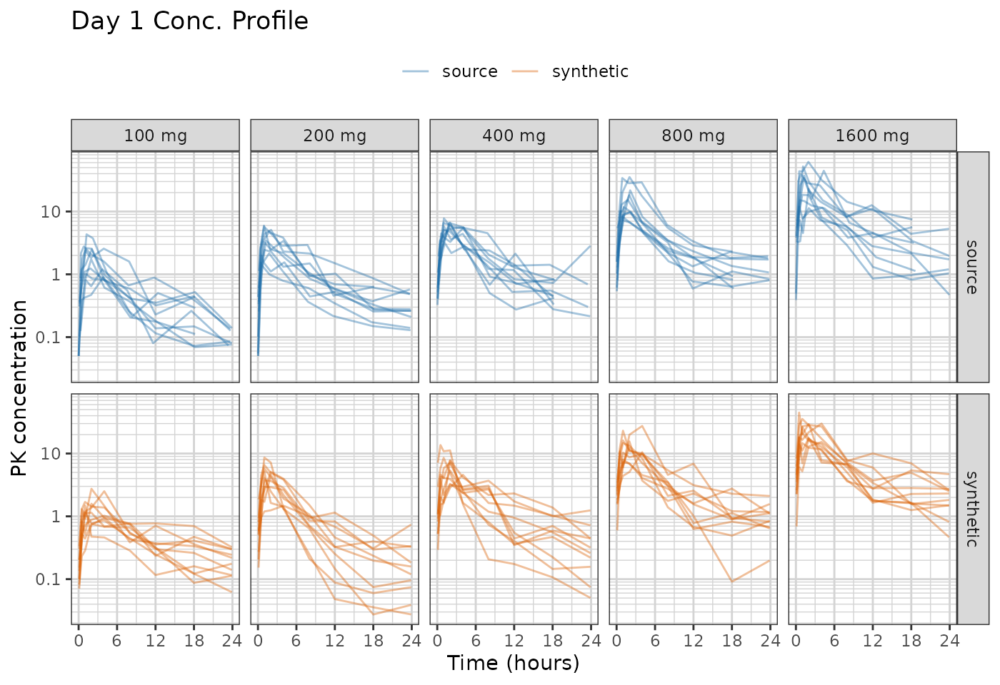
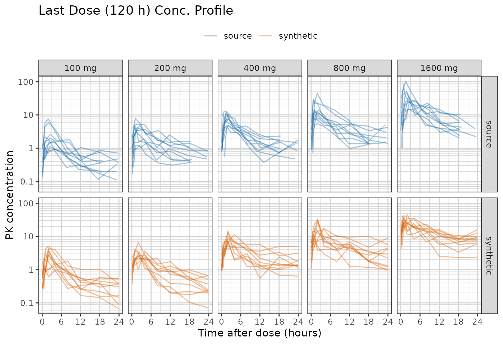
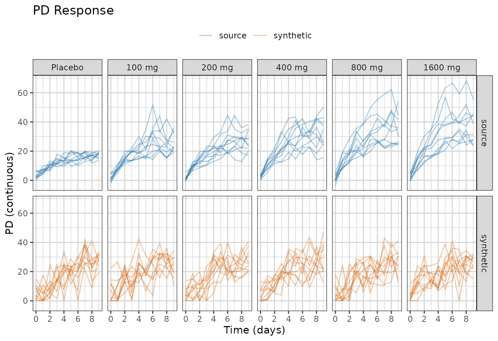
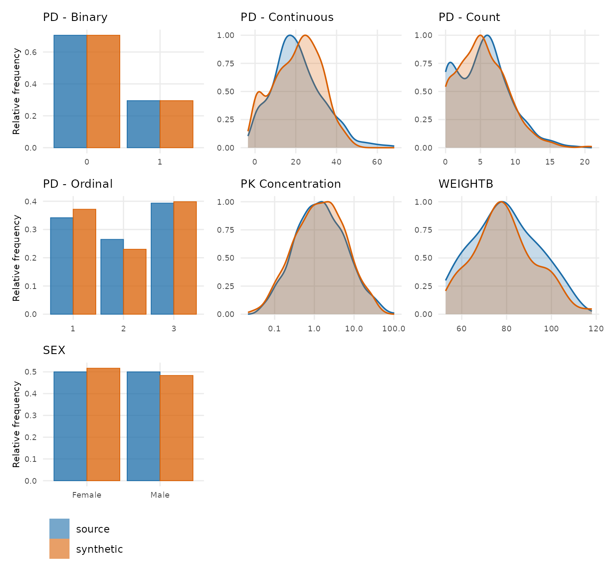

# Demo: Using synpmx_model

Fit a population model to a study, look at what the fit carries, and
generate a synthetic dataset by simulating from it. Generation uses
fitted population parameters and study summaries: structural curves,
between-subject variability, residual error, endpoint frequencies, a
planned dose schedule per arm, and dose changes and one attendance rate
per endpoint, pooled over the arms. It does not read the original
patient rows.

It makes no formal privacy claim, and **it is not for estimation** — the
fitted parameters exist to make simulated profiles look like the source
study, and the object prints that warning with itself. The full
specification is in
[`vignette("pmxmodel-algorithm")`](https://iamstein.github.io/synpmx/articles/pmxmodel-algorithm.md).

The dataset is [`xgxr::mad`](https://rdrr.io/pkg/xgxr/man/mad.html): 60
patients in six treatment arms, with a pharmacokinetic (PK)
concentration endpoint and continuous, count, ordinal and binary
pharmacodynamic (PD) endpoints.

## Configuration

To run this on your own study, edit the two chunks below that:

1.  Read in the dataset.
2.  Define the column roles.

The rest of the code can be kept as is.

``` r

library(dplyr)
raw <- as.data.frame(get(utils::data(list = "mad", package = "xgxr")))
SEED <- 808
```

The column meanings. Columns not specified here are dropped from the
synthetic dataset.

``` r

roles <- pmx_roles(
  id           = "ID",
  time         = "TIME",
  dv           = "LIDV",
  mdv          = "MDV",
  amt          = "AMT",
  evid         = "EVID",
  cmt          = "CMT",
  dvid         = "NAME",        # which endpoint each observation row is
  nominal_time = "NOMTIME",     # the grid the visit model is built on
  strata       = c("TRTACT", "DOSE"), # treatment arms, fitted one at a time
  covariates   = c("WEIGHTB", "SEX") # drawn independently of the profiles
)
```

## Fitting

[`synpmx_model_estimate()`](https://iamstein.github.io/synpmx/reference/synpmx_model_estimate.md)
is the only stage that reads patient data, and the only one that needs
`nlmixr2`. It works out which endpoint is the drug, what design produced
it, and tries two compartments with checked fallback to one.

``` r

fit <- synpmx_model_estimate(raw, roles, seed = 1)
```

The chunk above is shown rather than run. Fitting compiles a model, so
this document reads a stored
[`synpmx_model_estimate()`](https://iamstein.github.io/synpmx/reference/synpmx_model_estimate.md)
fit and `R CMD check` never needs a compiler.

The fitted clearance is 6 L/h and the volume 50 L. They put the
simulated profiles where the source’s are, and are not estimates to
report.

## What the fit carries

[`model_report()`](https://iamstein.github.io/synpmx/reference/model_report.md)
prints everything the generator will simulate from, and the diagnostics
beside it.
[`vignette("pmxmodel-fingerprint")`](https://iamstein.github.io/synpmx/articles/pmxmodel-fingerprint.md)
goes through each part, and
[`vignette("pmxmodel-algorithm")`](https://iamstein.github.io/synpmx/articles/pmxmodel-algorithm.md)
says how each is estimated.

``` r

model_report(fit)
#> Summarized from the source, not estimated
#>   cohort             60 patients in 6 arm(s)
#>                      Placebo / 0 (10)
#>                      100 mg / 100 (10)
#>                      200 mg / 200 (10)
#>                      400 mg / 400 (10)
#>                      800 mg / 800 (10)
#>                      1600 mg / 1600 (10)
#>   dose changes       none
#>   visit grid         5 endpoint(s) at 28 nominal time(s), 66 slot(s) in all
#>   visit attendance   share of scheduled slots attended, one rate per
#>                      endpoint: PK Concentration 100%, PD - Continuous 100%,
#>                      PD - Count 100%, PD - Binary 100%, PD - Ordinal 100%
#>   covariates         WEIGHTB lognormal, SEX categorical, drawn once for the
#>                      whole study, independently of the profiles
#>   discrete endpoints PD - Binary, PD - Ordinal: drawn from the frequencies
#>                      of their recorded levels, not simulated
#>   columns emitted    ID, TIME, NOMTIME, LIDV, AMT, EVID, CMT, NAME, MDV,
#>                      WEIGHTB, SEX, TRTACT, DOSE
#> 
#> Values at the lower limit of what was observed
#>     PK Concentration   0.02, no assay limit: half the lowest value several patients reached, rounded down
#>     PD - Continuous    0.1, no assay limit: half the lowest value several patients reached, rounded down
#> 
#> Each non-PK continuous endpoint, fitted as constant, linear, or exponential
#>   PD - Continuous    exponential
#>                        plateau          30
#>                        baseline         2
#>                        rate             0.01
#>                        between-subject  1 (SD on the log baseline)
#>                        residual         additive 8
#>                        chosen on AIC from constant, linear, exponential
#>   PD - Count         exponential
#>                        plateau          3
#>                        baseline         10
#>                        rate             0.01
#>                        between-subject  0.2 (SD on the log baseline)
#>                        residual         additive 3
#>                        chosen on AIC from constant, linear, exponential
#> 
#> PK endpoint for the PopPK model
#>   PK Concentration   inferred from the following data characteristics:
#>                        absent before the first dose
#>                        dose-proportional: the peak scales with the dose
#>                        recorded in the compartment the doses go into
#>                        rises to one peak and comes back down within one
#>                          dose interval
#>   route              oral: the median profile rises to a peak at 2 before
#>                      declining, and 100% of subjects do too
#>   sampling           median 13 distinct times after a dose, 9 after the
#>                      peak: richer within-subject sampling
#> 
#> The PopPK model
#> 
#> Estimated by nlmixr2
#>   structural model   2cmt_oral 
#>   selected by        two-compartment model passed acceptance checks
#>   fitted on          all 49 patients with a concentration
#>   fixed effects      cl 6, v 50, q 5, v2 100, ka 1 
#>   between-subject    cl 0.447, v 0.447, ka 0.316, q 0.548, v2 0.447 (as SD on the log scale)
#>   residual error     proportional 0.4 
#>   time to fit        2 min 48 s
#>   whole call         2 min 49 s, against 2 min 48 s in the fitter
#> 
#> Privacy
#>   one patient's pull pass: largest: PD - Continuous between-subject SD,
#>                      10.3 points; `model_privacy_checks()` has every check
#>   left out           1 patient(s), from the PK, PD and covariate estimates,
#>                      for moving PD - Continuous typical baseline by 16 %;
#>                      PD - Continuous between-subject SD by 23.7 points; the
#>                      dosing and visit models still read them
```

``` r

show(model_candidates(fit), "Models attempted and acceptance results")
```

## Generating

[`synpmx_model_generate()`](https://iamstein.github.io/synpmx/reference/synpmx_model_generate.md)
reads no patient data. Its arguments are the fit and a subject count, so
everything about the source that reaches the output has already passed
through the fit.

``` r

synthetic <- synpmx_model_generate(fit, seed = SEED)
```

The generated table follows the declared schema: retained columns and
classes, the same compartment numbers, and new identifiers.

``` r

show(head(synthetic, 10), "The first ten rows")
```

## Plot synthetic data and original data

Compare each endpoint on the recorded time scale, with source and
synthetic subjects shown separately within each treatment arm.

``` r

library(ggplot2)
library(xgxr)
xgx_theme_set()
comparison_colours <- c(source = "#1B6CA8", synthetic = "#D95F02")

both <- rbind(
  cbind(raw[, names(synthetic)], DATA = "source"),
  cbind(synthetic, DATA = "synthetic")
)
obs <- both[both$EVID == 0 & !is.na(both$LIDV), ]
obs$TRTACT <- factor(obs$TRTACT,
                     levels = c("Placebo", "100 mg", "200 mg", "400 mg",
                                "800 mg", "1600 mg"))
```

``` r

ggplot(obs[obs$NAME == "PK Concentration" & obs$TIME <= 24, ],
       aes(TIME, LIDV, group = ID, colour = DATA)) +
  geom_line(alpha = 0.4) +
  facet_grid(DATA~TRTACT) +
  xgx_scale_y_log10() +
  xgx_scale_x_time_units("hours", breaks = seq(0, 24, by = 6)) +
  scale_colour_manual(values = comparison_colours) +
  labs(x = "Time (hours)", y = "PK concentration", colour = NULL) +
  theme(legend.position = "top") +
  ggtitle("Day 1 Conc. Profile")
```



``` r

last_dose <- obs[obs$NAME == "PK Concentration" &
                   obs$TIME >= 120 & obs$TIME <= 144, ]
last_dose$TAD <- last_dose$TIME - 120

ggplot(last_dose, aes(TAD, LIDV, group = ID, colour = DATA)) +
  geom_line(alpha = 0.4) +
  facet_grid(DATA~TRTACT) +
  xgx_scale_y_log10() +
  xgx_scale_x_time_units("hours", breaks = seq(0, 24, by = 6)) +
  scale_colour_manual(values = comparison_colours) +
  labs(x = "Time after dose (hours)", y = "PK concentration", colour = NULL) +
  theme(legend.position = "top") +
  ggtitle("Last Dose (120 h) Conc. Profile")
```



Every synthetic concentration profile uses the selected structural curve
with new parameter draws and residual error. Compare the rise, decline
and spread within each arm: pooled generation checks can miss
discrepancies confined to one dose group or part of the sampling window.

``` r

ggplot(obs[obs$NAME == "PD - Continuous", ],
       aes(TIME, LIDV, group = ID, colour = DATA)) +
  geom_line(alpha = 0.35) +
  xgx_scale_x_time_units(units_dataset = "hours", units_plot = "days") +
  facet_grid(DATA~TRTACT) +
  scale_colour_manual(values = comparison_colours) +
  labs(x = "Time (days)", y = "PD (continuous)", colour = NULL) +
  theme(legend.position = "top") +
  ggtitle("PD Response")
```



The PD time course has no exposure term, so a synthetic patient’s arm
does not reach their response. The `mad` section of the [public-data
evaluation](https://iamstein.github.io/synpmx/articles/pmxmodel-public-data-examples.html#mad-five-endpoints-only-one-of-them-a-concentration)
compares the late response by arm.

## Distributions of Synthetic and Original Data

One panel per endpoint and per baseline covariate, source against
synthetic.
[`compare_pmx_distributions_height()`](https://iamstein.github.io/synpmx/reference/compare_pmx_distributions_height.md)
sizes the figure, since it grows a row of panels at a time;
`output = "tables"` gives the numbers behind it.

``` r

compare_pmx_distributions(raw, synthetic, roles)
```



## Scoring it

[`synpmx_scorecard()`](https://iamstein.github.io/synpmx/reference/synpmx_scorecard.md)
does not know what produced the dataset it scores, so it reads this
output the same way it reads an AVATAR or PCA one.

``` r

card <- synpmx_scorecard(raw, synthetic, roles)
synpmx_scorecard_datatable(card)
```

Checks requiring an AVATAR run record are not applicable to this
generator.
[`vignette("scorecard")`](https://iamstein.github.io/synpmx/articles/scorecard.md)
documents what each row asks and what its pass criterion is.

## One call

[`synpmx_model()`](https://iamstein.github.io/synpmx/reference/synpmx_model.md)
is the two stages together, for when you do not need to look at the fit
first. The result carries the fit’s release as an attribute, which is
what generation read; the candidate table and the other diagnostics are
only on the fit itself.

``` r

synthetic <- synpmx_model(raw, roles, seed = SEED)
attr(synthetic, "pmx_fitted_model")
```

## See also

- [`vignette("pmxmodel-algorithm")`](https://iamstein.github.io/synpmx/articles/pmxmodel-algorithm.md)
  — what each step does and why.
- [`vignette("pmxmodel-fingerprint")`](https://iamstein.github.io/synpmx/articles/pmxmodel-fingerprint.md)
  — every quantity the fit carries out of the study, in detail.
- [Evaluating the model generator on public
  data](https://iamstein.github.io/synpmx/articles/pmxmodel-public-data-examples.html)
  — the same generator over the public studies the other two surveys
  use.
- [`vignette("pca-demo")`](https://iamstein.github.io/synpmx/articles/pca-demo.md)
  — a worked study through the principal-component generator.
- [`vignette("avatar-demo")`](https://iamstein.github.io/synpmx/articles/avatar-demo.md)
  — a worked study through blending.
- [`vignette("scorecard")`](https://iamstein.github.io/synpmx/articles/scorecard.md)
  — the checks above, in detail.
- [Privacy protections in the PMX model
  generator](https://iamstein.github.io/synpmx/articles/pmxmodel-privacy.html)
  — what leaves the study, and the checks on it.
