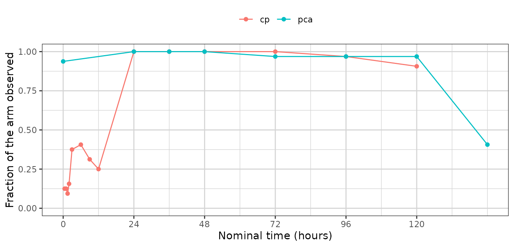

# The PMX model study fingerprint

Every generator in this package reduces a study to a **fingerprint** — a
set of summaries small enough to carry out of the environment that holds
the real data, and complete enough to build a synthetic study from. The
fingerprint is the whole of what a synthetic dataset descends from.
Nothing else about the source reaches it, which is why looking at the
fingerprint is how you decide whether the output can be trusted, and how
you satisfy yourself that no patient left the room.

[`synpmx_model_estimate()`](https://iamstein.github.io/synpmx/reference/synpmx_model_estimate.md)
returns this generator’s fingerprint, as a `pmx_fitted_model`.
[`synpmx_model_generate()`](https://iamstein.github.io/synpmx/reference/synpmx_model_generate.md)
reads that object and no patient row.

This vignette walks through it group by group. It is a reference: read
[`vignette("pmxmodel-demo")`](https://iamstein.github.io/synpmx/articles/pmxmodel-demo.md)
first for a run end to end, and
[`vignette("pmxmodel-algorithm")`](https://iamstein.github.io/synpmx/articles/pmxmodel-algorithm.md)
for how each quantity is arrived at and why.
[`vignette("pca-fingerprint")`](https://iamstein.github.io/synpmx/articles/pca-fingerprint.md)
is the same walk through the PCA generator’s fingerprint, and the two
are worth reading side by side.

## Two halves, and they are not alike

This fingerprint divides more sharply than the PCA one does.

**The estimated half** is a population model: a structural form, a
handful of fixed effects, a covariance matrix, a residual error. It is
perhaps twenty numbers describing the shape of every profile in the
study, which is a very small fingerprint for a very strong claim. It
also looks exactly like the output of a real population analysis, and it
is not one — the candidate set is small and the covariate model is
allometric scaling or nothing.

**The summarized half** is the study’s apparatus: who was in which arm,
when doses were planned and how patients departed from that plan, which
visits were attended, what the covariates looked like, where the assay
limit sat. None of this is estimated. It is exactly the apparatus
[`synpmx_pca_summarize()`](https://iamstein.github.io/synpmx/reference/synpmx_pca_summarize.md)
builds, from the same code.

The two halves carry different risks. Twenty fitted numbers are a
compact summary of 32 people; a per-arm dosing model with a cycle grid
can be much larger and is backed by one arm’s patients rather than the
whole cohort.

## The study

[`nlmixr2data::warfarin`](https://nlmixr2.github.io/nlmixr2data/reference/warfarin.html)
— thirty-two patients, a single oral dose, a concentration endpoint and
a pharmacodynamic one.

``` r

data("warfarin", package = "nlmixr2data")
warfarin <- as.data.frame(warfarin)
warfarin$ntime <- warfarin$time
roles <- pmx_roles(
  id = "id", time = "time", nominal_time = "ntime", dv = "dv", amt = "amt",
  evid = "evid", dvid = "dvid", covariates = c("wt", "age", "sex")
)
```

``` r

fit <- synpmx_model_estimate(warfarin, roles, seed = 1)
```

The chunk above is shown rather than run: fitting compiles a model, so
this document reads a stored fit and `R CMD check` never needs a
compiler.

``` r

fit
#> A fitted PMX model, from synpmx_model_estimate()
#> 
#>   fitted on    32 patients, 1 arm(s)
#>   structural   1cmt_oral (chosen from 1 candidate(s) on AIC) 
#>   fixed        cl 0.1361, v 7.802, ka 0.562 
#>   random on    cl, v, ka 
#>   pk endpoint  cp 
#> 
#>   These parameters are not estimates to report. They exist to make
#>   simulated profiles resemble the source study; the candidate set is too
#>   small and the covariate model too thin for any of them to answer a
#>   scientific question.
```

## The inventory

[`model_report()`](https://iamstein.github.io/synpmx/reference/model_report.md)
is the top-level account, and it separates the two halves because they
answer to different things.

``` r

model_report(fit)
#> What this fitted model carries
#> 
#> Estimated by nlmixr2
#>   structural model   1cmt_oral 
#>   fixed effects      cl 0.1361, v 7.802, ka 0.562 
#>   between-subject    cl 0.252, v 0.14, ka 0.638 (as SD on the log scale)
#>   residual error     additive 1.07 
#>   covariate effects  cl ~ (wt/70)^0.75, v ~ (wt/70)^1.00 
#>   pd shapes          pca: linear 
#> 
#> Summarized from the source, not estimated
#>   cohort             32 patients in 1 arm(s)
#>   visit model        22 grid cells over 2 endpoint(s)
#>   dosing model       1 planned cycle(s) per arm | no reductions, skips or early stops 
#> 
#> How the concentration endpoint was decided
#>   endpoint           cp (inferred) 
#>  endpoint compartment post_dose shape proportional
#>        cp          NA      TRUE  TRUE           NA
#>       pca          NA      TRUE FALSE           NA
#>   design             the median profile rises to a peak at 9 before declining, and 31% of subjects do too 
#> 
#> Covariate against the individual random effects
#>  covariate parameter correlation
#>        age        ka      -0.260
#>        sex         v      -0.225
#>        age        cl       0.160
#>        sex        ka      -0.095
#>         wt        cl      -0.078
#> 
#>   A covariate that moves with a random effect and is not in the model above
#>   is generated independently of the profiles, so the synthetic data carries
#>   no relationship between them. `synpmx_avatar()` keeps those relationships
#>   without modelling them.
```

Every section below expands one part of it. The object is a plain list
and the names used are its own, so a quantity can be reached directly
when no accessor covers it.

``` r

names(fit)
#>  [1] "structural"        "candidates"        "parameters"       
#>  [4] "endpoints"         "arms"              "dosing"           
#>  [7] "visits"            "schema"            "roles"            
#> [10] "settings"          "n_source"          "cells"            
#> [13] "pd"                "covariate_effects" "covariates"       
#> [16] "discrete"          "design"            "correlations"     
#> [19] "censoring"
```

## The settings that produced it

``` r

unlist(fit$settings)
#>      min_subjects  min_arm_patients     min_time_bins        estimation 
#>              "20"               "3"               "6"           "focei" 
#> covariate_effects             error 
#>            "auto"             "add"
c(patients = fit$n_source, arms = length(fit$arms$arms))
#> patients     arms 
#>       32        1
```

## How the concentration endpoint was decided

Not a released quantity, but the first thing to read: everything
downstream is a model *of* this endpoint, and if the wrong one was
chosen nothing else matters.

``` r

show(fit$endpoints$signals, "The four signals, per endpoint")
```

`proportional` reads `NA` here because `warfarin` gives every patient
the same dose, so there are no dose levels to compare — the
classification rests on the remaining signals. A column of `NA` under
`proportional` is the object telling you how little evidence it had, and
`endpoint_roles` is how you overrule it.

``` r

fit$design$reason
#> [1] "the median profile rises to a peak at 9 before declining, and 31% of subjects do too"
fit$endpoints$decided_by
#> [1] "inferred"
```

## The structural model

``` r

fit$structural
#> [1] "1cmt_oral"
model_candidates(fit)
#>       model converged      aic note
#> 1 1cmt_oral      TRUE 887.3187
```

One row, because the default fits one model. `pk` is what asks for more.

## The fixed effects

The typical parameters, on the natural scale. These are the numbers that
look most like a result and are least entitled to be read as one.

``` r

model_parameters(fit)$fixed
#>        cl         v        ka 
#> 0.1361443 7.8018967 0.5620203
```

## Between-subject variability

A covariance matrix on the log scale, one row per parameter carrying a
random effect. Generation draws each synthetic subject’s deviations from
this matrix.

``` r

model_parameters(fit)$omega
#>            cl          v        ka
#> cl 0.06375255 0.00000000 0.0000000
#> v  0.00000000 0.01971671 0.0000000
#> ka 0.00000000 0.00000000 0.4076615
sqrt(diag(model_parameters(fit)$omega))  # as CV on the log scale
#>        cl         v        ka 
#> 0.2524927 0.1404162 0.6384838
```

**No individual estimates.** Empirical Bayes estimates are per-subject
quantities, and an object carrying them would be a description of each
real patient. They are not here. This matrix is what stands in for them,
and it is a statement about the population rather than about anybody in
it.

## The residual error

``` r

model_parameters(fit)$residual
#> $kind
#> [1] "additive"
#> 
#> $sd
#> [1] 1.070306
```

Additive here rather than proportional, because `warfarin` holds
concentrations recorded as zero and a proportional error on zero is
zero. The substitution is recorded on the object rather than being
silent.

## What the assay limit cost

Values below the limit are imputed before anything is fitted, and the
boundary is put back when data is generated. That is the intended
behaviour — it is what lets every part of the fingerprint read a latent
value rather than a stack of identical boundary substitutions — but it
is an assumption, and its weight is the share of each endpoint carrying
it.

``` r

fit$censoring
#> NULL
```

`warfarin` declares no censoring, so nothing here was imputed. On a
study where it is, this is the line to read before trusting the
concentrations:
[`xgxr::case1_pkpd`](https://rdrr.io/pkg/xgxr/man/case1_pkpd.html) has
46% of its concentrations below the limit and 95% of the lowest dose
arm, and there the fitted parameters are substantially a statement about
the draw.

## The covariate effects

``` r

fit$covariate_effects
#> $cl
#> $cl$covariate
#> [1] "wt"
#> 
#> $cl$reference
#> [1] 70
#> 
#> $cl$exponent
#> [1] 0.75
#> 
#> 
#> $v
#> $v$covariate
#> [1] "wt"
#> 
#> $v$reference
#> [1] 70
#> 
#> $v$exponent
#> [1] 1
```

Allometric scaling on clearance and volume, with the standard exponents.
It is asserted rather than tested —
[`vignette("pmxmodel-algorithm")`](https://iamstein.github.io/synpmx/articles/pmxmodel-algorithm.md)
says why — and `covariate_effects = "none"` removes it.

### What is *not* modelled shows up here

``` r

show(fit$correlations[order(-abs(fit$correlations$correlation)), ],
     "Each covariate against the individual random effects")
```

This is the most important table in the document, and it is a diagnostic
rather than a released quantity. A covariate that moves with a random
effect and is not in the model above is generated **independently** of
the profiles, so the synthetic data carries no relationship between the
two.
[`synpmx_avatar()`](https://iamstein.github.io/synpmx/reference/synpmx_avatar.md)
preserves those relationships without modelling them, because a blended
subject’s covariates and profile come from the same donors.

The correlations are computed from the individual random effects and
only the correlations are kept, so no per-subject quantity survives into
the object.

## The pharmacodynamic shapes

``` r

lapply(fit$pd, function(shape) c(shape = shape$pd, round(shape$typical, 3)))
#> $pca
#>    shape baseline    slope 
#> "linear" "52.235"  "-0.24"
```

``` r

show(fit$pd[[1L]]$candidates, "The three shapes, compared on AIC")
```

A time course with no exposure term. A PD endpoint driven by
concentration is reproduced as a curve that resembles the average
subject’s response, which is adequate for exercising longitudinal code
and is not an exposure-response model.

## The covariate distributions

One distribution per covariate per arm, drawn from independently at
generation.

``` r

str(fit$covariates, max.level = 3)
#> List of 1
#>  $ all:List of 3
#>   ..$ wt :List of 4
#>   .. ..$ kind   : chr "lognormal"
#>   .. ..$ meanlog: num 4.23
#>   .. ..$ sdlog  : num 0.19
#>   .. ..$ median : num 71.7
#>   ..$ age:List of 4
#>   .. ..$ kind   : chr "lognormal"
#>   .. ..$ meanlog: num 3.39
#>   .. ..$ sdlog  : num 0.304
#>   .. ..$ median : num 27.5
#>   ..$ sex:List of 3
#>   .. ..$ kind       : chr "categorical"
#>   .. ..$ levels     : chr [1:2] "female" "male"
#>   .. ..$ probability: num [1:2] 0.156 0.844
```

## The arms

``` r

data.frame(arm = fit$arms$arms, patients = as.integer(fit$arms$sizes))
#>   arm patients
#> 1 all       32
```

## The dosing model

Per arm: a planned schedule, a dose ladder, and three discrete-time
hazards. This is the apparatus
[`synpmx_pca_summarize()`](https://iamstein.github.io/synpmx/reference/synpmx_pca_summarize.md)
builds, unchanged.

``` r

arm <- fit$arms$arms[[1L]]
show(fit$dosing[[arm]]$planned, "The planned schedule")
```

``` r

dosing <- fit$dosing[[fit$arms$arms[[1L]]]]
c(levels = length(dosing$levels), reduction = dosing$reduction,
  interruption = dosing$interruption, discontinuation = dosing$discontinuation)
#>          levels       reduction    interruption discontinuation 
#>               1               0               0               0
```

`warfarin` is a single dose that everybody received, so the ladder has
one level and all three rates are zero. The model then reproduces the
planned schedule exactly, which is the right answer and is what those
zeros say. On a study where patients reduce, skip cycles or come off
treatment, these are the numbers that carry it — and because the
schedule is drawn *before* the profile is computed from it, a synthetic
subject who steps down has the lower exposure that implies.

## The visit model

Per endpoint and per retained nominal time, the fraction of the arm
holding an observation there. Attendance is drawn per visit at
generation.

``` r

cells <- fit$cells
cells$probability <- as.numeric(fit$visits[[fit$arms$arms[[1L]]]]$probability)
show(cells[, c("endpoint", "time", "probability")],
     "Attendance, per grid cell", paged = TRUE)
```

``` r

library(ggplot2)
library(xgxr)
xgx_theme_set()

ggplot(cells, aes(time, probability, colour = endpoint)) +
  geom_line() + geom_point(size = 1.5) +
  ylim(0, 1) +
  xgx_scale_x_time_units("hours", breaks = seq(0, 120, by = 24)) +
  labs(x = "Nominal time (hours)", y = "Fraction of the arm observed",
       colour = NULL) +
  theme(legend.position = "top")
```



A cell is kept only where at least `min_arm_patients` distinct patients
hold an observation there. A nominal time one patient attended is that
patient, and generating from it would put them back.

## The schema

What the generated table has to look like to be the same study: the
columns and their classes, the compartment numbers, the assay limit per
endpoint, and how identifiers are written.

``` r

fit$schema$columns
#>  [1] "id"    "time"  "ntime" "dv"    "amt"   "evid"  "dvid"  "wt"    "age"  
#> [10] "sex"
fit$schema$cmt_dose
#> NULL
unlist(fit$schema$cmt_obs)
#> NULL
fit$schema$censoring
#> $cp
#> NULL
#> 
#> $pca
#> NULL
```

## Generating from it

Everything above, and nothing else, is what the next line reads.

``` r

synthetic <- synpmx_model_generate(fit, n_subjects = 32, seed = 7)
str(synthetic)
#> 'data.frame':    513 obs. of  10 variables:
#>  $ id   : int  34 34 34 34 34 34 34 34 34 34 ...
#>  $ time : num  0 0 3 9 24 24 36 36 48 48 ...
#>  $ ntime: num  0 0 3 9 24 24 36 36 48 48 ...
#>  $ dv   : num  NA 58 18.6 15.5 13.8 ...
#>  $ amt  : num  120 0 0 0 0 0 0 0 0 0 ...
#>  $ evid : int  1 0 0 0 0 0 0 0 0 0 ...
#>  $ dvid : chr  NA "pca" "cp" "cp" ...
#>  $ wt   : num  52.1 52.1 52.1 52.1 52.1 ...
#>  $ age  : int  33 33 33 33 33 33 33 33 33 33 ...
#>  $ sex  : Factor w/ 2 levels "female","male": 2 2 2 2 2 2 2 2 2 2 ...
#>  - attr(*, "pmx_fitted_model")=List of 19
#>   ..$ structural       : chr "1cmt_oral"
#>   ..$ candidates       :'data.frame':    1 obs. of  4 variables:
#>   .. ..$ model    : chr "1cmt_oral"
#>   .. ..$ converged: logi TRUE
#>   .. ..$ aic      : num 887
#>   .. ..$ note     : chr ""
#>   ..$ parameters       :List of 3
#>   .. ..$ fixed   : Named num [1:3] 0.136 7.802 0.562
#>   .. .. ..- attr(*, "names")= chr [1:3] "cl" "v" "ka"
#>   .. ..$ omega   : num [1:3, 1:3] 0.0638 0 0 0 0.0197 ...
#>   .. .. ..- attr(*, "dimnames")=List of 2
#>   .. .. .. ..$ : chr [1:3] "cl" "v" "ka"
#>   .. .. .. ..$ : chr [1:3] "cl" "v" "ka"
#>   .. ..$ residual:List of 2
#>   .. .. ..$ kind: chr "additive"
#>   .. .. ..$ sd  : num 1.07
#>   ..$ endpoints        :List of 5
#>   .. ..$ pk        : chr "cp"
#>   .. ..$ pd        : chr "pca"
#>   .. ..$ discrete  : chr(0) 
#>   .. ..$ signals   :'data.frame':    2 obs. of  5 variables:
#>   .. .. ..$ endpoint    : chr [1:2] "cp" "pca"
#>   .. .. ..$ compartment : logi [1:2] NA NA
#>   .. .. ..$ post_dose   : logi [1:2] TRUE TRUE
#>   .. .. ..$ shape       : logi [1:2] TRUE FALSE
#>   .. .. ..$ proportional: logi [1:2] NA NA
#>   .. ..$ decided_by: chr "inferred"
#>   ..$ arms             :List of 2
#>   .. ..$ arms : chr "all"
#>   .. ..$ sizes: Named int 32
#>   .. .. ..- attr(*, "names")= chr "all"
#>   ..$ dosing           :List of 1
#>   .. ..$ all:List of 8
#>   .. .. ..$ planned        :'data.frame':    1 obs. of  3 variables:
#>   .. .. .. ..$ cycle: int 1
#>   .. .. .. ..$ time : num 0
#>   .. .. .. ..$ amt  : num 120
#>   .. .. ..$ levels         : num 1
#>   .. .. ..$ discontinuation: num 0
#>   .. .. ..$ interruption   : num 0
#>   .. .. ..$ reduction      : num 0
#>   .. .. ..$ patients       : int 32
#>   .. .. ..$ distinct       : int 20
#>   .. .. ..$ source_doses   : num 1
#>   ..$ visits           :List of 1
#>   .. ..$ all:List of 2
#>   .. .. ..$ cells      : Named int [1:22] 1 2 3 4 5 6 7 8 9 10 ...
#>   .. .. .. ..- attr(*, "names")= chr [1:22] "cp@0.5" "cp@1" "cp@1.5" "cp@2" ...
#>   .. .. ..$ probability: Named num [1:22] 0.125 0.125 0.0938 0.1562 0.375 ...
#>   .. .. .. ..- attr(*, "names")= chr [1:22] "cp@0.5" "cp@1" "cp@1.5" "cp@2" ...
#>   ..$ schema           :List of 11
#>   .. ..$ censoring     :List of 2
#>   .. .. ..$ cp : NULL
#>   .. .. ..$ pca: NULL
#>   .. ..$ columns       : chr [1:10] "id" "time" "ntime" "dv" ...
#>   .. ..$ prototypes    :List of 10
#>   .. .. ..$ id   : int(0) 
#>   .. .. ..$ time : num(0) 
#>   .. .. ..$ ntime: num(0) 
#>   .. .. ..$ dv   : num(0) 
#>   .. .. ..$ amt  : num(0) 
#>   .. .. ..$ evid : int(0) 
#>   .. .. ..$ dvid : Factor w/ 2 levels "cp","pca": 
#>   .. .. ..$ wt   : num(0) 
#>   .. .. ..$ age  : int(0) 
#>   .. .. ..$ sex  : Factor w/ 2 levels "female","male": 
#>   .. ..$ id_class      : chr "integer"
#>   .. ..$ id_offset     : int 33
#>   .. ..$ id_levels     : NULL
#>   .. ..$ cmt_dose      : NULL
#>   .. ..$ cmt_obs       :List of 2
#>   .. .. ..$ cp : NULL
#>   .. .. ..$ pca: NULL
#>   .. ..$ carried       : NULL
#>   .. ..$ arm_values    :List of 1
#>   .. .. ..$ all: list()
#>   .. ..$ endpoint_specs:List of 2
#>   .. .. ..$ cp :List of 5
#>   .. .. .. ..$ type       : chr "continuous"
#>   .. .. .. ..$ levels     : NULL
#>   .. .. .. ..$ nonnegative: logi FALSE
#>   .. .. .. ..$ reason     : chr "not every observed value is a whole number"
#>   .. .. .. ..$ declared   : logi FALSE
#>   .. .. ..$ pca:List of 5
#>   .. .. .. ..$ type       : chr "integer"
#>   .. .. .. ..$ levels     : NULL
#>   .. .. .. ..$ nonnegative: logi TRUE
#>   .. .. .. ..$ reason     : chr "53 whole-number levels, from 9 to 100"
#>   .. .. .. ..$ declared   : logi FALSE
#>   ..$ roles            :List of 19
#>   .. ..$ id            : chr "id"
#>   .. ..$ time          : chr "time"
#>   .. ..$ nominal_time  : chr "ntime"
#>   .. ..$ tad           : NULL
#>   .. ..$ occasion      : NULL
#>   .. ..$ dv            : chr "dv"
#>   .. ..$ amt           : chr "amt"
#>   .. ..$ evid          : chr "evid"
#>   .. ..$ cmt           : NULL
#>   .. ..$ dvid          : chr "dvid"
#>   .. ..$ mdv           : NULL
#>   .. ..$ rate          : NULL
#>   .. ..$ cens          : NULL
#>   .. ..$ limit         : NULL
#>   .. ..$ addl          : NULL
#>   .. ..$ ii            : NULL
#>   .. ..$ assigned_dose : NULL
#>   .. ..$ dose_covariate: NULL
#>   .. ..$ covariates    : chr [1:3] "wt" "age" "sex"
#>   .. ..- attr(*, "class")= chr "pmx_roles"
#>   ..$ settings         :List of 6
#>   .. ..$ min_subjects     : int 20
#>   .. ..$ min_arm_patients : int 3
#>   .. ..$ min_time_bins    : int 6
#>   .. ..$ estimation       : chr "focei"
#>   .. ..$ covariate_effects: chr "auto"
#>   .. ..$ error            : chr "add"
#>   ..$ n_source         : int 32
#>   ..$ cells            :'data.frame':    22 obs. of  4 variables:
#>   .. ..$ index   : int [1:22] 1 2 3 4 5 6 7 8 9 10 ...
#>   .. ..$ name    : chr [1:22] "cp@0.5" "cp@1" "cp@1.5" "cp@2" ...
#>   .. ..$ endpoint: chr [1:22] "cp" "cp" "cp" "cp" ...
#>   .. ..$ time    : num [1:22] 0.5 1 1.5 2 3 6 9 12 24 36 ...
#>   ..$ pd               :List of 1
#>   .. ..$ pca:List of 6
#>   .. .. ..$ pd         : chr "linear"
#>   .. .. ..$ typical    : Named num [1:2] 52.23 -0.24
#>   .. .. .. ..- attr(*, "names")= chr [1:2] "baseline" "slope"
#>   .. .. ..$ aic        : num 2137
#>   .. .. ..$ baseline_cv: num 0.227
#>   .. .. ..$ residual   :List of 2
#>   .. .. .. ..$ kind: chr "additive"
#>   .. .. .. ..$ sd  : num 24
#>   .. .. ..$ candidates :'data.frame':    2 obs. of  2 variables:
#>   .. .. .. ..$ shape: chr [1:2] "constant" "linear"
#>   .. .. .. ..$ aic  : num [1:2] 2174 2137
#>   ..$ covariate_effects:List of 2
#>   .. ..$ cl:List of 3
#>   .. .. ..$ covariate: chr "wt"
#>   .. .. ..$ reference: num 70
#>   .. .. ..$ exponent : num 0.75
#>   .. ..$ v :List of 3
#>   .. .. ..$ covariate: chr "wt"
#>   .. .. ..$ reference: num 70
#>   .. .. ..$ exponent : num 1
#>   ..$ covariates       :List of 1
#>   .. ..$ all:List of 3
#>   .. .. ..$ wt :List of 4
#>   .. .. .. ..$ kind   : chr "lognormal"
#>   .. .. .. ..$ meanlog: num 4.23
#>   .. .. .. ..$ sdlog  : num 0.19
#>   .. .. .. ..$ median : num 71.7
#>   .. .. ..$ age:List of 4
#>   .. .. .. ..$ kind   : chr "lognormal"
#>   .. .. .. ..$ meanlog: num 3.39
#>   .. .. .. ..$ sdlog  : num 0.304
#>   .. .. .. ..$ median : num 27.5
#>   .. .. ..$ sex:List of 3
#>   .. .. .. ..$ kind       : chr "categorical"
#>   .. .. .. ..$ levels     : chr [1:2] "female" "male"
#>   .. .. .. ..$ probability: num [1:2] 0.156 0.844
#>   ..$ discrete         :List of 1
#>   .. ..$ all:List of 22
#>   .. .. ..$ :List of 2
#>   .. .. .. ..$ levels     : num 0
#>   .. .. .. ..$ probability: num 1
#>   .. .. ..$ :List of 2
#>   .. .. .. ..$ levels     : num [1:4] 1 1.9 2.7 6.6
#>   .. .. .. ..$ probability: num [1:4] 0.25 0.25 0.25 0.25
#>   .. .. ..$ :List of 2
#>   .. .. .. ..$ levels     : num [1:3] 0.6 11.4 3.6
#>   .. .. .. ..$ probability: num [1:3] 0.333 0.333 0.333
#>   .. .. ..$ :List of 2
#>   .. .. .. ..$ levels     : num [1:5] 11.6 17.6 3.3 4.6 8.4
#>   .. .. .. ..$ probability: num [1:5] 0.2 0.2 0.2 0.2 0.2
#>   .. .. ..$ :List of 2
#>   .. .. .. ..$ levels     : num [1:13] 11.1 11.6 11.9 12 12.7 12.9 13.4 15.4 17.3 2.8 ...
#>   .. .. .. ..$ probability: num [1:13] 0.0769 0.0769 0.0769 0.0769 0.0769 ...
#>   .. .. ..$ :List of 2
#>   .. .. .. ..$ levels     : num [1:14] 11.3 11.5 11.7 11.9 12.4 12.7 12.9 13.2 13.8 15 ...
#>   .. .. .. ..$ probability: num [1:14] 0.0714 0.0714 0.0714 0.0714 0.0714 ...
#>   .. .. ..$ :List of 2
#>   .. .. .. ..$ levels     : num [1:10] 10.2 10.8 11.4 12.2 12.7 12.9 14.4 15 9.7 9.8
#>   .. .. .. ..$ probability: num [1:10] 0.0909 0.0909 0.0909 0.0909 0.0909 ...
#>   .. .. ..$ :List of 2
#>   .. .. .. ..$ levels     : num [1:6] 11 11.4 12.4 14 8.6 8.8
#>   .. .. .. ..$ probability: num [1:6] 0.333 0.111 0.111 0.111 0.222 ...
#>   .. .. ..$ :List of 2
#>   .. .. .. ..$ levels     : num [1:28] 10 10.1 10.4 10.5 11 11.8 5.6 6.1 6.4 6.5 ...
#>   .. .. .. ..$ probability: num [1:28] 0.0312 0.0312 0.0312 0.0312 0.0312 ...
#>   .. .. ..$ :List of 2
#>   .. .. .. ..$ levels     : num [1:25] 10 3.5 4 5.2 5.3 5.7 6.1 6.4 6.6 6.9 ...
#>   .. .. .. ..$ probability: num [1:25] 0.0312 0.0312 0.0312 0.0312 0.0312 ...
#>   .. .. ..$ :List of 2
#>   .. .. .. ..$ levels     : num [1:23] 1.8 2.7 3.6 4.3 4.5 4.7 5.1 5.4 5.6 5.9 ...
#>   .. .. .. ..$ probability: num [1:23] 0.0312 0.0312 0.0625 0.0312 0.0312 ...
#>   .. .. ..$ :List of 2
#>   .. .. .. ..$ levels     : num [1:21] 0.8 1.5 2.4 2.7 3.2 3.3 3.4 3.6 4 4.1 ...
#>   .. .. .. ..$ probability: num [1:21] 0.0312 0.0312 0.0312 0.0312 0.0625 ...
#>   .. .. ..$ :List of 2
#>   .. .. .. ..$ levels     : num [1:18] 0.9 1 1.2 1.4 1.7 2.3 2.4 2.9 3 3.1 ...
#>   .. .. .. ..$ probability: num [1:18] 0.0323 0.0323 0.0323 0.0323 0.0323 ...
#>   .. .. ..$ :List of 2
#>   .. .. .. ..$ levels     : num [1:16] 0.9 1.1 1.3 1.4 1.7 1.9 2 2.2 2.3 2.4 ...
#>   .. .. .. ..$ probability: num [1:16] 0.0345 0.069 0.0345 0.0345 0.069 ...
#>   .. .. ..$ :List of 2
#>   .. .. .. ..$ levels     : num [1:7] 100 82 85 86 88 90 92
#>   .. .. .. ..$ probability: num [1:7] 0.7 0.0333 0.0667 0.0333 0.1 ...
#>   .. .. ..$ :List of 2
#>   .. .. .. ..$ levels     : num [1:16] 25 30 32 33 34 35 36 37 39 41 ...
#>   .. .. .. ..$ probability: num [1:16] 0.0312 0.0312 0.125 0.0625 0.0625 ...
#>   .. .. ..$ :List of 2
#>   .. .. .. ..$ levels     : num [1:13] 15 20 21 22 23 24 25 26 27 28 ...
#>   .. .. .. ..$ probability: num [1:13] 0.0312 0.125 0.0625 0.125 0.0938 ...
#>   .. .. ..$ :List of 2
#>   .. .. .. ..$ levels     : num [1:16] 11 12 13 14 15 16 17 18 19 20 ...
#>   .. .. .. ..$ probability: num [1:16] 0.0312 0.0312 0.0312 0.0312 0.0625 ...
#>   .. .. ..$ :List of 2
#>   .. .. .. ..$ levels     : num [1:18] 11 13 14 15 16 17 18 19 20 22 ...
#>   .. .. .. ..$ probability: num [1:18] 0.0323 0.0323 0.0645 0.0323 0.0645 ...
#>   .. .. ..$ :List of 2
#>   .. .. .. ..$ levels     : num [1:20] 14 15 17 18 19 20 21 22 23 28 ...
#>   .. .. .. ..$ probability: num [1:20] 0.0323 0.0323 0.0968 0.0645 0.0645 ...
#>   .. .. ..$ :List of 2
#>   .. .. .. ..$ levels     : num [1:27] 11 18 19 20 21 22 23 24 25 26 ...
#>   .. .. .. ..$ probability: num [1:27] 0.0323 0.0323 0.0323 0.0323 0.0323 ...
#>   .. .. ..$ :List of 2
#>   .. .. .. ..$ levels     : num [1:12] 100 12 25 33 35 39 41 45 48 54 ...
#>   .. .. .. ..$ probability: num [1:12] 0.0769 0.0769 0.0769 0.1538 0.0769 ...
#>   ..$ design           :List of 6
#>   .. ..$ route     : chr "oral"
#>   .. ..$ rising    : num 0.312
#>   .. ..$ reason    : chr "the median profile rises to a peak at 9 before declining, and 31% of subjects do too"
#>   .. ..$ interval  : int 1
#>   .. ..$ richness  :List of 4
#>   .. .. ..$ per_subject: num 6
#>   .. .. ..$ before_peak: num 0
#>   .. .. ..$ after_peak : num 6
#>   .. .. ..$ rich       : logi FALSE
#>   .. ..$ candidates: chr "1cmt_oral"
#>   ..$ correlations     :'data.frame':    9 obs. of  3 variables:
#>   .. ..$ covariate  : chr [1:9] "wt" "wt" "wt" "age" ...
#>   .. ..$ parameter  : chr [1:9] "cl" "v" "ka" "cl" ...
#>   .. ..$ correlation: num [1:9] -0.0782 -0.0104 0.0337 0.1601 0.0323 ...
#>   ..$ censoring        : NULL
#>   ..- attr(*, "class")= chr "pmx_fitted_model"
#>  - attr(*, "pmx_source")= chr "model"
```

## Where to go next

- [`vignette("pmxmodel-demo")`](https://iamstein.github.io/synpmx/articles/pmxmodel-demo.md)
  — this generator run on a study end to end.
- [`vignette("pmxmodel-algorithm")`](https://iamstein.github.io/synpmx/articles/pmxmodel-algorithm.md)
  — how each quantity above is arrived at.
- [`vignette("pca-fingerprint")`](https://iamstein.github.io/synpmx/articles/pca-fingerprint.md)
  — the same walk for the PCA generator, which carries the same
  apparatus and a completely different description of the profiles.
- [`vignette("avatar-scorecard")`](https://iamstein.github.io/synpmx/articles/avatar-scorecard.md)
  — the checks that read a generated dataset against its source.
