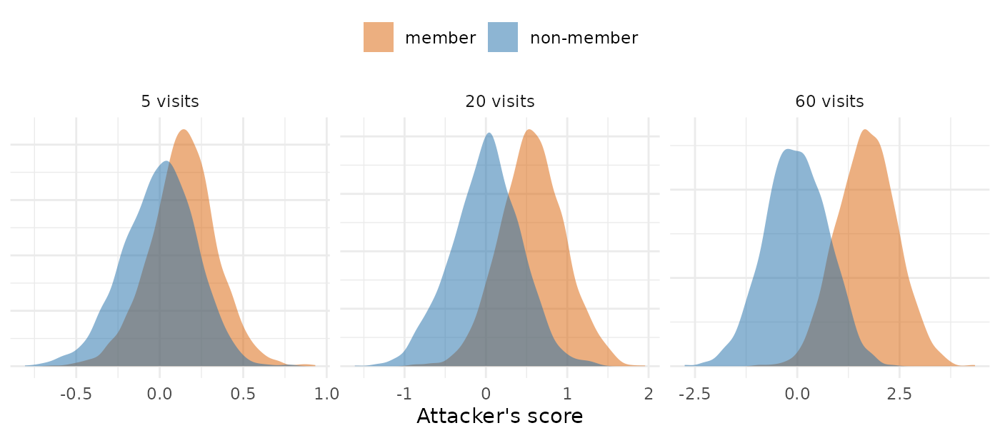

# Membership Inference Against the PMX Model Release

[Privacy protections in the PMX model
generator](https://iamstein.github.io/synpmx/articles/pmxmodel-privacy.html)
reports how well an attacker can tell whether a given patient was in a
study from what
[`synpmx_model()`](https://iamstein.github.io/synpmx/reference/synpmx_model.md)
releases. This article shows how those numbers are computed: what the
attacker holds, the score it gives each person, and how the area under
the curve (AUC) summarizes how well that score separates patients who
were in the study from patients who were not. Every number is computed
in this article.

**The simulated release is a simplified model of the real one, and is
not the package’s code.** It keeps the two kinds of number that
membership inference works on, a population model’s typical values and
variances, and the share of patients with an outcome at each visit, and
reduces each to what the attack needs. The code is shown in full at the
end.

## What the Attacker Holds

Membership inference asks one question about one person, the
**candidate**: was this person in the study? The attacker holds three
things:

1.  the release, which
    [`synpmx_model()`](https://iamstein.github.io/synpmx/reference/synpmx_model.md)
    attaches to every synthetic dataset it generates;
2.  the candidate’s own measurements of the kind the study made, such as
    their yes/no outcome at each visit, or their **random effects**,
    which say how far that person’s own drug clearance and volume sit
    from the typical values and which their concentrations imply;
3.  reference values for the population the study drew from, such as the
    true rate of a yes at each visit.

The attacker does not see the other patients. A patient in the study
contributed to every number in the release, so the release leans
slightly toward them; a patient who was not in it contributed nothing.
The attack measures that lean.

## One Arm, Five Visits

The smallest case shows every step. Ten patients record a yes/no outcome
at 5 visits, such as whether a symptom was present, and the true rate of
a yes differs by visit. Each row is a patient:

``` r

set.seed(3)
rate <- c(0.3, 0.5, 0.7, 0.4, 0.6)
arm <- draw_outcomes(10, rate, correlation = 0)
dimnames(arm) <- list(paste("patient", 1:10), paste("visit", 1:5))
arm
#>            visit 1 visit 2 visit 3 visit 4 visit 5
#> patient 1        1       1       0       0       0
#> patient 2        1       1       0       1       1
#> patient 3        1       1       0       0       0
#> patient 4        0       1       0       1       1
#> patient 5        0       1       1       0       1
#> patient 6        0       1       0       1       1
#> patient 7        1       0       0       0       1
#> patient 8        1       0       1       0       0
#> patient 9        0       1       1       1       0
#> patient 10       0       1       0       1       1
```

The release holds the share of patients with a yes at each visit, after
the floor that rounds a share with one or two patients on either side to
0 or 1:

``` r

released <- release_shares(arm, floor = 3)
rbind(true_rate = rate, released_share = released)
#>                visit 1 visit 2 visit 3 visit 4 visit 5
#> true_rate          0.3     0.5     0.7     0.4     0.6
#> released_share     0.5     1.0     0.3     0.5     0.6
```

At visit 2, 8 of the 10 patients had a yes, which leaves 2 with a no, so
the floor released the share as 1.

There are two candidates: patient 1, who is in the study, and a new
patient from the same population, who is not.

``` r

member <- unname(arm[1, ])
non_member <- draw_outcomes(1, rate, correlation = 0)[1, ]
```

**The score multiplies, at each visit, how far the candidate’s outcome
sits from the true rate by how far the released share sits from it, and
adds the products.** A product is positive when the candidate and the
release lean the same way: a yes where the share came out above the true
rate, or a no where it came out below.

``` r

data.frame(
  visit = 1:5, true_rate = rate, share = unname(released),
  member = member, member_term = (member - rate) * (released - rate),
  non_member = non_member,
  non_member_term = (non_member - rate) * (released - rate),
  row.names = NULL)
#>   visit true_rate share member member_term non_member non_member_term
#> 1     1       0.3   0.5      1        0.14          0           -0.06
#> 2     2       0.5   1.0      1        0.25          0           -0.25
#> 3     3       0.7   0.3      0        0.28          1           -0.12
#> 4     4       0.4   0.5      0       -0.04          0           -0.04
#> 5     5       0.6   0.6      0        0.00          1            0.00
scores <- c(member = frequency_score(member, rate, released),
            non_member = frequency_score(non_member, rate, released))
scores
#>     member non_member 
#>       0.63      -0.47
```

Patient 1 is one of the ten patients behind every share, so each share
leans one tenth of the way toward patient 1’s own outcome. The
non-member’s outcomes had no part in the shares. In this one study the
member scores higher than the non-member, but one study shows little,
because the shares also vary by chance from one study to the next, by
more than one patient’s tenth. The lean shows over many studies.

## From Scores to the AUC

The experiment is repeated: a new study is drawn, one member and one
non-member are scored, and this is done 2,000 times. Each panel shows
the two resulting piles of scores, for 10 patients measured at 5, 20 or
60 visits:

``` r

set.seed(11)
piles <- do.call(rbind, lapply(c(5, 20, 60), function(visits) {
  one <- frequency_scores(10, visits, correlation = 0, floor = 3,
                          draws = 2000)
  rbind(data.frame(visits = visits, candidate = "member",
                   score = one$member),
        data.frame(visits = visits, candidate = "non-member",
                   score = one$non_member))
}))
piles$panel <- factor(paste(piles$visits, "visits"),
                      levels = paste(c(5, 20, 60), "visits"))
```

``` r

ggplot2::ggplot(piles, ggplot2::aes(score, fill = candidate)) +
  ggplot2::geom_density(alpha = 0.5, colour = NA) +
  ggplot2::facet_wrap(~panel, scales = "free") +
  ggplot2::scale_fill_manual(values = c(member = "#D95F02",
                                        `non-member` = "#1B6CA8")) +
  ggplot2::labs(x = "Attacker's score", y = NULL, fill = NULL) +
  ggplot2::theme_minimal() +
  ggplot2::theme(axis.text.y = ggplot2::element_blank(),
                 legend.position = "top")
```



**The AUC is the probability that a randomly chosen member scores above
a randomly chosen non-member \[1\].** An AUC of 0.5 means the two piles
are the same, and the score is a coin toss. An AUC of 1 means every
member scores above every non-member. The name comes from the receiver
operating characteristic curve, which plots the share of members flagged
against the share of non-members flagged as a threshold on the score
moves; the area under it equals that probability.

``` r

panel_auc <- vapply(c(5, 20, 60), function(visits) {
  auc(piles$score[piles$visits == visits & piles$candidate == "member"],
      piles$score[piles$visits == visits & piles$candidate == "non-member"])
}, numeric(1))
data.frame(visits = c(5, 20, 60), auc = two(panel_auc))
#>   visits  auc
#> 1      5 0.68
#> 2     20 0.84
#> 3     60 0.95
```

An AUC is not the share of patients identified. An AUC of 0.84 means
that, shown one patient who was in the study and one who was not, the
attacker picks the right one that often. The piles still overlap, so for
any single person the attacker can be wrong; what the AUC measures is
how far the release, taken over many people, gives membership away.

## The Per-Visit Table, Row by Row

``` r

tables <- membership_tables()
frequency <- tables$frequency
data.frame(visits = frequency$visits,
           patients_behind_share = frequency$patients,
           correlation_within_patient = frequency$correlation,
           auc_without_floor = two(frequency$without_floor),
           auc_released = two(frequency$released))
#>    visits patients_behind_share correlation_within_patient auc_without_floor
#> 1       5                    10                        0.0              0.70
#> 2      20                    10                        0.0              0.85
#> 3      60                    10                        0.0              0.96
#> 4       5                    30                        0.0              0.63
#> 5      20                    30                        0.0              0.72
#> 6      60                    30                        0.0              0.84
#> 7       5                   100                        0.0              0.57
#> 8      20                   100                        0.0              0.63
#> 9      60                   100                        0.0              0.72
#> 10      5                    10                        0.6              0.64
#> 11     20                    10                        0.6              0.72
#> 12     60                    10                        0.6              0.75
#> 13      5                    30                        0.6              0.58
#> 14     20                    30                        0.6              0.63
#> 15     60                    30                        0.6              0.63
#> 16      5                   100                        0.6              0.56
#> 17     20                   100                        0.6              0.56
#> 18     60                   100                        0.6              0.58
#>    auc_released
#> 1          0.70
#> 2          0.83
#> 3          0.95
#> 4          0.63
#> 5          0.72
#> 6          0.84
#> 7          0.57
#> 8          0.63
#> 9          0.72
#> 10         0.64
#> 11         0.72
#> 12         0.75
#> 13         0.58
#> 14         0.63
#> 15         0.63
#> 16         0.56
#> 17         0.56
#> 18         0.58
```

Each row is one setting of the experiment above, repeated 1,500 times,
with the rate at each visit drawn between 0.2 and 0.8:

- `visits` is how many visits record the outcome, and so how many shares
  the release holds for the arm.
- `patients_behind_share` is how many patients each share is a share of.
  The release pools a share over the arms that have the visit, so this
  is usually the whole cohort.
- `correlation_within_patient` is 0 where a patient’s visits are
  independent, and 0.6 where a patient with a yes at one visit is much
  more likely to have one at the next, as a chronic symptom would be.
- `auc_without_floor` releases every share as it is.
- `auc_released` rounds a share with one or two patients on either side
  to 0 or 1, as
  [`synpmx_model()`](https://iamstein.github.io/synpmx/reference/synpmx_model.md)
  releases it. Both columns score the same simulated studies, so they
  differ only by what the floor does.

Read across one row: with 10 patients behind each share and a yes/no
outcome at 20 independent visits, an attacker who holds one candidate’s
20 outcomes and the true rate at each visit picks the member over the
non-member with probability 0.83.

Three things move the AUC, and the floor barely does. **More visits
raise it**, because each visit adds the same small lean toward every
member: the leans add up in proportion to the number of visits, while
the chance variation grows only with its square root. **More patients
behind each share lower it**, because each patient is a smaller part of
every share. **Correlation within a patient lowers it**, because
correlated visits repeat the same information. **The floor barely moves
it**, because it changes only shares near 0 or 1.

In the release, two fields are tables of this kind. `visits` holds the
share of patients measured at each scheduled visit, where the
candidate’s outcome is whether they attended; `discrete` holds the share
of patients at each level of a binary or ordinal endpoint at each visit.
Both are pooled over the arms that have the visit, so the patients
behind a share are those arms’ patients together. A share of 0 or 1 says
the same about every patient behind it and gives the attacker nothing,
so the shares that count are those strictly between 0 and 1.

## The Population-Model Table

The population model works the same way with different numbers. Each
patient has a random effect on each of five parameters of a
two-compartment oral model: clearance, the central and peripheral
volumes, the flow between them, and the absorption rate. The released
typical value of a parameter sits close to the true typical value times
the exponential of the patients’ mean random effect, and the released
between-subject variance close to the mean of their squared random
effects. A patient in the study therefore pulls each typical value
toward their own random effect and each variance toward their own
squared one, by one part in the cohort size.

The attacker holds the candidate’s own random effects and reference
values for the population, and the score adds two kinds of product, each
positive when the release leans toward the candidate: the candidate’s
random effect times how far the released typical value sits from the
reference, and the candidate’s squared random effect, relative to the
variance, times how far the released variance sits from the reference
variance.

``` r

population <- tables$population
data.frame(patients = population$patients,
           reference_off_by = sprintf("%.0f%%", 100 * population$off_by),
           auc_unrounded = two(population$unrounded),
           auc_released = two(population$released))
#>   patients reference_off_by auc_unrounded auc_released
#> 1       12               0%          0.74         0.74
#> 2       32               0%          0.66         0.66
#> 3       60               0%          0.61         0.61
#> 4       12              10%          0.67         0.67
#> 5       32              10%          0.59         0.59
#> 6       60              10%          0.55         0.55
#> 7       12              20%          0.62         0.62
#> 8       32              20%          0.54         0.54
#> 9       60              20%          0.52         0.52
```

- `patients` is the cohort the model is fitted to.
- `reference_off_by` is the error in the attacker’s reference values. At
  0% the attacker knows the population’s true values. At 10% or 20% the
  reference comes from another study of the same drug, whose population
  differs from this one’s.
- `auc_unrounded` releases every estimate at full precision.
- `auc_released` rounds every estimate to two significant figures, as
  [`synpmx_model()`](https://iamstein.github.io/synpmx/reference/synpmx_model.md)
  releases them. Both columns score the same simulated studies.

Read across one row: for a model fitted to 12 patients, an attacker who
holds a candidate’s random effects and the population’s true values
picks the member over the non-member with probability 0.74, and with a
reference off by 20%, 0.62. The AUC falls with cohort size and with the
reference’s error. Rounding to two significant figures leaves it where
it was, because an estimate’s sampling variation from one study to the
next is larger than one rounding step.

## Each Public Study’s Release Against the Tables

The features that place a study among the rows above, read from the
release of each stored fit in the [public-data
evaluation](https://iamstein.github.io/synpmx/articles/pmxmodel-public-data-examples.html):
the number of random effects, and for `visits` and `discrete` the number
of per-visit shares strictly between 0 and 1 with the fewest patients
behind any of them. At a visit where a binary or ordinal endpoint has
several levels, their shares add up to 1, so the visit counts one fewer
than its number of levels: one for a yes/no outcome, as in the
simulation.

``` r

files <- c(warfarin = "warfarin-model-fit.rds",
           theo_md = "theo-md-model-fit.rds",
           mad = "mad-model-fit.rds",
           case1_pkpd = "case1-pkpd-model-fit.rds",
           wbcSim = "wbcsim-model-fit.rds",
           mavoglurant = "mavoglurant-model-fit.rds",
           nimoData = "nimo-model-fit.rds",
           pheno_sd = "pheno-model-fit.rds",
           mixroute_sim = "mixroute-sim-model-fit.rds",
           onc_sim = "onc-sim-model-fit.rds")
rows <- lapply(names(files), function(study) {
  fit <- stored_fit(files[[study]])
  if (!inherits(fit, "pmx_fitted_model")) return(NULL)
  release <- model_release(fit)
  sizes <- release$arms$sizes
  arms <- names(sizes)
  # Each visit's share once, with the patients of every arm that has it.
  attendance <- vapply(seq_len(nrow(release$cells)), function(i) {
    p <- vapply(arms, function(arm) {
      as.numeric(release$visits[[arm]]$probability)[[i]]
    }, numeric(1))
    c(free = as.numeric(max(p) > 0 && max(p) < 1),
      behind = sum(sizes[p > 0]))
  }, numeric(2))
  levels <- vapply(seq_len(nrow(release$cells)), function(i) {
    marginals <- lapply(arms, function(arm) release$discrete[[arm]][[i]])
    held <- !vapply(marginals, is.null, logical(1))
    if (!any(held)) return(c(free = 0, behind = 0))
    p <- marginals[[which(held)[[1L]]]]$probability
    c(free = max(0, sum(p > 0 & p < 1) - 1), behind = sum(sizes[held]))
  }, numeric(2))
  fewest <- function(counts) {
    behind <- counts["behind", counts["free", ] > 0]
    if (length(behind)) min(behind) else NA
  }
  data.frame(study = study, patients = sum(sizes),
             random_effects = sum(vapply(release$pk_models, function(model) {
               nrow(model$parameters$omega)
             }, integer(1))),
             attendance_shares = sum(attendance["free", ]),
             fewest_behind_attendance = fewest(attendance),
             discrete_shares = sum(levels["free", ]),
             fewest_behind_discrete = fewest(levels))
})
do.call(rbind, rows[!vapply(rows, is.null, logical(1))])
#>           study patients random_effects attendance_shares
#> 1      warfarin       32              5                10
#> 2       theo_md       12              5                 6
#> 3           mad       60              5                 0
#> 4    case1_pkpd      180              5                 0
#> 5        wbcSim       45              0                10
#> 6   mavoglurant      120              4                 4
#> 7      nimoData       12              4                 8
#> 8      pheno_sd       59              4                 9
#> 9  mixroute_sim       90              5                 0
#> 10      onc_sim      200              5                25
#>    fewest_behind_attendance discrete_shares fewest_behind_discrete
#> 1                        32               0                     NA
#> 2                        12               0                     NA
#> 3                        NA              27                     60
#> 4                        NA               0                     NA
#> 5                        45               0                     NA
#> 6                       120               0                     NA
#> 7                        12               0                     NA
#> 8                        59               0                     NA
#> 9                        NA               0                     NA
#> 10                       66               0                     NA
```

A study with few patients and many shares between 0 and 1 sits among the
per-visit rows with the highest AUC, and a large study with a few such
shares among the lowest. For the population model, the cohort size
places a study among the rows of the second table; a study fitted with
more random effects than five gives the attacker more numbers to add up.

## What the Simulation Leaves Out

- **The attacker is strong.** Its reference is exact except where the
  error is set, and it holds the candidate’s own trial measurements,
  which outside the study exist only where the same quantities are
  measured for the same patient: at a study site, in a related study, or
  in routine care.
- **The AUC is an average over members.** A patient far from the typical
  values, or with an unusual run of outcomes, moves the release further
  toward themselves and is more exposed than the average member, which
  is why membership-inference studies report the attack’s success on
  such patients separately \[2, 3\].
- **The release is simplified.** The visits are exchangeable apart from
  their rates, the random effects are normal and independent across
  parameters, and the real release holds further numbers this simulation
  leaves out: the dosing model, the covariate summaries and the PD time
  courses.
- **The score is not the most powerful one possible.** It is of the kind
  used to trace individuals in pooled genetic data \[4, 5, 6\]. An
  attacker who can simulate studies from the same population can
  calibrate each candidate’s score, as the strongest attacks on
  machine-learning models do \[3\], so these AUCs are a lower bound for
  an attacker holding what this one holds.

## The Simulation Code

Every function used above, as run:

``` r

# Membership inference against two simplified models of the release
# `synpmx_model()` makes. Read by pmxmodel-privacy-simulation.Rmd, which works
# through each step, and by pmxmodel-privacy.Rmd, which quotes the results.
#
# A member is a patient in the simulated study and a non-member a new patient
# from the same population. The attacker holds the candidate's own values and
# reference values for the population, and scores the candidate by how far the
# release has moved from the reference toward them. Each protection is scored
# on the same simulated studies with and without it, so two columns differ only
# by what the protection does.

# The probability that a member scores above a non-member, ties counted half:
# the area under the receiver operating characteristic curve.
auc <- function(members, others) {
  ranks <- rank(c(members, others))
  n <- length(members)
  (sum(ranks[seq_len(n)]) - n * (n + 1) / 2) / (n * length(others))
}

# Yes/no outcomes, one row per patient and one column per visit. The rate of a
# yes differs by visit, and `correlation` is shared between one patient's
# visits: a patient with a yes at one visit is more likely to have one at the
# next.
draw_outcomes <- function(patients, rate, correlation) {
  latent <- sqrt(correlation) * rnorm(patients) +
    sqrt(1 - correlation) * matrix(rnorm(patients * length(rate)), patients)
  1 * sweep(latent, 2, stats::qnorm(rate), "<")
}

# The arm's share of patients with a yes at each visit. With `floor = 3`, a
# share with one or two patients on either side is rounded to 0 or 1, as the
# release does; `floor = 1` releases every share as it is.
release_shares <- function(outcomes, floor) {
  patients <- nrow(outcomes)
  held <- colSums(outcomes)
  released <- held / patients
  thin <- pmin(held, patients - held) > 0 &
    pmin(held, patients - held) < floor
  released[thin] <- as.numeric(released[thin] >= 0.5)
  released
}

# The attacker's score for one candidate: at each visit, the candidate's
# outcome minus the reference rate, times the released share minus the
# reference rate, summed over visits.
frequency_score <- function(candidate, rate, released) {
  sum((candidate - rate) * (released - rate))
}

# One member's and one non-member's score from each of `draws` simulated
# studies: `patients` patients behind each share, measured at `visits` visits,
# with a rate between 0.2 and 0.8 at each visit, and the attacker's reference
# the true rate. The release pools a share over the arms that have the visit,
# so the patients behind it are usually the whole cohort.
frequency_scores <- function(patients, visits, correlation, floor,
                             draws = 1500) {
  scores <- vapply(seq_len(draws), function(draw) {
    rate <- runif(visits, 0.2, 0.8)
    arm <- draw_outcomes(patients, rate, correlation)
    outsider <- draw_outcomes(1, rate, correlation)[1, ]
    released <- release_shares(arm, floor)
    c(frequency_score(arm[1, ], rate, released),
      frequency_score(outsider, rate, released))
  }, numeric(2))
  data.frame(member = scores[1, ], non_member = scores[2, ])
}

# The same studies scored with every share released and with the floor.
frequency_attack <- function(patients, visits, correlation, draws = 1500) {
  scores <- vapply(seq_len(draws), function(draw) {
    rate <- runif(visits, 0.2, 0.8)
    arm <- draw_outcomes(patients, rate, correlation)
    outsider <- draw_outcomes(1, rate, correlation)[1, ]
    whole <- release_shares(arm, 1)
    floored <- release_shares(arm, 3)
    c(frequency_score(arm[1, ], rate, whole),
      frequency_score(outsider, rate, whole),
      frequency_score(arm[1, ], rate, floored),
      frequency_score(outsider, rate, floored))
  }, numeric(4))
  c(without_floor = auc(scores[1, ], scores[2, ]),
    released = auc(scores[3, ], scores[4, ]))
}

# The population model: five parameters of a two-compartment oral model, each
# released as a typical value and a between-subject variance. On the log scale
# a typical value is close to the mean of the patients' random effects and the
# variance close to the mean of their squares. The attacker holds the
# candidate's own random effects, and `off_by` is the SD, on the log scale, of
# the error in the attacker's reference values. The same studies are scored
# with the release unrounded and at two significant figures.
population_attack <- function(patients, off_by, draws = 2000) {
  typical <- c(cl = 4.3, v = 31, q = 2.1, v2 = 55, ka = 1.2)
  omega <- c(cl = 0.3, v = 0.25, q = 0.4, v2 = 0.35, ka = 0.6)^2
  scores <- vapply(seq_len(draws), function(draw) {
    eta <- vapply(omega, function(w) rnorm(patients, 0, sqrt(w)),
                  numeric(patients))
    outsider <- vapply(omega, function(w) rnorm(1, 0, sqrt(w)), numeric(1))
    reference_typical <- typical * exp(rnorm(5, 0, off_by))
    reference_omega <- omega * exp(rnorm(5, 0, 2 * off_by))
    score <- function(e, released_typical, released_omega) {
      sum(e * log(released_typical / reference_typical) / reference_omega) +
        sum((e^2 / reference_omega - 1) *
              (released_omega / reference_omega - 1)) / 2
    }
    exact_typical <- typical * exp(colMeans(eta))
    exact_omega <- colMeans(eta^2)
    rounded_typical <- signif(exact_typical, 2)
    rounded_omega <- signif(exact_omega, 2)
    c(score(eta[1, ], exact_typical, exact_omega),
      score(outsider, exact_typical, exact_omega),
      score(eta[1, ], rounded_typical, rounded_omega),
      score(outsider, rounded_typical, rounded_omega))
  }, numeric(4))
  c(unrounded = auc(scores[1, ], scores[2, ]),
    released = auc(scores[3, ], scores[4, ]))
}

# Both tables, from one seed, so that every article quoting them quotes the
# same numbers.
membership_tables <- function() {
  set.seed(20261002)
  population <- expand.grid(patients = c(12, 32, 60), off_by = c(0, 0.1, 0.2))
  population <- cbind(population, t(mapply(
    population_attack, population$patients, population$off_by)))
  frequency <- expand.grid(visits = c(5, 20, 60), patients = c(10, 30, 100),
                           correlation = c(0, 0.6))
  frequency <- cbind(frequency, t(mapply(
    frequency_attack, frequency$patients, frequency$visits,
    frequency$correlation)))
  list(population = population, frequency = frequency)
}
```

## References

1.  Hanley JA, McNeil BJ. The meaning and use of the area under a
    receiver operating characteristic (ROC) curve. *Radiology.*
    1982;143(1):29–36.
2.  Shokri R, Stronati M, Song C, Shmatikov V. Membership inference
    attacks against machine learning models. *IEEE Symposium on Security
    and Privacy.*
    2017. 
3.  Carlini N, Chien S, Nasr M, Song S, Terzis A, Tramèr F. Membership
    inference attacks from first principles. *IEEE Symposium on Security
    and Privacy.* 2022.
4.  Homer N, Szelinger S, Redman M, et al. Resolving individuals
    contributing trace amounts of DNA to highly complex mixtures using
    high-density SNP genotyping microarrays. *PLoS Genetics.*
    2008;4(8):e1000167.
5.  Sankararaman S, Obozinski G, Jordan MI, Halperin E. Genomic privacy
    and limits of individual detection in a pool. *Nature Genetics.*
    2009;41:965–967.
6.  Dwork C, Smith A, Steinke T, Ullman J, Vadhan S. Robust traceability
    from trace amounts. *IEEE Symposium on Foundations of Computer
    Science (FOCS).*
    2015. 
