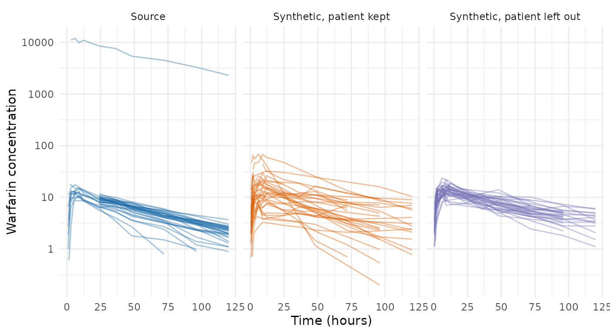

# Privacy Protections in the PMX Model Generator

The pharmacometric (PMX) model generator,
[`synpmx_model()`](https://iamstein.github.io/synpmx/reference/synpmx_model.md),
fits a population pharmacokinetic (PK) and pharmacodynamic (PD) model to
a clinical study inside the environment that holds the study’s data, and
generates synthetic patients from the fit. This article sets out what of
the study leaves that environment, how each number that leaves is
protected, how the protections are checked, and what risk remains. The
first section summarizes all four for a privacy reviewer, and the
sections after it give the evidence behind each statement in it.

**No formal privacy guarantee is made.** Nothing here bounds what an
attacker can learn in the sense of differential privacy (DP), a property
of a release procedure that limits how much any one person’s data can
change what is released \[1\]. The protections below reduce what is
released and measure how much one patient moves it. A release that has
to withstand a determined attacker needs a DP mechanism, and the last
section says what one would take for this generator.

## Summary for a Privacy Reviewer

### What the Generator Releases

A population PK/PD model describes how the concentration of a drug in
the blood, and a response to the drug, change over time across a
population of patients. It is a short list of numbers: a **typical
value** for each parameter, such as how fast the body clears the drug; a
**between-subject variance** for each, which says how far patients
spread around the typical value; and a **residual error**, the scatter
of single measurements around a patient’s own curve.
[`synpmx_model()`](https://iamstein.github.io/synpmx/reference/synpmx_model.md)
estimates these from the study’s patients with `nlmixr2`, an R package
for fitting population models.

The generator also summarizes the study’s design as it was carried out:
the number of patients in each treatment group (**arm**), the dose
schedule and how often doses were reduced, skipped or stopped, the share
of each arm measured at each scheduled visit, the distribution of each
baseline covariate such as body weight, age or sex, and, for an endpoint
recorded in levels such as a yes/no response or a toxicity grade, how
often each level was recorded at each visit.

What leaves the environment that holds the study is the **release**:
these numbers, assembled by
[`model_release()`](https://iamstein.github.io/synpmx/reference/model_release.md)
from a list of permitted fields, together with a description of the
table to generate. Synthetic data is simulated from the release and from
random numbers alone, so it discloses nothing the release does not, and
the release travels with the synthetic data as an attribute. A reviewer
can read every number in a release with `str(unclass(release))`.

### What Is Protected, and What Is Not

**✅ No patient record, identifier or per-patient estimate leaves the
study.** The release holds numbers about the population and about arms.
Synthetic subject identifiers are new. Each patient’s own estimated
deviation from the typical values is used during estimation and then
discarded.

**✅ No released number is one patient’s value, and every released
frequency rests on at least three patients on each side.** Minima,
maxima, medians and modes are replaced by quantities no one patient
decides. A frequency, a category level, or a value copied onto every
patient of an arm is released only where the patients on each side of it
number zero or at least three.

**✅ A patient who moves a released estimate by 15% or more is left out
of the estimates.** Estimation reads how far each patient moves each
estimate, leaves out anyone who moves one by 15% or more (for a
between-subject spread, by 0.15 in its standard deviation (SD) on the
log scale), and estimates again, up to a tenth of the cohort. A patient
left out still counts in the arm sizes, the dosing and the visit
attendance. The reading is approximate and does not cover every
estimate; its limits are among the outstanding risks.

**⚠️ Membership inference remains possible for an attacker who holds a
candidate’s own trial data.** In simulation, an attacker with a
candidate’s own measurements and exact reference values for the
population ranks a study member above a non-member with probability 0.74
when the population model is fitted to 12 patients and 0.61 when it is
fitted to 60. This probability is the area under the curve (AUC), where
0.5 is chance and 1 is certainty. A reference off by 20% brings the two
to 0.62 and 0.52. Per-visit frequency tables are more exposed: 0.83 for
20 visits in an arm of 10 patients. Rounding moves these numbers by at
most 0.002 and the three-patient floor by at most 0.02; cohort size, arm
size and the number of released frequencies decide them. [Membership
inference against the PMX model
release](https://iamstein.github.io/synpmx/articles/pmxmodel-privacy-simulation.html)
shows how each number is computed.

**❌ No formal guarantee.** Nothing bounds what an attacker who knows
every other patient learns about the remaining one. That attacker is the
one DP is defined against, and no DP mechanism is implemented for this
generator.

### How to Share a Release

**Share the release or the synthetic data, never the fit.** The object
[`synpmx_model_estimate()`](https://iamstein.github.io/synpmx/reference/synpmx_model_estimate.md)
returns also holds diagnostics: the comparison of candidate models, the
starting values, and the correlations between covariates and each
patient’s random effects. Save `model_release(fit)`.

**Keep the estimation’s console output and rendered reports inside the
study environment.** A patient left out of the estimates, or one who
moves an estimate far, is named there by their study identifier.

**Use a method with a formal guarantee where membership in the study is
itself sensitive** and a recipient could hold a candidate’s measurements
of the kind the study made: a site holding the patient’s records, a
partner holding a related study, or routine care that measures the same
quantities, such as drug-level monitoring. [What differential privacy
does and does not
guarantee](https://iamstein.github.io/synpmx/articles/synpmx-privacy.html)
sets out that choice.

## How Summary Statistics Disclose Patients

A fitted model holds no patient rows, but the DP literature shows that
statistics computed from patients can still disclose them. Four
mechanisms apply here.

**Membership inference** decides whether a given person was in the
study. The attacker holds that person’s data and the release, and asks
whether the release fits them better than it would fit someone who was
not in the study. Homer and colleagues did this from published allele
frequencies alone \[2\], after which public access to that kind of
aggregate genetic data was withdrawn. The power of the attack grows with
the number of released statistics and with their precision, and falls as
the number of people behind each statistic grows \[3, 4\].

**Model inversion** infers a hidden attribute from an estimated
relationship. Fredrikson and colleagues took a published warfarin dosing
regression, a patient’s demographics and that patient’s stable dose, and
inferred the patient’s genotype nearly as well as a model built to
predict genotype \[5\].

**Reconstruction** recovers individual records from enough accurate
aggregate answers: answering too many questions too precisely gives the
dataset away \[6\].

**A single patient’s value** is the simplest case. A minimum, a maximum,
the median of an odd number of patients, and the most common value where
every value is held once are each one patient’s value, whatever the
summary is called. Releasing one releases that patient’s value.

What an attacker already holds decides which of these succeed:

| Attacker | Holds | What the release gives them |
|----|----|----|
| An outsider | a candidate’s demographics: age, sex, body weight | the covariates as trimmed, rounded means and SDs, and as level frequencies held by at least three patients: the kind of summary a trial’s table of baseline characteristics reports |
| An attacker with trial data | a candidate’s own measurements of the kind the study made, and reference values for the population | an advantage at membership inference, measured under [Membership Inference Against the Release](#membership-inference-against-the-release) |
| An attacker who knows every other patient | the whole study except one patient | that patient’s contribution to every released number, which only a DP mechanism hides |

Three properties of a summary lower all four risks: fewer released
numbers, coarser released numbers, and numbers no single patient can
move far. Each protection below is one of these.

## The Release, Field by Field

A fitted model carries two kinds of content. Generation reads one of
them. The other is diagnostics for whoever ran the fit, and stays with
it.
[`model_release()`](https://iamstein.github.io/synpmx/reference/model_release.md)
builds the part generation reads, and
[`synpmx_model_generate()`](https://iamstein.github.io/synpmx/reference/synpmx_model_generate.md)
attaches that part, never the fit, to the data it returns. Generating
from a fit and from its release gives the same data. The worked example
is
[`nlmixr2data::warfarin`](https://nlmixr2.github.io/nlmixr2data/reference/warfarin.html):
32 patients, one oral dose, a warfarin concentration and a prothrombin
activity.

The diagnostics that stay with the fit:

``` r

release <- model_release(fit)
setdiff(names(fit), names(release))
#> [1] "candidates"   "design"       "correlations" "censoring"    "timing"      
#> [6] "movement"     "fit_subjects" "start_param"  "dose_records"
```

Every field of the release, what it holds, and how many finite numbers
it holds. `parameters` repeats the first entry of `pk_models` and is
left out.

| field | holds | numbers |
|:---|:---|---:|
| structural | the structural PK model selected | 0 |
| pk_models | per concentration endpoint: typical values, between-subject variances, residual error, any body-weight scaling | 32 |
| pd | per other continuous endpoint: a time-course shape and its parameters, the spread of patients’ baselines, residual error | 5 |
| arms | the arms and the number of patients in each | 1 |
| dosing | per arm: the planned dose at each scheduled time, the levels doses were reduced to, and the rates of reducing, skipping and stopping | 9 |
| visits | per arm: the share of patients measured at each scheduled visit | 44 |
| cells | the scheduled visits kept, as endpoint and nominal time | 44 |
| discrete | per arm and visit: the frequency of each level of a binary or ordinal endpoint | 0 |
| covariates | per baseline covariate: a trimmed mean and SD, or level frequencies | 6 |
| covariate_effects | body-weight scaling, where requested: a reference weight | 0 |
| schema | the table to generate: columns and their types, compartment numbers, assay limits, values copied onto each arm, each endpoint’s value type | 1 |
| roles | which column holds what | 0 |
| endpoints | which endpoints are concentrations, time courses or levels | 0 |
| quantification_floor | per endpoint without a declared assay limit, the value nothing is generated below | 2 |
| n_source | the number of patients | 1 |
| settings | the frequency floors used | 2 |
| privacy | the verdicts of checks P4 and P5 | 2 |

Membership inference gains power with the number of released numbers
\[3, 4\]. Most of the count is the visit and dosing apparatus rather
than the population model, which is in `pk_models` and `pd`. Part of the
apparatus is the protocol rather than a measurement: the nominal visit
times in `cells` and the planned dose times in `dosing` are public in
the sense the protocol is.

## The Protections

Each protection is applied by
[`synpmx_model_estimate()`](https://iamstein.github.io/synpmx/reference/synpmx_model_estimate.md)
without being asked for, and each names the work it rests on.

### 1. An Allowlist Decides What Leaves

[`model_release()`](https://iamstein.github.io/synpmx/reference/model_release.md)
copies the fields Step 6 of the
[algorithm](https://iamstein.github.io/synpmx/articles/pmxmodel-algorithm.html)
reads. Inside the PK models, the PD shapes, the dosing models, the
endpoint list and the settings, a second list names the parts it copies;
the schema, the arm, visit and covariate models and the remaining fields
are copied whole. A field added to the fit later stays behind unless it
is added to a list. The pattern is the glimpse-then-simulate split of
Novartis’s `synadam` package \[7\], which writes the summary that
synthetic data is generated from to one file a reviewer can read.

### 2. No Per-Patient Quantity

The empirical Bayes estimates (EBEs) are each patient’s own random
effects: how far that patient’s parameters sit from the typical values,
estimated from the patient’s own measurements. They are read twice at
estimation, for the correlations between covariates and random effects
and for the influence reading of protection 8, and then dropped.
Generation draws new random effects from the between-subject covariance
matrix.

### 3. No Identifier

Synthetic subject identifiers (IDs) are minted at generation. No source
label is kept, including the levels of an ID column stored as a factor.
A numeric ID keeps only the largest source ID rounded up to a power of
ten, which stops a synthetic ID colliding with a real one without
storing the real one. `synadam` refuses to run when an ID column is left
undeclared, for the same reason \[7\].

### 4. No Single Patient’s Value

Every summary that could have been one patient’s value is replaced:

| Quantity | Would have been | Is |
|----|----|----|
| Emission floor, where no assay limit is declared | half the smallest value reported | half the lowest value at least three patients reached, rounded down to 1, 2 or 5 times a power of ten |
| Allometric reference weight | the cohort median | the median to one significant figure |
| Planned dose amount or infusion rate, where no value is shared | the most common value, which is then one patient’s | the arm’s mean to two significant figures |
| Continuous covariate | a mean and SD over every patient, and a median | a trimmed mean and SD (protection 6), no median |
| Endpoint type description | text quoting the count of levels and the lowest and highest value observed | the type, without the text |

Statistical disclosure control (SDC), the field that protects published
statistical tables, treats extreme values the same way, by top-coding
and coarsening them \[8\].

### 5. Several Patients Behind Every Frequency

A frequency resting on one patient is that patient. The threshold rule
of SDC publishes a count only where at least *k* units stand behind it
\[8\], and `synadam` masks values held once \[7\]. The rule applies to
both sides of a frequency: an arm’s attendance at a visit that all but
one patient kept says as much about the one who missed it as attendance
by one patient says about the one who came. Here *k* is 3 by default:

- arms below `min_arm_patients` are dropped before anything is fitted;
- a nominal visit slot, a dose level and a planned cycle are kept only
  where at least `min_arm_patients` patients reached them;
- an arm’s attendance fraction at a slot with fewer than
  `min_arm_patients` patients attending or missing is rounded to 0 or 1;
- a dose-change rate whose events fewer than `min_arm_patients` patients
  had takes the rate pooled over every arm, where that pools enough
  patients, and is zero otherwise;
- a categorical covariate level, and a binary or ordinal endpoint’s
  level at a visit, below `min_category_patients` patients is excluded,
  or folded into the most common level;
- a `keep` value of any type, copied from the arm’s first patient as
  `keep` declares, is written as missing where fewer than
  `min_category_patients` patients in the arm hold it;
- the description of the table to generate keeps, for a factor column,
  only the levels its arms carry or at least `min_category_patients`
  patients hold, and for a binary or ordinal endpoint only the levels
  that many patients recorded, so the label of an arm too small to keep,
  or a grade one patient reached, stays behind.

The rule stops a frequency from singling out one or two patients. It
does not stop membership inference, which adds up small signals over
many frequencies ([Membership Inference Against the
Release](#membership-inference-against-the-release)).

### 6. Covariate Summaries Without Their Extremes

A continuous covariate is summarized by a mean and SD taken after the
highest and lowest 5% of patients are set aside, at least one at each
end. The SD of what remains understates the spread, because the tails
are what was removed, so it is divided by the SD a standard normal keeps
under the same trimming. With a share $`\alpha`$ removed from each end
and $`z = \Phi^{-1}(1-\alpha)`$,

``` math
\mathrm{SD} = \frac{\mathrm{SD}_\text{trimmed}}{\sqrt{1 - \dfrac{2 z \phi(z)}{1-2\alpha}}}.
```

This is the trimmed mean of robust statistics \[9\]. Trimming is also
how DP mean estimators bound one person’s influence \[10\], since no
single value can then move the result by more than the trimmed range
allows.

### 7. Two Significant Figures

Every released estimate is rounded to two significant figures: PK fixed
effects, between-subject variances, residual error, PD shape parameters
and covariate summaries. Rounding is the other standard coarsening of
SDC \[8\]. Leaving out a typical patient moves a typical value by less
than one rounding step, so for most patients the released typical value
is the same with or without them. Rounding does not hide an outlier’s
effect on a variance, which protection 8 measures, and it does not
weaken membership inference, because an estimate’s sampling variation is
larger than one rounding step ([Membership Inference Against the
Release](#membership-inference-against-the-release)). The frequencies
are not rounded: each is an exact count over an arm, held to the floor
of protection 5 instead.

### 8. How Far One Patient Moves Each Estimate

DP calls the most one person can move a released number its
*sensitivity*, taken over every possible dataset \[1\]. The same
question asked of the study at hand, leaving each patient out in turn
and recording the largest move, is *local sensitivity*, and in
regression the same idea is Cook’s distance \[11\]. It is computed at
estimation without refitting:

- A population typical value on the log scale sits close to the mean of
  the patients’ individual log parameters, so leaving out patient $`i`$
  moves it by about $`\eta_i/(n-1)`$, where $`\eta_i`$ is that patient’s
  random effect. The PD typical baseline is read the same way, from each
  patient’s own baseline.
- The between-subject variance sits close to the mean of the squared
  random effects, so leaving out patient $`i`$ scales it by
  $`\frac{(S-\eta_i^2)/(n-1)}{S/n}`$, with $`S=\sum_j \eta_j^2`$.
- The spread of the PD baselines and each covariate summary are
  recomputed with the patient left out, which needs no approximation.

The largest move over all patients is kept for each estimate: in percent
for a typical value, and in points of the between-subject SD on the log
scale, close to a coefficient of variation (CV) in percent, for a
spread. A move of 15 is a review; a move of 30 fails, warns at
estimation, and names the patient on the console. The name is printed in
the environment that holds the study and is not stored: the fit keeps
the largest move per estimate, never anything per patient. On a
parameter whose between-subject SD is 0.27, a patient 3 SD from the mean
in a cohort of 32 moves the typical value by about 3% and the spread by
about 4 points. Shrinkage, the pull of a random effect toward zero when
the patient’s own measurements say little about their parameters, makes
the reading understate the move, so it is reported beside it.

A patient who moves an estimate by 15 or more is then left out of the
estimates, and estimation runs again. The patient is left out of the PK
fit, the PD fits and the covariate summaries, and stays in the dosing,
visit and arm models, so the cohort and arm sizes the release describes
do not change. Rounds repeat until the reading flags nobody, and stop
before a tenth of the cohort has been left out. Each patient left out is
named on the console; the fit records how many, and which estimates they
moved. `drop_influential = FALSE` keeps every patient and leaves the
reading as a review or a failure.

The rounds are repeated because leaving out the most influential
patients makes the next ones the most influential, which Carlini and
colleagues call the privacy onion effect \[12\]. The DP counterpart of
the reading is propose-test-release, which checks that the study at hand
is far from any study in which one patient could move an estimate far,
and only then releases it with noise scaled to that bound \[13\].

## The Five Checks

[`model_privacy_checks()`](https://iamstein.github.io/synpmx/reference/model_privacy_checks.md)
runs five checks on a fit, each with its pass criterion. The first four
ask whether the release holds something about one patient that it should
not. The fifth is the reading of protection 8.

| Check | Question | Passes when |
|----|----|----|
| P1 | No per-patient table is released | the release holds only fields on the allowlist, none of them per patient |
| P2 | No source identifier is released | no source ID label, and no source ID value as the synthetic ID offset |
| P3 | No single patient’s value is released | floors on the 1-2-5 series, the reference weight rounded, no covariate median, no factor level that no arm carries |
| P4 | Every released frequency rests on several patients, on both sides | each side of every frequency is none or at least `min_arm_patients` patients (`min_category_patients` for categorical levels and values) |
| P5 | No single patient moves a released estimate far | every estimate moves less than 15, after any patient who moved one further has been left out |

P1 to P3 are structural and read the release. They pass by construction
on a fit from this version, and exist to catch a release assembled some
other way or a fit stored before the protections existed. P3 reads the
emission floors, the covariate summaries, the reference weight and the
factor levels of the columns copied onto arms. P4 recounts, at
estimation, the smallest group of patients behind each kind of released
frequency after the rules of protection 5 have run, including every
factor and endpoint level the schema stores, and P5 is the reading of
protection 8. A release carries the verdicts of P4 and P5, and the fit
the counts behind them.

``` r

checks <- model_privacy_checks(fit)
as.data.frame(checks)[, c("check", "verdict", "result")]
#>   check verdict
#> 1    P1    pass
#> 2    P2    pass
#> 3    P3    pass
#> 4    P4    pass
#> 5    P5    pass
#>                                                                                                                                                             result
#> 1                                                                                                                                                             none
#> 2                                                                                                                                                             none
#> 3 none: floors on the 1-2-5 series, covariates summarized without their extremes, no median, minimum or maximum stored, no factor level beyond what the arms carry
#> 4                                            smallest group: 3, patients on either side of an attendance fraction; adjusted to meet it: 5 (an attendance fraction)
#> 5                                                                                                                    largest: cp: ka between-subject SD, 10 points
```

The reading behind P5 is the `influence` attribute of the full fit’s
checks, one row per released estimate: the released value, the largest
move any one patient causes, its unit, the number of patients it was
read over, the shrinkage of the random effect it came from, and the
verdict. No row is about a patient.

``` r

digits3(attr(checks, "influence"))
#>        group   name            quantity released change   unit patients
#> 1         PK cp: cl       typical value     0.13   2.62      %       32
#> 2         PK cp: cl  between-subject SD    0.268   4.19 points       32
#> 3         PK  cp: v       typical value      6.6   1.01      %       32
#> 4         PK  cp: v  between-subject SD    0.192   1.83 points       32
#> 5         PK cp: ka       typical value     0.42    3.2      %       32
#> 6         PK cp: ka  between-subject SD    0.557     10 points       32
#> 7         PK  cp: q       typical value    0.098 0.0146      %       32
#> 8         PK  cp: q  between-subject SD   0.0748  0.801 points       32
#> 9         PK cp: v2       typical value      1.6   2.31      %       32
#> 10        PK cp: v2  between-subject SD     0.64   3.68 points       32
#> 11        PD    pca    typical baseline       96   2.11      %       32
#> 12        PD    pca  between-subject SD     0.15   5.86 points       32
#> 13 covariate     wt      geometric mean       69   1.22      %       32
#> 14 covariate     wt SD on the log scale     0.18   1.71 points       32
#> 15 covariate    age      geometric mean       29   2.05      %       32
#> 16 covariate    age SD on the log scale     0.34    2.3 points       32
#>    shrinkage verdict
#> 1     0.0291    pass
#> 2     0.0291    pass
#> 3      0.333    pass
#> 4      0.333    pass
#> 5      0.456    pass
#> 6      0.456    pass
#> 7      0.976    pass
#> 8      0.976    pass
#> 9       0.48    pass
#> 10      0.48    pass
#> 11        NA    pass
#> 12        NA    pass
#> 13        NA    pass
#> 14        NA    pass
#> 15        NA    pass
#> 16        NA    pass
```

The recount behind P4 is the `frequencies` attribute: for each kind of
released frequency, the smallest group of patients behind any one of
them, the floor it is held to, and how many values the rules changed to
meet it.

``` r

attr(checks, "frequencies")[, c("quantity", "smallest", "threshold",
                                "adjusted")]
#>                                            quantity smallest threshold adjusted
#> 1                                patients in an arm       32         3        0
#> 2 patients on either side of an attendance fraction        3         3        5
#> 3       patients with the dose change behind a rate       NA         3        0
#> 4    patients holding a categorical covariate level        5         3        0
#> 5       patients holding a level of a factor column       32         3        0
```

The same checks on the release report P5 as a verdict only. A passing
release states that every estimate moved less than 15, and nothing more,
so the one data-dependent thing it carries about the reading is the
verdict. A release that does not pass names its worst estimate and the
size of the move, which is computed from one patient’s data; such a
release is not meant to leave.

``` r

as.data.frame(model_privacy_checks(release))[, c("check", "verdict", "result")]
#>   check verdict
#> 1    P1    pass
#> 2    P2    pass
#> 3    P3    pass
#> 4    P4    pass
#> 5    P5    pass
#>                                                                                                                                                             result
#> 1                                                                                                                                                             none
#> 2                                                                                                                                                             none
#> 3 none: floors on the 1-2-5 series, covariates summarized without their extremes, no median, minimum or maximum stored, no factor level beyond what the arms carry
#> 4                                                                                                 every released frequency rests on at least the floor of patients
#> 5                                                                                                                       every released estimate moves less than 15
```

## Three Constructed Cases

Each case is `warfarin` with one or more patients changed, built once by
[`synpmx_model_estimate()`](https://iamstein.github.io/synpmx/reference/synpmx_model_estimate.md)
and stored with the package. None is a real study.

``` r

warfarin <- as.data.frame(nlmixr2data::warfarin)
warfarin$ntime <- warfarin$time
roles <- pmx_roles(
  id = "id", time = "time", nominal_time = "ntime", dv = "dv", amt = "amt",
  evid = "evid", dvid = "dvid", covariates = c("wt", "age", "sex")
)
patients <- sort(unique(warfarin$id))

misdosed <- warfarin
on_cp <- misdosed$id == patients[[5L]] & misdosed$evid == 0 &
  misdosed$dvid == "cp"
misdosed$dv[on_cp] <- misdosed$dv[on_cp] * 1000

extreme <- warfarin
extreme$wt[extreme$id == patients[[3L]]] <- 250
extreme$age[extreme$id == patients[[8L]]] <- 95
extreme$sex <- as.character(extreme$sex)
extreme$sex[extreme$id == patients[[12L]]] <- "not recorded"
extreme$sex <- factor(extreme$sex)
```

``` r

misdosed_fit <- synpmx_model_estimate(misdosed, roles, seed = 1)
extreme_fit <- synpmx_model_estimate(extreme, roles, seed = 1)
```

### A Patient Given a Thousand Times the Recorded Dose

One patient received a thousand times the dose the record shows, so a
linear model sees concentrations a thousand times higher than the
recorded dose implies. The case is fitted twice: as estimation runs by
default, and with `drop_influential = FALSE`, which keeps the patient so
that the reading can be seen to catch them.

``` r

misdosed_fit <- synpmx_model_estimate(misdosed, roles, seed = 1)
misdosed_kept_fit <- synpmx_model_estimate(misdosed, roles, seed = 1,
                                           drop_influential = FALSE)
```

Kept, the patient fails P5. The variance terms absorb the excess
exposure, and estimation warned that one patient moved a released
estimate by 30 or more, naming the patient on the console. The stored
fit names nobody.

``` r

kept_checks <- model_privacy_checks(misdosed_kept_fit)
as.data.frame(kept_checks)[, c("check", "verdict", "result")]
#>   check verdict
#> 1    P1    pass
#> 2    P2    pass
#> 3    P3    pass
#> 4    P4    pass
#> 5    P5    FAIL
#>                                                                                                                                                             result
#> 1                                                                                                                                                             none
#> 2                                                                                                                                                             none
#> 3 none: floors on the 1-2-5 series, covariates summarized without their extremes, no median, minimum or maximum stored, no factor level beyond what the arms carry
#> 4                                            smallest group: 3, patients on either side of an attendance fraction; adjusted to meet it: 5 (an attendance fraction)
#> 5                                                                                                                  largest: cp: v2 between-subject SD, 70.7 points
digits3(attr(kept_checks, "influence"))
#>        group   name            quantity released   change   unit patients
#> 1         PK cp: cl       typical value     0.11     26.2      %       32
#> 2         PK cp: cl  between-subject SD    0.707     51.8 points       32
#> 3         PK  cp: v       typical value      6.6     25.5      %       32
#> 4         PK  cp: v  between-subject SD    0.707     53.6 points       32
#> 5         PK cp: ka       typical value     0.57     3.97      %       32
#> 6         PK cp: ka  between-subject SD    0.707     12.9 points       32
#> 7         PK  cp: q       typical value   0.0024 0.000055      %       32
#> 8         PK  cp: q  between-subject SD    0.138     13.1 points       32
#> 9         PK cp: v2       typical value 0.000055    0.122      %       32
#> 10        PK cp: v2  between-subject SD    0.707     70.7 points       32
#> 11        PD    pca    typical baseline       96     2.11      %       32
#> 12        PD    pca  between-subject SD     0.15     5.86 points       32
#> 13 covariate     wt      geometric mean       69     1.22      %       32
#> 14 covariate     wt SD on the log scale     0.18     1.71 points       32
#> 15 covariate    age      geometric mean       29     2.05      %       32
#> 16 covariate    age SD on the log scale     0.34      2.3 points       32
#>    shrinkage verdict
#> 1     -0.899  review
#> 2     -0.899    FAIL
#> 3     -0.843  review
#> 4     -0.843    FAIL
#> 5      0.474    pass
#> 6      0.474    pass
#> 7          1    pass
#> 8          1    pass
#> 9       0.99    pass
#> 10      0.99    FAIL
#> 11        NA    pass
#> 12        NA    pass
#> 13        NA    pass
#> 14        NA    pass
#> 15        NA    pass
#> 16        NA    pass
```

By default, estimation left the patient out of the estimates and ran
again. The fit records how many patients were left out and which
estimates they moved, and the checks pass:

``` r

misdosed_fit$privacy$left_out$patients
#> [1] 1
digits3(misdosed_fit$privacy$left_out$because)
#>   group   name           quantity change   unit
#> 1    PK cp: cl      typical value   26.2      %
#> 2    PK cp: cl between-subject SD   51.8 points
#> 3    PK  cp: v      typical value   25.5      %
#> 4    PK  cp: v between-subject SD   53.6 points
#> 5    PK cp: v2 between-subject SD   70.7 points
as.data.frame(model_privacy_checks(misdosed_fit))[, c("check", "verdict",
                                                      "result")]
#>   check verdict
#> 1    P1    pass
#> 2    P2    pass
#> 3    P3    pass
#> 4    P4    pass
#> 5    P5    pass
#>                                                                                                                                                             result
#> 1                                                                                                                                                             none
#> 2                                                                                                                                                             none
#> 3 none: floors on the 1-2-5 series, covariates summarized without their extremes, no median, minimum or maximum stored, no factor level beyond what the arms carry
#> 4                                            smallest group: 3, patients on either side of an attendance fraction; adjusted to meet it: 5 (an attendance fraction)
#> 5                                                                 largest: cp: ka between-subject SD, 9.32 points; after leaving 1 patient(s) out of the estimates
```

The synthetic data shows the difference. Kept, the patient’s exposure
becomes between-subject variability, and the synthetic patients spread
wider than the rest of the source cohort. Left out, they do not:

``` r

concentration <- function(data, label) {
  rows <- data$evid == 0 & data$dvid == "cp" & data$dv > 0
  data.frame(dataset = label, id = as.character(data$id[rows]),
             time = data$time[rows], dv = data$dv[rows])
}
kept_synthetic <- suppressWarnings(
  synpmx_model_generate(misdosed_kept_fit, seed = 11))
synthetic <- suppressWarnings(synpmx_model_generate(misdosed_fit, seed = 11))
plotted <- rbind(concentration(misdosed, "Source"),
                 concentration(kept_synthetic, "Synthetic, patient kept"),
                 concentration(synthetic, "Synthetic, patient left out"))
plotted$dataset <- factor(plotted$dataset, levels = unique(plotted$dataset))
ggplot2::ggplot(plotted, ggplot2::aes(time, dv, group = id,
                                      colour = dataset)) +
  ggplot2::geom_line(alpha = 0.4) +
  ggplot2::facet_wrap(~dataset) +
  ggplot2::scale_y_log10() +
  ggplot2::scale_colour_manual(values = c(unname(comparison_colours),
                                          "#7570B3")) +
  ggplot2::labs(x = "Time (hours)", y = "Warfarin concentration") +
  ggplot2::theme_minimal() +
  ggplot2::theme(legend.position = "none")
```



The scorecard reads each release’s verdict as row E3, so the finding
reaches anyone who scores the synthetic data:

``` r

kept_card <- synpmx_scorecard(misdosed, kept_synthetic, roles)
card <- synpmx_scorecard(misdosed, synthetic, roles)
data.frame(fit = c("patient kept", "patient left out"),
           E3 = c(kept_card$verdict[kept_card$check == "E3"],
                  card$verdict[card$check == "E3"]),
           result = c(kept_card$result[kept_card$check == "E3"],
                      card$result[card$check == "E3"]))
#>                fit   E3                                          result
#> 1     patient kept FAIL largest: cp: v2 between-subject SD, 70.7 points
#> 2 patient left out pass      every released estimate moves less than 15
```

Leaving the patient out protects the release and keeps the synthetic
data plausible. The record is still wrong, and correcting the patient’s
dosing is the remedy for any analysis of the real study.

### Extreme Covariates

One patient weighs 250 kg and another is 95 years old. Neither enters
the covariate summaries, because each is the most extreme patient on
their side and trimming sets them aside:

``` r

summary_of <- function(model) {
  data.frame(covariate = c("wt", "age"),
             geometric_mean = exp(c(model$wt$meanlog, model$age$meanlog)),
             sd_log = c(model$wt$sdlog, model$age$sdlog))
}
rbind(cbind(study = "warfarin", summary_of(fit$covariates)),
      cbind(study = "with the two extreme patients",
            summary_of(extreme_fit$covariates)))
#>                           study covariate geometric_mean sd_log
#> 1                      warfarin        wt             69   0.18
#> 2                      warfarin       age             29   0.34
#> 3 with the two extreme patients        wt             70   0.19
#> 4 with the two extreme patients       age             29   0.36
```

The same two summaries taken over every patient, without trimming, move
with the extreme patients:

``` r

first <- function(data) data[!duplicated(data$id), ]
untrimmed <- function(data) {
  data.frame(covariate = c("wt", "age"),
             geometric_mean = exp(c(mean(log(first(data)$wt)),
                                    mean(log(first(data)$age)))),
             sd_log = c(stats::sd(log(first(data)$wt)),
                        stats::sd(log(first(data)$age))))
}
digits3(rbind(cbind(study = "warfarin", untrimmed(warfarin)),
              cbind(study = "with the two extreme patients",
                    untrimmed(extreme))))
#>                           study covariate geometric_mean sd_log
#> 1                      warfarin        wt           68.8   0.19
#> 2                      warfarin       age           29.6  0.304
#> 3 with the two extreme patients        wt           71.7  0.297
#> 4 with the two extreme patients       age           30.3  0.363
```

P5 reads the covariate rows of the influence table: leaving out any one
patient barely moves them, the extreme patients included.

``` r

extreme_influence <- attr(model_privacy_checks(extreme_fit), "influence")
digits3(extreme_influence[extreme_influence$group == "covariate", ])
#>        group name            quantity released change   unit patients shrinkage
#> 13 covariate   wt      geometric mean       70   1.26      %       32        NA
#> 14 covariate   wt SD on the log scale     0.19   1.68 points       32        NA
#> 15 covariate  age      geometric mean       29   2.03      %       32        NA
#> 16 covariate  age SD on the log scale     0.36   2.02 points       32        NA
#>    verdict
#> 13    pass
#> 14    pass
#> 15    pass
#> 16    pass
```

### A Category Nobody Else Holds

A third changed patient has a sex recorded as a level no other patient
holds. The level is excluded from the covariate distribution and from
the schema the generated table is written in, so no synthetic patient
can carry it:

``` r

extreme_fit$covariates$sex$levels
#> [1] "female" "male"
levels(extreme_fit$schema$prototypes$sex)
#> [1] "female" "male"
```

## The Checks Across the Public Studies

The checks on every stored fit of the [public-data
evaluation](https://iamstein.github.io/synpmx/articles/pmxmodel-public-data-examples.html),
and the estimate each study’s most influential remaining patient moves
furthest.

``` r

files <- c(warfarin = "warfarin-model-fit.rds",
           theo_md = "theo-md-model-fit.rds",
           mad = "mad-model-fit.rds",
           case1_pkpd = "case1-pkpd-model-fit.rds",
           wbcSim = "wbcsim-model-fit.rds",
           mavoglurant = "mavoglurant-model-fit.rds",
           nimoData = "nimo-model-fit.rds",
           pheno_sd = "pheno-model-fit.rds",
           mixroute_sim = "mixroute-sim-model-fit.rds",
           onc_sim = "onc-sim-model-fit.rds")
rows <- lapply(names(files), function(study) {
  one <- stored_fit(files[[study]])
  if (!inherits(one, "pmx_fitted_model")) return(NULL)
  checks <- model_privacy_checks(one)
  verdicts <- stats::setNames(checks$verdict, checks$check)
  data.frame(study = study, patients = one$n_source,
             left_out = if (is.null(one$privacy$left_out)) 0L else
               one$privacy$left_out$patients, t(verdicts),
             largest = sub("; after leaving.*$", "",
                           checks$result[checks$check == "P5"]),
             check.names = FALSE)
})
do.call(rbind, rows[!vapply(rows, is.null, logical(1))])
#>           study patients left_out   P1   P2   P3   P4   P5
#> 1      warfarin       32        0 pass pass pass pass pass
#> 2       theo_md       12        0 pass pass pass pass pass
#> 3           mad       60        1 pass pass pass pass pass
#> 4    case1_pkpd      180        0 pass pass pass pass pass
#> 5        wbcSim       45        0 pass pass pass pass pass
#> 6   mavoglurant      120        0 pass pass pass pass pass
#> 7      nimoData       12        0 pass pass pass pass pass
#> 8      pheno_sd       59        0 pass pass pass pass pass
#> 9  mixroute_sim       90        0 pass pass pass pass pass
#> 10      onc_sim      200        0 pass pass pass pass pass
#>                                                           largest
#> 1                   largest: cp: ka between-subject SD, 10 points
#> 2                           largest: DV: ka typical value, 9.92 %
#> 3        largest: PD - Continuous between-subject SD, 10.3 points
#> 4        largest: PD - Continuous between-subject SD, 6.44 points
#> 5                     largest: DV between-subject SD, 2.25 points
#> 6                 largest: DV: v2 between-subject SD, 1.92 points
#> 7                 largest: DV: v2 between-subject SD, 12.4 points
#> 8                 largest: DV: cl between-subject SD, 4.55 points
#> 9                 largest: DV: ka between-subject SD, 4.46 points
#> 10 largest: Everolimus trough: ka between-subject SD, 3.21 points
```

`left_out` counts the patients each study’s estimation left out for
moving an estimate by 15 or more, and `largest` is the largest move
among the patients that remain. A move is a fraction of the cohort’s
spread divided by the cohort size, so the same patient moves a
twelve-patient fit about five times as far as a sixty-patient one.

## Checks on the Synthetic Table

The checks above read the fit.
[`synpmx_scorecard()`](https://iamstein.github.io/synpmx/reference/synpmx_scorecard.md)
reads the synthetic table against its source, and its section B asks
whether any synthetic patient reproduces a real one. Four of its rows do
not apply to this generator, because no synthetic patient is assembled
from a real patient’s record; B3, B4b and B5 do.

``` r

synthetic <- synpmx_model_generate(fit, seed = 11)
card <- synpmx_scorecard(warfarin, synthetic, roles)
as.data.frame(card)[substr(card$check, 1, 1) %in% c("B", "E"),
                    c("check", "question", "result", "verdict")]
#>    check                                                      question
#> 8    B1a                   Avatars with a visit set nobody else shares
#> 9    B1b               Avatars with a dose schedule nobody else shares
#> 10    B2               Synthetic patients unusual within their stratum
#> 11    B3                 Adversarial accuracy inside its null interval
#> 12   B4a            Generated time vectors copying an exposed real one
#> 13   B4b              Generated DV vectors copying an exposed real one
#> 14    B5                     Rare source levels copied into the output
#> 19    E1             Fitted parameters moved off their starting values
#> 20    E2 Between-subject terms were estimated, not left at their start
#> 21    E3                 No single patient moves a fitted estimate far
#>                                                          result        verdict
#> 8                                                 no run record not applicable
#> 9                                                 no run record not applicable
#> 10 not applicable: profiles simulated, not built from a patient not applicable
#> 11                                      0.688 in [0.288, 0.743]           pass
#> 12                   not applicable: attendance drawn per visit not applicable
#> 13                                                            0           pass
#> 14                                               0 of 0 exposed           pass
#> 19                                           moved (1 model(s))           pass
#> 20                                                    estimated           pass
#> 21                   every released estimate moves less than 15           pass
```

B3 compares how close synthetic patients sit to real ones against how
close real patients sit to each other, B4b asks whether any generated
vector of values copies a real patient’s, and B5 asks whether a level
fewer than three real patients held reached the output. [The
scorecard](https://iamstein.github.io/synpmx/articles/scorecard.html)
documents each row and its pass criterion.

## Membership Inference Against the Release

A membership-inference attack gives each candidate a score that is high
when the release has moved, away from what the population would give,
toward the candidate’s own values. Members of the study score higher on
average than people who were not in it, and the attack’s strength is
read as the AUC, the probability that a randomly chosen member scores
above a randomly chosen non-member: 0.5 is chance and 1 is certain
identification. The attacker modelled holds the candidate’s own
measurements and reference values for the population, and does not know
the other patients. The release is reduced to its two kinds of number: a
population model of five parameters, each released as a typical value
and a between-subject variance, and one arm’s share of patients with a
yes/no outcome at each visit. [Membership inference against the PMX
model
release](https://iamstein.github.io/synpmx/articles/pmxmodel-privacy-simulation.html)
works through the calculation on one small study, shows both tables in
full, and places each public study’s release against them. Three
readings:

- **Cohort size decides the population model’s exposure.** With an exact
  reference the AUC falls from 0.74 at 12 patients to 0.61 at 60, and a
  reference off by 20% brings the two to 0.62 and 0.52.
- **Two significant figures do not change it.** Scored on the same
  simulated studies before and after rounding, the AUC moves by at most
  0.002, because an estimate’s sampling variation is larger than one
  rounding step.
- **The per-visit table is the most exposed part of the release.** Its
  AUC grows with the number of visits and falls with arm size: 0.83 for
  20 visits in an arm of 10, 0.72 for 20 visits in an arm of 30, and
  0.95 for 60 visits in an arm of 10. The three-patient rule moves it by
  at most 0.02, because the rule acts only on shares near 0 or 1.

An AUC averages over members, and the most exposed member is the one far
from the typical values: that patient moves the release furthest toward
themselves, which is what protection 8 reads. The membership-inference
literature on machine-learning models reports success against such
patients separately for this reason \[14, 15\], and Stadler and
colleagues found that synthetic data from generative models leaves them
exposed \[16\].

The attacker modelled here is strong. The measurements it needs, a
candidate’s random effects estimated from their concentrations or their
outcome at every visit, are made by the study, and outside it exist only
where the same quantities are measured for the same patient: at a study
site, in a related study, or in routine care such as drug-level
monitoring.

## Outstanding Risks

These are the ways a release from this generator can still disclose
something about a patient, most serious first. Each is inherent to
releasing estimates without noise, or a limit of the checks.

- **An attacker who holds a candidate’s own trial data can infer
  membership.** [Membership Inference Against the
  Release](#membership-inference-against-the-release) measures how well,
  and the per-visit frequency tables are the most exposed part of the
  release. Fewer per-visit numbers would reduce it: a time course with a
  few parameters for a binary or ordinal endpoint, as continuous PD
  endpoints already have, or shares pooled over adjacent visits. Larger
  arms or added noise would too.
- **An attacker who knows every other patient is not stopped.** Such an
  attacker can compute the exact effect of the one patient they do not
  know, so any move at all is detectable, however far under a threshold
  it sits. That attacker is the one DP is defined against, and only a DP
  mechanism stops them.
- **Releases compose, and their counts are exact.** The cohort size, the
  arm sizes and every frequency are exact counts or exact ratios of
  counts. Two releases from overlapping data, such as an interim and a
  final analysis, or the same study before and after one patient
  withdraws, differ by exactly what the patients between them
  contributed. Nothing here accounts for that.
- **Three patients is the smallest threshold in common use.** Every
  released frequency rests on at least three patients on each side,
  which is the floor the threshold rule of SDC starts from. A release
  held to a stricter rule needs `min_arm_patients` and
  `min_category_patients` raised to match.
- **The influence reading describes this study only, and its thresholds
  are empirical.** How far one patient moves an estimate is itself a
  fact about the data, which is why DP calibrates its noise to *smooth*
  sensitivity rather than local sensitivity \[17\]. The review and
  failure thresholds were set against the public studies above, so that
  ordinary patients pass and a gross data error fails; they are not
  derived from a privacy target. Shrinkage makes the reading understate
  the move, and where shrinkage is close to 1 the reading says little
  while its verdict still reads pass.
- **Not every estimate is read.** The residual error, a parameter
  estimated without a between-subject term (bioavailability in a
  mixed-route model), the PD shape parameters other than the baseline,
  and a planned dose taken as the arm’s mean where no amount is shared
  have no row.
- **Leaving out stops at a tenth of the cohort.** A study with more
  patients than that whom the influence reading flags keeps the rest,
  and P5 then reads a review or a failure.
- **The full fit holds diagnostics the release does not.** The Akaike
  information criterion (AIC) of every candidate model, the starting
  values and the correlations between covariates and the individual
  random effects stay on the object
  [`synpmx_model_estimate()`](https://iamstein.github.io/synpmx/reference/synpmx_model_estimate.md)
  returns. Share the release or the synthetic data, never the fit.
- **The estimation output names patients.** A patient left out of the
  estimates, and a patient who fails the influence reading, is named on
  the console, so logs and rendered reports from the environment that
  holds the study carry that identifier.
- **Rarity in the world is not measured.** A covariate level held by
  many patients in this study can still identify someone if few people
  alive hold it.

## What a Formal Guarantee Would Take

The DP method that fits a generator built on `nlmixr2` is
subsample-and-aggregate \[17, 18\], because it treats the estimator as a
black box:

1.  Split the patients into *k* disjoint groups and fit the population
    model in each.
2.  Clip each group’s estimate of each log parameter to a public range
    of width *S*.
3.  Release the mean over the groups plus Laplace noise of scale
    $`b = dS/(\varepsilon k)`$ per parameter, where *d* parameters share
    the privacy budget $`\varepsilon`$.

One patient is in one group, so the guarantee holds whatever the fit
inside a group does. The textbook DP methods for regression perturb a
convex loss with bounded gradients \[19\], and a population likelihood
is neither, which rules them out here. The cost is the error law of the
[privacy
background](https://iamstein.github.io/synpmx/articles/privacy-background.html)
with the cohort size replaced by the number of groups. At about twenty
patients per group, and a median Laplace error of $`b \ln 2`$:

``` r

grid <- expand.grid(patients = c(60, 200, 1000), released = c(3, 11))
grid$groups <- grid$patients / 20
scale <- grid$released * log(10) / (1 * grid$groups)
grid$median_fold_error <- signif(exp(log(2) * scale), 3)
grid
#>   patients released groups median_fold_error
#> 1       60        3      3              4.93
#> 2      200        3     10              1.61
#> 3     1000        3     50              1.10
#> 4       60       11      3            348.00
#> 5      200       11     10              5.79
#> 6     1000       11     50              1.42
```

That is with $`\varepsilon = 1`$ and a public range spanning tenfold for
each parameter. With all eleven parameters of a two-compartment model
released, the error stays above 40% even at a thousand patients; with
three released and the rest taken from a public prior, it reaches about
10% there. At the cohort sizes this generator usually sees, the
[calibrated generator’s
evaluation](https://iamstein.github.io/synpmx/articles/calibrated-public-data-examples.html)
finds that a release is worse than generating from the public prior
alone. Subsample-and-aggregate is not implemented.

## References

1.  Dwork C, McSherry F, Nissim K, Smith A. Calibrating noise to
    sensitivity in private data analysis. *Theory of Cryptography
    Conference (TCC).* 2006.
2.  Homer N, Szelinger S, Redman M, et al. Resolving individuals
    contributing trace amounts of DNA to highly complex mixtures using
    high-density SNP genotyping microarrays. *PLoS Genetics.*
    2008;4(8):e1000167.
3.  Sankararaman S, Obozinski G, Jordan MI, Halperin E. Genomic privacy
    and limits of individual detection in a pool. *Nature Genetics.*
    2009;41:965–967.
4.  Dwork C, Smith A, Steinke T, Ullman J, Vadhan S. Robust traceability
    from trace amounts. *IEEE Symposium on Foundations of Computer
    Science (FOCS).*
    2015. 
5.  Fredrikson M, Lantz E, Jha S, Lin S, Page D, Ristenpart T. Privacy
    in pharmacogenetics: an end-to-end case study of personalized
    warfarin dosing. *USENIX Security Symposium.* 2014.
6.  Dinur I, Nissim K. Revealing information while preserving privacy.
    *ACM Symposium on Principles of Database Systems (PODS).* 2003.
7.  Novartis. `synadam`: generate synthetic ADaM datasets. R package
    version 0.3.4. <https://github.com/Novartis/synadam>.
8.  Hundepool A, Domingo-Ferrer J, Franconi L, et al. *Statistical
    Disclosure Control.* Wiley; 2012.
9.  Huber PJ, Ronchetti EM. *Robust Statistics.* 2nd ed. Wiley; 2009.
10. Bun M, Steinke T. Average-case averages: private algorithms for
    smooth sensitivity and mean estimation. *Advances in Neural
    Information Processing Systems (NeurIPS).* 2019.
11. Cook RD. Detection of influential observation in linear regression.
    *Technometrics.* 1977;19(1):15–18.
12. Carlini N, Jagielski M, Zhang C, Papernot N, Terzis A, Tramèr F. The
    privacy onion effect: memorization is relative. *Advances in Neural
    Information Processing Systems (NeurIPS).* 2022.
13. Dwork C, Lei J. Differential privacy and robust statistics. *ACM
    Symposium on Theory of Computing (STOC).* 2009.
14. Shokri R, Stronati M, Song C, Shmatikov V. Membership inference
    attacks against machine learning models. *IEEE Symposium on Security
    and Privacy.*
    2017. 
15. Carlini N, Chien S, Nasr M, Song S, Terzis A, Tramèr F. Membership
    inference attacks from first principles. *IEEE Symposium on Security
    and Privacy.* 2022.
16. Stadler T, Oprisanu B, Troncoso C. Synthetic data – anonymisation
    groundhog day. *USENIX Security Symposium.* 2022.
17. Nissim K, Raskhodnikova S, Smith A. Smooth sensitivity and sampling
    in private data analysis. *ACM Symposium on Theory of Computing
    (STOC).* 2007.
18. Smith A. Privacy-preserving statistical estimation with optimal
    convergence rates. *ACM Symposium on Theory of Computing (STOC).*
    2011.
19. Chaudhuri K, Monteleoni C, Sarwate AD. Differentially private
    empirical risk minimization. *Journal of Machine Learning Research.*
    2011;12:1069–1109.
