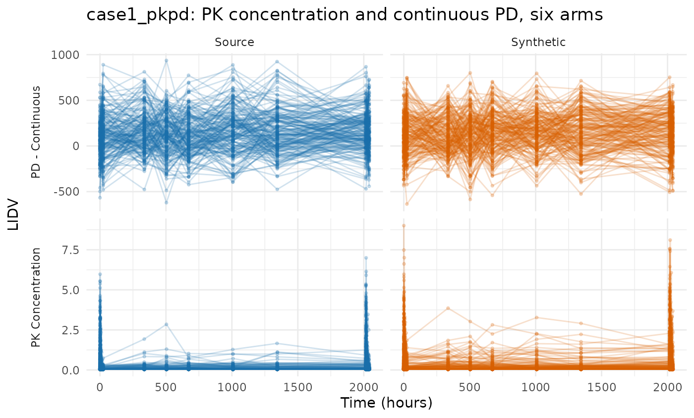
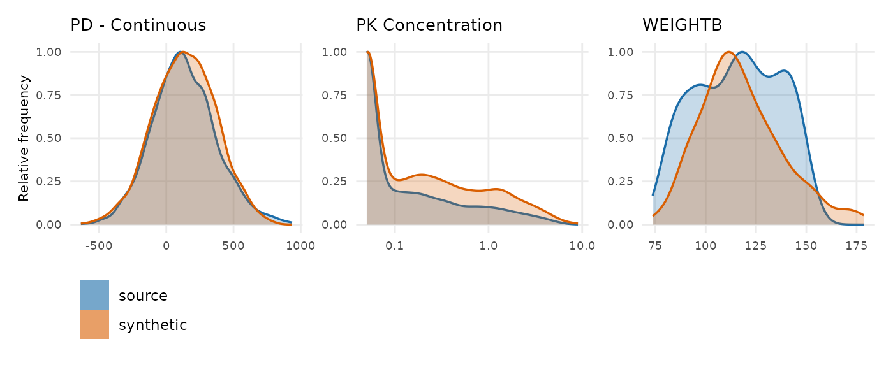
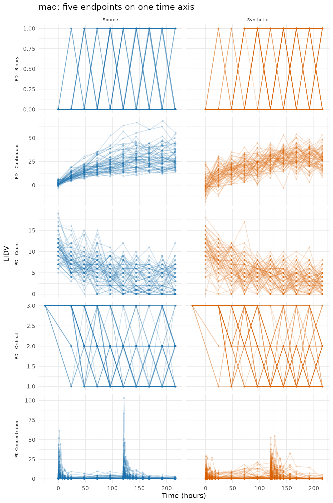
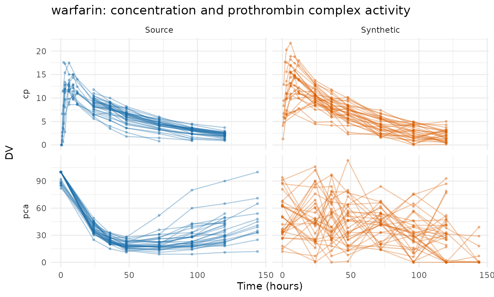
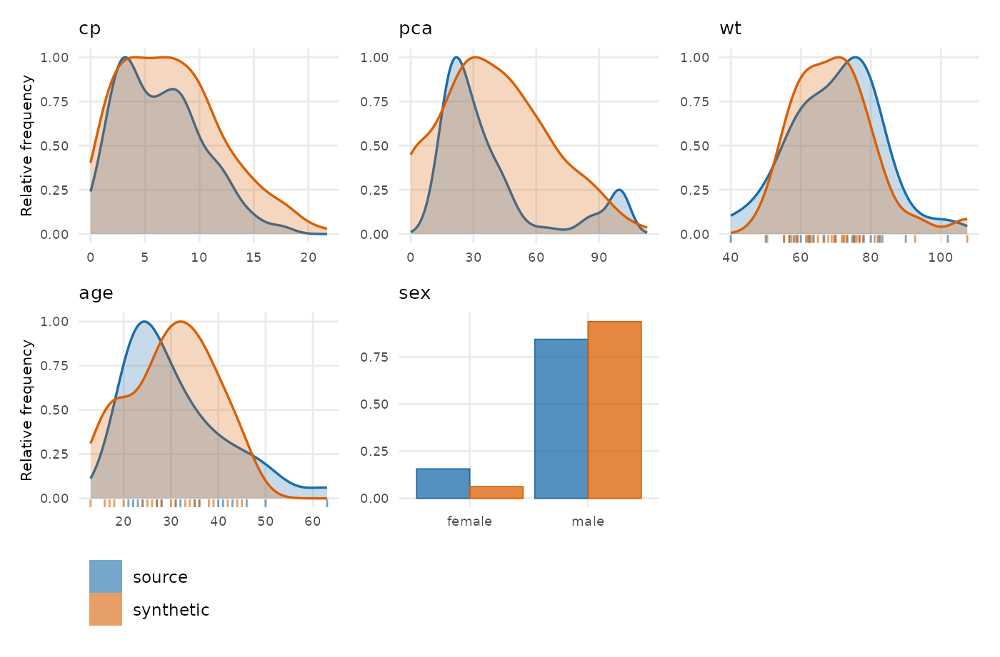
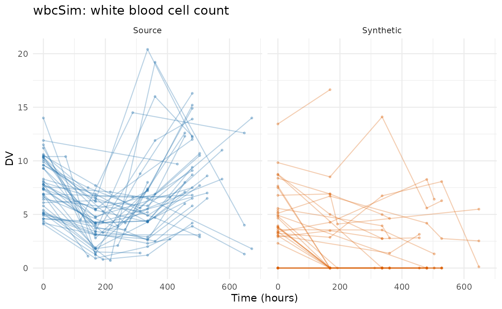
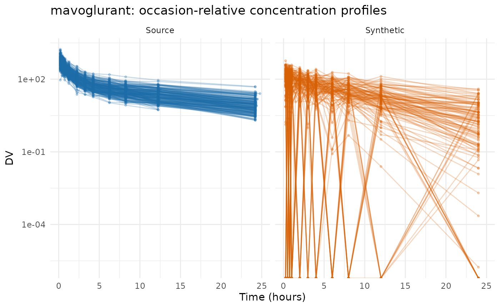
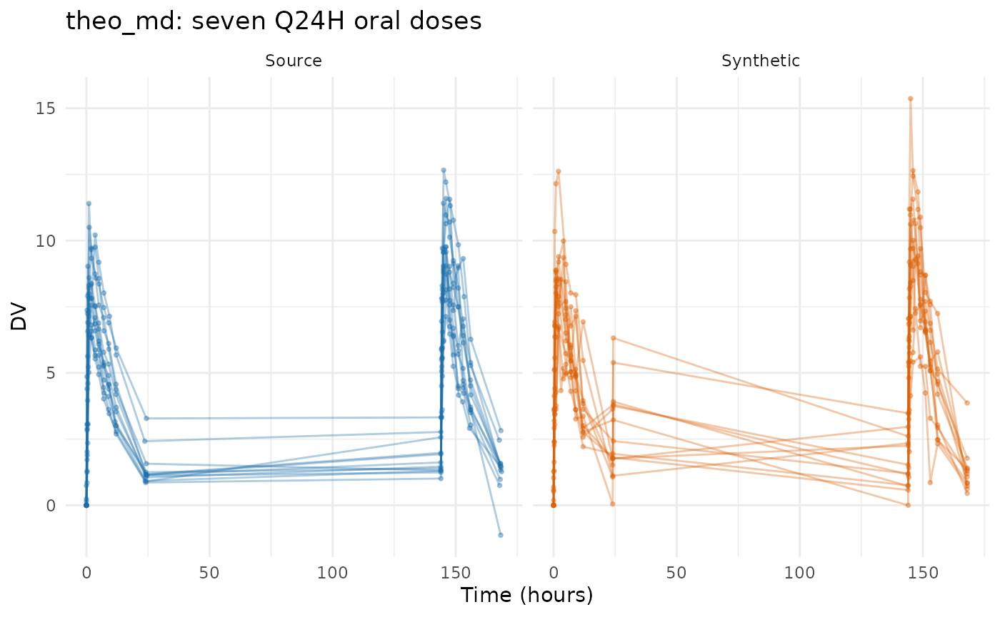

# Evaluating the PMX model generator on public data

This article runs
[`synpmx_model()`](https://iamstein.github.io/synpmx/reference/synpmx_model.md)
over the same eight public datasets that [Evaluating AVATAR on public
data](https://iamstein.github.io/synpmx/articles/avatar-public-data-examples.html)
and [Evaluating PCA on public
data](https://iamstein.github.io/synpmx/articles/pca-public-data-examples.html)
run their generators over, so the three can be read against each other
on identical studies.

This generator asks more of a study than the other two, and **what
separates these datasets is whether the study can identify a population
model at all.** Three requirements, each of which refuses rather than
guesses:

- **A declared nominal grid**, as
  [`synpmx_pca()`](https://iamstein.github.io/synpmx/reference/synpmx_pca.md)
  needs — the visit model is built on it.
- **At least twenty subjects.** A covariance matrix fitted to fewer
  describes those subjects rather than a population, so `min_subjects`
  refuses below that and says so.
- **An endpoint that behaves like a drug concentration**: absent before
  the first dose and rising with dose. Without one there is nothing to
  put a structural model on.

Five studies clear all three. `theo_md` clears the first and third and
is shown below the floor on purpose. `nimoData` and `pheno_sd` are
refused, for different reasons, and the refusals are the most useful
thing in this article if your own study looks like either.

Every fit below reads patient data once, through
[`synpmx_model_estimate()`](https://iamstein.github.io/synpmx/reference/synpmx_model_estimate.md).
Everything after that — every figure, every table, every scorecard — is
computed from the fit and never touches the source again.

Plotting and reporting helpers used throughout this vignette

``` r

# Observation rows only, source beside synthetic on a shared y axis, one row per
# endpoint. The same figure the PCA survey draws, so the two can be compared
# panel for panel.
overlay_plot <- function(source, synthetic, roles, title,
                         y_label = "DV", log_y = FALSE, alpha = 0.3,
                         max_time = Inf) {
  frame <- function(data, label) {
    observed <- as.character(data[[roles$evid]]) %in% c("0", "0.0") &
      !is.na(data[[roles$dv]])
    if (!is.null(roles$mdv)) {
      observed <- observed & as.character(data[[roles$mdv]]) %in% c("0", "0.0")
    }
    observed <- observed & as.numeric(data[[roles$time]]) <= max_time
    data.frame(
      dataset = factor(label, levels = c("Source", "Synthetic")),
      subject = as.character(data[[roles$id]][observed]),
      occasion = if (is.null(roles$occasion)) "1" else
        as.character(data[[roles$occasion]][observed]),
      time = as.numeric(data[[roles$time]][observed]),
      dv = as.numeric(data[[roles$dv]][observed]),
      endpoint = if (is.null(roles$dvid)) "DV" else
        as.character(data[[roles$dvid]][observed]),
      stringsAsFactors = FALSE
    )
  }
  plotted <- rbind(frame(source, "Source"), frame(synthetic, "Synthetic"))
  figure <- ggplot2::ggplot(
    plotted,
    ggplot2::aes(time, dv,
                 group = interaction(dataset, subject, occasion),
                 colour = dataset)
  ) +
    ggplot2::geom_line(alpha = alpha) +
    ggplot2::geom_point(alpha = alpha, size = 0.7) +
    (if (length(unique(plotted$endpoint)) > 1L) {
      ggplot2::facet_grid(endpoint ~ dataset, scales = "free_y", switch = "y")
    } else {
      ggplot2::facet_wrap(~dataset)
    }) +
    ggplot2::scale_colour_manual(values = comparison_colours) +
    ggplot2::labs(x = "Time (hours)", y = y_label, title = title) +
    ggplot2::theme_minimal() +
    ggplot2::theme(legend.position = "none", strip.placement = "outside")
  if (isTRUE(log_y)) figure + ggplot2::scale_y_log10() else figure
}

overlay_height <- function(data, roles, per_endpoint = 2.2, minimum = 3.4) {
  observed <- as.character(data[[roles$evid]]) %in% c("0", "0.0")
  endpoints <- if (is.null(roles$dvid)) 1L else
    length(unique(data[[roles$dvid]][observed]))
  max(minimum, per_endpoint * endpoints)
}

# Every dataset is run the same way and its numbers collected in one place, so
# the cross-dataset tables at the end cannot drift from the sections above them.
runs <- list()
model_run <- function(label, source, roles, file, seed) {
  fit <- stored_fit(file)
  synthetic <- synpmx_model_generate(fit, seed = seed)
  runs[[label]] <<- list(label = label, source = source, roles = roles,
                         fit = fit, synthetic = synthetic,
                         card = synpmx_scorecard(source, synthetic, roles))
  invisible(runs[[label]])
}

# Nearest-neighbour snapping onto a stated design grid, as in the PCA survey:
# which grid to snap to is a statement about the study and is written out at
# each call.
snap_to <- function(x, grid) {
  grid[max.col(-abs(outer(x, grid, "-")), ties.method = "first")]
}
```

## case1_pkpd: six arms and a censored endpoint

180 patients across six treatment arms, two endpoints keyed by a
character `NAME` column, a baseline weight and a `CENS` column. This is
the study the three demos share.

``` r

case1_pkpd <- as.data.frame(
  get(utils::data(list = "case1_pkpd", package = "xgxr"))
)
# That study's CENS is meaningful only for PK: the PD effect is signed, so a
# left-censored PD row would report a value above the uncensored ones.
case1_pkpd$CENS <- ifelse(case1_pkpd$NAME == "PD - Continuous", 0,
                          case1_pkpd$CENS)
case1_roles <- pmx_roles(
  id = "ID", time = "TIME", dv = "LIDV", cens = "CENS", amt = "AMT",
  evid = "EVID", cmt = "CMT", dvid = "NAME", nominal_time = "NOMTIME",
  strata = c("TRTACT", "DOSE"), covariates = "WEIGHTB", keep = "STUDY"
)
case1 <- model_run("case1_pkpd", case1_pkpd, case1_roles,
                   "case1-pkpd-model-fit.rds", seed = 808)
case1$fit
#> A fitted PMX model, from synpmx_model_estimate()
#> 
#>   fitted on    180 patients, 6 arm(s)
#>   structural   1cmt_oral (chosen from 1 candidate(s) on AIC) 
#>   fixed        cl 8.168, v 111, ka 6.471 
#>   random on    cl, v, ka 
#>   pk endpoint  PK Concentration 
#> 
#>   These parameters are not estimates to report. They exist to make
#>   simulated profiles resemble the source study; the candidate set is too
#>   small and the covariate model too thin for any of them to answer a
#>   scientific question.
```



``` r

compare_pmx_distributions(case1$source, case1$synthetic, case1_roles)
```



``` r

synpmx_scorecard_datatable(case1$card)
```

Nothing fails. A5a reads observations per patient falling from 30.7 to
29, which is the visit model drawing attendance rather than copying it,
and D1 puts the concentration’s standard deviation at 1.3 times the
source’s.
[`vignette("pmxmodel-demo")`](https://iamstein.github.io/synpmx/articles/pmxmodel-demo.md)
works this study end to end, including what its 46% censoring and its PD
endpoint cost.

Four rows read `not applicable` on every card in this article, so they
are worth reading once here. B1a, B1b and C2 need a run record that
[`synpmx_avatar()`](https://iamstein.github.io/synpmx/reference/synpmx_avatar.md)
writes and this generator does not. B4a asks whether a generated set of
observation times copies a real one, which is a disclosure question only
where the set was taken from somebody: this generator decides each visit
independently from a per-arm probability, so a match is a coincidence
with a computable chance. **B4b is the row that carries the claim here,
and it is 0 on every dataset below**: no value any patient measured is
reproduced.

## mad: five endpoints, only one of them a concentration

60 subjects in a multiple-ascending-dose study with a declared `NOMTIME`
and five endpoints — PK concentration, continuous PD, and ordinal, count
and binary PD. The generator fits a structural model to the
concentration and a shape to each continuous PD endpoint; the discrete
ones are a question this generator does not answer.

``` r

mad <- as.data.frame(get(utils::data(list = "mad", package = "xgxr")))
mad_roles <- pmx_roles(
  id = "ID", time = "TIME", dv = "LIDV", amt = "AMT", evid = "EVID",
  cmt = "CMT", dvid = "NAME", mdv = "MDV", nominal_time = "NOMTIME",
  strata = c("TRTACT", "DOSE"), covariates = c("WEIGHTB", "SEX")
)
mad_run <- model_run("mad", mad, mad_roles, "mad-model-fit.rds", seed = 909)
mad_run$fit
#> A fitted PMX model, from synpmx_model_estimate()
#> 
#>   fitted on    60 patients, 6 arm(s)
#>   structural   1cmt_oral (chosen from 1 candidate(s) on AIC) 
#>   fixed        cl 5.564, v 153.6, ka 3.929 
#>   random on    cl, v, ka 
#>   pk endpoint  PK Concentration 
#> 
#>   These parameters are not estimates to report. They exist to make
#>   simulated profiles resemble the source study; the candidate set is too
#>   small and the covariate model too thin for any of them to answer a
#>   scientific question.
```



``` r

synpmx_scorecard_datatable(mad_run$card)
```

Nothing fails, and A3 reads 5 of 5: every endpoint survives, including
the three discrete ones, which are drawn from the level frequencies
their arm holds at each visit rather than modelled. D1 is the only row
to read, at 0.81 times the source’s spread on the concentration.

This is also the study that found a defect: a visit where every patient
recorded the same level of an ordinal endpoint left the draw with a
single level, and the draw read that level as a count of levels rather
than as the level itself. Fixed, and pinned by a regression test.

## warfarin: a single dose, and no dose levels to compare

32 subjects, a single oral dose, a PK endpoint (`cp`) and a PD one
(`pca`) on different time courses. Its 16 recorded observation times are
the protocol’s, so declaring `nominal_time` from `time` states something
true about this study rather than constructing a grid.

``` r

data("warfarin", package = "nlmixr2data")
warfarin <- as.data.frame(warfarin)
warfarin$ntime <- warfarin$time
warfarin_roles <- pmx_roles(
  id = "id", time = "time", nominal_time = "ntime", dv = "dv", amt = "amt",
  evid = "evid", dvid = "dvid", covariates = c("wt", "age", "sex")
)
warfarin_run <- model_run("warfarin", warfarin, warfarin_roles,
                          "warfarin-model-fit.rds", seed = 404)
model_report(warfarin_run$fit)
#> What this fitted model carries
#> 
#> Estimated by nlmixr2
#>   structural model   1cmt_oral 
#>   fixed effects      cl 0.1361, v 7.802, ka 0.562 
#>   between-subject    cl 0.252, v 0.14, ka 0.638 (as SD on the log scale)
#>   residual error     additive 1.07 
#>   covariate effects  cl ~ (wt/70)^0.75, v ~ (wt/70)^1.00 
#>   pd shapes          pca: linear 
#> 
#> Summarized from the source, not estimated
#>   cohort             32 patients in 1 arm(s)
#>   visit model        22 grid cells over 2 endpoint(s)
#>   dosing model       1 planned cycle(s) per arm | no reductions, skips or early stops 
#> 
#> How the concentration endpoint was decided
#>   endpoint           cp (inferred) 
#>  endpoint compartment post_dose shape proportional
#>        cp          NA      TRUE  TRUE           NA
#>       pca          NA      TRUE FALSE           NA
#>   design             the median profile rises to a peak at 9 before declining, and 31% of subjects do too 
#> 
#> Covariate against the individual random effects
#>  covariate parameter correlation
#>        age        ka      -0.260
#>        sex         v      -0.225
#>        age        cl       0.160
#>        sex        ka      -0.095
#>         wt        cl      -0.078
#> 
#>   A covariate that moves with a random effect and is not in the model above
#>   is generated independently of the profiles, so the synthetic data carries
#>   no relationship between them. `synpmx_avatar()` keeps those relationships
#>   without modelling them.
```



``` r

compare_pmx_distributions(warfarin_run$source, warfarin_run$synthetic,
                          warfarin_roles)
```



``` r

synpmx_scorecard_datatable(warfarin_run$card)
```

Read the design line in the report above rather than the parameters. It
says the median profile peaks at 9 h and that **31% of subjects do too**
— 22 of the 32 are first sampled at 24 h, well past the peak, so most
individual profiles only decline. The route was decided from the pooled
median rather than by a per-subject vote for exactly that reason, and
the low percentage is the fit telling you how much it had to go on.
`proportional` reads `NA` for the same kind of reason: every patient
gets the same dose, so there are no dose levels to compare and the
residual error falls back to additive.

Nothing fails; D1 at 1.2 times the source’s spread on `cp` is the only
row to read.

## wbcSim: an infusion and a delayed response

45 subjects with infusion start/stop pairs and a delayed
white-blood-cell decline, nadir and recovery. The concentration this
generator looks for is not here: what is recorded is the response.

``` r

data("wbcSim", package = "nlmixr2data")
wbcSim <- as.data.frame(wbcSim)
wbcSim$NTIME <- wbcSim$TIME
wbc_roles <- pmx_roles(
  id = "ID", time = "TIME", nominal_time = "NTIME", dv = "DV", amt = "AMT",
  evid = "EVID", cmt = "CMT", rate = "RATE"
)
wbc_run <- model_run("wbcSim", wbcSim, wbc_roles, "wbcsim-model-fit.rds",
                     seed = 505)
model_report(wbc_run$fit)
#> What this fitted model carries
#> 
#> Estimated by nlmixr2
#>   structural model   1cmt_infusion 
#>   fixed effects      cl 0.01245, v 20.4 
#>   between-subject    cl 0.353, v 0.32 (as SD on the log scale)
#>   residual error     proportional 0.347 
#>   covariate effects  none 
#> 
#> Summarized from the source, not estimated
#>   cohort             45 patients in 1 arm(s)
#>   visit model        11 grid cells over 1 endpoint(s)
#>   dosing model       2 planned cycle(s) per arm | 1 of 1 arm(s) reduce, skip or stop early 
#> 
#> How the concentration endpoint was decided
#>   endpoint           DV (inferred) 
#>  endpoint compartment post_dose shape proportional
#>        DV       FALSE      TRUE  TRUE           NA
#>   design             a nonzero `rate` on the dose records
```



``` r

synpmx_scorecard_datatable(wbc_run$card)
```

**This is the study where the generator’s endpoint test is wrong, and
the scorecard only partly catches it.** `wbcSim` records a white blood
cell count, not a drug concentration. The test asks whether an endpoint
is absent before the first dose and rises and falls afterwards, and a
delayed myelosuppression answers yes to both, so a one-compartment
infusion model was fitted to a cell count. It converged, and the report
says `1cmt_infusion` with a clearance of 0.012 as though that meant
something.

The output shows it. A cell count recovers to its baseline between
infusions and a concentration decays toward zero, so the generated
profiles run far below the source’s — a median of 0 to 3.8 against the
source’s 3.8 to 10.4 over the same window — and the source’s nadir at
216 h and its recovery are absent. A4 reads 45 -\> 37, because eight
subjects drew no observations at all, and A5a and A5b fall with it.

Nothing here `FAIL`s, which is the honest report of what the scorecard
checks: it asks whether the output is a legal dataset in the study’s
shape and whether it copies anybody, not whether the structural model
was the right one to fit. `endpoint_roles` cannot help — the endpoint
really is the one modelled. What this study needs is a generator that
does not assert a PK shape, and both
[`synpmx_pca()`](https://iamstein.github.io/synpmx/reference/synpmx_pca.md)
and
[`synpmx_avatar()`](https://iamstein.github.io/synpmx/reference/synpmx_avatar.md)
reproduce its nadir and recovery, as their own surveys show.

## mavoglurant: an occasion-reset clock

120 subjects in one- and two-period profiles, with `TIME` resetting
inside `OCC` so it is already dose-relative. The grid is the one the PCA
survey writes down, reused unchanged.

``` r

data("mavoglurant", package = "nlmixr2data")
mavoglurant <- as.data.frame(mavoglurant)
mavo_design <- c(0, 0.25, 0.5, 0.75, 1, 1.5, 2, 3, 4, 6, 8, 10, 12, 24, 36, 48)
mavoglurant$NTIME <- ifelse(mavoglurant$EVID == 0,
                            snap_to(mavoglurant$TIME, mavo_design),
                            mavoglurant$TIME)
mavo_roles <- pmx_roles(
  id = "ID", time = "TIME", nominal_time = "NTIME", dv = "DV", amt = "AMT",
  evid = "EVID", cmt = "CMT", rate = "RATE", mdv = "MDV", occasion = "OCC",
  keep = "DOSE", covariates = c("AGE", "SEX", "WT", "HT")
)
mavo_run <- model_run("mavoglurant", mavoglurant, mavo_roles,
                      "mavoglurant-model-fit.rds", seed = 707)
mavo_run$fit
#> A fitted PMX model, from synpmx_model_estimate()
#> 
#>   fitted on    120 patients, 1 arm(s)
#>   structural   1cmt_infusion (chosen from 1 candidate(s) on AIC) 
#>   fixed        cl 0.03503, v 0.2088 
#>   random on    cl, v 
#>   pk endpoint  DV 
#> 
#>   These parameters are not estimates to report. They exist to make
#>   simulated profiles resemble the source study; the candidate set is too
#>   small and the covariate model too thin for any of them to answer a
#>   scientific question.
```

    #> Warning in ggplot2::scale_y_log10(): log-10 transformation introduced infinite values.
    #> log-10 transformation introduced infinite values.



``` r

synpmx_scorecard_datatable(mavo_run$card)
```

Three rows to read, and they are one finding. A5b reports occasions per
patient falling from 1.65 to 1, A5a observations per patient from 20.2
to 11.3, and D1 the concentration’s spread at 0.34 of the source’s.
`mavoglurant` is one- and two-period, and the dosing model carries one
planned schedule per arm: the second period is not in it, so the
patients who had one do not get it back. A study whose periods matter
needs them declared as arms, or a generator that keeps each patient’s
own schedule.

## theo_md: twelve subjects, which is below the floor

12 subjects, seven doses exactly 24 h apart, dense sampling around the
first and last dose. The grid is constructible and the endpoint is a
concentration, so the only thing standing between this study and a fit
is the cohort size.

``` r

data("theo_md", package = "nlmixr2data")
theo_md <- as.data.frame(theo_md)
theo_doses <- seq(0, 144, by = 24)
theo_samples <- c(0, 0.25, 0.5, 1, 2, 3, 4, 5, 7, 9, 12, 24)
interval <- pmax(1L, findInterval(theo_md$TIME, theo_doses))
theo_md$NTIME <- ifelse(
  theo_md$EVID == 0,
  theo_doses[interval] +
    snap_to(theo_md$TIME - theo_doses[interval], theo_samples),
  theo_md$TIME
)
theo_roles <- pmx_roles(
  id = "ID", time = "TIME", nominal_time = "NTIME", dv = "DV", amt = "AMT",
  evid = "EVID", cmt = "CMT", covariates = "WT"
)
synpmx_model_estimate(theo_md, theo_roles, seed = 1)
#> Error:
#> ! `synpmx_model_estimate()` needs the nlmixr2 package, which is in Suggests. Install it, or use `synpmx_avatar()` or `synpmx_pca()`, which fit no structural model.
```

The floor is an argument rather than a constant, so it can be lowered
where the consequence is understood. The fit below was built with
`min_subjects = 12L`, and what it costs is stated in the row it fills in
the closing tables: a covariance matrix estimated from twelve subjects
describes those twelve.

``` r

theo_run <- model_run("theo_md", theo_md, theo_roles, "theo-md-model-fit.rds",
                      seed = 303)
theo_run$fit
#> A fitted PMX model, from synpmx_model_estimate()
#> 
#>   fitted on    12 patients, 1 arm(s)
#>   structural   1cmt_oral (chosen from 1 candidate(s) on AIC) 
#>   fixed        cl 2.885, v 31.59, ka 1.331 
#>   random on    cl, v, ka 
#>   pk endpoint  DV 
#> 
#>   These parameters are not estimates to report. They exist to make
#>   simulated profiles resemble the source study; the candidate set is too
#>   small and the covariate model too thin for any of them to answer a
#>   scientific question.
```



``` r

synpmx_scorecard_datatable(theo_run$card)
```

Nothing fails, and the card looks like the others. That is the
uncomfortable part: the scorecard cannot see that a covariance matrix
came from twelve subjects, because the question it asks is whether this
output copies anybody or changed the study’s shape, and a twelve-subject
fit does neither. The floor exists because nothing downstream of it can
tell.

## nimoData: refused twice

12 subjects, ten roughly weekly infusions, with dose times recorded as
actuals. The grid construction is the one the AVATAR and PCA surveys
work out, reused unchanged — and the study is still refused, first for
its cohort size and then, with the floor lowered, for a second reason
worth reading.

``` r

data("nimoData", package = "nlmixr2data")
nimoData <- as.data.frame(nimoData)
nimo_interval <- 168
last_occasion <- ave(nimoData$OCC, nimoData$ID, FUN = max)
nominal_tad <- round(nimoData$TAD / 24) * 24
pre_dose <- nimoData$EVID == 0 & nominal_tad >= nimo_interval &
  nimoData$OCC < last_occasion
nominal_tad[pre_dose] <- nimo_interval - 1
nimoData$NTIME <- (nimoData$OCC - 1) * nimo_interval +
  ifelse(nimoData$EVID == 0, nominal_tad, 0)
nimo_roles <- pmx_roles(
  id = "ID", time = "TIME", nominal_time = "NTIME", dv = "DV", amt = "AMT",
  evid = "EVID", rate = "RATE", mdv = "MDV", tad = "TAD", occasion = "OCC",
  covariates = c("BSA", "AGE", "HGT"), keep = "DOS"
)
synpmx_model_estimate(nimoData, nimo_roles, seed = 1, min_subjects = 12L)
#> Error:
#> ! `synpmx_model_estimate()` needs the nlmixr2 package, which is in Suggests. Install it, or use `synpmx_avatar()` or `synpmx_pca()`, which fit no structural model.
```

Every subject in `nimoData` receives the same dose, so there are no dose
levels to compare and nothing in the table says that this endpoint
scales with dose. The detection fails closed rather than assuming:
`endpoint_roles = c(pk = "DV")` names the concentration by hand where
you know it is one, and the refusal is the generator declining to make
that statement on your behalf.

## pheno_sd: no grid and no dose-proportional endpoint

59 neonates on phenobarbital in routine care, with individualised dosing
and sparse irregular sampling. There is no protocol grid because there
was no protocol, which refuses this study for
[`synpmx_pca()`](https://iamstein.github.io/synpmx/reference/synpmx_pca.md)
too, and the concentration test fails for the same reason it fails on
`nimoData`.

``` r

data("pheno_sd", package = "nlmixr2data")
pheno_sd <- as.data.frame(pheno_sd)
pheno_sd$NTIME <- pheno_sd$TIME     # a declaration this study cannot support
pheno_roles <- pmx_roles(
  id = "ID", time = "TIME", nominal_time = "NTIME", dv = "DV", amt = "AMT",
  evid = "EVID", cmt = "CMT", covariates = "WT"
)
synpmx_model_estimate(pheno_sd, pheno_roles, seed = 1)
#> Error:
#> ! `synpmx_model_estimate()` needs the nlmixr2 package, which is in Suggests. Install it, or use `synpmx_avatar()` or `synpmx_pca()`, which fit no structural model.
```

[`synpmx_avatar()`](https://iamstein.github.io/synpmx/reference/synpmx_avatar.md)
is the generator for this study, and the [AVATAR
evaluation](https://iamstein.github.io/synpmx/articles/avatar-public-data-examples.html)
runs it.

## What the six runs held

``` r

inventory <- do.call(rbind, lapply(runs, function(entry) {
  fit <- entry$fit
  data.frame(
    Dataset = entry$label,
    Patients = length(unique(entry$source[[entry$roles$id]])),
    Model = fit$structural,
    `Fixed effects` = paste(names(fit$parameters$fixed),
                            signif(fit$parameters$fixed, 3),
                            collapse = ", "),
    # A proportional error reports a coefficient of variation and an additive
    # one a standard deviation, so the field is named by the kind.
    Residual = paste(fit$parameters$residual$kind,
                     signif(if (is.null(fit$parameters$residual$cv))
                              fit$parameters$residual$sd else
                              fit$parameters$residual$cv, 3)),
    check.names = FALSE, stringsAsFactors = FALSE
  )
}))
knitr::kable(inventory, row.names = FALSE,
             caption = "What each fit carries out of its study.")
```

| Dataset | Patients | Model | Fixed effects | Residual |
|:---|---:|:---|:---|:---|
| case1_pkpd | 180 | 1cmt_oral | cl 8.17, v 111, ka 6.47 | proportional 0.394 |
| mad | 60 | 1cmt_oral | cl 5.56, v 154, ka 3.93 | proportional 0.719 |
| warfarin | 32 | 1cmt_oral | cl 0.136, v 7.8, ka 0.562 | additive 1.07 |
| wbcSim | 45 | 1cmt_infusion | cl 0.0124, v 20.4 | proportional 0.347 |
| mavoglurant | 120 | 1cmt_infusion | cl 0.035, v 0.209 | proportional 0.721 |
| theo_md | 12 | 1cmt_oral | cl 2.88, v 31.6, ka 1.33 | additive 1.02 |

What each fit carries out of its study. {.table}

``` r

verdicts <- do.call(rbind, lapply(runs, function(entry) {
  card <- as.data.frame(entry$card)
  counts <- table(factor(card$verdict,
                         levels = c("pass", "review", "FAIL",
                                    "not applicable")))
  data.frame(Dataset = entry$label, as.list(counts),
             Failing = paste(card$check[card$verdict == "FAIL"],
                             collapse = ", "),
             check.names = FALSE, stringsAsFactors = FALSE)
}))
knitr::kable(verdicts, row.names = FALSE,
             caption = "Scorecard verdicts across the six runs.")
```

| Dataset     | pass | review | FAIL | not applicable | Failing |
|:------------|-----:|-------:|-----:|---------------:|:--------|
| case1_pkpd  |   12 |      2 |    0 |              4 |         |
| mad         |   13 |      1 |    0 |              4 |         |
| warfarin    |   13 |      1 |    0 |              4 |         |
| wbcSim      |   10 |      4 |    0 |              4 |         |
| mavoglurant |   10 |      4 |    0 |              4 |         |
| theo_md     |   13 |      1 |    0 |              4 |         |

Scorecard verdicts across the six runs. {.table}

No card fails on any of the six. Four rows on each read `not applicable`
for the reasons given under `case1_pkpd`, and the rows that ask to be
read are `A5a`, `A5b` and `D1` — how many observations and occasions
each patient kept, and how far a spread moved.

## What is preserved, and what is not

Preserved on all six: the schema and event grammar, the cohort and arm
sizes, the nominal grid the study declared, one dose schedule per arm,
the covariate marginals, and the guarantee B4b measures — no value any
patient measured is reproduced.

Not preserved, with the study that shows each:

- **Visit-to-visit measurement noise.** Every profile is one structural
  model at a different parameter draw, so generated profiles are
  smoother than real ones. Visible on every dataset here.
- **Exposure-response.** The PD shapes are fitted to the pooled
  observations with no exposure term, so a synthetic patient’s arm does
  not reach their response. `case1_pkpd` is the worked case, in the
  demo.
- **Per-patient dose schedules, and multiple periods.** One planned
  schedule per arm. `mavoglurant` is the worked case: occasions per
  patient fall from 1.65 to 1.
- **Arm-specific censoring.** One parameter distribution evaluated at
  each arm’s dose cannot reproduce six arm-specific fractions below the
  limit; `case1_pkpd`, again in the demo.
- **Any endpoint that is not a concentration.** `wbcSim` is the worked
  case, and the one to read before trusting this generator on a response
  variable.

## Where to go next

- [`vignette("pmxmodel-algorithm")`](https://iamstein.github.io/synpmx/articles/pmxmodel-algorithm.md)
  — what each step of the generator does.
- [`vignette("pmxmodel-demo")`](https://iamstein.github.io/synpmx/articles/pmxmodel-demo.md)
  — one study end to end, with the fit inspected.
- [`vignette("pmxmodel-fingerprint")`](https://iamstein.github.io/synpmx/articles/pmxmodel-fingerprint.md)
  — every quantity a fit carries out of a study.
- [Evaluating PCA on public
  data](https://iamstein.github.io/synpmx/articles/pca-public-data-examples.html)
  and [Evaluating AVATAR on public
  data](https://iamstein.github.io/synpmx/articles/avatar-public-data-examples.html)
  — the same eight studies through the other two generators.
