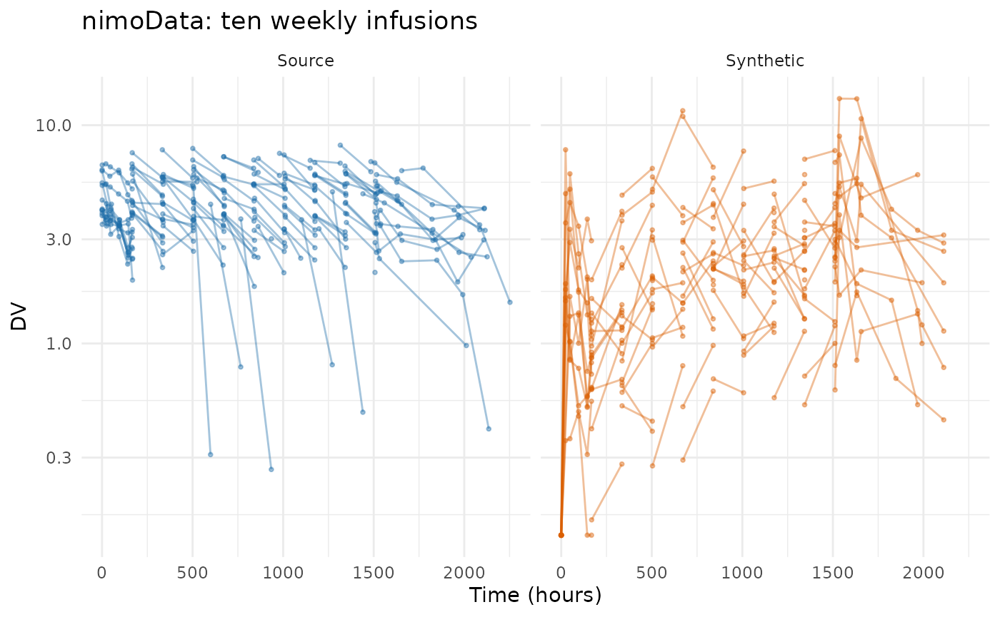
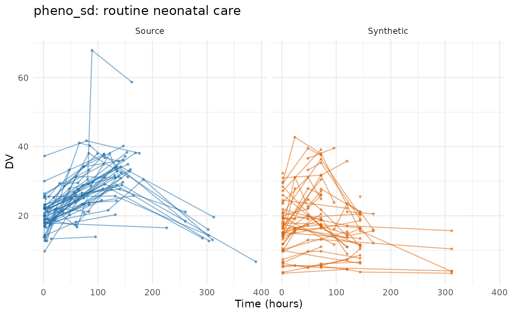

# Evaluating the PMX model generator on public data

This article runs
[`synpmx_model()`](https://iamstein.github.io/synpmx/reference/synpmx_model.md)
over the same eight public datasets that [Evaluating AVATAR on public
data](https://iamstein.github.io/synpmx/articles/avatar-public-data-examples.html)
and [Evaluating PCA on public
data](https://iamstein.github.io/synpmx/articles/pca-public-data-examples.html)
run their generators over, so the three can be read against each other
on identical studies.

This generator asks more of a study than the other two, and **what
separates these datasets is whether the study can identify a population
model at all.** Two things it will not guess, and one it will do anyway
and warn about:

- **A declared nominal grid**, as
  [`synpmx_pca()`](https://iamstein.github.io/synpmx/reference/synpmx_pca.md)
  needs — the visit model is built on it. Refused, because inferring the
  grid is a statement about the protocol only the reader can make.
- **An endpoint that behaves like a drug concentration**: absent before
  the first dose and rising with dose. Refused, because without one
  there is nothing to put a structural model on.
- **A cohort large enough for a covariance matrix**, which
  `min_subjects` sets at twenty. Below it the fit runs and warns: a
  matrix estimated from twelve subjects describes those twelve, and
  whether that is fit for the purpose is a judgement about the purpose
  rather than about the count.

Six studies clear both refusals unaided. The other two run once
something is declared, and what each has to declare is the useful part:
`nimoData` needs its concentration named, and `pheno_sd` needs that and
a nominal grid built for it, because routine care wrote none down —
which is the case to read before declaring one your study does not have.
`theo_md` needs nothing declared and warns about its twelve subjects.

All eight run below. Every refusal is shown before the declaration that
lifts it, because the refusal is what you will meet first.

Every fit below reads patient data once, through
[`synpmx_model_estimate()`](https://iamstein.github.io/synpmx/reference/synpmx_model_estimate.md).
Everything after that — every figure, every table, every scorecard — is
computed from the fit and never touches the source again.

Plotting and reporting helpers used throughout this vignette

``` r

# Observation rows only, source beside synthetic on a shared y axis, one row per
# endpoint. The same figure the PCA survey draws, so the two can be compared
# panel for panel.
overlay_plot <- function(source, synthetic, roles, title,
                         y_label = "DV", log_y = FALSE, alpha = 0.3,
                         max_time = Inf) {
  frame <- function(data, label) {
    observed <- as.character(data[[roles$evid]]) %in% c("0", "0.0") &
      !is.na(data[[roles$dv]])
    if (!is.null(roles$mdv)) {
      observed <- observed & as.character(data[[roles$mdv]]) %in% c("0", "0.0")
    }
    observed <- observed & as.numeric(data[[roles$time]]) <= max_time
    data.frame(
      dataset = factor(label, levels = c("Source", "Synthetic")),
      subject = as.character(data[[roles$id]][observed]),
      occasion = if (is.null(roles$occasion)) "1" else
        as.character(data[[roles$occasion]][observed]),
      time = as.numeric(data[[roles$time]][observed]),
      dv = as.numeric(data[[roles$dv]][observed]),
      endpoint = if (is.null(roles$dvid)) "DV" else
        as.character(data[[roles$dvid]][observed]),
      stringsAsFactors = FALSE
    )
  }
  plotted <- rbind(frame(source, "Source"), frame(synthetic, "Synthetic"))
  figure <- ggplot2::ggplot(
    plotted,
    ggplot2::aes(time, dv,
                 group = interaction(dataset, subject, occasion),
                 colour = dataset)
  ) +
    ggplot2::geom_line(alpha = alpha) +
    ggplot2::geom_point(alpha = alpha, size = 0.7) +
    (if (length(unique(plotted$endpoint)) > 1L) {
      ggplot2::facet_grid(endpoint ~ dataset, scales = "free_y", switch = "y")
    } else {
      ggplot2::facet_wrap(~dataset)
    }) +
    ggplot2::scale_colour_manual(values = comparison_colours) +
    ggplot2::labs(x = "Time (hours)", y = y_label, title = title) +
    ggplot2::theme_minimal() +
    ggplot2::theme(legend.position = "none", strip.placement = "outside")
  if (isTRUE(log_y)) figure + ggplot2::scale_y_log10() else figure
}

overlay_height <- function(data, roles, per_endpoint = 2.2, minimum = 3.4) {
  observed <- as.character(data[[roles$evid]]) %in% c("0", "0.0")
  endpoints <- if (is.null(roles$dvid)) 1L else
    length(unique(data[[roles$dvid]][observed]))
  max(minimum, per_endpoint * endpoints)
}

# Every dataset is run the same way and its numbers collected in one place, so
# the cross-dataset tables at the end cannot drift from the sections above them.
runs <- list()
model_run <- function(label, source, roles, file, seed) {
  fit <- stored_fit(file)
  synthetic <- synpmx_model_generate(fit, seed = seed)
  runs[[label]] <<- list(label = label, source = source, roles = roles,
                         fit = fit, synthetic = synthetic,
                         card = synpmx_scorecard(source, synthetic, roles))
  invisible(runs[[label]])
}

# Nearest-neighbour snapping onto a stated design grid, as in the PCA survey:
# which grid to snap to is a statement about the study and is written out at
# each call.
snap_to <- function(x, grid) {
  grid[max.col(-abs(outer(x, grid, "-")), ties.method = "first")]
}
```

## case1_pkpd: six arms and a censored endpoint

180 patients across six treatment arms, two endpoints keyed by a
character `NAME` column, a baseline weight and a `CENS` column. This is
the study the three demos share.

``` r

case1_pkpd <- as.data.frame(
  get(utils::data(list = "case1_pkpd", package = "xgxr"))
)
# That study's CENS is meaningful only for PK: the PD effect is signed, so a
# left-censored PD row would report a value above the uncensored ones.
case1_pkpd$CENS <- ifelse(case1_pkpd$NAME == "PD - Continuous", 0,
                          case1_pkpd$CENS)
case1_roles <- pmx_roles(
  id = "ID", time = "TIME", dv = "LIDV", cens = "CENS", amt = "AMT",
  evid = "EVID", cmt = "CMT", dvid = "NAME", nominal_time = "NOMTIME",
  strata = c("TRTACT", "DOSE"), covariates = "WEIGHTB", keep = "STUDY"
)
case1 <- model_run("case1_pkpd", case1_pkpd, case1_roles,
                   "case1-pkpd-model-fit.rds", seed = 808)
case1$fit
#> A fitted PMX model, from synpmx_model_estimate()
#> Everything below is an input to `synpmx_model_generate()`.
#> 
#>   candidates fitted  1 (1cmt_oral selected on AIC) 
#> 
#> The PopPK model
#> 
#> Estimated by nlmixr2
#>   structural model   1cmt_oral 
#>   fixed effects      cl 14.53, v 182.7, ka 6.489 
#>   between-subject    cl 0.327, v 0.308, ka 0.316 (as SD on the log scale)
#>   residual error     proportional 0.26 
#>   time to fit        7 min 39 s (7 min 40 s for the whole call)
#>                      nlmixr2: 1cmt_oral 7 min 39 s
#>                      least squares: PD - Continuous 0.0 s
#>   covariate effects  cl ~ (WEIGHTB/117.1)^0.75, v ~ (WEIGHTB/117.1)^1.00 
#> 
#> Each other continuous endpoint, fitted as a shape in time
#>   PD - Continuous    exponential: plateau 149, baseline 52.24, rate
#>                      0.04868; between-subject 0.984 (SD on the log
#>                      baseline); residual additive 225; chosen on AIC from
#>                      constant, linear, exponential
#> 
#> Values at the bottom of the scale
#>   Reported below the assay limit:
#>     PK Concentration   1669 of 3600 (46%) below 0.05 (the limit)
#>   `PK Concentration` was fitted with those rows censored: each enters the
#>   likelihood as the probability of falling below the limit, not as a value
#>   nobody measured. Any other endpoint here reads a uniform draw below the
#>   limit instead, because its shape is a least-squares fit with no
#>   likelihood to put censoring in. At generation the boundary goes back, and
#>   a synthetic value below the limit is written out censored the way the
#>   study recorded it.
#> 
#> Summarized from the source, not estimated
#>   cohort             180 patients in 6 arm(s): Placebo / 0 (30), 3 mg / 3
#>                      (30), 10 mg / 10 (30), 30 mg / 30 (30), 100 mg / 100
#>                      (30), 300 mg / 300 (30)
#>   dose schedule      one schedule per arm rather than one pooled across the
#>                      study; 85 planned cycle(s) per arm at the median of
#>                      the 6 arm(s)
#>   dose changes       none: no arm reduces a dose, skips a cycle or stops
#>                      early, so every generated patient completes its arm's
#>                      schedule
#>   visit attendance   33 grid cell(s) over 2 endpoint(s). A generated
#>                      patient attends each with the frequency its arm
#>                      attended it: median 100%, from 0% to 100%. That is the
#>                      whole model of a missed observation.
#>   covariates         WEIGHTB lognormal, each drawn per arm from the
#>                      source's own distribution and independently of the
#>                      profiles
#>   discrete endpoints 174 grid cell(s) whose values are drawn from the
#>                      frequencies the source recorded there, rather than
#>                      simulated
#>   columns emitted    ID, TIME, NOMTIME, LIDV, AMT, EVID, CMT, NAME, CENS,
#>                      WEIGHTB, TRTACT, DOSE, STUDY
#> 
#> How the concentration endpoint was decided
#>   endpoint           PK Concentration (inferred) 
#>          endpoint compartment post_dose shape proportional
#>   PD - Continuous       FALSE     FALSE    NA        FALSE
#>  PK Concentration        TRUE      TRUE  TRUE         TRUE
#> 
#>   compartment: measured where the doses go, or one compartment above a
#>   dosing compartment nobody observes. post_dose: absent before each
#>   subject's own first dose. shape: the cohort's median profile rises to one
#>   peak and comes back down. proportional: the peak at the highest dose
#>   level scales with the dose against the lowest. `post_dose` and
#>   `proportional` are the two that decide; `compartment` and `shape` break a
#>   tie between endpoints that pass both. NA is a signal this study cannot
#>   compute: `proportional` needs two dose levels several patients share, and
#>   `shape` needs three sampling times in one dose interval.
#>   design             the median profile rises to a peak at 1 before declining, and 99% of subjects do too 
#>   also available     the sampling would support a two-compartment model (median 9 distinct times after a dose, 6 after the peak): ask for it with `pk = "2cmt_oral"`
```


``` r

compare_pmx_distributions(case1$source, case1$synthetic, case1_roles)
```


``` r

synpmx_scorecard_datatable(case1$card)
```

Nothing fails. A5a reads observations per patient falling from 30.7 to
29, which is the visit model drawing attendance rather than copying it,
and D1 puts the concentration’s standard deviation at 0.68 times the
source’s — a spread that narrowed, because the censored rows are fitted
as censored and the residual error no longer carries the scatter of
values the assay never measured.
[`vignette("pmxmodel-demo")`](https://iamstein.github.io/synpmx/articles/pmxmodel-demo.md)
works this study end to end, including what its 46% censoring and its PD
endpoint cost.

Five rows read `not applicable` on every card in this article, so they
are worth reading once here. B1a, B1b and C2 need a run record that
[`synpmx_avatar()`](https://iamstein.github.io/synpmx/reference/synpmx_avatar.md)
writes and this generator does not. B4a asks whether a generated set of
observation times copies a real one, which is a disclosure question only
where the set was taken from somebody: this generator decides each visit
independently from a per-arm probability, so a match is a coincidence
with a computable chance. B2 asks whether a synthetic patient stands out
from its stratum, which is a disclosure question for a generator that
hands a real patient’s trajectory to an avatar and a reading about the
tail of a distribution here. **B4b is the row that carries the claim
here, and it is 0 on every dataset below**: no value any patient
measured is reproduced.

## mad: five endpoints, only one of them a concentration

60 subjects in a multiple-ascending-dose study with a declared `NOMTIME`
and five endpoints — PK concentration, continuous PD, and ordinal, count
and binary PD. The generator fits a structural model to the
concentration and a shape to each continuous PD endpoint; the discrete
ones are a question this generator does not answer.

``` r

mad <- as.data.frame(get(utils::data(list = "mad", package = "xgxr")))
mad_roles <- pmx_roles(
  id = "ID", time = "TIME", dv = "LIDV", amt = "AMT", evid = "EVID",
  cmt = "CMT", dvid = "NAME", mdv = "MDV", nominal_time = "NOMTIME",
  strata = c("TRTACT", "DOSE"), covariates = c("WEIGHTB", "SEX")
)
mad_run <- model_run("mad", mad, mad_roles, "mad-model-fit.rds", seed = 909)
mad_run$fit
#> A fitted PMX model, from synpmx_model_estimate()
#> Everything below is an input to `synpmx_model_generate()`.
#> 
#>   candidates fitted  1 (1cmt_oral selected on AIC) 
#> 
#> The PopPK model
#> 
#> Estimated by nlmixr2
#>   structural model   1cmt_oral 
#>   fixed effects      cl 5.564, v 153.6, ka 3.929 
#>   between-subject    cl 0.357, v 0.35, ka 0.264 (as SD on the log scale)
#>   residual error     proportional 0.719 
#>   time to fit        47.0 s (47.3 s for the whole call)
#>                      nlmixr2: 1cmt_oral 47.0 s
#>                      least squares: PD - Continuous 0.0 s, PD - Count 0.0 s
#>   covariate effects  cl ~ (WEIGHTB/78.5)^0.75, v ~ (WEIGHTB/78.5)^1.00 
#> 
#> Each other continuous endpoint, fitted as a shape in time
#>   PD - Continuous    exponential: plateau 31.47, baseline 1.637, rate
#>                      0.01344; between-subject 1.33 (SD on the log
#>                      baseline); residual additive 8.13; chosen on AIC from
#>                      constant, linear, exponential
#>   PD - Count         exponential: plateau 2.888, baseline 10.38, rate
#>                      0.01484; between-subject 0.248 (SD on the log
#>                      baseline); residual additive 2.78; chosen on AIC from
#>                      constant, linear, exponential
#> 
#> Values at the bottom of the scale
#>   No assay limit declared, so nothing is generated below:
#>     PK Concentration   0.025
#>     PD - Continuous    0.0825
#>   Half the smallest value of each endpoint is reported above and used as a
#>   floor for the synthetic data. A simulated profile that falls below that
#>   floor is set to it.
#> 
#> Summarized from the source, not estimated
#>   cohort             60 patients in 6 arm(s): Placebo / 0 (10), 100 mg /
#>                      100 (10), 200 mg / 200 (10), 400 mg / 400 (10), 800 mg
#>                      / 800 (10), 1600 mg / 1600 (10)
#>   dose schedule      one schedule per arm rather than one pooled across the
#>                      study; 6 planned cycle(s) per arm at the median of the
#>                      6 arm(s)
#>   dose changes       none: no arm reduces a dose, skips a cycle or stops
#>                      early, so every generated patient completes its arm's
#>                      schedule
#>   visit attendance   66 grid cell(s) over 5 endpoint(s). A generated
#>                      patient attends each with the frequency its arm
#>                      attended it: median 100%, from 0% to 100%. That is the
#>                      whole model of a missed observation.
#>   covariates         WEIGHTB lognormal, SEX categorical, each drawn per arm
#>                      from the source's own distribution and independently
#>                      of the profiles
#>   discrete endpoints 370 grid cell(s) whose values are drawn from the
#>                      frequencies the source recorded there, rather than
#>                      simulated
#>   columns emitted    ID, TIME, NOMTIME, LIDV, AMT, EVID, CMT, NAME, MDV,
#>                      WEIGHTB, SEX, TRTACT, DOSE
#> 
#> How the concentration endpoint was decided
#>   endpoint           PK Concentration (inferred) 
#>          endpoint compartment post_dose shape proportional
#>   PD - Continuous       FALSE     FALSE  TRUE        FALSE
#>        PD - Count       FALSE     FALSE  TRUE        FALSE
#>  PK Concentration        TRUE      TRUE  TRUE         TRUE
#> 
#>   compartment: measured where the doses go, or one compartment above a
#>   dosing compartment nobody observes. post_dose: absent before each
#>   subject's own first dose. shape: the cohort's median profile rises to one
#>   peak and comes back down. proportional: the peak at the highest dose
#>   level scales with the dose against the lowest. `post_dose` and
#>   `proportional` are the two that decide; `compartment` and `shape` break a
#>   tie between endpoints that pass both. NA is a signal this study cannot
#>   compute: `proportional` needs two dose levels several patients share, and
#>   `shape` needs three sampling times in one dose interval.
#>   design             the median profile rises to a peak at 2 before declining, and 100% of subjects do too 
#>   also available     the sampling would support a two-compartment model (median 13 distinct times after a dose, 9 after the peak): ask for it with `pk = "2cmt_oral"`
```


``` r

synpmx_scorecard_datatable(mad_run$card)
```

Nothing fails, and A3 reads 5 of 5: every endpoint survives, including
the three discrete ones, which are drawn from the level frequencies
their arm holds at each visit rather than modelled. D1 is the only row
to read, at 0.93 times the source’s spread on `PD - Count`, which is the
furthest of six numeric variables and not the concentration.

This is also the study that found a defect: a visit where every patient
recorded the same level of an ordinal endpoint left the draw with a
single level, and the draw read that level as a count of levels rather
than as the level itself. Fixed, and pinned by a regression test.

## warfarin: a single dose, and no dose levels to compare

32 subjects, a single oral dose, a PK endpoint (`cp`) and a PD one
(`pca`) on different time courses. Its 16 recorded observation times are
the protocol’s, so declaring `nominal_time` from `time` states something
true about this study rather than constructing a grid.

``` r

data("warfarin", package = "nlmixr2data")
warfarin <- as.data.frame(warfarin)
warfarin$ntime <- warfarin$time
warfarin_roles <- pmx_roles(
  id = "id", time = "time", nominal_time = "ntime", dv = "dv", amt = "amt",
  evid = "evid", dvid = "dvid", covariates = c("wt", "age", "sex")
)
warfarin_run <- model_run("warfarin", warfarin, warfarin_roles,
                          "warfarin-model-fit.rds", seed = 404)
model_report(warfarin_run$fit)
#> The PopPK model
#> 
#> Estimated by nlmixr2
#>   structural model   1cmt_oral 
#>   fixed effects      cl 0.1362, v 8.175, ka 0.603 
#>   between-subject    cl 0.246, v 0.0854, ka 0.68 (as SD on the log scale)
#>   residual error     proportional 0.21 
#>   time to fit        10.8 s (10.9 s for the whole call)
#>                      nlmixr2: 1cmt_oral 10.8 s
#>                      least squares: pca 0.0 s
#>   covariate effects  cl ~ (wt/70)^0.75, v ~ (wt/70)^1.00 
#> 
#> Each other continuous endpoint, fitted as a shape in time
#>   pca                exponential: plateau 27.34, baseline 96.3, rate
#>                      0.09877; between-subject 0.146 (SD on the log
#>                      baseline); residual additive 12.4; chosen on AIC from
#>                      constant, linear, exponential
#> 
#> Values at the bottom of the scale
#>   No assay limit declared, so nothing is generated below:
#>     cp                 0.3
#>     pca                4.5
#>   Half the smallest value of each endpoint is reported above and used as a
#>   floor for the synthetic data. A simulated profile that falls below that
#>   floor is set to it.
#> 
#> Summarized from the source, not estimated
#>   cohort             32 patients in 1 arm(s): all (32)
#>   dose schedule      one schedule per arm rather than one pooled across the
#>                      study; 1 planned cycle(s) per arm at the median of the
#>                      1 arm(s)
#>   dose changes       none: no arm reduces a dose, skips a cycle or stops
#>                      early, so every generated patient completes its arm's
#>                      schedule
#>   visit attendance   22 grid cell(s) over 2 endpoint(s). A generated
#>                      patient attends each with the frequency its arm
#>                      attended it: median 95%, from 9% to 100%. That is the
#>                      whole model of a missed observation.
#>   covariates         wt lognormal, age lognormal, sex categorical, each
#>                      drawn per arm from the source's own distribution and
#>                      independently of the profiles
#>   discrete endpoints 22 grid cell(s) whose values are drawn from the
#>                      frequencies the source recorded there, rather than
#>                      simulated
#>   columns emitted    id, time, ntime, dv, amt, evid, dvid, wt, age, sex
#> 
#> How the concentration endpoint was decided
#>   endpoint           cp (inferred) 
#>  endpoint compartment post_dose shape proportional
#>        cp          NA      TRUE  TRUE           NA
#>       pca          NA      TRUE FALSE           NA
#> 
#>   compartment: measured where the doses go, or one compartment above a
#>   dosing compartment nobody observes. post_dose: absent before each
#>   subject's own first dose. shape: the cohort's median profile rises to one
#>   peak and comes back down. proportional: the peak at the highest dose
#>   level scales with the dose against the lowest. `post_dose` and
#>   `proportional` are the two that decide; `compartment` and `shape` break a
#>   tie between endpoints that pass both. NA is a signal this study cannot
#>   compute: `proportional` needs two dose levels several patients share, and
#>   `shape` needs three sampling times in one dose interval.
#>   design             the median profile rises to a peak at 9 before declining, and 31% of subjects do too 
#> 
#> Covariate against the individual random effects
#>  covariate parameter correlation
#>        age        cl        0.37
#>        sex        cl       -0.23
#>         wt        ka        0.21
#>         wt        cl       -0.13
#>         wt         v       -0.12
#> 
#>   A covariate that moves with a random effect and is not in the model above
#>   is generated independently of the profiles, so the synthetic data carries
#>   no relationship between them. `synpmx_avatar()` keeps those relationships
#>   without modelling them.
```


``` r

compare_pmx_distributions(warfarin_run$source, warfarin_run$synthetic,
                          warfarin_roles)
```


``` r

synpmx_scorecard_datatable(warfarin_run$card)
```

Read the design line in the report above rather than the parameters. It
says the median profile peaks at 9 h and that **31% of subjects do too**
— 22 of the 32 are first sampled at 24 h, well past the peak, so most
individual profiles only decline. The route was decided from the pooled
median rather than by a per-subject vote for exactly that reason, and
the low percentage is the fit telling you how much it had to go on.
`proportional` reads `NA` for the same kind of reason: every patient
gets the same dose, so there are no dose levels to compare and the
residual error falls back to additive.

Nothing fails; D1 at 1.2 times the source’s spread on `cp` is the only
row to read. The concentration panel of the figure is the generator at
its best on this survey — the shape, the spread and the decline all
land.

The `pca` panel below it is the generator at its documented limit. The
source’s prothrombin activity falls to a nadir and comes back: median
100, 32, 18, 22, 35 over the first 12 hours, then to 36, 60, 100 and
beyond 100 hours. The synthetic reads 91, 31, 28, 29, 30 — it falls and
then flattens. The PD shapes are constant, linear and exponential fitted
to the pooled observations, and none of the three can come back up.

## wbcSim: an infusion and a delayed response

45 subjects with infusion start/stop pairs and a delayed
white-blood-cell decline, nadir and recovery. The concentration this
generator looks for is not here: what is recorded is the response.

``` r

data("wbcSim", package = "nlmixr2data")
wbcSim <- as.data.frame(wbcSim)
wbcSim$NTIME <- wbcSim$TIME
wbc_roles <- pmx_roles(
  id = "ID", time = "TIME", nominal_time = "NTIME", dv = "DV", amt = "AMT",
  evid = "EVID", cmt = "CMT", rate = "RATE"
)
wbc_run <- model_run("wbcSim", wbcSim, wbc_roles, "wbcsim-model-fit.rds",
                     seed = 505)
#> Warning: 32% of generated observations (45 of 142) fell below the smallest value the
#> study reported and were raised to half of it.
#>   A floor catching this much is a fitted model that does not describe the
#>   low end of the data, not an assay limit.
#>   Fix: Read `model_report()` before using this dataset.
model_report(wbc_run$fit)
#> The PopPK model
#> 
#> Estimated by nlmixr2
#>   structural model   1cmt_infusion 
#>   fixed effects      cl 0.01245, v 20.4 
#>   between-subject    cl 0.353, v 0.32 (as SD on the log scale)
#>   residual error     proportional 0.347 
#>   time to fit        2.5 s (2.6 s for the whole call)
#>                      nlmixr2: 1cmt_infusion 2.5 s
#>   covariate effects  none 
#> 
#> Values at the bottom of the scale
#>   No assay limit declared, so nothing is generated below:
#>     DV                 0.35
#>   Half the smallest value of each endpoint is reported above and used as a
#>   floor for the synthetic data. A simulated profile that falls below that
#>   floor is set to it.
#> 
#> Summarized from the source, not estimated
#>   cohort             45 patients in 1 arm(s): all (45)
#>   dose schedule      one schedule per arm rather than one pooled across the
#>                      study; 1 planned cycle(s) per arm at the median of the
#>                      1 arm(s)
#>   dose routes        one route, undeclared; infused over 1 h
#>   dose changes       none: no arm reduces a dose, skips a cycle or stops
#>                      early, so every generated patient completes its arm's
#>                      schedule
#>   visit attendance   11 grid cell(s) over 1 endpoint(s). A generated
#>                      patient attends each with the frequency its arm
#>                      attended it: median 11%, from 7% to 100%. That is the
#>                      whole model of a missed observation.
#>   covariates         none declared
#>   discrete endpoints 11 grid cell(s) whose values are drawn from the
#>                      frequencies the source recorded there, rather than
#>                      simulated
#>   columns emitted    ID, TIME, NTIME, DV, AMT, EVID, CMT, RATE
#> 
#> How the concentration endpoint was decided
#>   endpoint           DV (inferred) 
#>  endpoint compartment post_dose shape proportional
#>        DV       FALSE      TRUE  TRUE           NA
#> 
#>   compartment: measured where the doses go, or one compartment above a
#>   dosing compartment nobody observes. post_dose: absent before each
#>   subject's own first dose. shape: the cohort's median profile rises to one
#>   peak and comes back down. proportional: the peak at the highest dose
#>   level scales with the dose against the lowest. `post_dose` and
#>   `proportional` are the two that decide; `compartment` and `shape` break a
#>   tie between endpoints that pass both. NA is a signal this study cannot
#>   compute: `proportional` needs two dose levels several patients share, and
#>   `shape` needs three sampling times in one dose interval.
#>   design             a nonzero `rate` on the dose records
```


``` r

synpmx_scorecard_datatable(wbc_run$card)
```

**This is the study where the generator’s endpoint test is wrong, and
the scorecard only partly catches it.** `wbcSim` records a white blood
cell count, not a drug concentration. The test asks whether an endpoint
is absent before the first dose and rises and falls afterwards, and a
delayed myelosuppression answers yes to both, so a one-compartment
infusion model was fitted to a cell count. It converged, and the report
says `1cmt_infusion` with a clearance of 0.012 as though that meant
something.

The output shows it, and so does the generator. A cell count recovers to
its baseline between infusions and a concentration decays toward zero,
so the generated profiles run below the source’s — per-time medians of
0.35 to 6.9 against the source’s 1.1 to 10.8 — and the source’s nadir at
216 h and its recovery are absent. **32% of the generated observations
landed below the smallest value the study reported** and were raised to
half of it, which the run says out loud: a floor catching a third of the
output is a model that does not describe the low end of the data. It
draws as the flat band along the bottom of the synthetic panel. A4 reads
45 -\> 37, because eight subjects drew no observations at all, and A5a
and A5b fall with it.

Nothing here `FAIL`s, which is the honest report of what the scorecard
checks: it asks whether the output is a legal dataset in the study’s
shape and whether it copies anybody, not whether the structural model
was the right one to fit. `endpoint_roles` cannot help — the endpoint
really is the one modelled. What this study needs is a generator that
does not assert a PK shape, and both
[`synpmx_pca()`](https://iamstein.github.io/synpmx/reference/synpmx_pca.md)
and
[`synpmx_avatar()`](https://iamstein.github.io/synpmx/reference/synpmx_avatar.md)
reproduce its nadir and recovery, as their own surveys show.

## mavoglurant: an occasion-reset clock

120 subjects in one- and two-period profiles, with `TIME` resetting
inside `OCC` so it is already dose-relative. The grid is the one the PCA
survey writes down, reused unchanged.

``` r

data("mavoglurant", package = "nlmixr2data")
mavoglurant <- as.data.frame(mavoglurant)
mavo_design <- c(0, 0.25, 0.5, 0.75, 1, 1.5, 2, 3, 4, 6, 8, 10, 12, 24, 36, 48)
mavoglurant$NTIME <- ifelse(mavoglurant$EVID == 0,
                            snap_to(mavoglurant$TIME, mavo_design),
                            mavoglurant$TIME)
mavo_roles <- pmx_roles(
  id = "ID", time = "TIME", nominal_time = "NTIME", dv = "DV", amt = "AMT",
  evid = "EVID", cmt = "CMT", rate = "RATE", mdv = "MDV", occasion = "OCC",
  keep = "DOSE", covariates = c("AGE", "SEX", "WT", "HT")
)
mavo_run <- model_run("mavoglurant", mavoglurant, mavo_roles,
                      "mavoglurant-model-fit.rds", seed = 707)
mavo_run$fit
#> A fitted PMX model, from synpmx_model_estimate()
#> Everything below is an input to `synpmx_model_generate()`.
#> 
#>   candidates fitted  1 (1cmt_infusion selected on AIC) 
#> 
#> The PopPK model
#> 
#> Estimated by nlmixr2
#>   structural model   1cmt_infusion 
#>   fixed effects      cl 0.03503, v 0.2088 
#>   between-subject    cl 0.421, v 0.337 (as SD on the log scale)
#>   residual error     proportional 0.721 
#>   time to fit        21.3 s (21.5 s for the whole call)
#>                      nlmixr2: 1cmt_infusion 21.3 s
#>   covariate effects  cl ~ (WT/82.6)^0.75, v ~ (WT/82.6)^1.00 
#> 
#> Values at the bottom of the scale
#>   No assay limit declared, so nothing is generated below:
#>     DV                 1.005
#>   Half the smallest value of each endpoint is reported above and used as a
#>   floor for the synthetic data. A simulated profile that falls below that
#>   floor is set to it.
#> 
#> Summarized from the source, not estimated
#>   cohort             120 patients in 1 arm(s): all (120)
#>   dose schedule      one schedule per arm rather than one pooled across the
#>                      study; 1 planned cycle(s) per arm at the median of the
#>                      1 arm(s)
#>   dose routes        one route, undeclared; infused over 0.1667 h
#>   dose changes       none: no arm reduces a dose, skips a cycle or stops
#>                      early, so every generated patient completes its arm's
#>                      schedule
#>   visit attendance   14 grid cell(s) over 1 endpoint(s). A generated
#>                      patient attends each with the frequency its arm
#>                      attended it: median 100%, from 6% to 100%. That is the
#>                      whole model of a missed observation.
#>   covariates         AGE lognormal, SEX lognormal, WT lognormal, HT
#>                      lognormal, each drawn per arm from the source's own
#>                      distribution and independently of the profiles
#>   discrete endpoints 14 grid cell(s) whose values are drawn from the
#>                      frequencies the source recorded there, rather than
#>                      simulated
#>   columns emitted    ID, TIME, NTIME, OCC, DV, AMT, EVID, CMT, MDV, RATE,
#>                      AGE, SEX, WT, HT, DOSE
#> 
#> How the concentration endpoint was decided
#>   endpoint           DV (inferred) 
#>  endpoint compartment post_dose shape proportional
#>        DV        TRUE      TRUE  TRUE         TRUE
#> 
#>   compartment: measured where the doses go, or one compartment above a
#>   dosing compartment nobody observes. post_dose: absent before each
#>   subject's own first dose. shape: the cohort's median profile rises to one
#>   peak and comes back down. proportional: the peak at the highest dose
#>   level scales with the dose against the lowest. `post_dose` and
#>   `proportional` are the two that decide; `compartment` and `shape` break a
#>   tie between endpoints that pass both. NA is a signal this study cannot
#>   compute: `proportional` needs two dose levels several patients share, and
#>   `shape` needs three sampling times in one dose interval.
#>   design             a nonzero `rate` on the dose records 
#>   also available     the sampling would support a two-compartment model (median 11 distinct times after a dose, 10 after the peak): ask for it with `pk = "2cmt_iv"` 
#> 
#> Covariate against the individual random effects
#>  covariate parameter correlation
#>        AGE        cl      -0.255
#>         HT        cl       0.150
#>        SEX         v       0.093
#>        SEX        cl      -0.057
#>        AGE         v       0.056
#> 
#>   A covariate that moves with a random effect and is not in the model above
#>   is generated independently of the profiles, so the synthetic data carries
#>   no relationship between them. `synpmx_avatar()` keeps those relationships
#>   without modelling them.
```


``` r

synpmx_scorecard_datatable(mavo_run$card)
```

Three rows to read, and two findings. A5b reports occasions per patient
falling from 1.65 to 1 and A5a observations per patient from 20.2 to
11.3: `mavoglurant` is one- and two-period, and the dosing model carries
one planned schedule per arm, so the patients who had a second period do
not get it back. A study whose periods matter needs them declared as
arms, or a generator that keeps each patient’s own schedule.

The second finding is in the figure rather than the card. The source’s
profiles are a tight declining band and the synthetic ones scatter
across it, with a line of values along the assay floor: the fit’s
proportional residual is 0.72, which is what a one-compartment model
produces on a drug that plainly has a distribution phase.

The route detection reads the `rate` role and offers `1cmt_infusion`,
and **there is no two-compartment infusion model in the closed-form
set** — `1cmt_iv`, `1cmt_oral`, `1cmt_infusion`, `2cmt_iv`, `2cmt_oral`.
The shape is still reachable by asking for the intravenous one and
giving up the infusion duration, which on this study is worth 4,200 AIC:

``` r

synpmx_model_estimate(mavoglurant, mavo_roles, seed = 1,
                      pk = c("1cmt_infusion", "2cmt_iv"))
#> 1cmt_infusion  AIC 29105.6
#> 2cmt_iv        AIC 24870.7
```

Worth knowing before reaching for it: the better-fitting model does not
produce a better dataset by the scorecard’s reading. D1 moves from 0.41
of the source’s spread to 0.34, and A5a and A5b do not move at all,
because what they measure is the visit and dosing models rather than the
structural one.

## theo_md: twelve subjects, which is below the floor

12 subjects, seven doses exactly 24 h apart, dense sampling around the
first and last dose. The grid is constructible and the endpoint is a
concentration, so nothing stands between this study and a fit except the
cohort size — and that is a warning rather than a refusal.

``` r

data("theo_md", package = "nlmixr2data")
theo_md <- as.data.frame(theo_md)
theo_doses <- seq(0, 144, by = 24)
theo_samples <- c(0, 0.25, 0.5, 1, 2, 3, 4, 5, 7, 9, 12, 24)
interval <- pmax(1L, findInterval(theo_md$TIME, theo_doses))
theo_md$NTIME <- ifelse(
  theo_md$EVID == 0,
  theo_doses[interval] +
    snap_to(theo_md$TIME - theo_doses[interval], theo_samples),
  theo_md$TIME
)
theo_roles <- pmx_roles(
  id = "ID", time = "TIME", nominal_time = "NTIME", dv = "DV", amt = "AMT",
  evid = "EVID", cmt = "CMT", covariates = "WT"
)
```

`synpmx_model_estimate(theo_md, theo_roles, seed = 1)` fits, and says
what it is doing on the way past:

> [`synpmx_model_estimate()`](https://iamstein.github.io/synpmx/reference/synpmx_model_estimate.md)
> is fitting a population model to 12 subjects, below `min_subjects` =
> 20. The fixed effects and the covariance matrix describe those 12
> subjects rather than a population, and nothing downstream will tell
> you so: the scorecard asks whether the output copies anybody or
> changed the study’s shape, and a small-cohort fit does neither.

The floor is an argument rather than a constant, so `min_subjects = 12L`
says the consequence is understood and silences it. That is what the
stored fit below was built with, and what it costs is stated in the row
it fills in the closing tables: a covariance matrix estimated from
twelve subjects describes those twelve.

``` r

theo_run <- model_run("theo_md", theo_md, theo_roles, "theo-md-model-fit.rds",
                      seed = 303)
theo_run$fit
#> A fitted PMX model, from synpmx_model_estimate()
#> Everything below is an input to `synpmx_model_generate()`.
#> 
#>   candidates fitted  1 (1cmt_oral selected on AIC) 
#> 
#> The PopPK model
#> 
#> Estimated by nlmixr2
#>   structural model   1cmt_oral 
#>   fixed effects      cl 2.859, v 34.21, ka 1.461 
#>   between-subject    cl 0.189, v 0.112, ka 0.578 (as SD on the log scale)
#>   residual error     proportional 0.217 
#>   time to fit        12.1 s (12.3 s for the whole call)
#>                      nlmixr2: 1cmt_oral 12.1 s
#>   covariate effects  cl ~ (WT/70.5)^0.75, v ~ (WT/70.5)^1.00 
#> 
#> Values at the bottom of the scale
#>   No assay limit declared, so nothing is generated below:
#>     DV                 0.075
#>   Half the smallest value of each endpoint is reported above and used as a
#>   floor for the synthetic data. A simulated profile that falls below that
#>   floor is set to it.
#> 
#> Summarized from the source, not estimated
#>   cohort             12 patients in 1 arm(s): all (12)
#>   dose schedule      one schedule per arm rather than one pooled across the
#>                      study; 7 planned cycle(s) per arm at the median of the
#>                      1 arm(s)
#>   dose changes       none: no arm reduces a dose, skips a cycle or stops
#>                      early, so every generated patient completes its arm's
#>                      schedule
#>   visit attendance   25 grid cell(s) over 1 endpoint(s). A generated
#>                      patient attends each with the frequency its arm
#>                      attended it: median 100%, from 33% to 100%. That is
#>                      the whole model of a missed observation.
#>   covariates         WT lognormal, each drawn per arm from the source's own
#>                      distribution and independently of the profiles
#>   discrete endpoints 25 grid cell(s) whose values are drawn from the
#>                      frequencies the source recorded there, rather than
#>                      simulated
#>   columns emitted    ID, TIME, NTIME, DV, AMT, EVID, CMT, WT
#> 
#> How the concentration endpoint was decided
#>   endpoint           DV (inferred) 
#>  endpoint compartment post_dose shape proportional
#>        DV        TRUE      TRUE  TRUE           NA
#> 
#>   compartment: measured where the doses go, or one compartment above a
#>   dosing compartment nobody observes. post_dose: absent before each
#>   subject's own first dose. shape: the cohort's median profile rises to one
#>   peak and comes back down. proportional: the peak at the highest dose
#>   level scales with the dose against the lowest. `post_dose` and
#>   `proportional` are the two that decide; `compartment` and `shape` break a
#>   tie between endpoints that pass both. NA is a signal this study cannot
#>   compute: `proportional` needs two dose levels several patients share, and
#>   `shape` needs three sampling times in one dose interval.
#>   design             the median profile rises to a peak at 2 before declining, and 100% of subjects do too 
#>   also available     the sampling would support a two-compartment model (median 11 distinct times after a dose, 6 after the peak): ask for it with `pk = "2cmt_oral"` 
#> 
#> Covariate against the individual random effects
#>  covariate parameter correlation
#>         WT        ka        0.58
#>         WT         v       -0.35
#>         WT        cl       -0.26
#> 
#>   A covariate that moves with a random effect and is not in the model above
#>   is generated independently of the profiles, so the synthetic data carries
#>   no relationship between them. `synpmx_avatar()` keeps those relationships
#>   without modelling them.
```


``` r

synpmx_scorecard_datatable(theo_run$card)
```

Nothing fails, and the card looks like the others. That is the
uncomfortable part: the scorecard cannot see that a covariance matrix
came from twelve subjects, because the question it asks is whether this
output copies anybody or changed the study’s shape, and a twelve-subject
fit does neither. The floor exists because nothing downstream of it can
tell.

## nimoData: the endpoint has to be named

12 subjects, ten roughly weekly infusions, with dose times recorded as
actuals. The grid construction is the one the AVATAR and PCA surveys
work out, reused unchanged. Its twelve subjects draw the same warning
`theo_md` did, and then it is refused for a reason worth reading.

``` r

data("nimoData", package = "nlmixr2data")
nimoData <- as.data.frame(nimoData)
nimo_interval <- 168
last_occasion <- ave(nimoData$OCC, nimoData$ID, FUN = max)
nominal_tad <- round(nimoData$TAD / 24) * 24
pre_dose <- nimoData$EVID == 0 & nominal_tad >= nimo_interval &
  nimoData$OCC < last_occasion
nominal_tad[pre_dose] <- nimo_interval - 1
nimoData$NTIME <- (nimoData$OCC - 1) * nimo_interval +
  ifelse(nimoData$EVID == 0, nominal_tad, 0)
nimo_roles <- pmx_roles(
  id = "ID", time = "TIME", nominal_time = "NTIME", dv = "DV", amt = "AMT",
  evid = "EVID", rate = "RATE", mdv = "MDV", tad = "TAD", occasion = "OCC",
  covariates = c("BSA", "AGE", "HGT"), keep = "DOS"
)
synpmx_model_estimate(nimoData, nimo_roles, seed = 1, min_subjects = 12L)
#> Error:
#> ! `synpmx_model_estimate()` needs the nlmixr2 package, which is in Suggests.
#>   Fix: Install it, or use `synpmx_avatar()` or `synpmx_pca()`, which fit no
#>     structural model.
```

Every subject in `nimoData` receives the same dose, so there are no dose
levels to compare and nothing in the table says this endpoint scales
with dose. The detection fails closed rather than assuming, and the
refusal is the generator declining to make that statement on your
behalf.

`DV` here *is* a concentration, and saying so is a statement about the
assay that only the reader can make. With that declaration and the floor
lowered, the study fits in about four seconds.

``` r

nimo_fit <- synpmx_model_estimate(nimoData, nimo_roles, seed = 1,
                                  min_subjects = 12L,
                                  endpoint_roles = c(pk = "DV"))
```

``` r

nimo_run <- model_run("nimoData", nimoData, nimo_roles, "nimo-model-fit.rds",
                      seed = 606)
nimo_run$fit
#> A fitted PMX model, from synpmx_model_estimate()
#> Everything below is an input to `synpmx_model_generate()`.
#> 
#>   candidates fitted  1 (1cmt_infusion selected on AIC) 
#> 
#> The PopPK model
#> 
#> Estimated by nlmixr2
#>   structural model   1cmt_infusion 
#>   fixed effects      cl 0.1305, v 42.65 
#>   between-subject    cl 0.585, v 0.704 (as SD on the log scale)
#>   residual error     proportional 0.468 
#>   time to fit        3.1 s (3.1 s for the whole call)
#>                      nlmixr2: 1cmt_infusion 3.1 s
#>   covariate effects  none 
#> 
#> Values at the bottom of the scale
#>   No assay limit declared, so nothing is generated below:
#>     DV                 0.1323
#>   Half the smallest value of each endpoint is reported above and used as a
#>   floor for the synthetic data. A simulated profile that falls below that
#>   floor is set to it.
#> 
#> Summarized from the source, not estimated
#>   cohort             12 patients in 1 arm(s): all (12)
#>   dose schedule      one schedule per arm rather than one pooled across the
#>                      study; 10 planned cycle(s) per arm at the median of
#>                      the 1 arm(s)
#>   dose routes        one route, undeclared; infused over 0.1 to 1 h
#>   dose changes       none: no arm reduces a dose, skips a cycle or stops
#>                      early, so every generated patient completes its arm's
#>                      schedule
#>   visit attendance   31 grid cell(s) over 1 endpoint(s). A generated
#>                      patient attends each with the frequency its arm
#>                      attended it: median 100%, from 25% to 100%. That is
#>                      the whole model of a missed observation.
#>   covariates         BSA lognormal, AGE lognormal, HGT lognormal, each
#>                      drawn per arm from the source's own distribution and
#>                      independently of the profiles
#>   discrete endpoints 31 grid cell(s) whose values are drawn from the
#>                      frequencies the source recorded there, rather than
#>                      simulated
#>   columns emitted    ID, TIME, NTIME, TAD, OCC, DV, AMT, EVID, MDV, RATE,
#>                      BSA, AGE, HGT, DOS
#> 
#> How the concentration endpoint was decided
#>   endpoint           DV (declared) 
#>  endpoint compartment post_dose shape proportional
#>        DV          NA      TRUE  TRUE        FALSE
#> 
#>   compartment: measured where the doses go, or one compartment above a
#>   dosing compartment nobody observes. post_dose: absent before each
#>   subject's own first dose. shape: the cohort's median profile rises to one
#>   peak and comes back down. proportional: the peak at the highest dose
#>   level scales with the dose against the lowest. `post_dose` and
#>   `proportional` are the two that decide; `compartment` and `shape` break a
#>   tie between endpoints that pass both. NA is a signal this study cannot
#>   compute: `proportional` needs two dose levels several patients share, and
#>   `shape` needs three sampling times in one dose interval.
#>   design             a nonzero `rate` on the dose records 
#>   also available     the sampling would support a two-compartment model (median 6 distinct times after a dose, 5 after the peak): ask for it with `pk = "2cmt_iv"` 
#> 
#> Covariate against the individual random effects
#>  covariate parameter correlation
#>        HGT        cl       -0.47
#>        HGT         v       -0.41
#>        AGE        cl        0.24
#>        AGE         v        0.13
#>        BSA         v       -0.12
#> 
#>   A covariate that moves with a random effect and is not in the model above
#>   is generated independently of the profiles, so the synthetic data carries
#>   no relationship between them. `synpmx_avatar()` keeps those relationships
#>   without modelling them.
```



``` r

synpmx_scorecard_datatable(nimo_run$card)
```

Nothing fails, and D1 at 3.4 times the source’s spread is the one row to
read — the widest of the eight, and what twelve subjects buy: a
covariance matrix estimated from twelve people, drawn from freely,
produces profiles more spread out than the twelve it came from. The
subject floor exists for this, and `nimoData` is the study that shows
what lifting it costs.

`nimoData` is also the study that shows the other reading the fit has to
make. It reports **one negative concentration in 321** — what an assay
returns for a sample near its limit — and a single row is not evidence
that this endpoint reaches zero. Treating it as evidence would fit an
additive residual to values whose median is 3, and the generated troughs
would land on zero. It is substituted at half the smallest positive
value the study reports, the fit says so as it happens, and the
proportional residual stands.

## pheno_sd: the grid has to be built, not declared

59 neonates on phenobarbital in routine care, with individualised dosing
and sparse irregular sampling: 155 observations at 118 distinct times,
about two and a half per baby. The concentration test fails here for the
same reason it fails on `nimoData` — the doses are individualised rather
than assigned, so nothing reads as dose-proportional.

``` r

data("pheno_sd", package = "nlmixr2data")
pheno_sd <- as.data.frame(pheno_sd)
pheno_flat <- pheno_sd
pheno_flat$NTIME <- pheno_flat$TIME   # a declaration this study cannot support
pheno_roles <- pmx_roles(
  id = "ID", time = "TIME", nominal_time = "NTIME", dv = "DV", amt = "AMT",
  evid = "EVID", mdv = "MDV", covariates = c("WT", "APGR")
)
synpmx_model_estimate(pheno_flat, pheno_roles, seed = 1)
#> Error:
#> ! `synpmx_model_estimate()` needs the nlmixr2 package, which is in Suggests.
#>   Fix: Install it, or use `synpmx_avatar()` or `synpmx_pca()`, which fit no
#>     structural model.
```

Name the endpoint and it fits. **Nothing in the generator’s own
requirements stops this study — and with `NTIME` set to `TIME` the
output is still nearly empty.**

``` r

pheno_flat_fit <- stored_fit("pheno-flat-model-fit.rds")
pheno_flat_synthetic <- synpmx_model_generate(pheno_flat_fit, seed = 707)
#> Warning: 65% of generated observations (15 of 23) fell below the smallest value the
#> study reported and were raised to half of it.
#>   A floor catching this much is a fitted model that does not describe the
#>   low end of the data, not an assay limit.
#>   Fix: Read `model_report()` before using this dataset.
c(distinct_times = length(unique(pheno_sd$TIME[pheno_sd$EVID == 0])),
  grid_cells = nrow(pheno_flat_fit$cells),
  source_obs_per_patient = round(sum(pheno_sd$EVID == 0) /
                                   length(unique(pheno_sd$ID)), 2),
  synthetic_obs_per_patient = round(
    sum(pheno_flat_synthetic$EVID == 0) /
      length(unique(pheno_flat_synthetic$ID)), 2))
#>            distinct_times                grid_cells    source_obs_per_patient 
#>                    118.00                      5.00                      2.63 
#> synthetic_obs_per_patient 
#>                      0.43
```

118 distinct recorded times become a handful of grid cells. A cell has
to be reached by enough patients to be a visit rather than one baby’s
afternoon, and one clock reading per patient clears that almost nowhere.
The visit model then has almost no place to put an observation, so what
comes back is a legal dataset in the source’s shape holding almost
nothing — and the run says so on the way past, because most of what
little was drawn landed under the smallest concentration the study
reports.

### The grid this study does have

The ward gives phenobarbital on a twelve-hour cycle and reads a
concentration about once a day. Neither is written in the file and both
are things a reader of the study can say, which is exactly what
`nominal_time` is for: the clock is what happened, the grid is what was
meant to happen. Snapping the dose times to twelve hours and the sample
times to the day is that statement, and it is two lines.

``` r

pheno_sd$NTIME <- ifelse(
  pheno_sd$EVID == 0,
  snap_to(pheno_sd$TIME, c(2, seq(24, 408, by = 24))),   # about one a day
  snap_to(pheno_sd$TIME, seq(0, 168, by = 12))           # the q12h cycle
)
```

``` r

pheno_run <- model_run("pheno_sd", pheno_sd, pheno_roles,
                       "pheno-model-fit.rds", seed = 707)
pheno_run$fit
#> A fitted PMX model, from synpmx_model_estimate()
#> Everything below is an input to `synpmx_model_generate()`.
#> 
#>   candidates fitted  2 (1cmt_iv selected on AIC) 
#> 
#> The PopPK model
#> 
#> Estimated by nlmixr2
#>   structural model   1cmt_iv 
#>   fixed effects      cl 0.006131, v 1.314 
#>   between-subject    cl 0.182, v 0.172 (as SD on the log scale)
#>   residual error     proportional 0.118 
#>   time to fit        32.8 s (32.9 s for the whole call)
#>                      nlmixr2: 1cmt_iv 8.5 s, 1cmt_oral 24.3 s
#>   covariate effects  cl ~ (WT/1.3)^0.75, v ~ (WT/1.3)^1.00 
#> 
#> Values at the bottom of the scale
#>   No assay limit declared, so nothing is generated below:
#>     DV                 3.35
#>   Half the smallest value of each endpoint is reported above and used as a
#>   floor for the synthetic data. A simulated profile that falls below that
#>   floor is set to it.
#> 
#> Summarized from the source, not estimated
#>   cohort             59 patients in 1 arm(s): all (59)
#>   dose schedule      one schedule per arm rather than one pooled across the
#>                      study; 14 planned cycle(s) per arm at the median of
#>                      the 1 arm(s)
#>   dose changes       per planned cycle, a patient may reduce to the next
#>                      dose level, skip that cycle, or stop treatment for
#>                      good, at these rates:
#>       all                reduce 14%, skip 1%, stop early 10% (6 dose level(s))
#>   visit attendance   9 grid cell(s) over 1 endpoint(s). A generated patient
#>                      attends each with the frequency its arm attended it:
#>                      median 25%, from 8% to 81%. That is the whole model of
#>                      a missed observation.
#>   covariates         WT lognormal, APGR lognormal, each drawn per arm from
#>                      the source's own distribution and independently of the
#>                      profiles
#>   discrete endpoints 9 grid cell(s) whose values are drawn from the
#>                      frequencies the source recorded there, rather than
#>                      simulated
#>   columns emitted    ID, TIME, NTIME, DV, AMT, EVID, MDV, WT, APGR
#> 
#> How the concentration endpoint was decided
#>   endpoint           DV (declared) 
#>  endpoint compartment post_dose shape proportional
#>        DV          NA      TRUE    NA        FALSE
#> 
#>   compartment: measured where the doses go, or one compartment above a
#>   dosing compartment nobody observes. post_dose: absent before each
#>   subject's own first dose. shape: the cohort's median profile rises to one
#>   peak and comes back down. proportional: the peak at the highest dose
#>   level scales with the dose against the lowest. `post_dose` and
#>   `proportional` are the two that decide; `compartment` and `shape` break a
#>   tie between endpoints that pass both. NA is a signal this study cannot
#>   compute: `proportional` needs two dose levels several patients share, and
#>   `shape` needs three sampling times in one dose interval.
#>   design             too few distinct sampling times to place a peak 
#> 
#> Covariate against the individual random effects
#>  covariate parameter correlation
#>         WT        cl       0.224
#>       APGR        cl      -0.201
#>       APGR         v      -0.117
#>         WT         v       0.055
#> 
#>   A covariate that moves with a random effect and is not in the model above
#>   is generated independently of the profiles, so the synthetic data carries
#>   no relationship between them. `synpmx_avatar()` keeps those relationships
#>   without modelling them.
```



``` r

synpmx_scorecard_datatable(pheno_run$card)
```

The fixed effects are the same either way, and that is the point worth
holding on to: estimation reads the recorded clock and the recorded
dosing history, so the grid never touches it. What the grid decides is
the visit model, and the visit model is the whole of what the generated
study has. With somewhere to put an observation, observations per
patient come back.

(For the record on the fit itself: clearance near 0.006 L/h and volume
near 1.3 L for a 1.3 kg baby is where the literature puts neonatal
phenobarbital, which is worth saying only because a study this sparse —
one concentration per baby per dose interval — has no interval that can
be read non-compartmentally, and the starting values are read off the
cohort’s doses and concentrations instead.)

What has not moved is the dosing: every baby in `pheno_sd` is dosed to
their own weight and response, and the dosing model carries one planned
schedule per arm with a reduction, interruption and discontinuation rate
attached. The generated babies all follow the ward’s cycle rather than
their own.

This is still the study to read before declaring a nominal grid, but the
lesson is the opposite of a refusal: the generator will accept
`NTIME <- TIME` and hand back what it implies, and the work of using it
on a study like this is deciding what the protocol would have said.
[`synpmx_pca()`](https://iamstein.github.io/synpmx/reference/synpmx_pca.md)
refuses the declaration outright;
[`synpmx_avatar()`](https://iamstein.github.io/synpmx/reference/synpmx_avatar.md)
derives a grid instead, and the [AVATAR
evaluation](https://iamstein.github.io/synpmx/articles/avatar-public-data-examples.html)
runs this study that way.

## What the eight runs held

``` r

inventory <- do.call(rbind, lapply(runs, function(entry) {
  fit <- entry$fit
  data.frame(
    Dataset = entry$label,
    Patients = length(unique(entry$source[[entry$roles$id]])),
    Model = fit$structural,
    `Fixed effects` = paste(names(fit$parameters$fixed),
                            signif(fit$parameters$fixed, 3),
                            collapse = ", "),
    # A proportional error reports a coefficient of variation and an additive
    # one a standard deviation, so the field is named by the kind.
    Residual = paste(fit$parameters$residual$kind,
                     signif(if (is.null(fit$parameters$residual$cv))
                              fit$parameters$residual$sd else
                              fit$parameters$residual$cv, 3)),
    check.names = FALSE, stringsAsFactors = FALSE
  )
}))
knitr::kable(inventory, row.names = FALSE,
             caption = "What each fit carries out of its study.")
```

| Dataset | Patients | Model | Fixed effects | Residual |
|:---|---:|:---|:---|:---|
| case1_pkpd | 180 | 1cmt_oral | cl 14.5, v 183, ka 6.49 | proportional 0.26 |
| mad | 60 | 1cmt_oral | cl 5.56, v 154, ka 3.93 | proportional 0.719 |
| warfarin | 32 | 1cmt_oral | cl 0.136, v 8.18, ka 0.603 | proportional 0.21 |
| wbcSim | 45 | 1cmt_infusion | cl 0.0124, v 20.4 | proportional 0.347 |
| mavoglurant | 120 | 1cmt_infusion | cl 0.035, v 0.209 | proportional 0.721 |
| theo_md | 12 | 1cmt_oral | cl 2.86, v 34.2, ka 1.46 | proportional 0.217 |
| nimoData | 12 | 1cmt_infusion | cl 0.13, v 42.6 | proportional 0.468 |
| pheno_sd | 59 | 1cmt_iv | cl 0.00613, v 1.31 | proportional 0.118 |

What each fit carries out of its study. {.table}

``` r

verdicts <- do.call(rbind, lapply(runs, function(entry) {
  card <- as.data.frame(entry$card)
  counts <- table(factor(card$verdict,
                         levels = c("pass", "review", "FAIL",
                                    "not applicable")))
  data.frame(Dataset = entry$label, as.list(counts),
             Failing = paste(card$check[card$verdict == "FAIL"],
                             collapse = ", "),
             check.names = FALSE, stringsAsFactors = FALSE)
}))
knitr::kable(verdicts, row.names = FALSE,
             caption = "Scorecard verdicts across the eight runs.")
```

| Dataset     | pass | review | FAIL | not applicable | Failing |
|:------------|-----:|-------:|-----:|---------------:|:--------|
| case1_pkpd  |   11 |      2 |    0 |              5 |         |
| mad         |   12 |      1 |    0 |              5 |         |
| warfarin    |   12 |      1 |    0 |              5 |         |
| wbcSim      |   10 |      3 |    0 |              5 |         |
| mavoglurant |   10 |      3 |    0 |              5 |         |
| theo_md     |   12 |      1 |    0 |              5 |         |
| nimoData    |   12 |      1 |    0 |              5 |         |
| pheno_sd    |   11 |      2 |    0 |              5 |         |

Scorecard verdicts across the eight runs. {.table}

No card fails on any of the eight. Five rows on each read
`not applicable` for the reasons given under `case1_pkpd`, and the rows
that ask to be read are `A5a`, `A5b` and `D1` — how many observations
and occasions each patient kept, and how far a spread moved.

## What is preserved, and what is not

Preserved on all eight: the schema and event grammar, the cohort and arm
sizes, the nominal grid the study declared, one dose schedule per arm,
the covariate marginals, and the guarantee B4b measures — no value any
patient measured is reproduced.

Not preserved, with the study that shows each:

- **Visit-to-visit measurement noise.** Every profile is one structural
  model at a different parameter draw, so generated profiles are
  smoother than real ones. Visible on every dataset here.
- **Exposure-response.** The PD shapes are fitted to the pooled
  observations with no exposure term, so a synthetic patient’s arm does
  not reach their response. `case1_pkpd` is the worked case, in the
  demo.
- **Per-patient dose schedules, and multiple periods.** One planned
  schedule per arm. `mavoglurant` is the worked case: occasions per
  patient fall from 1.65 to 1. `pheno_sd` is the other half of it —
  every neonate is dosed to their own weight and response, and the
  generated babies all follow the ward’s cycle.
- **Arm-specific censoring.** One parameter distribution evaluated at
  each arm’s dose cannot reproduce six arm-specific fractions below the
  limit; `case1_pkpd`, again in the demo.
- **Any endpoint that is not a concentration.** `wbcSim` is the worked
  case, and the one to read before trusting this generator on a response
  variable.
- **Anything the declared grid does not hold.** The visit model can only
  place an observation where the grid has a cell enough patients
  reached, so a grid that describes nothing produces a study that holds
  nothing. `pheno_sd` declared as `NTIME <- TIME` is the worked case,
  and the fidelity rows are where it shows.
- **Spread, at the floor.** `nimoData` and `theo_md` are both twelve
  subjects, and D1 reads 4 and 1.1 — the first is a covariance matrix
  drawn from more freely than the cohort it came from.

## Where to go next

- [`vignette("pmxmodel-algorithm")`](https://iamstein.github.io/synpmx/articles/pmxmodel-algorithm.md)
  — what each step of the generator does.
- [`vignette("pmxmodel-demo")`](https://iamstein.github.io/synpmx/articles/pmxmodel-demo.md)
  — one study end to end, with the fit inspected.
- [`vignette("pmxmodel-fingerprint")`](https://iamstein.github.io/synpmx/articles/pmxmodel-fingerprint.md)
  — every quantity a fit carries out of a study.
- [Evaluating PCA on public
  data](https://iamstein.github.io/synpmx/articles/pca-public-data-examples.html)
  and [Evaluating AVATAR on public
  data](https://iamstein.github.io/synpmx/articles/avatar-public-data-examples.html)
  — the same eight studies through the other two generators.
