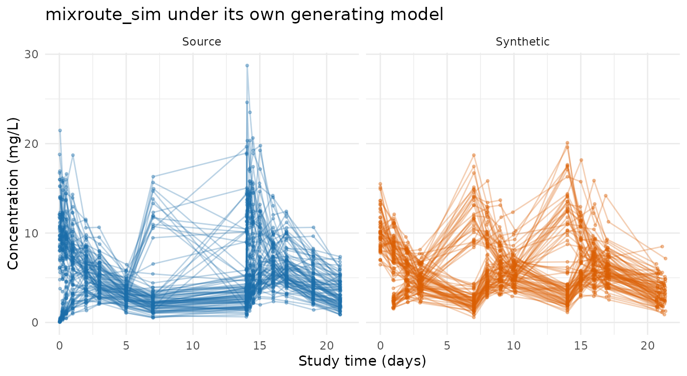
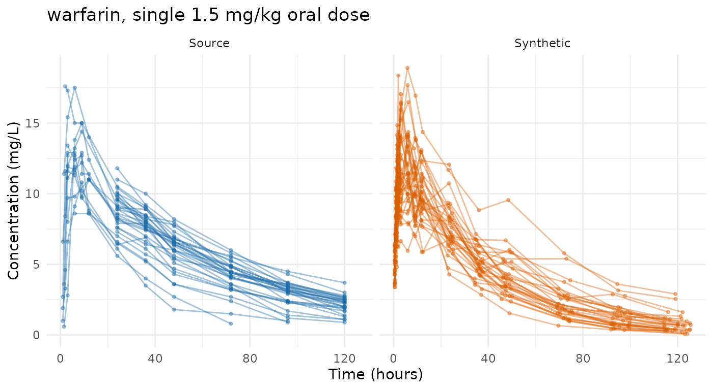
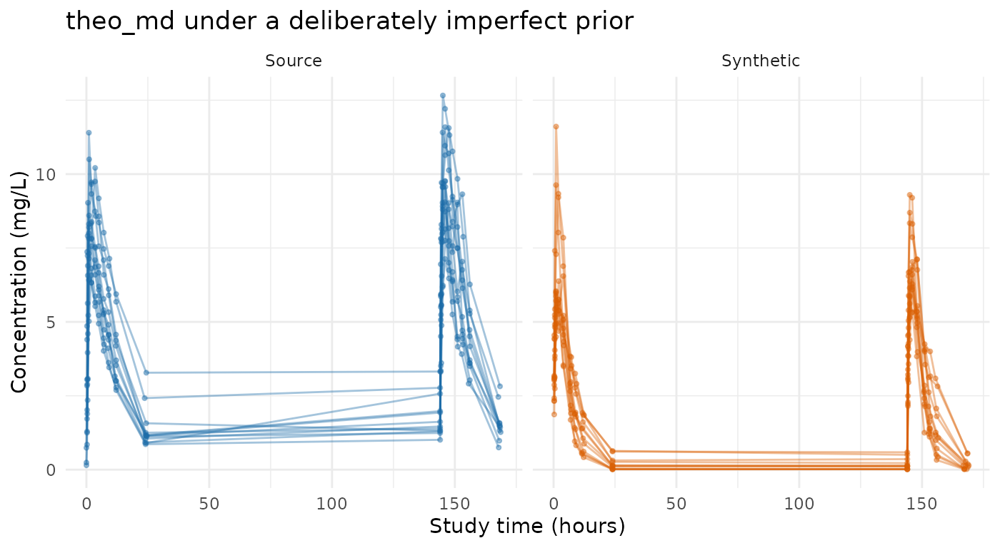
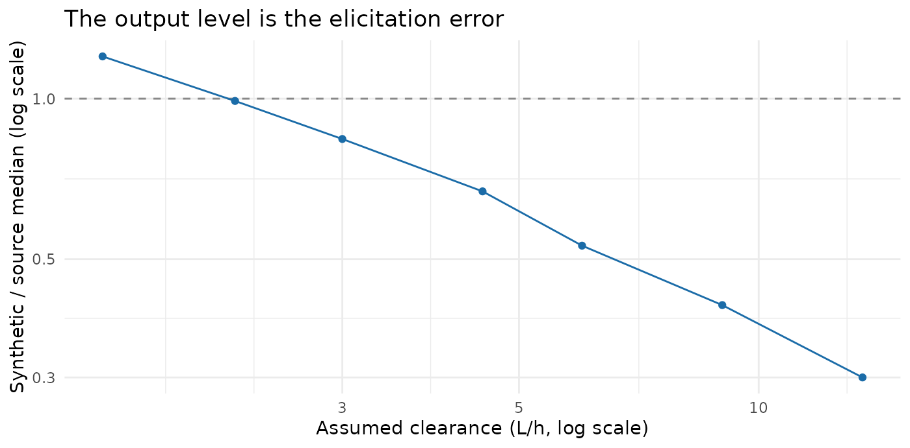

# Evaluating prior-only generation on public data

[`synpmx_prior()`](https://iamstein.github.io/synpmx/reference/synpmx_prior.md)
reads no data, so this article measures something different from the
other three surveys. There, a poor comparison is the generator’s fault.
Here every mismatch is the asserted model’s fault, and the number that
matters is how far the output sits from the study the model was meant to
describe.

**Read this as a measurement of elicitation, not of an algorithm.** The
generator has no parameters to tune and nothing to learn. Ask it for a
study under a correct model and it produces one; ask under a model that
is twice wrong and it produces something twice wrong, quietly and
without complaint. The three runs below span that — the model that
generated a study, an untuned guess from general pharmacology, and a
clearance three times too fast — and the sensitivity section puts a
number on the slope between them.

``` r

data("theo_md", package = "nlmixr2data")
data("warfarin", package = "nlmixr2data")
theo_md <- as.data.frame(theo_md)
warfarin <- as.data.frame(warfarin)
mixroute <- as.data.frame(mixroute_sim)
```

## Which studies this mode can be pointed at

The other surveys run their generator across every public study in the
package’s collection. This one runs three, and the reason is worth being
precise about, because it is easy to state wrongly.

It is **not** a provenance problem. Trial-level realized design — the
dose levels, the cohort sizes, the sampling schedule — is [treated as
public throughout this
package](https://iamstein.github.io/synpmx/articles/data-elicitation.html),
because it is routinely published, because inferring anything about an
individual from it is many-to-one and confounded, and because it is a
property of the study rather than of a person. So reading a regimen off
the data and declaring it is legitimate, and it is what the three
examples below do. Record where it came from in the design’s `source`
and move on.

The constraint is narrower:
[`pmx_trial_design()`](https://iamstein.github.io/synpmx/reference/pmx_trial_design.md)
has a fixed grammar, and some of these studies did things it has no way
to say.

| Dataset | What the design grammar cannot state |
|----|----|
| `theo_md` | — |
| `mixroute_sim` | Two administration routes; the mixed-route forms are refused because a design cannot say which dose went by which route |
| `warfarin` | Dosing in mg/kg — `dose_levels` takes absolute amounts, so a weight-based regimen becomes one typical dose |
| `pheno_sd`, `wbcSim` | The same mg/kg limitation, over irregular per-subject schedules |
| `mavoglurant`, `nimoData` | An infusion rate per subject; `duration` is one number for the whole design |
| `case1_pkpd`, `mad` | A placebo arm, since `dose_levels` must be positive, and samples at negative nominal times before the first dose |
| `mad` | Four of its five endpoints: ordinal, count and binary have no form |
| `onc_sim` | Dosing compressed into `ADDL`/`II`, and an ODE tumour model |

Only the last row is different in kind. `onc_sim`’s dose changes
*within* a patient because of that patient’s own response, and [an
individual’s dose trajectory is that individual’s
outcome](https://iamstein.github.io/synpmx/articles/data-elicitation.html)
rather than a trial-level fact — so that one is a genuine per-subject
disclosure question and not merely a gap in the grammar.

Everything above it is approximable. A weight-based regimen can be
declared as a typical dose, an infusion rate as a typical rate, an
active-arm-only study by dropping placebo. The three worked below are
the ones where the approximation is small enough that what remains under
test is the asserted *model* rather than the asserted design. Adding
another means saying which approximation was made and accepting that its
cost is mixed into the result.

## Shared workflow

All three examples follow the same five steps:

1.  declare the column meanings with
    [`pmx_roles()`](https://iamstein.github.io/synpmx/reference/pmx_roles.md),
    which for this mode names the schema to generate **into** rather
    than one to read;
2.  state the public model and design, with where each came from;
3.  generate with
    [`synpmx_prior()`](https://iamstein.github.io/synpmx/reference/synpmx_prior.md);
4.  plot the real and synthetic observations together;
5.  report the scorecard and the ratio of median concentrations.

`synpmx_scorecard_datatable(card, report = "minimal")` prints the tally
and only the rows that are not a pass, which is the same call the other
surveys use. Five rows read `not applicable` on every card below, for
two different reasons. **B1a**, **B1b** and **C2** read a run record
that
[`synpmx_avatar()`](https://iamstein.github.io/synpmx/reference/synpmx_avatar.md)
writes and this generator does not. **E1** and **E2** ask whether a
fitted model’s parameters moved off their starting values and whether
its between-subject terms were estimated — questions for
[`synpmx_model()`](https://iamstein.github.io/synpmx/reference/synpmx_model.md),
and this mode fits nothing. Both are limitations of those rows on this
generator rather than properties of either dataset, and they read the
same on both cards.

Note which questions are *not* marked inapplicable. **B4a** and **B4b**
ask directly whether a generated time vector or value vector copies an
exposed real one, and both are scored here as on any other card. Both
pass at zero, which is the answer a mode that reads nothing has to give
— and a card that skipped the question could not have shown it.

``` r

# Observation rows only, source beside synthetic, on a shared axis.
observed <- function(data, roles, label) {
  keep <- data[[roles$evid]] == 0
  value <- suppressWarnings(as.numeric(data[[roles$dv]][keep]))
  data.frame(
    set = label,
    subject = paste(label, data[[roles$id]][keep]),
    time = suppressWarnings(as.numeric(data[[roles$time]][keep])),
    dv = value
  )[is.finite(value) & value > 0, ]
}

# The number this article is about: where the asserted model put the level,
# against where the study has it.
level_ratio <- function(source, synthetic, roles) {
  med <- function(d) {
    v <- suppressWarnings(as.numeric(d[[roles$dv]][d[[roles$evid]] == 0]))
    stats::median(v[is.finite(v) & v > 0])
  }
  c(source = med(source), synthetic = med(synthetic),
    ratio = med(synthetic) / med(source))
}
```

## mixroute_sim: the model that generated it is public

This fixture’s own documentation states the parameters it was simulated
from — clearance 2 L/day, volume 10 L, absorption 0.5 /day and
bioavailability 0.7, with clearance and volume scaled allometrically on
weight. Handing those back as the public model is the best case this
mode can have: the prior is not an estimate or a guess, it is the truth,
and whatever gap remains is the part of the truth the catalogue cannot
hold.

Three things it cannot hold here. The allometric scaling, because no
covariate reaches a parameter. The bioavailability, because `1cmt_oral`
has no `f` and the mixed form that does is refused for a public design.
And the three arms, because one asserted model covers one route.

``` r

mixroute_roles <- pmx_roles(
  id = "ID", time = "TIME", nominal_time = "NTIME", dv = "DV", amt = "AMT",
  evid = "EVID", cmt = "CMT", cens = "CENS", covariates = "WT"
)
mixroute_model <- pmx_structural_model(
  pk = "1cmt_oral", typical = c(cl = 2, v = 10, ka = 0.5),
  source = "the documented generating truth of the mixroute_sim fixture"
)
mixroute_design <- pmx_trial_design(
  dose_levels = 100, cohort_sizes = 90, sampling = c(0, 1, 2, 3, 7),
  n_doses = 3, dose_interval = 7,
  source = "the fixture's protocol: 100 mg on days 0, 7 and 14"
)
mixroute_covariates <- pmx_covariates(WT = pmx_covariate(
  range = c(40, 130), median = 72, cv = 0.17,
  source = "the fixture's documented weight distribution"
))
mixroute_syn <- synpmx_prior(
  mixroute_model, mixroute_design, mixroute_roles,
  n_subjects = 90, seed = 1, covariates = mixroute_covariates
)
```

``` r

frame <- rbind(observed(mixroute, mixroute_roles, "Source"),
               observed(mixroute_syn, mixroute_roles, "Synthetic"))
ggplot2::ggplot(frame, ggplot2::aes(time, dv, group = subject, colour = set)) +
  ggplot2::geom_line(alpha = 0.3) +
  ggplot2::geom_point(alpha = 0.35, size = 0.7) +
  ggplot2::facet_wrap(~ set) +
  ggplot2::scale_colour_manual(values = comparison_colours, guide = "none") +
  ggplot2::labs(x = "Study time (days)", y = "Concentration (mg/L)",
                title = "mixroute_sim under its own generating model") +
  ggplot2::theme_minimal()
```



``` r

round(level_ratio(mixroute, mixroute_syn, mixroute_roles), 3)
#>    source synthetic     ratio 
#>     4.683     5.848     1.249
```

``` r

synpmx_scorecard_datatable(
  synpmx_scorecard(mixroute, mixroute_syn, mixroute_roles), report = "minimal"
)
```

The median sits within about a quarter of the study’s, which flatters
it. The figure shows why, and so does the scorecard’s one substantive
review row: the synthetic profiles are tighter than the real ones. One
asserted model gives every subject the same route, and the route is what
separates this study’s arms.

``` r

spread <- function(data) {
  v <- suppressWarnings(as.numeric(data$DV[data$EVID == 0]))
  v <- v[is.finite(v) & v > 0]
  c(median = stats::median(v), sd = stats::sd(v),
    p90 = stats::quantile(v, 0.9, names = FALSE))
}
by_arm <- tapply(mixroute$DV[mixroute$EVID == 0],
                 mixroute$ARM[mixroute$EVID == 0],
                 function(v) stats::median(v, na.rm = TRUE))
round(by_arm, 2)
#>    IV only IV then SC    SC only 
#>       8.19       4.47       3.26
round(rbind(source = spread(mixroute), synthetic = spread(mixroute_syn)), 2)
#>           median   sd   p90
#> source      4.68 3.95 11.32
#> synthetic   5.85 2.27  8.97
```

The three arms sit a factor of two and a half apart, because an
intravenous dose is all of the dose and a subcutaneous one is seventy
per cent of it. The synthetic cohort lands between them — it is the
average of arms it has no way to tell apart — and its spread is roughly
half the study’s, the missing part being that between-arm separation
plus the allometric scaling on weight that no covariate can reach.

**This is the ceiling, and it is worth being precise about what it is a
ceiling on.** Handed the model that generated the data, this mode
reproduces the event structure exactly, the central level to within a
quarter, and the dispersion to about a half. Nothing a better prior
could fix remains: what is left out is what the catalogue cannot say.

## warfarin: a regimen read off the data, and a prior from drug properties

A single oral dose, sampled to 120 hours, with the PK endpoint taken on
its own — the PD endpoint is a turnover model the catalogue has no form
for. The regimen is regular enough to state exactly:

``` r

warfarin_pk <- warfarin[warfarin$dvid == "cp", ]
per_subject <- !duplicated(warfarin$id)
round(range(warfarin$amt[warfarin$amt > 0] /
              warfarin$wt[warfarin$amt > 0]), 3)
#> [1] 1.499 1.501
round(stats::median(warfarin$wt[per_subject]), 1)
#> [1] 71.7
```

Every subject received 1.5 mg/kg, and the 60 to 153 mg spread in the
recorded amounts is entirely weight. That regimen is the trial-level
fact this package treats as public, so it goes straight into the design
— except that `dose_levels` takes absolute amounts, so it becomes one
typical dose for a subject of the median weight.

``` r

warfarin_roles <- pmx_roles(
  id = "id", time = "time", dv = "dv", amt = "amt", evid = "evid",
  dvid = "dvid"
)
warfarin_model <- pmx_structural_model(
  pk = "1cmt_oral", typical = c(cl = 0.2, v = 8, ka = 1),
  source = paste("illustrative: warfarin is a low-clearance drug with a long",
                 "half-life and a small volume of distribution")
)
warfarin_design <- pmx_trial_design(
  dose_levels = 107, cohort_sizes = 32,
  sampling = sort(unique(warfarin_pk$time[warfarin_pk$evid == 0])),
  n_doses = 1,
  source = "1.5 mg/kg single oral dose, at the cohort's median weight"
)
warfarin_syn <- synpmx_prior(warfarin_model, warfarin_design, warfarin_roles,
                             n_subjects = 32, seed = 1)
```

Nothing was fitted and nothing was tuned. The three parameters are round
numbers from what is generally known about the drug: clearance well
under a litre an hour, a volume close to plasma volume, and absorption
fast relative to elimination.

``` r

frame <- rbind(observed(warfarin_pk, warfarin_roles, "Source"),
               observed(warfarin_syn, warfarin_roles, "Synthetic"))
ggplot2::ggplot(frame, ggplot2::aes(time, dv, group = subject, colour = set)) +
  ggplot2::geom_line(alpha = 0.4) +
  ggplot2::geom_point(alpha = 0.4, size = 0.8) +
  ggplot2::facet_wrap(~ set) +
  ggplot2::scale_colour_manual(values = comparison_colours, guide = "none") +
  ggplot2::labs(x = "Time (hours)", y = "Concentration (mg/L)",
                title = "warfarin, single 1.5 mg/kg oral dose") +
  ggplot2::theme_minimal()
```



``` r

round(level_ratio(warfarin_pk, warfarin_syn, warfarin_roles), 3)
#>    source synthetic     ratio 
#>     6.300     7.034     1.116
```

``` r

synpmx_scorecard_datatable(
  synpmx_scorecard(warfarin_pk, warfarin_syn, warfarin_roles),
  report = "minimal"
)
```

An untuned prior from general pharmacology lands within a tenth or so of
the study’s level. That is the case worth holding against the one below:
this mode is not inaccurate by construction, it is exactly as accurate
as what was asserted.

One difference the level ratio does not show. The design declares one
sampling schedule and every generated subject gets all of it, while the
real study sampled some subjects more sparsely than others:

``` r

c(source = round(mean(table(warfarin_pk$id[warfarin_pk$evid == 0])), 1),
  synthetic = round(mean(table(warfarin_syn$id[warfarin_syn$evid == 0])), 1))
#>    source synthetic 
#>       7.8      14.0
```

A study with per-subject sampling variation comes back denser than it
was, which the scorecard’s observations-per-patient row is what notices.

## theo_md: an illustrative prior, and what being wrong costs

Nothing published was used here. The model is the one the methods
article uses for the same study — round numbers from allometric scaling,
never fitted to `theo_md` — and its clearance is deliberately too fast.

``` r

theo_roles <- pmx_roles(
  id = "ID", time = "TIME", dv = "DV", amt = "AMT", evid = "EVID",
  cmt = "CMT", covariates = "WT"
)
theo_model <- pmx_structural_model(
  pk = "1cmt_oral", typical = c(cl = 6, v = 35, ka = 1.5),
  source = "illustrative allometric scaling; never fitted to theo_md"
)
rich <- c(0, 0.25, 0.5, 1, 2, 4, 7, 9, 12, 24)
theo_design <- pmx_trial_design(
  dose_levels = 320, cohort_sizes = 12,
  sampling = list(rich, 0, NULL, NULL, NULL, NULL, rich),
  n_doses = 7, dose_interval = 24,
  source = "illustrative protocol: 320 mg daily, sampled on days 1 and 7"
)
theo_covariates <- pmx_covariates(WT = pmx_covariate(
  range = c(40, 130), median = 70, cv = 0.15,
  source = "illustrative; a healthy-volunteer cohort"
))
theo_syn <- synpmx_prior(theo_model, theo_design, theo_roles,
                         n_subjects = 12, seed = 1,
                         covariates = theo_covariates)
```

``` r

frame <- rbind(observed(theo_md, theo_roles, "Source"),
               observed(theo_syn, theo_roles, "Synthetic"))
ggplot2::ggplot(frame, ggplot2::aes(time, dv, group = subject, colour = set)) +
  ggplot2::geom_line(alpha = 0.4) +
  ggplot2::geom_point(alpha = 0.4, size = 0.8) +
  ggplot2::facet_wrap(~ set) +
  ggplot2::scale_colour_manual(values = comparison_colours, guide = "none") +
  ggplot2::labs(x = "Study time (hours)", y = "Concentration (mg/L)",
                title = "theo_md under a deliberately imperfect prior") +
  ggplot2::theme_minimal()
```



``` r

round(level_ratio(theo_md, theo_syn, theo_roles), 3)
#>    source synthetic     ratio 
#>     5.890     3.149     0.535
```

``` r

synpmx_scorecard_datatable(
  synpmx_scorecard(theo_md, theo_syn, theo_roles), report = "minimal"
)
```

The concentrations run low, by about half. The event structure, the
sampling schedule, the occasions and the censoring flag are all correct;
only the level is wrong, and it is wrong because the clearance assumed
was wrong. The scorecard is the same shape as the run above, which is
the point worth noticing about the scorecard here: it reads structure,
and structure is what this mode gets right whatever the parameters say.

## How wrong can the prior be

The runs above span the answer at three points. This sweep fills it in,
holding everything but the assumed clearance fixed and reading off the
level each one produces.

``` r

sweep <- do.call(rbind, lapply(c(1.5, 2.2, 3, 4.5, 6, 9, 13.5), function(cl) {
  model <- pmx_structural_model(
    pk = "1cmt_oral", typical = c(cl = cl, v = 35, ka = 1.5),
    source = "illustrative sweep"
  )
  syn <- synpmx_prior(model, theo_design, theo_roles, n_subjects = 12,
                      seed = 1, covariates = theo_covariates)
  level <- level_ratio(theo_md, syn, theo_roles)
  data.frame(assumed_cl = cl, synthetic_median = round(level[["synthetic"]], 2),
             ratio_to_source = round(level[["ratio"]], 2))
}))
knitr::kable(sweep, row.names = FALSE,
             caption = "Assumed clearance against the level it produces")
```

| assumed_cl | synthetic_median | ratio_to_source |
|-----------:|-----------------:|----------------:|
|        1.5 |             7.05 |            1.20 |
|        2.2 |             5.84 |            0.99 |
|        3.0 |             4.94 |            0.84 |
|        4.5 |             3.96 |            0.67 |
|        6.0 |             3.15 |            0.53 |
|        9.0 |             2.44 |            0.41 |
|       13.5 |             1.79 |            0.30 |

Assumed clearance against the level it produces {.table}

``` r

ggplot2::ggplot(sweep, ggplot2::aes(assumed_cl, ratio_to_source)) +
  ggplot2::geom_hline(yintercept = 1, linetype = "dashed",
                      colour = "#888888") +
  ggplot2::geom_line(colour = "#1B6CA8") +
  ggplot2::geom_point(colour = "#1B6CA8") +
  ggplot2::scale_x_log10() + ggplot2::scale_y_log10() +
  ggplot2::labs(x = "Assumed clearance (L/h, log scale)",
                y = "Synthetic / source median (log scale)",
                title = "The output level is the elicitation error") +
  ggplot2::theme_minimal()
```



Two things to take from this. The level the study actually sits at
corresponds to an assumed clearance of a little over 2 L/h, and the
illustrative model’s 6 is about three times that — hence the halved
concentrations.

And the slope is **shallower than one**. Clearance across this sweep
spans a factor of nine, and the resulting level spans a factor of four.
A profile sampled richly through absorption is not purely
clearance-determined: early concentrations are absorption-limited, so an
error in clearance is diluted in the median. That cuts both ways. A
prior wrong by a factor of two costs less than a factor of two in the
output, and a level that looks close is weaker evidence about the
clearance than it appears.

## What the three runs held

``` r

levels_tbl <- rbind(
  c(dataset = "mixroute_sim", prior = "the documented generating truth",
    round(level_ratio(mixroute, mixroute_syn, mixroute_roles), 2)),
  c(dataset = "warfarin", prior = "round numbers from drug properties",
    round(level_ratio(warfarin_pk, warfarin_syn, warfarin_roles), 2)),
  c(dataset = "theo_md", prior = "allometric scaling, clearance ~3x too fast",
    round(level_ratio(theo_md, theo_syn, theo_roles), 2))
)
knitr::kable(levels_tbl, row.names = FALSE,
             caption = "Median concentration, source against synthetic")
```

| dataset | prior | source | synthetic | ratio |
|:---|:---|:---|:---|:---|
| mixroute_sim | the documented generating truth | 4.68 | 5.85 | 1.25 |
| warfarin | round numbers from drug properties | 6.3 | 7.03 | 1.12 |
| theo_md | allometric scaling, clearance ~3x too fast | 5.89 | 3.15 | 0.53 |

Median concentration, source against synthetic {.table}

The three rows are a gradient in one thing only: how good the asserted
model was. The generating truth and an untuned guess from general
pharmacology both land close; a clearance three times too fast halves
the level. There is nothing else varying — the generator has no
parameters, reads nothing, and did the same work in all three cases.

No run failed a structural check, and all three produced the same
verdict profile, because nothing about the event table depends on the
parameters being right. That is the division this mode rests on: the
structure comes from the design and is reliable, the level comes from
the model and is exactly as reliable as the model.

## Where to go next

- [`vignette("prior-demo")`](https://iamstein.github.io/synpmx/articles/prior-demo.md)
  — one specification worked end to end, including the parts of it the
  generator cannot express.
- [`vignette("prior-algorithm")`](https://iamstein.github.io/synpmx/articles/prior-algorithm.md)
  — every step, and the full catalogue enumerated from the code.
- [Evaluating calibration on public
  data](https://iamstein.github.io/synpmx/articles/calibrated-public-data-examples.html)
  — the other formally private mode, measured the same way, and what a
  defensible epsilon buys at these cohort sizes.
- [The synpmx data generation
  algorithms](https://iamstein.github.io/synpmx/articles/synpmx-methods.html)
  — the other modes, and which one to use when.
