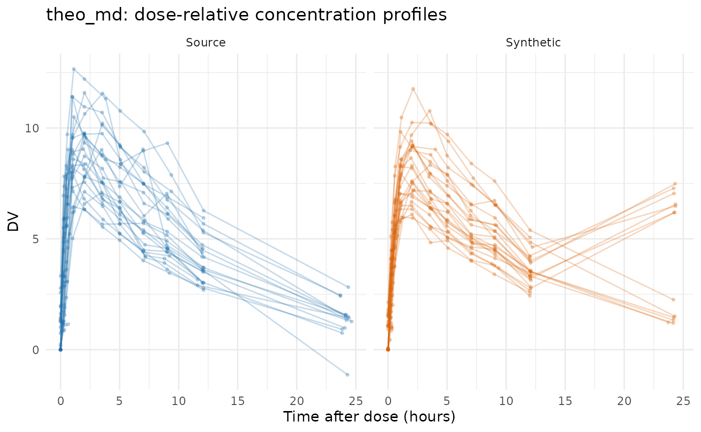
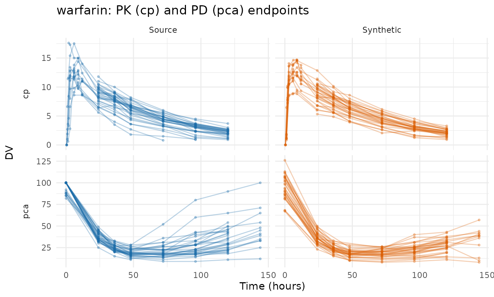
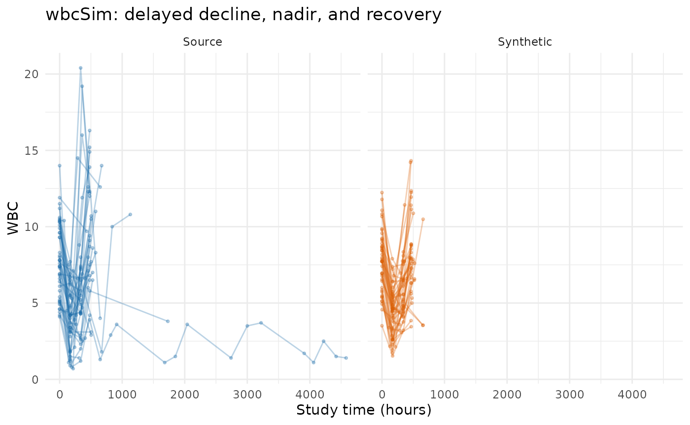
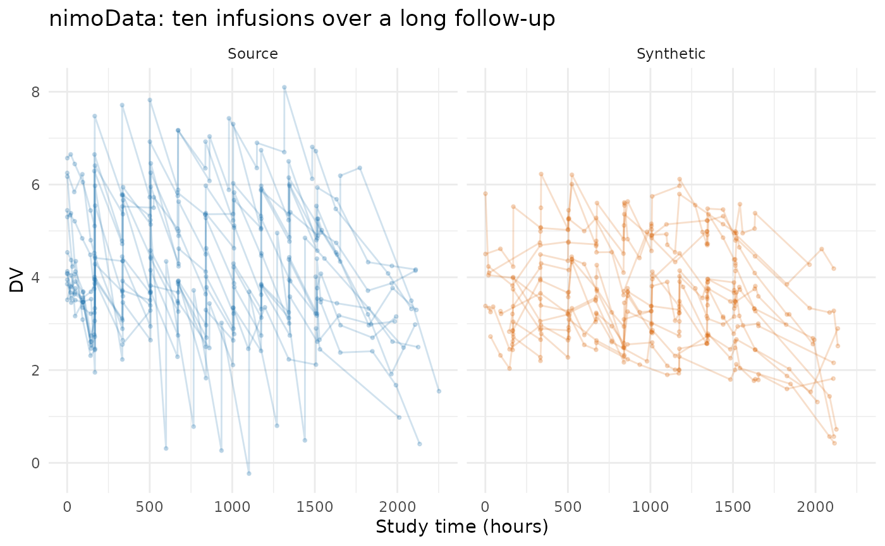
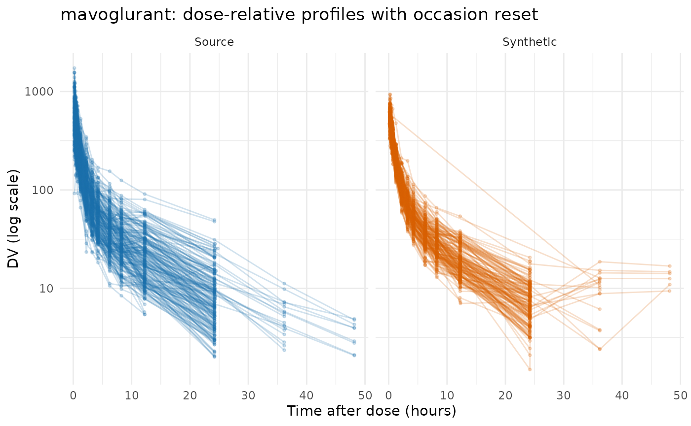
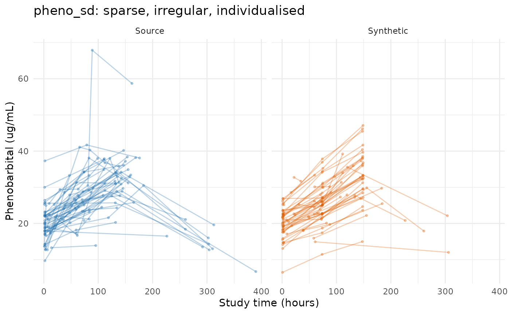
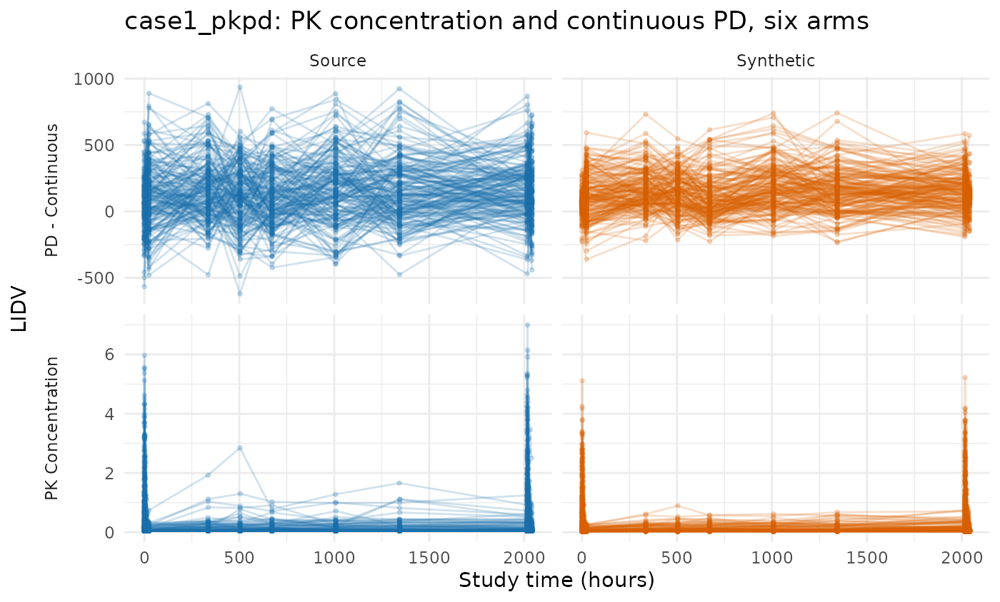
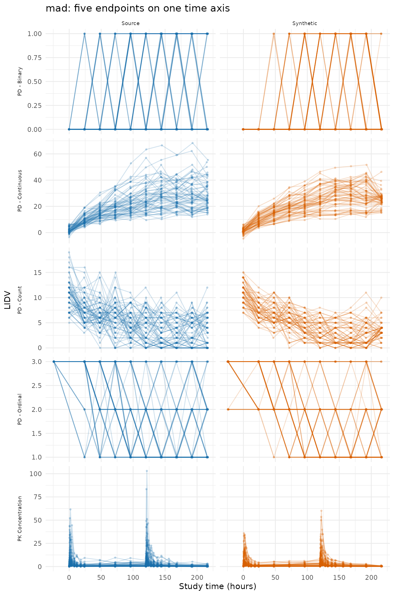

# Evaluating AVATAR on public data

This vignette compares eight source datasets against their synthetic
counterparts generated by
[`synpmx_avatar()`](https://iamstein.github.io/synpmx/reference/synpmx_avatar.md).

Plotting helpers used throughout this vignette

``` r

observed_plot_data <- function(data, roles, dataset,
                               clock = "study_time") {
  observed <- as.character(data[[roles$evid]]) %in% c("0", "0.0")
  if (!is.null(roles$mdv)) {
    observed <- observed & as.character(data[[roles$mdv]]) %in% c("0", "0.0")
  }
  observed <- observed & !is.na(data[[roles$dv]])
  observation_rows <- which(observed)
  occasion <- rep(1L, length(observation_rows))
  tad <- rep(NA_real_, length(observation_rows))
  if (!is.null(roles$occasion)) {
    declared <- suppressWarnings(as.integer(
      data[[roles$occasion]][observation_rows]
    ))
    valid <- !is.na(declared) & declared >= 1L
    occasion[valid] <- declared[valid]
  }
  if (!is.null(roles$tad)) {
    declared <- suppressWarnings(as.numeric(data[[roles$tad]][observation_rows]))
    valid <- is.finite(declared)
    tad[valid] <- pmax(0, declared[valid])
  }
  subject_values <- data[[roles$id]]
  for (id in unique(subject_values[observation_rows])) {
    subject_rows <- which(!is.na(subject_values) & subject_values == id)
    events <- !(as.character(data[[roles$evid]][subject_rows]) %in%
                  c("0", "0.0"))
    if (!is.null(roles$amt)) {
      events <- events & as.numeric(data[[roles$amt]][subject_rows]) > 0
    }
    positions <- which(subject_values[observation_rows] == id)
    event_rows <- subject_rows[events]
    if (length(event_rows) && !is.null(roles$occasion)) {
      event_occasion <- suppressWarnings(as.integer(
        data[[roles$occasion]][event_rows]
      ))
      for (position in positions) {
        candidates <- event_rows[event_occasion == occasion[position]]
        if (length(candidates) && !is.finite(tad[position])) {
          origin <- min(as.numeric(data[[roles$time]][candidates]))
          tad[position] <-
            as.numeric(data[[roles$time]][observation_rows[position]]) - origin
        }
      }
    } else if (length(event_rows)) {
      dose_times <- sort(unique(as.numeric(data[[roles$time]][event_rows])))
      occasion[positions] <- pmax(1L, findInterval(
        as.numeric(data[[roles$time]][observation_rows[positions]]),
        dose_times
      ))
      occasion[positions] <- pmin(occasion[positions], length(dose_times))
      tad[positions] <-
        as.numeric(data[[roles$time]][observation_rows[positions]]) -
        dose_times[occasion[positions]]
    }
  }
  plotted_time <- if (identical(clock, "tad")) tad else
    as.numeric(data[[roles$time]][observation_rows])
  data.frame(
    dataset = factor(dataset, levels = c("Source", "Synthetic")),
    subject = as.character(data[[roles$id]][observation_rows]),
    time = plotted_time,
    dv = as.numeric(data[[roles$dv]][observation_rows]),
    occasion = occasion,
    endpoint = if (is.null(roles$dvid)) "DV" else
      as.character(data[[roles$dvid]][observation_rows]),
    stringsAsFactors = FALSE
  )
}

# Every dataset below gets the same figure: observation rows only, source beside
# synthetic on a shared y axis, one row per endpoint. `clock = "tad"` plots time
# after dose instead of study time, which is the readable view once a study
# doses more than once.
overlay_plot <- function(source, synthetic, roles, title,
                         clock = "study_time",
                         x_label = "Study time (hours)", y_label = "DV",
                         log_y = FALSE, alpha = 0.3) {
  plotted <- rbind(
    observed_plot_data(source, roles, "Source", clock),
    observed_plot_data(synthetic, roles, "Synthetic", clock)
  )
  # One line per patient on a study-time axis, and one line per occasion on a
  # dose-relative one, where the profiles are meant to lie on top of each other.
  plotted$series <- if (identical(clock, "tad")) {
    interaction(plotted$dataset, plotted$subject, plotted$occasion)
  } else {
    interaction(plotted$dataset, plotted$subject)
  }
  figure <- ggplot2::ggplot(
    plotted,
    ggplot2::aes(time, dv, group = series, colour = dataset)
  ) +
    ggplot2::geom_line(alpha = alpha) +
    ggplot2::geom_point(alpha = alpha, size = 0.7) +
    # Endpoint down the side, source and synthetic across. `facet_grid()` frees
    # a scale per ROW, so this orientation is the one that gives each endpoint
    # its own y while holding source and synthetic on a shared one -- which is
    # the only arrangement the eye can compare. The transpose does the opposite
    # on both counts: it lets the two panels drift onto different axes, and it
    # squeezes every endpoint onto one, so a PK concentration reading single
    # digits flattens to a line next to a PD score in the hundreds.
    #
    # A single-endpoint study needs no row strip; it would print the endpoint's
    # name down the side of the only row, beside the axis title already naming
    # the same thing.
    (if (length(unique(plotted$endpoint)) > 1L) {
      ggplot2::facet_grid(endpoint ~ dataset, scales = "free_y",
                          switch = "y")
    } else {
      ggplot2::facet_wrap(~dataset)
    }) +
    ggplot2::scale_colour_manual(values = comparison_colours) +
    ggplot2::labs(x = x_label, y = y_label, colour = "Dataset", title = title) +
    ggplot2::theme_minimal() +
    ggplot2::theme(legend.position = "none",
                   strip.placement = "outside")
  if (isTRUE(log_y)) figure + ggplot2::scale_y_log10() else figure
}

# Facet rows are endpoints now, so a five-endpoint study needs five times the
# height a one-endpoint study does. Chunks pass this to `fig.height` rather than
# every figure inheriting the one-endpoint default and arriving unreadable.
overlay_height <- function(data, roles, per_endpoint = 2.2, minimum = 3.4) {
  observed <- as.character(data[[roles$evid]]) %in% c("0", "0.0")
  endpoints <- if (is.null(roles$dvid)) 1L else {
    length(unique(data[[roles$dvid]][observed]))
  }
  max(minimum, per_endpoint * endpoints)
}

# The full masking accounting for one run. `pmx_masking_report()` owns the row
# labels and the explanation next to each one, so this vignette and the study
# reports under `scripts_private/` cannot drift apart; only the caption is local.
masking_table <- function(source, roles, synthetic, label) {
  knitr::kable(
    as.data.frame(pmx_masking_report(synthetic, source, roles)),
    row.names = FALSE, align = c("l", "r", "l"),
    caption = paste0("Everything ", label,
                     "'s run removed, and what was left to build on.")
  )
}
```

## The datasets

Every dataset here is public package data from `nlmixr2data` or `xgxr`,
both `Suggests` of this package.

| Dataset | Package | Patients | Rows | Endpoints | What it is here to exercise |
|----|----|----|----|----|----|
| `theo_md` | nlmixr2data | 12 | 348 | 1 | Seven Q24H oral doses with dense profiles on occasions 1 and 7 only. Dosed by weight. |
| `warfarin` | nlmixr2data | 32 | 515 | 2 | One dose, PK and PD running on different time courses, categorical covariates |
| `wbcSim` | nlmixr2data | 45 | 280 | 1 | Infusion start/stop pairs and a delayed WBC response. Follow-up time varies. |
| `nimoData` | nlmixr2data | 12 | 441 | 1 | Ten roughly weekly infusions. |
| `mavoglurant` | nlmixr2data | 120 | 2678 | 1 | One- and two-period crossover, `TIME` resetting within `OCC`, an occasion-varying assigned dose, infusion rows. |
| `pheno_sd` | nlmixr2data | 59 | 744 | 1 | Neonatal phenobarbital, individualised dosing, sparse irregular sampling, time-varying weight. |
| `case1_pkpd` | xgxr | 180 | 20820 | 2 | A PK and PD measure with nominal time coarsening. |
| `mad` | xgxr | 60 | 4160 | 5 | Multiple ascending dose carrying ordinal, count and binary PD alongside continuous PD and PK. |

**None of these datasets uses steady state, `ADDL`, or `II`.** Every
dose is written out as its own row, so the handling of compressed dose
records is exercised by the package’s tests rather than by anything
below.

## Shared workflow

Every example follows the same five steps:

1.  declare column meanings with
    [`pmx_roles()`](https://iamstein.github.io/synpmx/reference/pmx_roles.md);
2.  synthesize with
    [`synpmx_avatar()`](https://iamstein.github.io/synpmx/reference/synpmx_avatar.md);
3.  plot the real and synthetic data;
4.  summarize observations (DV) and covariate statistics
5.  report the score card for the synthetic dataset.

The scorecard marks each check `pass`, `FAIL`, or `review`. A `review`
row is one where the pharmacometrician could evaluate whether the output
is acceptable for use. If the synthetic dataset will not be crossing a
trust boundary, items marked `review` are acceptable.

Two of the eight datasets fail, both on the same check, and both
sections say why. The runs below are quiet:
[`synpmx_avatar()`](https://iamstein.github.io/synpmx/reference/synpmx_avatar.md)
prints an alert for every exposure it could not remove, and eighteen of
those blocks would say what the scorecard and
[`pmx_masking_report()`](https://iamstein.github.io/synpmx/reference/pmx_masking_report.md)
say here in tables.

## theo_md: seven oral doses, dosed by weight

Twelve subjects on one oral regimen, seven doses 24 hours apart, with
dense concentration sampling around the first and last dose only.

``` r

data("theo_md", package = "nlmixr2data")
theo_roles <- pmx_roles(
  id = "ID", time = "TIME", dv = "DV", amt = "AMT",
  evid = "EVID", cmt = "CMT", covariates = "WT"
)
theo_synth <- suppressWarnings(synpmx_avatar(theo_md, theo_roles, seed = 303))
```



``` r

compare_pmx_distributions(theo_md, theo_synth, theo_roles)
```

| variable | dataset   |   n | n_subjects | mean |   sd |   min |  q25 | median |  q75 |  max |
|:---------|:----------|----:|-----------:|-----:|-----:|------:|-----:|-------:|-----:|-----:|
| DV       | source    | 264 |         12 | 5.53 |    3 | -1.13 |  3.3 |   5.74 |  7.8 | 12.7 |
| DV       | synthetic | 264 |         12 | 5.18 | 2.57 |     0 | 3.56 |   5.37 | 6.82 | 11.8 |

RESTRICTED – endpoints (dependent variable on observation rows) {.table
style="width:100%;"}

| variable | dataset   |   n | mean |   sd |  min |  q25 | median |  q75 |  max |
|:---------|:----------|----:|-----:|-----:|-----:|-----:|-------:|-----:|-----:|
| WT       | source    |  12 | 69.6 |  9.5 | 54.6 | 63.6 |   70.5 | 74.4 | 86.4 |
| WT       | synthetic |  12 | 68.5 | 5.18 | 58.2 | 65.5 |   69.7 | 71.7 | 77.1 |

RESTRICTED – continuous covariates (baseline, per patient) {.table}

``` r

synpmx_scorecard(theo_md, theo_synth, theo_roles)
```

| check | question | reads | result | verdict | explore |
|:---|:---|:---|:---|:---|:---|
| A1 | Synthetic table is a legal PMX dataset | synthetic | TRUE | pass | validate_pmx(synthetic, roles) |
| A2 | Source is legal under the declared roles | source | TRUE | pass | validate_pmx(source, roles, strict = FALSE) |
| A3 | Every endpoint survived | both | 1 of 1 | pass | compare_pmx_distributions(source, synthetic, roles) |
| A4 | Cohort size survived | both | 12 -\> 12 | pass | pmx_masking_report(synthetic, source, roles) |
| A5 | Observations per patient | both | 22 -\> 22 | review | compare_pmx_distributions(source, synthetic, roles) |
| A5 | Doses per patient | both | 7 -\> 7 | review | pmx_masking_report(synthetic, source, roles) |
| B1a | Avatars wearing a visit set nobody else shares | run settings | 0 | pass | plot_pmx_schedule(source, roles) |
| B1b | Avatars wearing a dose schedule nobody else shares | run settings | 0 | pass | skeleton_uniqueness(source, roles, coarsen_time = TRUE) |
| B2 | Synthetic patients unusual within their stratum | synthetic | 3 of 12 | review | flag_identifiable_subjects(synthetic, roles) |
| B3 | Adversarial accuracy inside its null interval | both | 0.500 in \[0.167, 0.750\] | review | compare_pmx_proximity(source, synthetic, roles) |
| B4a | Generated time vectors copying an exposed real one | both | 0 | pass | skeleton_uniqueness(source, roles, coarsen_time = TRUE) |
| B4b | Generated DV vectors copying an exposed real one | both | 0 | pass | compare_pmx_proximity(source, synthetic, roles) |
| C4 | Distinct dose-time schedules represented | both | 1 of 1 | pass | pmx_masking_report(synthetic, source, roles) |

Nothing fails. Twelve subjects on one dense protocol leave an obvious
visit grid to find, so coarsening takes the twelve unique observation
schedules to zero without a declared `nominal_time`, and the three visit
sets that remain are each held by several subjects.

## warfarin: two endpoints on different time courses

32 subjects, a single dose, a pharmacokinetic endpoint (`cp`) and a
pharmacodynamic one (`pca`) that run on different time courses, and a
lower-case schema with one categorical covariate.

``` r

data("warfarin", package = "nlmixr2data")
warfarin_roles <- pmx_roles(
  id = "id", time = "time", dv = "dv", amt = "amt", evid = "evid",
  dvid = "dvid", covariates = c("wt", "age", "sex"),
  dose_covariate = "wt"   # 1.5 mg/kg; say so rather than let it be inferred
)
warfarin_synth <- suppressWarnings(
  synpmx_avatar(warfarin, warfarin_roles, seed = 404)
)
```



``` r

compare_pmx_distributions(warfarin, warfarin_synth, warfarin_roles)
```

| variable | dataset   |   n | n_subjects | mean |   sd | min |  q25 | median |  q75 |  max |
|:---------|:----------|----:|-----------:|-----:|-----:|----:|-----:|-------:|-----:|-----:|
| cp       | source    | 251 |         32 | 6.41 | 3.82 |   0 |  3.2 |    6.1 |  8.9 | 17.6 |
| cp       | synthetic | 258 |         32 | 6.67 | 3.86 |   0 | 3.12 |   6.44 | 9.67 | 14.7 |
| pca      | source    | 232 |         32 | 37.5 | 26.1 |   9 |   20 |     28 |   42 |  100 |
| pca      | synthetic | 224 |         32 | 34.4 | 25.8 |   8 | 19.8 |     25 |   37 |  126 |

RESTRICTED – endpoints (dependent variable on observation rows) {.table
style="width:100%;"}

| variable | dataset   |   n | mean |   sd |  min |  q25 | median |  q75 |  max |
|:---------|:----------|----:|-----:|-----:|-----:|-----:|-------:|-----:|-----:|
| wt       | source    |  32 |   70 | 12.7 |   40 | 61.5 |   71.6 | 78.5 |  102 |
| wt       | synthetic |  32 | 71.6 | 7.57 | 53.7 | 67.9 |   72.9 | 76.3 | 86.5 |
| age      | source    |  32 |   31 | 10.5 |   21 |   22 |   27.5 |   36 |   63 |
| age      | synthetic |  32 | 26.2 |  4.5 |   21 |   23 |   24.5 | 28.2 |   39 |

RESTRICTED – continuous covariates (baseline, per patient) {.table}

| variable | dataset   | level  |   n | proportion |
|:---------|:----------|:-------|----:|-----------:|
| sex      | source    | female |   5 |      0.156 |
| sex      | source    | male   |  27 |      0.844 |
| sex      | synthetic | female |   3 |     0.0938 |
| sex      | synthetic | male   |  29 |      0.906 |

RESTRICTED – categorical covariates (baseline, per patient) {.table}

``` r

synpmx_scorecard(warfarin, warfarin_synth, warfarin_roles)
```

| check | question | reads | result | verdict | explore |
|:---|:---|:---|:---|:---|:---|
| A1 | Synthetic table is a legal PMX dataset | synthetic | TRUE | pass | validate_pmx(synthetic, roles) |
| A2 | Source is legal under the declared roles | source | TRUE | pass | validate_pmx(source, roles, strict = FALSE) |
| A3 | Every endpoint survived | both | 2 of 2 | pass | compare_pmx_distributions(source, synthetic, roles) |
| A4 | Cohort size survived | both | 32 -\> 32 | pass | pmx_masking_report(synthetic, source, roles) |
| A5 | Observations per patient | both | 15.1 -\> 15.1 | review | compare_pmx_distributions(source, synthetic, roles) |
| A5 | Doses per patient | both | 1 -\> 1 | review | pmx_masking_report(synthetic, source, roles) |
| A6 | Discrete endpoints keeping their source scale | both | 1 of 1 | pass | pmx_endpoint_types(source, roles) |
| B1a | Avatars wearing a visit set nobody else shares | run settings | 0 | pass | plot_pmx_schedule(source, roles) |
| B1b | Avatars wearing a dose schedule nobody else shares | run settings | 0 | pass | skeleton_uniqueness(source, roles, coarsen_time = TRUE) |
| B2 | Synthetic patients unusual within their stratum | synthetic | 0 of 32 | review | flag_identifiable_subjects(synthetic, roles) |
| B3 | Adversarial accuracy inside its null interval | both | 0.438 in \[0.271, 0.712\] | review | compare_pmx_proximity(source, synthetic, roles) |
| B4a | Generated time vectors copying an exposed real one | both | 0 | pass | skeleton_uniqueness(source, roles, coarsen_time = TRUE) |
| B4b | Generated DV vectors copying an exposed real one | both | 0 | pass | compare_pmx_proximity(source, synthetic, roles) |
| B5a | Patients holding the least-held categorical level | synthetic | sex = female: 3 | pass | table(synthetic\$sex) |
| B5b | Rare source levels copied into the output | both | 0 of 0 exposed | pass | compare_pmx_rare_levels(source, synthetic, roles) |
| C4 | Distinct dose-time schedules represented | both | 1 of 1 | pass | pmx_masking_report(synthetic, source, roles) |

Nothing fails. Warfarin is dosed at 1.5 mg/kg to within 0.1%, so `wt` is
declared as the `dose_covariate` and each avatar’s `amt` is rebuilt from
its own blended weight rather than copied from its anchor’s. The ratio
here is tight enough that inference would have found it unaided, but
declaring it is the habit worth having: inference fails closed, and a
copied amount under weight-based dosing discloses one real patient’s
weight exactly.

## wbcSim: infusions, and patients too extreme to build on

45 subjects with infusion start/stop pairs and a delayed
white-blood-cell decline, nadir and recovery. Follow-up time varies, and
a few subjects are followed far longer than the rest.

``` r

data("wbcSim", package = "nlmixr2data")
wbc_roles <- pmx_roles(
  id = "ID", time = "TIME", dv = "DV", amt = "AMT", evid = "EVID", cmt = "CMT"
)
wbc_synth <- suppressWarnings(synpmx_avatar(wbcSim, wbc_roles, seed = 505))
```



``` r

compare_pmx_distributions(wbcSim, wbc_synth, wbc_roles)
```

| variable | dataset   |   n | n_subjects | mean |   sd |  min |  q25 | median |  q75 |  max |
|:---------|:----------|----:|-----------:|-----:|-----:|-----:|-----:|-------:|-----:|-----:|
| DV       | source    | 176 |         45 | 6.43 | 3.83 |  0.7 | 3.68 |    5.8 | 8.38 | 20.4 |
| DV       | synthetic | 164 |         45 | 6.44 | 2.57 | 1.53 | 4.62 |   6.37 | 7.91 | 14.3 |

RESTRICTED – endpoints (dependent variable on observation rows) {.table}

``` r

synpmx_scorecard(wbcSim, wbc_synth, wbc_roles)
```

| check | question | reads | result | verdict | explore |
|:---|:---|:---|:---|:---|:---|
| A1 | Synthetic table is a legal PMX dataset | synthetic | TRUE | pass | validate_pmx(synthetic, roles) |
| A2 | Source is legal under the declared roles | source | TRUE | pass | validate_pmx(source, roles, strict = FALSE) |
| A3 | Every endpoint survived | both | 1 of 1 | pass | compare_pmx_distributions(source, synthetic, roles) |
| A4 | Cohort size survived | both | 45 -\> 45 | pass | pmx_masking_report(synthetic, source, roles) |
| A5 | Observations per patient | both | 3.9 -\> 3.6 | review | compare_pmx_distributions(source, synthetic, roles) |
| A5 | Doses per patient | both | 1.2 -\> 1 | review | pmx_masking_report(synthetic, source, roles) |
| B1a | Avatars wearing a visit set nobody else shares | run settings | 0 | pass | plot_pmx_schedule(source, roles) |
| B1b | Avatars wearing a dose schedule nobody else shares | run settings | 0 | pass | skeleton_uniqueness(source, roles, coarsen_time = TRUE) |
| B2 | Synthetic patients unusual within their stratum | synthetic | 16 of 45 | review | flag_identifiable_subjects(synthetic, roles) |
| B3 | Adversarial accuracy inside its null interval | both | 0.500 in \[0.318, 0.636\] | review | compare_pmx_proximity(source, synthetic, roles) |
| B4a | Generated time vectors copying an exposed real one | both | 0 | pass | skeleton_uniqueness(source, roles, coarsen_time = TRUE) |
| B4b | Generated DV vectors copying an exposed real one | both | 0 | pass | compare_pmx_proximity(source, synthetic, roles) |
| C4 | Distinct dose-time schedules represented | both | 1 of 4 | review | pmx_masking_report(synthetic, source, roles) |

Nothing fails, and C4 is the row to read: 1 of the 4 source dose
regimens is represented in the output.

### Three re-dosed patients are not in the synthetic cohort

``` r

masking_table(wbcSim, wbc_roles, wbc_synth, "wbcSim")
```

| Quantity | Value | What it means |
|:---|---:|:---|
| **Who was available to build on** |  |  |
| Patients in the source | 45 |  |
|   excluded as structurally extreme | 2 (4%) | `screen`: follow-up or dose count over twice the cohort’s 90th percentile |
|   excluded, route arm too small | 0 (0%) | `on_donor_shortfall`: a route arm holding fewer than k + 1 patients |
|   left to anchor avatars on | 43 (96%) | an excluded patient still contributes as a donor |
| Avatars built | 45 | cohort size is unaffected by the exclusions above |
| **Donor pools: who may be blended with whom** |  |  |
| Administration routes | 1 | oral, infusion, and so on. Donors are NEVER blended across a route, so each is a separate pool |
| Dose/schedule groups | 28 | patients with an identical dose pattern and endpoint set. Donors are looked for here first; many small groups means the search falls back to the wider route pool |
| **How much of one real patient reaches one avatar** |  |  |
| Donor floor, k | 5 | real patients blended into each avatar |
| Largest share one donor may hold | 0.5 | `max_donor_weight` |
|   that cap actually bound on | 26 of 45 (58%) | of avatars. Near 100% means the cap, not distance, is setting the weights |
| Effective donors per avatar, mean | 2.94 | 1 / sum(w^2). This, not k, is how many patients an avatar is really made of |
| **Visit schedule: WHEN patients were observed** |  |  |
| Visit grid used | derived | no usable `nominal_time`, so a grid was inferred from the recorded times themselves. Declaring `nominal_time` is better |
| Unique observation schedules, before coarsening | 30 (67%) | patients whose list of observation times nobody else shares |
| Unique observation schedules, after coarsening | 17 (38%) | the count that matters: an avatar copies its anchor’s times verbatim |
|   because of a one-off observation time | 2 (4%) | sampled when nobody else was. Declaring `nominal_time` is the fix |
|   because of which visits they attended | 15 (33%) | every time is shared. The visits themselves are missing – a missed visit, a discontinuation, or follow-up that has not reached them – and no grid can fix that |
| **Visit sets: WHICH of those visits each patient attended** |  |  |
| Distinct visit sets in the source | 25 | a visit set is which of the shared grid visits one patient actually had |
|   held by fewer than 2 patients, so not reused | 5 (20%) | `min_pattern_share` is that threshold. These visit sets are lost, not approximated |
|   real patients holding those | 5 (11%) | those patients are NOT removed – they still anchor avatars and still act as donors. Only their particular pattern of absences stops being copied |
| Avatars given a visit set from the pool | 45 of 45 (100%) | drawn from the sets that cleared the threshold, or built from their shape – never from their own anchor alone |
|   of those, misses placed fresh | 1 of 45 (2%) | the kind of missingness was reused; exactly which visits were missed was invented |
|   of those, miss count moved | 1 of 45 (2%) | no arrangement at the wanted number of missing visits was free, so the count moved by a visit or two. Misses at the END of a record are the case that forces it, because for a given count there is exactly one such arrangement |
|   of those, a rare set swapped for a shared one | 0 of 45 (0%) | the anchor’s own set was held by nobody else and no arrangement was free, so the group’s most widely held set was used instead – less faithful to that avatar, and it discloses nothing |
|   of those, moved to a different anchor | 1 of 45 (2%) | the first anchor’s own set was shared by nobody and nothing legal could be placed, so this avatar was anchored elsewhere. Every source patient stays a donor and stays available to anchor others |
| Avatars keeping their anchor’s own visit set | 0 of 45 (0%) | not a problem in itself: if several real patients share that set, copying it identifies nobody. Only the next row is a disclosure |
| **Avatars carrying a visit set nobody else shares** | 0 (0%) | **this is the row that must be 0%.** That pattern of which visits have observations belongs to one real patient. It is non-zero only when the schedule group has no shared set to substitute; the run alerts when it happens |
|   of those, dosing re-truncated | 0 of 45 (0%) | the anchor stopped dosing at a depth nobody else used, so the avatar stops at a different one – shared, or used by nobody. Truncating a schedule to a real dose time is protocol-valid in a way that moving dose times is not |
| Distinct dose schedules in the source | 4 |  |
|   represented in the synthetic cohort | 1 (25%) | a regimen only one patient received cannot be given to an avatar without pointing at them, so it is not represented at all. This is the cost of the guarantee below, and on a small cohort it is unavoidable rather than a setting to tune |
| **Avatars carrying a dose schedule nobody else shares** | 0 (0%) | **must also be 0%.** Dose events are copied from the anchor verbatim, so patients whose dose times nobody shares are not built upon. Non-zero only when EVERY patient is in that position, which individualised dosing can cause |
| **Dose** |  |  |
| Amounts recomputed from a covariate | **no** | no `covariates` are declared, so there is nothing to test the amounts against |
|   so `amt` is copied verbatim | from the anchor | each avatar’s implied dose per kg is therefore its anchor’s, not its own, and the amount still encodes one real patient’s covariate. Declare `dose_covariate` if this study is weight- or BSA-based |

Everything wbcSim’s run removed, and what was left to build on. {.table}

Forty-two of the 45 subjects have a single infusion at time 0. The other
three were re-dosed on a schedule nobody else shares, so no avatar can
be built on them without pointing at them, and every synthetic subject
carries the one shared regimen. Doses per patient falls from 1.2 to 1.0
in the A5 row. The three patients are not removed and still act as
donors, but that part of the study design is not in the output, and C4
is `review` rather than `pass` for exactly this reason.

Two of those three are also the only patients in this vignette that the
anchor screen removes: they are followed far enough past the rest to
exceed twice the cohort’s 90th percentile, so
[`synpmx_avatar()`](https://iamstein.github.io/synpmx/reference/synpmx_avatar.md)
builds no avatar on them (`screen = TRUE`, the default). Read the first
block of the table above as a pair: **43 anchors available, 45 avatars
built.** Screening removes a subject from the pool avatars are drawn
from, not from the cohort. The remaining 43 are sampled with replacement
to fill the same 45 slots, and the screened subjects still contribute
measurements as donors. What is lost is the possibility of an avatar
wearing their distinctive follow-up length. `screen = FALSE` keeps every
subject in the pool.

Dose amounts are not recomputed: `wbcSim` declares no covariates, so
there is nothing to test the amounts against.

## nimoData: ten infusions recorded at actual times

Twelve subjects, ten roughly weekly infusions each, with declared
occasion (`OCC`) and time after dose (`TAD`). The nominal dose group
`DOS` is carried through with `keep`, which copies it from the same
subject that supplied the doses so that it stays coherent with them. The
redundant `WGT` column is left undeclared and is dropped.

``` r

data("nimoData", package = "nlmixr2data")
nimo_roles <- pmx_roles(
  id = "ID", time = "TIME", dv = "DV", amt = "AMT", evid = "EVID",
  rate = "RATE", mdv = "MDV", tad = "TAD", occasion = "OCC",
  covariates = c("BSA", "AGE", "HGT"), keep = "DOS"
)
nimo_synth <- suppressWarnings(synpmx_avatar(nimoData, nimo_roles, seed = 606))
```



``` r

compare_pmx_distributions(nimoData, nimo_synth, nimo_roles)
```

| variable | dataset   |   n | n_subjects | mean |    sd |    min |  q25 | median |  q75 |  max |
|:---------|:----------|----:|-----------:|-----:|------:|-------:|-----:|-------:|-----:|-----:|
| DV       | source    | 321 |         12 | 4.22 |  1.45 | -0.232 | 3.28 |   4.02 |  5.3 |  8.1 |
| DV       | synthetic | 328 |         12 | 3.79 | 0.962 |  0.541 | 3.21 |   3.78 | 4.37 | 6.18 |

RESTRICTED – endpoints (dependent variable on observation rows) {.table}

| variable | dataset   |   n | mean |     sd |  min |  q25 | median |  q75 |  max |
|:---------|:----------|----:|-----:|-------:|-----:|-----:|-------:|-----:|-----:|
| BSA      | source    |  12 | 1.64 | 0.0969 |  1.5 | 1.58 |   1.62 | 1.71 |  1.8 |
| BSA      | synthetic |  12 | 1.63 | 0.0466 | 1.59 |  1.6 |    1.6 | 1.67 | 1.72 |
| AGE      | source    |  12 | 49.7 |   10.2 |   34 |   42 |   45.5 |   59 |   64 |
| AGE      | synthetic |  12 | 50.2 |   5.41 |   42 | 47.8 |     49 | 51.2 |   61 |
| HGT      | source    |  12 |  155 |    5.4 |  145 |  152 |    156 |  160 |  162 |
| HGT      | synthetic |  12 |  155 |   3.07 |  150 |  153 |    155 |  157 |  160 |

RESTRICTED – continuous covariates (baseline, per patient) {.table}

``` r

synpmx_scorecard(nimoData, nimo_synth, nimo_roles)
```

| check | question | reads | result | verdict | explore |
|:---|:---|:---|:---|:---|:---|
| A1 | Synthetic table is a legal PMX dataset | synthetic | TRUE | pass | validate_pmx(synthetic, roles) |
| A2 | Source is legal under the declared roles | source | TRUE | pass | validate_pmx(source, roles, strict = FALSE) |
| A3 | Every endpoint survived | both | 1 of 1 | pass | compare_pmx_distributions(source, synthetic, roles) |
| A4 | Cohort size survived | both | 12 -\> 12 | pass | pmx_masking_report(synthetic, source, roles) |
| A5 | Observations per patient | both | 26.8 -\> 27.3 | review | compare_pmx_distributions(source, synthetic, roles) |
| A5 | Doses per patient | both | 10 -\> 10 | review | pmx_masking_report(synthetic, source, roles) |
| B1a | Avatars wearing a visit set nobody else shares | run settings | 0 | pass | plot_pmx_schedule(source, roles) |
| B1b | Avatars wearing a dose schedule nobody else shares | run settings | 12 | FAIL | skeleton_uniqueness(source, roles, coarsen_time = TRUE) |
| B2 | Synthetic patients unusual within their stratum | synthetic | 1 of 12 | review | flag_identifiable_subjects(synthetic, roles) |
| B3 | Adversarial accuracy inside its null interval | both | 0.500 in \[0.250, 0.667\] | review | compare_pmx_proximity(source, synthetic, roles) |
| B4a | Generated time vectors copying an exposed real one | both | 0 | pass | skeleton_uniqueness(source, roles, coarsen_time = TRUE) |
| B4b | Generated DV vectors copying an exposed real one | both | 0 | pass | compare_pmx_proximity(source, synthetic, roles) |
| C4 | Distinct dose-time schedules represented | both | 7 of 12 | review | pmx_masking_report(synthetic, source, roles) |

**B1b fails: all twelve avatars carry a dose schedule nobody else
shares.** C4 says what declining to use those schedules would have cost
instead: 7 of the 12 source regimens are represented at all.

### The inferred grid achieves nothing here

``` r

masking_table(nimoData, nimo_roles, nimo_synth, "nimoData")
```

| Quantity | Value | What it means |
|:---|---:|:---|
| **Who was available to build on** |  |  |
| Patients in the source | 12 |  |
|   excluded as structurally extreme | 0 (0%) | `screen`: follow-up or dose count over twice the cohort’s 90th percentile |
|   excluded, route arm too small | 0 (0%) | `on_donor_shortfall`: a route arm holding fewer than k + 1 patients |
|   left to anchor avatars on | 12 (100%) | an excluded patient still contributes as a donor |
| Avatars built | 12 | cohort size is unaffected by the exclusions above |
| **Donor pools: who may be blended with whom** |  |  |
| Administration routes | 1 | oral, infusion, and so on. Donors are NEVER blended across a route, so each is a separate pool |
| Dose/schedule groups | 12 | patients with an identical dose pattern and endpoint set. Donors are looked for here first; many small groups means the search falls back to the wider route pool |
| **How much of one real patient reaches one avatar** |  |  |
| Donor floor, k | 5 | real patients blended into each avatar |
| Largest share one donor may hold | 0.5 | `max_donor_weight` |
|   that cap actually bound on | 9 of 12 (75%) | of avatars. Near 100% means the cap, not distance, is setting the weights |
| Effective donors per avatar, mean | 3.07 | 1 / sum(w^2). This, not k, is how many patients an avatar is really made of |
| **Visit schedule: WHEN patients were observed** |  |  |
| Visit grid used | derived | no usable `nominal_time`, so a grid was inferred from the recorded times themselves. Declaring `nominal_time` is better |
| Unique observation schedules, before coarsening | 12 (100%) | patients whose list of observation times nobody else shares |
| Unique observation schedules, after coarsening | 12 (100%) | the count that matters: an avatar copies its anchor’s times verbatim |
|   because of a one-off observation time | 12 (100%) | sampled when nobody else was. Declaring `nominal_time` is the fix |
|   because of which visits they attended | 0 (0%) | every time is shared. The visits themselves are missing – a missed visit, a discontinuation, or follow-up that has not reached them – and no grid can fix that |
| **Visit sets: WHICH of those visits each patient attended** |  |  |
| Distinct visit sets in the source | 12 | a visit set is which of the shared grid visits one patient actually had |
|   held by fewer than 2 patients, so not reused | 2 (17%) | `min_pattern_share` is that threshold. These visit sets are lost, not approximated |
|   real patients holding those | 2 (17%) | those patients are NOT removed – they still anchor avatars and still act as donors. Only their particular pattern of absences stops being copied |
| Avatars given a visit set from the pool | 12 of 12 (100%) | drawn from the sets that cleared the threshold, or built from their shape – never from their own anchor alone |
|   of those, misses placed fresh | 12 of 12 (100%) | the kind of missingness was reused; exactly which visits were missed was invented |
|   of those, miss count moved | 12 of 12 (100%) | no arrangement at the wanted number of missing visits was free, so the count moved by a visit or two. Misses at the END of a record are the case that forces it, because for a given count there is exactly one such arrangement |
|   of those, a rare set swapped for a shared one | 0 of 12 (0%) | the anchor’s own set was held by nobody else and no arrangement was free, so the group’s most widely held set was used instead – less faithful to that avatar, and it discloses nothing |
|   of those, moved to a different anchor | 0 of 12 (0%) | the first anchor’s own set was shared by nobody and nothing legal could be placed, so this avatar was anchored elsewhere. Every source patient stays a donor and stays available to anchor others |
| Avatars keeping their anchor’s own visit set | 0 of 12 (0%) | not a problem in itself: if several real patients share that set, copying it identifies nobody. Only the next row is a disclosure |
| **Avatars carrying a visit set nobody else shares** | 0 (0%) | **this is the row that must be 0%.** That pattern of which visits have observations belongs to one real patient. It is non-zero only when the schedule group has no shared set to substitute; the run alerts when it happens |
|   of those, dosing re-truncated | 0 of 12 (0%) | the anchor stopped dosing at a depth nobody else used, so the avatar stops at a different one – shared, or used by nobody. Truncating a schedule to a real dose time is protocol-valid in a way that moving dose times is not |
| Distinct dose schedules in the source | 12 |  |
|   represented in the synthetic cohort | 7 (58%) | a regimen only one patient received cannot be given to an avatar without pointing at them, so it is not represented at all. This is the cost of the guarantee below, and on a small cohort it is unavoidable rather than a setting to tune |
| **Avatars carrying a dose schedule nobody else shares** | 12 (100%) | **must also be 0%.** Dose events are copied from the anchor verbatim, so patients whose dose times nobody shares are not built upon. Non-zero only when EVERY patient is in that position, which individualised dosing can cause |
| **Dose** |  |  |
| Amounts recomputed from a covariate | **no** | the 4 distinct dose amounts are not a fixed multiple of any declared covariate: BSA (10 ratio levels for 4 distinct amounts – too many to be a protocol); AGE (10 ratio levels for 4 distinct amounts – too many to be a protocol); HGT (8 ratio levels for 4 distinct amounts – too many to be a protocol) |
|   so `amt` is copied verbatim | from the anchor | each avatar’s implied dose per kg is therefore its anchor’s, not its own, and the amount still encodes one real patient’s covariate. Declare `dose_covariate` if this study is weight- or BSA-based |

Everything nimoData’s run removed, and what was left to build on.
{.table}

12 of 12 subjects are unique before coarsening, 12 of 12 after, and
every one of them on a one-off observation time. Ten roughly weekly
infusions over a long follow-up means no two subjects were ever dosed or
sampled close enough together for an inferred grid to merge them, so
every subject is observed at moments that are theirs alone.

The visit-set rows show the same thing from the other side. Twelve
subjects hold twelve distinct visit sets, two of them held by a single
patient and discarded, and **every avatar’s arrangement was built from a
shape rather than reused, 100%.** The shape is how many visits were
missed and whether the misses were terminal, contiguous, or scattered;
which specific visits each patient missed does not survive.

The dose row fails outright because dose events are copied from the
anchor verbatim. Moving a dose is not a protocol-valid edit the way
moving a sample is, so when the ten infusions are recorded at actual
times, every avatar wears one real patient’s dosing schedule.

### Constructing a nominal time

All three failures have one cause and one fix. The design is ten weekly
infusions with a declared occasion and time after dose, so the protocol
grid is the occasion number times the nominal interval, plus the visit’s
nominal time after dose:

``` r

nimo_nominal <- nimoData
nimo_nominal$NTIME <- (nimo_nominal$OCC - 1) * 168 +
  ifelse(nimo_nominal$EVID == 0, round(nimo_nominal$TAD / 24) * 24, 0)

nimo_roles_nominal <- pmx_roles(
  id = "ID", time = "TIME", dv = "DV", amt = "AMT", evid = "EVID",
  rate = "RATE", mdv = "MDV", tad = "TAD", occasion = "OCC",
  nominal_time = "NTIME",
  covariates = c("BSA", "AGE", "HGT"), keep = "DOS"
)
nimo_fixed <- suppressWarnings(
  synpmx_avatar(nimo_nominal, nimo_roles_nominal, seed = 606)
)
synpmx_scorecard(nimo_nominal, nimo_fixed, nimo_roles_nominal)
```

| check | question | reads | result | verdict | explore |
|:---|:---|:---|:---|:---|:---|
| A1 | Synthetic table is a legal PMX dataset | synthetic | TRUE | pass | validate_pmx(synthetic, roles) |
| A2 | Source is legal under the declared roles | source | TRUE | pass | validate_pmx(source, roles, strict = FALSE) |
| A3 | Every endpoint survived | both | 1 of 1 | pass | compare_pmx_distributions(source, synthetic, roles) |
| A4 | Cohort size survived | both | 12 -\> 12 | pass | pmx_masking_report(synthetic, source, roles) |
| A5 | Observations per patient | both | 26.8 -\> 27.4 | review | compare_pmx_distributions(source, synthetic, roles) |
| A5 | Doses per patient | both | 10 -\> 10 | review | pmx_masking_report(synthetic, source, roles) |
| B1a | Avatars wearing a visit set nobody else shares | run settings | 0 | pass | plot_pmx_schedule(source, roles) |
| B1b | Avatars wearing a dose schedule nobody else shares | run settings | 0 | pass | skeleton_uniqueness(source, roles, coarsen_time = TRUE) |
| B2 | Synthetic patients unusual within their stratum | synthetic | 0 of 12 | review | flag_identifiable_subjects(synthetic, roles) |
| B3 | Adversarial accuracy inside its null interval | both | 0.583 in \[0.185, 0.731\] | review | compare_pmx_proximity(source, synthetic, roles) |
| B4a | Generated time vectors copying an exposed real one | both | 0 | pass | skeleton_uniqueness(source, roles, coarsen_time = TRUE) |
| B4b | Generated DV vectors copying an exposed real one | both | 0 | pass | compare_pmx_proximity(source, synthetic, roles) |
| C4 | Distinct dose-time schedules represented | both | 1 of 1 | pass | pmx_masking_report(synthetic, source, roles) |

Nothing fails now. B1b goes from 12 to 0 and C4 from 7 of 12 to 1 of 1,
because on the nominal grid the twelve dose schedules become one. Unique
observation schedules fall from 12 to 5, the twelve visit sets collapse
to eight, real sets become reusable, and the invented-arrangement share
falls from 100% to 17%. Two visit sets are discarded either way, which
is why the discard count should never be read on its own.

A dataset that produces the first scorecard should not be shipped as it
stands. Either declare or construct `nominal_time`, or treat the avatars
as carrying real dosing schedules.

## mavoglurant: an occasion-reset clock

120 subjects in one- and two-period profiles, with `TIME` resetting
within `OCC`, an occasion-varying assigned `DOSE` carried through with
`keep`, numeric-coded `SEX`, and infusion rows. The reset clock
validates within ID and occasion.

``` r

data("mavoglurant", package = "nlmixr2data")
mavo_roles <- pmx_roles(
  id = "ID", time = "TIME", dv = "DV", amt = "AMT", evid = "EVID",
  cmt = "CMT", rate = "RATE", mdv = "MDV", occasion = "OCC",
  keep = "DOSE", covariates = c("AGE", "SEX", "WT", "HT")
)
mavo_synth <- suppressWarnings(
  synpmx_avatar(mavoglurant, mavo_roles, seed = 707)
)
```



``` r

compare_pmx_distributions(mavoglurant, mavo_synth, mavo_roles)
```

| variable | dataset   |    n | n_subjects | mean |  sd |  min |  q25 | median | q75 |  max |
|:---------|:----------|-----:|-----------:|-----:|----:|-----:|-----:|-------:|----:|-----:|
| DV       | source    | 2427 |        120 |  199 | 230 | 2.01 | 32.8 |   94.6 | 308 | 1730 |
| DV       | synthetic | 2426 |        120 |  184 | 189 |  1.5 | 31.8 |   88.4 | 328 |  936 |

RESTRICTED – endpoints (dependent variable on observation rows) {.table
style="width:100%;"}

| variable | dataset   |   n | mean |     sd |  min |  q25 | median |  q75 |  max |
|:---------|:----------|----:|-----:|-------:|-----:|-----:|-------:|-----:|-----:|
| AGE      | source    | 120 |   33 |   8.98 |   18 |   26 |     31 | 40.2 |   50 |
| AGE      | synthetic | 120 | 31.2 |   5.89 |   21 |   26 |     31 |   35 |   47 |
| SEX      | source    | 120 | 1.13 |  0.341 |    1 |    1 |      1 |    1 |    2 |
| SEX      | synthetic | 120 | 1.06 |  0.235 |    1 |    1 |      1 |    1 |    2 |
| WT       | source    | 120 | 82.6 |   12.5 | 56.6 | 73.2 |   82.1 | 90.1 |  115 |
| WT       | synthetic | 120 |   81 |   7.71 | 65.9 | 74.4 |   81.1 | 87.4 | 98.1 |
| HT       | source    | 120 | 1.76 | 0.0855 | 1.52 |  1.7 |   1.77 | 1.81 | 1.93 |
| HT       | synthetic | 120 | 1.76 | 0.0437 | 1.61 | 1.74 |   1.76 | 1.79 | 1.87 |

RESTRICTED – continuous covariates (baseline, per patient) {.table}

``` r

synpmx_scorecard(mavoglurant, mavo_synth, mavo_roles)
```

| check | question | reads | result | verdict | explore |
|:---|:---|:---|:---|:---|:---|
| A1 | Synthetic table is a legal PMX dataset | synthetic | TRUE | pass | validate_pmx(synthetic, roles) |
| A2 | Source is legal under the declared roles | source | TRUE | pass | validate_pmx(source, roles, strict = FALSE) |
| A3 | Every endpoint survived | both | 1 of 1 | pass | compare_pmx_distributions(source, synthetic, roles) |
| A4 | Cohort size survived | both | 120 -\> 120 | pass | pmx_masking_report(synthetic, source, roles) |
| A5 | Observations per patient | both | 20.2 -\> 20.2 | review | compare_pmx_distributions(source, synthetic, roles) |
| A5 | Doses per patient | both | 1.6 -\> 1.6 | review | pmx_masking_report(synthetic, source, roles) |
| B1a | Avatars wearing a visit set nobody else shares | run settings | 0 | pass | plot_pmx_schedule(source, roles) |
| B1b | Avatars wearing a dose schedule nobody else shares | run settings | 0 | pass | skeleton_uniqueness(source, roles, coarsen_time = TRUE) |
| B2 | Synthetic patients unusual within their stratum | synthetic | 41 of 120 | review | flag_identifiable_subjects(synthetic, roles) |
| B3 | Adversarial accuracy inside its null interval | both | 0.617 in \[0.419, 0.606\] | review | compare_pmx_proximity(source, synthetic, roles) |
| B4a | Generated time vectors copying an exposed real one | both | 0 | pass | skeleton_uniqueness(source, roles, coarsen_time = TRUE) |
| B4b | Generated DV vectors copying an exposed real one | both | 0 | pass | compare_pmx_proximity(source, synthetic, roles) |
| C4 | Distinct dose-time schedules represented | both | 1 of 1 | pass | pmx_masking_report(synthetic, source, roles) |

Nothing fails, and B2 is the row that looks alarming: 40 of the 120
synthetic patients are flagged as unusual.
[`flag_identifiable_subjects()`](https://iamstein.github.io/synpmx/reference/flag_identifiable_subjects.md)
scores each subject against its own stratum, and no `strata` are
declared here, so the whole cohort is scored as one group. Recorded
follow-up length is bimodal in this study, because `TIME` restarts
within `OCC` and a subject therefore reads as either about 24 hours or
about 36 to 48. Against a single pooled tolerance, subjects at both ends
are flagged. The row is reporting the shape of the study rather than a
property of the synthetic data, which is why it is `review`.

### The largest residual in the vignette

``` r

masking_table(mavoglurant, mavo_roles, mavo_synth, "mavoglurant")
```

| Quantity | Value | What it means |
|:---|---:|:---|
| **Who was available to build on** |  |  |
| Patients in the source | 120 |  |
|   excluded as structurally extreme | 0 (0%) | `screen`: follow-up or dose count over twice the cohort’s 90th percentile |
|   excluded, route arm too small | 0 (0%) | `on_donor_shortfall`: a route arm holding fewer than k + 1 patients |
|   left to anchor avatars on | 120 (100%) | an excluded patient still contributes as a donor |
| Avatars built | 120 | cohort size is unaffected by the exclusions above |
| **Donor pools: who may be blended with whom** |  |  |
| Administration routes | 1 | oral, infusion, and so on. Donors are NEVER blended across a route, so each is a separate pool |
| Dose/schedule groups | 6 | patients with an identical dose pattern and endpoint set. Donors are looked for here first; many small groups means the search falls back to the wider route pool |
| **How much of one real patient reaches one avatar** |  |  |
| Donor floor, k | 5 | real patients blended into each avatar |
| Largest share one donor may hold | 0.5 | `max_donor_weight` |
|   that cap actually bound on | 77 of 120 (64%) | of avatars. Near 100% means the cap, not distance, is setting the weights |
| Effective donors per avatar, mean | 2.96 | 1 / sum(w^2). This, not k, is how many patients an avatar is really made of |
| **Visit schedule: WHEN patients were observed** |  |  |
| Visit grid used | derived | no usable `nominal_time`, so a grid was inferred from the recorded times themselves. Declaring `nominal_time` is better |
| Unique observation schedules, before coarsening | 72 (60%) | patients whose list of observation times nobody else shares |
| Unique observation schedules, after coarsening | 64 (53%) | the count that matters: an avatar copies its anchor’s times verbatim |
|   because of a one-off observation time | 11 (9%) | sampled when nobody else was. Declaring `nominal_time` is the fix |
|   because of which visits they attended | 53 (44%) | every time is shared. The visits themselves are missing – a missed visit, a discontinuation, or follow-up that has not reached them – and no grid can fix that |
| **Visit sets: WHICH of those visits each patient attended** |  |  |
| Distinct visit sets in the source | 73 | a visit set is which of the shared grid visits one patient actually had |
|   held by fewer than 2 patients, so not reused | 2 (3%) | `min_pattern_share` is that threshold. These visit sets are lost, not approximated |
|   real patients holding those | 2 (2%) | those patients are NOT removed – they still anchor avatars and still act as donors. Only their particular pattern of absences stops being copied |
| Avatars given a visit set from the pool | 120 of 120 (100%) | drawn from the sets that cleared the threshold, or built from their shape – never from their own anchor alone |
|   of those, misses placed fresh | 0 of 120 (0%) | the kind of missingness was reused; exactly which visits were missed was invented |
|   of those, miss count moved | 0 of 120 (0%) | no arrangement at the wanted number of missing visits was free, so the count moved by a visit or two. Misses at the END of a record are the case that forces it, because for a given count there is exactly one such arrangement |
|   of those, a rare set swapped for a shared one | 0 of 120 (0%) | the anchor’s own set was held by nobody else and no arrangement was free, so the group’s most widely held set was used instead – less faithful to that avatar, and it discloses nothing |
|   of those, moved to a different anchor | 0 of 120 (0%) | the first anchor’s own set was shared by nobody and nothing legal could be placed, so this avatar was anchored elsewhere. Every source patient stays a donor and stays available to anchor others |
| Avatars keeping their anchor’s own visit set | 0 of 120 (0%) | not a problem in itself: if several real patients share that set, copying it identifies nobody. Only the next row is a disclosure |
| **Avatars carrying a visit set nobody else shares** | 0 (0%) | **this is the row that must be 0%.** That pattern of which visits have observations belongs to one real patient. It is non-zero only when the schedule group has no shared set to substitute; the run alerts when it happens |
|   of those, dosing re-truncated | 0 of 120 (0%) | the anchor stopped dosing at a depth nobody else used, so the avatar stops at a different one – shared, or used by nobody. Truncating a schedule to a real dose time is protocol-valid in a way that moving dose times is not |
| Distinct dose schedules in the source | 1 |  |
|   represented in the synthetic cohort | 1 (100%) | a regimen only one patient received cannot be given to an avatar without pointing at them, so it is not represented at all. This is the cost of the guarantee below, and on a small cohort it is unavoidable rather than a setting to tune |
| **Avatars carrying a dose schedule nobody else shares** | 0 (0%) | **must also be 0%.** Dose events are copied from the anchor verbatim, so patients whose dose times nobody shares are not built upon. Non-zero only when EVERY patient is in that position, which individualised dosing can cause |
| **Dose** |  |  |
| Amounts recomputed from a covariate | **no** | the 3 distinct dose amounts are not a fixed multiple of any declared covariate: AGE (ratios do not cluster); SEX (5 ratio levels for 3 distinct amounts – too many to be a protocol); WT (ratios do not cluster); HT (ratios do not cluster) |
|   so `amt` is copied verbatim | from the anchor | each avatar’s implied dose per kg is therefore its anchor’s, not its own, and the amount still encodes one real patient’s covariate. Declare `dose_covariate` if this study is weight- or BSA-based |

Everything mavoglurant’s run removed, and what was left to build on.
{.table}

Of the 64 patients still unique after coarsening, eleven have a one-off
observation time and the other 53 share every observation time with
somebody, differing only in which of those visits they attended. Those
53 are the largest absolute residual here, and no grid setting moves
them. This is what the two sub-rows are for: they separate a problem
that declaring `nominal_time` fixes from one that can only be dropped,
remediated, or accepted.

The visit-set rows are the other half of the picture. Mavoglurant has by
far the most distinct visit sets of any dataset here, 73, and only two
of them are held by a single patient, so only those two are discarded
and no arrangement had to be invented at all. For every one of the 120
avatars a set that several real patients share was available to reuse. A
large number of distinct visit sets is not by itself a problem; a large
number of singleton sets is.

## pheno_sd: individualised dosing in routine care

59 neonates given phenobarbital for seizure prevention, from routine
clinical care rather than from a protocol. Dosing is individualised to
the infant, sampling is sparse and irregular, and weight varies over
time. It is the least protocol-like dataset here.

``` r

data("pheno_sd", package = "nlmixr2data")
pheno_roles <- pmx_roles(
  id = "ID", time = "TIME", dv = "DV", amt = "AMT", evid = "EVID",
  covariates = c("WT", "APGR")
)
pheno_synth <- suppressWarnings(
  synpmx_avatar(pheno_sd, pheno_roles, seed = 1010)
)
```



``` r

compare_pmx_distributions(pheno_sd, pheno_synth, pheno_roles)
```

| variable | dataset   |   n | n_subjects | mean |   sd |  min |  q25 | median |  q75 |  max |
|:---------|:----------|----:|-----------:|-----:|-----:|-----:|-----:|-------:|-----:|-----:|
| DV       | source    | 155 |         59 | 25.6 | 8.66 |  6.7 | 19.6 |   24.6 |   31 | 67.9 |
| DV       | synthetic | 155 |         59 | 25.6 | 7.35 | 6.48 | 20.9 |   24.7 | 30.1 | 47.1 |

RESTRICTED – endpoints (dependent variable on observation rows) {.table}

| variable | dataset   |   n | mean |    sd |   min |  q25 | median |  q75 |  max |
|:---------|:----------|----:|-----:|------:|------:|-----:|-------:|-----:|-----:|
| WT       | source    |  59 | 1.53 | 0.705 |   0.6 |  1.1 |    1.3 |  1.7 |  3.6 |
| WT       | synthetic |  59 | 1.63 | 0.616 | 0.815 | 1.19 |   1.32 | 2.24 | 2.89 |
| APGR     | source    |  59 | 6.42 |  2.24 |     1 |    5 |      7 |    8 |   10 |
| APGR     | synthetic |  59 |  6.9 |  1.47 |     4 |    5 |      8 |    8 |    9 |

RESTRICTED – continuous covariates (baseline, per patient) {.table}

``` r

synpmx_scorecard(pheno_sd, pheno_synth, pheno_roles)
```

| check | question | reads | result | verdict | explore |
|:---|:---|:---|:---|:---|:---|
| A1 | Synthetic table is a legal PMX dataset | synthetic | TRUE | pass | validate_pmx(synthetic, roles) |
| A2 | Source is legal under the declared roles | source | TRUE | pass | validate_pmx(source, roles, strict = FALSE) |
| A3 | Every endpoint survived | both | 1 of 1 | pass | compare_pmx_distributions(source, synthetic, roles) |
| A4 | Cohort size survived | both | 59 -\> 59 | pass | pmx_masking_report(synthetic, source, roles) |
| A5 | Observations per patient | both | 2.6 -\> 2.6 | review | compare_pmx_distributions(source, synthetic, roles) |
| A5 | Doses per patient | both | 10 -\> 1.1 | review | pmx_masking_report(synthetic, source, roles) |
| B1a | Avatars wearing a visit set nobody else shares | run settings | 0 | pass | plot_pmx_schedule(source, roles) |
| B1b | Avatars wearing a dose schedule nobody else shares | run settings | 0 | pass | skeleton_uniqueness(source, roles, coarsen_time = TRUE) |
| B2 | Synthetic patients unusual within their stratum | synthetic | 36 of 59 | review | flag_identifiable_subjects(synthetic, roles) |
| B3 | Adversarial accuracy inside its null interval | both | 0.534 in \[0.362, 0.621\] | review | compare_pmx_proximity(source, synthetic, roles) |
| B4a | Generated time vectors copying an exposed real one | both | 0 | pass | skeleton_uniqueness(source, roles, coarsen_time = TRUE) |
| B4b | Generated DV vectors copying an exposed real one | both | 0 | pass | compare_pmx_proximity(source, synthetic, roles) |
| C4 | Distinct dose-time schedules represented | both | 3 of 56 | review | pmx_masking_report(synthetic, source, roles) |

**B1b fails: 15 avatars carry a dose schedule nobody else in the cohort
shares.** Two other rows say what avoiding the rest cost. Doses per
patient falls from 10 to 4.8 in A5, and 16 of the 56 source dose
regimens are represented in C4.

### Dosing that cannot be masked

``` r

masking_table(pheno_sd, pheno_roles, pheno_synth, "pheno_sd")
```

| Quantity | Value | What it means |
|:---|---:|:---|
| **Who was available to build on** |  |  |
| Patients in the source | 59 |  |
|   excluded as structurally extreme | 0 (0%) | `screen`: follow-up or dose count over twice the cohort’s 90th percentile |
|   excluded, route arm too small | 0 (0%) | `on_donor_shortfall`: a route arm holding fewer than k + 1 patients |
|   left to anchor avatars on | 59 (100%) | an excluded patient still contributes as a donor |
| Avatars built | 59 | cohort size is unaffected by the exclusions above |
| **Donor pools: who may be blended with whom** |  |  |
| Administration routes | 1 | oral, infusion, and so on. Donors are NEVER blended across a route, so each is a separate pool |
| Dose/schedule groups | 59 | patients with an identical dose pattern and endpoint set. Donors are looked for here first; many small groups means the search falls back to the wider route pool |
| **How much of one real patient reaches one avatar** |  |  |
| Donor floor, k | 5 | real patients blended into each avatar |
| Largest share one donor may hold | 0.5 | `max_donor_weight` |
|   that cap actually bound on | 36 of 59 (61%) | of avatars. Near 100% means the cap, not distance, is setting the weights |
| Effective donors per avatar, mean | 2.99 | 1 / sum(w^2). This, not k, is how many patients an avatar is really made of |
| **Visit schedule: WHEN patients were observed** |  |  |
| Visit grid used | derived | no usable `nominal_time`, so a grid was inferred from the recorded times themselves. Declaring `nominal_time` is better |
| Unique observation schedules, before coarsening | 56 (95%) | patients whose list of observation times nobody else shares |
| Unique observation schedules, after coarsening | 54 (92%) | the count that matters: an avatar copies its anchor’s times verbatim |
|   because of a one-off observation time | 14 (24%) | sampled when nobody else was. Declaring `nominal_time` is the fix |
|   because of which visits they attended | 40 (68%) | every time is shared. The visits themselves are missing – a missed visit, a discontinuation, or follow-up that has not reached them – and no grid can fix that |
| **Visit sets: WHICH of those visits each patient attended** |  |  |
| Distinct visit sets in the source | 56 | a visit set is which of the shared grid visits one patient actually had |
|   held by fewer than 2 patients, so not reused | 3 (5%) | `min_pattern_share` is that threshold. These visit sets are lost, not approximated |
|   real patients holding those | 3 (5%) | those patients are NOT removed – they still anchor avatars and still act as donors. Only their particular pattern of absences stops being copied |
| Avatars given a visit set from the pool | 59 of 59 (100%) | drawn from the sets that cleared the threshold, or built from their shape – never from their own anchor alone |
|   of those, misses placed fresh | 22 of 59 (37%) | the kind of missingness was reused; exactly which visits were missed was invented |
|   of those, miss count moved | 22 of 59 (37%) | no arrangement at the wanted number of missing visits was free, so the count moved by a visit or two. Misses at the END of a record are the case that forces it, because for a given count there is exactly one such arrangement |
|   of those, a rare set swapped for a shared one | 0 of 59 (0%) | the anchor’s own set was held by nobody else and no arrangement was free, so the group’s most widely held set was used instead – less faithful to that avatar, and it discloses nothing |
|   of those, moved to a different anchor | 53 of 59 (90%) | the first anchor’s own set was shared by nobody and nothing legal could be placed, so this avatar was anchored elsewhere. Every source patient stays a donor and stays available to anchor others |
| Avatars keeping their anchor’s own visit set | 0 of 59 (0%) | not a problem in itself: if several real patients share that set, copying it identifies nobody. Only the next row is a disclosure |
| **Avatars carrying a visit set nobody else shares** | 0 (0%) | **this is the row that must be 0%.** That pattern of which visits have observations belongs to one real patient. It is non-zero only when the schedule group has no shared set to substitute; the run alerts when it happens |
|   of those, dosing re-truncated | 20 of 59 (34%) | the anchor stopped dosing at a depth nobody else used, so the avatar stops at a different one – shared, or used by nobody. Truncating a schedule to a real dose time is protocol-valid in a way that moving dose times is not |
| Distinct dose schedules in the source | 56 |  |
|   represented in the synthetic cohort | 3 (5%) | a regimen only one patient received cannot be given to an avatar without pointing at them, so it is not represented at all. This is the cost of the guarantee below, and on a small cohort it is unavoidable rather than a setting to tune |
| **Avatars carrying a dose schedule nobody else shares** | 0 (0%) | **must also be 0%.** Dose events are copied from the anchor verbatim, so patients whose dose times nobody shares are not built upon. Non-zero only when EVERY patient is in that position, which individualised dosing can cause |
| **Dose** |  |  |
| Amounts recomputed from a covariate | **no** | the 54 distinct dose amounts are not a fixed multiple of any declared covariate: WT (ratios do not cluster); APGR (65 ratio levels for 54 distinct amounts – too many to be a protocol) |
|   so `amt` is copied verbatim | from the anchor | each avatar’s implied dose per kg is therefore its anchor’s, not its own, and the amount still encodes one real patient’s covariate. Declare `dose_covariate` if this study is weight- or BSA-based |

Everything pheno_sd’s run removed, and what was left to build on.
{.table}

Read the dose rows, not the observation rows. On the observation side
the mechanism works: B1a holds at 0, so no avatar wears a set of
attended visits that belongs to one real infant. On the dose side there
is almost nothing safe to build on. The source holds 56 distinct dose
schedules across 59 infants, so declining to anchor on a patient whose
schedule nobody shares would mean declining to anchor on nearly
everybody, and 90% of avatars had to be moved to a different anchor
before anything legal could be placed at all.

The cause is not a setting. Dose events are copied from the anchor
verbatim, and coarsening acts on the visit grid while the exposure here
is *which days this infant was dosed*. When a neonate is dosed to their
own weight on the day their own clinician decided, most patients have a
dose schedule nobody shares and there is no safe patient to anchor on
instead.

A study with this shape either accepts that its avatars carry real
dosing schedules, which is defensible only inside the source data’s own
access controls, or does not use AVATAR.

## case1_pkpd: a declared nominal grid

180 patients across six treatment arms, with a declared `NOMTIME`, two
endpoints keyed by a character `NAME` column, a baseline weight, and a
`CENS` column.
[`vignette("demo")`](https://iamstein.github.io/synpmx/articles/demo.md)
runs this dataset end to end; it is here for the contrast with the six
above.

``` r

case1_pkpd <- as.data.frame(
  get(utils::data(list = "case1_pkpd", package = "xgxr"))
)
case1_roles <- pmx_roles(
  id = "ID", time = "TIME", dv = "LIDV", amt = "AMT", evid = "EVID",
  cmt = "CMT", dvid = "NAME", nominal_time = "NOMTIME",
  strata = c("TRTACT", "DOSE"), covariates = "WEIGHTB",
  keep = "STUDY"
)
case1_synth <- suppressWarnings(
  synpmx_avatar(case1_pkpd, case1_roles, seed = 808)
)
```



``` r

compare_pmx_distributions(case1_pkpd, case1_synth, case1_roles)
```

| variable | dataset | n | n_subjects | mean | sd | min | q25 | median | q75 | max |
|:---|:---|---:|---:|---:|---:|---:|---:|---:|---:|---:|
| PD - Continuous | source | 1620 | 180 | 135 | 238 | -621 | -21.6 | 123 | 283 | 936 |
| PD - Continuous | synthetic | 1620 | 180 | 132 | 153 | -361 | 33.5 | 119 | 217 | 742 |
| PK Concentration | source | 3600 | 150 | 0.36 | 0.737 | 0.05 | 0.05 | 0.0634 | 0.263 | 7 |
| PK Concentration | synthetic | 3600 | 150 | 0.299 | 0.582 | 0.0185 | 0.0485 | 0.0689 | 0.218 | 5.22 |

RESTRICTED – endpoints (dependent variable on observation rows) {.table}

| variable | dataset   |   n | mean |   sd |  min | q25 | median | q75 | max |
|:---------|:----------|----:|-----:|-----:|-----:|----:|-------:|----:|----:|
| WEIGHTB  | source    | 180 |  116 | 20.5 |   80 |  98 |    117 | 133 | 150 |
| WEIGHTB  | synthetic | 180 |  118 | 14.1 | 88.3 | 106 |    118 | 129 | 144 |

RESTRICTED – continuous covariates (baseline, per patient) {.table}

``` r

synpmx_scorecard(case1_pkpd, case1_synth, case1_roles)
```

| check | question | reads | result | verdict | explore |
|:---|:---|:---|:---|:---|:---|
| A1 | Synthetic table is a legal PMX dataset | synthetic | TRUE | pass | validate_pmx(synthetic, roles) |
| A2 | Source is legal under the declared roles | source | TRUE | pass | validate_pmx(source, roles, strict = FALSE) |
| A3 | Every endpoint survived | both | 2 of 2 | pass | compare_pmx_distributions(source, synthetic, roles) |
| A4 | Cohort size survived | both | 180 -\> 180 | pass | pmx_masking_report(synthetic, source, roles) |
| A5 | Observations per patient | both | 30.7 -\> 30.7 | review | compare_pmx_distributions(source, synthetic, roles) |
| A5 | Doses per patient | both | 70.8 -\> 70.8 | review | pmx_masking_report(synthetic, source, roles) |
| B1a | Avatars wearing a visit set nobody else shares | run settings | 0 | pass | plot_pmx_schedule(source, roles) |
| B1b | Avatars wearing a dose schedule nobody else shares | run settings | 0 | pass | skeleton_uniqueness(source, roles, coarsen_time = TRUE) |
| B2 | Synthetic patients unusual within their stratum | synthetic | 1 of 180 | review | flag_identifiable_subjects(synthetic, roles) |
| B3 | Adversarial accuracy inside its null interval | both | 0.600 in \[0.423, 0.554\] | review | compare_pmx_proximity(source, synthetic, roles) |
| B4a | Generated time vectors copying an exposed real one | both | 0 | pass | skeleton_uniqueness(source, roles, coarsen_time = TRUE) |
| B4b | Generated DV vectors copying an exposed real one | both | 0 | pass | compare_pmx_proximity(source, synthetic, roles) |
| B5a | Patients holding the least-held categorical level | synthetic | TRTACT = 10 mg: 30 | pass | table(synthetic\$TRTACT) |
| B5b | Rare source levels copied into the output | both | 0 of 0 exposed | pass | compare_pmx_rare_levels(source, synthetic, roles) |
| C3 | Strata keeping their source size | both | 6 of 6 | pass | compare_pmx_strata_sizes(source, synthetic, roles) |
| C4 | Distinct dose-time schedules represented | both | 2 of 2 | pass | pmx_masking_report(synthetic, source, roles) |

Nothing fails, and C3 passes: all six treatment arms keep their source
size. An avatar never leaves the arm it was anchored in, because
`TRTACT` and `DOSE` are declared as `strata` and are copied from the
anchor. The arm *sizes* match because of a second mechanism: anchors are
sampled with replacement, so `preserve_strata_balance` (the default)
gives each stratum its source share rather than leaving the balance to
the draw. This is the row that `warfarin`’s undeclared `sex` had no
equivalent of.

All 180 patients start with an observation schedule nobody else shares
and none ends with one, and the difference from every dataset above is
one declared column. With `NOMTIME` present the grid is `nominal` rather
than derived, so coarsening reads the protocol instead of guessing at
it, 180 patients collapse onto six visit sets, none of them rare, and
nothing is discarded. Read this next to `nimoData`, which is the same
mechanism with nothing to work from. The gap between them is not a
tuning difference; it is whether the study recorded a nominal time.

### Declaring `cens` on this study is refused

``` r

case1_roles_cens <- pmx_roles(
  id = "ID", time = "TIME", dv = "LIDV", amt = "AMT", evid = "EVID",
  cmt = "CMT", dvid = "NAME", nominal_time = "NOMTIME", cens = "CENS",
  strata = c("TRTACT", "DOSE"), covariates = "WEIGHTB"
)
validate_pmx(case1_pkpd, case1_roles_cens)$valid
#> [1] FALSE
```

That study’s `CENS` is meaningful only for the PK endpoint. The PD
effect is signed, so a left-censored PD row reports a value above
uncensored ones and the flag cannot mean what it means for PK. Running
[`validate_pmx()`](https://iamstein.github.io/synpmx/reference/validate_pmx.md)
on the data you are about to generate from is how a mis-declared role is
caught before it becomes a generation bug, and this is the dataset where
it fires. Leaving `cens` undeclared, as the run above does, is one right
answer;
[`vignette("demo")`](https://iamstein.github.io/synpmx/articles/demo.md)
takes the other and sets `CENS` to 0 on the PD rows before declaring it.

## mad: five endpoints, including ordinal, count and binary

60 subjects in a multiple-ascending-dose study carrying five observation
endpoints keyed by `NAME`: PK concentration, continuous PD, and ordinal,
count and binary PD. Everything else here has one or two endpoints, and
an endpoint silently vanishing during generation is invisible with fewer
than three.

``` r

mad <- as.data.frame(get(utils::data(list = "mad", package = "xgxr")))
mad_roles <- pmx_roles(
  id = "ID", time = "TIME", dv = "LIDV", amt = "AMT", evid = "EVID",
  cmt = "CMT", dvid = "NAME", mdv = "MDV", nominal_time = "NOMTIME",
  strata = c("TRTACT", "DOSE"),
  covariates = c("WEIGHTB", "SEX")
)
mad_synth <- suppressWarnings(synpmx_avatar(mad, mad_roles, seed = 909))
```



``` r

compare_pmx_distributions(mad, mad_synth, mad_roles)
```

| variable | dataset | n | n_subjects | mean | sd | min | q25 | median | q75 | max |
|:---|:---|---:|---:|---:|---:|---:|---:|---:|---:|---:|
| PD - Binary | source | 600 | 60 | 0.295 | 0.456 | 0 | 0 | 0 | 1 | 1 |
| PD - Binary | synthetic | 600 | 60 | 0.235 | 0.424 | 0 | 0 | 0 | 0 | 1 |
| PD - Continuous | source | 600 | 60 | 21.1 | 12.5 | -3.47 | 13.2 | 19.5 | 28.4 | 68.3 |
| PD - Continuous | synthetic | 600 | 60 | 20.4 | 11.1 | -4.59 | 13.2 | 20.8 | 27.8 | 51.7 |
| PD - Count | source | 600 | 60 | 5.32 | 3.75 | 0 | 2 | 5 | 8 | 19 |
| PD - Count | synthetic | 600 | 60 | 5 | 3.27 | 0 | 2 | 5 | 7 | 15 |
| PD - Ordinal | source | 600 | 60 | 2.05 | 0.856 | 1 | 1 | 2 | 3 | 3 |
| PD - Ordinal | synthetic | 600 | 60 | 2.02 | 0.81 | 1 | 1 | 2 | 3 | 3 |
| PK Concentration | source | 1300 | 50 | 3.99 | 7.79 | 0.05 | 0.506 | 1.44 | 3.96 | 103 |
| PK Concentration | synthetic | 1300 | 50 | 3.7 | 6.13 | 0.047 | 0.52 | 1.44 | 3.92 | 60.1 |

RESTRICTED – endpoints (dependent variable on observation rows) {.table
style="width:100%;"}

| variable | dataset   |   n | mean |   sd |  min |  q25 | median |  q75 |  max |
|:---------|:----------|----:|-----:|-----:|-----:|-----:|-------:|-----:|-----:|
| WEIGHTB  | source    |  60 | 79.4 | 14.5 | 52.8 | 69.2 |   78.9 | 89.8 |  109 |
| WEIGHTB  | synthetic |  60 |   79 | 8.76 | 58.8 | 72.9 |   78.8 | 85.3 | 94.4 |

RESTRICTED – continuous covariates (baseline, per patient) {.table}

| variable | dataset   | level  |   n | proportion |
|:---------|:----------|:-------|----:|-----------:|
| SEX      | source    | Female |  30 |        0.5 |
| SEX      | source    | Male   |  30 |        0.5 |
| SEX      | synthetic | Female |  40 |      0.667 |
| SEX      | synthetic | Male   |  20 |      0.333 |

RESTRICTED – categorical covariates (baseline, per patient) {.table}

``` r

synpmx_scorecard(mad, mad_synth, mad_roles)
```

| check | question | reads | result | verdict | explore |
|:---|:---|:---|:---|:---|:---|
| A1 | Synthetic table is a legal PMX dataset | synthetic | TRUE | pass | validate_pmx(synthetic, roles) |
| A2 | Source is legal under the declared roles | source | TRUE | pass | validate_pmx(source, roles, strict = FALSE) |
| A3 | Every endpoint survived | both | 5 of 5 | pass | compare_pmx_distributions(source, synthetic, roles) |
| A4 | Cohort size survived | both | 60 -\> 60 | pass | pmx_masking_report(synthetic, source, roles) |
| A5 | Observations per patient | both | 61.7 -\> 61.7 | review | compare_pmx_distributions(source, synthetic, roles) |
| A5 | Doses per patient | both | 5 -\> 5 | review | pmx_masking_report(synthetic, source, roles) |
| A6 | Discrete endpoints keeping their source scale | both | 3 of 3 | pass | pmx_endpoint_types(source, roles) |
| B1a | Avatars wearing a visit set nobody else shares | run settings | 0 | pass | plot_pmx_schedule(source, roles) |
| B1b | Avatars wearing a dose schedule nobody else shares | run settings | 0 | pass | skeleton_uniqueness(source, roles, coarsen_time = TRUE) |
| B2 | Synthetic patients unusual within their stratum | synthetic | 6 of 60 | review | flag_identifiable_subjects(synthetic, roles) |
| B3 | Adversarial accuracy inside its null interval | both | 0.583 in \[0.350, 0.613\] | review | compare_pmx_proximity(source, synthetic, roles) |
| B4a | Generated time vectors copying an exposed real one | both | 0 | pass | skeleton_uniqueness(source, roles, coarsen_time = TRUE) |
| B4b | Generated DV vectors copying an exposed real one | both | 0 | pass | compare_pmx_proximity(source, synthetic, roles) |
| B5a | Patients holding the least-held categorical level | synthetic | TRTACT = 100 mg: 10 | pass | table(synthetic\$TRTACT) |
| B5b | Rare source levels copied into the output | both | 0 of 0 exposed | pass | compare_pmx_rare_levels(source, synthetic, roles) |
| C3 | Strata keeping their source size | both | 6 of 6 | pass | compare_pmx_strata_sizes(source, synthetic, roles) |
| C4 | Distinct dose-time schedules represented | both | 2 of 2 | pass | pmx_masking_report(synthetic, source, roles) |

Nothing fails. A3 reads 5 of 5, and it is a set comparison rather than a
row count: row counts stayed plausible in the defect that motivated the
check while an entire compartment disappeared. This is the second
declared `NOMTIME` and it produces the same clean structural result as
`case1_pkpd`.

The distribution table carries the same categorical drift as `warfarin`:
`SEX` is 30 female and 30 male in the source and 40 to 20 in the
synthetic cohort. It is declared as a covariate rather than as `strata`,
so the anchor draw sets it.

### Discrete endpoints keep their scale

Three of `mad`‘s five endpoints are discrete, and `LIDV` is one numeric
column carrying all five, so restoring the *column’s* class restores
nothing about any of them. Blending is a weighted mean, and a weighted
mean of five donors’ zeros and ones is a number between them; the
subject and residual noise terms then carry it off the level set
entirely. Left alone, this study’s 0/1 endpoint comes back as 600
distinct values spanning -0.13 to 1.08.

[`synpmx_avatar()`](https://iamstein.github.io/synpmx/reference/synpmx_avatar.md)
therefore decides what kind of values each endpoint takes, from the
source, and puts the generated values back on that scale. The decision
is worth reading before the data:

``` r

pmx_endpoint_types(mad, mad_roles)
```

| endpoint | type | levels | decided_by | reason |
|:---|:---|:---|:---|:---|
| PD - Binary | binary | 0, 1 | inferred | every observed value is 0 or 1 |
| PD - Continuous | continuous | – | inferred | not every observed value is a whole number |
| PD - Count | integer | – | inferred | 20 whole-number levels, from 0 to 19 |
| PD - Ordinal | ordinal | 1, 2, 3 | inferred | 3 whole-number levels: 1, 2, 3 |
| PK Concentration | continuous | – | inferred | not every observed value is a whole number |

``` r

discrete <- c("PD - Binary", "PD - Count", "PD - Ordinal")
values_taken <- function(data, endpoint) {
  values <- data$LIDV[data$NAME == endpoint & data$EVID == 0]
  sprintf("%d distinct, %.2f to %.2f", length(unique(values)),
          min(values), max(values))
}
knitr::kable(
  data.frame(
    endpoint = discrete,
    source = vapply(discrete, values_taken, character(1), data = mad),
    synthetic = vapply(discrete, values_taken, character(1), data = mad_synth),
    row.names = NULL
  ),
  caption = "Values taken by the three discrete endpoints."
)
```

| endpoint     | source                     | synthetic                  |
|:-------------|:---------------------------|:---------------------------|
| PD - Binary  | 2 distinct, 0.00 to 1.00   | 2 distinct, 0.00 to 1.00   |
| PD - Count   | 20 distinct, 0.00 to 19.00 | 16 distinct, 0.00 to 15.00 |
| PD - Ordinal | 3 distinct, 1.00 to 3.00   | 3 distinct, 1.00 to 3.00   |

Values taken by the three discrete endpoints. {.table}

A6 in the scorecard above is the check on it, and it reads the finished
table rather than trusting the mechanism. It appears only on a study
that has a discrete endpoint, which is why it is absent from the seven
scorecards before this one.

Two limits. The type is inferred, so an endpoint whose values are whole
numbers for a reason other than being discrete is called discrete anyway
— `warfarin`’s `pca` is a percentage recorded without decimals, and its
generated values are rounded to match. `pmx_roles(endpoint_types = )`
overrides the inference in either direction. And snapping a binary
endpoint onto its levels means generated values are source values: a 0/1
endpoint has no third value to emit, so what protects a patient here is
everything in the masking report, never the distinctness of the number.

## How well did the obfuscation work?

Everything above shows that the synthetic data *looks* right. This
section asks the other question: how much of each real patient is still
visible in it?

### Exposure across the eight datasets

Each dataset above carries its own accounting. This section puts the
same quantities in one place, because the *contrast* between datasets is
what shows how much the answer depends on study design rather than on
the package.

``` r

exposure_row <- function(label, source, roles, synthetic) {
  before <- skeleton_uniqueness(source, roles)
  after <- attr(synthetic, "pmx_settings")
  data.frame(
    Dataset = label,
    Subjects = nrow(before),
    `Unique before` = attr(before, "n_unique_schedule"),
    `Unique after` = after$unique_schedule_n,
    `Unique observation time` = after$unique_obs_time_n,
    `Unique visit set` = after$unique_visit_set_n,
    check.names = FALSE, stringsAsFactors = FALSE
  )
}

exposure <- rbind(
  exposure_row("theo_md", theo_md, theo_roles, theo_synth),
  exposure_row("warfarin", warfarin, warfarin_roles, warfarin_synth),
  exposure_row("wbcSim", wbcSim, wbc_roles, wbc_synth),
  exposure_row("nimoData", nimoData, nimo_roles, nimo_synth),
  exposure_row("mavoglurant", mavoglurant, mavo_roles, mavo_synth),
  exposure_row("pheno_sd", pheno_sd, pheno_roles, pheno_synth),
  exposure_row("case1_pkpd", case1_pkpd, case1_roles, case1_synth),
  exposure_row("mad", mad, mad_roles, mad_synth)
)
knitr::kable(
  exposure,
  caption = paste(
    "Source subjects holding a visit schedule no other subject shares,",
    "before and after time coarsening. The last two columns split the",
    "'after' count by cause."
  )
)
```

| Dataset | Subjects | Unique before | Unique after | Unique observation time | Unique visit set |
|:---|---:|---:|---:|---:|---:|
| theo_md | 12 | 12 | 0 | 0 | 0 |
| warfarin | 32 | 14 | 12 | 0 | 12 |
| wbcSim | 45 | 30 | 17 | 2 | 15 |
| nimoData | 12 | 12 | 12 | 12 | 0 |
| mavoglurant | 120 | 72 | 64 | 11 | 53 |
| pheno_sd | 59 | 56 | 54 | 14 | 40 |
| case1_pkpd | 180 | 180 | 0 | 0 | 0 |
| mad | 60 | 60 | 0 | 0 | 0 |

Source subjects holding a visit schedule no other subject shares, before
and after time coarsening. The last two columns split the ‘after’ count
by cause. {.table}

Three datasets reach zero and five do not, and the split is not about
cohort size. `case1_pkpd` (180 patients) and `mad` (60) reach it because
they declare `NOMTIME`, so coarsening reads the protocol grid instead of
inferring one; `theo_md` reaches it on an inferred grid because twelve
subjects on one dense protocol leave an obvious grid to find. Everything
else is a study whose recorded times do not collapse, and `nimoData` and
`pheno_sd` are the extreme cases — real studies where the times are
genuinely per-patient.

### What the masking cost

Exposure is only half the story. The mechanisms that reduce it do so by
*removing* things, and the removals are worth seeing next to the numbers
above.

``` r

cost_row <- function(label, source, roles, synthetic) {
  settings <- attr(synthetic, "pmx_settings")
  data.frame(
    Dataset = label,
    Patients = settings$source_subjects,
    `Screened out` = settings$anchors_screened_out,
    `Below donor floor` = settings$anchors_route_excluded,
    `Anchors left` = settings$anchors_available,
    `Patterns` = settings$patterns_total,
    `Patterns lost` = settings$patterns_dropped,
    `Patients affected` = settings$subjects_with_dropped_pattern,
    `Dose basis` = ifelse(is.na(settings$dose_basis), "—", settings$dose_basis),
    check.names = FALSE, stringsAsFactors = FALSE
  )
}

knitr::kable(
  rbind(
    cost_row("theo_md", theo_md, theo_roles, theo_synth),
    cost_row("warfarin", warfarin, warfarin_roles, warfarin_synth),
    cost_row("wbcSim", wbcSim, wbc_roles, wbc_synth),
    cost_row("nimoData", nimoData, nimo_roles, nimo_synth),
    cost_row("mavoglurant", mavoglurant, mavo_roles, mavo_synth),
    cost_row("pheno_sd", pheno_sd, pheno_roles, pheno_synth),
    cost_row("case1_pkpd", case1_pkpd, case1_roles, case1_synth),
    cost_row("mad", mad, mad_roles, mad_synth)
  ),
  caption = paste(
    "What the masking removed. The first three counts are patients excluded",
    "from the anchor pool; `Patterns` counts distinct visit sets in",
    "the source and `Patterns lost` those too rare to be reused."
  )
)
```

| Dataset | Patients | Screened out | Below donor floor | Anchors left | Patterns | Patterns lost | Patients affected | Dose basis |
|:---|---:|---:|---:|---:|---:|---:|---:|:---|
| theo_md | 12 | 0 | 0 | 12 | 3 | 0 | 0 | — |
| warfarin | 32 | 0 | 0 | 32 | 14 | 4 | 4 | wt |
| wbcSim | 45 | 2 | 0 | 43 | 25 | 5 | 5 | — |
| nimoData | 12 | 0 | 0 | 12 | 12 | 2 | 2 | — |
| mavoglurant | 120 | 0 | 0 | 120 | 73 | 2 | 2 | — |
| pheno_sd | 59 | 0 | 0 | 59 | 56 | 3 | 3 | — |
| case1_pkpd | 180 | 0 | 0 | 180 | 6 | 0 | 0 | — |
| mad | 60 | 0 | 0 | 60 | 6 | 0 | 0 | — |

What the masking removed. The first three counts are patients excluded
from the anchor pool; `Patterns` counts distinct visit sets in the
source and `Patterns lost` those too rare to be reused. {.table}

Three columns in this table need reading with care.

**Only `wbcSim` loses any patient from the anchor pool, and the cohort
is still full size.** Screening removes a subject from the pool avatars
are *drawn from*, not from the cohort: the remaining anchors are sampled
with replacement to fill every slot, and the screened subjects still
contribute measurements as donors. An exclusion costs coverage of a
structure, never sample size.

**`Patterns lost` equals `Patients affected` in every row.** That is an
identity, not a coincidence. At the default floor of 2, a pattern is
discarded exactly when *fewer than two* patients share it — that is,
when exactly one does. So every discarded pattern has precisely one
holder and the two columns must agree. They only diverge at a floor of 3
or more, where a pattern held by two patients is also dropped.

**`Patterns lost` says nothing about how well a dataset did.**
`mavoglurant` loses 2 of 73 and `nimoData` loses 2 of 12, and they are
not comparable results: mavoglurant reused a real visit set for every
avatar, while nimoData could reuse none and invented all twelve from a
shape. The discard count has to be read next to
`pattern_generated_fraction`, which
[`pmx_masking_report()`](https://iamstein.github.io/synpmx/reference/pmx_masking_report.md)
prints as “misses placed fresh” and this table does not.

### Is a “pattern” too strictly defined?

Reasonably asked, and the answer is yes, deliberately. A pattern here is
the **exact** set of endpoint-and-time pairs a subject was observed at.
Two patients who each missed exactly one visit have *different* patterns
if they missed different visits. Every pattern held by exactly one
patient is discarded, and how many that is depends entirely on the
study: 4 of warfarin’s 14 after coarsening, 5 of wbcSim’s 25, but only 2
of mavoglurant’s 73.

The strictness is what makes the guarantee exact: reusing a pattern that
one real patient holds would reproduce that patient’s schedule, so
nothing short of exact matching would support the claim. The cost is
that the definition cannot see that “missed one visit, early” and
“missed one visit, late” are the same *kind* of event.

That is why the draw is two-stage. A **shape** is chosen first — how
many visits were missed, and whether the misses were terminal (at the
end of the record), contiguous (an interruption), or scattered — and
both of those patients share one. Within the shape a real pattern is
reused if one clears the floor; only otherwise is an arrangement
generated, and a generated one is rejected and redrawn if it happens to
land on a pattern too rare to have been reusable.

What the fallback rescues is the *avatar*, not the pattern count. A
discarded pattern stays discarded; what the shape gives is a legal set
of visits to hand the avatar that would otherwise have worn it.
[`pmx_masking_report()`](https://iamstein.github.io/synpmx/reference/pmx_masking_report.md)
shows the price in its “misses placed fresh” row, and it varies as much
as everything else here: `nimoData` pays it in full at 100%, `pheno_sd`
at 41%, `warfarin` at 22%, `wbcSim` at 2%, and `mavoglurant`, `theo_md`,
`case1_pkpd` and `mad` not at all.

What remains lost is *resolution*: how much missingness there was and
what kind survive; which specific visits each patient missed does not.

### How close the values landed

Everything above concerns *structure*. Blending is the mechanism that
protects the **values**, and
[`compare_pmx_proximity()`](https://iamstein.github.io/synpmx/reference/compare_pmx_proximity.md)
is its measurement: it asks whether each subject’s nearest neighbour
lies in its own dataset or the other one. Near 0.5 means a synthetic
subject is no more like a real subject than one real subject is like
another, which is the target; toward 0 means memorisation.

``` r

proximity_row <- function(label, source, synthetic, roles) {
  report <- compare_pmx_proximity(source, synthetic, roles, replicates = 30)
  data.frame(
    Dataset = label,
    `Adversarial accuracy` = round(report$adversarial_accuracy, 3),
    `Null lower` = round(report$null_lower, 3),
    `Null upper` = round(report$null_upper, 3),
    `Per side` = report$n_compared,
    check.names = FALSE, stringsAsFactors = FALSE
  )
}

knitr::kable(
  rbind(
    proximity_row("theo_md", theo_md, theo_synth, theo_roles),
    proximity_row("warfarin", warfarin, warfarin_synth, warfarin_roles),
    proximity_row("wbcSim", wbcSim, wbc_synth, wbc_roles),
    proximity_row("nimoData", nimoData, nimo_synth, nimo_roles),
    proximity_row("mavoglurant", mavoglurant, mavo_synth, mavo_roles),
    proximity_row("pheno_sd", pheno_sd, pheno_synth, pheno_roles),
    proximity_row("case1_pkpd", case1_pkpd, case1_synth, case1_roles),
    proximity_row("mad", mad, mad_synth, mad_roles)
  ),
  caption = paste(
    "Nearest-neighbour adversarial accuracy against a split-half null built",
    "from the source cohort itself. 0.5 is the target."
  )
)
```

| Dataset     | Adversarial accuracy | Null lower | Null upper | Per side |
|:------------|---------------------:|-----------:|-----------:|---------:|
| theo_md     |                0.500 |      0.167 |      0.773 |        6 |
| warfarin    |                0.438 |      0.216 |      0.719 |       16 |
| wbcSim      |                0.500 |      0.351 |      0.636 |       22 |
| nimoData    |                0.500 |      0.250 |      0.712 |        6 |
| mavoglurant |                0.617 |      0.402 |      0.577 |       60 |
| pheno_sd    |                0.534 |      0.362 |      0.591 |       29 |
| case1_pkpd  |                0.600 |      0.426 |      0.559 |       90 |
| mad         |                0.583 |      0.350 |      0.605 |       30 |

Nearest-neighbour adversarial accuracy against a split-half null built
from the source cohort itself. 0.5 is the target. {.table}

Read the null intervals before the point estimates. They are **wide** —
these are cohorts of a few dozen, and the statistic is built from
nearest-neighbour comparisons that are noisy at that size. A value
inside the interval means *nothing was detected*, not that nothing is
there. What it would catch is a blatant leak: a synthetic subject
sitting on top of a real one drives the statistic to zero, which the
package’s own regression test confirms by handing the function a
verbatim copy and requiring it to object.

### Reading the tables across datasets

**The unique-schedule count after coarsening is the number of patients
you would consider dropping**, and the split by cause decides whether
dropping is even the right response. Each dataset section above works
through its own numbers; the pattern across all eight is what matters
here.

The spread runs from **`case1_pkpd`, where 180 patients on a declared
nominal grid go to 0 and the mechanism has nothing left to do**, through
**`mavoglurant`, where the grid does most of what it can and still
leaves 53 of 120 patients unique on their visit set**, to **`nimoData`,
where the grid achieves nothing at all**, and finally to **`pheno_sd`,
where the observation side is clean and the *dosing* cannot be masked at
all**. Same package, same defaults, same seed discipline — the
difference is entirely in how the studies were designed and how their
times were recorded.

That is the point of reporting these per dataset rather than quoting a
headline number. There is no “synpmx removes X% of the exposure.” There
is only what it removed from *your* study, which is why every run
reports it and why the sequence below starts with a question about your
data rather than about a setting.

### What the other mechanisms leave behind

One residual belongs to a mechanism these tables do not have a column
for.

**Dose sequence.** The dose *amount* is handled: under dosing
proportional to a baseline covariate, each avatar’s amount is recomputed
from its own blended covariate, as the masking reports above show. What
is still copied is the *sequence of levels* an anchor climbed. Where
escalation is outcome-adaptive — driven by a subject’s own tolerability
— that sequence encodes the subject’s response, and nothing here touches
it. No public dataset in this vignette has that shape, so it does not
appear in any table above; a dose-escalation oncology study would.

**Which visits were attended.** The unique-visit-set row above is what
`min_pattern_share` (default 2) addresses: an avatar’s set of attended
visits is drawn from patterns at least that many source subjects share,
so no synthetic patient carries a schedule unique to a real one. No
subject is removed from the cohort to achieve it — a patient with a rare
pattern still contributes measurements as a donor.

What *is* lost is the rare patterns themselves. They are discarded
rather than approximated, so those specific patterns of missing visits
and dose interruptions will not appear in the output. The loss is a
handful of patterns on every dataset here — two each on `nimoData` and
`mavoglurant`, three on `pheno_sd`, four on `warfarin`, five on `wbcSim`
— and it is zero wherever coarsening has already made the patterns
common, on `theo_md` from an inferred grid and on `case1_pkpd` and `mad`
from a declared one.

Every run reports the figures, and
[`pmx_masking_report()`](https://iamstein.github.io/synpmx/reference/pmx_masking_report.md)
prints them: `patterns_total`, `patterns_dropped`, and
`subjects_with_dropped_pattern` in the settings, plus a loud alert. Read
them together with `pattern_generated_fraction`, because a small discard
count can be bought with a large share of invented arrangements —
`nimoData` discards only two patterns and invents the arrangement for
every single avatar.

### What to do about it

Dropping 53 of 120 subjects is a real cost, and it is not automatic.
Under this package’s governance model — AVATAR output stays inside the
source data’s own access controls — a unique schedule is a reason for
care, not a blocker. The sequence worth following is:

1.  **Declare `nominal_time` if the study has it.** This is free, and it
    is the only thing that helps the unique-moment column. A study
    without a nominal-time column can often still construct one from an
    occasion number and a time after dose, which the `nimoData` section
    above does: it takes that dataset from two failing checks to none.
2.  **Then re-run this table.** If the unique-moment count is at or near
    zero, the grid has done its whole job and no amount of tuning will
    improve it.
3.  **Then decide about the pattern column.** These are missing-visit
    patterns.
    [`flag_identifiable_subjects()`](https://iamstein.github.io/synpmx/reference/flag_identifiable_subjects.md)
    and
    [`remediate_identifiable_subjects()`](https://iamstein.github.io/synpmx/reference/remediate_identifiable_subjects.md)
    can drop or truncate them; whether that is worth the lost cohort
    size is a judgment about who will see the output.

Two limits to keep in view. This counts *schedules*, not dose amounts —
a study with weight-based dosing or per-subject titration leaves
subjects unique on dose regardless of what the grid does, which
[`skeleton_uniqueness()`](https://iamstein.github.io/synpmx/reference/skeleton_uniqueness.md)
reports separately as `n_share_dosing`. And none of this bounds what an
adversary learns; it reduces the ways a real patient can be singled out
without limiting how often that succeeds. That is what the
differentially private modes are for.

## What is preserved in AVATAR, and what is not

Preserved: schema, column classes, factor levels, cohort size, endpoint
set, event structure, coarse regimen and sampling timing, and the broad
shape and magnitude of each endpoint.

Not preserved, by design: exact source distributions, parameter
estimates, covariate-response relationships, and rare individual
trajectories. Identifiers are always freshly generated and never reuse a
source value.

Not provided: any formal privacy guarantee. The synthetic data is built
by blending real subject trajectories, so it is appropriate wherever the
source data and synthetic data are accessible by the same users, but —
but not for release to anyone outside.

## References

1.  Destere A, Lombardi R, Labriffe M, et al. *Can synthetic data
    overcome the privacy and fidelity bottleneck in Pharmacometrics? A
    comparative benchmark using a daptomycin population pharmacokinetic
    model.* medRxiv preprint, posted June 2, 2026. doi:
    [10.64898/2026.05.30.26354512](https://doi.org/10.64898/2026.05.30.26354512).

2.  Guillaudeux M, Rousseau O, Petot J, et al. Patient-centric synthetic
    data generation, no reason to risk re-identification in biomedical
    data analysis. *npj Digital Medicine.* 2023;6. doi:
    [10.1038/s41746-023-00771-5](https://doi.org/10.1038/s41746-023-00771-5).
