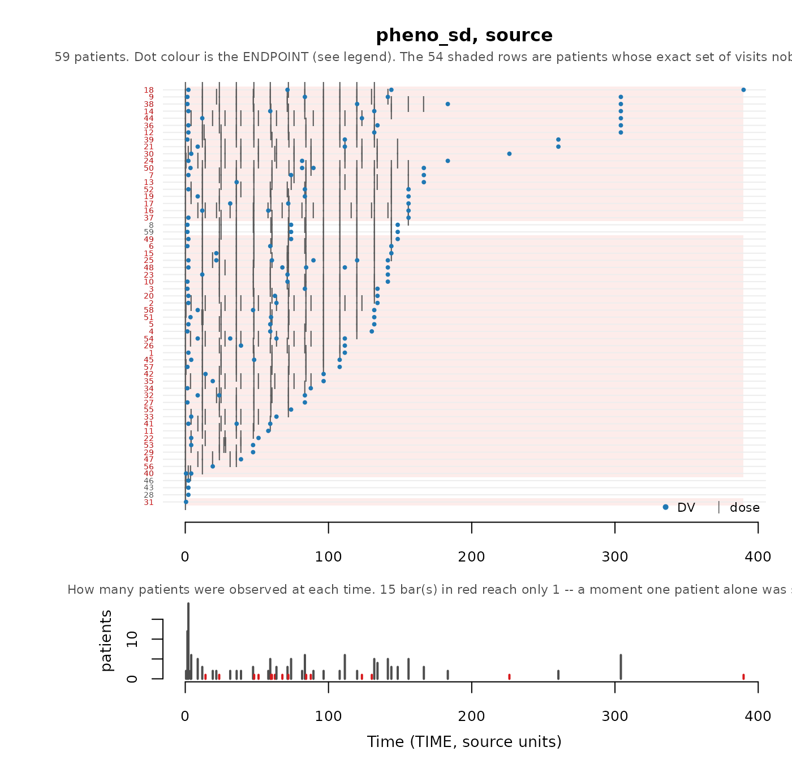
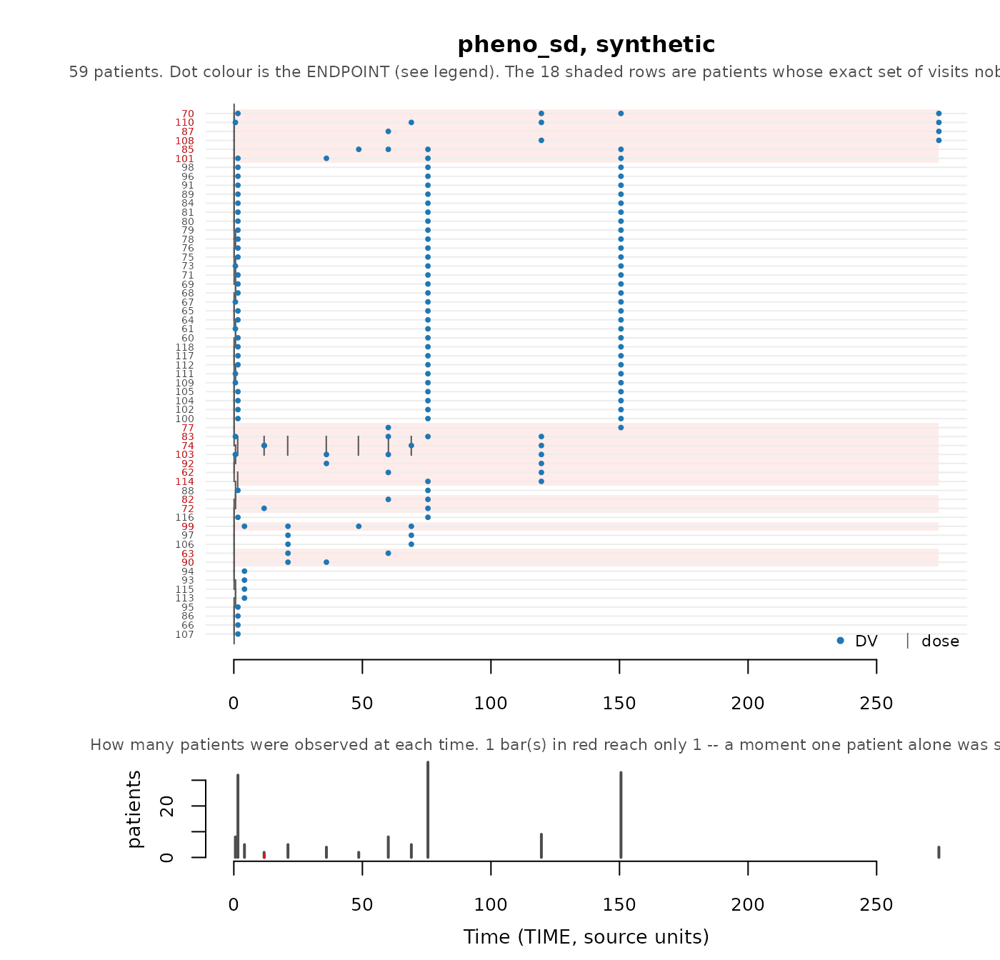

# Scorecard: Checks of the synthetic data

You have generated a synthetic dataset. Should you use it? The
scorecard, generated by
[`synpmx_scorecard()`](https://iamstein.github.io/synpmx/reference/synpmx_scorecard.md)
helps assess this and this Vignette explains it.

### The scorecard

The scorecard contains a table of the following items:

- The check of the dataset that is performed.
- That data is read (source data, synthetic data, or both)
- The resulting calculation from the check
- A verdict for whether the check passed, failed or needs review
- An `explore` function to help assess any checks that failed or need
  review.

There are four categories of checks, and these are the questions each
one asks:

- A. Is the dataset valid
  - **A1**: Is the synthetic table a legal PMX dataset?
  - **A2**: Is the *source* legal under the roles you declared?
  - **A3**: Did every endpoint survive?
  - **A4**: Did the cohort size survive?
  - **A5a**: Did the number of observations per patient survive?
  - **A5b**: Did the number of doses per patient survive?
  - **A6**: Did a discrete endpoint stay discrete?
- B. Is any individual patient identifiable based on the synthetic data
  - **B1a**: Does any avatar have a visit set nobody else shares?
  - **B1b**: Does any avatar have a dose schedule nobody else shares?
  - **B2**: Does any synthetic patient stand out from its own stratum?
  - **B3**: Is any avatar too close to a real patient in value space?
  - **B4a**: Is any generated time vector a copy of an exposed real one?
  - **B4b**: Is any generated `DV` vector a copy of an exposed real one?
  - **B5a**: Does any categorical level sit on a single synthetic
    patient?
  - **B5b**: Did a level too few *source* patients held reach the
    output?
- C. Has the synthetic study design significantly changed from the
  source
  - **C1**: Did every arm keep its endpoints and its size?
  - **C2**: What features of the study were lost?
- D. How much have the covariate and observation distributions changed
  - **D1**: Do the values land in the same range?

**Seven checks can say `FAIL`, and no others.** A1, because the output
is not a legal dataset; A3 and A6, because it is not the study that went
in; and B1a, B1b, B4a and B4b, because each means one real patient’s
structure was reproduced verbatim. Everything else is `review`, because
everything else can move for a legitimate reason: a subject dropped for
want of donors, an arm that changed size, a statistic wandering at a
small sample size.

One requirement is not in the list, because no function can answer it:
**does the pipeline that will consume the real study run unchanged
against this?** It is the only strictly necessary check, and it is the
reason the package exists.

### The two datasets used here

``` r

case1_pkpd <- as.data.frame(
  get(utils::data(list = "case1_pkpd", package = "xgxr"))
)
case1_roles <- pmx_roles(
  id = "ID", time = "TIME", dv = "LIDV", amt = "AMT", evid = "EVID",
  cmt = "CMT", dvid = "NAME", nominal_time = "NOMTIME",
  strata = c("TRTACT", "DOSE"), covariates = "WEIGHTB",
  keep = "STUDY"
)
case1_synth <- suppressWarnings(
  synpmx_avatar(case1_pkpd, case1_roles, seed = 808)
)

data("pheno_sd", package = "nlmixr2data")
pheno_roles <- pmx_roles(
  id = "ID", time = "TIME", dv = "DV", amt = "AMT", evid = "EVID",
  covariates = c("WT", "APGR")
)
pheno_synth <- suppressWarnings(
  synpmx_avatar(pheno_sd, pheno_roles, seed = 1010)
)
```

[`xgxr::case1_pkpd`](https://rdrr.io/pkg/xgxr/man/case1_pkpd.html) is
the worked example: 180 patients, six treatment arms, a declared nominal
time, two endpoints — a pharmacokinetic (PK) concentration and a
continuous pharmacodynamic (PD) effect — and a baseline weight. It is
shaped like a real study report, and most of these checks pass on it.

[`nlmixr2data::pheno_sd`](https://nlmixr2.github.io/nlmixr2data/reference/pheno_sd.html)
is 59 real neonates given phenobarbital in routine clinical care, and it
is here because **no check on it fails while its full dosing history
does not survive**: the median infant received twelve doses and the
median avatar receives one. A dataset on which everything passes teaches
nothing. Where the two disagree is where a check is doing work.

### The two scorecards

``` r

case1_card <- synpmx_scorecard(case1_pkpd, case1_synth, case1_roles)
pheno_card <- synpmx_scorecard(pheno_sd, pheno_synth, pheno_roles)
case1_card
```

| check | question | reads | result | verdict | explore |
|:---|:---|:---|:---|:---|:---|
| A1 | Synthetic table is a legal PMX dataset | synthetic | TRUE | pass | validate_pmx(synthetic, roles) |
| A2 | Source is legal under the declared roles | source | TRUE | pass | validate_pmx(source, roles, strict = FALSE) |
| A3 | Every endpoint survived | both | 2 of 2 | pass | compare_pmx_distributions(source, synthetic, roles) |
| A4 | Cohort size survived | both | 180 -\> 180 | pass | pmx_masking_report(synthetic, source, roles, section = “anchors”) |
| A5a | Observations per patient | both | 30.7 -\> 30.7 | review | compare_pmx_distributions(source, synthetic, roles) |
| A5b | Doses per patient | both | 70.8 -\> 70.8 | review | pmx_masking_report(synthetic, source, roles, section = “dose_schedules”) |
| B1a | Avatars with a visit set nobody else shares | run settings | 0 | pass | unmaskable_strata(source, roles) |
| B1b | Avatars with a dose schedule nobody else shares | run settings | 0 | pass | unmaskable_strata(source, roles) |
| B2 | Synthetic patients unusual within their stratum | synthetic | 1 of 180 | review | flag_identifiable_subjects(synthetic, roles) |
| B3 | Adversarial accuracy inside its null interval | both | 0.600 in \[0.423, 0.554\] | review | compare_pmx_proximity(source, synthetic, roles) |
| B4a | Generated time vectors copying an exposed real one | both | 0 | pass | skeleton_uniqueness(source, roles, coarsen_time = TRUE) |
| B4b | Generated DV vectors copying an exposed real one | both | 0 | pass | compare_pmx_proximity(source, synthetic, roles) |
| B5a | Patients holding the least-held categorical level | synthetic | TRTACT = 10 mg: 30 | pass | table(synthetic\$TRTACT) |
| B5b | Rare source levels copied into the output | both | 0 of 0 exposed | pass | compare_pmx_rare_levels(source, synthetic, roles) |
| C1 | Strata keeping their source size | both | 6 of 6 | pass | compare_pmx_strata_sizes(source, synthetic, roles) |
| C2 | Distinct dose-time schedules represented | run settings | 2 of 2 | pass | pmx_masking_report(synthetic, source, roles, section = “dose_schedules”) |
| D1 | Values landing in the same range | both | sd x0.64 on PD - Continuous (furthest of 3) | review | compare_pmx_distributions(source, synthetic, roles) |

*D1 reports numbers, not shapes. Plot source and synthetic on the same
axes – `DV` against time, and each covariate – with whatever you
normally use.*

``` r

pheno_card
```

| check | question | reads | result | verdict | explore |
|:---|:---|:---|:---|:---|:---|
| A1 | Synthetic table is a legal PMX dataset | synthetic | TRUE | pass | validate_pmx(synthetic, roles) |
| A2 | Source is legal under the declared roles | source | TRUE | pass | validate_pmx(source, roles, strict = FALSE) |
| A3 | Every endpoint survived | both | 1 of 1 | pass | compare_pmx_distributions(source, synthetic, roles) |
| A4 | Cohort size survived | both | 59 -\> 59 | pass | pmx_masking_report(synthetic, source, roles, section = “anchors”) |
| A5a | Observations per patient | both | 2.6 -\> 2.6 | review | compare_pmx_distributions(source, synthetic, roles) |
| A5b | Doses per patient | both | 10 -\> 1.1 | review | pmx_masking_report(synthetic, source, roles, section = “dose_schedules”) |
| B1a | Avatars with a visit set nobody else shares | run settings | 0 | pass | unmaskable_strata(source, roles) |
| B1b | Avatars with a dose schedule nobody else shares | run settings | 0 | pass | unmaskable_strata(source, roles) |
| B2 | Synthetic patients unusual within their stratum | synthetic | 36 of 59 | review | flag_identifiable_subjects(synthetic, roles) |
| B3 | Adversarial accuracy inside its null interval | both | 0.534 in \[0.362, 0.621\] | review | compare_pmx_proximity(source, synthetic, roles) |
| B4a | Generated time vectors copying an exposed real one | both | 0 | pass | skeleton_uniqueness(source, roles, coarsen_time = TRUE) |
| B4b | Generated DV vectors copying an exposed real one | both | 0 | pass | compare_pmx_proximity(source, synthetic, roles) |
| C2 | Distinct dose-time schedules represented | run settings | 3 of 56 | review | pmx_masking_report(synthetic, source, roles, section = “dose_schedules”) |
| D1 | Values landing in the same range | both | sd x0.66 on APGR (furthest of 3) | review | compare_pmx_distributions(source, synthetic, roles) |

*D1 reports numbers, not shapes. Plot source and synthetic on the same
axes – `DV` against time, and each covariate – with whatever you
normally use.*

Nothing fails on either, and on `pheno_sd` that is not the same as being
fine: A5b reads `10 -> 1.1` doses per patient and C2 represents 3 of its
56 dose schedules, both `review`. The rest of this vignette is what each
check asks, why its pass criterion is what it is, and how a study can
lose its dosing without a single `FAIL`.

## A. Is the dataset valid

``` r

validate_pmx(case1_synth, case1_roles)$valid
#> [1] TRUE
validate_pmx(pheno_synth, pheno_roles)$valid
#> [1] TRUE
```

[`validate_pmx()`](https://iamstein.github.io/synpmx/reference/validate_pmx.md)
checks schema and column classes, event grammar, time monotonicity
within subject, censoring flags against their dependent variable (`DV`),
infusion start/stop pairing, baseline covariates that are actually
constant, and strata that do not vary within a subject. Run it on the
source as well as the synthetic table, which is what A1 and A2 are:

``` r

case1_roles_cens <- pmx_roles(
  id = "ID", time = "TIME", dv = "LIDV", amt = "AMT", evid = "EVID",
  cmt = "CMT", dvid = "NAME", nominal_time = "NOMTIME", cens = "CENS",
  strata = c("TRTACT", "DOSE"), covariates = "WEIGHTB"
)
validate_pmx(case1_pkpd, case1_roles_cens)$valid
#> [1] FALSE
```

That study’s `CENS` column is meaningful only for the PK endpoint. The
PD effect is signed, so a row flagged as below the limit of
quantification (BLOQ) reports a value *above* uncensored ones. Declaring
`cens` here would produce a coherent-looking dataset with nonsense
censoring; leave it undeclared, or correct the column.

### A2. Time after dose

[`validate_pmx()`](https://iamstein.github.io/synpmx/reference/validate_pmx.md)
reports a disagreement in time after dose (`TAD`) as a *warning*, so it
passes `$valid` and still has to be read. A trough sample must stay a
trough, and this is the column that says whether it did.

**`tad` is an output, not an input.**
[`synpmx_avatar()`](https://iamstein.github.io/synpmx/reference/synpmx_avatar.md)
recomputes it from the generated times and dose rows and overwrites
whatever the source held. Declaring the role says which column to
overwrite and carry through. The source values are read in one place
only,
[`validate_pmx()`](https://iamstein.github.io/synpmx/reference/validate_pmx.md)
on the source, and a disagreement there is a real finding every time:

``` r

nimo <- get(utils::data(list = "nimoData", package = "nlmixr2data"))
nimo_roles <- pmx_roles(
  id = "ID", time = "TIME", dv = "DV", amt = "AMT", evid = "EVID",
  rate = "RATE", mdv = "MDV", tad = "TAD", occasion = "OCC",
  covariates = c("BSA", "AGE", "HGT"), keep = "DOS"
)
nimo_checks <- validate_pmx(nimo, nimo_roles)$checks
cat(nimo_checks$message[nimo_checks$check == "tad_agreement"])
#> Declared TAD disagrees with time since the most recent dose on 143 of 321 observation row(s) (45%), by up to 311.9. Common causes: TAD is measured from the end of an infusion or from a nominal dose time rather than the recorded dose row; the study uses a dosing occasion rather than the most recent dose. Note that `synpmx_avatar()` recomputes `TAD` from generated times, so the synthetic column will follow the derivation above and not this source's convention.
```

Forty-five percent of observation rows disagree, by up to 311.9 hours.
That means one of: the study measures `TAD` from the end of an infusion,
from a nominal dose time, or from an assigned occasion rather than the
most recent dose; or the source column is wrong; or the derivation is
wrong for this study. The check cannot tell you which. The synthetic
column follows the derivation, so a silent change of convention is what
this check surfaces.

Two limits. A sample taken before any dose is reported at `TAD` 0
because
[`validate_pmx()`](https://iamstein.github.io/synpmx/reference/validate_pmx.md)
refuses a negative. And where `addl`/`ii` are declared, the derivation
cannot see the doses they imply, so the check is skipped and says so. A
related gap, whether a sample stayed on the right side of its dose, is
in “What is still missing” at the end.

### A3. Endpoint survival

Compare endpoint *sets*, not row counts. The defect that motivated A3
lost an entire endpoint, 108 rows in and 60 out, with every observation
in one compartment gone and no warning.

``` r

setequal(
  unique(as.character(case1_pkpd$NAME)),
  unique(as.character(case1_synth$NAME))
)
#> [1] TRUE
```

### A5a, A5b. Observations and doses per patient

A5a and A5b split rows per patient by event type, because a total hides
the thing worth seeing. On `case1_pkpd` both hold. On `pheno_sd`
observations are intact at 2.6 per patient either side while dosing
falls from 10.0 to 1.1: 744 rows become 220, and 589 dose rows become
65.

``` r

doses_per_patient <- function(data) {
  as.numeric(table(data$ID[data$EVID != 0]))
}
summary(doses_per_patient(pheno_sd))
#>    Min. 1st Qu.  Median    Mean 3rd Qu.    Max. 
#>   1.000   7.000  12.000   9.983  13.000  15.000
summary(doses_per_patient(pheno_synth))
#>    Min. 1st Qu.  Median    Mean 3rd Qu.    Max. 
#>   1.000   1.000   1.000   1.102   1.000   7.000
```

The median real infant received twelve doses. The median avatar receives
one.
[`plot_pmx_schedule()`](https://iamstein.github.io/synpmx/reference/plot_pmx_schedule.md)
draws it, one row per patient, a grey tick for each dose and a coloured
dot for each observation:

``` r

plot_pmx_schedule(pheno_sd, pheno_roles, main = "pheno_sd, source")
```



``` r

plot_pmx_schedule(pheno_synth, pheno_roles, main = "pheno_sd, synthetic")
```



The source is a forest of dose ticks running the length of follow-up.
The synthetic cohort has one column of them at time zero, and its
observations have piled onto a handful of shared grid times. The shading
answers a different question from B1a and will not agree with it: it
marks patients whose visit set no other patient *in the drawn table*
has, while B1a asks whether an avatar’s set is one a real infant held.

Nothing is invalid here. Every avatar’s regimen is one a real infant
received, which is the guarantee section C describes. Dose schedules in
this study are nearly all unique, so truncating each avatar’s regimen
back to a depth several patients share collapses most of them to the
shortest depth. The masking worked as designed, and the result is not
usable as a dosing dataset. Section B1 is the other half: the privacy
checks read 0, so nothing in that tier reports a problem. A5b is what
catches it.

### A6. Discrete endpoints

Ask what kind of values each endpoint takes before reading anything else
about it. Blending is a weighted mean, so a weighted mean of several
patients’ zeros and ones is a number between them, and a 0/1 endpoint
comes back continuous unless the generated values are put back on the
scale the source used.

``` r

pmx_endpoint_types(case1_pkpd, case1_roles)
```

| endpoint | type | levels | decided_by | reason |
|:---|:---|:---|:---|:---|
| PD - Continuous | continuous | – | inferred | not every observed value is a whole number |
| PK Concentration | continuous | – | inferred | not every observed value is a whole number |

Both endpoints here are continuous, so
[`synpmx_scorecard()`](https://iamstein.github.io/synpmx/reference/synpmx_scorecard.md)
omits A6 entirely. The check fires on a study with an ordinal, binary or
count endpoint:
[`vignette("public-data-examples")`](https://iamstein.github.io/synpmx/articles/public-data-examples.md)
runs it on [`xgxr::mad`](https://rdrr.io/pkg/xgxr/man/mad.html), which
carries all three.

The type is *inferred* from the source — whether every observed value is
a whole number, and how many distinct ones there are — and
`pmx_roles(endpoint_types = )` overrides it where that inference reads
the study wrongly. Putting a binary endpoint back on its levels means
generated values are source values, since a 0/1 endpoint has no third
value to emit. What protects a patient on a discrete endpoint is section
B, never the distinctness of any one number.

## B. Is any individual patient identifiable based on the synthetic data

### B1. Timing and structure

Who was observed when, and who was dosed when. This is the axis most
specific to longitudinal data, and the one a general-purpose
synthetic-data tool will not have addressed.

``` r

skeleton_uniqueness(case1_pkpd, case1_roles)
```

**Schedule-uniqueness screen.** Scored on the recorded times AS GIVEN,
before any coarsening.
[`synpmx_avatar()`](https://iamstein.github.io/synpmx/reference/synpmx_avatar.md)
coarsens first by default, so run this again with `coarsen_time = TRUE`
to see what the grid removes.

180 of 180 patients (100%) have an observation schedule nobody else has:
180 from a one-off observation time, 0 from which visits they attended.
Declaring `nominal_time` addresses the first group; nothing addresses
the second.

Those 180 are not necessarily far apart. The typical one differs from
its nearest neighbour by 42 of about 33 visit slots (range 18 to 42),
where a slot is one endpoint measured at one time. A difference of one
or two is a missed sample, not a different schedule – which is why the
count alone is a poor guide.

This is a property of the SOURCE, and nothing in generation can lower
it. What generation controls is whether an avatar ends up with one of
these schedules – that is
[`pmx_masking_report()`](https://iamstein.github.io/synpmx/reference/pmx_masking_report.md)’s
“avatars keeping their anchor’s own visit set”, which should be near 0%
however high the count above is.

| Patients whose … | n | % of cohort | Meaning |
|:---|---:|---:|:---|
| Observation schedule nobody else has | 180 | 100 | the headline: an avatar anchored here has one real patient’s schedule |
| … a one-off observation time | 180 | 100 | sampled when nobody else was. A time grid can absorb this: declare `nominal_time` |
| … the set of visits attended | 0 | 0 | every time is shared. A missed visit, a discontinuation, or follow-up that has not reached the later visits. No grid touches this |
| Observation count nobody else has | 0 | 0 | survives any grid; the residual [`flag_identifiable_subjects()`](https://iamstein.github.io/synpmx/reference/flag_identifiable_subjects.md) looks at |
| Dosing nobody else has | 6 | 3 | dose amounts and gaps. Weight-based dosing makes this near-universal |

**How crowded is each schedule** (1 = nobody else has it):

| Patients sharing that schedule | Patients | % of cohort |
|-------------------------------:|---------:|------------:|
|                              1 |      180 |         100 |

**Which endpoint is doing it.** A schedule is only as shared as

its least shared part.

| endpoint         | patients | distinct visit sets | patients alone on theirs |
|:-----------------|---------:|--------------------:|-------------------------:|
| PD - Continuous  |      180 |                 180 |                      180 |
| PK Concentration |      150 |                 150 |                      150 |

*One row per patient is in the returned data frame;
[`plot_pmx_schedule()`](https://iamstein.github.io/synpmx/reference/plot_pmx_schedule.md)
draws the same cohort. Source-derived; not releasable unless separately
public or privately budgeted.*

Every one of the 180 patients has an observation schedule nobody else
has, before any coarsening. On the visit grid
[`synpmx_avatar()`](https://iamstein.github.io/synpmx/reference/synpmx_avatar.md)
actually builds:

``` r

skeleton_uniqueness(case1_pkpd, case1_roles, coarsen_time = TRUE)
```

**Schedule-uniqueness screen.** Scored AFTER coarsening, on the shared
visit grid
[`synpmx_avatar()`](https://iamstein.github.io/synpmx/reference/synpmx_avatar.md)
builds. These are the numbers a run reports.

Every patient shares their observation schedule with somebody. Nothing
to do.

This is a property of the SOURCE, and nothing in generation can lower
it. What generation controls is whether an avatar ends up with one of
these schedules – that is
[`pmx_masking_report()`](https://iamstein.github.io/synpmx/reference/pmx_masking_report.md)’s
“avatars keeping their anchor’s own visit set”, which should be near 0%
however high the count above is.

| Patients whose … | n | % of cohort | Meaning |
|:---|---:|---:|:---|
| Observation schedule nobody else has | 0 | 0 | the headline: an avatar anchored here has one real patient’s schedule |
| … a one-off observation time | 0 | 0 | sampled when nobody else was. A time grid can absorb this: declare `nominal_time` |
| … the set of visits attended | 0 | 0 | every time is shared. A missed visit, a discontinuation, or follow-up that has not reached the later visits. No grid touches this |
| Observation count nobody else has | 0 | 0 | survives any grid; the residual [`flag_identifiable_subjects()`](https://iamstein.github.io/synpmx/reference/flag_identifiable_subjects.md) looks at |
| Dosing nobody else has | 0 | 0 | dose amounts and gaps. Weight-based dosing makes this near-universal |

**How crowded is each schedule** (1 = nobody else has it):

| Patients sharing that schedule | Patients | % of cohort |
|-------------------------------:|---------:|------------:|
|                             30 |       30 |          17 |
|                            150 |      150 |          83 |

**Which endpoint is doing it.** A schedule is only as shared as

its least shared part.

| endpoint         | patients | distinct visit sets | patients alone on theirs |
|:-----------------|---------:|--------------------:|-------------------------:|
| PD - Continuous  |      180 |                   1 |                        0 |
| PK Concentration |      150 |                   1 |                        0 |

*One row per patient is in the returned data frame;
[`plot_pmx_schedule()`](https://iamstein.github.io/synpmx/reference/plot_pmx_schedule.md)
draws the same cohort. Source-derived; not releasable unless separately
public or privately budgeted.*

Zero. The declared `nominal_time` supplies the protocol’s grid, so
patients land on it exactly.

The counts to act on are measured on the output, not the source, and
both must be 0:

``` r

guarantees <- function(synthetic, label) {
  settings <- attr(synthetic, "pmx_settings")
  data.frame(
    dataset = label,
    identifying_visit_sets = settings$identifying_visit_sets,
    identifying_dose_schedules = settings$identifying_dose_schedules
  )
}
knitr::kable(rbind(
  guarantees(case1_synth, "case1_pkpd"),
  guarantees(pheno_synth, "pheno_sd")
))
```

| dataset    | identifying_visit_sets | identifying_dose_schedules |
|:-----------|-----------------------:|---------------------------:|
| case1_pkpd |                      0 |                          0 |
| pheno_sd   |                      0 |                          0 |

Both are 0, `pheno_sd` included, and `pheno_sd` is still the case worth
studying: passing is not the same as being fine. Neonatal phenobarbital
is dosed to the individual infant on the day a clinician decided, so 55
of its 59 infants have a dose schedule nobody else has:

``` r

pheno_unique <- skeleton_uniqueness(pheno_sd, pheno_roles)
sum(pheno_unique$n_share_dosing == 1)
#> [1] 55
```

Dose events are copied from the anchor verbatim, because moving a dose
invents a regimen the protocol never permitted. The only lever left is
to build avatars on the few patients whose dosing *is* shared, and here
the one shared schedule is a single dose. B1b is 0 because the dosing
was truncated away, not because it was masked.

**Read B1a and B1b next to A5b.** A check that must be 0 says nothing
about what reaching 0 cost, and A5b is where that cost showed up. Where
dosing is individualised, no setting fixes this. It is a property of the
study, and the honest response is to say so rather than ship.

#### B1 failures by arm

`pheno_sd` declares no arms, so its dosing problem is the whole
cohort’s. Where `strata` are declared, both checks are decided arm by
arm, because an avatar is anchored on one real patient and is never
moved out of the arm it was allocated to. An arm holding nobody who can
be masked therefore fails whatever the rest of the study looks like, and
the result cell names it:

    B1b   Avatars with a dose schedule nobody else shares   6 in ARM8 (6)   FAIL

`unmaskable_strata(source, roles)` answers the same question before
generating, one row per arm, splitting the patients no avatar can be
built on into `unmaskable_dosing`, which nothing can substitute for, and
`unmaskable_visits`, which a wider pool usually can. An arm with
`safe_anchors = 0` fails on every seed.

#### Near-miss distance

Exact-set equality is a harsh test. A patient one missing sample away
from a neighbour is counted exactly like a patient with an ad-hoc
schedule, and the remedies are different.

``` r

summary(pheno_unique$nearest_set_diff)
#>    Min. 1st Qu.  Median    Mean 3rd Qu.    Max. 
#>   0.000   2.000   3.000   2.831   4.000   6.000
```

`nearest_set_diff` is how many observation slots separate a patient from
their nearest neighbour. A median of a few slots on a sparse study is a
different situation from a median of twenty, and the headline count
cannot tell them apart.

#### Which endpoint is responsible

A schedule is only as shared as its least-shared part:

``` r

attr(skeleton_uniqueness(case1_pkpd, case1_roles, coarsen_time = TRUE),
     "by_endpoint")
#>           endpoint patients distinct visit sets patients alone on theirs
#> 1  PD - Continuous      180                   1                        0
#> 2 PK Concentration      150                   1                        0
```

Neither endpoint is responsible here, because neither is exposed. Where
the count is nonzero, this table says whether dense PK sampling or a
sparse biomarker is driving it.

[`plot_pmx_schedule()`](https://iamstein.github.io/synpmx/reference/plot_pmx_schedule.md)
draws the same thing, and a count that looks alarming and one that is
ordinary look different on the page. The `pheno_sd` figures above are
that picture: 54 of 59 rows shaded is a study where being alone is the
norm, not a study with a few stragglers.

### B2. Extremes

Who stands out from the cohort, on follow-up length, dose count, dose
magnitude or peak `DV`. This runs on the synthetic table and does not
read the source.

``` r

case1_flags <- flag_identifiable_subjects(case1_synth, case1_roles)
sum(case1_flags$flagged)
#> [1] 1
sort(table(as.character(case1_flags$outlier_axes[case1_flags$flagged])),
     decreasing = TRUE)
#> follow-up time 
#>              1
```

One flagged, on follow-up time. What makes that the right answer is the
comparison group. `case1_pkpd` is a six-arm dose-ranging study from 3 mg
to 300 mg, so dose magnitude is spread by *protocol*:

``` r

table(case1_flags$max_dose)
#> 
#>   3  10  30 100 300 
#>  30  30  30  30  30
```

Those are the six arms, not six kinds of outlier. Scored against the
whole cohort, the top arm sits about 6.4 modified-z units from the
median dose, so all thirty of its patients are flagged for receiving the
dose they were assigned. Taking the strata away shows it:

``` r

case1_roles_flat <- pmx_roles(
  id = "ID", time = "TIME", dv = "LIDV", amt = "AMT", evid = "EVID",
  cmt = "CMT", dvid = "NAME", nominal_time = "NOMTIME", covariates = "WEIGHTB"
)
sum(flag_identifiable_subjects(case1_synth, case1_roles_flat)$flagged)
#> [1] 60
```

[`flag_identifiable_subjects()`](https://iamstein.github.io/synpmx/reference/flag_identifiable_subjects.md)
therefore scores each axis within the declared `strata`. Within an arm
every dose is identical, so nobody stands out on it and what survives is
the patient who is genuinely unusual, while a patient given twice their
own arm’s dose is still flagged. “Does this patient stand out?” is
meaningless without saying *from whom*, and a screen that ignores
treatment assignment reports the protocol back to you as a privacy
finding. Strata holding fewer than five patients are scored against the
cohort instead, since a scale estimated from four patients describes
those four.

`pheno_sd` has no strata to declare, so it is scored cohort-wide:

``` r

pheno_flags <- flag_identifiable_subjects(pheno_synth, pheno_roles)
sum(pheno_flags$flagged)
#> [1] 36
```

The screen’s own statistics need checking too. Its robust scale, the
median absolute deviation (MAD), is exactly zero whenever more than half
a cohort shares one value, which on trial data is the ordinary case
rather than a degenerate one. A zero scale makes everything an outlier.
Test a screen like this on a cohort where half the values are identical.

[`remediate_identifiable_subjects()`](https://iamstein.github.io/synpmx/reference/remediate_identifiable_subjects.md)
acts on what survives that reading, by dropping or truncating the
subjects it is given.

### B3. Values and geometry

Whether a synthetic patient’s numbers sit too close to a real patient’s,
taking covariates and trajectory together.

``` r

proximity <- function(source, synthetic, roles, label) {
  report <- compare_pmx_proximity(source, synthetic, roles, replicates = 30)
  data.frame(
    dataset = label,
    adversarial_accuracy = round(report$adversarial_accuracy, 3),
    null_lower = round(report$null_lower, 3),
    null_upper = round(report$null_upper, 3),
    per_side = report$n_compared
  )
}
knitr::kable(rbind(
  proximity(case1_pkpd, case1_synth, case1_roles, "case1_pkpd"),
  proximity(pheno_sd, pheno_synth, pheno_roles, "pheno_sd")
))
```

| dataset    | adversarial_accuracy | null_lower | null_upper | per_side |
|:-----------|---------------------:|-----------:|-----------:|---------:|
| case1_pkpd |                0.600 |      0.426 |      0.559 |       90 |
| pheno_sd   |                0.534 |      0.362 |      0.591 |       29 |

Adversarial accuracy asks whether each subject’s nearest neighbour lies
in its own dataset or the other one. 0.5 means a synthetic subject is no
more like a real subject than two real subjects are like each other;
toward 0 means memorisation.

**Read the null interval before the point estimate.** It is wide at
pharmacometric cohort sizes, and a value inside it means *nothing was
detected*, never *nothing is there*. What it reliably catches is a
blatant leak: hand this function a verbatim copy of the source and it
drives to zero and objects.

**Read the direction before reacting to a miss.** B3 is `review`
whatever it lands on, because falling outside the interval means two
opposite things. Below it is memorisation, synthetic subjects sitting
closer to real ones than real ones sit to each other, and is the failure
this statistic exists to find. Above it means the two sets have
separated, which costs utility and discloses nothing. At a few dozen
patients either can also be the seed.

### B4. Exact copies

Two vectors per subject must not be reproduced: B4a, the observation
times, and B4b, the `DV` values recorded at them. They fail
independently. A generator can invent a schedule and carry a real
patient’s measurements onto it, or place real measurements on a new
grid, and each is a copy of half the patient.

What counts as a copy is a vector too few real patients share, the same
rule `min_pattern_share` applies to visit sets. Reproducing a vector a
whole arm shares identifies nobody: on a fixed protocol grid every
patient is sampled at the same times, so a check asking “does any
synthetic time vector equal some real one” fails every well-designed
study while catching nothing. It has to ask whether the vector belonged
to *one* patient.

``` r

case1_card[case1_card$check %in% c("B4a", "B4b"), ]
```

| check | question | reads | result | verdict | explore |
|:---|:---|:---|:---|:---|:---|
| B4a | Generated time vectors copying an exposed real one | both | 0 | pass | skeleton_uniqueness(source, roles, coarsen_time = TRUE) |
| B4b | Generated DV vectors copying an exposed real one | both | 0 | pass | compare_pmx_proximity(source, synthetic, roles) |

*D1 reports numbers, not shapes. Plot source and synthetic on the same
axes – `DV` against time, and each covariate – with whatever you
normally use.*

Both zero. Values are sorted before comparison, so a reordering of the
same numbers still counts as a copy, since the reordering is not what
protects the patient. On a study with one protocol grid B4a is close to
silent by construction, so B4b is the check doing the work. The same
comparison is worth running on whole covariate rows, which nothing does
for you.

### B5a, B5b. Rare categories

[`synpmx_avatar()`](https://iamstein.github.io/synpmx/reference/synpmx_avatar.md)
treats the two kinds of covariate differently, and only one of them is
blended:

- **Numeric** covariates become a weighted mean of the donors’ values
  plus noise. The result is a new number nobody had.
- **Categorical** covariates are
  [`sample()`](https://rdrr.io/r/base/sample.html)d from the donors’
  values. There is nothing to average: a synthetic patient’s category is
  always some real patient’s actual category, copied.
- **`strata`** (arm, dose group) are copied from the anchor exactly,
  because they are protocol facts.

So the question is when a copied category reaches the output.
[`vignette("avatar-algorithm")`](https://iamstein.github.io/synpmx/articles/avatar-algorithm.md),
under step 8, runs a 40-patient fixture in which one categorical level
is held by a varying number of otherwise-ordinary patients. **A level
held by one patient never reaches the output; a level held by two
does.** By ten holders the output tracks the source frequency closely.
That is geometry rather than protection — the sole holder of a level
sits alone on its own one-hot axis, is nobody’s nearest neighbour, and
is therefore almost never chosen as a donor — so nothing enforces it and
nothing reports it.

The dangerous shape is a rare level on a *typical* patient. A patient
who is unusual on their covariates is nobody’s nearest neighbour and is
self-protecting. A patient who is ordinary in every way except one rare
category, an ultra-rare mutation status say, sits in the middle of the
profile space, is selected as a donor constantly, and their category is
copied out.

The disclosure is also not “this value is unique in the dataset”. It is
that the value may be rare **in the world**. If five people alive carry
a mutation, a synthetic dataset containing it discloses that someone
with that mutation was in this study, which for a named trial with
public inclusion criteria can be nearly identifying on its own. No
cohort size helps.

#### B5b. The source-side census

[`compare_pmx_rare_levels()`](https://iamstein.github.io/synpmx/reference/compare_pmx_rare_levels.md)
censuses every categorical axis the roles declare, `strata` and each
non-numeric covariate. The level set it reports is the **union** of both
sides rather than the synthetic side alone, because a level dropped on
the way out is a coverage failure that a one-sided census cannot see.

``` r

compare_pmx_rare_levels(case1_pkpd, case1_synth, case1_roles)
```

| column | level   | source_patients | synthetic_patients | exposed | reached |
|:-------|:--------|----------------:|-------------------:|:--------|:--------|
| DOSE   | 0       |              30 |                 30 | FALSE   | TRUE    |
| DOSE   | 10      |              30 |                 30 | FALSE   | TRUE    |
| DOSE   | 100     |              30 |                 30 | FALSE   | TRUE    |
| DOSE   | 3       |              30 |                 30 | FALSE   | TRUE    |
| DOSE   | 30      |              30 |                 30 | FALSE   | TRUE    |
| DOSE   | 300     |              30 |                 30 | FALSE   | TRUE    |
| TRTACT | 10 mg   |              30 |                 30 | FALSE   | TRUE    |
| TRTACT | 100 mg  |              30 |                 30 | FALSE   | TRUE    |
| TRTACT | 3 mg    |              30 |                 30 | FALSE   | TRUE    |
| TRTACT | 30 mg   |              30 |                 30 | FALSE   | TRUE    |
| TRTACT | 300 mg  |              30 |                 30 | FALSE   | TRUE    |
| TRTACT | Placebo |              30 |                 30 | FALSE   | TRUE    |

0 level(s) held by fewer than 2 source patients; 0 of them reached the
output. {.table}

A level is **exposed** when fewer than `min_pattern_share` real patients
held it, the same floor that protects visit sets. The row to act on is
an exposed level that `reached` the output, because that level is one
real patient’s attribute, copied. On `case1_pkpd` nothing is exposed:
every arm is held by 30 patients. A study with a two-patient stratum
would show it here and nowhere else. A `0` in the synthetic column is
the other failure, a level the source had and the output lost.

The remedies are upstream of generation: drop the covariate from
`covariates`, or collapse its rare levels before generating. The
synthetic column moves because anchors are sampled with replacement.

#### B5a. What can be checked without the source

The census above reads real patient data and is restricted output. One
weaker question can be asked of the released table alone: does any
categorical level sit on exactly one synthetic patient? That patient is
singled out within the release, whatever the source looked like.

``` r

case1_card[case1_card$check == "B5a", ]
```

| check | question | reads | result | verdict | explore |
|:---|:---|:---|:---|:---|:---|
| B5a | Patients holding the least-held categorical level | synthetic | TRTACT = 10 mg: 30 | pass | table(synthetic\$TRTACT) |

*D1 reports numbers, not shapes. Plot source and synthetic on the same
axes – `DV` against time, and each covariate – with whatever you
normally use.*

The result names the column and the level, not just the count, because
“1” on its own gives a reader no way to find the patient it is talking
about. Here the answer is an arm size, thirty, and the pass is any
answer above one. `pheno_sd` declares no categorical covariate and no
`strata`, so the check is absent from its card, which is *not
applicable* rather than *clean*.

B5a is the weak form, and both its failure modes are real. A level held
by two source patients can be copied onto ten avatars and pass while the
disclosure is real, since what matters is how many *real* patients held
it. A level held by thirty source patients can land on one avatar by
chance and fail harmlessly. The synthetic-side count is what you can
compute on a table that has left the trusted environment; the
source-side count is what the risk is made of.

#### Combinations, which nothing enumerates

With `d` covariates there are `2^d` subsets that could serve as a
quasi-identifier — arm x sex x age band x mutation — and an attacker’s
chosen combination need not be one you checked. One mitigation is
accidentally present: each covariate is sampled independently, so sex
may come from one donor and race from another, and a rare *joint*
combination is less likely to be reproduced whole than any of its parts.
That is a fidelity cost, real correlations between covariates broken,
doing double duty as a weak privacy benefit.

#### Differentially private modes

This is the clearest difference between the two families in this
package. AVATAR’s protections are **enumerated** — visit sets, dose
schedules, extremes, proximity — so a risk nobody named is a risk nobody
covered, and combinations are exactly such a risk. An (epsilon, delta)
differential privacy (DP) guarantee is **unenumerated**: it bounds the
influence of any one individual on *any* function of the output, so it
holds for combinations nobody thought to check.

The DP path never copies a category. `pmx_covariate(levels = )` releases
a noisy count vector over the levels, normalises it to probabilities,
and generation draws from that distribution; a level held by two
patients of forty is swamped by noise at any sensible epsilon. Three
caveats:

1.  **The level set must be public.** A domain derived from the data
    leaks the domain, which is why
    [`pmx_covariate()`](https://iamstein.github.io/synpmx/reference/pmx_covariate.md)
    requires `levels` and a citation.
2.  **Delta matters more than usual.** (epsilon, delta)-DP permits the
    guarantee to fail with probability delta, and for a category held by
    one or two people that is the failure that matters. Keep delta well
    below 1/n.
3.  **DP bounds the mechanism, not the world.** If inclusion criteria
    are public and only a handful of people could qualify, membership
    may be inferable regardless.

The [privacy
article](https://iamstein.github.io/synpmx/articles/synpmx-privacy.html)
works through the trade-off.

### Deterministic proxies, which nothing checks

A column that is a function of a covariate discloses that covariate
exactly. This is not a scorecard check, because there is nothing to run:
the generator handles the one case it can detect, and the rest is a
reading of your own columns.

The worked case is dosing. Under milligram-per-kilogram dosing, an `AMT`
copied from the anchor reveals the anchor’s weight to the gram, and
blending the weight column is irrelevant because the dose gives it back.
[`synpmx_avatar()`](https://iamstein.github.io/synpmx/reference/synpmx_avatar.md)
detects proportional dosing, recomputes the amount from the avatar’s own
blended covariate, and reports which path it took:

``` r

attr(case1_synth, "pmx_settings")$dose_basis_note
#> [1] "the 5 distinct dose amounts are not a fixed multiple of any declared covariate: WEIGHTB (ratios do not cluster)"
attr(pheno_synth, "pmx_settings")$dose_basis_note
#> [1] "the 54 distinct dose amounts are not a fixed multiple of any declared covariate: WT (ratios do not cluster); APGR (65 ratio levels for 54 distinct amounts -- too many to be a protocol)"
```

Neither study is dosed proportionally to a declared covariate, so
inference declines rather than imposing a rule the study did not use.
When it does fire, `dose_basis` names the covariate.

Detection covers only the dose. Body surface area from height and
weight, body mass index, creatinine clearance, any derived exposure
column carried through with `keep` — each is a covariate written down
twice, and masking one copy does nothing. Look for them by hand.

## C. Has the synthetic study design significantly changed from the source

Failing these endangers nobody. It produces data nobody can develop
against, which is the entire purpose of the package.

Dose counts, intervals and amounts must be ones the protocol permitted,
which is why
[`synpmx_avatar()`](https://iamstein.github.io/synpmx/reference/synpmx_avatar.md)
never resamples dose times and only ever truncates a real schedule at
one of its own dose times. A generator that jitters dose times produces
regimens no protocol allows, and it looks fine in every distributional
check.

### C1. Endpoint coverage and arm size

All endpoints present is A3. Whether each endpoint is present *for the
right patients* is C1:

``` r

observed_by_arm <- function(data, label) {
  observed <- data[data$EVID == 0, ]
  out <- as.data.frame.matrix(table(observed$TRTACT, observed$NAME))
  out$dataset <- label
  out$arm <- rownames(out)
  out[, c("dataset", "arm", setdiff(names(out), c("dataset", "arm")))]
}
knitr::kable(rbind(
  observed_by_arm(case1_pkpd, "source"),
  observed_by_arm(case1_synth, "synthetic")
), row.names = FALSE)
```

| dataset   | arm     | PD - Continuous | PK Concentration |
|:----------|:--------|----------------:|-----------------:|
| source    | 10 mg   |             270 |              780 |
| source    | 100 mg  |             270 |              780 |
| source    | 3 mg    |             270 |              780 |
| source    | 30 mg   |             270 |              780 |
| source    | 300 mg  |             270 |              780 |
| source    | Placebo |             270 |                0 |
| synthetic | 10 mg   |             270 |              780 |
| synthetic | 100 mg  |             270 |              780 |
| synthetic | 3 mg    |             270 |              780 |
| synthetic | 30 mg   |             270 |              780 |
| synthetic | 300 mg  |             270 |              780 |
| synthetic | Placebo |             270 |                0 |

The placebo arm has no PK concentration in either table, which is the
check passing: an avatar never leaves the arm it was anchored in, so it
cannot acquire an endpoint its arm never had.

The arm sizes also match, which they did not until this check was
written. Anchors are sampled with replacement, so left alone the arm
sizes are whatever the draw gives: this design of exactly 30 per arm
came back between 21 and 39 per arm depending only on the seed, with
cohort size and arm membership both exact and only the *balance* wrong.
`preserve_strata_balance` (default `TRUE`) gives each declared stratum
its source share:

``` r

unbalanced <- suppressWarnings(
  synpmx_avatar(case1_pkpd, case1_roles, seed = 808,
                preserve_strata_balance = FALSE)
)
#> synpmx_avatar(): dropped 9 undeclared column(s): TIMEUNIT, EVENTU, CENS, eff0, PROFDAY, PROFTIME, CYCLE, PART, IPRED.
#>   Declare a column in `keep` to carry it through verbatim.
table(unbalanced$TRTACT[!duplicated(unbalanced$ID)])
#> 
#>   10 mg  100 mg    3 mg   30 mg  300 mg Placebo 
#>      30      33      34      26      32      25
```

One deliberate exception: a stratum holding fewer than three source
patients is left unbalanced on purpose, because reproducing its size
exactly would disclose that size. `strata_balanced` and
`strata_stochastic` in the run settings say how many strata fell on each
side.

### C2. What the masking cost

[`pmx_masking_report()`](https://iamstein.github.io/synpmx/reference/pmx_masking_report.md)
says what each mechanism did and what it cost. The dosing section is the
one C2 reports; drop the `section` argument for the other six.

``` r

knitr::kable(as.data.frame(
  pmx_masking_report(pheno_synth, pheno_sd, pheno_roles,
                     section = "dose_schedules")
), row.names = FALSE, align = c("l", "r", "l"))
```

| Quantity | Value | What it means |
|:---|---:|:---|
| **Dose schedules: WHEN each patient was dosed** |  |  |
| Avatars whose dosing was re-truncated | 20 of 59 (34%) | the anchor stopped dosing at a depth nobody else used, so the avatar stops at a different one – shared, or used by nobody. Truncating a schedule to a real dose time is protocol-valid in a way that moving dose times is not |
| Distinct dose schedules in the source | 56 |  |
|   represented in the synthetic cohort | 3 (5%) | a regimen only one patient received cannot be given to an avatar without pointing at them, so it is not represented at all. This is the cost of the guarantee below, and on a small cohort it is unavoidable rather than a setting to tune |
| **Avatars carrying a dose schedule nobody else shares** | 0 (0%) | **must also be 0%.** Dose events are copied from the anchor verbatim, so patients whose dose times nobody shares are not built upon. Non-zero when a whole ARM is in that position – individualised dosing, per-patient titration – because an avatar is only ever anchored inside the arm it was allocated to. [`unmaskable_strata()`](https://iamstein.github.io/synpmx/reference/unmaskable_strata.md) says which arm |

A “dose schedule”, here and in C2, is the set of dose **times** a
patient received, and nothing else. Amounts are deliberately not part of
it: on a weight-based study every patient’s milligrams are their own, so
counting amounts would make every patient their own schedule. Two
patients on the same visit days at different doses are one schedule; a
patient who stopped after two of three doses is another, and if nobody
shares it, declining to anchor on them removes it from the output.

On `pheno_sd` 3 of 56 distinct dose schedules are represented, and a
third of avatars had their dosing re-truncated to reach that. It is the
A5b finding again, from the generator’s side.

## D. How much have the covariate and observation distributions changed

### D1. Endpoint and covariate distributions

``` r

case1_dist <- compare_pmx_distributions(case1_pkpd, case1_synth, case1_roles)
knitr::kable(case1_dist$endpoints, digits = 3,
             caption = "Endpoints, source against synthetic")
```

| variable | dataset | n | n_subjects | mean | sd | min | q25 | median | q75 | max |
|:---|:---|---:|---:|---:|---:|---:|---:|---:|---:|---:|
| PD - Continuous | source | 1620 | 180 | 134.896 | 237.732 | -620.950 | -21.589 | 123.210 | 283.123 | 936.110 |
| PD - Continuous | synthetic | 1620 | 180 | 132.001 | 152.667 | -360.769 | 33.492 | 119.040 | 216.812 | 741.644 |
| PK Concentration | source | 3600 | 150 | 0.360 | 0.737 | 0.050 | 0.050 | 0.063 | 0.263 | 6.996 |
| PK Concentration | synthetic | 3600 | 150 | 0.299 | 0.582 | 0.019 | 0.049 | 0.069 | 0.218 | 5.224 |

Endpoints, source against synthetic {.table style="width:100%;"}

``` r

knitr::kable(case1_dist$covariates_numeric, digits = 2,
             caption = "Baseline weight, source against synthetic")
```

| variable | dataset   |   n |   mean |    sd |   min |    q25 | median |    q75 |    max |
|:---------|:----------|----:|-------:|------:|------:|-------:|-------:|-------:|-------:|
| WEIGHTB  | source    | 180 | 115.91 | 20.53 | 80.02 |  98.02 | 117.04 | 133.36 | 149.55 |
| WEIGHTB  | synthetic | 180 | 117.57 | 14.13 | 88.27 | 105.56 | 118.26 | 129.32 | 143.94 |

Baseline weight, source against synthetic {.table}

**Between-subject variability shrinks, necessarily.** An avatar is an
average of several donors, and averaging reduces variance. Baseline
weight above has a source standard deviation of about 20.5 kg and a
synthetic one of about 14.1. D1 reports whichever endpoint or covariate
moved furthest, `sd x0.64` on the PD endpoint here, and is always
`review`, since neither direction has a threshold that would be right on
a second study. The quantities that explain how much are reported with
the run:

``` r

unlist(attr(case1_synth, "pmx_settings")[
  c("k", "mean_effective_donors", "max_donor_weight", "cap_binding_fraction")
])
#>                     k mean_effective_donors      max_donor_weight 
#>             5.0000000             2.8870877             0.5000000 
#>  cap_binding_fraction 
#>             0.7055556
```

`mean_effective_donors` is how many donors an avatar is genuinely
averaged over once the weights are accounted for, under 3 here out of
`k = 5`, and `cap_binding_fraction` is how often the single-donor weight
cap bound. Fewer effective donors means more fidelity and less masking;
that trade is the whole design.

**Plot the data as well.** Everything above is summary statistics, and a
summary statistic cannot see a shape: a single mode and two modes with
the same mean and spread give identical rows. Overlay source and
synthetic on the same axes, `DV` against time and each covariate’s
distribution, before deciding the output is usable. No function here
draws it, because every group has plotting code it already trusts for
its own study.

**Do the covariate–response relationships survive?** The question a
modeller actually cares about, and the least covered by anything above:
a weight–exposure slope, a dose–response relationship, a treatment
effect. Marginal distributions can match while the relationship between
them is destroyed. The [covariate and treatment effect
article](https://iamstein.github.io/synpmx/articles/example-avatar-PKPD-covariate-treatment-effect.html)
is the worked evidence.

## What these checks cannot tell you

**Nothing here bounds what an adversary learns.** These checks reduce
the ways a real patient can be singled out. They do not limit how often
that succeeds, and they compose no better than the weakest one. That is
what the differentially private modes are for.

**The guarantees are about reproduction, not similarity.**
`identifying_visit_sets` counts avatars with a visit set that is
*exactly* one real patient’s. An avatar whose visits sit merely *near* a
real patient’s is not covered by it, and `nearest_set_diff` is the only
thing that will tell you how near.

**Most checks read the source, and are therefore restricted output.**
They may not leave the environment the source data lives in.
[`compare_pmx()`](https://iamstein.github.io/synpmx/reference/compare_pmx.md)
reports this per component:

``` r

compare_pmx(case1_pkpd, case1_synth, case1_roles)$release_status
#>              component             release_status
#> 1              summary  restricted_not_releasable
#> 2         event_counts  restricted_not_releasable
#> 3       column_classes  restricted_not_releasable
#> 4    validation.source  restricted_not_releasable
#> 5 validation.synthetic releasable_post_processing
#> 6                plots  restricted_not_releasable
```

Only two things in this vignette do not read the source:
[`validate_pmx()`](https://iamstein.github.io/synpmx/reference/validate_pmx.md)
and
[`flag_identifiable_subjects()`](https://iamstein.github.io/synpmx/reference/flag_identifiable_subjects.md),
both on the synthetic table. Every uniqueness count, distribution
comparison and proximity statistic is computed from real patient data
and inherits its handling obligations.

## What is still missing

**A1: a sample can cross a dose.** Generated observation times move and
dose times do not, so a sample drawn before a dose can land at or after
it. On
[`nlmixr2data::nimoData`](https://nlmixr2.github.io/nlmixr2data/reference/nimoData.html)
that happens to 6 of 12 avatars, each carrying an observation labelled
occasion 2 at the same time as the occasion-3 dose: a trough that is now
a time-zero sample, and a declared `occasion` column that no longer runs
in step with `time`. Closing it takes a post-generation invariant over
the finished table, checking that each observation keeps the number of
doses that preceded it and that `occasion` is non-decreasing within a
subject.

**B5: rare combinations, and rarity in the world.** The source-side
census exists as
[`compare_pmx_rare_levels()`](https://iamstein.github.io/synpmx/reference/compare_pmx_rare_levels.md)
and B5b. Joint combinations do not, since with `d` covariates there are
`2^d` of them and the census is per column; closing that takes a
decision about which combinations are worth enumerating. The one that
matters most is declaring which levels are rare *in the population*
rather than in this study, which is not measurable from the study at
all. Its realistic form is a declaration on
[`pmx_roles()`](https://iamstein.github.io/synpmx/reference/pmx_roles.md),
or not carrying that covariate. It is also the only gap here that would
change generation rather than reporting, by suppressing or coarsening a
level.

Two further gaps are whole measurement approaches the package does not
attempt, both covered in the [checking literature
review](https://iamstein.github.io/synpmx/articles/synthetic-data-checking-review.html):

- **No control group.** Every check that reads the source compares the
  synthetic data against patients the generator was allowed to use. That
  confounds *the generator captured the population* with *the generator
  memorized a patient*, and the standard remedy — holding patients out
  of generation and asking the question twice — is not implemented. It
  is why B3’s null interval says less than it appears to.
- **Nothing measures linkability, and nothing is per patient on the
  privacy side.** The AVATAR literature’s own per-patient measures,
  local cloaking and hidden rate, apply directly to this generator and
  are not computed.

And one check cannot be on this list: **does the pipeline that will
consume the real study run unchanged against this?** Only you can answer
it. Run your own code against the output and see whether the joins,
reshapes, derivations and control streams behave.

### Where to go next

- [`vignette("demo")`](https://iamstein.github.io/synpmx/articles/demo.md)
  — generating a dataset and reading its scorecard, on one study end to
  end.
- [`vignette("avatar-algorithm")`](https://iamstein.github.io/synpmx/articles/avatar-algorithm.md)
  — how the default generator works, and the six masking mechanisms
  these checks are measuring.
- [`vignette("public-data-examples")`](https://iamstein.github.io/synpmx/articles/public-data-examples.md)
  — these checks run across eight public datasets, with the masking cost
  for each.
- [Literature: checking synthetic
  data](https://iamstein.github.io/synpmx/articles/synthetic-data-checking-review.html)
  — the published methods for checking synthetic data, what each one
  asks, and which of them this package does not attempt.
- [Literature: generating synthetic
  data](https://iamstein.github.io/synpmx/articles/synthetic-data-generation-review.html)
  — the four families of generation method, and where `synpmx` sits
  among them.
- [Privacy](https://iamstein.github.io/synpmx/articles/synpmx-privacy.html)
  — when the enumerated protections are not enough, and what a formal
  guarantee buys instead.
