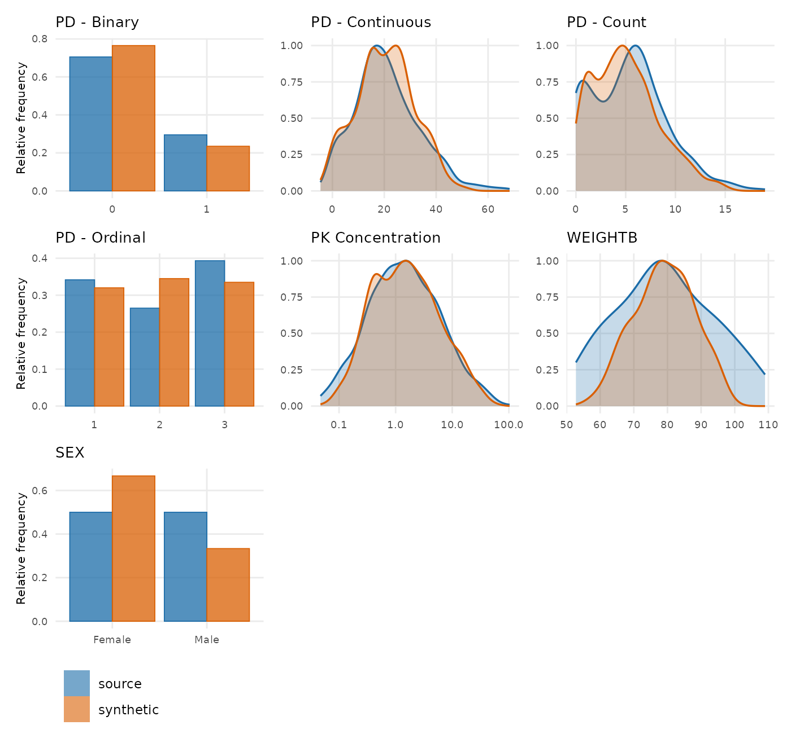

# Scorecard: Checks of the synthetic data

You have generated a synthetic dataset. Should you use it? The
scorecard, generated by
[`synpmx_scorecard()`](https://iamstein.github.io/synpmx/reference/synpmx_scorecard.md)
helps assess this and this Vignette explains it.

### The scorecard

The scorecard contains a table of the following items:

- The check of the dataset that is performed.
- That data is read (source data, synthetic data, or both)
- The resulting calculation from the check
- A verdict for whether the check passed, failed or needs review
- An `explore` function to help assess any checks that failed or need
  review.

Its rows are grouped into four categories, one per question:

- **A. Is the dataset valid**
- **B. Is any individual patient identifiable based on the synthetic
  data**
- **C. Has the synthetic study design significantly changed from the
  source**
- **D. How much have the covariate and observation distributions
  changed**

Every row the card holds has a section of this vignette under the same
identifier.

**Seven checks can say `FAIL`, and no others.** A1, because the output
is not a legal dataset; A3 and A6, because it is not the study that went
in; and B1a, B1b, B4a and B4b, because each means one real patient’s
structure was reproduced verbatim. No other row can fail. The rest
answer `pass` when there is nothing to read and `review` when there is
something whose meaning depends on the study: a subject dropped for want
of donors, an arm that changed size, a statistic wandering at a small
sample size. One row, D1, is `review` however it lands, because no
threshold on it would be honest.

### The two datasets used here

``` r

mad <- as.data.frame(get(utils::data(list = "mad", package = "xgxr")))
mad_roles <- pmx_roles(
  id = "ID", time = "TIME", dv = "LIDV", amt = "AMT", evid = "EVID",
  cmt = "CMT", dvid = "NAME", mdv = "MDV", nominal_time = "NOMTIME",
  strata = c("TRTACT", "DOSE"),
  covariates = c("WEIGHTB", "SEX")
)
mad_synth <- suppressWarnings(synpmx_avatar(mad, mad_roles, seed = 909))

data("pheno_sd", package = "nlmixr2data")
pheno_roles <- pmx_roles(
  id = "ID", time = "TIME", dv = "DV", amt = "AMT", evid = "EVID",
  covariates = c("WT", "APGR")
)
pheno_synth <- suppressWarnings(
  synpmx_avatar(pheno_sd, pheno_roles, seed = 1010)
)
```

[`xgxr::mad`](https://rdrr.io/pkg/xgxr/man/mad.html) is the worked
example: 60 subjects in a multiple-ascending-dose study, six arms of ten
(placebo and five dose levels), a declared nominal time, a baseline
weight and a sex, and **five** endpoints keyed by `NAME` — a
pharmacokinetic (PK) concentration, a continuous pharmacodynamic (PD)
effect, and PD endpoints that are ordinal, count and binary. It is
shaped like a real study report, and most of these checks pass on it.

Five endpoints and a categorical covariate are why it is the example
here. On a study with one continuous endpoint and no category, A6 and B5
both report that there was nothing to ask, A3 compares a set of size one
against itself, and C3 asks each arm about one endpoint.

[`nlmixr2data::pheno_sd`](https://nlmixr2.github.io/nlmixr2data/reference/pheno_sd.html)
is 59 real neonates given phenobarbital in routine clinical care, and it
is here because **no check on it fails while its dosing history is
visibly shortened**: the median infant received twelve doses and the
median avatar receives five.

### The scorecard, computed

``` r

mad_card <- synpmx_scorecard(mad, mad_synth, mad_roles)
synpmx_scorecard_datatable(mad_card)
```

Nothing fails. The rest of this vignette is what each check asks and why
its pass criterion is what it is, using `mad` where a check passes and
`pheno_sd` for further exploration.

Each section below opens with its own rows of this card, so the check
being discussed is on the screen with the discussion. The card is a
`data.frame` and that is all those tables are — a row subset of it, in
the form shown under A5a and A5b.

## A. Is the dataset valid

### A1, A2. Are the synthetic and source data legal PMX datasets

A1 runs
[`validate_pmx()`](https://iamstein.github.io/synpmx/reference/validate_pmx.md)
on the synthetic table and A2 runs the same function on the source. Both
must be `TRUE`. The check is structural: schema and column classes,
event grammar, time monotonicity within subject, censoring flags against
their dependent variable (`DV`), infusion start/stop pairing, baseline
covariates that are actually constant, and strata that do not vary
within a subject.

``` r

validate_pmx(mad_synth, mad_roles)$valid
#> [1] TRUE
```

``` r

mad_roles_cens <- pmx_roles(
  id = "ID", time = "TIME", dv = "LIDV", amt = "AMT", evid = "EVID",
  cmt = "CMT", dvid = "NAME", mdv = "MDV", nominal_time = "NOMTIME",
  cens = "CENS", strata = c("TRTACT", "DOSE"),
  covariates = c("WEIGHTB", "SEX")
)
validate_pmx(mad, mad_roles_cens)$valid
#> [1] FALSE
```

That study’s `CENS` column is meaningful only for the PK concentration,
and all five endpoints share the one `LIDV` column, so the flag lands on
the four PD endpoints as well. None of them is a concentration with a
lower assay limit: on the ordinal endpoint a row flagged as below the
limit of quantification (BLOQ) reports a severity of 2 while uncensored
rows go down to 1, and the continuous, count and binary endpoints each
do the same. Declaring `cens` here would produce a coherent-looking
dataset with nonsense censoring on four endpoints out of five; leave it
undeclared, or restrict the flag to the rows it describes. A2 is
`review` rather than `pass` in that situation: a real study a validator
objects to is a normal thing to have, and the objection has to be read
rather than scored.

#### Time after dose (TAD)

**`tad` is an output, not an input.**
[`synpmx_avatar()`](https://iamstein.github.io/synpmx/reference/synpmx_avatar.md)
recomputes it from the generated times and dose rows and overwrites
whatever the source held. Declaring the role says which column to
overwrite and carry through. The source values are read in one place
only,
[`validate_pmx()`](https://iamstein.github.io/synpmx/reference/validate_pmx.md)
on the source:

### A3. Did every endpoint survive

A3 compares the set of `dvid` levels observed in the source against the
set observed in the output. They must be equal, and a missing endpoint
is a `FAIL`: it is not the study that went in.

``` r

setequal(
  unique(as.character(mad$NAME)),
  unique(as.character(mad_synth$NAME))
)
#> [1] TRUE
```

It is a set comparison rather than a row count, because row counts stay
plausible while a whole endpoint disappears. That is also why five
endpoints are worth having in the example: A3 reads `5 of 5` here, and
on a one-endpoint study the check can only ever say that the one
endpoint is still there.

### A4. Did the strata (cohort) size survive

A4 counts distinct subjects on strata. Equal is a pass. Fewer is
`review` rather than `FAIL`, because `on_donor_shortfall = "drop"`
removes a subject that could not be built from enough donors, and
declining to build on a patient the generator cannot protect is the
correct answer. It lands on whichever stratum was thinnest, so a small
cohort is where it shows up: a stratum holding a single patient can
legitimately come back empty.

### A5a, A5b. Did the number of observations and doses survive

A5a and A5b are rows per patient, split by event type: observations in
one, dose events in the other. Each passes when the synthetic count
lands within 5% of the source’s — that much movement leaves each patient
carrying the same amount of information, and there is nothing to decide.
Further than that is `review` and never `FAIL`, because the number is
permitted to move: a shortened dose course can be the correct answer, as
the rest of this section shows.

On `mad` neither moves — 61.7 observations and 5 doses per patient on
both sides, a fixed protocol grid coming through intact, so both pass.
`pheno_sd` is where they move, and the card is a `data.frame`, so a
section of it is an ordinary row subset:

``` r

pheno_card <- synpmx_scorecard(pheno_sd, pheno_synth, pheno_roles)
synpmx_scorecard_datatable(pheno_card[pheno_card$check %in% c("A5a", "A5b"), ])
```

Observations are near-intact at 2.63 against 2.51 per patient — inside
the 5%, so A5a passes — while dosing falls from 9.98 to 5.63 and A5b
asks to be read. This occurs from
[`synpmx_avatar()`](https://iamstein.github.io/synpmx/reference/synpmx_avatar.md)
trying to infer a nominal time grid.

``` r

doses_per_patient <- function(data) {
  as.numeric(table(data$ID[data$EVID != 0]))
}
summary(doses_per_patient(pheno_sd))
#>    Min. 1st Qu.  Median    Mean 3rd Qu.    Max. 
#>   1.000   7.000  12.000   9.983  13.000  15.000
summary(doses_per_patient(pheno_synth))
#>    Min. 1st Qu.  Median    Mean 3rd Qu.    Max. 
#>   1.000   3.000   5.000   5.627   8.500  11.000
```

The median real infant received twelve doses. The median avatar receives
five.
[`plot_pmx_schedule()`](https://iamstein.github.io/synpmx/reference/plot_pmx_schedule.md)
draws it, one row per patient, a grey tick for each dose and a coloured
dot for each observation:

``` r

plot_pmx_schedule(pheno_sd, pheno_roles, main = "pheno_sd, source")
```


``` r

plot_pmx_schedule(pheno_synth, pheno_roles, main = "pheno_sd, synthetic")
```


Nothing is invalid here. No infant’s *complete* schedule can be reused —
55 of 59 are held by one patient — but most infants open the same way,
twelve-hourly from time zero, so each avatar’s course is cut back to the
deepest opening several infants share. That is about half the doses.
Whether half a course is enough is exactly the judgement A5b exists to
prompt, and it depends on what the dataset is for: enough to develop a
fitting workflow, not enough to characterise the tail of an
individualised regimen. Section B1 is the other half of the story, where
the privacy checks read 0, and A5b is what says at what price.

If it were important to more accurately capture the dosing information,
a nominal time grid could be specified by the user, rather than computed
by
[`synpmx_avatar()`](https://iamstein.github.io/synpmx/reference/synpmx_avatar.md),
as shown in
[`vignette("public-data-examples")`](https://iamstein.github.io/synpmx/articles/public-data-examples.md)
for the `nimoData` example.

### A6. Did a discrete endpoint stay discrete

A6 asks whether every generated value on a binary, ordinal or count
endpoint is one the source could have held. It is on every card. Where a
study has no discrete endpoint the result reads `no discrete endpoint`
and passes, which is the true answer rather than a silently absent row.

Blending is a weighted mean, so a weighted mean of several patients’
zeros and ones is a number between them, and a 0/1 endpoint comes back
continuous unless the generated values are put back on the scale the
source used. The subject and residual noise terms then carry it off the
level set entirely. Ask what kind of values each endpoint takes before
reading anything else about it:

``` r

pmx_endpoint_types(mad, mad_roles)
```

| endpoint | type | levels | decided_by | reason |
|:---|:---|:---|:---|:---|
| PD - Binary | binary | 0, 1 | inferred | every observed value is 0 or 1 |
| PD - Continuous | continuous | – | inferred | not every observed value is a whole number |
| PD - Count | integer | – | inferred | 20 whole-number levels, from 0 to 19 |
| PD - Ordinal | ordinal | 1, 2, 3 | inferred | 3 whole-number levels: 1, 2, 3 |
| PK Concentration | continuous | – | inferred | not every observed value is a whole number |

Three of `mad`’s five endpoints are discrete, and `LIDV` is one numeric
column carrying all five, so restoring the *column’s* class restores
nothing about any of them.
[`synpmx_avatar()`](https://iamstein.github.io/synpmx/reference/synpmx_avatar.md)
decides per endpoint and snaps the generated values back: binary and
ordinal onto the source’s levels, count to whole numbers. A6 reads the
finished table rather than trusting that:

``` r

discrete <- c("PD - Binary", "PD - Count", "PD - Ordinal")
values_taken <- function(data, endpoint) {
  values <- data$LIDV[data$NAME == endpoint & data$EVID == 0]
  sprintf("%d distinct, %.2f to %.2f", length(unique(values)),
          min(values), max(values))
}
knitr::kable(data.frame(
  endpoint = discrete,
  source = vapply(discrete, values_taken, character(1), data = mad),
  synthetic = vapply(discrete, values_taken, character(1), data = mad_synth),
  row.names = NULL
))
```

| endpoint     | source                     | synthetic                  |
|:-------------|:---------------------------|:---------------------------|
| PD - Binary  | 2 distinct, 0.00 to 1.00   | 2 distinct, 0.00 to 1.00   |
| PD - Count   | 20 distinct, 0.00 to 19.00 | 16 distinct, 0.00 to 15.00 |
| PD - Ordinal | 3 distinct, 1.00 to 3.00   | 3 distinct, 1.00 to 3.00   |

**A6 asks whether every generated value is one the source could have
held, not whether every source value came back.** The count endpoint
loses its four highest levels — 20 distinct values become 16, topping
out at 15 rather than 19 — and passes, because 16 whole numbers inside
the source’s range are all values this endpoint takes. A single
generated 2.4 would fail the check. The lost tail is a D1 question about
the distribution.

The observation type is inferred from the source — whether every
observed value is a whole number, and how many distinct ones there are —
and `pmx_roles(endpoint_types = )` overrides it where that inference
reads the study wrongly.

## B. Is any individual patient identifiable based on the synthetic data

### B1a, B1b. Does any avatar carry one real patient’s schedule

Who was observed when, and who was dosed when, is the axis most specific
to longitudinal data, and the one a general-purpose synthetic-data tool
will not have addressed. Two patterns per avatar are checked:

- **B1a**, the set of visits it attends.
- **B1b**, the times it is dosed at.

Either is a `FAIL` above **0**. An avatar may carry a pattern only if at
least `min_pattern_share` real patients shared it — 2 by default, set in
[`synpmx_avatar()`](https://iamstein.github.io/synpmx/reference/synpmx_avatar.md),
and the same floor B4a, B4b and B5 use. One avatar carrying a pattern
only one real patient had could be identifying.

The run measures both as it builds and records the answer, so the card
reads them from the run rather than from the finished table:

``` r

guarantees <- function(synthetic, label) {
  settings <- attr(synthetic, "pmx_settings")
  data.frame(
    dataset = label,
    identifying_visit_sets = settings$identifying_visit_sets,
    identifying_dose_schedules = settings$identifying_dose_schedules
  )
}
knitr::kable(rbind(
  guarantees(mad_synth, "mad"),
  guarantees(pheno_synth, "pheno_sd")
))
```

| dataset  | identifying_visit_sets | identifying_dose_schedules |
|:---------|-----------------------:|---------------------------:|
| mad      |                      0 |                          0 |
| pheno_sd |                      0 |                          0 |

**Passing is not the same as being fine**, which is what `pheno_sd` is
here to show. Its infants are dosed individually, so 55 of 59 have a
dose schedule nobody else shares. A dose cannot be moved without
inventing a regimen the protocol never allowed, so the only way to 0 was
to stop each avatar’s dosing early, at a depth several infants passed
through — 10 doses per patient down to 5.6. **Read B1a and B1b next to
A5b**, which is where that price is reported.

Where `strata` are declared the two are decided arm by arm, since an
avatar is never moved out of the arm it was anchored in, and the result
cell names the arm that failed, with an example shown below.

    B1b   Avatars with a dose schedule nobody else shares   6 in ARM8 (6)   FAIL

#### Asking before you generate

Both checks can be further explored. `unmaskable_strata(source, roles)`
answers the related question in advance, naming the arms whose patients
no method could mask; an arm with `safe_anchors = 0` fails on every
seed.
[`skeleton_uniqueness()`](https://iamstein.github.io/synpmx/reference/skeleton_uniqueness.md)
is the cohort-wide version, read on the coarsened visit grid.

``` r

skeleton_uniqueness(mad, mad_roles, coarsen_time = TRUE)
```

**Schedule-uniqueness screen.** Scored AFTER coarsening, on the shared
visit grid
[`synpmx_avatar()`](https://iamstein.github.io/synpmx/reference/synpmx_avatar.md)
builds. These are the numbers a run reports.

Every patient shares their observation schedule with somebody. Nothing
to do.

This is a property of the SOURCE, and nothing in generation can lower
it. What generation controls is whether an avatar ends up with one of
these schedules – that is
[`pmx_masking_report()`](https://iamstein.github.io/synpmx/reference/pmx_masking_report.md)’s
“avatars keeping their anchor’s own visit set”, which should be near 0%
however high the count above is.

| Patients whose … | n | % of cohort | Meaning |
|:---|---:|---:|:---|
| Observation schedule nobody else has | 0 | 0 | the headline: an avatar anchored here has one real patient’s schedule |
| … a one-off observation time | 0 | 0 | sampled when nobody else was. A time grid can absorb this: declare `nominal_time` |
| … the set of visits attended | 0 | 0 | every time is shared. A missed visit, a discontinuation, or follow-up that has not reached the later visits. No grid touches this |
| Observation count nobody else has | 0 | 0 | survives any grid; the residual [`flag_identifiable_subjects()`](https://iamstein.github.io/synpmx/reference/flag_identifiable_subjects.md) looks at |
| Dosing nobody else has | 0 | 0 | dose amounts and gaps. Weight-based dosing makes this near-universal |

**How crowded is each schedule** (1 = nobody else has it):

| Patients sharing that schedule | Patients | % of cohort |
|-------------------------------:|---------:|------------:|
|                             10 |       10 |          17 |
|                             50 |       50 |          83 |

**Which endpoint is doing it.** A schedule is only as shared as

its least shared part.

| endpoint         | patients | distinct visit sets | patients alone on theirs |
|:-----------------|---------:|--------------------:|-------------------------:|
| PD - Binary      |       60 |                   1 |                        0 |
| PD - Continuous  |       60 |                   1 |                        0 |
| PD - Count       |       60 |                   1 |                        0 |
| PD - Ordinal     |       60 |                   1 |                        0 |
| PK Concentration |       50 |                   1 |                        0 |

*One row per patient is in the returned data frame;
[`plot_pmx_schedule()`](https://iamstein.github.io/synpmx/reference/plot_pmx_schedule.md)
draws the same cohort. Source-derived; not releasable unless separately
public or privately budgeted.*

Every row of the above tables are zero. The dataset `mad` declares a
`nominal_time`, so subjects snap onto the protocol’s own grid and two
schedules cover the cohort — one for the 50 subjects who contribute PK,
one for the ten placebo subjects who do not. Where a row is not 0, the
screen’s own tables say which endpoint drives it, and `nearest_set_diff`
in the returned data frame says how far each patient is from their
nearest neighbour, since one missing sample counts the same as an ad-hoc
schedule in the headline count.

### B2. Does any synthetic patient stand out from its own stratum

B2 is about **singling out** a synthetic patient based on a record so
conspicuous in the released table that it is the one that might help
identify an outlying patient. Nothing else in section B asks it — B1 and
B4 ask whether a real pattern was reproduced exactly, B3 asks an
aggregate question — and B2 is also one of only two rows that read the
synthetic table alone, so whoever receives the data can run it without
the source.

Each patient is screened on four axes: follow-up length, dose count,
dose magnitude and peak `DV`. A patient is flagged on an axis when
**both** hold:

1.  It is a robust outlier — a modified z above 3.5, the
    Iglewicz–Hoaglin cutoff, measuring its distance from its stratum’s
    median in units of that stratum’s median absolute deviation.
2.  It is **materially alone**: at least `min_relative_gap` of the
    stratum’s median away from the nearest other patient. The default is
    1, a separation larger than the group’s whole median value. It is
    set against ordinary between-subject variability rather than against
    any one cohort — a 30–50% coefficient of variation is unremarkable
    on a PK parameter, so anything smaller is inside the study’s own
    noise and could not be picked out of it.

``` r

sum(flag_identifiable_subjects(mad_synth, mad_roles)$flagged)
#> [1] 0
sum(flag_identifiable_subjects(mad_synth, mad_roles,
                               min_relative_gap = 0)$flagged)
#> [1] 6
```

**What to look for.** A synthetic patient followed three times as long
as anybody else, a patient given twice their arm’s dose, a patient with
Cmax well above everyone else’s in that cohort.  
The row is a list of records to read so 0 is a `pass`. Anything above 0
is `review` and never a `FAIL`, because the right count is not
necessarily 0 — a study can hold a patient who is genuinely unusual, and
an anchor-based generator will hand that patient’s shape to an avatar.

**What a hit looks like.** No synthetic dataset in
[`vignette("public-data-examples")`](https://iamstein.github.io/synpmx/articles/public-data-examples.md)
reports anybody, so the example has to come from a source table.
[`nlmixr2data::wbcSim`](https://nlmixr2.github.io/nlmixr2data/reference/wbcSim.html)
is a cohort whose follow-up ends by 672 hours, with three exceptions:

``` r

data("wbcSim", package = "nlmixr2data")
wbc_roles <- pmx_roles(id = "ID", time = "TIME", dv = "DV", amt = "AMT",
                       evid = "EVID", cmt = "CMT")
wbc_flags <- flag_identifiable_subjects(wbcSim, wbc_roles)
as.data.frame(wbc_flags)[wbc_flags$flagged, ]
#>   subject_id follow_up_time n_doses max_dose max_dv
#> 1         33           4580       6      137    4.1
#> 2         44           1730       2      141    5.8
#>                      outlier_axes flagged
#> 1 follow-up time, number of doses    TRUE
#> 2                  follow-up time    TRUE
```

Two patients, followed to 1730 and 4580 hours. The third, at 1130, is
not reported: its nearest neighbour is at 672, and 458 hours is just
under the cohort’s median follow-up of 480. That is the line the default
draws, and where you want it drawn is a study-level decision —
`min_relative_gap = 0.5` adds the merely striking, and 0 gives you the
modified z alone.

That the synthetic cohorts report nobody is the screen working rather
than idling. An avatar is a blend of several donors, so producing a
subject that extreme takes a defect, and this is the row that would say
so.
[`remediate_identifiable_subjects()`](https://iamstein.github.io/synpmx/reference/remediate_identifiable_subjects.md)
drops or truncates whatever it reports.

### B3. Is the synthetic cohort as a whole too close to the real one

B3 is adversarial accuracy, and it is a **cohort-level** statistic. It
asks whether the synthetic set as a whole sits closer to the real set
than real patients sit to each other, taking covariates and trajectory
together.

The verdict is one-sided, because the two ways out of the interval are
two different findings. **Below** it is memorisation, which is the
question this section asks, and that is the only reading marked
`review`. **Above** it the two sets have separated — a classifier could
tell them apart, which costs utility and discloses nothing, so it
passes. Inside is “nothing detected”. The result says `in`, `above` or
`below` in every case, so the direction is readable whatever the verdict
says.

It asks, of every subject on both sides, whether its nearest neighbour
lies in its own dataset or in the other one, and reports the fraction
that were correctly placed. 0.5 means a synthetic subject is on average
no more like a real subject than two real subjects are like each other;
toward 0 means memorisation.

**One avatar sitting on top of one real patient will not move it.** The
statistic is an average over the whole cohort, so one memorised subject
shifts it by about `1/n` while the noise it is read against falls only
as `1/sqrt(n)` — the two never meet at pharmacometric cohort sizes. B3
detects a *systematic* leak, one that affects a large share of the
cohort. The per-record questions are B1, B2 and B4, and B3 does not
stand in for them.

The null interval is the same statistic computed on two random halves of
the **source**, `replicates` times, keeping the central 95% of those
values. It is therefore what the statistic does when both sides are
genuinely real patients from one cohort, at this cohort’s size.

``` r

proximity <- function(source, synthetic, roles, label) {
  report <- compare_pmx_proximity(source, synthetic, roles, replicates = 30)
  data.frame(
    dataset = label,
    adversarial_accuracy = round(report$adversarial_accuracy, 3),
    null_lower = round(report$null_lower, 3),
    null_upper = round(report$null_upper, 3),
    per_side = report$n_compared
  )
}
knitr::kable(rbind(
  proximity(mad, mad_synth, mad_roles, "mad"),
  proximity(pheno_sd, pheno_synth, pheno_roles, "pheno_sd")
))
```

| dataset  | adversarial_accuracy | null_lower | null_upper | per_side |
|:---------|---------------------:|-----------:|-----------:|---------:|
| mad      |                0.583 |      0.350 |      0.605 |       30 |
| pheno_sd |                0.466 |      0.353 |      0.596 |       29 |

A value inside the interval means *nothing was detected*, never *nothing
is there*. What it reliably catches is a blatant leak: replace the
synthetic table with a copy of the source when calling this function and
it reports 0, well below the interval, and objects.

**Read the direction before reacting to a miss.** Falling below the
interval indicates synthetic subjects sitting closer to real ones than
real ones sit to each other, and is the failure this statistic exists to
find.

### B4a, B4b. Is any generated vector a copy of a real one

The observation times (B4a), and the dosing times (B4b) should not be
exactly reproduced from a patient. Both must be **0** and either above 0
is a `FAIL`. On a study with one protocol grid and good adherence, B4a
and B4b are close to silent.

### B5. Did a rare category reach the output

B5 asks whether a level too few *source* patients held reached the
output, and it is `review`.

Numeric covariates are blended into a number nobody had. Categorical
ones cannot be — there is no average of `Female` and `Male` — so a
synthetic patient’s category is
[`sample()`](https://rdrr.io/r/base/sample.html)d from its donors and is
always some real patient’s actual category, copied, and `strata` are
copied from the anchor exactly as protocol facts. A rare category
therefore reaches the output whenever one of its holders is chosen as a
donor. The patient at risk is the one who is ordinary in every way
*except* that category: they sit in the middle of the profile space and
are chosen constantly, where a patient unusual on everything is nobody’s
nearest neighbour and is self-protecting.
[`vignette("avatar-algorithm")`](https://iamstein.github.io/synpmx/articles/avatar-algorithm.md)
measures it under step 8 — a level held by one patient almost never
reaches the output and a level held by two does — but that is geometry
rather than protection, so nothing enforces it and this row is what
reports it.

[`compare_pmx_rare_levels()`](https://iamstein.github.io/synpmx/reference/compare_pmx_rare_levels.md)
censuses every categorical axis the roles declare, reporting the union
of both sides, because a level the source had and the output lost is a
coverage failure a one-sided census cannot see:

``` r

compare_pmx_rare_levels(mad, mad_synth, mad_roles)
```

| column | level   | source_patients | synthetic_patients | exposed | reached |
|:-------|:--------|----------------:|-------------------:|:--------|:--------|
| DOSE   | 0       |              10 |                 10 | FALSE   | TRUE    |
| DOSE   | 100     |              10 |                 10 | FALSE   | TRUE    |
| DOSE   | 1600    |              10 |                 10 | FALSE   | TRUE    |
| DOSE   | 200     |              10 |                 10 | FALSE   | TRUE    |
| DOSE   | 400     |              10 |                 10 | FALSE   | TRUE    |
| DOSE   | 800     |              10 |                 10 | FALSE   | TRUE    |
| TRTACT | 100 mg  |              10 |                 10 | FALSE   | TRUE    |
| TRTACT | 1600 mg |              10 |                 10 | FALSE   | TRUE    |
| TRTACT | 200 mg  |              10 |                 10 | FALSE   | TRUE    |
| TRTACT | 400 mg  |              10 |                 10 | FALSE   | TRUE    |
| TRTACT | 800 mg  |              10 |                 10 | FALSE   | TRUE    |
| TRTACT | Placebo |              10 |                 10 | FALSE   | TRUE    |
| SEX    | Female  |              30 |                 40 | FALSE   | TRUE    |
| SEX    | Male    |              30 |                 20 | FALSE   | TRUE    |

0 level(s) held by fewer than 2 source patients; 0 of them reached the
output. {.table}

A level is **exposed** when fewer than `min_pattern_share` real patients
held it, the same floor that protects visit sets. The row to act on is
an exposed level that `reached` the output, because that level is one
real patient’s attribute, copied — and the card carries the list of
them, since which levels they were is what decides what to do. On `mad`
nothing is exposed: the two arm columns, `TRTACT` and the numeric `DOSE`
that repeats it, hold ten subjects per level and `SEX` holds thirty
each. A study with a two-patient stratum would show it here and nowhere
else. `pheno_sd` declares no categorical axis at all, so its B5 says the
question could not be asked, which is different from a study that was
asked and came back clean.

The remedies are upstream of generation: drop the covariate from
`covariates`, or collapse its rare levels before generating.

Two limits. **The risk is rarity in the world, not in this dataset.** If
five people alive carry a mutation, a synthetic dataset containing it
discloses that someone with that mutation was in this study, which for a
named trial with public inclusion criteria can be nearly identifying on
its own, and no cohort size helps. And the census reads one column at a
time, so a combination — arm x sex x age band x mutation — is a
quasi-identifier it does not enumerate. “What is still missing” at the
end says what closing that would take.

### These checks do not meet formal differential privacy criteria

It should be emphasized that these checks prevent some of the obvious
forms of disclosure, but tehy do not meet the same criteria as
differential privacy.

## C. Has the synthetic study design significantly changed from the source

Failing these produces synthetic data that may not adequately describe
the study.

### C1. Did every arm keep its size

C1 counts how many declared strata hold the number of patients their
source stratum held. Every one matching is a pass; a shifted size is
`review`, since a dropped subject has to land somewhere.
[`compare_pmx_strata_sizes()`](https://iamstein.github.io/synpmx/reference/compare_pmx_strata_sizes.md)
is the per-stratum reading behind that count:

``` r

mad_sizes <- compare_pmx_strata_sizes(mad, mad_synth, mad_roles)
knitr::kable(
  as.data.frame(mad_sizes)[mad_sizes$column == "TRTACT x DOSE", -1],
  row.names = FALSE, digits = 1
)
```

| level           | source_patients | synthetic_patients | expected | balanced |
|:----------------|----------------:|-------------------:|---------:|:---------|
| 100 mg \| 100   |              10 |                 10 |       10 | TRUE     |
| 1600 mg \| 1600 |              10 |                 10 |       10 | TRUE     |
| 200 mg \| 200   |              10 |                 10 |       10 | TRUE     |
| 400 mg \| 400   |              10 |                 10 |       10 | TRUE     |
| 800 mg \| 800   |              10 |                 10 |       10 | TRUE     |
| Placebo \| 0    |              10 |                 10 |       10 | TRUE     |

One deliberate exception: a stratum holding fewer than three source
patients is left unbalanced on purpose, because reproducing its size
exactly would disclose that size. `strata_balanced` and
`strata_stochastic` in the run settings say how many strata fell on each
side.

### C2. What features of the study were lost

C2 counts how many of the source’s distinct dose-time schedules are
represented in the output. Every one still represented is a pass; fewer
is `review`, because shortening a regimen nobody else shares — or
declining to build on it at all — is the correct answer and the check is
there to say what it cost. The rest of the question, what else was lost,
has no pass mark and is read from
[`pmx_masking_report()`](https://iamstein.github.io/synpmx/reference/pmx_masking_report.md).
The dosing section is the one C2 scores; drop the `section` argument for
the other six.

``` r

knitr::kable(as.data.frame(
  pmx_masking_report(pheno_synth, pheno_sd, pheno_roles,
                     section = "dose_schedules")
), row.names = FALSE, align = c("l", "r", "l"))
```

| Quantity | Value | What it means |
|:---|---:|:---|
| **Dose schedules: WHEN each patient was dosed** |  |  |
| Avatars whose dosing was re-truncated | 54 of 59 (92%) | the anchor stopped dosing at a depth nobody else used, so the avatar stops at a different one – shared, or used by nobody. Truncating a schedule to a real dose time is protocol-valid in a way that moving dose times is not |
| Distinct dose schedules in the source | 56 |  |
|   represented in the synthetic cohort | 35 (62%) | a regimen only one patient received cannot be given to an avatar without pointing at them, so it is not represented at all. This is the cost of the guarantee below, and on a small cohort it is unavoidable rather than a setting to tune |
| **Avatars carrying a dose schedule nobody else shares** | 0 (0%) | **must also be 0%.** Dose events are copied from the anchor verbatim, so patients whose dose times nobody shares are not built upon. Non-zero when a whole ARM is in that position – individualised dosing, per-patient titration – because an avatar is only ever anchored inside the arm it was allocated to. [`unmaskable_strata()`](https://iamstein.github.io/synpmx/reference/unmaskable_strata.md) says which arm |

A “dose schedule”, here and in C2, is the set of dose **times** a
patient received, and nothing else. Amounts are deliberately not part of
it: on a weight-based study every patient’s milligrams are their own, so
counting amounts would make every patient their own schedule. Two
patients on the same visit days at different doses are one schedule; a
patient who stopped after two of three doses is another, and if nobody
shares it, declining to anchor on them removes it from the output.

On `pheno_sd` 35 of 56 distinct dose schedules are represented, and 92%
of avatars had their dosing re-truncated to reach that. It is the A5b
finding again, from the generator’s side: the schedules survive, their
tails do not.

### C3. Did every arm keep its endpoints

A3 compares endpoint sets across the whole cohort, so an arm that came
back without an endpoint the rest of the study still holds passes it. C3
asks the same question arm by arm, and every arm matching is a pass.
[`compare_pmx_strata_endpoints()`](https://iamstein.github.io/synpmx/reference/compare_pmx_strata_endpoints.md)
is the reading behind the count, one row per arm and endpoint. Six arms
and five endpoints make thirty rows, so this is the PK concentration
alone:

``` r

mad_by_arm <- as.data.frame(
  compare_pmx_strata_endpoints(mad, mad_synth, mad_roles)
)
knitr::kable(mad_by_arm[mad_by_arm$endpoint == "PK Concentration", ],
             row.names = FALSE)
```

| level   | endpoint         | source_patients | synthetic_patients |
|:--------|:-----------------|----------------:|-------------------:|
| 100 mg  | PK Concentration |              10 |                 10 |
| 1600 mg | PK Concentration |              10 |                 10 |
| 200 mg  | PK Concentration |              10 |                 10 |
| 400 mg  | PK Concentration |              10 |                 10 |
| 800 mg  | PK Concentration |              10 |                 10 |
| Placebo | PK Concentration |               0 |                  0 |

The cells are patients contributing the endpoint rather than
measurements. A measurement count moves whenever a sampling schedule was
truncated, with every arm and every endpoint intact, so it would report
that movement and miss a genuine loss.

The placebo arm holds no PK concentration on either side, which is the
check passing: an avatar never leaves the arm it was anchored in, so it
cannot acquire an endpoint its arm never had. The row to act on is a
nonzero source count against a zero synthetic count, and C3 is `review`
rather than `FAIL` when it appears, because an endpoint held by one
patient in an arm leaves with that patient when the generator declines
to build on them.

This is the check that five endpoints buy. A3 above reads `5 of 5` on
the cohort, and would still read `5 of 5` if one arm had lost one of
them entirely.

## D. How much have the covariate and observation distributions changed

### D1. Do the values land in the same range

D1 reports the endpoint or covariate whose standard deviation moved
furthest between the two tables, in either direction. It is `review` on
every study, because spread shrinking is what the algorithm does rather
than something it got wrong, and spread growing has no threshold either.

**Look at the distributions before the number.**
[`compare_pmx_distributions()`](https://iamstein.github.io/synpmx/reference/compare_pmx_distributions.md)
draws every endpoint and covariate the roles declare, source against
synthetic on shared axes, which is the reading a standard deviation
cannot give you: one mode and two modes with the same mean and spread
produce identical rows.

``` r

compare_pmx_distributions(mad, mad_synth, mad_roles)
```



A panel holding eight or fewer distinct values is drawn as proportion
bars rather than as a curve, which is why `PD - Binary` and
`PD - Ordinal` come out as bars: a smoothed density over `{0, 1}` would
be a shape this study does not have.

The same call with `output = "tables"` returns the numbers behind those
panels, and D1 is one cell of them:

``` r

mad_dist <- compare_pmx_distributions(mad, mad_synth, mad_roles,
                                      output = "tables")
knitr::kable(mad_dist$endpoints, digits = 2,
             caption = "The five endpoints, source against synthetic")
```

| variable | dataset | n | n_subjects | mean | sd | min | q25 | median | q75 | max |
|:---|:---|---:|---:|---:|---:|---:|---:|---:|---:|---:|
| PD - Binary | source | 600 | 60 | 0.30 | 0.46 | 0.00 | 0.00 | 0.00 | 1.00 | 1.00 |
| PD - Binary | synthetic | 600 | 60 | 0.23 | 0.42 | 0.00 | 0.00 | 0.00 | 0.00 | 1.00 |
| PD - Continuous | source | 600 | 60 | 21.07 | 12.51 | -3.47 | 13.17 | 19.50 | 28.42 | 68.30 |
| PD - Continuous | synthetic | 600 | 60 | 20.42 | 11.11 | -4.59 | 13.20 | 20.80 | 27.78 | 51.66 |
| PD - Count | source | 600 | 60 | 5.32 | 3.75 | 0.00 | 2.00 | 5.00 | 8.00 | 19.00 |
| PD - Count | synthetic | 600 | 60 | 5.00 | 3.27 | 0.00 | 2.00 | 5.00 | 7.00 | 15.00 |
| PD - Ordinal | source | 600 | 60 | 2.05 | 0.86 | 1.00 | 1.00 | 2.00 | 3.00 | 3.00 |
| PD - Ordinal | synthetic | 600 | 60 | 2.02 | 0.81 | 1.00 | 1.00 | 2.00 | 3.00 | 3.00 |
| PK Concentration | source | 1300 | 50 | 3.99 | 7.79 | 0.05 | 0.51 | 1.44 | 3.96 | 103.00 |
| PK Concentration | synthetic | 1300 | 50 | 3.70 | 6.13 | 0.05 | 0.52 | 1.44 | 3.92 | 60.13 |

The five endpoints, source against synthetic {.table}

``` r

knitr::kable(mad_dist$covariates_numeric, digits = 2,
             caption = "Baseline weight, source against synthetic")
```

| variable | dataset   |   n |  mean |    sd |   min |   q25 | median |   q75 |    max |
|:---------|:----------|----:|------:|------:|------:|------:|-------:|------:|-------:|
| WEIGHTB  | source    |  60 | 79.35 | 14.49 | 52.80 | 69.20 |  78.90 | 89.85 | 109.00 |
| WEIGHTB  | synthetic |  60 | 78.98 |  8.76 | 58.75 | 72.88 |  78.79 | 85.31 |  94.44 |

Baseline weight, source against synthetic {.table}

``` r

knitr::kable(mad_dist$covariates_categorical, digits = 2,
             caption = "Sex, source against synthetic")
```

| variable | dataset   | level  |   n | proportion |
|:---------|:----------|:-------|----:|-----------:|
| SEX      | source    | Female |  30 |       0.50 |
| SEX      | source    | Male   |  30 |       0.50 |
| SEX      | synthetic | Female |  40 |       0.67 |
| SEX      | synthetic | Male   |  20 |       0.33 |

Sex, source against synthetic {.table}

**Between-subject variability shrinks, necessarily.** An avatar is an
average of several donors, and averaging reduces variance. Baseline
weight has a source standard deviation of about 14.5 kg and a synthetic
one of about 8.8. D1 reports whichever endpoint or covariate moved
furthest, `sd x0.6` on that weight here, and is always `review`, since
neither direction has a threshold that would be right on a second study.

**A categorical covariate moves for a different reason.** `SEX` is not
blended — there is no average of `Female` and `Male` — it is drawn from
the donors, so its proportions follow the anchor draw rather than
shrinking toward a mean. An even 30/30 split comes back 40/20, visible
as the last panel of the figure and the last table above. Nothing in D1
scores it; declaring the column as `strata` instead is what holds a
split exactly, at the cost of treating it as a protocol fact.

The quantities that explain how much the numeric side shrank are
reported with the run:

``` r

unlist(attr(mad_synth, "pmx_settings")[
  c("k", "mean_effective_donors", "max_donor_weight", "cap_binding_fraction")
])
#>                     k mean_effective_donors      max_donor_weight 
#>             5.0000000             2.9100145             0.5000000 
#>  cap_binding_fraction 
#>             0.7166667
```

`mean_effective_donors` is how many donors an avatar is genuinely
averaged over once the weights are accounted for, about 2.9 here out of
`k = 5`, and `cap_binding_fraction` is how often the single-donor weight
cap bound. Fewer effective donors means more fidelity and less masking;
that trade is the whole design.

**Plot `DV` against time as well.** The figure above draws each
variable’s distribution, which is not the same as its time course: two
cohorts can hold the same concentrations and reach them on different
days. No function here overlays source and synthetic profiles, because
every group has plotting code it already trusts for its own study —
[`vignette("public-data-examples")`](https://iamstein.github.io/synpmx/articles/public-data-examples.md)
shows one such overlay for each of eight datasets.

**Do the covariate–response relationships survive?** The question a
modeller actually cares about, and the least covered by anything above:
a weight–exposure slope, a dose–response relationship, a treatment
effect. Marginal distributions can match while the relationship between
them is destroyed. The [covariate and treatment effect
article](https://iamstein.github.io/synpmx/articles/example-avatar-PKPD-covariate-treatment-effect.html)
is the worked evidence.

## What these checks cannot tell you

**Nothing here bounds what an adversary learns.** These checks reduce
the ways a real patient can be singled out. They do not limit how often
that succeeds, and they compose no better than the weakest one. That is
what the differentially private modes are for.

**The guarantees are about reproduction, not similarity.**
`identifying_visit_sets` counts avatars with a visit set that is
*exactly* one real patient’s. An avatar whose visits sit merely *near* a
real patient’s is not covered by it, and `nearest_set_diff` is the only
thing that will tell you how near.

**Most checks read the source, and are therefore restricted output.**
They may not leave the environment the source data lives in.
[`compare_pmx()`](https://iamstein.github.io/synpmx/reference/compare_pmx.md)
reports this per component:

``` r

compare_pmx(mad, mad_synth, mad_roles)$release_status
#>              component             release_status
#> 1              summary  restricted_not_releasable
#> 2         event_counts  restricted_not_releasable
#> 3       column_classes  restricted_not_releasable
#> 4    validation.source  restricted_not_releasable
#> 5 validation.synthetic releasable_post_processing
#> 6                plots  restricted_not_releasable
```

Only two things in this vignette do not read the source:
[`validate_pmx()`](https://iamstein.github.io/synpmx/reference/validate_pmx.md)
and
[`flag_identifiable_subjects()`](https://iamstein.github.io/synpmx/reference/flag_identifiable_subjects.md),
both on the synthetic table. Every uniqueness count, distribution
comparison and proximity statistic is computed from real patient data
and inherits its handling obligations.

## What is still missing

**A1: a sample can cross a dose.** Generated observation times move and
dose times do not, so a sample drawn before a dose can land at or after
it: a trough becomes a time-zero sample, and a declared `occasion`
column no longer runs in step with `time`. Counting the avatars holding
an observation labelled occasion `k` that lands at or after the `k+1`th
dose,
[`nlmixr2data::nimoData`](https://nlmixr2.github.io/nlmixr2data/reference/nimoData.html)
on the constructed nominal grid of
[`vignette("public-data-examples")`](https://iamstein.github.io/synpmx/articles/public-data-examples.md)
gives 12 of 12, against 0 of 12 in its source. Closing it takes a
post-generation invariant over the finished table, checking that each
observation keeps the number of doses that preceded it and that
`occasion` is non-decreasing within a subject.

**B5: rare combinations, and rarity in the world.** The source-side
census exists as
[`compare_pmx_rare_levels()`](https://iamstein.github.io/synpmx/reference/compare_pmx_rare_levels.md)
and B5. Joint combinations do not, since with `d` covariates there are
`2^d` of them and the census is per column; closing that takes a
decision about which combinations are worth enumerating. One mitigation
is accidentally present: each covariate is sampled independently, so sex
may come from one donor and race from another, and a rare joint
combination is less likely to be reproduced whole than any of its parts.
That is a fidelity cost, real correlations between covariates broken,
doing double duty as a weak privacy benefit.

The combination that matters most is a level that is rare *in the
population* rather than in this study, which is not measurable from the
study at all. Its realistic form is a declaration on
[`pmx_roles()`](https://iamstein.github.io/synpmx/reference/pmx_roles.md),
or not carrying that covariate. It is also the only gap here that would
change generation rather than reporting, by suppressing or coarsening a
level.

Two further gaps are whole measurement approaches the package does not
attempt, both covered in the [checking literature
review](https://iamstein.github.io/synpmx/articles/synthetic-data-checking-review.html):

- **No control group.** Every check that reads the source compares the
  synthetic data against patients the generator was allowed to use. That
  confounds *the generator captured the population* with *the generator
  memorized a patient*, and the standard remedy — holding patients out
  of generation and asking the question twice — is not implemented. It
  is why B3’s null interval says less than it appears to.
- **Nothing measures linkability, and nothing is per patient on the
  privacy side.** *Linkability* is an adversary connecting two records
  that belong to the same person, here an avatar to the real patient it
  was anchored on, without necessarily naming anybody. The AVATAR
  literature’s two per-patient measures of it apply directly to this
  generator and are not computed: *local cloaking* is, for one real
  patient, how many other avatars lie closer to them than their own
  avatar does — 0 is the worst case and the published medians are 11 and
  24 — and *hidden rate* is the percentage of real patients whose local
  cloaking is at least 1, published at 93% and 94%.

And one check cannot be on this list: **does the pipeline that will
consume the real study run unchanged against this?** Only you can answer
it. Run your own code against the output and see whether the joins,
reshapes, derivations and control streams behave.

### Where to go next

- [`vignette("demo")`](https://iamstein.github.io/synpmx/articles/demo.md)
  — generating a dataset and reading its scorecard, on one study end to
  end.
- [`vignette("avatar-algorithm")`](https://iamstein.github.io/synpmx/articles/avatar-algorithm.md)
  — how the default generator works, and the six masking mechanisms
  these checks are measuring.
- [`vignette("public-data-examples")`](https://iamstein.github.io/synpmx/articles/public-data-examples.md)
  — these checks run across eight public datasets, with the masking cost
  for each.
- [Literature: checking synthetic
  data](https://iamstein.github.io/synpmx/articles/synthetic-data-checking-review.html)
  — the published methods for checking synthetic data, what each one
  asks, and which of them this package does not attempt.
- [Literature: generating synthetic
  data](https://iamstein.github.io/synpmx/articles/synthetic-data-generation-review.html)
  — the four families of generation method, and where `synpmx` sits
  among them.
- [Privacy](https://iamstein.github.io/synpmx/articles/synpmx-privacy.html)
  — when the enumerated protections are not enough, and what a formal
  guarantee buys instead.
