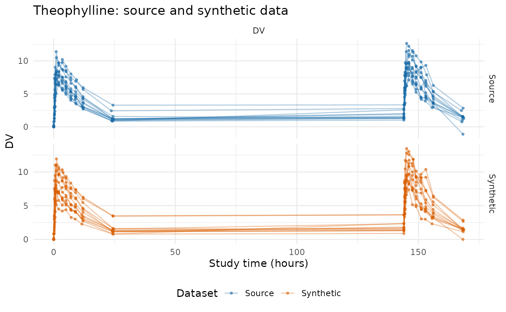
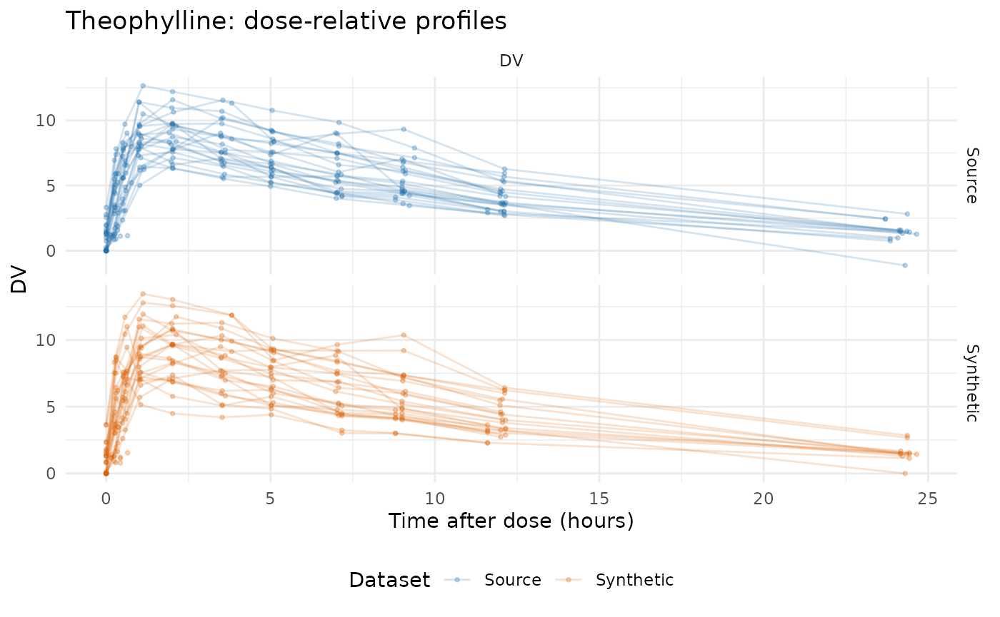
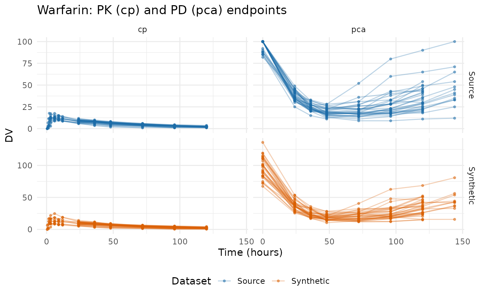
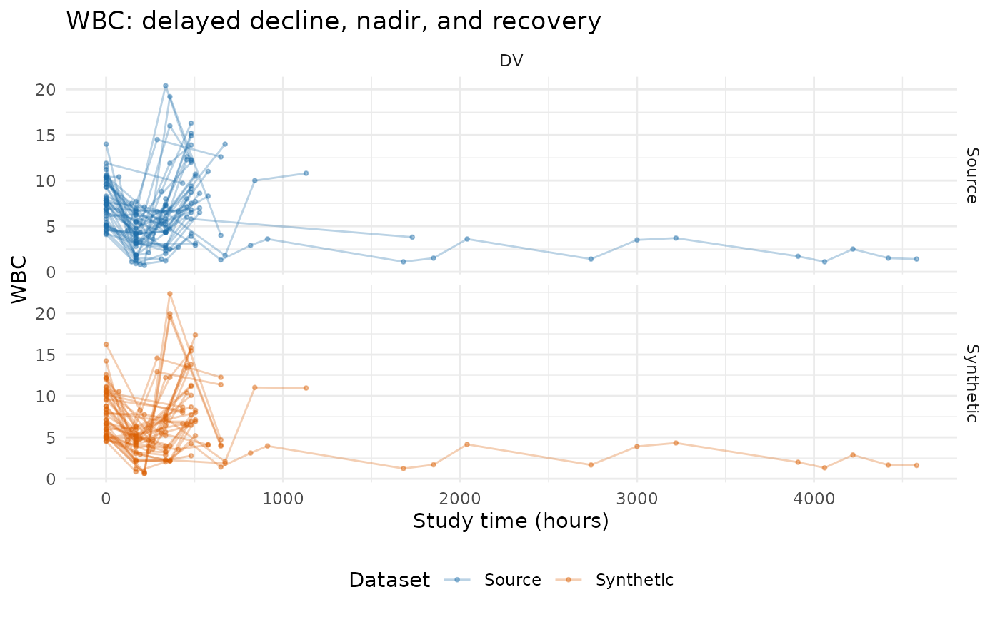
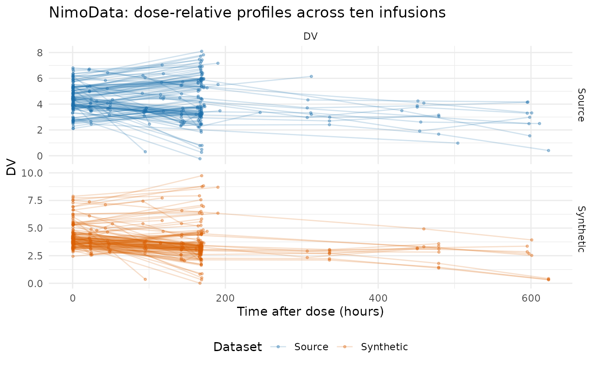
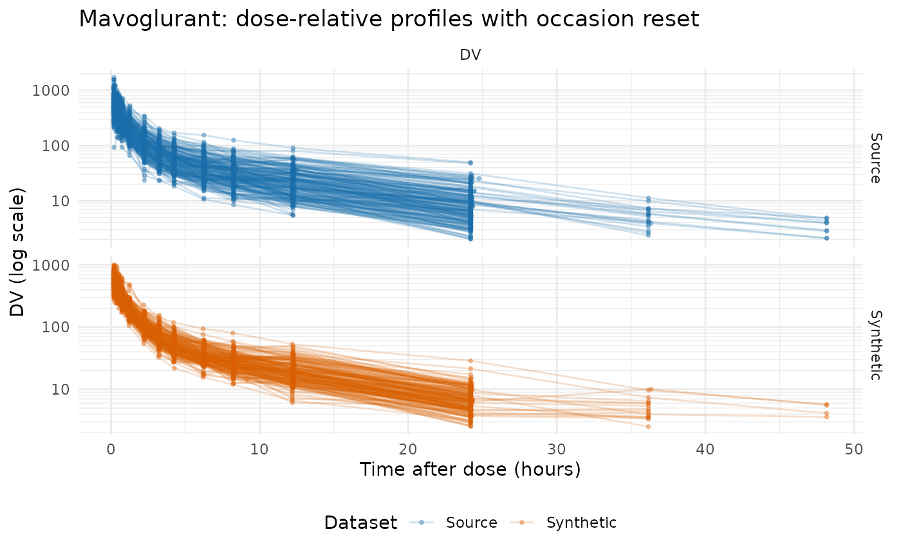
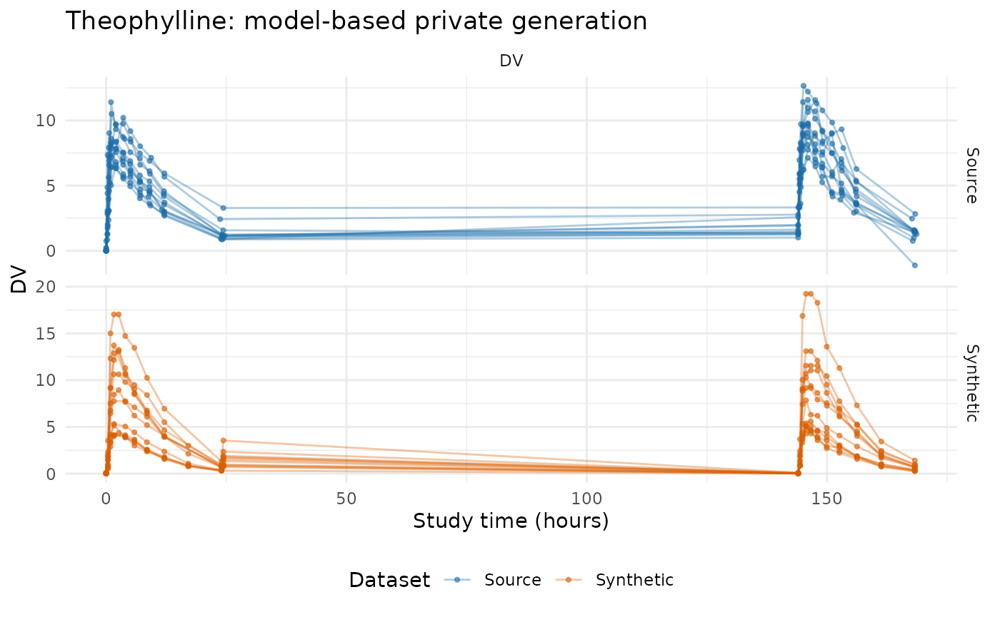

# Using synpmx

This vignette compares five source datasets against their synthetic
counterparts, so it needs a few helpers to pull observed rows into a
common shape and plot them. They are ordinary plotting code, not part of
the package API; expand the block if you want to reuse them.

Plotting helpers used throughout this vignette

``` r

observed_plot_data <- function(data, roles, dataset,
                               clock = "study_time") {
  observed <- as.character(data[[roles$evid]]) %in% c("0", "0.0")
  if (!is.null(roles$mdv)) {
    observed <- observed & as.character(data[[roles$mdv]]) %in% c("0", "0.0")
  }
  observed <- observed & !is.na(data[[roles$dv]])
  observation_rows <- which(observed)
  occasion <- rep(1L, length(observation_rows))
  tad <- rep(NA_real_, length(observation_rows))
  if (!is.null(roles$occasion)) {
    declared <- suppressWarnings(as.integer(
      data[[roles$occasion]][observation_rows]
    ))
    valid <- !is.na(declared) & declared >= 1L
    occasion[valid] <- declared[valid]
  }
  if (!is.null(roles$tad)) {
    declared <- suppressWarnings(as.numeric(data[[roles$tad]][observation_rows]))
    valid <- is.finite(declared)
    tad[valid] <- pmax(0, declared[valid])
  }
  subject_values <- data[[roles$id]]
  for (id in unique(subject_values[observation_rows])) {
    subject_rows <- which(!is.na(subject_values) & subject_values == id)
    events <- !(as.character(data[[roles$evid]][subject_rows]) %in%
                  c("0", "0.0"))
    if (!is.null(roles$amt)) {
      events <- events & as.numeric(data[[roles$amt]][subject_rows]) > 0
    }
    positions <- which(subject_values[observation_rows] == id)
    event_rows <- subject_rows[events]
    if (length(event_rows) && !is.null(roles$occasion)) {
      event_occasion <- suppressWarnings(as.integer(
        data[[roles$occasion]][event_rows]
      ))
      for (position in positions) {
        candidates <- event_rows[event_occasion == occasion[position]]
        if (length(candidates) && !is.finite(tad[position])) {
          origin <- min(as.numeric(data[[roles$time]][candidates]))
          tad[position] <-
            as.numeric(data[[roles$time]][observation_rows[position]]) - origin
        }
      }
    } else if (length(event_rows)) {
      dose_times <- sort(unique(as.numeric(data[[roles$time]][event_rows])))
      occasion[positions] <- pmax(1L, findInterval(
        as.numeric(data[[roles$time]][observation_rows[positions]]),
        dose_times
      ))
      occasion[positions] <- pmin(occasion[positions], length(dose_times))
      tad[positions] <-
        as.numeric(data[[roles$time]][observation_rows[positions]]) -
        dose_times[occasion[positions]]
    }
  }
  plotted_time <- if (identical(clock, "tad")) tad else
    as.numeric(data[[roles$time]][observation_rows])
  data.frame(
    dataset = factor(dataset, levels = c("Source", "Synthetic")),
    subject = as.character(data[[roles$id]][observation_rows]),
    time = plotted_time,
    dv = as.numeric(data[[roles$dv]][observation_rows]),
    occasion = occasion,
    endpoint = if (is.null(roles$dvid)) "DV" else
      as.character(data[[roles$dvid]][observation_rows]),
    stringsAsFactors = FALSE
  )
}

tad_plot_data <- function(data, roles, dataset) {
  out <- observed_plot_data(data, roles, dataset, clock = "tad")
  names(out)[names(out) == "time"] <- "tad"
  out
}

demo_design_summary <- function(data, roles, dataset, time_bounds,
                                clock = "study_time") {
  plotted <- observed_plot_data(data, roles, dataset, clock)
  if (!identical(clock, "tad")) {
    plotted <- plotted[
      plotted$time >= time_bounds[1L] & plotted$time <= time_bounds[2L],
      , drop = FALSE
    ]
  }
  cohort_ids <- as.character(unique(data[[roles$id]]))
  pieces <- lapply(sort(unique(plotted$endpoint)), function(endpoint) {
    rows <- plotted[plotted$endpoint == endpoint, , drop = FALSE]
    counts <- table(factor(rows$subject, levels = cohort_ids))
    data.frame(
      dataset = dataset,
      endpoint = endpoint,
      patients = length(cohort_ids),
      patients_with_endpoint = sum(counts > 0),
      observations = nrow(rows),
      mean_time_points_per_patient = mean(counts),
      median_time_points_per_patient = stats::median(counts),
      first_time = min(rows$time),
      last_time = max(rows$time),
      stringsAsFactors = FALSE
    )
  })
  do.call(rbind, pieces)
}

check_demo_similarity <- function(source, synthetic, roles, time_bounds,
                                  label, clock = "study_time") {
  source_subjects <- length(unique(source[[roles$id]]))
  synthetic_subjects <- length(unique(synthetic[[roles$id]]))
  if (source_subjects != synthetic_subjects) {
    stop(label, ": source and synthetic patient counts differ (",
         source_subjects, " versus ", synthetic_subjects, ").")
  }
  source_summary <- demo_design_summary(
    source, roles, "Source", time_bounds, clock
  )
  synthetic_summary <- demo_design_summary(
    synthetic, roles, "Synthetic", time_bounds, clock
  )
  if (!setequal(source_summary$endpoint, synthetic_summary$endpoint)) {
    stop(label, ": source and synthetic endpoint sets differ.")
  }
  paired <- merge(
    source_summary, synthetic_summary, by = "endpoint",
    suffixes = c("_source", "_synthetic")
  )
  point_difference <- abs(
    paired$mean_time_points_per_patient_synthetic -
      paired$mean_time_points_per_patient_source
  )
  point_allowance <- pmax(
    1, 0.25 * paired$mean_time_points_per_patient_source
  )
  if (any(point_difference > point_allowance)) {
    stop(label, ": mean time points per patient differ materially for ",
         paste(paired$endpoint[point_difference > point_allowance],
               collapse = ", "), ".")
  }
  coverage_allowance <- 0.20 * diff(time_bounds)
  bad_coverage <-
    abs(paired$first_time_synthetic - paired$first_time_source) >
      coverage_allowance |
    abs(paired$last_time_synthetic - paired$last_time_source) >
      coverage_allowance
  if (any(bad_coverage)) {
    stop(label, ": source and synthetic time coverage differs materially for ",
         paste(paired$endpoint[bad_coverage], collapse = ", "), ".")
  }
  summary <- rbind(source_summary, synthetic_summary)
  summary$dataset <- factor(
    summary$dataset, levels = c("Source", "Synthetic")
  )
  summary[order(summary$dataset, summary$endpoint), , drop = FALSE]
}

comparison_facets <- function(data) {
  ggplot2::facet_grid(dataset ~ endpoint, scales = "free_y")
}

source_synthetic_preview <- function(source, synthetic, n = 6L) {
  columns <- intersect(names(source), names(synthetic))
  source_rows <- utils::head(source[, columns, drop = FALSE], n)
  synthetic_rows <- utils::head(synthetic[, columns, drop = FALSE], n)
  source_rows$.dataset <- "Source"
  synthetic_rows$.dataset <- "Synthetic"
  out <- rbind(source_rows, synthetic_rows)
  rownames(out) <- NULL
  out[, c(".dataset", columns), drop = FALSE]
}
```

## What this package is for

`synpmx` creates **synthetic pharmacometric data for model-workflow
exploration**: data to develop and debug cleaning, joins, reshaping,
plotting, control-file plumbing, and repeated-dose or longitudinal
analysis code, so that a pipeline runs unchanged against the real data
later.

The package offers four generation modes, and the “Introduction to
synpmx” vignette applies all four to one dataset side by side:

- **AVATAR blending**
  ([`synpmx_avatar()`](https://iamstein.github.io/synpmx/reference/synpmx_avatar.md))
  — build each synthetic subject from real subjects. No elicitation, no
  formal privacy guarantee.
- **Prior only**
  ([`synpmx_prior()`](https://iamstein.github.io/synpmx/reference/synpmx_prior.md)
  on a public structural model) — read no data at all.
- **Calibration**
  ([`synpmx_calibrated()`](https://iamstein.github.io/synpmx/reference/synpmx_calibrated.md))
  — simulate from a public structural model whose magnitude is corrected
  by a small differentially private release.
- **Empirical**
  ([`synpmx_empirical()`](https://iamstein.github.io/synpmx/reference/synpmx_empirical.md))
  — release a dense set of differentially private summaries and rebuild
  subjects from them.

**Most of this vignette is about the default, AVATAR blending**, applied
to five public datasets with different structural challenges. For each
generated subject it samples a compatible source subject’s event
skeleton as a template, then fills the covariates and endpoint
trajectories with a distance-weighted blend of similar subjects, plus
subject and residual noise. The output has the source schema, fresh
identifiers, and the same cohort size. The final section runs the
model-based path on the same theophylline data, as
`scripts/demo_nlmixr2data.R` does for all five.

AVATAR output is **not** anonymous and carries **no formal privacy
guarantee**. It is synthetic data for a trusted computing environment,
in the same spirit as Novartis’s `synadam` (which resamples each column
marginally from the data). It is not appropriate for parameter
estimation, inference, model selection, or clinical decisions. When the
generated data must cross a trust boundary, use one of the
differentially private modes instead;
[`vignette("synpmx-privacy")`](https://iamstein.github.io/synpmx/articles/synpmx-privacy.md)
works through that decision and the tradeoff behind it.

## Shared workflow

Every example follows the same three steps:

1.  declare column meanings with
    [`pmx_roles()`](https://iamstein.github.io/synpmx/reference/pmx_roles.md);
2.  synthesize with
    [`synpmx_avatar()`](https://iamstein.github.io/synpmx/reference/synpmx_avatar.md);
3.  validate structure with
    [`validate_pmx()`](https://iamstein.github.io/synpmx/reference/validate_pmx.md)
    and compare to the source.

Identifiers, schema, classes, and factor levels are restored on output.
The caller’s random-number state is left untouched; reproducibility
comes from the `seed` argument.

## Theophylline: repeated dosing, dose-relative PK

`theo_md` has 12 subjects on a repeated oral regimen with a single
concentration endpoint.

``` r

data("theo_md", package = "nlmixr2data")
theo_roles <- pmx_roles(
  id = "ID", time = "TIME", dv = "DV", amt = "AMT",
  evid = "EVID", cmt = "CMT", covariates = "WT"
)
theo_synth <- synpmx_avatar(theo_md, theo_roles, seed = 303)
#> Warning: Synthetic generation used documented small-group/profile fallbacks:
#> - `k` was reduced to 1 in at least one compatible event-pattern group.
#> - A compatible event-pattern group supplied fewer than two non-anchor donors.
#> - A compatible event-pattern group contained only its anchor; the anchor was used as the sole measurement donor and randomized noise supplied the only trajectory perturbation.
validate_pmx(theo_synth, theo_roles)$valid
#> [1] TRUE
knitr::kable(
  source_synthetic_preview(theo_md, theo_synth),
  caption = "Actual Theophylline rows and synthesized rows"
)
```

| .dataset  |  ID | TIME |         DV |     AMT | EVID | CMT |       WT |
|:----------|----:|-----:|-----------:|--------:|-----:|----:|---------:|
| Source    |   1 | 0.00 |  0.0000000 | 319.992 |  101 |   1 | 79.60000 |
| Source    |   1 | 0.00 |  0.7400000 |   0.000 |    0 |   2 | 79.60000 |
| Source    |   1 | 0.25 |  2.8400000 |   0.000 |    0 |   2 | 79.60000 |
| Source    |   1 | 0.57 |  6.5700000 |   0.000 |    0 |   2 | 79.60000 |
| Source    |   1 | 1.12 | 10.5000000 |   0.000 |    0 |   2 | 79.60000 |
| Source    |   1 | 2.02 |  9.6600000 |   0.000 |    0 |   2 | 79.60000 |
| Synthetic |  13 | 0.00 |  0.0000000 | 319.365 |  101 |   1 | 70.37768 |
| Synthetic |  13 | 0.00 |  0.0114675 |   0.000 |    0 |   2 | 70.37768 |
| Synthetic |  13 | 0.27 |  3.5907442 |   0.000 |    0 |   2 | 70.37768 |
| Synthetic |  13 | 0.58 |  4.0689484 |   0.000 |    0 |   2 | 70.37768 |
| Synthetic |  13 | 1.02 |  8.7113683 |   0.000 |    0 |   2 | 70.37768 |
| Synthetic |  13 | 2.02 |  8.4550748 |   0.000 |    0 |   2 | 70.37768 |

Actual Theophylline rows and synthesized rows {.table}

``` r

knitr::kable(
  check_demo_similarity(theo_md, theo_synth, theo_roles, c(0, 170),
                        "Theophylline"),
  digits = 2, caption = "Theophylline cohort and sampling-design checks"
)
```

| dataset | endpoint | patients | patients_with_endpoint | observations | mean_time_points_per_patient | median_time_points_per_patient | first_time | last_time |
|:---|:---|---:|---:|---:|---:|---:|---:|---:|
| Source | DV | 12 | 12 | 264 | 22 | 22 | 0 | 168.65 |
| Synthetic | DV | 12 | 12 | 264 | 22 | 22 | 0 | 168.65 |

Theophylline cohort and sampling-design checks {.table}

``` r

theo_comparison <- rbind(
  observed_plot_data(theo_md, theo_roles, "Source"),
  observed_plot_data(theo_synth, theo_roles, "Synthetic")
)
ggplot2::ggplot(
  theo_comparison,
  ggplot2::aes(time, dv, group = interaction(dataset, subject),
               colour = dataset)
) +
  ggplot2::geom_line(alpha = 0.35) +
  ggplot2::geom_point(alpha = 0.55, size = 0.8) +
  comparison_facets(theo_comparison) +
  ggplot2::scale_colour_manual(values = comparison_colours) +
  ggplot2::labs(
    x = "Study time (hours)", y = "DV", colour = "Dataset",
    title = "Theophylline: source and synthetic data"
  ) +
  ggplot2::theme_minimal() +
  ggplot2::theme(legend.position = "bottom")
```



A dose-relative display makes the coarse curve shape easier to see.
AVATAR preserves the rise-and-fall because it blends real subject
profiles rather than inventing a shape.

``` r

theo_tad <- rbind(
  tad_plot_data(theo_md, theo_roles, "Source"),
  tad_plot_data(theo_synth, theo_roles, "Synthetic")
)
ggplot2::ggplot(
  theo_tad,
  ggplot2::aes(tad, dv, group = interaction(dataset, subject, occasion),
               colour = dataset)
) +
  ggplot2::geom_line(alpha = 0.18) +
  ggplot2::geom_point(alpha = 0.25, size = 0.7) +
  comparison_facets(theo_tad) +
  ggplot2::scale_colour_manual(values = comparison_colours) +
  ggplot2::labs(
    x = "Time after dose (hours)", y = "DV", colour = "Dataset",
    title = "Theophylline: dose-relative profiles"
  ) +
  ggplot2::theme_minimal() +
  ggplot2::theme(legend.position = "bottom")
```



## Warfarin: separate PK and PD endpoints

`warfarin` has a lower-case schema, one dose, and two endpoints (`cp`
and `pca`) with factor covariates. Both endpoints and all subjects are
retained.

``` r

data("warfarin", package = "nlmixr2data")
warfarin_roles <- pmx_roles(
  id = "id", time = "time", dv = "dv", amt = "amt", evid = "evid",
  dvid = "dvid", covariates = c("wt", "age", "sex")
)
warfarin_synth <- synpmx_avatar(warfarin, warfarin_roles, seed = 404)
#> Warning: Synthetic generation used documented small-group/profile fallbacks:
#> - A compatible event-pattern group contained only its anchor; the anchor was used as the sole measurement donor and randomized noise supplied the only trajectory perturbation.
#> - `k` was reduced to 1 in at least one compatible event-pattern group.
#> - A compatible event-pattern group supplied fewer than two non-anchor donors.
#> - `k` was reduced to 3 in at least one compatible event-pattern group.
#> - `k` was reduced to 2 in at least one compatible event-pattern group.
validate_pmx(warfarin_synth, warfarin_roles)$valid
#> [1] TRUE
knitr::kable(
  source_synthetic_preview(warfarin, warfarin_synth),
  caption = "Actual Warfarin rows and synthesized rows"
)
```

| .dataset  |  id | time | amt |        dv | dvid | evid |       wt | age | sex  |
|:----------|----:|-----:|----:|----------:|:-----|-----:|---------:|----:|:-----|
| Source    |   1 |  0.0 | 100 |   0.00000 | cp   |    1 | 66.70000 |  50 | male |
| Source    |   1 |  0.5 |   0 |   0.00000 | cp   |    0 | 66.70000 |  50 | male |
| Source    |   1 |  1.0 |   0 |   1.90000 | cp   |    0 | 66.70000 |  50 | male |
| Source    |   1 |  2.0 |   0 |   3.30000 | cp   |    0 | 66.70000 |  50 | male |
| Source    |   1 |  3.0 |   0 |   6.60000 | cp   |    0 | 66.70000 |  50 | male |
| Source    |   1 |  6.0 |   0 |   9.10000 | cp   |    0 | 66.70000 |  50 | male |
| Synthetic |  34 |  0.0 | 123 |   0.00000 | cp   |    1 | 82.10065 |  31 | male |
| Synthetic |  34 |  0.0 |   0 | 136.01276 | pca  |    0 | 82.10065 |  31 | male |
| Synthetic |  34 |  1.5 |   0 |  16.53175 | cp   |    0 | 82.10065 |  31 | male |
| Synthetic |  34 |  3.0 |   0 |  21.84664 | cp   |    0 | 82.10065 |  31 | male |
| Synthetic |  34 |  6.0 |   0 |  24.79523 | cp   |    0 | 82.10065 |  31 | male |
| Synthetic |  34 | 12.0 |   0 |  18.90499 | cp   |    0 | 82.10065 |  31 | male |

Actual Warfarin rows and synthesized rows {.table}

``` r

knitr::kable(
  check_demo_similarity(warfarin, warfarin_synth, warfarin_roles, c(0, 130),
                        "Warfarin"),
  digits = 2, caption = "Warfarin cohort and endpoint checks"
)
```

| dataset | endpoint | patients | patients_with_endpoint | observations | mean_time_points_per_patient | median_time_points_per_patient | first_time | last_time |
|:---|:---|---:|---:|---:|---:|---:|---:|---:|
| Source | cp | 32 | 32 | 251 | 7.84 | 6 | 0.5 | 120 |
| Source | pca | 32 | 32 | 219 | 6.84 | 7 | 0.0 | 120 |
| Synthetic | cp | 32 | 32 | 243 | 7.59 | 6 | 0.5 | 120 |
| Synthetic | pca | 32 | 32 | 222 | 6.94 | 7 | 0.0 | 120 |

Warfarin cohort and endpoint checks {.table}

``` r

warfarin_comparison <- rbind(
  observed_plot_data(warfarin, warfarin_roles, "Source"),
  observed_plot_data(warfarin_synth, warfarin_roles, "Synthetic")
)
ggplot2::ggplot(
  warfarin_comparison,
  ggplot2::aes(time, dv, group = interaction(dataset, subject),
               colour = dataset)
) +
  ggplot2::geom_line(alpha = 0.3) +
  ggplot2::geom_point(alpha = 0.5, size = 0.8) +
  comparison_facets(warfarin_comparison) +
  ggplot2::scale_colour_manual(values = comparison_colours) +
  ggplot2::labs(
    x = "Time (hours)", y = "DV", colour = "Dataset",
    title = "Warfarin: PK (cp) and PD (pca) endpoints"
  ) +
  ggplot2::theme_minimal() +
  ggplot2::theme(legend.position = "bottom")
```



## WBC: infusion and a delayed response

`wbcSim` has infusion start/stop events and a study-time
white-blood-cell response with a delayed decline, nadir, and recovery.
Some source dosing schedules are unique; when a compatible event-pattern
group contains only its anchor,
[`synpmx_avatar()`](https://iamstein.github.io/synpmx/reference/synpmx_avatar.md)
uses that anchor as the sole donor and randomized noise supplies the
perturbation, which it reports through a warning.

``` r

data("wbcSim", package = "nlmixr2data")
wbc_roles <- pmx_roles(
  id = "ID", time = "TIME", dv = "DV", amt = "AMT", evid = "EVID", cmt = "CMT"
)
wbc_synth <- suppressWarnings(synpmx_avatar(wbcSim, wbc_roles, seed = 505))
#> synpmx_avatar(): dropped 4 undeclared column(s): RATE, V2I, V1I, CLI.
#>   Declare a column in `keep` to carry it through verbatim.
validate_pmx(wbc_synth, wbc_roles)$valid
#> [1] TRUE
knitr::kable(
  check_demo_similarity(wbcSim, wbc_synth, wbc_roles, c(0, 720), "WBC"),
  digits = 2, caption = "WBC cohort and follow-up checks"
)
```

| dataset | endpoint | patients | patients_with_endpoint | observations | mean_time_points_per_patient | median_time_points_per_patient | first_time | last_time |
|:---|:---|---:|---:|---:|---:|---:|---:|---:|
| Source | DV | 45 | 45 | 160 | 3.56 | 4 | 0 | 672 |
| Synthetic | DV | 45 | 45 | 152 | 3.38 | 4 | 0 | 672 |

WBC cohort and follow-up checks {.table}

``` r

wbc_comparison <- rbind(
  observed_plot_data(wbcSim, wbc_roles, "Source"),
  observed_plot_data(wbc_synth, wbc_roles, "Synthetic")
)
ggplot2::ggplot(
  wbc_comparison,
  ggplot2::aes(time, dv, group = interaction(dataset, subject),
               colour = dataset)
) +
  ggplot2::geom_line(alpha = 0.3) +
  ggplot2::geom_point(alpha = 0.4, size = 0.7) +
  comparison_facets(wbc_comparison) +
  ggplot2::scale_colour_manual(values = comparison_colours) +
  ggplot2::labs(
    x = "Study time (hours)", y = "WBC", colour = "Dataset",
    title = "WBC: delayed decline, nadir, and recovery"
  ) +
  ggplot2::theme_minimal() +
  ggplot2::theme(legend.position = "bottom")
```



## NimoData: infusions, occasions, and a dose group

`nimoData` has ten approximately weekly infusions, declared OCC/TAD, and
a nominal dose group (`DOS`). The dose group is carried through with
`keep`, which copies it verbatim from the same subject that supplied the
doses, so it stays coherent with them. The redundant `WGT` column is
simply left undeclared, so AVATAR drops it.

``` r

data("nimoData", package = "nlmixr2data")
nimo_roles <- pmx_roles(
  id = "ID", time = "TIME", dv = "DV", amt = "AMT", evid = "EVID",
  rate = "RATE", mdv = "MDV", tad = "TAD", occasion = "OCC",
  covariates = c("BSA", "AGE", "HGT"), keep = "DOS"
)
nimo_synth <- suppressWarnings(synpmx_avatar(nimoData, nimo_roles, seed = 606))
#> synpmx_avatar(): dropped 1 undeclared column(s): WGT.
#>   Declare a column in `keep` to carry it through verbatim.
validate_pmx(nimo_synth, nimo_roles)$valid
#> [1] TRUE
knitr::kable(
  check_demo_similarity(nimoData, nimo_synth, nimo_roles, c(0, 3000),
                        "NimoData", clock = "tad"),
  digits = 2, caption = "NimoData cohort and infusion checks"
)
```

| dataset | endpoint | patients | patients_with_endpoint | observations | mean_time_points_per_patient | median_time_points_per_patient | first_time | last_time |
|:---|:---|---:|---:|---:|---:|---:|---:|---:|
| Source | DV | 12 | 12 | 321 | 26.75 | 27 | 0 | 623.03 |
| Synthetic | DV | 12 | 12 | 325 | 27.08 | 27 | 0 | 623.03 |

NimoData cohort and infusion checks {.table}

``` r

nimo_comparison <- rbind(
  tad_plot_data(nimoData, nimo_roles, "Source"),
  tad_plot_data(nimo_synth, nimo_roles, "Synthetic")
)
ggplot2::ggplot(
  nimo_comparison,
  ggplot2::aes(tad, dv, group = interaction(dataset, subject, occasion),
               colour = dataset)
) +
  ggplot2::geom_line(alpha = 0.2) +
  ggplot2::geom_point(alpha = 0.35, size = 0.7) +
  comparison_facets(nimo_comparison) +
  ggplot2::scale_colour_manual(values = comparison_colours) +
  ggplot2::labs(
    x = "Time after dose (hours)", y = "DV", colour = "Dataset",
    title = "NimoData: dose-relative profiles across ten infusions"
  ) +
  ggplot2::theme_minimal() +
  ggplot2::theme(legend.position = "bottom")
```



## Mavoglurant: occasion-reset clock and a carried dose column

`mavoglurant` has one- and two-period profiles, a `TIME` axis that
resets within occasion, an occasion-varying `DOSE`, numeric-coded `SEX`,
and infusion rows. The reset clock validates within ID and occasion.
AVATAR copies the whole event template from one anchor, so `DOSE` stays
coherent with the doses when carried through with `keep`.

``` r

data("mavoglurant", package = "nlmixr2data")
mavo_roles <- pmx_roles(
  id = "ID", time = "TIME", dv = "DV", amt = "AMT", evid = "EVID",
  cmt = "CMT", rate = "RATE", mdv = "MDV", occasion = "OCC",
  keep = "DOSE", covariates = c("AGE", "SEX", "WT", "HT")
)
mavo_synth <- suppressWarnings(synpmx_avatar(mavoglurant, mavo_roles,
                                              seed = 707))
validate_pmx(mavo_synth, mavo_roles)$valid
#> [1] TRUE
knitr::kable(
  check_demo_similarity(mavoglurant, mavo_synth, mavo_roles, c(0, 120),
                        "Mavoglurant", clock = "tad"),
  digits = 2, caption = "Mavoglurant cohort and occasion checks"
)
```

| dataset | endpoint | patients | patients_with_endpoint | observations | mean_time_points_per_patient | median_time_points_per_patient | first_time | last_time |
|:---|:---|---:|---:|---:|---:|---:|---:|---:|
| Source | DV | 120 | 120 | 2427 | 20.23 | 24 | 0.2 | 48.17 |
| Synthetic | DV | 120 | 120 | 2312 | 19.27 | 24 | 0.2 | 48.17 |

Mavoglurant cohort and occasion checks {.table}

``` r

mavo_comparison <- rbind(
  tad_plot_data(mavoglurant, mavo_roles, "Source"),
  tad_plot_data(mavo_synth, mavo_roles, "Synthetic")
)
mavo_plot <- ggplot2::ggplot(
  mavo_comparison,
  ggplot2::aes(tad, dv, group = interaction(dataset, subject, occasion),
               colour = dataset)
) +
  ggplot2::geom_line(alpha = 0.2) +
  ggplot2::geom_point(alpha = 0.35, size = 0.7) +
  comparison_facets(mavo_comparison) +
  ggplot2::scale_colour_manual(values = comparison_colours) +
  ggplot2::labs(
    x = "Time after dose (hours)", y = "DV (log scale)", colour = "Dataset",
    title = "Mavoglurant: dose-relative profiles with occasion reset"
  ) +
  ggplot2::theme_minimal() +
  ggplot2::theme(legend.position = "bottom")
# Mavoglurant concentrations span orders of magnitude, so a log y axis reads
# better. Use xgxr's log scale when available, otherwise a plain log10 scale.
mavo_plot + if (requireNamespace("xgxr", quietly = TRUE)) {
  xgxr::xgx_scale_y_log10()
} else {
  ggplot2::scale_y_log10()
}
```



## The model-based path on the same data

Everything above blends real subjects. The alternative is to fit a
public model to the data through an accounted release and simulate from
it, which is what `scripts/demo_nlmixr2data.R` does for all five
datasets. Repeating it here for theophylline shows how much more must be
declared, and what is bought.

The empirical engine measures the trajectory shape from the data through
noised summaries. Every clipping range, contribution limit, and budget
share is an explicit public input:

``` r

theo_private <- synpmx_empirical(
  data = theo_md, roles = theo_roles,
  endpoints = list(cp = pmx_endpoint(
    alignment = "dose_relative", transform = "log", shape = "occasion", cmt = 2
  )),
  epsilon = 5, delta = 0,
  bounds = pmx_bounds(
    time = c(0, 170), endpoints = list(cp = c(0, 30)), amt = c(0, 500),
    covariates = list(WT = c(40, 130))
  ),
  public_design = pmx_public_design(
    pmx_schema(theo_md), dose_evid = 101, dose_cmt = 1
  ),
  contribution_limits = pmx_contribution_limits(40, 8, 8, 30, 11),
  budget_allocation = pmx_budget_allocation(
    subject_count = 0.10, event = 0.15, timing = 0.15,
    covariates = 0.10, endpoints = 0.50, censoring = 0
  ),
  seed = 707,
  backend = "public", public_source = TRUE   # theo_md is public; no DP claim
)
validate_pmx(theo_private, theo_roles)$valid
#> [1] TRUE
sampling_summary(theo_private)
#>   endpoint occasion sampling_probability observations_if_sampled
#> 1       cp        1            1.0000000                10.16667
#> 2       cp        2            0.8333333                 1.00000
#> 3       cp        3            0.0000000                 0.00000
#> 4       cp        4            0.0000000                 0.00000
#> 5       cp        5            0.0000000                 0.00000
#> 6       cp        6            0.0000000                 0.00000
#> 7       cp        7            1.0000000                11.00000
#>   expected_observations                       basis
#> 1            10.1666667 privacy_accounted_inference
#> 2             0.8333333 privacy_accounted_inference
#> 3             0.0000000 privacy_accounted_inference
#> 4             0.0000000 privacy_accounted_inference
#> 5             0.0000000 privacy_accounted_inference
#> 6             0.0000000 privacy_accounted_inference
#> 7            11.0000000 privacy_accounted_inference
```

The confidential data is read once, at the moment
[`synpmx_empirical()`](https://iamstein.github.io/synpmx/reference/synpmx_empirical.md)
is called. The release it produced travels with the returned dataset, so
any number of further datasets can be drawn from it as post-processing,
without spending more budget:

``` r

theo_private_2 <- synpmx_generate(theo_private, seed = 708)   # spends nothing
```

Reach for
[`synpmx_generate()`](https://iamstein.github.io/synpmx/reference/synpmx_generate.md)
rather than calling
[`synpmx_empirical()`](https://iamstein.github.io/synpmx/reference/synpmx_empirical.md)
a second time — a second call is a second release, and its budget has to
be composed with the first.

``` r

theo_private_comparison <- rbind(
  observed_plot_data(theo_md, theo_roles, "Source"),
  observed_plot_data(theo_private, theo_roles, "Synthetic")
)
ggplot2::ggplot(
  theo_private_comparison,
  ggplot2::aes(time, dv, group = interaction(dataset, subject),
               colour = dataset)
) +
  ggplot2::geom_line(alpha = 0.35) +
  ggplot2::geom_point(alpha = 0.55, size = 0.8) +
  comparison_facets(theo_private_comparison) +
  ggplot2::scale_colour_manual(values = comparison_colours) +
  ggplot2::labs(
    x = "Study time (hours)", y = "DV", colour = "Dataset",
    title = "Theophylline: model-based private generation"
  ) +
  ggplot2::theme_minimal() +
  ggplot2::theme(legend.position = "bottom")
```



Because `theo_md` is already public, this demonstration uses the guarded
public-fixture backend, which is **noiseless and makes no DP claim** —
exactly as the demo script does. A confidential fit uses the default
OpenDP backend and fails closed when it is unavailable. The
[`synpmx_calibrated()`](https://iamstein.github.io/synpmx/reference/synpmx_calibrated.md)
mode, which asserts curve shape from a public structural model and
privately calibrates only the magnitude, is the better choice at this
cohort size; the introduction vignette runs it on this same dataset.

## What is preserved, and what is not

This section describes the AVATAR output shown above.

Preserved: schema, column classes, factor levels, cohort size, endpoint
set, event structure, coarse regimen and sampling timing, and the broad
shape and magnitude of each endpoint.

Not preserved, by design: exact source distributions, parameter
estimates, covariate-response relationships, and rare individual
trajectories. Identifiers are always freshly generated and never reuse a
source value.

Not provided: any formal privacy guarantee. The synthetic data is built
by blending real subject trajectories, so it is appropriate for a
trusted environment, not for release across a trust boundary. See
[`vignette("synpmx-method")`](https://iamstein.github.io/synpmx/articles/synpmx-method.md)
for all four modes side by side and
[`vignette("synpmx-privacy")`](https://iamstein.github.io/synpmx/articles/synpmx-privacy.md)
for what differential privacy does and does not promise.
