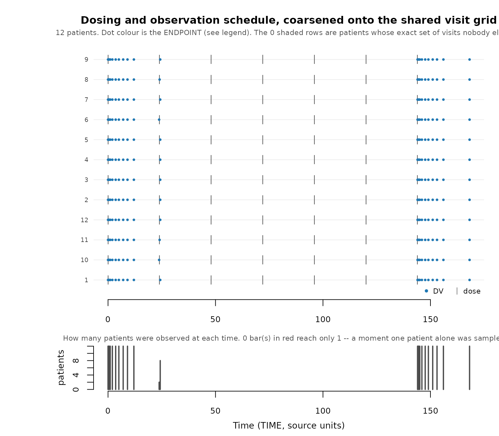

# Demo: Using synpmx AVATAR with 5 datasets

This vignette compares five source datasets against their synthetic
counterparts, so it needs a few helpers to pull observed rows into a
common shape and plot them. They are ordinary plotting code, not part of
the package API; expand the block if you want to reuse them.

Plotting helpers used throughout this vignette

``` r

observed_plot_data <- function(data, roles, dataset,
                               clock = "study_time") {
  observed <- as.character(data[[roles$evid]]) %in% c("0", "0.0")
  if (!is.null(roles$mdv)) {
    observed <- observed & as.character(data[[roles$mdv]]) %in% c("0", "0.0")
  }
  observed <- observed & !is.na(data[[roles$dv]])
  observation_rows <- which(observed)
  occasion <- rep(1L, length(observation_rows))
  tad <- rep(NA_real_, length(observation_rows))
  if (!is.null(roles$occasion)) {
    declared <- suppressWarnings(as.integer(
      data[[roles$occasion]][observation_rows]
    ))
    valid <- !is.na(declared) & declared >= 1L
    occasion[valid] <- declared[valid]
  }
  if (!is.null(roles$tad)) {
    declared <- suppressWarnings(as.numeric(data[[roles$tad]][observation_rows]))
    valid <- is.finite(declared)
    tad[valid] <- pmax(0, declared[valid])
  }
  subject_values <- data[[roles$id]]
  for (id in unique(subject_values[observation_rows])) {
    subject_rows <- which(!is.na(subject_values) & subject_values == id)
    events <- !(as.character(data[[roles$evid]][subject_rows]) %in%
                  c("0", "0.0"))
    if (!is.null(roles$amt)) {
      events <- events & as.numeric(data[[roles$amt]][subject_rows]) > 0
    }
    positions <- which(subject_values[observation_rows] == id)
    event_rows <- subject_rows[events]
    if (length(event_rows) && !is.null(roles$occasion)) {
      event_occasion <- suppressWarnings(as.integer(
        data[[roles$occasion]][event_rows]
      ))
      for (position in positions) {
        candidates <- event_rows[event_occasion == occasion[position]]
        if (length(candidates) && !is.finite(tad[position])) {
          origin <- min(as.numeric(data[[roles$time]][candidates]))
          tad[position] <-
            as.numeric(data[[roles$time]][observation_rows[position]]) - origin
        }
      }
    } else if (length(event_rows)) {
      dose_times <- sort(unique(as.numeric(data[[roles$time]][event_rows])))
      occasion[positions] <- pmax(1L, findInterval(
        as.numeric(data[[roles$time]][observation_rows[positions]]),
        dose_times
      ))
      occasion[positions] <- pmin(occasion[positions], length(dose_times))
      tad[positions] <-
        as.numeric(data[[roles$time]][observation_rows[positions]]) -
        dose_times[occasion[positions]]
    }
  }
  plotted_time <- if (identical(clock, "tad")) tad else
    as.numeric(data[[roles$time]][observation_rows])
  data.frame(
    dataset = factor(dataset, levels = c("Source", "Synthetic")),
    subject = as.character(data[[roles$id]][observation_rows]),
    time = plotted_time,
    dv = as.numeric(data[[roles$dv]][observation_rows]),
    occasion = occasion,
    endpoint = if (is.null(roles$dvid)) "DV" else
      as.character(data[[roles$dvid]][observation_rows]),
    stringsAsFactors = FALSE
  )
}

tad_plot_data <- function(data, roles, dataset) {
  out <- observed_plot_data(data, roles, dataset, clock = "tad")
  names(out)[names(out) == "time"] <- "tad"
  out
}

demo_design_summary <- function(data, roles, dataset, time_bounds,
                                clock = "study_time") {
  plotted <- observed_plot_data(data, roles, dataset, clock)
  if (!identical(clock, "tad")) {
    plotted <- plotted[
      plotted$time >= time_bounds[1L] & plotted$time <= time_bounds[2L],
      , drop = FALSE
    ]
  }
  cohort_ids <- as.character(unique(data[[roles$id]]))
  pieces <- lapply(sort(unique(plotted$endpoint)), function(endpoint) {
    rows <- plotted[plotted$endpoint == endpoint, , drop = FALSE]
    counts <- table(factor(rows$subject, levels = cohort_ids))
    data.frame(
      dataset = dataset,
      endpoint = endpoint,
      patients = length(cohort_ids),
      patients_with_endpoint = sum(counts > 0),
      observations = nrow(rows),
      mean_time_points_per_patient = mean(counts),
      median_time_points_per_patient = stats::median(counts),
      first_time = min(rows$time),
      last_time = max(rows$time),
      stringsAsFactors = FALSE
    )
  })
  do.call(rbind, pieces)
}

check_demo_similarity <- function(source, synthetic, roles, time_bounds,
                                  label, clock = "study_time") {
  source_subjects <- length(unique(source[[roles$id]]))
  synthetic_subjects <- length(unique(synthetic[[roles$id]]))
  if (source_subjects != synthetic_subjects) {
    stop(label, ": source and synthetic patient counts differ (",
         source_subjects, " versus ", synthetic_subjects, ").")
  }
  source_summary <- demo_design_summary(
    source, roles, "Source", time_bounds, clock
  )
  synthetic_summary <- demo_design_summary(
    synthetic, roles, "Synthetic", time_bounds, clock
  )
  if (!setequal(source_summary$endpoint, synthetic_summary$endpoint)) {
    stop(label, ": source and synthetic endpoint sets differ.")
  }
  paired <- merge(
    source_summary, synthetic_summary, by = "endpoint",
    suffixes = c("_source", "_synthetic")
  )
  point_difference <- abs(
    paired$mean_time_points_per_patient_synthetic -
      paired$mean_time_points_per_patient_source
  )
  point_allowance <- pmax(
    1, 0.25 * paired$mean_time_points_per_patient_source
  )
  if (any(point_difference > point_allowance)) {
    stop(label, ": mean time points per patient differ materially for ",
         paste(paired$endpoint[point_difference > point_allowance],
               collapse = ", "), ".")
  }
  coverage_allowance <- 0.20 * diff(time_bounds)
  bad_coverage <-
    abs(paired$first_time_synthetic - paired$first_time_source) >
      coverage_allowance |
    abs(paired$last_time_synthetic - paired$last_time_source) >
      coverage_allowance
  if (any(bad_coverage)) {
    stop(label, ": source and synthetic time coverage differs materially for ",
         paste(paired$endpoint[bad_coverage], collapse = ", "), ".")
  }
  summary <- rbind(source_summary, synthetic_summary)
  summary$dataset <- factor(
    summary$dataset, levels = c("Source", "Synthetic")
  )
  summary[order(summary$dataset, summary$endpoint), , drop = FALSE]
}

comparison_facets <- function(data) {
  ggplot2::facet_grid(dataset ~ endpoint, scales = "free_y")
}

source_synthetic_preview <- function(source, synthetic, n = 6L) {
  columns <- intersect(names(source), names(synthetic))
  source_rows <- utils::head(source[, columns, drop = FALSE], n)
  synthetic_rows <- utils::head(synthetic[, columns, drop = FALSE], n)
  source_rows$.dataset <- "Source"
  synthetic_rows$.dataset <- "Synthetic"
  out <- rbind(source_rows, synthetic_rows)
  rownames(out) <- NULL
  out[, c(".dataset", columns), drop = FALSE]
}

# The full masking accounting for one run. `pmx_masking_report()` owns the row
# labels and the explanation next to each one, so this vignette and the study
# reports under `scripts_private/` cannot drift apart; only the caption is local.
masking_table <- function(source, roles, synthetic, label) {
  knitr::kable(
    as.data.frame(pmx_masking_report(synthetic, source, roles)),
    row.names = FALSE, align = c("l", "r", "l"),
    caption = paste0("Everything ", label,
                     "'s run removed, and what was left to build on.")
  )
}
```

## What this package is for

`synpmx` creates **synthetic pharmacometric data for model-workflow
exploration**: data to develop and debug cleaning, joins, reshaping,
plotting, control-file plumbing, and repeated-dose or longitudinal
analysis code, so that a pipeline runs unchanged against the real data
later.

The package offers four generation modes, and the “Introduction to
synpmx” vignette applies all four to one dataset side by side:

- **AVATAR blending** \[1, 2\]
  ([`synpmx_avatar()`](https://iamstein.github.io/synpmx/reference/synpmx_avatar.md))
  — build each synthetic subject from real subjects. No elicitation, no
  formal privacy guarantee.
- **Prior only**
  ([`synpmx_prior()`](https://iamstein.github.io/synpmx/reference/synpmx_prior.md)
  on a public structural model) — read no data at all.
- **Calibration**
  ([`synpmx_calibrated()`](https://iamstein.github.io/synpmx/reference/synpmx_calibrated.md))
  — simulate from a public structural model whose magnitude is corrected
  by a small differentially private release.
- **Empirical**
  ([`synpmx_empirical()`](https://iamstein.github.io/synpmx/reference/synpmx_empirical.md))
  — release a dense set of differentially private summaries and rebuild
  subjects from them.

“AVATAR” is a method name rather than an initialism, from the
patient-centric *avatarization* literature: the original method is due
to Guillaudeux and colleagues \[2\], and Destere and colleagues
benchmark a modified AVATAR for population PK \[1\]. This package
implements an AVATAR-*inspired* adaptation for longitudinal event
tables, not published AVATAR software.

**Most of this vignette is about the default, AVATAR blending**, applied
to five public datasets with different structural challenges. For each
generated subject it samples a compatible source subject’s event
skeleton as a template, then fills the covariates and endpoint
trajectories with a distance-weighted blend of similar subjects, plus
subject and residual noise. The output has the source schema, fresh
identifiers, and the same cohort size. The final section runs the
model-based path on the same theophylline data, as
`scripts/demo_nlmixr2data.R` does for all five.

AVATAR output is **not** anonymous and carries **no formal privacy
guarantee**. It is synthetic data that stays under the source data’s
access controls and confidentiality obligations, in the same spirit as
Novartis’s `synadam` (which resamples each column marginally from the
data). Those obligations follow the data rather than the machine, so
working with it on a local workstation covered by the same controls is a
supported use. It is not appropriate for parameter estimation,
inference, model selection, or clinical decisions. When the generated
data would reach anyone the source data could not, use one of the
differentially private modes instead;
[`vignette("synpmx-privacy")`](https://iamstein.github.io/synpmx/articles/synpmx-privacy.md)
works through that decision and the tradeoff behind it.

## Shared workflow

Every example follows the same three steps:

1.  declare column meanings with
    [`pmx_roles()`](https://iamstein.github.io/synpmx/reference/pmx_roles.md);
2.  synthesize with
    [`synpmx_avatar()`](https://iamstein.github.io/synpmx/reference/synpmx_avatar.md);
3.  validate structure with
    [`validate_pmx()`](https://iamstein.github.io/synpmx/reference/validate_pmx.md)
    and compare to the source.

Identifiers, schema, classes, and factor levels are restored on output.
The caller’s random-number state is left untouched; reproducibility
comes from the `seed` argument.

## What the masking does, and what it costs

Enough happens by default that it is worth naming the five mechanisms
before looking at any data. The AVATAR algorithm article walks through
each in detail. AVATAR blends every avatar’s **measurements** from
several real donors, so no single patient’s numbers survive. But the
**event skeleton** — the pattern of when a patient was dosed and sampled
— is copied verbatim from one real anchor, and blending never touches
it. Five mechanisms act on that skeleton, and every one of them works by
*removing* something:

The article numbers them **M1 to M5, in the order they run**; the same
order is used here.

|  | Mechanism | Acts on | Why |
|----|----|----|----|
| **M1** | Snap every time onto a shared visit grid, then add deviations back from a cohort-wide pool (`coarsen_time`) | **all times** — dose events *and* DV observations | As recorded, one patient’s list of times is very often unique to them. A *pooled* deviation restores realism without giving the patient their own back |
| **M2** | Drop patients from the **anchor pool** (`screen`, `on_donor_shortfall`) | whole source patients | Follow-up or dose count over **2× the cohort’s 90th percentile** would give any avatar a conspicuous skeleton; a route arm under `k + 1` has too few donors to blend with |
| **M3** | Redraw which visits an avatar attended (`min_pattern_share`) | **DV observations only** — dose events untouched | A combination of missed visits held by one patient is a fingerprint made of gaps |
| **M4** | Blend covariates and DV from donors, capped (`k`, `max_donor_weight`) | measured values | No avatar’s numbers come from one real patient |
| **M5** | Recompute the dose amount (automatic) | dose amounts, under **weight-based** (mg/kg) or BSA (mg/m²) dosing | A copied dose under mg/kg discloses the anchor’s weight exactly |

[`flag_identifiable_subjects()`](https://iamstein.github.io/synpmx/reference/flag_identifiable_subjects.md)
runs after generation and is deliberately **not** in this table: it is a
plausibility check rather than a masking step, and
[`synpmx_avatar()`](https://iamstein.github.io/synpmx/reference/synpmx_avatar.md)
does not run it for you. The algorithm article explains why.

### How you check whether it worked

Three measurements, because an avatar can point back at a real patient
in three independent ways. A study can pass one and fail another, so
none substitutes for the rest.

| Function | Asks | Run on | Target |
|----|----|----|----|
| [`skeleton_uniqueness()`](https://iamstein.github.io/synpmx/reference/skeleton_uniqueness.md) | Is anyone’s **observation schedule** unique — the list of times they were sampled at? Separately, is anyone’s **dosing** unique? | source, before generating | 0 unique |
| [`flag_identifiable_subjects()`](https://iamstein.github.io/synpmx/reference/flag_identifiable_subjects.md) | Does anyone **stand out** on follow-up length, dose count, dose size, or peak DV? | synthetic output | nothing flagged |
| [`compare_pmx_proximity()`](https://iamstein.github.io/synpmx/reference/compare_pmx_proximity.md) | Did a synthetic patient’s **covariates and DV trajectory together** land nearer a real patient than real patients lie to each other? | the pair, after | near 0.5 |

Sampling and dosing are scored separately and only the first is what
“schedule” means here: the observation time vector excludes dose rows
entirely. Dosing uniqueness is a different number, and **coarsening does
not touch it** — a study with weight-based dosing leaves patients unique
on dose however good the visit grid is.

The headline count is **one number split by cause**, and the split says
what to do next:

- **unique observation schedule** — patients whose list of observation
  times nobody else shares. Drive this to zero. It is always the sum of
  the next two.
  - **unique observation time** — sampled at a clock time nobody else
    was. *A grid can fix this*; that is what `coarsen_time` is for, and
    a nonzero count after coarsening means declaring `nominal_time` is
    the fix.
  - **unique set of visits** — every time shared, but this combination
    of attended and missed visits is theirs. *No grid can fix this* at
    any resolution. `min_pattern_share` addresses it during generation;
    otherwise remediate or accept.

None of this is free, and the costs differ sharply by dataset. So **each
dataset below ends with its own full accounting** — how many patients
were excluded and why, how many visit sets were lost and who held them,
how many subjects still hold a schedule nobody shares. The tables are
deliberately verbose. Reading one takes a minute; not reading it means
shipping a dataset without knowing what came out of it.

Two quantities are worth learning to read first, because they are the
ones that surprise people:

- **“Unique observation schedule”** — a patient whose list of
  observation times no other patient shares. An avatar anchored on such
  a patient wears a schedule belonging to exactly one real person,
  however carefully its concentrations were blended. The count is split
  by cause, because the two causes have different answers: a *unique
  observation time* is the grid’s job and is fixed by declaring
  `nominal_time`, while a *unique set of visits* means visits are
  missing rather than moved, and no grid can fix it.
- **“Patterns discarded”** — a real pattern of missing visits or a dose
  interruption that will not appear in the output at all. That loss is
  the mechanism working, not a bug: it is what stops an avatar carrying
  a schedule traceable to one person. Whether the cost is acceptable is
  a per-study judgment, which is why every run reports it.

## Theophylline: repeated dosing, dose-relative PK

`theo_md` has 12 subjects on a repeated oral regimen with a single
concentration endpoint.

``` r

data("theo_md", package = "nlmixr2data")
theo_roles <- pmx_roles(
  id = "ID", time = "TIME", dv = "DV", amt = "AMT",
  evid = "EVID", cmt = "CMT", covariates = "WT"
)
theo_synth <- synpmx_avatar(theo_md, theo_roles, seed = 303)
#> synpmx_avatar(): no `dvid` declared, so every observation is treated as one endpoint.
#>   Correct for a single-endpoint study; declare `dvid` if this one has more.
#> Warning: Synthetic generation used documented small-group/profile fallbacks:
#> - Fewer than 5 same-schedule donors were available for at least one
#>   subject; the nearest donors from other dose/schedule groups on the same
#>   route were borrowed to reach the floor, so some measurements are blended
#>   across doses.
validate_pmx(theo_synth, theo_roles)$valid
#> [1] TRUE
knitr::kable(
  source_synthetic_preview(theo_md, theo_synth),
  caption = "Actual Theophylline rows and synthesized rows"
)
```

| .dataset  |  ID |      TIME |         DV |     AMT | EVID | CMT |       WT |
|:----------|----:|----------:|-----------:|--------:|-----:|----:|---------:|
| Source    |   1 | 0.0000000 |  0.0000000 | 319.992 |  101 |   1 | 79.60000 |
| Source    |   1 | 0.0000000 |  0.7400000 |   0.000 |    0 |   2 | 79.60000 |
| Source    |   1 | 0.2500000 |  2.8400000 |   0.000 |    0 |   2 | 79.60000 |
| Source    |   1 | 0.5700000 |  6.5700000 |   0.000 |    0 |   2 | 79.60000 |
| Source    |   1 | 1.1200000 | 10.5000000 |   0.000 |    0 |   2 | 79.60000 |
| Source    |   1 | 2.0200000 |  9.6600000 |   0.000 |    0 |   2 | 79.60000 |
| Synthetic |  13 | 0.0000000 |  0.0000000 | 319.365 |  101 |   1 | 67.54081 |
| Synthetic |  13 | 0.0000000 |  0.0052007 |   0.000 |    0 |   2 | 67.54081 |
| Synthetic |  13 | 0.2441667 |  1.9837550 |   0.000 |    0 |   2 | 67.54081 |
| Synthetic |  13 | 0.5658333 |  6.0679640 |   0.000 |    0 |   2 | 67.54081 |
| Synthetic |  13 | 1.0666667 |  9.8366676 |   0.000 |    0 |   2 | 67.54081 |
| Synthetic |  13 | 2.0200000 |  9.1141831 |   0.000 |    0 |   2 | 67.54081 |

Actual Theophylline rows and synthesized rows {.table}

[`compare_pmx_distributions()`](https://iamstein.github.io/synpmx/reference/compare_pmx_distributions.md)
summarizes the dependent variable per endpoint and each baseline
covariate, source against synthetic, so you can see at a glance that the
ranges line up. Expect them to be close in magnitude and shape, not
identical — AVATAR does not reproduce the source distribution exactly.
Like every source-derived diagnostic it is marked restricted and stays
inside the source data’s access controls.

``` r

theo_dist <- compare_pmx_distributions(theo_md, theo_synth, theo_roles)
knitr::kable(theo_dist$endpoints, digits = 2,
             caption = "Concentration distribution, source versus synthetic")
```

| variable | dataset   |   n | n_subjects | mean |   sd |   min |  q25 | median |  q75 |   max |
|:---------|:----------|----:|-----------:|-----:|-----:|------:|-----:|-------:|-----:|------:|
| DV       | source    | 264 |         12 | 5.53 | 3.00 | -1.13 | 3.30 |   5.74 | 7.80 | 12.66 |
| DV       | synthetic | 264 |         12 | 5.03 | 2.63 |  0.00 | 3.38 |   5.23 | 6.75 | 11.77 |

Concentration distribution, source versus synthetic {.table
style="width:100%;"}

``` r

knitr::kable(theo_dist$covariates_numeric, digits = 2,
             caption = "Baseline weight distribution, source versus synthetic")
```

| variable | dataset   |   n |  mean |   sd |   min |   q25 | median |   q75 |   max |
|:---------|:----------|----:|------:|-----:|------:|------:|-------:|------:|------:|
| WT       | source    |  12 | 69.58 | 9.50 | 54.60 | 63.57 |   70.5 | 74.43 | 86.40 |
| WT       | synthetic |  12 | 68.53 | 5.18 | 58.23 | 65.50 |   69.7 | 71.69 | 77.08 |

Baseline weight distribution, source versus synthetic {.table}

### What the masking did to theophylline

``` r

masking_table(theo_md, theo_roles, theo_synth, "theophylline")
```

| Quantity | Value | What it means |
|:---|---:|:---|
| **Who was available to build on** |  |  |
| Patients in the source | 12 |  |
|   excluded as structurally extreme | 0 (0%) | `screen`: follow-up or dose count over twice the cohort’s 90th percentile |
|   excluded, route arm too small | 0 (0%) | `on_donor_shortfall`: a route arm holding fewer than k + 1 patients |
|   left to anchor avatars on | 12 (100%) | an excluded patient still contributes as a donor |
| Avatars built | 12 | cohort size is unaffected by the exclusions above |
| **Donor pools: who may be blended with whom** |  |  |
| Administration routes | 1 | oral, infusion, and so on. Donors are NEVER blended across a route, so each is a separate pool |
| Dose/schedule groups | 11 | patients with an identical dose pattern and endpoint set. Donors are looked for here first; many small groups means the search falls back to the wider route pool |
| **How much of one real patient reaches one avatar** |  |  |
| Donor floor, k | 5 | real patients blended into each avatar |
| Largest share one donor may hold | 0.5 | `max_donor_weight` |
|   that cap actually bound on | 8 of 12 (67%) | of avatars. Near 100% means the cap, not distance, is setting the weights |
| Effective donors per avatar, mean | 3.08 | 1 / sum(w^2). This, not k, is how many patients an avatar is really made of |
| **Visit schedule: WHEN patients were observed** |  |  |
| Visit grid used | derived | no usable `nominal_time`, so a grid was inferred from the recorded times themselves. Declaring `nominal_time` is better |
| Unique observation schedules, before coarsening | 12 (100%) | patients whose list of observation times nobody else shares |
| Unique observation schedules, after coarsening | 0 (0%) | the count that matters: an avatar copies its anchor’s times verbatim |
|   because of a one-off observation time | 0 (0%) | sampled when nobody else was. Declaring `nominal_time` is the fix |
|   because of which visits they attended | 0 (0%) | every time is shared. The visits themselves are missing – a missed visit, a discontinuation, or follow-up that has not reached them – and no grid can fix that |
| **Visit sets: WHICH of those visits each patient attended** |  |  |
| Distinct visit sets in the source | 3 | a visit set is which of the shared grid visits one patient actually had |
|   held by fewer than 2 patients, so not reused | 0 (0%) | `min_pattern_share` is that threshold. These visit sets are lost, not approximated |
|   real patients holding those | 0 (0%) | those patients are NOT removed – they still anchor avatars and still act as donors. Only their particular pattern of absences stops being copied |
| Avatars given a visit set from the pool | 12 of 12 (100%) | drawn from the sets that cleared the threshold, or built from their shape – never from their own anchor alone |
|   of those, misses placed fresh | 0 of 12 (0%) | the kind of missingness was reused; exactly which visits were missed was invented |
|   of those, miss count moved | 0 of 12 (0%) | no arrangement at the wanted number of missing visits was free, so the count moved by a visit or two. Misses at the END of a record are the case that forces it, because for a given count there is exactly one such arrangement |
|   of those, a rare set swapped for a shared one | 0 of 12 (0%) | the anchor’s own set was held by nobody else and no arrangement was free, so the group’s most widely held set was used instead – less faithful to that avatar, and it discloses nothing |
|   of those, moved to a different anchor | 0 of 12 (0%) | the first anchor’s own set was shared by nobody and nothing legal could be placed, so this avatar was anchored elsewhere. Every source patient stays a donor and stays available to anchor others |
| Avatars keeping their anchor’s own visit set | 0 of 12 (0%) | not a problem in itself: if several real patients share that set, copying it identifies nobody. Only the next row is a disclosure |
| **Avatars carrying a visit set nobody else shares** | 0 (0%) | **this is the row that must be 0%.** That pattern of which visits have observations belongs to one real patient. It is non-zero only when the schedule group has no shared set to substitute; the run alerts when it happens |
|   of those, dosing re-truncated | 0 of 12 (0%) | the anchor stopped dosing at a depth nobody else used, so the avatar stops at a different one – shared, or used by nobody. Truncating a schedule to a real dose time is protocol-valid in a way that moving dose times is not |
| Distinct dose schedules in the source | 1 |  |
|   represented in the synthetic cohort | 1 (100%) | a regimen only one patient received cannot be given to an avatar without pointing at them, so it is not represented at all. This is the cost of the guarantee below, and on a small cohort it is unavoidable rather than a setting to tune |
| **Avatars carrying a dose schedule nobody else shares** | 0 (0%) | **must also be 0%.** Dose events are copied from the anchor verbatim, so patients whose dose times nobody shares are not built upon. Non-zero only when EVERY patient is in that position, which individualised dosing can cause |
| **Dose** |  |  |
| Amounts recomputed from a covariate | **no** | the 11 distinct dose amounts are not a fixed multiple of any declared covariate: WT (8 ratio levels for 11 distinct amounts – too many to be a protocol) |
|   so `amt` is copied verbatim | from the anchor | each avatar’s implied dose per kg is therefore its anchor’s, not its own, and the amount still encodes one real patient’s covariate. Declare `dose_covariate` if this study is weight- or BSA-based |

Everything theophylline’s run removed, and what was left to build on.
{.table}

**This is the easy case, and it is worth understanding why.** Nothing
was excluded: no subject is structurally extreme, and with one route
there is no arm below the donor floor, so all twelve subjects were
available to anchor on and twelve avatars were built.

The interesting row is the schedule pair. **All twelve patients start
out with a unique observation schedule** — their observation times are
recorded at full precision and no two patients were sampled at exactly
the same moment, so every one of them holds a list of times nobody else
shares. After coarsening the count is **zero**. The inferred grid found
the shared visit structure underneath the recorded times and pulled
everyone onto it. That is the coarsening mechanism doing its entire job.

The visit-set rows follow from it. Before coarsening every subject holds
its own visit set — twelve for twelve subjects, since no two were
sampled at the same moments. Afterwards there are three, each shared by
several subjects, so **nothing had to be discarded** and no arrangement
had to be invented. This is the ideal case: coarsening removes the
timing exposure, and visit-set sampling then has a real pool to draw
from and costs nothing.

**Dose is not recomputed here, and this is the case that shows why you
should say so explicitly.** Theophylline *is* dosed by weight, but the
recorded milligrams per kilogram range from 3.1 to 5.9 across subjects —
8 distinct ratio levels for 11 distinct amounts. Detection deliberately
fails closed on that rather than impose a multiplier the study did not
actually use, which is the right call for an inference engine and the
wrong answer for this study. The run report says so rather than leaving
a blank:

``` r

attr(theo_synth, "pmx_settings")$dose_basis_note
#> [1] "the 11 distinct dose amounts are not a fixed multiple of any declared covariate: WT (8 ratio levels for 11 distinct amounts -- too many to be a protocol)"
```

Naming the covariate in
[`pmx_roles()`](https://iamstein.github.io/synpmx/reference/pmx_roles.md)
skips the inference and holds each dose row’s own ratio:

``` r

theo_roles_dosed <- pmx_roles(
  id = "ID", time = "TIME", dv = "DV", amt = "AMT", evid = "EVID",
  cmt = "CMT", covariates = "WT", dose_covariate = "WT"
)
theo_declared <- suppressWarnings(
  synpmx_avatar(theo_md, theo_roles_dosed, seed = 303)
)
#> synpmx_avatar(): no `dvid` declared, so every observation is treated as one endpoint.
#>   Correct for a single-endpoint study; declare `dvid` if this one has more.
per_kg <- function(x) {
  dosed <- x[x$EVID != 0, ]
  range(dosed$AMT / dosed$WT)
}
data.frame(
  dataset = c("source", "synthetic, inferred", "synthetic, declared"),
  rbind(per_kg(theo_md), per_kg(theo_synth), per_kg(theo_declared))
) |> setNames(c("dataset", "min mg/kg", "max mg/kg")) |>
  knitr::kable(digits = 2, caption = paste(
    "Dose per kilogram. Declared, each avatar carries its anchor's own ratio,",
    "so the synthetic cohort spans the source's range; inferred, the amount is",
    "the anchor's milligrams over the avatar's blended weight."))
```

| dataset             | min mg/kg | max mg/kg |
|:--------------------|----------:|----------:|
| source              |      3.10 |      5.86 |
| synthetic, inferred |      3.65 |      5.50 |
| synthetic, declared |      3.10 |      5.86 |

Dose per kilogram. Declared, each avatar carries its anchor’s own ratio,
so the synthetic cohort spans the source’s range; inferred, the amount
is the anchor’s milligrams over the avatar’s blended weight. {.table}

Two costs of leaving it inferred, both visible above. The synthetic
mg/kg no longer matches the study’s own dosing rule, and the copied
milligrams still encode one real patient’s weight exactly.

[`skeleton_uniqueness()`](https://iamstein.github.io/synpmx/reference/skeleton_uniqueness.md)
is what produced the “before” number. Read it directly and it summarizes
the cohort two ways: how many patients are unique and why, and how
crowded each schedule is. Every column of the returned data frame counts
*how many patients share this property, this patient included*, so `1`
always means “nobody else”. By default it scores the recorded times as
given; `coarsen_time = TRUE` scores the shared visit grid
[`synpmx_avatar()`](https://iamstein.github.io/synpmx/reference/synpmx_avatar.md)
builds, so running it both ways shows what coarsening removed.

``` r

skeleton_uniqueness(theo_md, theo_roles)
```

**Schedule-uniqueness screen.** Scored on the recorded times AS GIVEN,
before any coarsening.
[`synpmx_avatar()`](https://iamstein.github.io/synpmx/reference/synpmx_avatar.md)
coarsens first by default, so run this again with `coarsen_time = TRUE`
to see what the grid removes.

12 of 12 patients (100%) have an observation schedule nobody else has:
12 from a one-off observation time, 0 from which visits they attended.
Declaring `nominal_time` addresses the first group; nothing addresses
the second.

Those 12 are not necessarily far apart. The typical one differs from its
nearest neighbour by 28 of about 22 visit slots (range 20 to 32), where
a slot is one endpoint measured at one time. A difference of one or two
is a missed sample, not a different schedule – which is why the count
alone is a poor guide.

This is a property of the SOURCE, and nothing in generation can lower
it. What generation controls is whether an avatar ends up wearing one of
these schedules – that is
[`pmx_masking_report()`](https://iamstein.github.io/synpmx/reference/pmx_masking_report.md)’s
“avatars keeping their anchor’s own visit set”, which should be near 0%
however high the count above is.

| Patients whose … | n | % of cohort | Meaning |
|:---|---:|---:|:---|
| Observation schedule nobody else has | 12 | 100 | the headline: an avatar anchored here wears one real patient’s schedule |
| … a one-off observation time | 12 | 100 | sampled when nobody else was. A time grid can absorb this: declare `nominal_time` |
| … the set of visits attended | 0 | 0 | every time is shared. A missed visit, a discontinuation, or follow-up that has not reached the later visits. No grid touches this |
| Observation count nobody else has | 0 | 0 | survives any grid; the residual [`flag_identifiable_subjects()`](https://iamstein.github.io/synpmx/reference/flag_identifiable_subjects.md) looks at |
| Dosing nobody else has | 10 | 83 | dose amounts and gaps. Weight-based dosing makes this near-universal |

**How crowded is each schedule** (1 = nobody else has it):

| Patients sharing that schedule | Patients | % of cohort |
|-------------------------------:|---------:|------------:|
|                              1 |       12 |         100 |

*One row per patient is in the returned data frame;
[`plot_pmx_schedule()`](https://iamstein.github.io/synpmx/reference/plot_pmx_schedule.md)
draws the same cohort. Source-derived; not releasable unless separately
public or privately budgeted.*

``` r

skeleton_uniqueness(theo_md, theo_roles, coarsen_time = TRUE)
```

**Schedule-uniqueness screen.** Scored AFTER coarsening, on the shared
visit grid
[`synpmx_avatar()`](https://iamstein.github.io/synpmx/reference/synpmx_avatar.md)
builds. These are the numbers a run reports.

Every patient shares their observation schedule with somebody. Nothing
to do.

This is a property of the SOURCE, and nothing in generation can lower
it. What generation controls is whether an avatar ends up wearing one of
these schedules – that is
[`pmx_masking_report()`](https://iamstein.github.io/synpmx/reference/pmx_masking_report.md)’s
“avatars keeping their anchor’s own visit set”, which should be near 0%
however high the count above is.

| Patients whose … | n | % of cohort | Meaning |
|:---|---:|---:|:---|
| Observation schedule nobody else has | 0 | 0 | the headline: an avatar anchored here wears one real patient’s schedule |
| … a one-off observation time | 0 | 0 | sampled when nobody else was. A time grid can absorb this: declare `nominal_time` |
| … the set of visits attended | 0 | 0 | every time is shared. A missed visit, a discontinuation, or follow-up that has not reached the later visits. No grid touches this |
| Observation count nobody else has | 0 | 0 | survives any grid; the residual [`flag_identifiable_subjects()`](https://iamstein.github.io/synpmx/reference/flag_identifiable_subjects.md) looks at |
| Dosing nobody else has | 10 | 83 | dose amounts and gaps. Weight-based dosing makes this near-universal |

**How crowded is each schedule** (1 = nobody else has it):

| Patients sharing that schedule | Patients | % of cohort |
|-------------------------------:|---------:|------------:|
|                              2 |        4 |          33 |
|                              8 |        8 |          67 |

*One row per patient is in the returned data frame;
[`plot_pmx_schedule()`](https://iamstein.github.io/synpmx/reference/plot_pmx_schedule.md)
draws the same cohort. Source-derived; not releasable unless separately
public or privately budgeted.*

[`plot_pmx_schedule()`](https://iamstein.github.io/synpmx/reference/plot_pmx_schedule.md)
draws the same cohort: one row per patient, one mark per event, with the
visit grid underneath. A protocol grid reads as vertical stripes and
follow-up ending as a ragged right edge, so a count that looks alarming
and one that is ordinary look completely different.

``` r

plot_pmx_schedule(theo_md, theo_roles)
```



For a per-subject check on the *generated* data rather than the source,
[`flag_identifiable_subjects()`](https://iamstein.github.io/synpmx/reference/flag_identifiable_subjects.md)
scores each synthetic subject for being a structural outlier and
[`remediate_identifiable_subjects()`](https://iamstein.github.io/synpmx/reference/remediate_identifiable_subjects.md)
removes or shortens the ones it flags. Those find subjects that are
*extreme*;
[`skeleton_uniqueness()`](https://iamstein.github.io/synpmx/reference/skeleton_uniqueness.md)
finds patients whose *schedule is unique*.


A dose-relative display makes the coarse curve shape easier to see.
AVATAR preserves the rise-and-fall because it blends real subject
profiles rather than inventing a shape.


## Warfarin: separate PK and PD endpoints

`warfarin` has a lower-case schema, one dose, and two endpoints (`cp`
and `pca`) with factor covariates. Both endpoints and all subjects are
retained.

    #> SYNPMX ALERT: unique visit sets
    #>   12 of 32 patients (38%) share every individual observation time with
    #>   somebody, but the set of visits they have observations at is theirs alone
    #>   -- a missed visit, a discontinuation, or follow-up that has not reached
    #>   the later visits.
    #>   Why it matters: no time grid can help here, however fine or coarse: a
    #>     grid decides where the visits are, not which ones a patient turned up
    #>     for.
    #>   Fix: `min_pattern_share` already stops these sets being reused (see the
    #>     run report). Screen the result with `flag_identifiable_subjects()` if
    #>     it still matters.
    #> SYNPMX NOTE: rare visit sets not reused
    #>   4 of 14 distinct visit sets, held by 4 patients, are shared by fewer than
    #>   2 patients and are given to no avatar.
    #>   Why it matters: an avatar carrying a visit set unique to one real patient
    #>     could be traced back to them. Kept instead: how many visits were missed
    #>     and of what kind -- all at the end (follow-up ending), a run in the
    #>     middle (an interruption), or scattered. Which specific visits were
    #>     missed is not preserved.
    #>   What to do: nothing, unless this study's interruptions matter.
    #>     `min_pattern_share = 1` copies exact visit sets and gives up the
    #>     guarantee.
    #> Warning: Synthetic generation used documented small-group/profile fallbacks:
    #> - Fewer than 5 same-schedule donors were available for at least one
    #>   subject; the nearest donors from other dose/schedule groups on the same
    #>   route were borrowed to reach the floor, so some measurements are blended
    #>   across doses.


### What the masking did to warfarin

``` r

masking_table(warfarin, warfarin_roles, warfarin_synth, "warfarin")
```

| Quantity | Value | What it means |
|:---|---:|:---|
| **Who was available to build on** |  |  |
| Patients in the source | 32 |  |
|   excluded as structurally extreme | 0 (0%) | `screen`: follow-up or dose count over twice the cohort’s 90th percentile |
|   excluded, route arm too small | 0 (0%) | `on_donor_shortfall`: a route arm holding fewer than k + 1 patients |
|   left to anchor avatars on | 32 (100%) | an excluded patient still contributes as a donor |
| Avatars built | 32 | cohort size is unaffected by the exclusions above |
| **Donor pools: who may be blended with whom** |  |  |
| Administration routes | 1 | oral, infusion, and so on. Donors are NEVER blended across a route, so each is a separate pool |
| Dose/schedule groups | 20 | patients with an identical dose pattern and endpoint set. Donors are looked for here first; many small groups means the search falls back to the wider route pool |
| **How much of one real patient reaches one avatar** |  |  |
| Donor floor, k | 5 | real patients blended into each avatar |
| Largest share one donor may hold | 0.5 | `max_donor_weight` |
|   that cap actually bound on | 21 of 32 (66%) | of avatars. Near 100% means the cap, not distance, is setting the weights |
| Effective donors per avatar, mean | 2.87 | 1 / sum(w^2). This, not k, is how many patients an avatar is really made of |
| **Visit schedule: WHEN patients were observed** |  |  |
| Visit grid used | derived | no usable `nominal_time`, so a grid was inferred from the recorded times themselves. Declaring `nominal_time` is better |
| Unique observation schedules, before coarsening | 14 (44%) | patients whose list of observation times nobody else shares |
| Unique observation schedules, after coarsening | 12 (38%) | the count that matters: an avatar copies its anchor’s times verbatim |
|   because of a one-off observation time | 0 (0%) | sampled when nobody else was. Declaring `nominal_time` is the fix |
|   because of which visits they attended | 12 (38%) | every time is shared. The visits themselves are missing – a missed visit, a discontinuation, or follow-up that has not reached them – and no grid can fix that |
| **Visit sets: WHICH of those visits each patient attended** |  |  |
| Distinct visit sets in the source | 14 | a visit set is which of the shared grid visits one patient actually had |
|   held by fewer than 2 patients, so not reused | 4 (29%) | `min_pattern_share` is that threshold. These visit sets are lost, not approximated |
|   real patients holding those | 4 (12%) | those patients are NOT removed – they still anchor avatars and still act as donors. Only their particular pattern of absences stops being copied |
| Avatars given a visit set from the pool | 32 of 32 (100%) | drawn from the sets that cleared the threshold, or built from their shape – never from their own anchor alone |
|   of those, misses placed fresh | 7 of 32 (22%) | the kind of missingness was reused; exactly which visits were missed was invented |
|   of those, miss count moved | 0 of 32 (0%) | no arrangement at the wanted number of missing visits was free, so the count moved by a visit or two. Misses at the END of a record are the case that forces it, because for a given count there is exactly one such arrangement |
|   of those, a rare set swapped for a shared one | 0 of 32 (0%) | the anchor’s own set was held by nobody else and no arrangement was free, so the group’s most widely held set was used instead – less faithful to that avatar, and it discloses nothing |
|   of those, moved to a different anchor | 0 of 32 (0%) | the first anchor’s own set was shared by nobody and nothing legal could be placed, so this avatar was anchored elsewhere. Every source patient stays a donor and stays available to anchor others |
| Avatars keeping their anchor’s own visit set | 0 of 32 (0%) | not a problem in itself: if several real patients share that set, copying it identifies nobody. Only the next row is a disclosure |
| **Avatars carrying a visit set nobody else shares** | 0 (0%) | **this is the row that must be 0%.** That pattern of which visits have observations belongs to one real patient. It is non-zero only when the schedule group has no shared set to substitute; the run alerts when it happens |
|   of those, dosing re-truncated | 0 of 32 (0%) | the anchor stopped dosing at a depth nobody else used, so the avatar stops at a different one – shared, or used by nobody. Truncating a schedule to a real dose time is protocol-valid in a way that moving dose times is not |
| Distinct dose schedules in the source | 1 |  |
|   represented in the synthetic cohort | 1 (100%) | a regimen only one patient received cannot be given to an avatar without pointing at them, so it is not represented at all. This is the cost of the guarantee below, and on a small cohort it is unavoidable rather than a setting to tune |
| **Avatars carrying a dose schedule nobody else shares** | 0 (0%) | **must also be 0%.** Dose events are copied from the anchor verbatim, so patients whose dose times nobody shares are not built upon. Non-zero only when EVERY patient is in that position, which individualised dosing can cause |
| **Dose** |  |  |
| Amounts recomputed from a covariate | **yes**, from `wt` (inferred) | the 20 distinct dose amounts are a fixed multiple of `wt`, at 1 protocol level(s) |
|   protocol levels found | 1.5 | dose per unit of `wt`; every amount was snapped to the nearest of these |

Everything warfarin’s run removed, and what was left to build on.
{.table}

**This is where the costs start to show.** Again nothing was excluded —
all 32 subjects were available to anchor on — but the schedule rows tell
a different story from theophylline’s.

**Twelve patients still have a unique schedule after coarsening, and
only two of them for a reason the grid can address.** The other ten
share every one of their observation times with somebody; what singles
them out is *which* of those shared visits they attended. Warfarin has
subjects with 13, 14, 16, 17, 18, 19 and 25 observations, and the rarer
counts pick those subjects out on their own. No grid resolution helps,
because the times are already shared.

**Two of fourteen visit sets were discarded, each held by one patient.**
Those two patients stay in the cohort and keep contributing measurements
as donors — only their distinctive absences stop being reproduced. Note
that patterns discarded and patients holding them are equal: at the
default floor of 2, a pattern is discarded exactly when one patient
holds it, so the two numbers must agree. They diverge only at a floor of
3 or more.

**A quarter of avatars had their missed visits placed fresh.** The
*shape* of the missingness — how many visits were missed and whether the
misses were terminal, contiguous, or scattered — came from real patients
who share it, but the specific visits missed were placed fresh, and
rejected and redrawn if the placement happened to land on a pattern too
rare to reuse. This is what keeps the loss at 2 patterns instead of 12;
see the section on pattern strictness below.

**Dose was recomputed from weight.** Warfarin is dosed at 1.5 mg/kg to
within 0.1%, tight enough for detection to fire, so each avatar’s `amt`
comes from its own blended weight rather than from its anchor. Without
this, a copied `amt` would disclose the anchor’s weight exactly.

## WBC: infusion, a delayed response, and structural screening

`wbcSim` has infusion start/stop events and a study-time
white-blood-cell response with a delayed decline, nadir, and recovery. A
few subjects are followed far longer than the rest.

A patient followed much longer than everyone else stands out, so a
synthetic copy built from them could point back to the real person. To
lower that risk,
[`synpmx_avatar()`](https://iamstein.github.io/synpmx/reference/synpmx_avatar.md)
by default does not build an avatar from such an extreme subject,
quietly leaving the very-long follow-ups out of the synthetic data
(`screen = TRUE`). This is an informal safeguard against singling
someone out, not a formal privacy guarantee; ordinary long follow-ups
are kept, and `screen = FALSE` keeps every subject.

    #> synpmx_avatar(): no `dvid` declared, so every observation is treated as one endpoint.
    #>   Correct for a single-endpoint study; declare `dvid` if this one has more.
    #> synpmx_avatar(): dropped 4 undeclared column(s): RATE, V2I, V1I, CLI.
    #>   Declare a column in `keep` to carry it through verbatim.
    #> SYNPMX ALERT: unique observation times
    #>   2 of 45 patients (4%) were sampled at a moment no other patient was, even
    #>   after coarsening.
    #>   Why it matters: an avatar copies its anchor's observation times verbatim,
    #>     so it wears a schedule that belongs to one real patient.
    #>   Fix: declare a `nominal_time` role. Coarsening then snaps visits onto the
    #>     real protocol grid instead of a guessed one.
    #> SYNPMX ALERT: unique visit sets
    #>   15 of 45 patients (33%) share every individual observation time with
    #>   somebody, but the set of visits they have observations at is theirs alone
    #>   -- a missed visit, a discontinuation, or follow-up that has not reached
    #>   the later visits.
    #>   Why it matters: no time grid can help here, however fine or coarse: a
    #>     grid decides where the visits are, not which ones a patient turned up
    #>     for.
    #>   Fix: `min_pattern_share` already stops these sets being reused (see the
    #>     run report). Screen the result with `flag_identifiable_subjects()` if
    #>     it still matters.
    #> SYNPMX NOTE: rare visit sets not reused
    #>   5 of 25 distinct visit sets, held by 5 patients, are shared by fewer than
    #>   2 patients and are given to no avatar.
    #>   Why it matters: an avatar carrying a visit set unique to one real patient
    #>     could be traced back to them. Kept instead: how many visits were missed
    #>     and of what kind -- all at the end (follow-up ending), a run in the
    #>     middle (an interruption), or scattered. Which specific visits were
    #>     missed is not preserved.
    #>   What to do: nothing, unless this study's interruptions matter.
    #>     `min_pattern_share = 1` copies exact visit sets and gives up the
    #>     guarantee.
    #> SYNPMX NOTE: patients whose dose schedule nobody else shares
    #>   3 of 45 patients (7%) have a set of dose times no other patient has.
    #>   Why it matters: dose events are copied from the anchor verbatim, so an
    #>     avatar built on one of these would carry that patient's exact dosing.
    #>     No avatar is anchored on them; they still contribute as donors, so
    #>     their measurements still shape the output.
    #>   What to do: nothing, unless those regimens need to appear in the
    #>     synthetic data. `min_pattern_share = 1` keeps them and gives up the
    #>     guarantee.


### What the masking did to wbcSim

``` r

masking_table(wbcSim, wbc_roles, wbc_synth, "wbcSim")
```

| Quantity | Value | What it means |
|:---|---:|:---|
| **Who was available to build on** |  |  |
| Patients in the source | 45 |  |
|   excluded as structurally extreme | 2 (4%) | `screen`: follow-up or dose count over twice the cohort’s 90th percentile |
|   excluded, route arm too small | 0 (0%) | `on_donor_shortfall`: a route arm holding fewer than k + 1 patients |
|   left to anchor avatars on | 43 (96%) | an excluded patient still contributes as a donor |
| Avatars built | 45 | cohort size is unaffected by the exclusions above |
| **Donor pools: who may be blended with whom** |  |  |
| Administration routes | 1 | oral, infusion, and so on. Donors are NEVER blended across a route, so each is a separate pool |
| Dose/schedule groups | 28 | patients with an identical dose pattern and endpoint set. Donors are looked for here first; many small groups means the search falls back to the wider route pool |
| **How much of one real patient reaches one avatar** |  |  |
| Donor floor, k | 5 | real patients blended into each avatar |
| Largest share one donor may hold | 0.5 | `max_donor_weight` |
|   that cap actually bound on | 28 of 45 (62%) | of avatars. Near 100% means the cap, not distance, is setting the weights |
| Effective donors per avatar, mean | 3.05 | 1 / sum(w^2). This, not k, is how many patients an avatar is really made of |
| **Visit schedule: WHEN patients were observed** |  |  |
| Visit grid used | derived | no usable `nominal_time`, so a grid was inferred from the recorded times themselves. Declaring `nominal_time` is better |
| Unique observation schedules, before coarsening | 30 (67%) | patients whose list of observation times nobody else shares |
| Unique observation schedules, after coarsening | 17 (38%) | the count that matters: an avatar copies its anchor’s times verbatim |
|   because of a one-off observation time | 2 (4%) | sampled when nobody else was. Declaring `nominal_time` is the fix |
|   because of which visits they attended | 15 (33%) | every time is shared. The visits themselves are missing – a missed visit, a discontinuation, or follow-up that has not reached them – and no grid can fix that |
| **Visit sets: WHICH of those visits each patient attended** |  |  |
| Distinct visit sets in the source | 25 | a visit set is which of the shared grid visits one patient actually had |
|   held by fewer than 2 patients, so not reused | 5 (20%) | `min_pattern_share` is that threshold. These visit sets are lost, not approximated |
|   real patients holding those | 5 (11%) | those patients are NOT removed – they still anchor avatars and still act as donors. Only their particular pattern of absences stops being copied |
| Avatars given a visit set from the pool | 45 of 45 (100%) | drawn from the sets that cleared the threshold, or built from their shape – never from their own anchor alone |
|   of those, misses placed fresh | 1 of 45 (2%) | the kind of missingness was reused; exactly which visits were missed was invented |
|   of those, miss count moved | 0 of 45 (0%) | no arrangement at the wanted number of missing visits was free, so the count moved by a visit or two. Misses at the END of a record are the case that forces it, because for a given count there is exactly one such arrangement |
|   of those, a rare set swapped for a shared one | 0 of 45 (0%) | the anchor’s own set was held by nobody else and no arrangement was free, so the group’s most widely held set was used instead – less faithful to that avatar, and it discloses nothing |
|   of those, moved to a different anchor | 1 of 45 (2%) | the first anchor’s own set was shared by nobody and nothing legal could be placed, so this avatar was anchored elsewhere. Every source patient stays a donor and stays available to anchor others |
| Avatars keeping their anchor’s own visit set | 0 of 45 (0%) | not a problem in itself: if several real patients share that set, copying it identifies nobody. Only the next row is a disclosure |
| **Avatars carrying a visit set nobody else shares** | 0 (0%) | **this is the row that must be 0%.** That pattern of which visits have observations belongs to one real patient. It is non-zero only when the schedule group has no shared set to substitute; the run alerts when it happens |
|   of those, dosing re-truncated | 0 of 45 (0%) | the anchor stopped dosing at a depth nobody else used, so the avatar stops at a different one – shared, or used by nobody. Truncating a schedule to a real dose time is protocol-valid in a way that moving dose times is not |
| Distinct dose schedules in the source | 4 |  |
|   represented in the synthetic cohort | 1 (25%) | a regimen only one patient received cannot be given to an avatar without pointing at them, so it is not represented at all. This is the cost of the guarantee below, and on a small cohort it is unavoidable rather than a setting to tune |
| **Avatars carrying a dose schedule nobody else shares** | 0 (0%) | **must also be 0%.** Dose events are copied from the anchor verbatim, so patients whose dose times nobody shares are not built upon. Non-zero only when EVERY patient is in that position, which individualised dosing can cause |
| **Dose** |  |  |
| Amounts recomputed from a covariate | **no** | no `covariates` are declared, so there is nothing to test the amounts against |
|   so `amt` is copied verbatim | from the anchor | each avatar’s implied dose per kg is therefore its anchor’s, not its own, and the amount still encodes one real patient’s covariate. Declare `dose_covariate` if this study is weight- or BSA-based |

Everything wbcSim’s run removed, and what was left to build on. {.table}

**This is the only public dataset where the anchor screen actually
fires.** Two of the 45 subjects are followed far enough beyond the rest
to exceed twice the cohort’s 90th percentile, so no avatar is built on
them. Read the next two rows together: **43 anchors available, 45
avatars built.** The screen does not shrink the cohort — it removes
those two from the pool that avatars are *drawn from*, and the other 43
are sampled with replacement to fill the same 45 slots. The two screened
subjects also remain donors, so their measurements still contribute.
What is lost is not their data but the possibility of an avatar wearing
their distinctive follow-up length.

**Seventeen patients have a unique schedule, split six and eleven.** The
six with a unique observation time are the ones worth acting on:
`wbcSim` carries no nominal-time column, so the grid was inferred, and
declaring a real one would likely clear them. The eleven with a unique
set of attended visits are past the grid’s reach.

**Four of 25 patterns were discarded.** A larger absolute number than
warfarin’s two but a much smaller share, because 45 subjects on a common
infusion schedule produce more repetition than 32 warfarin subjects do.

Dose is not recomputed: `wbcSim` has no baseline covariate for the
amount to be proportional to, so there is nothing to detect.

## NimoData: infusions, occasions, and a dose group

`nimoData` has ten approximately weekly infusions, declared OCC/TAD, and
a nominal dose group (`DOS`). The dose group is carried through with
`keep`, which copies it verbatim from the same subject that supplied the
doses, so it stays coherent with them. The redundant `WGT` column is
simply left undeclared, so AVATAR drops it.

    #> synpmx_avatar(): no `dvid` declared, so every observation is treated as one endpoint.
    #>   Correct for a single-endpoint study; declare `dvid` if this one has more.
    #> synpmx_avatar(): dropped 1 undeclared column(s): WGT.
    #>   Declare a column in `keep` to carry it through verbatim.
    #> SYNPMX ALERT: unique observation times
    #>   12 of 12 patients (100%) were sampled at a moment no other patient was,
    #>   even after coarsening.
    #>   Why it matters: an avatar copies its anchor's observation times verbatim,
    #>     so it wears a schedule that belongs to one real patient.
    #>   Fix: declare a `nominal_time` role. Coarsening then snaps visits onto the
    #>     real protocol grid instead of a guessed one.
    #> SYNPMX NOTE: rare visit sets not reused
    #>   2 of 12 distinct visit sets, held by 2 patients, are shared by fewer than
    #>   2 patients and are given to no avatar.
    #>   Why it matters: an avatar carrying a visit set unique to one real patient
    #>     could be traced back to them. Kept instead: how many visits were missed
    #>     and of what kind -- all at the end (follow-up ending), a run in the
    #>     middle (an interruption), or scattered. Which specific visits were
    #>     missed is not preserved.
    #>   What to do: nothing, unless this study's interruptions matter.
    #>     `min_pattern_share = 1` copies exact visit sets and gives up the
    #>     guarantee.
    #> SYNPMX ALERT: no dose schedule can be masked
    #>   all 12 patients have a set of dose times nobody else shares.
    #>   Why it matters: a dose schedule is copied from its anchor verbatim --
    #>     resampling dose events would emit regimens the protocol never permitted
    #>     -- so every avatar carries one real patient's exact dosing. There is no
    #>     patient to build on instead, because every one of them is in this
    #>     position.
    #>   Fix: nothing within this study. Declaring `nominal_time` helps only if
    #>     the dose times are protocol times recorded loosely. Otherwise treat the
    #>     output as individually identifying on dosing, and use the
    #>     observation-side guarantee for what it does cover.


### What the masking did to nimoData

``` r

masking_table(nimoData, nimo_roles, nimo_synth, "nimoData")
```

| Quantity | Value | What it means |
|:---|---:|:---|
| **Who was available to build on** |  |  |
| Patients in the source | 12 |  |
|   excluded as structurally extreme | 0 (0%) | `screen`: follow-up or dose count over twice the cohort’s 90th percentile |
|   excluded, route arm too small | 0 (0%) | `on_donor_shortfall`: a route arm holding fewer than k + 1 patients |
|   left to anchor avatars on | 12 (100%) | an excluded patient still contributes as a donor |
| Avatars built | 12 | cohort size is unaffected by the exclusions above |
| **Donor pools: who may be blended with whom** |  |  |
| Administration routes | 1 | oral, infusion, and so on. Donors are NEVER blended across a route, so each is a separate pool |
| Dose/schedule groups | 12 | patients with an identical dose pattern and endpoint set. Donors are looked for here first; many small groups means the search falls back to the wider route pool |
| **How much of one real patient reaches one avatar** |  |  |
| Donor floor, k | 5 | real patients blended into each avatar |
| Largest share one donor may hold | 0.5 | `max_donor_weight` |
|   that cap actually bound on | 9 of 12 (75%) | of avatars. Near 100% means the cap, not distance, is setting the weights |
| Effective donors per avatar, mean | 2.97 | 1 / sum(w^2). This, not k, is how many patients an avatar is really made of |
| **Visit schedule: WHEN patients were observed** |  |  |
| Visit grid used | derived | no usable `nominal_time`, so a grid was inferred from the recorded times themselves. Declaring `nominal_time` is better |
| Unique observation schedules, before coarsening | 12 (100%) | patients whose list of observation times nobody else shares |
| Unique observation schedules, after coarsening | 12 (100%) | the count that matters: an avatar copies its anchor’s times verbatim |
|   because of a one-off observation time | 12 (100%) | sampled when nobody else was. Declaring `nominal_time` is the fix |
|   because of which visits they attended | 0 (0%) | every time is shared. The visits themselves are missing – a missed visit, a discontinuation, or follow-up that has not reached them – and no grid can fix that |
| **Visit sets: WHICH of those visits each patient attended** |  |  |
| Distinct visit sets in the source | 12 | a visit set is which of the shared grid visits one patient actually had |
|   held by fewer than 2 patients, so not reused | 2 (17%) | `min_pattern_share` is that threshold. These visit sets are lost, not approximated |
|   real patients holding those | 2 (17%) | those patients are NOT removed – they still anchor avatars and still act as donors. Only their particular pattern of absences stops being copied |
| Avatars given a visit set from the pool | 12 of 12 (100%) | drawn from the sets that cleared the threshold, or built from their shape – never from their own anchor alone |
|   of those, misses placed fresh | 12 of 12 (100%) | the kind of missingness was reused; exactly which visits were missed was invented |
|   of those, miss count moved | 0 of 12 (0%) | no arrangement at the wanted number of missing visits was free, so the count moved by a visit or two. Misses at the END of a record are the case that forces it, because for a given count there is exactly one such arrangement |
|   of those, a rare set swapped for a shared one | 0 of 12 (0%) | the anchor’s own set was held by nobody else and no arrangement was free, so the group’s most widely held set was used instead – less faithful to that avatar, and it discloses nothing |
|   of those, moved to a different anchor | 0 of 12 (0%) | the first anchor’s own set was shared by nobody and nothing legal could be placed, so this avatar was anchored elsewhere. Every source patient stays a donor and stays available to anchor others |
| Avatars keeping their anchor’s own visit set | 0 of 12 (0%) | not a problem in itself: if several real patients share that set, copying it identifies nobody. Only the next row is a disclosure |
| **Avatars carrying a visit set nobody else shares** | 0 (0%) | **this is the row that must be 0%.** That pattern of which visits have observations belongs to one real patient. It is non-zero only when the schedule group has no shared set to substitute; the run alerts when it happens |
|   of those, dosing re-truncated | 0 of 12 (0%) | the anchor stopped dosing at a depth nobody else used, so the avatar stops at a different one – shared, or used by nobody. Truncating a schedule to a real dose time is protocol-valid in a way that moving dose times is not |
| Distinct dose schedules in the source | 12 |  |
|   represented in the synthetic cohort | 7 (58%) | a regimen only one patient received cannot be given to an avatar without pointing at them, so it is not represented at all. This is the cost of the guarantee below, and on a small cohort it is unavoidable rather than a setting to tune |
| **Avatars carrying a dose schedule nobody else shares** | 12 (100%) | **must also be 0%.** Dose events are copied from the anchor verbatim, so patients whose dose times nobody shares are not built upon. Non-zero only when EVERY patient is in that position, which individualised dosing can cause |
| **Dose** |  |  |
| Amounts recomputed from a covariate | **no** | the 4 distinct dose amounts are not a fixed multiple of any declared covariate: BSA (10 ratio levels for 4 distinct amounts – too many to be a protocol); AGE (10 ratio levels for 4 distinct amounts – too many to be a protocol); HGT (8 ratio levels for 4 distinct amounts – too many to be a protocol) |
|   so `amt` is copied verbatim | from the anchor | each avatar’s implied dose per kg is therefore its anchor’s, not its own, and the amount still encodes one real patient’s covariate. Declare `dose_covariate` if this study is weight- or BSA-based |

Everything nimoData’s run removed, and what was left to build on.
{.table}

**This is the failure case, and it is the most instructive table in the
vignette.** Read the schedule rows: **12 of 12 unique before coarsening,
12 of 12 unique after, every one of them on a unique observation time.**
The grid achieved *nothing*.

The reason is the study design. Ten roughly-weekly infusions per subject
over a long follow-up means no two subjects were ever dosed or sampled
close enough together for the inferred grid to merge them. Every subject
is observed at moments that are theirs alone, so every avatar carries a
real visit schedule.

The visit-set rows show the same failure from the other side, and they
are the clearest illustration in the vignette of what the shape fallback
does. **No two of the twelve subjects attended the same set of visits**,
so exact matching has nothing to reuse — yet only two patterns are
recorded as discarded. The difference is the fallback: patterns that
share a *shape* (how many visits were missed, and whether the misses
were terminal, contiguous, or scattered) clear the floor together even
though no individual pattern does. Hence the row that gives the game
away: **every avatar’s arrangement was invented rather than reused,
100%.** The shape survives; which specific visits each patient missed
does not.

The two failures have one cause and one fix, and `nimoData` gets that
fix demonstrated later in this vignette: constructing a nominal time
from the protocol grid takes the unique-schedule count from 12 to 5 and
gives coarsening something to work with.

A dataset that produces this table should not be shipped as-is. Either
declare or construct `nominal_time`, or treat the avatars as carrying
real schedules.

## Mavoglurant: occasion-reset clock and a carried dose column

`mavoglurant` has one- and two-period profiles, a `TIME` axis that
resets within occasion, an occasion-varying `DOSE`, numeric-coded `SEX`,
and infusion rows. The reset clock validates within ID and occasion.
AVATAR copies the whole event template from one anchor, so `DOSE` stays
coherent with the doses when carried through with `keep`.

    #> synpmx_avatar(): no `dvid` declared, so every observation is treated as one endpoint.
    #>   Correct for a single-endpoint study; declare `dvid` if this one has more.
    #>   800 observation row(s) share a subject and time with another; that is ordinary for replicate
    #>   measurements and expected if two endpoints are being read at one visit.
    #> SYNPMX ALERT: unique observation times
    #>   11 of 120 patients (9%) were sampled at a moment no other patient was,
    #>   even after coarsening.
    #>   Why it matters: an avatar copies its anchor's observation times verbatim,
    #>     so it wears a schedule that belongs to one real patient.
    #>   Fix: declare a `nominal_time` role. Coarsening then snaps visits onto the
    #>     real protocol grid instead of a guessed one.
    #> SYNPMX ALERT: unique visit sets
    #>   53 of 120 patients (44%) share every individual observation time with
    #>   somebody, but the set of visits they have observations at is theirs alone
    #>   -- a missed visit, a discontinuation, or follow-up that has not reached
    #>   the later visits.
    #>   Why it matters: no time grid can help here, however fine or coarse: a
    #>     grid decides where the visits are, not which ones a patient turned up
    #>     for.
    #>   Fix: `min_pattern_share` already stops these sets being reused (see the
    #>     run report). Screen the result with `flag_identifiable_subjects()` if
    #>     it still matters.
    #> SYNPMX NOTE: rare visit sets not reused
    #>   2 of 73 distinct visit sets, held by 2 patients, are shared by fewer than
    #>   2 patients and are given to no avatar.
    #>   Why it matters: an avatar carrying a visit set unique to one real patient
    #>     could be traced back to them. Kept instead: how many visits were missed
    #>     and of what kind -- all at the end (follow-up ending), a run in the
    #>     middle (an interruption), or scattered. Which specific visits were
    #>     missed is not preserved.
    #>   What to do: nothing, unless this study's interruptions matter.
    #>     `min_pattern_share = 1` copies exact visit sets and gives up the
    #>     guarantee.


### What the masking did to mavoglurant

``` r

masking_table(mavoglurant, mavo_roles, mavo_synth, "mavoglurant")
```

| Quantity | Value | What it means |
|:---|---:|:---|
| **Who was available to build on** |  |  |
| Patients in the source | 120 |  |
|   excluded as structurally extreme | 0 (0%) | `screen`: follow-up or dose count over twice the cohort’s 90th percentile |
|   excluded, route arm too small | 0 (0%) | `on_donor_shortfall`: a route arm holding fewer than k + 1 patients |
|   left to anchor avatars on | 120 (100%) | an excluded patient still contributes as a donor |
| Avatars built | 120 | cohort size is unaffected by the exclusions above |
| **Donor pools: who may be blended with whom** |  |  |
| Administration routes | 1 | oral, infusion, and so on. Donors are NEVER blended across a route, so each is a separate pool |
| Dose/schedule groups | 6 | patients with an identical dose pattern and endpoint set. Donors are looked for here first; many small groups means the search falls back to the wider route pool |
| **How much of one real patient reaches one avatar** |  |  |
| Donor floor, k | 5 | real patients blended into each avatar |
| Largest share one donor may hold | 0.5 | `max_donor_weight` |
|   that cap actually bound on | 77 of 120 (64%) | of avatars. Near 100% means the cap, not distance, is setting the weights |
| Effective donors per avatar, mean | 2.96 | 1 / sum(w^2). This, not k, is how many patients an avatar is really made of |
| **Visit schedule: WHEN patients were observed** |  |  |
| Visit grid used | derived | no usable `nominal_time`, so a grid was inferred from the recorded times themselves. Declaring `nominal_time` is better |
| Unique observation schedules, before coarsening | 72 (60%) | patients whose list of observation times nobody else shares |
| Unique observation schedules, after coarsening | 64 (53%) | the count that matters: an avatar copies its anchor’s times verbatim |
|   because of a one-off observation time | 11 (9%) | sampled when nobody else was. Declaring `nominal_time` is the fix |
|   because of which visits they attended | 53 (44%) | every time is shared. The visits themselves are missing – a missed visit, a discontinuation, or follow-up that has not reached them – and no grid can fix that |
| **Visit sets: WHICH of those visits each patient attended** |  |  |
| Distinct visit sets in the source | 73 | a visit set is which of the shared grid visits one patient actually had |
|   held by fewer than 2 patients, so not reused | 2 (3%) | `min_pattern_share` is that threshold. These visit sets are lost, not approximated |
|   real patients holding those | 2 (2%) | those patients are NOT removed – they still anchor avatars and still act as donors. Only their particular pattern of absences stops being copied |
| Avatars given a visit set from the pool | 120 of 120 (100%) | drawn from the sets that cleared the threshold, or built from their shape – never from their own anchor alone |
|   of those, misses placed fresh | 0 of 120 (0%) | the kind of missingness was reused; exactly which visits were missed was invented |
|   of those, miss count moved | 0 of 120 (0%) | no arrangement at the wanted number of missing visits was free, so the count moved by a visit or two. Misses at the END of a record are the case that forces it, because for a given count there is exactly one such arrangement |
|   of those, a rare set swapped for a shared one | 0 of 120 (0%) | the anchor’s own set was held by nobody else and no arrangement was free, so the group’s most widely held set was used instead – less faithful to that avatar, and it discloses nothing |
|   of those, moved to a different anchor | 0 of 120 (0%) | the first anchor’s own set was shared by nobody and nothing legal could be placed, so this avatar was anchored elsewhere. Every source patient stays a donor and stays available to anchor others |
| Avatars keeping their anchor’s own visit set | 0 of 120 (0%) | not a problem in itself: if several real patients share that set, copying it identifies nobody. Only the next row is a disclosure |
| **Avatars carrying a visit set nobody else shares** | 0 (0%) | **this is the row that must be 0%.** That pattern of which visits have observations belongs to one real patient. It is non-zero only when the schedule group has no shared set to substitute; the run alerts when it happens |
|   of those, dosing re-truncated | 0 of 120 (0%) | the anchor stopped dosing at a depth nobody else used, so the avatar stops at a different one – shared, or used by nobody. Truncating a schedule to a real dose time is protocol-valid in a way that moving dose times is not |
| Distinct dose schedules in the source | 1 |  |
|   represented in the synthetic cohort | 1 (100%) | a regimen only one patient received cannot be given to an avatar without pointing at them, so it is not represented at all. This is the cost of the guarantee below, and on a small cohort it is unavoidable rather than a setting to tune |
| **Avatars carrying a dose schedule nobody else shares** | 0 (0%) | **must also be 0%.** Dose events are copied from the anchor verbatim, so patients whose dose times nobody shares are not built upon. Non-zero only when EVERY patient is in that position, which individualised dosing can cause |
| **Dose** |  |  |
| Amounts recomputed from a covariate | **no** | the 3 distinct dose amounts are not a fixed multiple of any declared covariate: AGE (ratios do not cluster); SEX (5 ratio levels for 3 distinct amounts – too many to be a protocol); WT (ratios do not cluster); HT (ratios do not cluster) |
|   so `amt` is copied verbatim | from the anchor | each avatar’s implied dose per kg is therefore its anchor’s, not its own, and the amount still encodes one real patient’s covariate. Declare `dose_covariate` if this study is weight- or BSA-based |

Everything mavoglurant’s run removed, and what was left to build on.
{.table}

**The largest cohort here, and the one where the residual is largest in
absolute terms.** Nothing was excluded from the anchor pool. The grid
did essentially everything it could: of the patients still unique
afterwards, **only one has a unique observation time.** The rest share
every observation time with somebody and differ only in which of those
visits they attended.

That leaves the largest absolute residual in the vignette — 58 of 120
subjects whose set of attended visits nobody else matches — and no grid
setting moves it. This is what the “unique pattern” row is for: it
separates a problem you can fix by declaring `nominal_time` from one you
can only address by dropping, remediating, or accepting.

The pattern rows show the shape fallback working hard. Mavoglurant has
by far the most distinct visit sets of any dataset here — 69 after
coarsening, 59 of them held by a single patient. Exact matching alone
would have discarded all 59. Instead **two are discarded**, because the
rest share a shape with somebody, and no arrangement had to be invented
at all: for every avatar, a real pattern of the right shape was
available to reuse.

## The model-based path on the same data

Everything above blends real subjects. The alternative is to fit a
public model to the data through an accounted release and simulate from
it, which is what `scripts/demo_nlmixr2data.R` does for all five
datasets. Repeating it here for theophylline shows how much more must be
declared, and what is bought.

The empirical engine measures the trajectory shape from the data through
noised summaries. Every clipping range, contribution limit, and budget
share is an explicit public input.
[`synpmx_empirical()`](https://iamstein.github.io/synpmx/reference/synpmx_empirical.md)
(like
[`synpmx_calibrated()`](https://iamstein.github.io/synpmx/reference/synpmx_calibrated.md))
refuses to run until
[`synpmx_enable_dp_engines()`](https://iamstein.github.io/synpmx/reference/synpmx_enable_dp_engines.md)
has been called once in the session, acknowledging the maintenance
status covered in
[`vignette("synpmx-privacy")`](https://iamstein.github.io/synpmx/articles/synpmx-privacy.md):

``` r

synpmx_enable_dp_engines()
#> DP engines enabled for this session: the differentially private engines are complete and tested, but not under active development, carry known open findings (see design/REVIEW_BACKLOG.md), and have not been independently privacy-audited. See vignette("synpmx-privacy") for the trust-boundary decision rule and what a production release additionally needs.
```

``` r

theo_private <- synpmx_empirical(
  data = theo_md, roles = theo_roles,
  endpoints = list(cp = pmx_endpoint(
    alignment = "dose_relative", transform = "log", shape = "occasion", cmt = 2
  )),
  epsilon = 5, delta = 0,
  bounds = pmx_bounds(
    time = c(0, 170), endpoints = list(cp = c(0, 30)), amt = c(0, 500),
    covariates = list(WT = c(40, 130))
  ),
  public_design = pmx_public_design(
    pmx_schema(theo_md), dose_evid = 101, dose_cmt = 1
  ),
  contribution_limits = pmx_contribution_limits(40, 8, 8, 30, 11),
  budget_allocation = pmx_budget_allocation(
    subject_count = 0.10, event = 0.15, timing = 0.15,
    covariates = 0.10, endpoints = 0.50, censoring = 0
  ),
  seed = 707,
  backend = "public", public_source = TRUE   # theo_md is public; no DP claim
)
validate_pmx(theo_private, theo_roles)$valid
#> [1] TRUE
sampling_summary(theo_private)
#>   endpoint occasion sampling_probability observations_if_sampled
#> 1       cp        1            1.0000000                10.16667
#> 2       cp        2            0.8333333                 1.00000
#> 3       cp        3            0.0000000                 0.00000
#> 4       cp        4            0.0000000                 0.00000
#> 5       cp        5            0.0000000                 0.00000
#> 6       cp        6            0.0000000                 0.00000
#> 7       cp        7            1.0000000                11.00000
#>   expected_observations                       basis
#> 1            10.1666667 privacy_accounted_inference
#> 2             0.8333333 privacy_accounted_inference
#> 3             0.0000000 privacy_accounted_inference
#> 4             0.0000000 privacy_accounted_inference
#> 5             0.0000000 privacy_accounted_inference
#> 6             0.0000000 privacy_accounted_inference
#> 7            11.0000000 privacy_accounted_inference
```

The confidential data is read once, at the moment
[`synpmx_empirical()`](https://iamstein.github.io/synpmx/reference/synpmx_empirical.md)
is called. The release it produced travels with the returned dataset, so
any number of further datasets can be drawn from it as post-processing,
without spending more budget:

``` r

theo_private_2 <- synpmx_generate(theo_private, seed = 708)   # spends nothing
```

Reach for
[`synpmx_generate()`](https://iamstein.github.io/synpmx/reference/synpmx_generate.md)
rather than calling
[`synpmx_empirical()`](https://iamstein.github.io/synpmx/reference/synpmx_empirical.md)
a second time — a second call is a second release, and its budget has to
be composed with the first.


Because `theo_md` is already public, this demonstration uses the guarded
public-fixture backend, which is **noiseless and makes no DP claim** —
exactly as the demo script does. A confidential fit uses the default
OpenDP backend and fails closed when it is unavailable. The
[`synpmx_calibrated()`](https://iamstein.github.io/synpmx/reference/synpmx_calibrated.md)
mode, which asserts curve shape from a public structural model and
privately calibrates only the magnitude, is the better choice at this
cohort size; the introduction vignette runs it on this same dataset.

## How well did the obfuscation work?

Everything above shows that the synthetic data *looks* right. This
section asks the other question: how much of each real patient is still
visible in it?

### All five side by side

Each dataset above carries its own accounting. This section puts the
same quantities in one place, because the *contrast* between datasets is
what shows how much the answer depends on study design rather than on
the package.

``` r

exposure_row <- function(label, source, roles, synthetic) {
  before <- skeleton_uniqueness(source, roles)
  after <- attr(synthetic, "pmx_settings")
  data.frame(
    Dataset = label,
    Subjects = nrow(before),
    `Unique before` = attr(before, "n_unique_schedule"),
    `Unique after` = after$unique_schedule_n,
    `Unique observation time` = after$unique_obs_time_n,
    `Unique visit set` = after$unique_visit_set_n,
    check.names = FALSE, stringsAsFactors = FALSE
  )
}

exposure <- rbind(
  exposure_row("theo_md", theo_md, theo_roles, theo_synth),
  exposure_row("warfarin", warfarin, warfarin_roles, warfarin_synth),
  exposure_row("wbcSim", wbcSim, wbc_roles, wbc_synth),
  exposure_row("nimoData", nimoData, nimo_roles, nimo_synth),
  exposure_row("mavoglurant", mavoglurant, mavo_roles, mavo_synth)
)
knitr::kable(
  exposure,
  caption = paste(
    "Source subjects holding a visit schedule no other subject shares,",
    "before and after time coarsening. The last two columns split the",
    "'after' count by cause."
  )
)
```

| Dataset | Subjects | Unique before | Unique after | Unique observation time | Unique visit set |
|:---|---:|---:|---:|---:|---:|
| theo_md | 12 | 12 | 0 | 0 | 0 |
| warfarin | 32 | 14 | 12 | 0 | 12 |
| wbcSim | 45 | 30 | 17 | 2 | 15 |
| nimoData | 12 | 12 | 12 | 12 | 0 |
| mavoglurant | 120 | 72 | 64 | 11 | 53 |

Source subjects holding a visit schedule no other subject shares, before
and after time coarsening. The last two columns split the ‘after’ count
by cause. {.table}

### And what the masking cost

Exposure is only half the story. The mechanisms that reduce it do so by
*removing* things, and the removals are worth seeing next to the numbers
above.

``` r

cost_row <- function(label, source, roles, synthetic) {
  settings <- attr(synthetic, "pmx_settings")
  data.frame(
    Dataset = label,
    Patients = settings$source_subjects,
    `Screened out` = settings$anchors_screened_out,
    `Below donor floor` = settings$anchors_route_excluded,
    `Anchors left` = settings$anchors_available,
    `Patterns` = settings$patterns_total,
    `Patterns lost` = settings$patterns_dropped,
    `Patients affected` = settings$subjects_with_dropped_pattern,
    `Dose basis` = ifelse(is.na(settings$dose_basis), "—", settings$dose_basis),
    check.names = FALSE, stringsAsFactors = FALSE
  )
}

knitr::kable(
  rbind(
    cost_row("theo_md", theo_md, theo_roles, theo_synth),
    cost_row("warfarin", warfarin, warfarin_roles, warfarin_synth),
    cost_row("wbcSim", wbcSim, wbc_roles, wbc_synth),
    cost_row("nimoData", nimoData, nimo_roles, nimo_synth),
    cost_row("mavoglurant", mavoglurant, mavo_roles, mavo_synth)
  ),
  caption = paste(
    "What the masking removed. The first three counts are patients excluded",
    "from the anchor pool; `Patterns` counts distinct visit sets in",
    "the source and `Patterns lost` those too rare to be reused."
  )
)
```

| Dataset | Patients | Screened out | Below donor floor | Anchors left | Patterns | Patterns lost | Patients affected | Dose basis |
|:---|---:|---:|---:|---:|---:|---:|---:|:---|
| theo_md | 12 | 0 | 0 | 12 | 3 | 0 | 0 | — |
| warfarin | 32 | 0 | 0 | 32 | 14 | 4 | 4 | wt |
| wbcSim | 45 | 2 | 0 | 43 | 25 | 5 | 5 | — |
| nimoData | 12 | 0 | 0 | 12 | 12 | 2 | 2 | — |
| mavoglurant | 120 | 0 | 0 | 120 | 73 | 2 | 2 | — |

What the masking removed. The first three counts are patients excluded
from the anchor pool; `Patterns` counts distinct visit sets in the
source and `Patterns lost` those too rare to be reused. {.table}

Three things in this table look wrong at first and are not.

**Only `wbcSim` loses any patient from the anchor pool, and the cohort
is still full size.** Screening removes a subject from the pool avatars
are *drawn from*, not from the cohort: the remaining anchors are sampled
with replacement to fill every slot, and the screened subjects still
contribute measurements as donors. An exclusion costs coverage of a
structure, never sample size.

**`Patterns lost` equals `Patients affected` in every row.** That is an
identity, not a coincidence. At the default floor of 2, a pattern is
discarded exactly when *fewer than two* patients share it — that is,
when exactly one does. So every discarded pattern has precisely one
holder and the two columns must agree. They only diverge at a floor of 3
or more, where a pattern held by two patients is also dropped.

**`nimoData` loses all twelve patterns, held by all twelve patients.**
Also correct: no two of its subjects attended the same set of visits, so
nothing qualifies and there is no pool to draw from. Every avatar keeps
its anchor’s own pattern — the safe failure, and the run alerts — which
is the same underlying problem as its inferred-grid failure and has the
same fix, shown below.

### Is a “pattern” too strictly defined?

Reasonably asked, and the answer is yes, deliberately. A pattern here is
the **exact** set of endpoint-and-time pairs a subject was observed at.
Two patients who each missed exactly one visit have *different* patterns
if they missed different visits. That is why singletons dominate so
heavily — after coarsening, 12 of warfarin’s 14 patterns are held by one
patient, and 59 of mavoglurant’s 69 — and therefore why exact matching
alone would discard so much.

The strictness is what makes the guarantee exact: reusing a pattern that
one real patient holds would reproduce that patient’s schedule, so
nothing short of exact matching would support the claim. The cost is
that the definition cannot see that “missed one visit, early” and
“missed one visit, late” are the same *kind* of event.

That is why the draw is two-stage. A **shape** is chosen first — how
many visits were missed, and whether the misses were terminal (at the
end of the record), contiguous (an interruption), or scattered — and
both of those patients share one. Within the shape a real pattern is
reused if one clears the floor; only otherwise is an arrangement
generated, and a generated one is rejected and redrawn if it happens to
land on a pattern too rare to have been reusable.

The per-dataset tables show how much this rescues. On `warfarin` the
loss falls from 12 patterns to 2; on `mavoglurant` from 59 to 2; on
`nimoData`, where *no* pattern is shared by even two subjects, from 12
to 2. The price appears in the “arrangement invented” row: `nimoData`
pays it in full at 100%, `warfarin` at 25%, and `mavoglurant` not at
all.

What remains lost is *resolution*: how much missingness there was and
what kind survive; which specific visits each patient missed does not.

### And how close the values landed

Everything above concerns *structure*. Blending is the mechanism that
protects the **values**, and
[`compare_pmx_proximity()`](https://iamstein.github.io/synpmx/reference/compare_pmx_proximity.md)
is its measurement: it asks whether each subject’s nearest neighbour
lies in its own dataset or the other one. Near 0.5 means a synthetic
subject is no more like a real subject than one real subject is like
another, which is the target; toward 0 means memorisation.

``` r

proximity_row <- function(label, source, synthetic, roles) {
  report <- compare_pmx_proximity(source, synthetic, roles, replicates = 30)
  data.frame(
    Dataset = label,
    `Adversarial accuracy` = round(report$adversarial_accuracy, 3),
    `Null lower` = round(report$null_lower, 3),
    `Null upper` = round(report$null_upper, 3),
    `Per side` = report$n_compared,
    check.names = FALSE, stringsAsFactors = FALSE
  )
}

knitr::kable(
  rbind(
    proximity_row("theo_md", theo_md, theo_synth, theo_roles),
    proximity_row("warfarin", warfarin, warfarin_synth, warfarin_roles),
    proximity_row("wbcSim", wbcSim, wbc_synth, wbc_roles),
    proximity_row("mavoglurant", mavoglurant, mavo_synth, mavo_roles)
  ),
  caption = paste(
    "Nearest-neighbour adversarial accuracy against a split-half null built",
    "from the source cohort itself. 0.5 is the target."
  )
)
```

| Dataset     | Adversarial accuracy | Null lower | Null upper | Per side |
|:------------|---------------------:|-----------:|-----------:|---------:|
| theo_md     |                0.500 |      0.167 |      0.773 |        6 |
| warfarin    |                0.531 |      0.295 |      0.719 |       16 |
| wbcSim      |                0.568 |      0.328 |      0.655 |       22 |
| mavoglurant |                0.575 |      0.421 |      0.586 |       60 |

Nearest-neighbour adversarial accuracy against a split-half null built
from the source cohort itself. 0.5 is the target. {.table}

Read the null intervals before the point estimates. They are **wide** —
these are cohorts of a few dozen, and the statistic is built from
nearest-neighbour comparisons that are noisy at that size. A value
inside the interval means *nothing was detected*, not that nothing is
there. What it would catch is a blatant leak: a synthetic subject
sitting on top of a real one drives the statistic to zero, which the
package’s own regression test confirms by handing the function a
verbatim copy and requiring it to object.

### Reading the tables across datasets

**The unique-schedule count after coarsening is the number of patients
you would consider dropping**, and the split by cause decides whether
dropping is even the right response. Each dataset section above works
through its own numbers; the pattern across all five is what matters
here.

The spread runs from **`theo_md`, where coarsening takes 12 unique
schedules to 0 and there is nothing left to do**, through
**`mavoglurant`, where the grid does everything it can and still leaves
58 of 120 patients unique on their visit set**, to **`nimoData`, where
the grid achieves nothing at all**. Same package, same defaults, same
seed discipline — the difference is entirely in how the studies were
designed and how their times were recorded.

That is the point of reporting these per dataset rather than quoting a
headline number. There is no “synpmx removes X% of the exposure.” There
is only what it removed from *your* study, which is why every run
reports it and why the sequence below starts with a question about your
data rather than about a setting.

### What the other mechanisms leave behind

One residual belongs to a mechanism these tables do not have a column
for.

**Dose sequence.** The dose *amount* is handled: under dosing
proportional to a baseline covariate, each avatar’s amount is recomputed
from its own blended covariate, as the per-dataset tables report. What
is still copied is the *sequence of levels* an anchor climbed. Where
escalation is outcome-adaptive — driven by a subject’s own tolerability
— that sequence encodes the subject’s response, and nothing here touches
it. No public dataset in this vignette has that shape, so it does not
appear in any table above; a dose-escalation oncology study would.

**Which visits were attended.** The unique-visit-set row above is what
`min_pattern_share` (default 2) addresses: an avatar’s set of attended
visits is drawn from patterns at least that many source subjects share,
so no synthetic patient carries a schedule unique to a real one. No
subject is removed from the cohort to achieve it — a patient with a rare
pattern still contributes measurements as a donor.

What *is* lost is the rare patterns themselves. They are discarded
rather than approximated, so those specific patterns of missing visits
and dose interruptions will not appear in the output. With the shape
fallback the loss is small on every dataset here — two patterns each on
`warfarin`, `nimoData`, and `mavoglurant`, four on `wbcSim` — but it is
never zero except where coarsening has already made the patterns common,
as on `theo_md`.

Every run reports the figures, and the per-dataset tables above print
them: `patterns_total`, `patterns_dropped`, and
`subjects_with_dropped_pattern` in the settings, plus a loud alert. Read
them together with `pattern_generated_fraction`, because a small discard
count can be bought with a large share of invented arrangements —
`nimoData` discards only two patterns and invents the arrangement for
every single avatar.

### What to do about it

Dropping 59 of 120 subjects is a real cost, and it is not automatic.
Under this package’s governance model — AVATAR output stays inside the
source data’s own access controls — a unique schedule is a reason for
care, not a blocker. The sequence worth following is:

1.  **Declare `nominal_time` if the study has it.** This is free, and it
    is the only thing that helps the unique-moment column. On `nimoData`
    it is the difference between the mechanism working and not working
    at all.

    A study that has no nominal-time column can often still *construct*
    one, and `nimoData` is a good example because its inferred grid
    fails completely. Its design is ten roughly-weekly infusions with a
    declared occasion and time-after-dose, so the protocol grid is the
    occasion number times the nominal interval, plus the visit’s nominal
    time after dose:

    ``` r

    nimo_nominal <- nimoData
    nimo_nominal$NTIME <- (nimo_nominal$OCC - 1) * 168 +
      ifelse(nimo_nominal$EVID == 0, round(nimo_nominal$TAD / 24) * 24, 0)

    nimo_roles_nominal <- pmx_roles(
      id = "ID", time = "TIME", dv = "DV", amt = "AMT", evid = "EVID",
      rate = "RATE", mdv = "MDV", tad = "TAD", occasion = "OCC",
      nominal_time = "NTIME",
      covariates = c("BSA", "AGE", "HGT"), keep = "DOS"
    )
    nimo_fixed <- suppressWarnings(
      synpmx_avatar(nimo_nominal, nimo_roles_nominal, seed = 606)
    )
    #> synpmx_avatar(): no `dvid` declared, so every observation is treated as one endpoint.
    #>   Correct for a single-endpoint study; declare `dvid` if this one has more.
    #> synpmx_avatar(): dropped 1 undeclared column(s): WGT.
    #>   Declare a column in `keep` to carry it through verbatim.
    #> SYNPMX ALERT: unique observation times
    #>   5 of 12 patients (42%) were sampled at a moment no other patient was,
    #>   even after coarsening.
    #>   Why it matters: an avatar copies its anchor's observation times verbatim,
    #>     so it wears a schedule that belongs to one real patient.
    #>   Fix: declare a `nominal_time` role. Coarsening then snaps visits onto the
    #>     real protocol grid instead of a guessed one.
    #> SYNPMX NOTE: rare visit sets not reused
    #>   2 of 8 distinct visit sets, held by 2 patients, are shared by fewer than
    #>   2 patients and are given to no avatar.
    #>   Why it matters: an avatar carrying a visit set unique to one real patient
    #>     could be traced back to them. Kept instead: how many visits were missed
    #>     and of what kind -- all at the end (follow-up ending), a run in the
    #>     middle (an interruption), or scattered. Which specific visits were
    #>     missed is not preserved.
    #>   What to do: nothing, unless this study's interruptions matter.
    #>     `min_pattern_share = 1` copies exact visit sets and gives up the
    #>     guarantee.
    unlist(attr(nimo_fixed, "pmx_settings")[
      c("time_grid", "unique_schedule_n", "unique_obs_time_n")
    ])
    #>         time_grid unique_schedule_n unique_obs_time_n 
    #>         "nominal"               "5"               "5"
    ```

    Unique schedules fall from 12 of 12 to 5, all in the long washout
    tail after the last dose, where a follow-up visit at 240 or 624
    hours belongs to one patient. Coarsening that tail further does not
    help — at a two-week grid the count goes back up, because merging
    genuinely distinct visits creates new *pattern* uniqueness.

    Visit-set sampling improves just as much, though the discard count
    does not show it. With the inferred grid no two subjects shared a
    pattern, so every avatar’s arrangement had to be invented from a
    shape; on the nominal grid the twelve patterns collapse to eight,
    real ones become reusable, and the invented share falls from **100%
    to 17%**. Two patterns are discarded either way. This is why the
    discard count should never be read alone.

2.  **Then re-run this table.** If the unique-moment count is at or near
    zero, the grid has done its whole job and no amount of tuning will
    improve it.

3.  **Then decide about the pattern column.** These are missing-visit
    patterns.
    [`flag_identifiable_subjects()`](https://iamstein.github.io/synpmx/reference/flag_identifiable_subjects.md)
    and
    [`remediate_identifiable_subjects()`](https://iamstein.github.io/synpmx/reference/remediate_identifiable_subjects.md)
    can drop or truncate them; whether that is worth the lost cohort
    size is a judgment about who will see the output.

Two limits to keep in view. This counts *schedules*, not dose amounts —
a study with weight-based dosing or per-subject titration leaves
subjects unique on dose regardless of what the grid does, which
[`skeleton_uniqueness()`](https://iamstein.github.io/synpmx/reference/skeleton_uniqueness.md)
reports separately as `n_share_dosing`. And none of this bounds what an
adversary learns; it reduces the ways a real patient can be singled out
without limiting how often that succeeds. That is what the
differentially private modes are for.

## What is preserved in AVATAR, and what is not

Preserved: schema, column classes, factor levels, cohort size, endpoint
set, event structure, coarse regimen and sampling timing, and the broad
shape and magnitude of each endpoint.

Not preserved, by design: exact source distributions, parameter
estimates, covariate-response relationships, and rare individual
trajectories. Identifiers are always freshly generated and never reuse a
source value.

Not provided: any formal privacy guarantee. The synthetic data is built
by blending real subject trajectories, so it is appropriate wherever the
source data and synthetic data are accessible by the same users, but —
but not for release to anyone outside.

## References

1.  Destere A, Lombardi R, Labriffe M, et al. *Can synthetic data
    overcome the privacy and fidelity bottleneck in Pharmacometrics? A
    comparative benchmark using a daptomycin population pharmacokinetic
    model.* medRxiv preprint, posted June 2, 2026. doi:
    [10.64898/2026.05.30.26354512](https://doi.org/10.64898/2026.05.30.26354512).

2.  Guillaudeux M, Rousseau O, Petot J, et al. Patient-centric synthetic
    data generation, no reason to risk re-identification in biomedical
    data analysis. *npj Digital Medicine.* 2023;6. doi:
    [10.1038/s41746-023-00771-5](https://doi.org/10.1038/s41746-023-00771-5).
