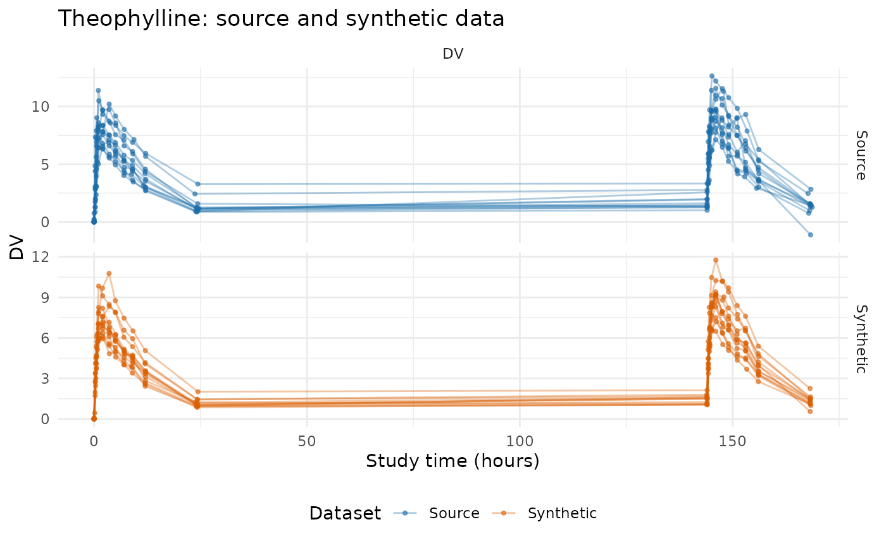
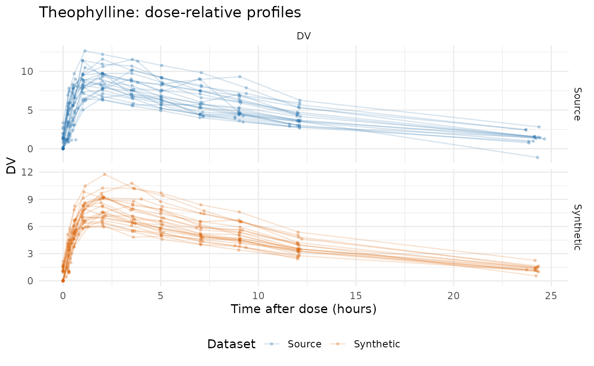
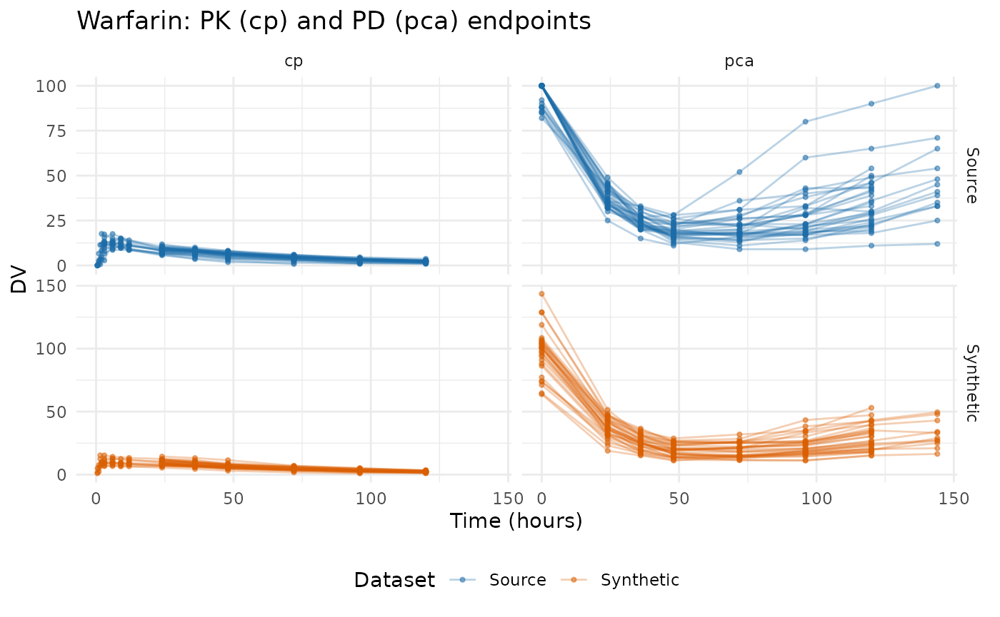
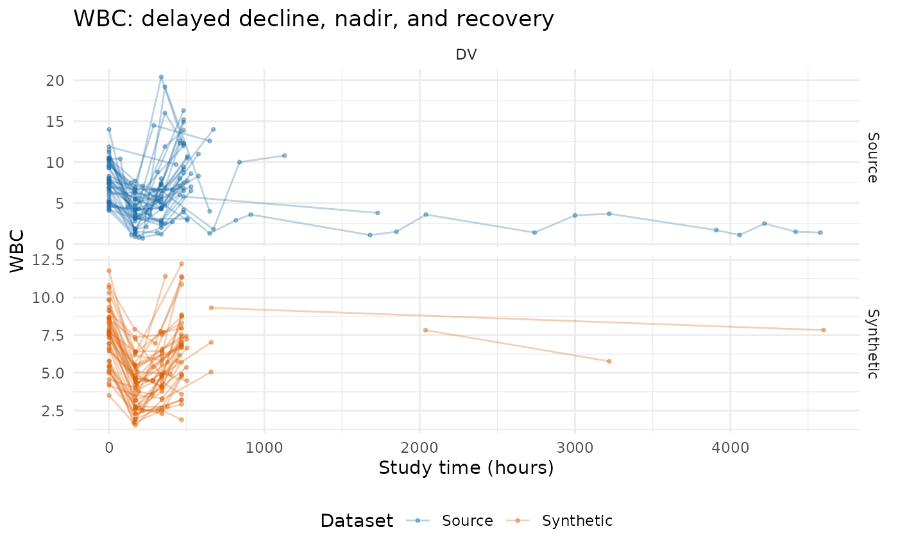
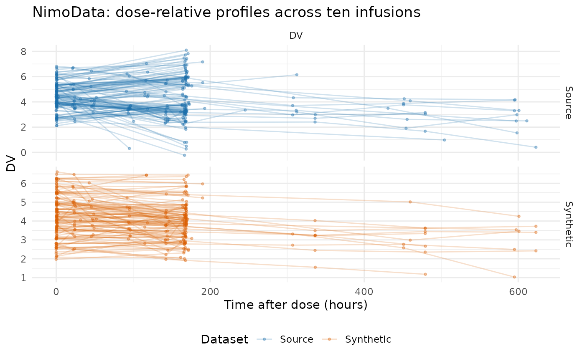
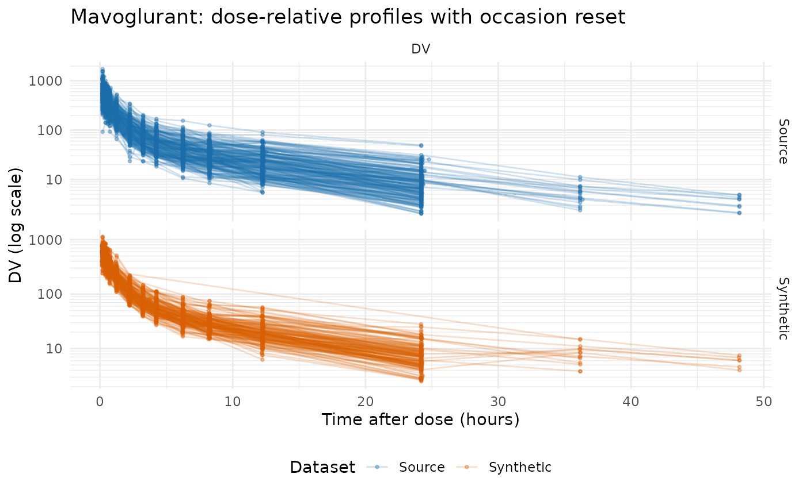
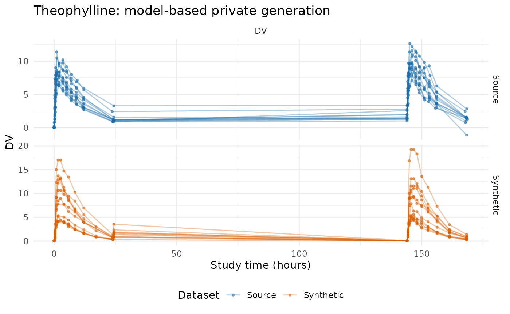

# Using synpmx AVATAR with 5 datasets

This vignette compares five source datasets against their synthetic
counterparts, so it needs a few helpers to pull observed rows into a
common shape and plot them. They are ordinary plotting code, not part of
the package API; expand the block if you want to reuse them.

Plotting helpers used throughout this vignette

``` r

observed_plot_data <- function(data, roles, dataset,
                               clock = "study_time") {
  observed <- as.character(data[[roles$evid]]) %in% c("0", "0.0")
  if (!is.null(roles$mdv)) {
    observed <- observed & as.character(data[[roles$mdv]]) %in% c("0", "0.0")
  }
  observed <- observed & !is.na(data[[roles$dv]])
  observation_rows <- which(observed)
  occasion <- rep(1L, length(observation_rows))
  tad <- rep(NA_real_, length(observation_rows))
  if (!is.null(roles$occasion)) {
    declared <- suppressWarnings(as.integer(
      data[[roles$occasion]][observation_rows]
    ))
    valid <- !is.na(declared) & declared >= 1L
    occasion[valid] <- declared[valid]
  }
  if (!is.null(roles$tad)) {
    declared <- suppressWarnings(as.numeric(data[[roles$tad]][observation_rows]))
    valid <- is.finite(declared)
    tad[valid] <- pmax(0, declared[valid])
  }
  subject_values <- data[[roles$id]]
  for (id in unique(subject_values[observation_rows])) {
    subject_rows <- which(!is.na(subject_values) & subject_values == id)
    events <- !(as.character(data[[roles$evid]][subject_rows]) %in%
                  c("0", "0.0"))
    if (!is.null(roles$amt)) {
      events <- events & as.numeric(data[[roles$amt]][subject_rows]) > 0
    }
    positions <- which(subject_values[observation_rows] == id)
    event_rows <- subject_rows[events]
    if (length(event_rows) && !is.null(roles$occasion)) {
      event_occasion <- suppressWarnings(as.integer(
        data[[roles$occasion]][event_rows]
      ))
      for (position in positions) {
        candidates <- event_rows[event_occasion == occasion[position]]
        if (length(candidates) && !is.finite(tad[position])) {
          origin <- min(as.numeric(data[[roles$time]][candidates]))
          tad[position] <-
            as.numeric(data[[roles$time]][observation_rows[position]]) - origin
        }
      }
    } else if (length(event_rows)) {
      dose_times <- sort(unique(as.numeric(data[[roles$time]][event_rows])))
      occasion[positions] <- pmax(1L, findInterval(
        as.numeric(data[[roles$time]][observation_rows[positions]]),
        dose_times
      ))
      occasion[positions] <- pmin(occasion[positions], length(dose_times))
      tad[positions] <-
        as.numeric(data[[roles$time]][observation_rows[positions]]) -
        dose_times[occasion[positions]]
    }
  }
  plotted_time <- if (identical(clock, "tad")) tad else
    as.numeric(data[[roles$time]][observation_rows])
  data.frame(
    dataset = factor(dataset, levels = c("Source", "Synthetic")),
    subject = as.character(data[[roles$id]][observation_rows]),
    time = plotted_time,
    dv = as.numeric(data[[roles$dv]][observation_rows]),
    occasion = occasion,
    endpoint = if (is.null(roles$dvid)) "DV" else
      as.character(data[[roles$dvid]][observation_rows]),
    stringsAsFactors = FALSE
  )
}

tad_plot_data <- function(data, roles, dataset) {
  out <- observed_plot_data(data, roles, dataset, clock = "tad")
  names(out)[names(out) == "time"] <- "tad"
  out
}

demo_design_summary <- function(data, roles, dataset, time_bounds,
                                clock = "study_time") {
  plotted <- observed_plot_data(data, roles, dataset, clock)
  if (!identical(clock, "tad")) {
    plotted <- plotted[
      plotted$time >= time_bounds[1L] & plotted$time <= time_bounds[2L],
      , drop = FALSE
    ]
  }
  cohort_ids <- as.character(unique(data[[roles$id]]))
  pieces <- lapply(sort(unique(plotted$endpoint)), function(endpoint) {
    rows <- plotted[plotted$endpoint == endpoint, , drop = FALSE]
    counts <- table(factor(rows$subject, levels = cohort_ids))
    data.frame(
      dataset = dataset,
      endpoint = endpoint,
      patients = length(cohort_ids),
      patients_with_endpoint = sum(counts > 0),
      observations = nrow(rows),
      mean_time_points_per_patient = mean(counts),
      median_time_points_per_patient = stats::median(counts),
      first_time = min(rows$time),
      last_time = max(rows$time),
      stringsAsFactors = FALSE
    )
  })
  do.call(rbind, pieces)
}

check_demo_similarity <- function(source, synthetic, roles, time_bounds,
                                  label, clock = "study_time") {
  source_subjects <- length(unique(source[[roles$id]]))
  synthetic_subjects <- length(unique(synthetic[[roles$id]]))
  if (source_subjects != synthetic_subjects) {
    stop(label, ": source and synthetic patient counts differ (",
         source_subjects, " versus ", synthetic_subjects, ").")
  }
  source_summary <- demo_design_summary(
    source, roles, "Source", time_bounds, clock
  )
  synthetic_summary <- demo_design_summary(
    synthetic, roles, "Synthetic", time_bounds, clock
  )
  if (!setequal(source_summary$endpoint, synthetic_summary$endpoint)) {
    stop(label, ": source and synthetic endpoint sets differ.")
  }
  paired <- merge(
    source_summary, synthetic_summary, by = "endpoint",
    suffixes = c("_source", "_synthetic")
  )
  point_difference <- abs(
    paired$mean_time_points_per_patient_synthetic -
      paired$mean_time_points_per_patient_source
  )
  point_allowance <- pmax(
    1, 0.25 * paired$mean_time_points_per_patient_source
  )
  if (any(point_difference > point_allowance)) {
    stop(label, ": mean time points per patient differ materially for ",
         paste(paired$endpoint[point_difference > point_allowance],
               collapse = ", "), ".")
  }
  coverage_allowance <- 0.20 * diff(time_bounds)
  bad_coverage <-
    abs(paired$first_time_synthetic - paired$first_time_source) >
      coverage_allowance |
    abs(paired$last_time_synthetic - paired$last_time_source) >
      coverage_allowance
  if (any(bad_coverage)) {
    stop(label, ": source and synthetic time coverage differs materially for ",
         paste(paired$endpoint[bad_coverage], collapse = ", "), ".")
  }
  summary <- rbind(source_summary, synthetic_summary)
  summary$dataset <- factor(
    summary$dataset, levels = c("Source", "Synthetic")
  )
  summary[order(summary$dataset, summary$endpoint), , drop = FALSE]
}

comparison_facets <- function(data) {
  ggplot2::facet_grid(dataset ~ endpoint, scales = "free_y")
}

source_synthetic_preview <- function(source, synthetic, n = 6L) {
  columns <- intersect(names(source), names(synthetic))
  source_rows <- utils::head(source[, columns, drop = FALSE], n)
  synthetic_rows <- utils::head(synthetic[, columns, drop = FALSE], n)
  source_rows$.dataset <- "Source"
  synthetic_rows$.dataset <- "Synthetic"
  out <- rbind(source_rows, synthetic_rows)
  rownames(out) <- NULL
  out[, c(".dataset", columns), drop = FALSE]
}
```

## What this package is for

`synpmx` creates **synthetic pharmacometric data for model-workflow
exploration**: data to develop and debug cleaning, joins, reshaping,
plotting, control-file plumbing, and repeated-dose or longitudinal
analysis code, so that a pipeline runs unchanged against the real data
later.

The package offers four generation modes, and the “Introduction to
synpmx” vignette applies all four to one dataset side by side:

- **AVATAR blending**
  ([`synpmx_avatar()`](https://iamstein.github.io/synpmx/reference/synpmx_avatar.md))
  — build each synthetic subject from real subjects. No elicitation, no
  formal privacy guarantee.
- **Prior only**
  ([`synpmx_prior()`](https://iamstein.github.io/synpmx/reference/synpmx_prior.md)
  on a public structural model) — read no data at all.
- **Calibration**
  ([`synpmx_calibrated()`](https://iamstein.github.io/synpmx/reference/synpmx_calibrated.md))
  — simulate from a public structural model whose magnitude is corrected
  by a small differentially private release.
- **Empirical**
  ([`synpmx_empirical()`](https://iamstein.github.io/synpmx/reference/synpmx_empirical.md))
  — release a dense set of differentially private summaries and rebuild
  subjects from them.

**Most of this vignette is about the default, AVATAR blending**, applied
to five public datasets with different structural challenges. For each
generated subject it samples a compatible source subject’s event
skeleton as a template, then fills the covariates and endpoint
trajectories with a distance-weighted blend of similar subjects, plus
subject and residual noise. The output has the source schema, fresh
identifiers, and the same cohort size. The final section runs the
model-based path on the same theophylline data, as
`scripts/demo_nlmixr2data.R` does for all five.

AVATAR output is **not** anonymous and carries **no formal privacy
guarantee**. It is synthetic data that stays under the source data’s
access controls and confidentiality obligations, in the same spirit as
Novartis’s `synadam` (which resamples each column marginally from the
data). Those obligations follow the data rather than the machine, so
working with it on a local workstation covered by the same controls is a
supported use. It is not appropriate for parameter estimation,
inference, model selection, or clinical decisions. When the generated
data would reach anyone the source data could not, use one of the
differentially private modes instead;
[`vignette("synpmx-privacy")`](https://iamstein.github.io/synpmx/articles/synpmx-privacy.md)
works through that decision and the tradeoff behind it.

## Shared workflow

Every example follows the same three steps:

1.  declare column meanings with
    [`pmx_roles()`](https://iamstein.github.io/synpmx/reference/pmx_roles.md);
2.  synthesize with
    [`synpmx_avatar()`](https://iamstein.github.io/synpmx/reference/synpmx_avatar.md);
3.  validate structure with
    [`validate_pmx()`](https://iamstein.github.io/synpmx/reference/validate_pmx.md)
    and compare to the source.

Identifiers, schema, classes, and factor levels are restored on output.
The caller’s random-number state is left untouched; reproducibility
comes from the `seed` argument.

## Theophylline: repeated dosing, dose-relative PK

`theo_md` has 12 subjects on a repeated oral regimen with a single
concentration endpoint.

``` r

data("theo_md", package = "nlmixr2data")
theo_roles <- pmx_roles(
  id = "ID", time = "TIME", dv = "DV", amt = "AMT",
  evid = "EVID", cmt = "CMT", covariates = "WT"
)
theo_synth <- synpmx_avatar(theo_md, theo_roles, seed = 303)
#> Warning: Synthetic generation used documented small-group/profile fallbacks:
#> - Fewer than 5 same-schedule donors were available for at least one subject; the nearest donors from other dose/schedule groups on the same route were borrowed to reach the floor, so some measurements are blended across doses.
validate_pmx(theo_synth, theo_roles)$valid
#> [1] TRUE
knitr::kable(
  source_synthetic_preview(theo_md, theo_synth),
  caption = "Actual Theophylline rows and synthesized rows"
)
```

| .dataset  |  ID | TIME |        DV |     AMT | EVID | CMT |       WT |
|:----------|----:|-----:|----------:|--------:|-----:|----:|---------:|
| Source    |   1 | 0.00 |  0.000000 | 319.992 |  101 |   1 | 79.60000 |
| Source    |   1 | 0.00 |  0.740000 |   0.000 |    0 |   2 | 79.60000 |
| Source    |   1 | 0.25 |  2.840000 |   0.000 |    0 |   2 | 79.60000 |
| Source    |   1 | 0.57 |  6.570000 |   0.000 |    0 |   2 | 79.60000 |
| Source    |   1 | 1.12 | 10.500000 |   0.000 |    0 |   2 | 79.60000 |
| Source    |   1 | 2.02 |  9.660000 |   0.000 |    0 |   2 | 79.60000 |
| Synthetic |  13 | 0.00 |  0.000000 | 319.365 |  101 |   1 | 65.11191 |
| Synthetic |  13 | 0.00 |  0.000000 |   0.000 |    0 |   2 | 65.11191 |
| Synthetic |  13 | 0.27 |  1.145239 |   0.000 |    0 |   2 | 65.11191 |
| Synthetic |  13 | 0.58 |  4.262444 |   0.000 |    0 |   2 | 65.11191 |
| Synthetic |  13 | 1.02 |  7.838701 |   0.000 |    0 |   2 | 65.11191 |
| Synthetic |  13 | 2.02 |  7.815251 |   0.000 |    0 |   2 | 65.11191 |

Actual Theophylline rows and synthesized rows {.table}

[`compare_pmx_distributions()`](https://iamstein.github.io/synpmx/reference/compare_pmx_distributions.md)
summarizes the dependent variable per endpoint and each baseline
covariate, source against synthetic, so you can see at a glance that the
ranges line up. Expect them to be close in magnitude and shape, not
identical — AVATAR does not reproduce the source distribution exactly.
Like every source-derived diagnostic it is marked restricted and stays
inside the source data’s access controls.

``` r

theo_dist <- compare_pmx_distributions(theo_md, theo_synth, theo_roles)
knitr::kable(theo_dist$endpoints, digits = 2,
             caption = "Concentration distribution, source versus synthetic")
```

| variable | dataset   |   n | n_subjects | mean |   sd |   min |  q25 | median | q75 |   max |
|:---------|:----------|----:|-----------:|-----:|-----:|------:|-----:|-------:|----:|------:|
| DV       | source    | 264 |         12 | 5.53 | 3.00 | -1.13 | 3.30 |   5.74 | 7.8 | 12.66 |
| DV       | synthetic | 264 |         12 | 5.88 | 3.16 |  0.00 | 3.88 |   5.97 | 8.2 | 13.32 |

Concentration distribution, source versus synthetic {.table}

``` r

knitr::kable(theo_dist$covariates_numeric, digits = 2,
             caption = "Baseline weight distribution, source versus synthetic")
```

| variable | dataset   |   n |  mean |   sd |   min |   q25 | median |   q75 |   max |
|:---------|:----------|----:|------:|-----:|------:|------:|-------:|------:|------:|
| WT       | source    |  12 | 69.58 | 9.50 | 54.60 | 63.57 |  70.50 | 74.43 | 86.40 |
| WT       | synthetic |  12 | 67.44 | 6.52 | 58.08 | 63.45 |  67.62 | 70.91 | 79.26 |

Baseline weight distribution, source versus synthetic {.table}

For a per-subject re-identification check,
[`flag_identifiable_subjects()`](https://iamstein.github.io/synpmx/reference/flag_identifiable_subjects.md)
scores each synthetic subject for being a structural outlier, and
[`remediate_identifiable_subjects()`](https://iamstein.github.io/synpmx/reference/remediate_identifiable_subjects.md)
removes or shortens the ones it flags.



A dose-relative display makes the coarse curve shape easier to see.
AVATAR preserves the rise-and-fall because it blends real subject
profiles rather than inventing a shape.



## Warfarin: separate PK and PD endpoints

`warfarin` has a lower-case schema, one dose, and two endpoints (`cp`
and `pca`) with factor covariates. Both endpoints and all subjects are
retained.

    #> Warning: Synthetic generation used documented small-group/profile fallbacks:
    #> - Fewer than 5 same-schedule donors were available for at least one subject; the nearest donors from other dose/schedule groups on the same route were borrowed to reach the floor, so some measurements are blended across doses.



## WBC: infusion, a delayed response, and structural screening

`wbcSim` has infusion start/stop events and a study-time
white-blood-cell response with a delayed decline, nadir, and recovery. A
few subjects are followed far longer than the rest.

A patient followed much longer than everyone else stands out, so a
synthetic copy built from them could point back to the real person. To
lower that risk,
[`synpmx_avatar()`](https://iamstein.github.io/synpmx/reference/synpmx_avatar.md)
by default does not build an avatar from such an extreme subject,
quietly leaving the very-long follow-ups out of the synthetic data
(`screen = TRUE`). This is an informal safeguard against singling
someone out, not a formal privacy guarantee; ordinary long follow-ups
are kept, and `screen = FALSE` keeps every subject.

    #> synpmx_avatar(): dropped 4 undeclared column(s): RATE, V2I, V1I, CLI.
    #>   Declare a column in `keep` to carry it through verbatim.



## NimoData: infusions, occasions, and a dose group

`nimoData` has ten approximately weekly infusions, declared OCC/TAD, and
a nominal dose group (`DOS`). The dose group is carried through with
`keep`, which copies it verbatim from the same subject that supplied the
doses, so it stays coherent with them. The redundant `WGT` column is
simply left undeclared, so AVATAR drops it.

    #> synpmx_avatar(): dropped 1 undeclared column(s): WGT.
    #>   Declare a column in `keep` to carry it through verbatim.



## Mavoglurant: occasion-reset clock and a carried dose column

`mavoglurant` has one- and two-period profiles, a `TIME` axis that
resets within occasion, an occasion-varying `DOSE`, numeric-coded `SEX`,
and infusion rows. The reset clock validates within ID and occasion.
AVATAR copies the whole event template from one anchor, so `DOSE` stays
coherent with the doses when carried through with `keep`.



## The model-based path on the same data

Everything above blends real subjects. The alternative is to fit a
public model to the data through an accounted release and simulate from
it, which is what `scripts/demo_nlmixr2data.R` does for all five
datasets. Repeating it here for theophylline shows how much more must be
declared, and what is bought.

The empirical engine measures the trajectory shape from the data through
noised summaries. Every clipping range, contribution limit, and budget
share is an explicit public input.
[`synpmx_empirical()`](https://iamstein.github.io/synpmx/reference/synpmx_empirical.md)
(like
[`synpmx_calibrated()`](https://iamstein.github.io/synpmx/reference/synpmx_calibrated.md))
refuses to run until
[`synpmx_enable_dp_engines()`](https://iamstein.github.io/synpmx/reference/synpmx_enable_dp_engines.md)
has been called once in the session, acknowledging the maintenance
status covered in
[`vignette("synpmx-privacy")`](https://iamstein.github.io/synpmx/articles/synpmx-privacy.md):

``` r

synpmx_enable_dp_engines()
#> DP engines enabled for this session: the differentially private engines are complete and tested, but not under active development, carry known open findings (see design/REVIEW_BACKLOG.md), and have not been independently privacy-audited. See vignette("synpmx-privacy") for the trust-boundary decision rule and what a production release additionally needs.
```

``` r

theo_private <- synpmx_empirical(
  data = theo_md, roles = theo_roles,
  endpoints = list(cp = pmx_endpoint(
    alignment = "dose_relative", transform = "log", shape = "occasion", cmt = 2
  )),
  epsilon = 5, delta = 0,
  bounds = pmx_bounds(
    time = c(0, 170), endpoints = list(cp = c(0, 30)), amt = c(0, 500),
    covariates = list(WT = c(40, 130))
  ),
  public_design = pmx_public_design(
    pmx_schema(theo_md), dose_evid = 101, dose_cmt = 1
  ),
  contribution_limits = pmx_contribution_limits(40, 8, 8, 30, 11),
  budget_allocation = pmx_budget_allocation(
    subject_count = 0.10, event = 0.15, timing = 0.15,
    covariates = 0.10, endpoints = 0.50, censoring = 0
  ),
  seed = 707,
  backend = "public", public_source = TRUE   # theo_md is public; no DP claim
)
validate_pmx(theo_private, theo_roles)$valid
#> [1] TRUE
sampling_summary(theo_private)
#>   endpoint occasion sampling_probability observations_if_sampled
#> 1       cp        1            1.0000000                10.16667
#> 2       cp        2            0.8333333                 1.00000
#> 3       cp        3            0.0000000                 0.00000
#> 4       cp        4            0.0000000                 0.00000
#> 5       cp        5            0.0000000                 0.00000
#> 6       cp        6            0.0000000                 0.00000
#> 7       cp        7            1.0000000                11.00000
#>   expected_observations                       basis
#> 1            10.1666667 privacy_accounted_inference
#> 2             0.8333333 privacy_accounted_inference
#> 3             0.0000000 privacy_accounted_inference
#> 4             0.0000000 privacy_accounted_inference
#> 5             0.0000000 privacy_accounted_inference
#> 6             0.0000000 privacy_accounted_inference
#> 7            11.0000000 privacy_accounted_inference
```

The confidential data is read once, at the moment
[`synpmx_empirical()`](https://iamstein.github.io/synpmx/reference/synpmx_empirical.md)
is called. The release it produced travels with the returned dataset, so
any number of further datasets can be drawn from it as post-processing,
without spending more budget:

``` r

theo_private_2 <- synpmx_generate(theo_private, seed = 708)   # spends nothing
```

Reach for
[`synpmx_generate()`](https://iamstein.github.io/synpmx/reference/synpmx_generate.md)
rather than calling
[`synpmx_empirical()`](https://iamstein.github.io/synpmx/reference/synpmx_empirical.md)
a second time — a second call is a second release, and its budget has to
be composed with the first.



Because `theo_md` is already public, this demonstration uses the guarded
public-fixture backend, which is **noiseless and makes no DP claim** —
exactly as the demo script does. A confidential fit uses the default
OpenDP backend and fails closed when it is unavailable. The
[`synpmx_calibrated()`](https://iamstein.github.io/synpmx/reference/synpmx_calibrated.md)
mode, which asserts curve shape from a public structural model and
privately calibrates only the magnitude, is the better choice at this
cohort size; the introduction vignette runs it on this same dataset.

## What is preserved, and what is not

This section describes the AVATAR output shown above.

Preserved: schema, column classes, factor levels, cohort size, endpoint
set, event structure, coarse regimen and sampling timing, and the broad
shape and magnitude of each endpoint.

Not preserved, by design: exact source distributions, parameter
estimates, covariate-response relationships, and rare individual
trajectories. Identifiers are always freshly generated and never reuse a
source value.

Not provided: any formal privacy guarantee. The synthetic data is built
by blending real subject trajectories, so it is appropriate wherever the
source data’s own obligations still apply — including a local
workstation under the same access controls — but not for release to
anyone outside them. See
[`vignette("synpmx-method")`](https://iamstein.github.io/synpmx/articles/synpmx-method.md)
for all four modes side by side and
[`vignette("synpmx-privacy")`](https://iamstein.github.io/synpmx/articles/synpmx-privacy.md)
for what differential privacy does and does not promise.
