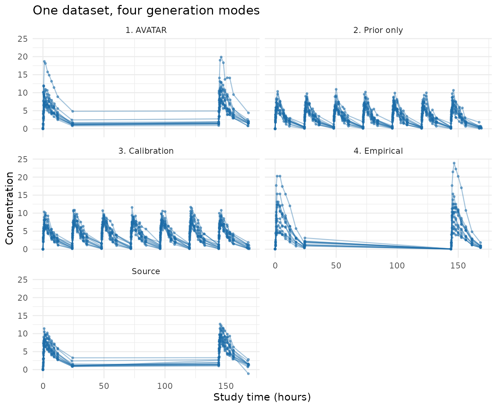

# The four generation modes

## What this package does

`synpmx` builds synthetic pharmacometric (PMX) datasets: dosing and
measurement event tables with the same schema, event grammar, and rough
behavior as a real study, so that data-assembly code, diagnostic plots,
and model-run plumbing can be developed outside the restricted
environment that holds the real data.

That narrow purpose is important. A generated dataset is not anonymous
data and is not evidence that source subjects cannot be re-identified.
It is also not suitable for estimation, model selection, inference, dose
selection, or clinical decisions. The method aims for structural
usefulness, not scientific equivalence.

The hard part is not making numbers. It is deciding **how much of the
real data is allowed to survive into the synthetic data**, which is a
privacy question before it is a technical one. This package therefore
offers four generation modes at different points on that scale. This
vignette introduces all four and applies each one to the same public
dataset.

The four modes, from most faithful to most protective:

1.  **AVATAR blending** — build each synthetic subject out of real
    subjects.
2.  **Prior only** — read no data at all; simulate from a public model.
3.  **Calibration** — simulate from a public model whose magnitude is
    corrected by a small, differentially private release.
4.  **Empirical** — release a dense set of differentially private
    summaries and rebuild subjects from them.

Modes 2, 3, and 4 all use differential privacy (DP) accounting, and mode
2 is its trivial limit: spending nothing.

This vignette stays at the level of what each mode does and when to use
it. The full AVATAR algorithm — every step, the mathematics, the edge
cases, and a worked example — is in the [AVATAR mathematics
article](https://iamstein.github.io/synpmx/articles/avatar-mathematics.html).

## The example: theophylline

`theo_md` (from `nlmixr2data`) is a small public dataset — 12 subjects,
seven daily 320 mg oral doses, one concentration endpoint. Twelve
subjects is a deliberately hard case: it is typical of early-phase work
and it is where the differences between the four modes are most visible.

``` r

data("theo_md", package = "nlmixr2data")
theo_roles <- pmx_roles(
  id = "ID", time = "TIME", dv = "DV", amt = "AMT",
  evid = "EVID", cmt = "CMT", covariates = "WT"
)
str(theo_md)
#> 'data.frame':    348 obs. of  7 variables:
#>  $ ID  : int  1 1 1 1 1 1 1 1 1 1 ...
#>  $ TIME: num  0 0 0.25 0.57 1.12 2.02 3.82 5.1 7.03 9.05 ...
#>  $ DV  : num  0 0.74 2.84 6.57 10.5 9.66 8.58 8.36 7.47 6.89 ...
#>  $ AMT : num  320 0 0 0 0 ...
#>  $ EVID: int  101 0 0 0 0 0 0 0 0 0 ...
#>  $ CMT : int  1 2 2 2 2 2 2 2 2 2 ...
#>  $ WT  : num  79.6 79.6 79.6 79.6 79.6 79.6 79.6 79.6 79.6 79.6 ...
```

## Mode 1: AVATAR blending

Start here, because it is the least work.
[`synthesize_pmx()`](https://iamstein.github.io/synpmx/reference/synthesize_pmx.md)
needs nothing but the data and a declaration of what the columns mean.
For each synthetic subject it copies a real subject’s event skeleton,
then fills the covariates and concentrations with a distance-weighted
blend of that subject’s nearest compatible neighbors, plus noise.

``` r

avatar <- suppressWarnings(synthesize_pmx(theo_md, theo_roles, seed = 101))
validate_pmx(avatar, theo_roles)$valid
#> [1] TRUE
```

Nothing was elicited, nothing was assumed, and the output keeps the
source schema and cohort size. On a 12-subject dataset
[`synthesize_pmx()`](https://iamstein.github.io/synpmx/reference/synthesize_pmx.md)
also emits documented small-group fallback warnings (some event-pattern
groups have only one usable donor); they are suppressed above and
explained in the [AVATAR mathematics
article](https://iamstein.github.io/synpmx/articles/avatar-mathematics.html).

What you cannot say about this output is that it is anonymous. It is
assembled from real trajectories, so it belongs inside the trusted
environment that the source data came from.

## Mode 2: prior only

The opposite extreme. Declare a public structural model and a public
protocol, and simulate. No confidential data is read, so there is
nothing to protect and no budget to spend: this is `epsilon = 0`, the
strongest possible guarantee.

The typical parameter values must come from somewhere that is not the
data — allometric scaling from preclinical work, a published model for
the compound class, or the reasoning that set the starting dose.

``` r

theo_model <- pmx_structural_model(
  pk = "1cmt_oral",
  typical = c(cl = 6, v = 35, ka = 1.5),          # deliberately imperfect
  source = "illustrative allometric scaling; never fitted to theo_md"
)
theo_design <- pmx_trial_design(
  dose_levels = 320, cohort_sizes = 12,
  sampling = c(0, 0.25, 0.5, 1, 2, 4, 7, 9, 12, 24),
  n_doses = 7, dose_interval = 24,
  source = "illustrative protocol"
)
prior_only <- pmx_generate(theo_model, theo_design, n_subjects = 12, seed = 202)
head(prior_only, 3)
#>   ID      TIME NTIME       TAD OCC      DV AMT RATE EVID CMT DVID MDV CENS DOSE
#> 1  1 0.0000000  0.00 0.0000000   1      NA 320    0    1   1 <NA>   1    0  320
#> 2  1 0.0000000  0.00 0.0000000   1 0.00000   0    0    0   2   cp   0    0  320
#> 3  1 0.2447759  0.25 0.2447759   1 3.28301   0    0    0   2   cp   0    0  320
```

The generated table uses the package’s own generated schema
([`pmx_generated_roles()`](https://iamstein.github.io/synpmx/reference/pmx_generated_roles.md)),
including nominal time, time after dose, and occasion columns. The
clearance of 6 L/h assumed above is about twice the truth for
theophylline, and the output shows it: concentrations run low. That is
the honest cost of spending no budget — the data is exactly as good as
the prior.

## Mode 3: calibration

The middle path, and the recommended one when a formal guarantee is
needed and the cohort is small. Keep the public model’s *shape*, and
spend a small privacy budget correcting only its *magnitude*.

Each subject is reduced to a bounded multiplicative correction of the
model’s own prediction, clipped to a public prior range, and released
with calibrated noise. Only two numbers leave the data: the correction
and a noised subject count.

``` r

priors <- pmx_priors(pk = pmx_prior(c(1 / 4, 4), source = "scaling literature"))
pmx_preflight(priors, epsilon = 1, n_subjects = 12)
#> Pre-flight: d = 2, epsilon = 1, N = 12  ->  f = 0.167
#>  quantity prior_fold         f expected_fold_error
#>        pk         16 0.1666667            1.587401
#> 
#> Verdict: worthwhile
#> The release meaningfully narrows the prior.
```

[`pmx_preflight()`](https://iamstein.github.io/synpmx/reference/pmx_preflight.md)
costs nothing and reads no data: it answers “is this release worth its
budget?” before any budget is spent.

``` r

calibrated <- fit_calibrated_pmx(
  data = theo_md, roles = theo_roles, model = theo_model,
  design = theo_design, priors = priors, epsilon = 1,
  backend = "public", public_source = TRUE   # theo_md is public; no DP claim
)
calibrated
#> Calibrated structural model (v3)
#>   released subject count: 12
#>   pk correction: 0.669x
#>   corrected typical: cl=4.01, v=35, ka=1.5
#>   epsilon: 1  (formal DP: FALSE)
#>   f = 0.167 (worthwhile)
calibrated_data <- pmx_generate(calibrated, seed = 303)
```

The correction pulled the assumed clearance toward the data. Generation
is post-processing on the released numbers, so drawing more datasets
from one fit spends no additional budget.

Two honest notes. First, `backend = "public"` is used here because
`theo_md` is already public: it makes the release **noiseless** and
therefore makes no DP claim, which the printed model states. A
confidential fit uses the default validated backend and fails closed if
it is unavailable:

``` r

calibrated <- fit_calibrated_pmx(
  data = confidential, roles = theo_roles, model = theo_model,
  design = theo_design, priors = priors, epsilon = 1,
  backend = "opendp"
)
```

``` r

dp_backend_status()
#>   backend available version production
#> 1  OpenDP      TRUE  0.15.1       TRUE
```

Second, at 12 subjects a genuine DP release of this correction is noisy
enough that it is often censored at the prior boundary — the package
warns when that happens, because the generated data then reflects the
prior, not the study.
[`vignette("synpmx-privacy")`](https://iamstein.github.io/synpmx/articles/synpmx-privacy.md)
covers when the release is worth making.

## Mode 4: empirical

The general-purpose private engine. Rather than asserting the curve
shape, it measures it: it releases noised summaries for the subject
count, event and regimen structure, observation timing, endpoint
trajectories, baseline covariates, and censoring, then rebuilds subjects
from those summaries. This buys realism that the public model does not
contain, and pays for it by splitting one epsilon across many released
quantities.

It also needs the most declaration: every clipping range, contribution
limit, and budget share is an explicit public input.

``` r

empirical <- fit_private_pmx(
  data = theo_md, roles = theo_roles,
  endpoints = list(cp = pmx_endpoint(
    alignment = "dose_relative", transform = "log", shape = "occasion", cmt = 2
  )),
  epsilon = 5, delta = 0,
  bounds = pmx_bounds(
    time = c(0, 170), endpoints = list(cp = c(0, 30)), amt = c(0, 500),
    covariates = list(WT = c(40, 130))
  ),
  public_design = pmx_public_design(
    pmx_schema(theo_md), dose_evid = 101, dose_cmt = 1
  ),
  contribution_limits = pmx_contribution_limits(40, 8, 8, 30, 11),
  budget_allocation = pmx_budget_allocation(
    subject_count = 0.10, event = 0.15, timing = 0.15,
    covariates = 0.10, endpoints = 0.50, censoring = 0
  ),
  backend = "public", public_source = TRUE   # theo_md is public; no DP claim
)
empirical_data <- generate_pmx(empirical, seed = 404)
privacy_report(empirical)
#> No DP claim: the input was explicitly asserted to be a public fixture.
#> Privacy unit: one subject's complete bounded longitudinal contribution
#> Adjacency: add-or-remove one complete subject
#> Backend: public-fixture 0.0.0.9000
#> Illustrative query allocation (not a DP accounting claim): epsilon = 5, delta = 0
#> No privacy guarantee is asserted for this public-source fixture model.
```

Note the requested `epsilon = 5`, five times the calibrated fit’s
budget, for a worse result at this cohort size. That is not a bug: the
same budget is being split six ways over dozens of released coordinates.
This engine earns its keep on large pooled corpora, not on twelve
subjects.

## The four side by side

``` r

generated_roles <- pmx_generated_roles()
all_observations <- rbind(
  observations(theo_md, theo_roles, "Source"),
  observations(avatar, theo_roles, "1. AVATAR"),
  observations(prior_only, generated_roles, "2. Prior only"),
  observations(calibrated_data, generated_roles, "3. Calibration"),
  # The empirical engine restores the source schema, so it uses source roles.
  observations(empirical_data, theo_roles, "4. Empirical")
)
summaries <- do.call(rbind, lapply(
  split(all_observations$dv, all_observations$method),
  function(dv) {
    data.frame(
      n_observations = length(dv),
      median = stats::median(dv),
      p10 = stats::quantile(dv, 0.10, names = FALSE),
      p90 = stats::quantile(dv, 0.90, names = FALSE)
    )
  }
))
knitr::kable(
  summaries, digits = 2,
  caption = "Observed concentrations by generation mode"
)
```

|                 | n_observations | median |  p10 |   p90 |
|:----------------|---------------:|-------:|-----:|------:|
| 1\. AVATAR      |            264 |   5.74 | 1.38 | 10.65 |
| 2\. Prior only  |            768 |   3.63 | 0.54 |  7.00 |
| 3\. Calibration |            768 |   4.49 | 1.15 |  7.96 |
| 4\. Empirical   |            264 |   4.43 | 0.43 | 11.96 |
| Source          |            264 |   5.74 | 1.25 |  9.30 |

Observed concentrations by generation mode {.table}

``` r

ggplot2::ggplot(
  all_observations,
  ggplot2::aes(time, dv, group = subject)
) +
  ggplot2::geom_line(alpha = 0.4, colour = "#1B6CA8") +
  ggplot2::geom_point(alpha = 0.5, size = 0.7, colour = "#1B6CA8") +
  ggplot2::facet_wrap(~ method, ncol = 2) +
  ggplot2::labs(
    x = "Study time (hours)", y = "Concentration",
    title = "One dataset, four generation modes"
  ) +
  ggplot2::theme_minimal()
```



AVATAR tracks the source most closely, because it is made of it. The
prior-only data has the right structure and the wrong level. Calibration
moves the level toward the truth for a small budget. The empirical
release recovers more of the real timing and spread, but at this cohort
size the noise is visible.

## Choosing a mode

| Mode | Function | Output built from | Guarantee | Cohort size | Elicitation needed |
|:---|:---|:---|:---|:---|:---|
| 1\. AVATAR blending | synthesize_pmx() | Real subject templates and blended real trajectories | None; governance only | Any, from ~12 | None |
| 2\. Prior only | pmx_generate(model, design) | A public model and protocol only | epsilon = 0 (no data read) | Any (data-independent) | Structural model + protocol |
| 3\. Calibration | fit_calibrated_pmx() + pmx_generate() | A public model, magnitude corrected by 2 private releases | (epsilon, delta) DP | ~20 and up | Model, protocol, prior ranges |
| 4\. Empirical | fit_private_pmx() + generate_pmx() | Dozens of noised population summaries | (epsilon, delta) DP | A few hundred and up | Endpoints, bounds, limits, budget split |

Where each mode belongs:

| Environment | Appropriate modes | Why |
|----|----|----|
| Inside the validated environment holding the source data; you are the only consumer | **AVATAR**, or any other | Access control and governance already bound the risk. A formal guarantee defends against an adversary who cannot reach the output, so it buys nothing and costs utility. |
| Shared with a partner, vendor, or contract research organization (CRO) | **Calibration** or **Empirical**, with an approved epsilon | The output leaves your controls. A contract is not a mathematical bound; DP is what survives a determined recipient. |
| Published, posted to a repository, or shipped inside a package or teaching material | **Prior only**, or **Calibration** with a small approved epsilon | Anyone may inspect it, forever, alongside side information you cannot anticipate. Prior-only data reads no patient record at all and is the safest thing to publish. |
| Software testing where only schema and event grammar matter | **Prior only** | Fidelity is irrelevant; a data-independent generator removes the question entirely. |

Two rules of thumb behind the table:

- **The trust boundary decides whether you need DP.** Ask whether the
  generated data can reach anyone the source data could not. If not,
  AVATAR is more useful and its lack of a formal guarantee costs
  nothing. If so, only an accounted release holds up.
- **The cohort size decides which DP mode is usable.** Epsilon buys
  accuracy in proportion to the number of subjects and in inverse
  proportion to how many quantities you release. At 12 subjects,
  releasing two numbers can work and releasing fifty cannot.

Epsilon and delta are governance decisions, not defaults. For anything
public facing they should be set and justified by whoever owns the data,
and recorded: every fit carries a release ledger, and
[`privacy_report()`](https://iamstein.github.io/synpmx/reference/privacy_report.md)
prints the realized accounting.

## Why AVATAR is the default

Novartis’s `synadam` generates synthetic ADaM (Analysis Data Model)
datasets by resampling **each column** marginally from the real data: a
uniform draw over the observed range for continuous columns, a
proportional resample for categorical ones, with no differential
privacy. It preserves each column’s marginal support and relies on
governance rather than a mathematical guarantee. That is standard,
accepted practice.

AVATAR blending is the same governance-based idea applied at a different
granularity: it resamples and blends **whole subject trajectories**
rather than individual columns, because a pharmacometric endpoint is a
correlated time-course that would be destroyed by independent per-column
resampling. If `synadam`’s privacy model is acceptable for its use,
AVATAR’s is acceptable for the same trusted-environment use.

One honest caveat follows from the difference in granularity. A
resampled covariate value (a weight of 72 kg) is weakly identifying
because many people share it. A resampled subject trajectory is more
strongly identifying, closer to a fingerprint, because a full
sampling-and-response pattern is more nearly unique. Blending several
donors and adding noise mitigates this, but not formally. AVATAR
therefore depends on the governance context somewhat more than
`synadam`’s column resampling does.

## What the model-based modes replace

Modes 2, 3, and 4 do not blend anything. They replace the AVATAR
pipeline entirely: there is no anchor subject, no donor neighborhood,
and no event template. The trial structure comes from a **declared
public protocol**
([`pmx_trial_design()`](https://iamstein.github.io/synpmx/reference/pmx_trial_design.md)
or
[`pmx_public_design()`](https://iamstein.github.io/synpmx/reference/pmx_public_design.md))
rather than from a source subject’s rows.

Both differentially private engines are **aggregate-based**: no source
subject’s rows, template, or trajectory reaches the output. They read
the confidential data only through per-subject contributions clipped to
publicly declared ranges, release those aggregates with calibrated
noise, and generate from the noised numbers alone. They differ in what
supplies the curve shape.

[`fit_calibrated_pmx()`](https://iamstein.github.io/synpmx/reference/fit_calibrated_pmx.md)
takes shape from a **public structural model** — a closed-form
one-compartment or two-compartment PK model, evaluated analytically
rather than by solving ordinary differential equations (ODEs) — and
spends budget only on correcting its magnitude. The supported PK shapes
are `"1cmt_iv"`, `"1cmt_oral"`, `"1cmt_infusion"`, `"2cmt_iv"`, and
`"2cmt_oral"`. Optional PD shapes are `"constant"`, `"linear"`, and
`"exponential"`, with no exposure dependence. Between-subject
variability (`iiv`) and residual error (`residual_cv`) are public
assumptions and consume no budget.

Because only a handful of numbers are released (`d = 2` for a single PK
correction plus the count), the noise per released quantity stays small,
which is why this engine remains usable at 20 to 60 subjects. The
tradeoff is that everything not calibrated is *asserted*: curve shape,
variability, residual error, and covariate relationships come from the
public model, so the output is only as realistic as that model. It
cannot reveal a structural feature the model does not contain.

[`fit_private_pmx()`](https://iamstein.github.io/synpmx/reference/fit_private_pmx.md)
instead reconstructs shape from a denser set of noised summaries. It
asserts less — trajectory shape is measured rather than assumed — but it
releases far more numbers, so the same epsilon is split many ways.
Utility therefore collapses below a few hundred subjects.

## Practical review checklist

Before using a synthetic dataset for workflow development, verify all of
the following:

Every critical column has an explicit and correct role.

Units and event conventions are documented outside the generator.

`validate_pmx(source, roles)` and `validate_pmx(synthetic, roles)` are
valid.

Source and synthetic event counts are credible by EVID, CMT, and DVID.

Dose, infusion start/stop, and tied-time records remain coherent.

Observation-time windows and endpoint trajectories are usable for the
intended plotting and model-run code.

Declared covariates are constant within synthetic subject and retain
classes.

`pmx_settings$warnings` and endpoint transformations were reviewed.

Any TAD column was recomputed if TIME was jittered.

BLOQ/CENS data were handled by an explicit external convention; no
censoring support was assumed.

No claim of anonymity, privacy, parameter fidelity, or scientific
equivalence is being made.

The synthetic output remains governed according to the source
environment’s applicable privacy and data-sharing rules.

## Where to go next

- [`vignette("synpmx-demo")`](https://iamstein.github.io/synpmx/articles/synpmx-demo.md)
  — the practical workflow across five public datasets, with structural
  checks.
- [`vignette("synpmx-privacy")`](https://iamstein.github.io/synpmx/articles/synpmx-privacy.md)
  — what differential privacy guarantees, what it does not, the
  trust-boundary decision rule, and how epsilon trades against utility.
- [AVATAR
  mathematics](https://iamstein.github.io/synpmx/articles/avatar-mathematics.html)
  — the default generator step by step, with the worked example.
- [Model
  elicitation](https://iamstein.github.io/synpmx/articles/model-elicitation.html)
  and [data
  elicitation](https://iamstein.github.io/synpmx/articles/data-elicitation.html)
  — how to produce the public model and protocol that modes 2 to 4 need.
- [Feasibility by cohort
  size](https://iamstein.github.io/synpmx/articles/feasibility.html) —
  the measured evidence for what each private mode can deliver at your
  N.

## References

1.  Destere A, Lombardi R, Labriffe M, et al. *Can synthetic data
    overcome the privacy and fidelity bottleneck in Pharmacometrics? A
    comparative benchmark using a daptomycin population pharmacokinetic
    model.* medRxiv preprint, posted June 2, 2026. doi:
    [10.64898/2026.05.30.26354512](https://doi.org/10.64898/2026.05.30.26354512).

2.  Guillaudeux M, Rousseau O, Petot J, et al. Patient-centric synthetic
    data generation, no reason to risk re-identification in biomedical
    data analysis. *npj Digital Medicine.* 2023;6. doi:
    [10.1038/s41746-023-00771-5](https://doi.org/10.1038/s41746-023-00771-5).
