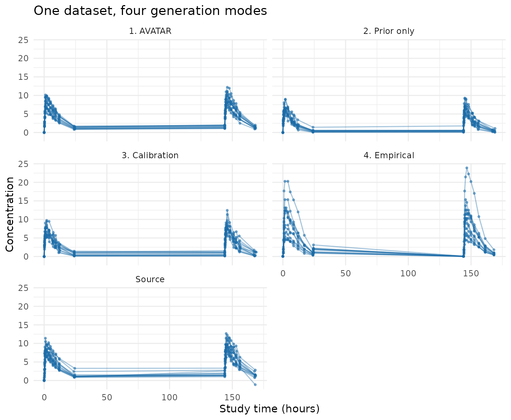

# The four generation modes

## What this package does

`synpmx` builds synthetic pharmacometric (PMX) datasets: dosing and
measurement event tables with the same schema, event grammar, and rough
behavior as a real study, so that data-assembly code, diagnostic plots,
and model-run plumbing can be developed outside the restricted
environment that holds the real data.

That narrow purpose is important. A generated dataset is not anonymous
data and is not a formal proof that source subjects cannot be
re-identified. It is also not suitable for estimation, model selection,
inference, dose selection, or clinical decisions. The method aims for
structural usefulness, not scientific equivalence.

Given that synthetic data is oven used as a way to protect privacy, this
package offers four synthetic data generation functions that offer
different privacy guarantees. This vignette introduces all four and
applies each one to the same public dataset.

The four modes, from most faithful to most protective:

1.  **AVATAR blending** \[1, 2\] — build each synthetic subject out of
    real subjects.
2.  **Prior only** — read no data at all; simulate from a public model.
3.  **Calibration** — simulate from a public model whose magnitude is
    corrected by a small, differentially private release.
4.  **Empirical** — release a dense set of differentially private
    summaries and rebuild subjects from them.

“AVATAR” is a method name rather than an initialism, from the
patient-centric *avatarization* literature in which each synthetic
record is built from the local neighborhood of real records. The
original method is due to Guillaudeux and colleagues \[2\]; Destere and
colleagues benchmark a modified AVATAR against other synthesis
algorithms for population PK \[1\]. This package implements an
AVATAR-*inspired* adaptation for longitudinal event tables, not
published AVATAR software.

This vignette stays at the level of what each mode does and when to use
it. The full AVATAR algorithm — every step, the mathematics, the edge
cases, and a worked example — is in the [AVATAR Algorithm
article](https://iamstein.github.io/synpmx/articles/avatar-algorithm.html).

## The example: theophylline

`theo_md` (from `nlmixr2data`) is a small public dataset — 12 subjects,
seven daily 320 mg oral doses, one concentration endpoint. Twelve
subjects is a deliberately hard case: it is typical of early-phase work
and it is where the differences between the four modes are most visible.

``` r

data("theo_md", package = "nlmixr2data")
theo_roles <- pmx_roles(
  id = "ID", time = "TIME", dv = "DV", amt = "AMT",
  evid = "EVID", cmt = "CMT", covariates = "WT"
)
str(theo_md)
#> 'data.frame':    348 obs. of  7 variables:
#>  $ ID  : int  1 1 1 1 1 1 1 1 1 1 ...
#>  $ TIME: num  0 0 0.25 0.57 1.12 2.02 3.82 5.1 7.03 9.05 ...
#>  $ DV  : num  0 0.74 2.84 6.57 10.5 9.66 8.58 8.36 7.47 6.89 ...
#>  $ AMT : num  320 0 0 0 0 ...
#>  $ EVID: int  101 0 0 0 0 0 0 0 0 0 ...
#>  $ CMT : int  1 2 2 2 2 2 2 2 2 2 ...
#>  $ WT  : num  79.6 79.6 79.6 79.6 79.6 79.6 79.6 79.6 79.6 79.6 ...
```

## Mode 1: AVATAR blending

Start here, because it is the least work.
[`synpmx_avatar()`](https://iamstein.github.io/synpmx/reference/synpmx_avatar.md)
needs nothing but the data and a declaration of what the columns mean.
For each synthetic subject it copies a real subject’s event skeleton,
then fills the covariates and concentrations with a distance-weighted
blend of that subject’s nearest compatible neighbors, plus noise.

``` r

avatar <- suppressWarnings(synpmx_avatar(theo_md, theo_roles, seed = 101))
validate_pmx(avatar, theo_roles)$valid
#> [1] TRUE
```

Nothing was elicited, nothing was assumed, and the output keeps the
cohort size and every column named in `theo_roles`.
[`synpmx_avatar()`](https://iamstein.github.io/synpmx/reference/synpmx_avatar.md)
keeps only role-named columns and drops the rest — so a stray identifier
cannot leak out of a real subject by being forgotten — and here every
`theo_md` column has a role, so nothing is dropped. On a 12-subject
dataset it also emits documented small-group fallback warnings (some
event-pattern groups have only one usable donor); they are suppressed
above and explained in the [AVATAR Algorithm
article](https://iamstein.github.io/synpmx/articles/avatar-algorithm.html).

What you cannot say about this output is that it is anonymous. It is
assembled from real trajectories, so it inherits the source data’s
handling obligations wherever it is used — a constraint on who may see
it, not on which machine holds it.

### What AVATAR does to obscure the source

AVATAR gives no formal guarantee, so the honest way to describe its
protection is to list the mechanisms and say what each one does and does
not cover. There are seven: five run by default, and two are
measurements you run yourself.

**1. Blending across donors.** No synthetic subject’s measurements come
from one real patient. Each avatar’s covariates and concentrations are a
distance-weighted blend of at least `k` = 5 compatible real donors, and
`max_donor_weight` = 0.50 caps any single donor at half the blend. This
is what protects the *values*. It is also the only mechanism whose
strength grows with cohort size, and it is why a source with fewer than
`k + 1` subjects triggers a loud alert rather than quietly producing
near-copies.

**2. Screening structurally extreme subjects** (`screen = TRUE`). A
source subject whose follow-up length or dose count exceeds twice the
cohort’s 90th percentile is never used as an anchor, so no avatar
inherits a conspicuous skeleton. Only those two axes are screened at
generation, because dose magnitude is noisy under weight-based dosing
and DV is blended rather than copied. After generation,
[`flag_identifiable_subjects()`](https://iamstein.github.io/synpmx/reference/flag_identifiable_subjects.md)
screens four axes — follow-up time, dose count, dose magnitude, and peak
DV — and
[`remediate_identifiable_subjects()`](https://iamstein.github.io/synpmx/reference/remediate_identifiable_subjects.md)
truncates, drops, or replaces what it finds. This catches subjects who
are *extreme*.

**3. Coarsening the visit grid, then re-refining it**
(`coarsen_time = TRUE`). Source times are collapsed onto a shared visit
grid, and the per-visit deviations are pooled across the cohort and
resampled independently onto each avatar. This is what protects the
*schedule*, which blending does not touch: the event skeleton is copied
verbatim from one anchor, and under actual recorded times almost every
subject holds the only copy of their visit vector. The order is what
makes it work — snapping is many-to-one and destroys the deviation,
where perturbing the original time in place would leave it recoverable.
The grid is the `nominal_time` role where one is declared, and inferred
from the pooled times otherwise; the inferred case is best-effort and
alerts loudly when it cannot collapse a subject. The cost is timing
fidelity: an avatar’s deviation from nominal is drawn from the cohort
rather than inherited.

**4. Recomputing the dose from a blended covariate** (automatic). When
the dose is a fixed multiple of a baseline covariate within each
assigned stratum — mg/kg, mg/m² — that multiplier is a protocol property
the stratum shares, while the covariate is individual and already
blended. So the multiplier is kept and the amount recomputed from the
avatar’s *own* blended weight. Previously `AMT` was copied verbatim
while covariates were blended, which both disclosed the anchor’s weight
exactly and left every avatar violating its own protocol: a cohort dosed
at exactly 5 mg/kg produced avatars from 4.4 to 5.3. Several dose levels
are found by clustering the observed ratios, so a 1/2/3 mg/kg escalation
is recognised without declaring the arm — and so is *intra-patient*
escalation, where the level changes within a subject. Detection fails
closed where the dose is unrelated to any covariate.

**5. Sampling the attendance pattern** (`min_pattern_share`, default 2).
Once coarsening has put every subject on a shared visit grid, what
remains of a schedule is which of those visits each subject attended.
Every time is then shared, so no single visit is identifying — the
*combination of absences* is, and a patient who missed weeks 2 and 3 is
singled out by a fingerprint made of gaps. No grid fixes this at any
resolution, because the grid decides where the visits are, not which
ones a subject has. So the pattern is drawn from ones at least
`min_pattern_share` subjects hold. Nobody leaves the cohort: a subject
with a rare pattern still contributes measurements as a donor, only
their distinctive absences stop being reproduced. Dose events are never
sampled, since that could emit a regimen no protocol permits.

The default of 2 states exactly one thing: no synthetic patient carries
a schedule unique to a real patient. Matching *exact* patterns alone
would discard almost everything, because two patients who each missed
one visit count as different patterns if they missed different visits.
So the draw is two-stage: a **shape** first — how many visits were
missed and whether the misses were terminal, contiguous, or scattered —
then a real pattern of that shape if one clears the floor, and only
otherwise a generated arrangement, which is rejected and redrawn if it
lands on a pattern too rare to have been reusable. On `warfarin` that
takes the loss from 12 patterns to 2. What is lost is resolution: how
much missingness and what kind survive, which specific visits does not.
Every run reports the figures, so the trade can be judged per study
rather than assumed.

**7. Measuring how close the values landed**
([`compare_pmx_proximity()`](https://iamstein.github.io/synpmx/reference/compare_pmx_proximity.md),
manual). The measurement for mechanism 1. Blending protects the values,
and this asks whether they landed too close to somebody real: each
subject’s nearest neighbour is either in its own dataset or the other
one, and under the ideal that is a coin flip. The null comes from
splitting the source cohort in half and running the identical statistic,
so small-sample artefacts cancel. Wide at pharmacometric cohort sizes —
it catches a blatant leak, not a subtle one.

**6. Checking for unique event skeletons**
([`skeleton_uniqueness()`](https://iamstein.github.io/synpmx/reference/skeleton_uniqueness.md),
manual). Reports, per subject, how many others share its observation
time vector, its observation count, and its event signature. Run it on
the source before generating. It is a measurement, not a mitigation —
what to do about what it finds is mechanism 2 or 3 depending on which
class is exposed. Observation *times* are coarsening’s job; observation
*counts* are the screen’s, because no grid can change a count and what
survives coarsening is dropout and missed visits; dose amount is
neither’s, so weight-based dosing leaves a cohort unique on signature
regardless. `scripts/measure_skeleton_uniqueness.R` runs the before and
after over every public dataset.

Two things none of these do. They do not bound what an adversary learns,
which is what differential privacy provides and why the trust-boundary
question below decides the mode rather than the mechanism list. And they
do not defend against an attacker who already holds a suspected
participant’s record and only wants to confirm membership — the
mechanisms reduce the ways that attack succeeds without limiting how
often it does.

## Mode 2: prior only

The opposite extreme. Declare a public structural model and a public
protocol, and simulate. No confidential data is read, so there is
nothing to protect and no budget to spend: this is `epsilon = 0`, the
strongest possible guarantee.

The typical parameter values must come from somewhere that is not the
data — allometric scaling from preclinical work, a published model for
the compound class, or the reasoning that set the starting dose.

Before reaching for this mode as a simulator, read [what the built-in
models can and cannot
express](#the-built-in-models-are-illustrative-and-deliberately-so). The
catalogue is small on purpose: no covariate effects, no inter-occasion
variability, no additive residual error, no ODE models. It produces a
structurally correct dataset to develop code against, not a faithful
rendering of an arbitrary pharmacometric model.

Others are working in parallel to develop a data simulation SKILL.md
file to support development of such synthetic data. This work is
important, but outside the scope of this package.

``` r

theo_model <- pmx_structural_model(
  pk = "1cmt_oral",
  typical = c(cl = 6, v = 35, ka = 1.5),          # deliberately imperfect
  source = "illustrative allometric scaling; never fitted to theo_md"
)
# theo_md samples richly on the first and last days and takes a single trough
# in between, which is the usual shape for a repeated-dose study. `sampling`
# takes one entry per dose so that can be said directly; a bare vector would
# apply the rich profile after all seven doses and oversample the study
# three-fold.
rich <- c(0, 0.25, 0.5, 1, 2, 4, 7, 9, 12, 24)
theo_design <- pmx_trial_design(
  dose_levels = 320, cohort_sizes = 12,
  sampling = list(rich, 0, NULL, NULL, NULL, NULL, rich),
  n_doses = 7, dose_interval = 24,
  source = "illustrative protocol"
)
theo_design
#> Public trial design
#>   doses: 320  (n = 12)
#>   dose times: 0, 24, 48, 72, 96, 120, 144
#>   sampling: 
#>     dose 1: 0, 0.25, 0.5, 1, 2, 4, 7, 9, 12, 24
#>     dose 2: 0
#>     dose 3: none
#>     dose 4: none
#>     dose 5: none
#>     dose 6: none
#>     dose 7: 0, 0.25, 0.5, 1, 2, 4, 7, 9, 12, 24
#>   source: illustrative protocol
prior_only <- synpmx_prior(theo_model, theo_design, n_subjects = 12, seed = 202)
head(prior_only, 3)
#>   ID      TIME NTIME       TAD OCC       DV AMT RATE EVID CMT DVID MDV CENS
#> 1  1 0.0000000  0.00 0.0000000   1       NA 320    0    1   1 <NA>   1    0
#> 2  1 0.0000000  0.00 0.0000000   1 0.000000   0    0    0   2   cp   0    0
#> 3  1 0.2447759  0.25 0.2447759   1 3.462932   0    0    0   2   cp   0    0
#>   DOSE
#> 1  320
#> 2  320
#> 3  320
```

The generated table uses the package’s own generated schema
([`pmx_generated_roles()`](https://iamstein.github.io/synpmx/reference/pmx_generated_roles.md)),
including nominal time, time after dose, and occasion columns. The
clearance of 6 L/h assumed above is about twice the truth for
theophylline, and the output shows it: concentrations run low. That is
the honest cost of spending no budget — the data is exactly as good as
the prior.

## Mode 3: calibration

The middle path, and the recommended one when a formal guarantee is
needed and the cohort is small. Both
[`synpmx_calibrated()`](https://iamstein.github.io/synpmx/reference/synpmx_calibrated.md)
and
[`synpmx_empirical()`](https://iamstein.github.io/synpmx/reference/synpmx_empirical.md)
refuse to run until
[`synpmx_enable_dp_engines()`](https://iamstein.github.io/synpmx/reference/synpmx_enable_dp_engines.md)
has been called once in the session — a deliberate speed bump.

``` r

synpmx_enable_dp_engines()
#> DP engines enabled for this session: the differentially private engines are complete and tested, but not under active development, carry known open findings (see design/REVIEW_BACKLOG.md), and have not been independently privacy-audited. See vignette("synpmx-privacy") for the trust-boundary decision rule and what a production release additionally needs.
```

Keep the public model’s *shape*, and spend a small privacy budget
correcting only its *magnitude*.

Each subject is reduced to a bounded multiplicative correction of the
model’s own prediction, clipped to a public prior range, and released
with calibrated noise. Only two numbers leave the data: the correction
and a noised subject count.

``` r

priors <- pmx_priors(pk = pmx_prior(c(1 / 4, 4), source = "scaling literature"))
pmx_preflight(priors, epsilon = 1, n_subjects = 12)
#> Pre-flight: d = 2, epsilon = 1, N = 12  ->  f = 0.167
#>  quantity prior_fold         f expected_fold_error
#>        pk         16 0.1666667            1.587401
#> 
#> Verdict: worthwhile
#> The release meaningfully narrows the prior.
```

[`pmx_preflight()`](https://iamstein.github.io/synpmx/reference/pmx_preflight.md)
costs nothing and reads no data: it answers “is this release worth its
budget?” before any budget is spent.

``` r

calibrated_data <- synpmx_calibrated(
  data = theo_md, roles = theo_roles, model = theo_model,
  design = theo_design, priors = priors, epsilon = 1, seed = 303,
  backend = "public", public_source = TRUE   # theo_md is public; no DP claim
)
```

The correction pulled the assumed clearance toward the data. The release
that produced this dataset travels with it, so the accounting is always
at hand:

``` r

attr(calibrated_data, "synpmx_release")
#> Calibrated structural model (v3)
#>   released subject count: 12
#>   pk correction: 0.669x
#>   corrected typical: cl=4.01, v=35, ka=1.5
#>   epsilon: 1  (formal DP: FALSE)
#>   f = 0.167 (worthwhile)
```

Generation from that release is post-processing, so further datasets
cost nothing. Draw them with
[`synpmx_generate()`](https://iamstein.github.io/synpmx/reference/synpmx_generate.md)
rather than by calling
[`synpmx_calibrated()`](https://iamstein.github.io/synpmx/reference/synpmx_calibrated.md)
again — a second fit would spend the budget a second time.

``` r

another <- synpmx_generate(calibrated_data, seed = 304)   # spends nothing
```

``` r

calibrated <- synpmx_calibrated(
  data = confidential, roles = theo_roles, model = theo_model,
  design = theo_design, priors = priors, epsilon = 1,
  backend = "opendp"
)
```

``` r

dp_backend_status()
#>   backend available version production
#> 1  OpenDP      TRUE  0.15.1       TRUE
```

At 12 subjects a genuine DP release of this correction is noisy enough
that it is often censored at the prior boundary — the package warns when
that happens, because the generated data then reflects the prior, not
the study.
[`vignette("synpmx-privacy")`](https://iamstein.github.io/synpmx/articles/synpmx-privacy.md)
covers when the release is worth making.

## Mode 4: empirical

The general-purpose private engine. Rather than asserting the curve
shape, it measures it: it releases noised summaries for the subject
count, event and regimen structure, observation timing, endpoint
trajectories, baseline covariates, and censoring, then rebuilds subjects
from those summaries. This buys realism that the public model does not
contain, and pays for it by splitting one epsilon across many released
quantities.

It also needs the most declaration: every clipping range, contribution
limit, and budget share is an explicit public input.

``` r

empirical_data <- synpmx_empirical(
  data = theo_md, roles = theo_roles,
  endpoints = list(cp = pmx_endpoint(
    alignment = "dose_relative", transform = "log", shape = "occasion", cmt = 2
  )),
  epsilon = 5, delta = 0,
  bounds = pmx_bounds(
    time = c(0, 170), endpoints = list(cp = c(0, 30)), amt = c(0, 500),
    covariates = list(WT = c(40, 130))
  ),
  public_design = pmx_public_design(
    pmx_schema(theo_md), dose_evid = 101, dose_cmt = 1
  ),
  contribution_limits = pmx_contribution_limits(40, 8, 8, 30, 11),
  budget_allocation = pmx_budget_allocation(
    subject_count = 0.10, event = 0.15, timing = 0.15,
    covariates = 0.10, endpoints = 0.50, censoring = 0
  ),
  seed = 404,
  backend = "public", public_source = TRUE   # theo_md is public; no DP claim
)
privacy_report(empirical_data)
#> No DP claim: the input was explicitly asserted to be a public fixture.
#> Privacy unit: one subject's complete bounded longitudinal contribution
#> Adjacency: add-or-remove one complete subject
#> Backend: public-fixture 0.0.0.9000
#> Illustrative query allocation (not a DP accounting claim): epsilon = 5, delta = 0
#> No privacy guarantee is asserted for this public-source fixture model.
```

Note the requested `epsilon = 5`, five times the calibrated fit’s
budget, for a worse result at this cohort size. That is not a bug: the
same budget is being split six ways over dozens of released coordinates.
This engine earns its keep on large pooled datasets, not on twelve
subjects.

## The four side by side

``` r

generated_roles <- pmx_generated_roles()
all_observations <- rbind(
  observations(theo_md, theo_roles, "Source"),
  observations(avatar, theo_roles, "1. AVATAR"),
  observations(prior_only, generated_roles, "2. Prior only"),
  observations(calibrated_data, generated_roles, "3. Calibration"),
  # The empirical engine restores the source schema, so it uses source roles.
  observations(empirical_data, theo_roles, "4. Empirical")
)
summaries <- do.call(rbind, lapply(
  split(all_observations$dv, all_observations$method),
  function(dv) {
    data.frame(
      n_observations = length(dv),
      median = stats::median(dv),
      p10 = stats::quantile(dv, 0.10, names = FALSE),
      p90 = stats::quantile(dv, 0.90, names = FALSE)
    )
  }
))
knitr::kable(
  summaries, digits = 2,
  caption = "Observed concentrations by generation mode"
)
```

|                 | n_observations | median |  p10 |   p90 |
|:----------------|---------------:|-------:|-----:|------:|
| 1\. AVATAR      |            264 |   5.30 | 1.26 |  8.72 |
| 2\. Prior only  |            240 |   3.16 | 0.28 |  6.43 |
| 3\. Calibration |            240 |   4.05 | 0.36 |  7.54 |
| 4\. Empirical   |            264 |   4.43 | 0.43 | 11.96 |
| Source          |            264 |   5.74 | 1.25 |  9.30 |

Observed concentrations by generation mode {.table}

``` r

ggplot2::ggplot(
  all_observations,
  ggplot2::aes(time, dv, group = subject)
) +
  ggplot2::geom_line(alpha = 0.4, colour = "#1B6CA8") +
  ggplot2::geom_point(alpha = 0.5, size = 0.7, colour = "#1B6CA8") +
  ggplot2::facet_wrap(~ method, ncol = 2) +
  ggplot2::labs(
    x = "Study time (hours)", y = "Concentration",
    title = "One dataset, four generation modes"
  ) +
  ggplot2::theme_minimal()
```



AVATAR tracks the source most closely, because it is made of it. The
prior-only data has the right structure and the wrong level. Calibration
moves the level toward the truth for a small budget. The empirical
release recovers more of the real timing and spread, but at this cohort
size the noise is visible.

## Choosing a mode

| Mode | Function | Output built from | Guarantee | Cohort size | Elicitation needed |
|:---|:---|:---|:---|:---|:---|
| 1\. AVATAR blending | synpmx_avatar() | Real subject templates and blended real trajectories | None; governance only | Any, from ~5 | None |
| 2\. Prior only | synpmx_prior() | A public model and protocol only | epsilon = 0 (no data read) | Any (data-independent) | Structural model + protocol |
| 3\. Calibration | synpmx_calibrated() | A public model, magnitude corrected by 2 private releases | (epsilon, delta) DP | ~20 and up | Model, protocol, prior ranges |
| 4\. Empirical | synpmx_empirical() | Dozens of noised population summaries | (epsilon, delta) DP | ~200 and up | Endpoints, bounds, limits, budget split |

Where each mode belongs:

| Environment | Appropriate modes | Why |
|----|----|----|
| Inside the validated environment holding the source data; you are the only consumer | **AVATAR**, or any other | Access control and governance already bound the risk. A formal guarantee defends against an adversary who cannot reach the output, so it buys nothing and costs utility. |
| Shared with a partner, vendor, or contract research organization (CRO) | **Calibration** or **Empirical**, with an approved epsilon | The output leaves your controls. A contract is not a mathematical bound; DP is what survives a determined recipient. |
| Published, posted to a repository, or shipped inside a package or teaching material | **Prior only**, or **Calibration** with a small approved epsilon | Anyone may inspect it, forever, alongside side information you cannot anticipate. Prior-only data reads no patient record at all and is the safest thing to publish. |
| Software testing where only schema and event grammar matter | **Prior only** | Fidelity is irrelevant; a data-independent generator removes the question entirely. |

Two rules of thumb behind the table:

- **The trust boundary decides the level of privacy needed.** Ask
  whether the generated data can reach anyone the source data could not.
  A workstation under the same access controls reaches no one new. If no
  one new, AVATAR is more useful and its lack of a formal guarantee
  costs nothing. If someone new, only an accounted release holds up.
- **The cohort size decides which differential privacy mode is usable.**
  Epsilon buys accuracy in proportion to the number of subjects and in
  inverse proportion to how many quantities you release. At 12 subjects,
  releasing two numbers can work and releasing fifty cannot.

Epsilon and delta are governance decisions, not defaults. For anything
public facing they should be set and justified by whoever owns the data,
and recorded: every fit carries a release ledger, and
[`privacy_report()`](https://iamstein.github.io/synpmx/reference/privacy_report.md)
prints the realized accounting.

## Why AVATAR is the default

Novartis’s `synadam` generates synthetic ADaM (Analysis Data Model)
datasets by resampling **each column** marginally from the real data: a
uniform draw over the observed range for continuous columns, a
proportional resample for categorical ones, with no differential
privacy. It preserves each column’s marginal support and relies on
governance rather than a mathematical guarantee. That is standard,
accepted practice.

AVATAR blending is the same governance-based idea applied at a different
granularity: it resamples and blends **whole subject trajectories**
rather than individual columns, because a pharmacometric endpoint is a
correlated time-course that would be destroyed by independent per-column
resampling. If `synadam`’s privacy model is acceptable for its use,
AVATAR’s is acceptable for the same use — output kept under the source
data’s own access controls, reaching no one the source data could not.

One caveat follows from the difference in granularity. A resampled
covariate value (a weight of 72 kg) is weakly identifying because many
people share it. A resampled subject trajectory is more strongly
identifying because a full sampling-and-response pattern is more nearly
unique. Blending several donors, adding noise, and removing outlying
patients mitigates this, but not formally. AVATAR therefore depends on
the governance context somewhat more than `synadam`’s column resampling
does.

## What the model-based modes replace

Modes 2, 3, and 4 do not blend anything. They replace the AVATAR
pipeline entirely: there is no anchor subject, no donor neighborhood,
and no event template. The trial structure comes from a **declared
public protocol**
([`pmx_trial_design()`](https://iamstein.github.io/synpmx/reference/pmx_trial_design.md)
or
[`pmx_public_design()`](https://iamstein.github.io/synpmx/reference/pmx_public_design.md))
rather than from a source subject’s rows.

Both differentially private engines are **aggregate-based**: no source
subject’s rows, template, or trajectory reaches the output. They read
the confidential data only through per-subject contributions clipped to
publicly declared ranges, release those aggregates with calibrated
noise, and generate from the noised numbers alone. They differ in what
supplies the curve shape.

[`synpmx_calibrated()`](https://iamstein.github.io/synpmx/reference/synpmx_calibrated.md)
takes shape from a **public structural model** — a closed-form
one-compartment or two-compartment PK model, evaluated analytically
rather than by solving ordinary differential equations (ODEs) — and
spends budget only on correcting its magnitude. The supported PK shapes
are `"1cmt_iv"`, `"1cmt_oral"`, `"1cmt_infusion"`, `"2cmt_iv"`, and
`"2cmt_oral"`. Optional PD shapes are `"constant"`, `"linear"`, and
`"exponential"`, with no exposure dependence. Between-subject
variability (`iiv`) and residual error (`residual_cv`) are public
assumptions and consume no budget.

Because only a handful of numbers are released (`d = 2` for a single PK
correction plus the count), the noise per released quantity stays small,
which is why this engine remains usable at 20 to 60 subjects. The
tradeoff is that everything not calibrated is *asserted*: curve shape,
variability, and residual error come from the public model, so the
output is only as realistic as that model. It cannot reveal a structural
feature the model does not contain.

[`synpmx_empirical()`](https://iamstein.github.io/synpmx/reference/synpmx_empirical.md)
instead reconstructs shape from a denser set of noised summaries. It
asserts less — trajectory shape is measured rather than assumed — but it
releases far more numbers, so the same epsilon is split many ways.
Utility therefore collapses below a few hundred subjects.

### The built-in models are illustrative, and deliberately so

It is worth being blunt about the ceiling here, because the phrase
“structural model” invites an expectation this package does not meet.
The model catalogue is small and fixed:

|  | Supported |
|----|----|
| PK | `1cmt_iv`, `1cmt_oral`, `1cmt_infusion`, `2cmt_iv`, `2cmt_oral` — closed form, no ODEs |
| PD | `constant`, `linear`, `exponential`, with no exposure dependence |
| Variability | Lognormal between-subject variability on the typical parameters |
| Residual error | Proportional only |

And that is the whole of it. There are **no covariate–parameter
relationships** (no allometric exponent on clearance, no sex or
biomarker effect), no inter-occasion variability, no additive or
combined residual error, no absorption lag or transit compartments, no
enzyme induction or time-varying parameters, no exposure-driven PD, and
no user-supplied ODE model. Declared covariates appear in the output as
columns, but nothing links them to the concentrations beside them.

This is a scope decision rather than a gap waiting to be filled. The
space of pharmacometric models is effectively unbounded, and every study
wants something idiosyncratic; a package that chased that would slowly
become a worse `rxode2`, which already does the job properly. What the
built-in models are *for* is narrow and useful: giving the DP engines a
public backbone whose magnitude can be corrected under a budget, and
producing structurally correct event tables to develop pipeline code
against.

So if your question is **“does my code handle this dataset shape?”**,
these modes are the right tool. If it is **“what would this study look
like under my model?”**, write that model in `rxode2` and simulate it
there — that is the right tool, and an LLM is a capable assistant for
producing the model code.

## Where to go next

- [`vignette("synpmx-demo")`](https://iamstein.github.io/synpmx/articles/synpmx-demo.md)
  — the practical workflow across five public datasets, with structural
  checks.
- [`vignette("synpmx-privacy")`](https://iamstein.github.io/synpmx/articles/synpmx-privacy.md)
  — what differential privacy guarantees, what it does not, the
  trust-boundary decision rule, and how epsilon trades against utility.
- [The AVATAR
  Algorithm](https://iamstein.github.io/synpmx/articles/avatar-algorithm.html)
  — the default generator step by step, with the worked example.
- [Model
  elicitation](https://iamstein.github.io/synpmx/articles/model-elicitation.html)
  and [data
  elicitation](https://iamstein.github.io/synpmx/articles/data-elicitation.html)
  — how to produce the public model and protocol that modes 2 to 4 need.
- [Feasibility by cohort
  size](https://iamstein.github.io/synpmx/articles/feasibility.html) —
  the measured evidence for what each private mode can deliver at your
  N.

## References

1.  Destere A, Lombardi R, Labriffe M, et al. *Can synthetic data
    overcome the privacy and fidelity bottleneck in Pharmacometrics? A
    comparative benchmark using a daptomycin population pharmacokinetic
    model.* medRxiv preprint, posted June 2, 2026. doi:
    [10.64898/2026.05.30.26354512](https://doi.org/10.64898/2026.05.30.26354512).

2.  Guillaudeux M, Rousseau O, Petot J, et al. Patient-centric synthetic
    data generation, no reason to risk re-identification in biomedical
    data analysis. *npj Digital Medicine.* 2023;6. doi:
    [10.1038/s41746-023-00771-5](https://doi.org/10.1038/s41746-023-00771-5).
