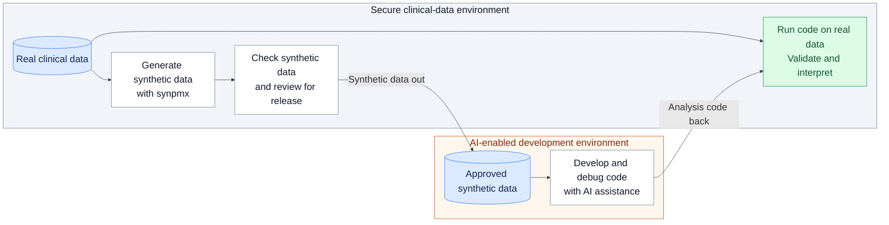

# Enabling AI-Assisted Pharmacometric Workflows Using Synthetic Data

Andrew Stein, Alex Pogodaev

## Poster Layout

Three columns: workflow and available methods on the left; the fitted-model
generator in the centre; the worked example and evaluation on the right.
Give the example the most space. Target approximately 650–800 words of visible
copy, including tables and captions. Figure instructions and the preparation
notes below are working material, not poster copy.

## Objective

`synpmx` is an R package for generating synthetic pharmacometric event tables
to support artificial intelligence (AI)-assisted code development when clinical
data must remain in a secure computing environment. Synthetic data provides
the columns, dosing records and observations needed to develop exploration,
model-fitting and diagnostic code. Scientific estimation and interpretation
use the real data inside the secure environment.

## Workflow



**Figure 1.** Approved synthetic data supports AI-assisted code development
outside the secure environment. Analysis code returns for execution and
validation on the real clinical data, which remains inside.

1. **Secure environment:** Declare column roles with `pmx_roles()`, generate a
   synthetic dataset, and compare its structure and distributions with the source.
2. **Release review:** Assess the synthetic dataset and attached information
   under the organization's requirements before transfer.
3. **AI-enabled environment:** Develop and debug analysis code using the
   approved synthetic dataset.
4. **Secure environment:** Run the returned code on real data, validate the
   analysis and interpret the results.

The preferred synthetic data generator has no formal privacy guarantee.

## Selected methods available in `synpmx`

| Function | Generation approach | Required specification  | Formal privacy | Source patients | Reportable fingerprint |
|---|---|---|---|---|---|
| `synpmx_prior()` | Simulate a public model and trial design |      Public model,       Study design | Yes  | 0 | Yes |
|  |
| `synpmx_model()` | Fit longitudinal PK and PD models; simulate new subjects    | Nominal times;    | No | 10s | Yes |
| `synpmx_avatar()` | blending of similar patient profiles | Nominal times        | No | 10s–100s | No |
|  |

Additional methods available, including some with formal differential privacy guarantees.

## Preferred generation algorithm `synpmx_model()`

**Figure 2: Overview of `synpmx_model`

| Component | What the generator does |
|---|---|
|
Privacy Protection  | Regenerate new IDs; Drop all column without defined roles; Drop cohorts with fewer than 3 patients; Drop categorical covariates that fewer than 3 patients take |
Dosing | For each cohort, fit hazard model for missed dosing, reduced dosing, and discontinuation.  Covariate-based dosing (e.g. weight) can be specified.
| Observations | Estimates missed visits rates by endpoint and nominal visit time and simulate this missingness.  |
| Population PK | Fits a one-compartment model using `nlmixr2`.  Simulate PK from this model.  Alternative model candidates can be specified. |
| PD | Fits constant, linear or exponential time courses to continuous endpoints, with subject variability and residual error. The default pools arms.  If capturing dose-response is desired, `pd_by_arm = TRUE` allows arm-specific curves. Discrete endpoints are sampled from distribution of all values taken        |
| LOQ | Uses or estimates LOQ for all continuous observations |

## Worked Example: `xgxr::mad`

The publicly available multiple-ascending-dose example in `xgxr` combines a PK
concentration with continuous, ordinal, count and binary PD endpoints.


**Figure 3a. Pharmacokinetic (PK) profiles over the first dosing interval.**
Source and synthetic subjects share axes and treatment-arm columns. The stored
fit underrepresents the sharp early concentration peak. Placebo panels are
empty because this example has no placebo concentration observations.


**Figure 3b. Continuous pharmacodynamic (PD) profiles over study time.**
The pooled PD fit produces rising responses but does not reproduce the source's
differences between treatment arms; synthetic trajectories also show more
visit-to-visit scatter.


**Figure 3c. Pooled distributions.** Continuous PD, PK and baseline weight
have overlapping distributions, with differences in shape and spread.
Curves are scaled to a peak height of one. Pooling across arms and visits
does not establish agreement in the time courses above.

`synpmx` includes a scorecard that checks dataset structure, distribution
changes and potential patient copying, helping identify synthetic outputs
that need review. [Scorecard documentation](https://iamstein.github.io/synpmx/articles/avatar-scorecard.html).

**Code compatibility:** The figure script applies the same plotting helper to
the synthetic and public source tables without modification. A full
AI-assisted analysis-development and code-transfer demonstration remains to
be performed.

## Evaluation across study designs

Publicly available examples span controlled dosing, routine care and simulated
studies. Findings below refer to the stored-fit configurations used in the
[model evaluation article](https://iamstein.github.io/synpmx/articles/pmxmodel-public-data-examples.html).

| Dataset | Patients | Design feature | Main finding |
|---|---:|---|---|
| `case1_pkpd` | 180 | Multiple arms; censored concentrations | Censoring represented; pooled PD loses arm differences. |
| `mad` | 60 | Multiple doses; mixed endpoint types | Endpoint types retained; early PK peak underrepresented. |
| `warfarin` | 32 | Single oral dose; delayed response | PD decline represented; recovery absent. |
| `wbcSim` | 45 | Infusions; white-cell nadir and recovery | Response fitted as PK; nadir and recovery missed. |
| `mavoglurant` | 120 | Repeated occasions; resetting clock | Second occasions lost; fewer observations generated. |
| `theo_md` | 12 | Repeated oral doses; small cohort | Repeated dosing retained; fit rests on a small cohort. |
| `nimoData` | 12 | Weekly infusions; small cohort | Infusion schedule retained; concentration spread inflated. |
| `pheno_sd` | 59 | Neonatal care; sparse, irregular sampling | Nominal grid required; fewer doses generated. |
| `mixroute_sim` | 90 | Intravenous and subcutaneous dosing | Both routes retained; bioavailability close to simulation truth. |
| `onc_sim` | 200 | Trough sampling; tumour response; dose changes | Pooled tumour curve loses arm differences; fewer doses generated. |

Patient counts refer to source subjects, including simulated subjects.
Generation and comparison were rerun for this table; population models were
not refitted.

## Availability

R package prototype, source code, worked examples and evaluation methods:
[iamstein.github.io/synpmx](https://iamstein.github.io/synpmx/).

**Footer:** Add a scannable link to the package website and the approved
poster materials. Internal discussions on use are ongoing.

---

## Preparation Notes — Not Poster Copy

### Workflow Figure Typography

Use 24–28 pt labels at the final printed poster size, including arrow labels,
with larger environment headings. Keep labels short and enlarge the diagram's
allocated space if needed; do not shrink the lettering to fit the column.
The Mermaid preview uses a 24 px base font; check the physical text size again
after placing the figure on the poster.

### Example Generation and Verification

Run [2026-acop-poster-figures.R](2026-acop-poster-figures.R) from the
repository root:

```sh
Rscript communications/2026-acop-poster-figures.R
```

The script loads the working-tree package, reads public `xgxr::mad` data and
its stored fit, and generates synthetic subjects with seed 909. It does not
refit the population model. Required R packages are `devtools`, `xgxr`,
`ggplot2`, `patchwork`, and the package's own dependencies.

Figures are saved beside the script in `2026-acop-poster-figures/` as PNG
previews and vector PDF files. Each main figure is 18 inches wide, with large
labels for poster placement. Use the PDF for scaling; check label sizes if
reducing its width.

- [PK profiles, PDF](2026-acop-poster-figures/mad-pk-profiles.pdf)
- [Continuous PD profiles, PDF](2026-acop-poster-figures/mad-pd-profiles.pdf)
- [Compact distributions, PDF](2026-acop-poster-figures/mad-distributions.pdf)
- [All endpoint and covariate distributions, PDF](2026-acop-poster-figures/mad-distributions-full.pdf)
  — supporting figure, outside the main poster.

The same directory holds aggregate distribution tables, the scorecard and
`run-info.txt` with the seed, fit and source-code checksums, and R session
information. Scorecard output stays in the supporting evaluation.
An optional output directory and seed can be passed as the first and second
arguments. Inputs are fixed to the public example; this script accepts no
internal-study data.

### Evaluation Table Generation

Run [2026-acop-poster-evaluation.R](2026-acop-poster-evaluation.R) to regenerate
the public-data table:

```sh
Rscript communications/2026-acop-poster-evaluation.R
```

The script uses the evaluation article's dataset preparation, roles, stored
fits and generation seeds. It saves a Markdown table and aggregate CSV,
supporting scorecards and run provenance in `2026-acop-poster-evaluation/`.
Patient counts are computed; the short findings are editorial summaries that
must be reviewed when the fits or generator change.

Add internal-study rows using the same four columns: **Dataset**, **Patients**,
**Design feature**, **Main finding**. Describe the design briefly and give one
observed result or limitation. The script regenerates only the public table
and does not overwrite the outline or any internal rows added to it.

### Feature Claims

| Topic from the initial outline | Wording supported by the implementation |
|---|---|
| Below the limit of quantification (BLOQ) | Declared PK censoring is passed to the fitting likelihood; output censoring is applied after simulation. Do not promise identical censored fractions by arm. |
| Weight-based dosing | Do not claim automatic preservation of each subject's dose–weight relationship. The model generator draws arm-level schedules independently of generated covariates. Optional allometric effects on PK parameters are a separate feature and default to off. |
| Event handling | Describe declared event-table fields and supported routes concretely. Regression coverage includes routes and dosing histories; avoid an unrestricted claim that every input event convention survives. |
| Extreme outliers | Do not advertise general outlier removal for this generator. It filters sparsely supported arms/visits and applies measurement boundaries; that is not a general filter on extreme times, doses and observations. |
| Multiple drugs and routes | Endpoint-specific models and dosing assignments exist. State which configuration is demonstrated in the evaluation, rather than implying a joint parent–metabolite or interacting-drug model. |
| Internal datasets | The original outline reports three complex internal studies. Their outcomes were not verified here. Keep source-derived plots and tables out of public poster materials. |

### Package Sources for Figures and Technical Review

- [Model algorithm](../vignettes/pmxmodel-algorithm.Rmd): model choices,
  declarations, dosing and attendance, and limitations.
- [Estimation implementation](../R/model-estimate.R),
  [generation implementation](../R/model-generate.R) and
  [dose/visit implementation](../R/dose-visit-models.R): checked for the
  behavioural descriptions above.
- [Public-data evaluation](../vignettes/articles/pmxmodel-public-data-examples.Rmd):
  source preparation, stored fits and cross-dataset reporting. Recompute its
  results rather than copying numerical claims from its prose.
- [Scorecard implementation](../R/scorecard.R): checks and verdict meanings.
- [Model-generation regression tests](../tests/testthat/test-model-generate.R):
  focused generation checks; their existence is not a fresh test-suite result.

Before producing the poster, run the example and selected evaluation rows with
the same package revision and seeds, then write captions from those outputs.
Retain full tables and the method comparison online. Clear the public artifact
through the organization's internal review before submission.
