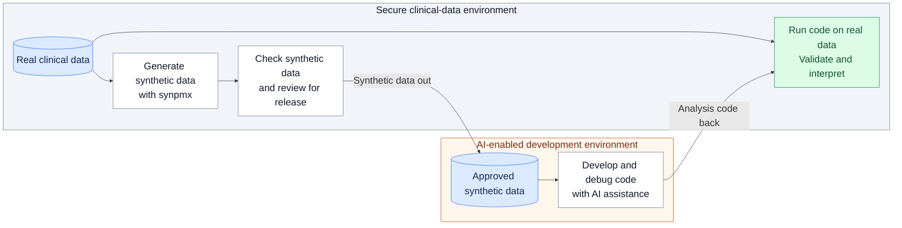
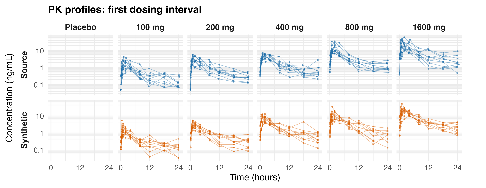
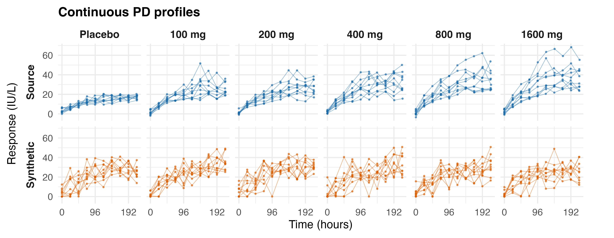
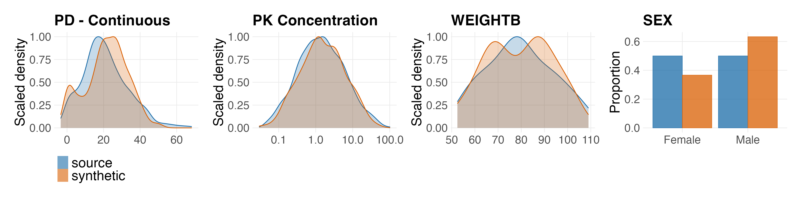

# Enabling AI-Assisted Pharmacometric Workflows Using Synthetic Data

Andrew Stein, Alex Pogodaev

## Objective

`synpmx` is an R package for generating synthetic pharmacometric datasets
to support AI-assisted code development when clinical
data must remain in a secure computing environment that does not allow modern agentic AI coding tools. Synthetic data provides
the columns, dosing records and observations needed to develop exploration,
model-fitting and diagnostic code. Scientific estimation and interpretation
use the real data inside the secure environment.

## Workflow



**Figure 1.** Workflow

1. **Within secure environment:** Declare column roles with `pmx_roles()`, generate a synthetic dataset, and compare its structure and distributions with the source.
2. **Review synthetic data:** Assess the synthetic dataset and attached information
   under the organization's requirements before transfer.
3. **Develop code in AI-enabled environment:** Develop and debug analysis code using the approved synthetic dataset.
4. **Return code to secure environment:** Run the code on real data, validate the analysis and interpret the results.

## Selected methods available in `synpmx`

| Function | Generation approach | Required specification | Formal privacy | Reportable fingerprint |
|---|---|---|---|---|
| `synpmx_prior()` | Simulate a public model and trial design | Public model; study design | Yes—uses no private data | Yes |
| `synpmx_model()` | Fit longitudinal PK and PD models; simulate new subjects | Column roles; nominal times | No | Yes |
| `synpmx_avatar()` | Blend similar patient profiles; AVATAR-inspired [1] | Column roles; nominal times recommended | No | No |

"Reportable fingerprint" means a compact model-and-parameter representation
from which synthetic data can be generated without retaining source patient
profiles.

Deep learning methods such as conditional and time-series generative adversarial
networks (cGANs and TimeGAN) [2] are outside our scope because their learned
weights do not provide a compact, interpretable fingerprint of how the synthetic
patient records were generated.

Additional methods provide formal differential privacy guarantees. In the
small-study settings evaluated, privacy noise substantially reduced fidelity
at the privacy budgets tested.

## Preferred generation algorithm `synpmx_model()`

**Figure 2:** Overview of `synpmx_model`

| Component | Description |
|---|---|
| Disclosure safeguards   | Generate new IDs; Drop all columns without defined roles; Drop arms with fewer than 3 patients; Exclude categorical covariate levels held by fewer than 3 patients and sample from the remaining levels (configurable thresholds) |
| Dosing | Estimate constant per-cycle probabilities within each arm for skipped cycles, dose reductions and treatment discontinuation; simulate dosing schedules from these probabilities. |
| Observations | Estimate attendance probabilities within each arm, endpoint and nominal visit; simulate missed observations. |
| Population PK | Fit a two-compartment model using `nlmixr2` first; fall back to a one-compartment model if the fit fails convergence or generation checks. An optimizer-stall warning alone does not reject a usable fit. Simulate PK from the accepted model. Users can specify a model instead. |
| PD | Fit constant, linear or exponential time courses with subject variability and residual error. Pool arms by default; use `pd_by_arm = TRUE` to represent differences between arms. Sample discrete endpoints within each arm and nominal visit. |
| LOQ | Apply declared censoring limits. Otherwise, for predominantly positive continuous endpoints, use half the smallest positive observation as a heuristic lower bound. |

## Worked example

The publicly available multiple-ascending-dose example from `xgxr::mad` combines a PK concentration with continuous, ordinal, count and binary PD endpoints.  Continuous PK and PD are shown below.



**Figure 3a. PK profiles over the first dosing interval.**
The two-compartment model passes the fitting and generation checks here, so no
one-compartment fallback is needed. Source and synthetic profiles show the peak
and biphasic decline.



**Figure 3b. Continuous PD profiles over study time.**
Pooling arms removes the source’s between-arm response differences.
`pd_by_arm = TRUE` fits separate time courses by arm.



**Figure 3c. Pooled distributions.** Similar pooled distributions can conceal
the profile differences shown above. Each density curve is scaled to peak at
one; sex is shown as proportions. `synpmx` also includes a scorecard that checks dataset structure, distribution
changes and potential patient copying, helping identify synthetic outputs
that need review. [Scorecard documentation](https://iamstein.github.io/synpmx/articles/avatar-scorecard.html).

## Datasets evaluated

Ten publicly available dataset examples span controlled dosing, routine care and simulated
studies. The datasets below are covered in the [model evaluation article](https://iamstein.github.io/synpmx/articles/pmxmodel-public-data-examples.html).  The synthetic data generation algorithms have also been evaluated against internal datasets.

| Dataset | Patients | Design feature |
|---|---:|---|
| `case1_pkpd` | 180  (simulated)  | Multiple arms; censored concentrations |
| `mad` | 60 (simulated) | Multiple doses; mixed endpoint types (continuous, categorical) |
| `warfarin` | 32 (actual) | Single oral dose; delayed response |
| `wbcSim` | 45 (simulated) | Infusions; white-cell nadir and recovery |
| `mavoglurant` | 120 (actual)| Repeated occasions; resetting clock |
| `theo_md` | 12 (actual + simulated)|  Repeated oral doses; small cohort |
| `nimoData` | 12 (actual) | Weekly infusions; small cohort |
| `pheno_sd` | 59 (actual) | Neonatal care; sparse, irregular sampling |
| `mixroute_sim` | 90 (simulated) | Intravenous and subcutaneous dosing |
| `onc_sim` | 200 (simulated) | Trough sampling; tumour response; dose changes |

## Availability

R package prototype, source code, worked examples and evaluation methods:
[iamstein.github.io/synpmx](https://iamstein.github.io/synpmx/).

Internal discussions on use of this package are ongoing.

The authors set the goal and vision for this package and directed the work. Almost all of the code was written by AI coding agents and has not yet been formally verified; establishing a validation process for the package is a next step.

## References

1. Destere A, Lombardi R, Labriffe M, et al. Can synthetic data overcome the
   privacy and fidelity bottleneck in Pharmacometrics? A comparative benchmark
   using a daptomycin population pharmacokinetic model. *medRxiv* [preprint].
   2026. [doi:10.64898/2026.05.30.26354512](https://www.medrxiv.org/content/10.64898/2026.05.30.26354512v1).
2. Jiang Y, García-Durán A, Bachali Losada I, Girard P, Terranova N. Generative
   models for synthetic data generation: application to
   pharmacokinetic/pharmacodynamic data. *J Pharmacokinet Pharmacodyn.*
   2024;51:877–885. [doi:10.1007/s10928-024-09935-6](https://doi.org/10.1007/s10928-024-09935-6).

---

## Preparation Notes — Not Poster Copy

### Poster Layout

Three columns: workflow and available methods on the left; the fitted-model
generator in the centre; the worked example and evaluation on the right.
Give the example the most space. Target approximately 650–800 words of visible copy, including tables and captions. Figure instructions and the preparation notes are working material, not poster copy.

### Workflow Figure Typography

Use 24–28 pt labels at the final printed poster size, including arrow labels,
with larger environment headings. Keep labels short and enlarge the diagram's
allocated space if needed; do not shrink the lettering to fit the column.
The Mermaid preview uses a 24 px base font; check the physical text size again
after placing the figure on the poster.

### Example Generation and Verification

Run [2026-acop-poster-figures.R](2026-acop-poster-figures.R) from the
repository root:

```sh
Rscript communications/2026-acop-poster-figures.R
```

The script loads the working-tree package, reads public `xgxr::mad` data and
its stored fit, and generates synthetic subjects with seed 909. It does not
refit the population model. Required R packages are `devtools`, `xgxr`,
`ggplot2`, `patchwork`, and the package's own dependencies.

Figures are saved beside the script in `2026-acop-poster-figures/` as PNG
previews and vector PDF files. Each main figure is 18 inches wide, with large
labels for poster placement. Use the PDF for scaling; check label sizes if
reducing its width.

- [PK profiles, PDF](2026-acop-poster-figures/mad-pk-profiles.pdf)
- [Continuous PD profiles, PDF](2026-acop-poster-figures/mad-pd-profiles.pdf)
- [Compact distributions, PDF](2026-acop-poster-figures/mad-distributions.pdf)
- [All endpoint and covariate distributions, PDF](2026-acop-poster-figures/mad-distributions-full.pdf)
  — supporting figure, outside the main poster.

The same directory holds aggregate distribution tables, the scorecard and
`run-info.txt` with the seed, fit and source-code checksums, and R session
information. Scorecard output stays in the supporting evaluation.
An optional output directory and seed can be passed as the first and second
arguments. Inputs are fixed to the public example; this script accepts no
internal-study data.

### Evaluation Table Generation

Run [2026-acop-poster-evaluation.R](2026-acop-poster-evaluation.R) to regenerate
the public-data table:
```sh
Rscript communications/2026-acop-poster-evaluation.R
```
The script uses the evaluation article's dataset preparation, roles, stored
fits and generation seeds. It saves a Markdown table and aggregate CSV,
supporting scorecards and run provenance in `2026-acop-poster-evaluation/`.
Patient counts are computed from the public source datasets.
